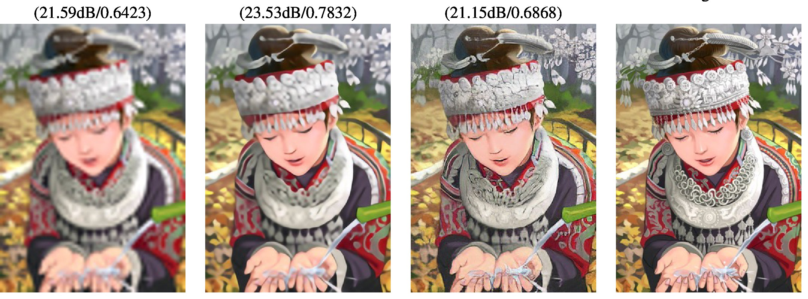
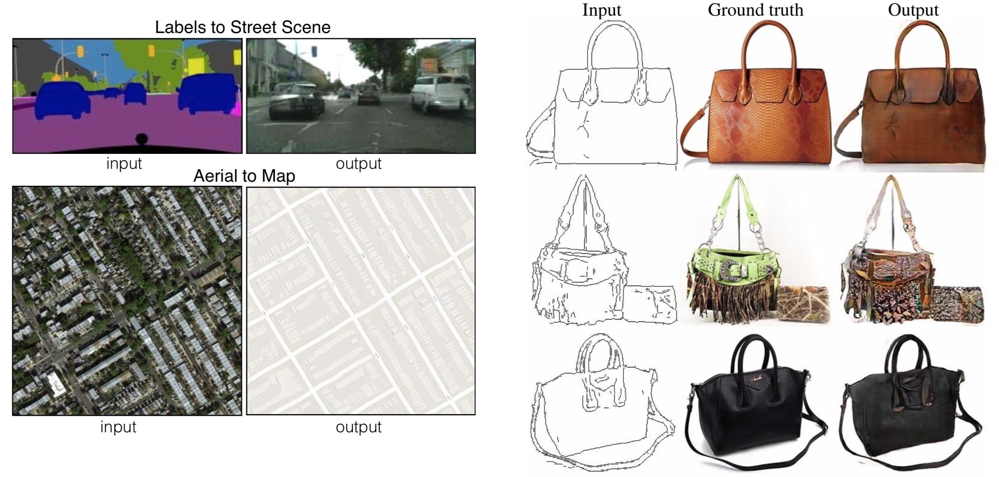
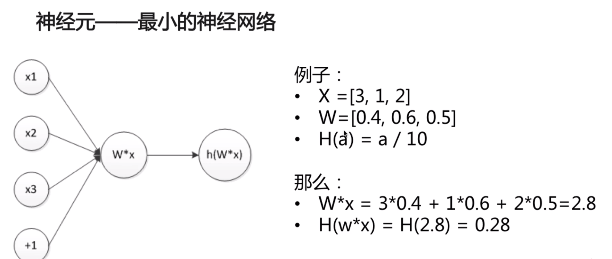

<!-- TOC -->

- [深度学习初识](#深度学习初识)
    - [一、入门基本概念](#一入门基本概念)
        - [机器学习简介](#机器学习简介)
            - [机器学习应用举例](#机器学习应用举例)
            - [机器学习应用流程](#机器学习应用流程)
            - [机器学习岗位职责](#机器学习岗位职责)
        - [深度学习简介](#深度学习简介)
            - [深度学习与机器学习关系](#深度学习与机器学习关系)
            - [深度学习算法集合](#深度学习算法集合)
            - [深度学习进展](#深度学习进展)
    - [二、神经网络](#二神经网络)
        - [人体神经元模型](#人体神经元模型)
        - [人工神经网络](#人工神经网络)
        - [1. 神经元](#1-神经元)
        - [2. 逻辑回归模型](#2-逻辑回归模型)
        - [目标函数](#目标函数)
        - [梯度下降](#梯度下降)
    - [三、Tensorflow基础](#三tensorflow基础)
        - [Tensorflow简介](#tensorflow简介)
        - [计算图模型](#计算图模型)
    - [TensorFlow 安装](#tensorflow-安装)
    - [参考资料](#参考资料)

<!-- /TOC -->

# 深度学习初识

## 一、入门基本概念

### 机器学习简介

**机器学习**：无序数据转化为价值的方法
**机器学习价值**：从数据中抽取规律，并预测未来


#### 机器学习应用举例

- 分类问题：图像识别、垃圾邮件识别
- 回归问题：股价预测、房价预测
- 排序问题：点击率预估、推荐
- 生成问题：图像生成、图像风格转换、图像文字描述生成


#### 机器学习应用流程


#### 机器学习岗位职责

- 数据处理（采集+去噪）
- 模型训练（特征+模型）
- 模型评估与优化（MSE、F1-score、AUC+调参）
- 模型应用（A/B测试）


### 深度学习简介


人工智能、机器学习、深度学习之间的关系

```
人工智能（AI）> 机器学习（Machine Learning）> 深度学习（Deep learning）
```


#### 深度学习与机器学习关系

- 机器学习是实现人工智能的方法
- 深度学习是实现机器学习算法的技术


#### 深度学习算法集合

- **卷积神经网络**(Convolutional Neural Network, CNN)
  - CV 领域使用较多
- **循环神经网络**(Recurrent Neural Networks，RNNs)
  - NLP 领域使用较多
  - 处理不定长数据
- 自动编码器
- 稀疏编码
- 深度信念网络
- 深度学习 + 强化学习 = **深度强化学习**
  - AlphaGo
  - AlphaZero


#### 深度学习进展

1. 图像分类

ImageNet: http://image-net.org/


2. 机器翻译


3. 图像生成






- [Implementing Neural Artistic Style Transfer | L2Program](http://l2program.co.uk/945/implementing-neural-artistic-style-transfer)

4. 字体生成

5. AlphaGo


## 二、神经网络

### 人体神经元模型

神经网络模型是模仿人类的大脑神经构造而构造的。先来看人体神经元模型。


神经元的可以分为四个区域：

- 接收区（receptive zone）：树突接收到输入信息。
- 触发区（trigger zone）：位于轴突和细胞体交接的地方，决定是否产生神经冲动。
- 传导区（conducting zone）：由轴突进行神经冲动的传递。
- 输出区（output zone）：神经冲动的目的就是要让神经末梢，突触的神经递质或电力释出，才能影响下一个接受的细胞（神经元、肌肉细胞或是腺体细胞），此称为突触传递。


### 人工神经网络

人工神经网络（ANN：Artificial Neural Network），简称神经网络（NN：Neural Network）。迄今为止，人工神经网络尚无统一定义， 其实一种模拟了人体神经元构成的数学模型，依靠系统的复杂程度，通过调整内部大量节点之间相互连接的关系，从而达到处理信息的目的。


上图显示了人工神经网络是一个分层模型，逻辑上可以分为三层：

- 输入层：输入层接收特征向量 x 。
- 输出层：输出层产出最终的预测 h 。
- 隐含层：隐含层介于输入层与输出层之间，之所以称之为隐含层，是因为当中产生的值并不像输入层使用的样本矩阵 X 或者输出层用到的标签矩阵 y 那样直接可见。


### 1. 神经元





### 2. 逻辑回归模型

```
神经元 -> 激活函数sigmoid -> 二元类逻辑斯蒂回归模型
```


神经元 -> 多输出

- W从向量扩展为矩阵
- 输出W*x则变成向量


多输出神经元 -> softmax -> 多分类逻辑斯蒂回归模型


### 目标函数

也称为损失函数，衡量对数据的拟合程度


### 梯度下降

- 下山算法
  - 找方向
  - 走一步

- 梯度下降算法


## 三、Tensorflow基础

### Tensorflow简介

Google Brain 第二代机器学习框架


### 计算图模型

- 命令式变成
- 声明式变成


## TensorFlow 安装

- [TensorFlow 官方文档](https://tensorflow.google.cn/)

- [TensorFlow 安装方法](https://tensorflow.google.cn/install)


1. 基于 VirtualEnv 的安装
2. 原生 pip
3. Docker
4. 从源代码安装


## 参考资料

- [机器学习入门(五) -- 神经网络](https://waltyou.github.io/Neural-Network/#%E7%A5%9E%E7%BB%8F%E7%BD%91%E7%BB%9C%E5%AE%9A%E4%B9%89)

- [深度学习-初识 - Corwien - SegmentFault 思否](https://segmentfault.com/a/1190000016068053)