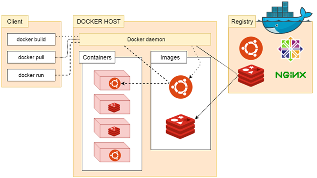

<!-- TOC -->

- [前言](#前言)
- [1. Docker 简介](#1-docker-简介)
    - [1.1 什么是 Docker](#11-什么是-docker)
    - [1.2 为什么要使用 Docker](#12-为什么要使用-docker)
- [2. Docker 基本概念](#2-docker-基本概念)
    - [2.1 Docker 引擎](#21-docker-引擎)
    - [2.2 Docker 架构](#22-docker-架构)
    - [2.3 Docker 镜像](#23-docker-镜像)
    - [2.4 Docker 容器](#24-docker-容器)
    - [2.5 Docker 仓库](#25-docker-仓库)
- [3. 安装 Docker](#3-安装-docker)
    - [3.1 Ubuntu 安装 Docker](#31-ubuntu-安装-docker)
        - [准备工作](#准备工作)
            - [系统要求](#系统要求)
            - [卸载旧版本](#卸载旧版本)
            - [Ubuntu 14.04 可选内核模块](#ubuntu-1404-可选内核模块)
            - [Ubuntu 16.04 +](#ubuntu-1604-)
        - [使用 APT 安装](#使用-apt-安装)
            - [安装必要的一些系统工具](#安装必要的一些系统工具)
            - [安装 GPG 证书](#安装-gpg-证书)
            - [写入软件源信息](#写入软件源信息)
            - [更新并安装 Docker CE](#更新并安装-docker-ce)
        - [使用脚本自动安装](#使用脚本自动安装)
            - [特别说明](#特别说明)
        - [启动 Docker CE](#启动-docker-ce)
        - [建立 docker 用户组](#建立-docker-用户组)
        - [测试 Docker 是否安装正确](#测试-docker-是否安装正确)
        - [镜像加速](#镜像加速)
        - [参考文档](#参考文档)
    - [3.2 CentOS 安装 Docker](#32-centos-安装-docker)
        - [准备工作](#准备工作-1)
            - [系统要求](#系统要求-1)
            - [卸载旧版本](#卸载旧版本-1)
        - [使用 yum 安装](#使用-yum-安装)
            - [安装 Docker CE](#安装-docker-ce)
        - [使用脚本自动安装](#使用脚本自动安装-1)
        - [启动 Docker CE](#启动-docker-ce-1)
        - [建立 docker 用户组](#建立-docker-用户组-1)
        - [测试 Docker 是否安装正确](#测试-docker-是否安装正确-1)
        - [镜像加速](#镜像加速-1)
        - [添加内核参数](#添加内核参数)
        - [参考文档](#参考文档-1)
    - [3.3 树莓派卡片电脑安装 Docker](#33-树莓派卡片电脑安装-docker)
        - [系统要求](#系统要求-2)
        - [使用 APT 安装](#使用-apt-安装-1)
            - [安装 Docker CE](#安装-docker-ce-1)
        - [使用脚本自动安装](#使用脚本自动安装-2)
        - [启动 Docker CE](#启动-docker-ce-2)
        - [建立 docker 用户组](#建立-docker-用户组-2)
        - [测试 Docker 是否安装正确](#测试-docker-是否安装正确-2)
        - [镜像加速](#镜像加速-2)
    - [3.4 macOS 安装 Docker](#34-macos-安装-docker)
        - [系统要求](#系统要求-3)
        - [安装](#安装)
            - [使用 Homebrew 安装](#使用-homebrew-安装)
            - [手动下载安装](#手动下载安装)
        - [运行](#运行)
        - [镜像加速](#镜像加速-3)
    - [3.5 Windows 安装 Docker](#35-windows-安装-docker)
        - [系统要求](#系统要求-4)
        - [安装](#安装-1)
        - [运行](#运行-1)
        - [镜像加速](#镜像加速-4)
    - [3.6 Docker 镜像加速器](#36-docker-镜像加速器)
        - [Ubuntu 14.04、Debian 7 Wheezy](#ubuntu-1404debian-7-wheezy)
        - [Ubuntu 16.04+、Debian 8+、CentOS 7](#ubuntu-1604debian-8centos-7)
        - [Windows 10](#windows-10)
        - [macOS](#macos)
        - [检查加速器是否生效](#检查加速器是否生效)

<!-- /TOC -->
# 前言

Docker 容器化引擎，更详细请转向：[Docker_Tutorial: Docker 容器化引擎入门手册](https://github.com/frank-lam/Docker_Tutorial)

> 参考资料：
>
> - http://www.funtl.com/
> - [Docker —— 从入门到实践](https://yeasy.gitbooks.io/docker_practice/content/)
>
> 基于以上部分内容做一定的修改

# 1. Docker 简介

## 1.1 什么是 Docker

Docker 最初是 dotCloud 公司创始人 Solomon Hykes 在法国期间发起的一个公司内部项目，它是基于 dotCloud 公司多年云服务技术的一次革新，并于 [2013 年 3 月以 Apache 2.0 授权协议开源](https://en.wikipedia.org/wiki/Docker_(software))，主要项目代码在 [GitHub](https://github.com/moby/moby) 上进行维护。Docker 项目后来还加入了 Linux 基金会，并成立推动 [开放容器联盟（OCI）](https://www.opencontainers.org/)。

Docker 自开源后受到广泛的关注和讨论，至今其 GitHub 项目已经超过 4 万 6 千个星标和一万多个 fork。甚至由于 Docker 项目的火爆，在 2013 年底，[dotCloud 公司决定改名为 Docker](https://blog.docker.com/2013/10/dotcloud-is-becoming-docker-inc/)。Docker 最初是在 Ubuntu 12.04 上开发实现的；Red Hat 则从 RHEL 6.5 开始对 Docker 进行支持；Google 也在其 PaaS 产品中广泛应用 Docker。

Docker 使用 Google 公司推出的 [Go 语言](https://golang.org/) 进行开发实现，基于 Linux 内核的 [cgroup](https://zh.wikipedia.org/wiki/Cgroups)，[namespace](https://en.wikipedia.org/wiki/Linux_namespaces)，以及 [AUFS](https://en.wikipedia.org/wiki/Aufs) 类的 [Union FS](https://en.wikipedia.org/wiki/Union_mount) 等技术，对进程进行封装隔离，属于 [操作系统层面的虚拟化技术](https://en.wikipedia.org/wiki/Operating-system-level_virtualization)。由于隔离的进程独立于宿主和其它的隔离的进程，因此也称其为容器。最初实现是基于 [LXC](https://linuxcontainers.org/lxc/introduction/)，从 0.7 版本以后开始去除 LXC，转而使用自行开发的 [libcontainer](https://github.com/docker/libcontainer)，从 1.11 开始，则进一步演进为使用 [runC](https://github.com/opencontainers/runc) 和 [containerd](https://github.com/containerd/containerd)。

Docker 在容器的基础上，进行了进一步的封装，从文件系统、网络互联到进程隔离等等，极大的简化了容器的创建和维护。使得 Docker 技术比虚拟机技术更为轻便、快捷。

下面的图片比较了 Docker 和传统虚拟化方式的不同之处。传统虚拟机技术是虚拟出一套硬件后，在其上运行一个完整操作系统，在该系统上再运行所需应用进程；而容器内的应用进程直接运行于宿主的内核，容器内没有自己的内核，而且也没有进行硬件虚拟。因此容器要比传统虚拟机更为轻便。


## 1.2 为什么要使用 Docker

作为一种新兴的虚拟化方式，Docker 跟传统的虚拟化方式相比具有众多的优势。

**更高效的利用系统资源**

由于容器不需要进行硬件虚拟以及运行完整操作系统等额外开销，Docker 对系统资源的利用率更高。无论是应用执行速度、内存损耗或者文件存储速度，都要比传统虚拟机技术更高效。因此，相比虚拟机技术，一个相同配置的主机，往往可以运行更多数量的应用。

**更快速的启动时间**

传统的虚拟机技术启动应用服务往往需要数分钟，而 Docker 容器应用，由于直接运行于宿主内核，无需启动完整的操作系统，因此可以做到秒级、甚至毫秒级的启动时间。大大的节约了开发、测试、部署的时间。

**一致的运行环境**

开发过程中一个常见的问题是环境一致性问题。由于开发环境、测试环境、生产环境不一致，导致有些 bug 并未在开发过程中被发现。而 Docker 的镜像提供了除内核外完整的运行时环境，确保了应用运行环境一致性，从而不会再出现 *「这段代码在我机器上没问题啊」* 这类问题。

**持续交付和部署**

对开发和运维（[DevOps](https://zh.wikipedia.org/wiki/DevOps)）人员来说，最希望的就是一次创建或配置，可以在任意地方正常运行。

使用 Docker 可以通过定制应用镜像来实现持续集成、持续交付、部署。开发人员可以通过 `Dockerfile` 来进行镜像构建，并结合 [持续集成(Continuous Integration)](https://en.wikipedia.org/wiki/Continuous_integration) 系统进行集成测试，而运维人员则可以直接在生产环境中快速部署该镜像，甚至结合 [持续部署(Continuous Delivery/Deployment)](https://en.wikipedia.org/wiki/Continuous_delivery) 系统进行自动部署。

而且使用 `Dockerfile` 使镜像构建透明化，不仅仅开发团队可以理解应用运行环境，也方便运维团队理解应用运行所需条件，帮助更好的生产环境中部署该镜像。

**更轻松的迁移**

由于 Docker 确保了执行环境的一致性，使得应用的迁移更加容易。Docker 可以在很多平台上运行，无论是物理机、虚拟机、公有云、私有云，甚至是笔记本，其运行结果是一致的。因此用户可以很轻易的将在一个平台上运行的应用，迁移到另一个平台上，而不用担心运行环境的变化导致应用无法正常运行的情况。

**更轻松的维护和扩展**

Docker 使用的分层存储以及镜像的技术，使得应用重复部分的复用更为容易，也使得应用的维护更新更加简单，基于基础镜像进一步扩展镜像也变得非常简单。此外，Docker 团队同各个开源项目团队一起维护了一大批高质量的 [官方镜像](https://store.docker.com/search?q=&source=verified&type=image)，既可以直接在生产环境使用，又可以作为基础进一步定制，大大的降低了应用服务的镜像制作成本。

**对比传统虚拟机总结**

| 特性       | 容器               | 虚拟机      |
| ---------- | ------------------ | ----------- |
| 启动       | 秒级               | 分钟级      |
| 硬盘使用   | 一般为 `MB`        | 一般为 `GB` |
| 性能       | 接近原生           | 弱于        |
| 系统支持量 | 单机支持上千个容器 | 一般几十个  |

# 2. Docker 基本概念

Docker 包括三个基本概念

- 镜像（`Image`）
- 容器（`Container`）
- 仓库（`Repository`）

理解了这三个概念，就理解了 Docker 的整个生命周期。

## 2.1 Docker 引擎

Docker 引擎是一个包含以下主要组件的客户端服务器应用程序。

- 一种服务器，它是一种称为守护进程并且长时间运行的程序。
- REST API 用于指定程序可以用来与守护进程通信的接口，并指示它做什么。
- 一个有命令行界面 (CLI) 工具的客户端。

Docker 引擎组件的流程如下图所示：


## 2.2 Docker 架构

Docker 使用客户端-服务器 (C/S) 架构模式，使用远程 API 来管理和创建 Docker 容器。

Docker 容器通过 Docker 镜像来创建。

**容器与镜像**的关系类似于**面向对象**编程中的**对象与类**。

| Docker | 面向对象 |
| ------ | -------- |
| 容器   | 对象     |
| 镜像   | 类       |



| 标题                | 说明                                                         |
| ------------------- | ------------------------------------------------------------ |
| **镜像**(Images)    | Docker 镜像是用于创建 Docker 容器的模板。                    |
| **容器**(Container) | 容器是独立运行的一个或一组应用。                             |
| **客户端**(Client)  | Docker 客户端通过命令行或者其他工具使用 Docker API (<https://docs.docker.com/reference/api/docker_remote_api>) 与 Docker 的守护进程通信。 |
| **主机**(Host)      | 一个物理或者虚拟的机器用于执行 Docker 守护进程和容器。       |
| **仓库**(Registry)  | Docker 仓库用来保存镜像，可以理解为代码控制中的代码仓库。Docker Hub([https://hub.docker.com](https://hub.docker.com/)) 提供了庞大的镜像集合供使用。 |
| **Docker Machine**  | Docker Machine是一个简化Docker安装的命令行工具，通过一个简单的命令行即可在相应的平台上安装Docker，比如VirtualBox、 Digital Ocean、Microsoft Azure。 |

## 2.3 Docker 镜像

我们都知道，操作系统分为内核和用户空间。对于 Linux 而言，内核启动后，会挂载 `root` 文件系统为其提供用户空间支持。而 Docker 镜像（Image），就相当于是一个 `root` 文件系统。比如官方镜像 `ubuntu:16.04` 就包含了完整的一套 Ubuntu 16.04 最小系统的 `root` 文件系统。

Docker 镜像是一个特殊的文件系统，除了提供容器运行时所需的程序、库、资源、配置等文件外，还包含了一些为运行时准备的一些配置参数（如匿名卷、环境变量、用户等）。镜像不包含任何动态数据，其内容在构建之后也不会被改变。

**分层存储**

因为镜像包含操作系统完整的 `root` 文件系统，其体积往往是庞大的，因此在 Docker 设计时，就充分利用 [Union FS](https://en.wikipedia.org/wiki/Union_mount) 的技术，将其设计为分层存储的架构。所以严格来说，镜像并非是像一个 ISO 那样的打包文件，镜像只是一个虚拟的概念，其实际体现并非由一个文件组成，而是由一组文件系统组成，或者说，由多层文件系统联合组成。

镜像构建时，会一层层构建，前一层是后一层的基础。每一层构建完就不会再发生改变，后一层上的任何改变只发生在自己这一层。比如，删除前一层文件的操作，实际不是真的删除前一层的文件，而是仅在当前层标记为该文件已删除。在最终容器运行的时候，虽然不会看到这个文件，但是实际上该文件会一直跟随镜像。因此，在构建镜像的时候，需要额外小心，每一层尽量只包含该层需要添加的东西，任何额外的东西应该在该层构建结束前清理掉。

分层存储的特征还使得镜像的复用、定制变的更为容易。甚至可以用之前构建好的镜像作为基础层，然后进一步添加新的层，以定制自己所需的内容，构建新的镜像。

关于镜像构建，将会在后续相关章节中做进一步的讲解。

## 2.4 Docker 容器

镜像（`Image`）和容器（`Container`）的关系，就像是面向对象程序设计中的 `类` 和 `实例` 一样，镜像是静态的定义，容器是镜像运行时的实体。容器可以被创建、启动、停止、删除、暂停等。

容器的实质是进程，但与直接在宿主执行的进程不同，容器进程运行于属于自己的独立的 [命名空间](https://en.wikipedia.org/wiki/Linux_namespaces)。因此容器可以拥有自己的 `root` 文件系统、自己的网络配置、自己的进程空间，甚至自己的用户 ID 空间。容器内的进程是运行在一个隔离的环境里，使用起来，就好像是在一个独立于宿主的系统下操作一样。这种特性使得容器封装的应用比直接在宿主运行更加安全。也因为这种隔离的特性，很多人初学 Docker 时常常会混淆容器和虚拟机。

前面讲过镜像使用的是分层存储，容器也是如此。每一个容器运行时，是以镜像为基础层，在其上创建一个当前容器的存储层，我们可以称这个为容器运行时读写而准备的存储层为**容器存储层**。

容器存储层的生存周期和容器一样，容器消亡时，容器存储层也随之消亡。因此，任何保存于容器存储层的信息都会随容器删除而丢失。

按照 Docker 最佳实践的要求，容器不应该向其存储层内写入任何数据，容器存储层要保持无状态化。所有的文件写入操作，都应该使用 `数据卷（Volume）`、或者绑定宿主目录，在这些位置的读写会跳过容器存储层，直接对宿主（或网络存储）发生读写，其性能和稳定性更高。

数据卷的生存周期独立于容器，容器消亡，数据卷不会消亡。因此，使用数据卷后，容器删除或者重新运行之后，数据却不会丢失。

## 2.5 Docker 仓库

镜像构建完成后，可以很容易的在当前宿主机上运行，但是，如果需要在其它服务器上使用这个镜像，我们就需要一个集中的存储、分发镜像的服务，`Docker Registry` 就是这样的服务。

一个 **Docker Registry** 中可以包含多个**仓库**（`Repository`）；每个仓库可以包含多个**标签**（`Tag`）；每个标签对应一个镜像。

通常，一个仓库会包含同一个软件不同版本的镜像，而标签就常用于对应该软件的各个版本。我们可以通过 `<仓库名>:<标签>` 的格式来指定具体是这个软件哪个版本的镜像。如果不给出标签，将以 `latest` 作为默认标签。

以 [Ubuntu 镜像](https://store.docker.com/images/ubuntu) 为例，`ubuntu` 是仓库的名字，其内包含有不同的版本标签，如，`14.04`, `16.04`。我们可以通过 `ubuntu:14.04`，或者 `ubuntu:16.04` 来具体指定所需哪个版本的镜像。如果忽略了标签，比如 `ubuntu`，那将视为 `ubuntu:latest`。

仓库名经常以 *两段式路径* 形式出现，比如 `jwilder/nginx-proxy`，前者往往意味着 Docker Registry 多用户环境下的用户名，后者则往往是对应的软件名。但这并非绝对，取决于所使用的具体 Docker Registry 的软件或服务。

**公有 Docker Registry**

Docker Registry 公开服务是开放给用户使用、允许用户管理镜像的 Registry 服务。一般这类公开服务允许用户免费上传、下载公开的镜像，并可能提供收费服务供用户管理私有镜像。

最常使用的 Registry 公开服务是官方的 [Docker Hub](https://hub.docker.com/)，这也是默认的 Registry，并拥有大量的高质量的官方镜像。除此以外，还有 [CoreOS](https://coreos.com/) 的 [Quay.io](https://quay.io/repository/)，CoreOS 相关的镜像存储在这里；Google 的 [Google Container Registry](https://cloud.google.com/container-registry/)，[Kubernetes](http://kubernetes.io/) 的镜像使用的就是这个服务。

由于某些原因，在国内访问这些服务可能会比较慢。国内的一些云服务商提供了针对 Docker Hub 的镜像服务（`Registry Mirror`），这些镜像服务被称为**加速器**。常见的有 [阿里云加速器](https://cr.console.aliyun.com/#/accelerator)、[DaoCloud 加速器](https://www.daocloud.io/mirror#accelerator-doc) 等。使用加速器会直接从国内的地址下载 Docker Hub 的镜像，比直接从 Docker Hub 下载速度会提高很多。

国内也有一些云服务商提供类似于 Docker Hub 的公开服务。比如 [时速云镜像仓库](https://hub.tenxcloud.com/)、[网易云镜像服务](https://c.163.com/hub#/m/library/)、[DaoCloud 镜像市场](https://hub.daocloud.io/)、[阿里云镜像库](https://cr.console.aliyun.com/) 等。

**私有 Docker Registry**

除了使用公开服务外，用户还可以在本地搭建私有 Docker Registry。Docker 官方提供了 [Docker Registry](https://store.docker.com/images/registry/) 镜像，可以直接使用做为私有 Registry 服务。

开源的 Docker Registry 镜像只提供了 [Docker Registry API](https://docs.docker.com/registry/spec/api/) 的服务端实现，足以支持 `docker` 命令，不影响使用。但不包含图形界面，以及镜像维护、用户管理、访问控制等高级功能。在官方的商业化版本 [Docker Trusted Registry](https://docs.docker.com/datacenter/dtr/2.0/) 中，提供了这些高级功能。

除了官方的 Docker Registry 外，还有第三方软件实现了 Docker Registry API，甚至提供了用户界面以及一些高级功能。比如，[VMWare Harbor](https://github.com/vmware/harbor) 和 [Sonatype Nexus](https://www.sonatype.com/docker)。

# 3. 安装 Docker

Docker 在 1.13 版本之后，从 2017 年的 3 月 1 日开始，版本命名规则变为如下：

| 项目        | 说明         |
| ----------- | ------------ |
| 版本格式    | YY.MM        |
| Stable 版本 | 每个季度发行 |
| Edge 版本   | 每个月发行   |

同时 Docker 划分为 CE 和 EE。CE 即社区版（免费，支持周期三个月），EE 即企业版，强调安全，付费使用。

Docker CE 每月发布一个 Edge 版本 (17.03, 17.04, 17.05…)，每三个月发布一个 Stable 版本 (17.03, 17.06, 17.09…)，Docker EE 和 Stable 版本号保持一致，但每个版本提供一年维护。

官方网站上有各种环境下的 [安装指南](https://docs.docker.com/engine/installation/)，这里主要介绍 Docker CE 在 Linux 、Windows 10 (PC) 和 macOS 上的安装。

## 3.1 Ubuntu 安装 Docker

> 警告：切勿在没有配置 Docker APT 源的情况下直接使用 apt 命令安装 Docker.

### 准备工作

#### 系统要求

Docker CE 支持以下版本的 [Ubuntu](https://www.ubuntu.com/server) 操作系统：

- Artful 17.10 (Docker CE 17.11 Edge +)
- Xenial 16.04 (LTS)
- Trusty 14.04 (LTS)

Docker CE 可以安装在 64 位的 x86 平台或 ARM 平台上。Ubuntu 发行版中，LTS（Long-Term-Support）长期支持版本，会获得 5 年的升级维护支持，这样的版本会更稳定，因此在生产环境中推荐使用 LTS 版本,当前最新的 LTS 版本为 Ubuntu 16.04。

#### 卸载旧版本

旧版本的 Docker 称为 `docker` 或者 `docker-engine`，使用以下命令卸载旧版本：

```
$ sudo apt-get remove docker \
               docker-engine \
               docker.io
```

#### Ubuntu 14.04 可选内核模块

从 Ubuntu 14.04 开始，一部分内核模块移到了可选内核模块包 (`linux-image-extra-*`) ，以减少内核软件包的体积。正常安装的系统应该会包含可选内核模块包，而一些裁剪后的系统可能会将其精简掉。`AUFS` 内核驱动属于可选内核模块的一部分，作为推荐的 Docker 存储层驱动，一般建议安装可选内核模块包以使用 `AUFS`。

如果系统没有安装可选内核模块的话，可以执行下面的命令来安装可选内核模块包：

```
$ sudo apt-get update

$ sudo apt-get install \
    linux-image-extra-$(uname -r) \
    linux-image-extra-virtual
```

#### Ubuntu 16.04 +

Ubuntu 16.04 + 上的 Docker CE 默认使用 `overlay2` 存储层驱动,无需手动配置。

### 使用 APT 安装

#### 安装必要的一些系统工具

```
sudo apt-get update
sudo apt-get -y install apt-transport-https ca-certificates curl software-properties-common
```

#### 安装 GPG 证书

```
curl -fsSL http://mirrors.aliyun.com/docker-ce/linux/ubuntu/gpg | sudo apt-key add -
```

#### 写入软件源信息

```
sudo add-apt-repository "deb [arch=amd64] http://mirrors.aliyun.com/docker-ce/linux/ubuntu $(lsb_release -cs) stable"
```

#### 更新并安装 Docker CE

```
sudo apt-get -y update
sudo apt-get -y install docker-ce
```

> 以上命令会添加稳定版本的 Docker CE APT 镜像源，如果需要最新或者测试版本的 Docker CE 请将 stable 改为 edge 或者 test。从 Docker 17.06 开始，edge test 版本的 APT 镜像源也会包含稳定版本的 Docker。

### 使用脚本自动安装

在测试或开发环境中 Docker 官方为了简化安装流程，提供了一套便捷的安装脚本，Ubuntu 系统上可以使用这套脚本安装：

```
$ curl -fsSL get.docker.com -o get-docker.sh
# 可能会出现 404 错误，请移步下面的特别说明
$ sudo sh get-docker.sh --mirror Aliyun
```

执行这个命令后，脚本就会自动的将一切准备工作做好，并且把 Docker CE 的 Edge 版本安装在系统中。

#### 特别说明

2018 年 7 月 21 日，貌似阿里云这边在做调整，故导致 Docker 的 Aliyun 安装脚本不可用，是永久性还是临时性的尚不清除，如果你已经按照之前的操作安装 Docker，请按以下步骤进行修复并重新安装

- 如果已经使用了 Aliyun 脚本安装并成功的
  - 请先卸载 Docker，命令为：`apt-get autoremove docker-ce`
  - 删除 `/etc/apt/sources.list.d` 目录下的 `docker.list` 文件
- 使用 `AzureChinaCloud` 镜像脚本重新安装，命令为：`sudo sh get-docker.sh --mirror AzureChinaCloud`

### 启动 Docker CE

```
$ sudo systemctl enable docker
$ sudo systemctl start docker
```

Ubuntu 14.04 请使用以下命令启动：

```
$ sudo service docker start
```

### 建立 docker 用户组

默认情况下，`docker` 命令会使用 [Unix socket](https://en.wikipedia.org/wiki/Unix_domain_socket) 与 Docker 引擎通讯。而只有 `root` 用户和 `docker` 组的用户才可以访问 Docker 引擎的 Unix socket。出于安全考虑，一般 Linux 系统上不会直接使用 `root` 用户。因此，更好地做法是将需要使用 `docker` 的用户加入 `docker` 用户组。

建立 `docker` 组：

```
$ sudo groupadd docker
```

将当前用户加入 `docker` 组：

```
$ sudo usermod -aG docker $USER
```

退出当前终端并重新登录，进行如下测试。

### 测试 Docker 是否安装正确

```
$ docker run hello-world

Unable to find image 'hello-world:latest' locally
latest: Pulling from library/hello-world
ca4f61b1923c: Pull complete
Digest: sha256:be0cd392e45be79ffeffa6b05338b98ebb16c87b255f48e297ec7f98e123905c
Status: Downloaded newer image for hello-world:latest

Hello from Docker!
This message shows that your installation appears to be working correctly.

To generate this message, Docker took the following steps:
 1. The Docker client contacted the Docker daemon.
 2. The Docker daemon pulled the "hello-world" image from the Docker Hub.
    (amd64)
 3. The Docker daemon created a new container from that image which runs the
    executable that produces the output you are currently reading.
 4. The Docker daemon streamed that output to the Docker client, which sent it
    to your terminal.

To try something more ambitious, you can run an Ubuntu container with:
 $ docker run -it ubuntu bash

Share images, automate workflows, and more with a free Docker ID:
 https://cloud.docker.com/

For more examples and ideas, visit:
 https://docs.docker.com/engine/userguide/
```

若能正常输出以上信息，则说明安装成功。

### 镜像加速

鉴于国内网络问题，后续拉取 Docker 镜像十分缓慢，强烈建议安装 Docker 之后配置 `国内镜像加速`。

### 参考文档

- [Docker 官方 Ubuntu 安装文档](https://docs.docker.com/engine/installation/linux/docker-ce/ubuntu/)

## 3.2 CentOS 安装 Docker

> 警告：切勿在没有配置 Docker YUM 源的情况下直接使用 yum 命令安装 Docker.

### 准备工作

#### 系统要求

Docker CE 支持 64 位版本 CentOS 7，并且要求内核版本不低于 3.10。 CentOS 7 满足最低内核的要求，但由于内核版本比较低，部分功能（如 `overlay2` 存储层驱动）无法使用，并且部分功能可能不太稳定。

#### 卸载旧版本

旧版本的 Docker 称为 `docker` 或者 `docker-engine`，使用以下命令卸载旧版本：

```
$ sudo yum remove docker \
                  docker-client \
                  docker-client-latest \
                  docker-common \
                  docker-latest \
                  docker-latest-logrotate \
                  docker-logrotate \
                  docker-selinux \
                  docker-engine-selinux \
                  docker-engine
```

### 使用 yum 安装

执行以下命令安装依赖包：

```
$ sudo yum install -y yum-utils \
           device-mapper-persistent-data \
           lvm2
```

鉴于国内网络问题，强烈建议使用国内源，官方源请在注释中查看。

执行下面的命令添加 `yum` 软件源：

```
$ sudo yum-config-manager \
    --add-repo \
    https://mirrors.ustc.edu.cn/docker-ce/linux/centos/docker-ce.repo


# 官方源
# $ sudo yum-config-manager \
#     --add-repo \
#     https://download.docker.com/linux/centos/docker-ce.repo    
```

如果需要最新版本的 Docker CE 请使用以下命令：

```
$ sudo yum-config-manager --enable docker-ce-edge
```

如果需要测试版本的 Docker CE 请使用以下命令：

```
$ sudo yum-config-manager --enable docker-ce-test
```

#### 安装 Docker CE

更新 `yum` 软件源缓存，并安装 `docker-ce`。

```
$ sudo yum makecache fast
$ sudo yum install docker-ce
```

### 使用脚本自动安装

在测试或开发环境中 Docker 官方为了简化安装流程，提供了一套便捷的安装脚本，CentOS 系统上可以使用这套脚本安装：

```
$ curl -fsSL get.docker.com -o get-docker.sh
$ sudo sh get-docker.sh --mirror Aliyun
```

执行这个命令后，脚本就会自动的将一切准备工作做好，并且把 Docker CE 的 Edge 版本安装在系统中。

### 启动 Docker CE

```
$ sudo systemctl enable docker
$ sudo systemctl start docker
```

### 建立 docker 用户组

默认情况下，`docker` 命令会使用 [Unix socket](https://en.wikipedia.org/wiki/Unix_domain_socket) 与 Docker 引擎通讯。而只有 `root` 用户和 `docker` 组的用户才可以访问 Docker 引擎的 Unix socket。出于安全考虑，一般 Linux 系统上不会直接使用 `root` 用户。因此，更好地做法是将需要使用 `docker` 的用户加入 `docker` 用户组。

建立 `docker` 组：

```
$ sudo groupadd docker
```

将当前用户加入 `docker` 组：

```
$ sudo usermod -aG docker $USER
```

退出当前终端并重新登录，进行如下测试。

### 测试 Docker 是否安装正确

```
$ docker run hello-world

Unable to find image 'hello-world:latest' locally
latest: Pulling from library/hello-world
ca4f61b1923c: Pull complete
Digest: sha256:be0cd392e45be79ffeffa6b05338b98ebb16c87b255f48e297ec7f98e123905c
Status: Downloaded newer image for hello-world:latest

Hello from Docker!
This message shows that your installation appears to be working correctly.

To generate this message, Docker took the following steps:
 1. The Docker client contacted the Docker daemon.
 2. The Docker daemon pulled the "hello-world" image from the Docker Hub.
    (amd64)
 3. The Docker daemon created a new container from that image which runs the
    executable that produces the output you are currently reading.
 4. The Docker daemon streamed that output to the Docker client, which sent it
    to your terminal.

To try something more ambitious, you can run an Ubuntu container with:
 $ docker run -it ubuntu bash

Share images, automate workflows, and more with a free Docker ID:
 https://cloud.docker.com/

For more examples and ideas, visit:
 https://docs.docker.com/engine/userguide/
```

若能正常输出以上信息，则说明安装成功。

### 镜像加速

鉴于国内网络问题，后续拉取 Docker 镜像十分缓慢，强烈建议安装 Docker 之后配置 `国内镜像加速`。

### 添加内核参数

默认配置下，如果在 CentOS 使用 Docker CE 看到下面的这些警告信息：

```
WARNING: bridge-nf-call-iptables is disabled
WARNING: bridge-nf-call-ip6tables is disabled
```

请添加内核配置参数以启用这些功能。

```
$ sudo tee -a /etc/sysctl.conf <<-EOF
net.bridge.bridge-nf-call-ip6tables = 1
net.bridge.bridge-nf-call-iptables = 1
EOF
```

然后重新加载 `sysctl.conf` 即可

```
$ sudo sysctl -p
```

### 参考文档

- [Docker 官方 CentOS 安装文档](https://docs.docker.com/engine/installation/linux/docker-ce/centos/)。

## 3.3 树莓派卡片电脑安装 Docker

> 警告：切勿在没有配置 Docker APT 源的情况下直接使用 apt 命令安装 Docker.

### 系统要求

Docker CE 不仅支持 `x86_64` 架构的计算机，同时也支持 `ARM` 架构的计算机，本小节内容以树莓派单片电脑为例讲解 `ARM` 架构安装 Docker CE。

Docker CE 支持以下版本的 [Raspbian](https://www.raspberrypi.org/downloads/raspbian/) 操作系统：

- Raspbian Stretch
- Raspbian Jessie

*注：* `Raspbian` 是树莓派的开发与维护机构 [树莓派基金会](http://www.raspberrypi.org/) 推荐用于树莓派的首选系统，其基于 `Debian`。

### 使用 APT 安装

由于 apt 源使用 HTTPS 以确保软件下载过程中不被篡改。因此，我们首先需要添加使用 HTTPS 传输的软件包以及 CA 证书。

```
$ sudo apt-get update

$ sudo apt-get install \
     apt-transport-https \
     ca-certificates \
     curl \
     gnupg2 \
     lsb-release \
     software-properties-common
```

鉴于国内网络问题，强烈建议使用国内源，官方源请在注释中查看。

为了确认所下载软件包的合法性，需要添加软件源的 GPG 密钥。

```
$ curl -fsSL https://mirrors.ustc.edu.cn/docker-ce/linux/raspbian/gpg | sudo apt-key add -

# 官方源
# $ curl -fsSL https://download.docker.com/linux/raspbian/gpg | sudo apt-key add -
```

然后，我们需要向 `source.list` 中添加 Docker CE 软件源：

```
$ sudo add-apt-repository \
    "deb [arch=armhf] https://mirrors.ustc.edu.cn/docker-ce/linux/raspbian \
    $(lsb_release -cs) \
    stable"


# 官方源
# $ sudo add-apt-repository \
#    "deb [arch=armhf] https://download.docker.com/linux/raspbian \
#    $(lsb_release -cs) \
#    stable"    
```

> 以上命令会添加稳定版本的 Docker CE APT 源，如果需要最新版本的 Docker CE 请将 stable 改为 edge 或者 test。从 Docker 17.06 开始，edge test 版本的 APT 源也会包含稳定版本的 Docker CE。

#### 安装 Docker CE

更新 apt 软件包缓存，并安装 `docker-ce`。

```
$ sudo apt-get update

$ sudo apt-get install docker-ce
```

### 使用脚本自动安装

在测试或开发环境中 Docker 官方为了简化安装流程，提供了一套便捷的安装脚本，Raspbian 系统上可以使用这套脚本安装：

```
$ curl -fsSL get.docker.com -o get-docker.sh
$ sudo sh get-docker.sh --mirror Aliyun
```

执行这个命令后，脚本就会自动的将一切准备工作做好，并且把 Docker CE 的 Edge 版本安装在系统中。

### 启动 Docker CE

```
$ sudo systemctl enable docker
$ sudo systemctl start docker
```

### 建立 docker 用户组

默认情况下，`docker` 命令会使用 [Unix socket](https://en.wikipedia.org/wiki/Unix_domain_socket) 与 Docker 引擎通讯。而只有 `root` 用户和 `docker` 组的用户才可以访问 Docker 引擎的 Unix socket。出于安全考虑，一般 Linux 系统上不会直接使用 `root` 用户。因此，更好地做法是将需要使用 `docker` 的用户加入 `docker` 用户组。

建立 `docker` 组：

```
$ sudo groupadd docker
```

将当前用户加入 `docker` 组：

```
$ sudo usermod -aG docker $USER
```

退出当前终端并重新登录，进行如下测试。

### 测试 Docker 是否安装正确

```
$ docker run arm32v7/hello-world

Unable to find image 'hello-world:latest' locally
latest: Pulling from library/hello-world
ca4f61b1923c: Pull complete
Digest: sha256:be0cd392e45be79ffeffa6b05338b98ebb16c87b255f48e297ec7f98e123905c
Status: Downloaded newer image for hello-world:latest

Hello from Docker!
This message shows that your installation appears to be working correctly.

To generate this message, Docker took the following steps:
 1. The Docker client contacted the Docker daemon.
 2. The Docker daemon pulled the "hello-world" image from the Docker Hub.
    (amd64)
 3. The Docker daemon created a new container from that image which runs the
    executable that produces the output you are currently reading.
 4. The Docker daemon streamed that output to the Docker client, which sent it
    to your terminal.

To try something more ambitious, you can run an Ubuntu container with:
 $ docker run -it ubuntu bash

Share images, automate workflows, and more with a free Docker ID:
 https://cloud.docker.com/

For more examples and ideas, visit:
 https://docs.docker.com/engine/userguide/
```

若能正常输出以上信息，则说明安装成功。

*注意：* ARM 平台不能使用 `x86` 镜像，查看 Raspbian 可使用镜像请访问 [arm32v7](https://hub.docker.com/u/arm32v7/)。

### 镜像加速

鉴于国内网络问题，后续拉取 Docker 镜像十分缓慢，强烈建议安装 Docker 之后配置 `国内镜像加速`。

## 3.4 macOS 安装 Docker

### 系统要求

[Docker for Mac](https://docs.docker.com/docker-for-mac/) 要求系统最低为 macOS 10.10.3 Yosemite。如果系统不满足需求，可以安装 [Docker Toolbox](https://docs.docker.com/toolbox/overview/)。

### 安装

#### 使用 Homebrew 安装

[Homebrew](http://brew.sh/) 的 [Cask](https://caskroom.github.io/) 已经支持 Docker for Mac，因此可以很方便的使用 Homebrew Cask 来进行安装：

```
$ brew cask install docker
```

#### 手动下载安装

如果需要手动下载，请点击以下链接下载 [Stable](https://download.docker.com/mac/stable/Docker.dmg) 或 [Edge](https://download.docker.com/mac/edge/Docker.dmg) 版本的 Docker for Mac。

如同 macOS 其它软件一样，安装也非常简单，双击下载的 `.dmg` 文件，然后将那只叫 [Moby](https://blog.docker.com/2013/10/call-me-moby-dock/) 的鲸鱼图标拖拽到 `Application` 文件夹即可（其间需要输入用户密码）。


### 运行

从应用中找到 Docker 图标并点击运行。


运行之后，会在右上角菜单栏看到多了一个鲸鱼图标，这个图标表明了 Docker 的运行状态。


第一次点击图标，可能会看到这个安装成功的界面，点击 “Got it!” 可以关闭这个窗口。


以后每次点击鲸鱼图标会弹出操作菜单。


启动终端后，通过命令可以检查安装后的 Docker 版本。

```
$ docker --version
Docker version 17.10.0-ce, build f4ffd25
$ docker-compose --version
docker-compose version 1.17.0-rc1, build a0f95af
$ docker-machine --version
docker-machine version 0.13.0, build 9ba6da9
```

如果 `docker version`、`docker info` 都正常的话，可以尝试运行一个 [Nginx 服务器](https://store.docker.com/images/nginx/)：

```
$ docker run -d -p 80:80 --name webserver nginx
```

服务运行后，可以访问 [http://localhost](http://localhost/)，如果看到了 “Welcome to nginx!”，就说明 Docker for Mac 安装成功了。


要停止 Nginx 服务器并删除执行下面的命令：

```
$ docker stop webserver
$ docker rm webserver
```

### 镜像加速

鉴于国内网络问题，后续拉取 Docker 镜像十分缓慢，强烈建议安装 Docker 之后配置 `国内镜像加速`。


## 3.5 Windows 安装 Docker

### 系统要求

[Docker for Windows](https://docs.docker.com/docker-for-windows/install/) 支持 64 位版本的 Windows 10 Pro，且必须开启 Hyper-V。

### 安装

点击以下链接下载 [Stable](https://download.docker.com/win/stable/Docker%20for%20Windows%20Installer.exe) 或 [Edge](https://download.docker.com/win/edge/Docker%20for%20Windows%20Installer.exe) 版本的 Docker for Windows。

下载好之后双击 Docker for Windows Installer.exe 开始安装。

### 运行

在 Windows 搜索栏输入 Docker 点击 Docker for Windows 开始运行。


Docker CE 启动之后会在 Windows 任务栏出现鲸鱼图标。


等待片刻，点击 Got it 开始使用 Docker CE。


### 镜像加速

鉴于国内网络问题，后续拉取 Docker 镜像十分缓慢，强烈建议安装 Docker 之后配置 `国内镜像加速`。

## 3.6 Docker 镜像加速器

国内从 Docker Hub 拉取镜像有时会遇到困难，此时可以配置镜像加速器。Docker 官方和国内很多云服务商都提供了国内加速器服务，例如：

- [Docker 官方提供的中国 registry mirror](https://docs.docker.com/registry/recipes/mirror/#use-case-the-china-registry-mirror)
- [阿里云加速器](https://cr.console.aliyun.com/#/accelerator)
- [DaoCloud 加速器](https://www.daocloud.io/mirror#accelerator-doc)

我们以 Docker 官方加速器为例进行介绍。

### Ubuntu 14.04、Debian 7 Wheezy

对于使用 [upstart](http://upstart.ubuntu.com/) 的系统而言，编辑 `/etc/default/docker` 文件，在其中的 `DOCKER_OPTS` 中配置加速器地址：

```
DOCKER_OPTS="--registry-mirror=https://registry.docker-cn.com"
```

重新启动服务。

```
$ sudo service docker restart
```

### Ubuntu 16.04+、Debian 8+、CentOS 7

对于使用 [systemd](https://www.freedesktop.org/wiki/Software/systemd/) 的系统，请在 `/etc/docker/daemon.json` 中写入如下内容（如果文件不存在请新建该文件）

```json
{
  "registry-mirrors": [
    "https://registry.docker-cn.com"
  ]
}
```

> 注意，一定要保证该文件符合 json 规范，否则 Docker 将不能启动。

之后重新启动服务。

```shell
$ sudo systemctl daemon-reload
$ sudo systemctl restart docker
```

> 注意：如果您之前查看旧教程，修改了 `docker.service` 文件内容，请去掉您添加的内容（`--registry-mirror=https://registry.docker-cn.com`），这里不再赘述。

### Windows 10

对于使用 Windows 10 的系统，在系统右下角托盘 Docker 图标内右键菜单选择 `Settings`，打开配置窗口后左侧导航菜单选择 `Daemon`。在 `Registry mirrors`一栏中填写加速器地址 `https://registry.docker-cn.com`，之后点击 `Apply` 保存后 Docker 就会重启并应用配置的镜像地址了。

### macOS

对于使用 macOS 的用户，在任务栏点击 Docker for mac 应用图标 -> Perferences… -> Daemon -> Registry mirrors。在列表中填写加速器地址 `https://registry.docker-cn.com`。修改完成之后，点击 `Apply & Restart` 按钮，Docker 就会重启并应用配置的镜像地址了。

### 检查加速器是否生效

配置加速器之后，如果拉取镜像仍然十分缓慢，请手动检查加速器配置是否生效，在命令行执行 `docker info`，如果从结果中看到了如下内容，说明配置成功。

```
Registry Mirrors:
 https://registry.docker-cn.com/
```