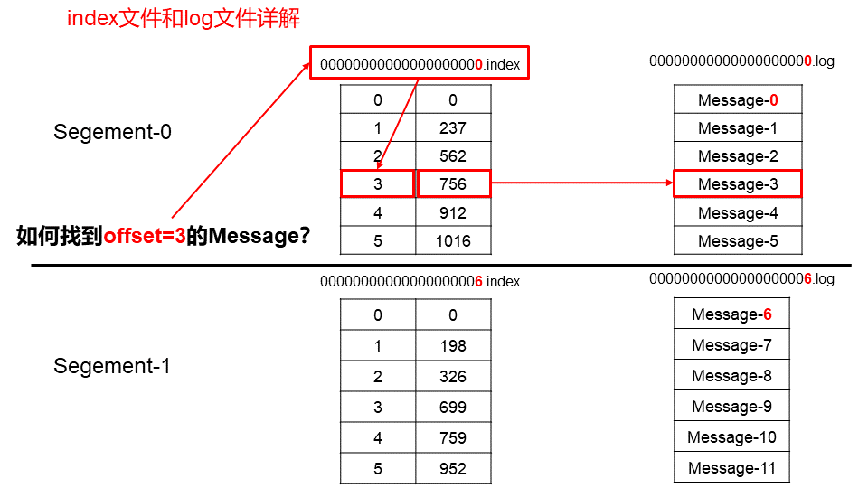
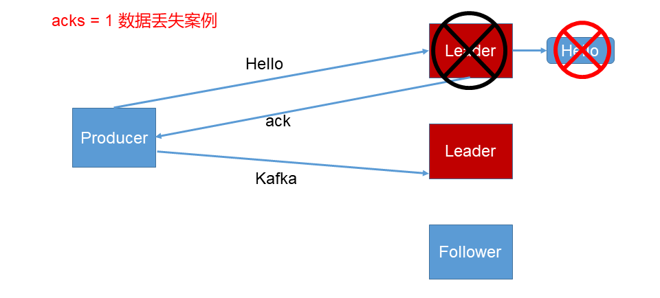
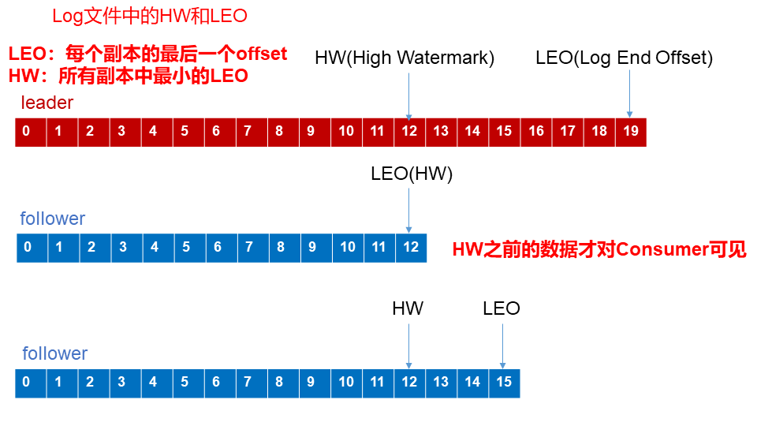
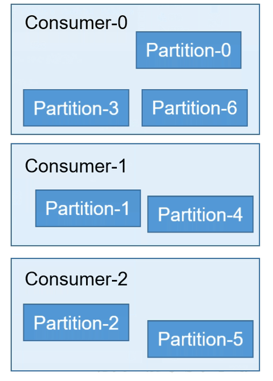
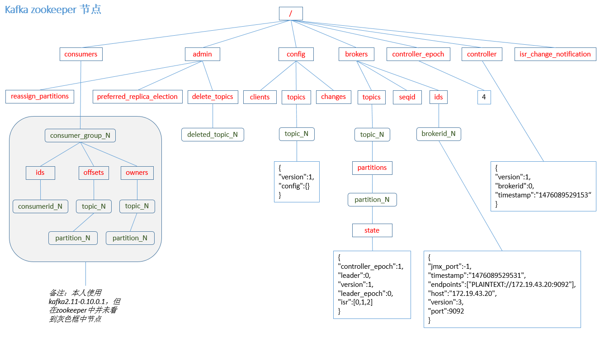
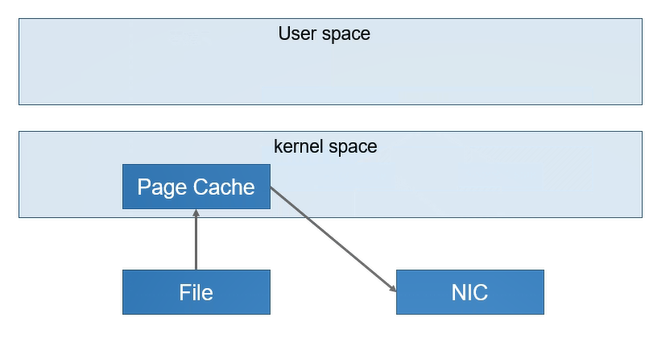
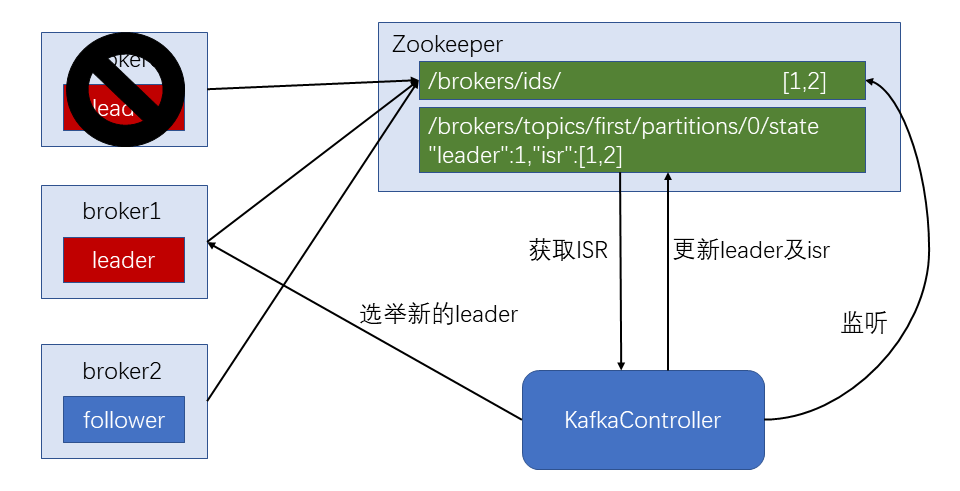

<!-- TOC -->

- [深入浅出 Kafka（四）架构深入](#深入浅出-kafka四架构深入)
    - [一、Kafka 工作流程及文件存储机制](#一kafka-工作流程及文件存储机制)
    - [二、Kafka 生产者](#二kafka-生产者)
        - [1. 分区策略](#1-分区策略)
            - [（1）分区的原因](#1分区的原因)
            - [（2）分区的原则](#2分区的原则)
        - [2. 数据可靠性保证](#2-数据可靠性保证)
            - [（1）副本数据同步策略](#1副本数据同步策略)
            - [（2）ISR](#2isr)
            - [（3）ack 应答机制](#3ack-应答机制)
            - [（4）ack 参数设置(asks)](#4ack-参数设置asks)
            - [（4）数据一致性问题（故障处理）](#4数据一致性问题故障处理)
        - [3. Exactly Once 语义](#3-exactly-once-语义)
    - [三、Kafka 消费者](#三kafka-消费者)
        - [1. 消费方式](#1-消费方式)
        - [2. 分区分配策略](#2-分区分配策略)
        - [3. offset 的维护](#3-offset-的维护)
    - [四、Kafka 高效读写数据](#四kafka-高效读写数据)
        - [1. 顺序写磁盘](#1-顺序写磁盘)
        - [2. 零拷贝技术](#2-零拷贝技术)
    - [五、Zookeeper 在 Kafka 中的作用](#五zookeeper-在-kafka-中的作用)
    - [六、Kafka 事务](#六kafka-事务)
        - [1. Producer事务事务](#1-producer事务事务)
        - [2. Consumer **事务**](#2-consumer-事务)

<!-- /TOC -->

# 深入浅出 Kafka（四）架构深入

## 一、Kafka 工作流程及文件存储机制


　　Kafka 中消息是以 topic 进行分类的，生产者生产消息，消费者消费消息，都是面向 topic 的。

　　topic 是逻辑上的概念，而 partition 是物理上的概念，每个 partition 对应于一个 log 文件，该 log 文件中存储的就是 producer 生产的数据。Producer 生产的数据会被不断追加到该 log 文件末端，且每条数据都有自己的 offset。消费者组中的每个消费者，都会实时记录自己消费到了哪个 offset，以便出错恢复时，从上次的位置继续消费。

   

　　由于生产者生产的消息会不断追加到 log 文件末尾，为防止 log 文件过大导致数据定位效率低下，Kafka 采取了**分片**和**索引**机制，将每个 partition 分为多个 segment。每个 segment 对应两个文件——“.index”文件和 “.log” 文件。这些文件位于一个文件夹下，该文件夹的命名规则为：topic 名称 + 分区序号。例如，first 这个 topic 有三个分区，则其对应的文件夹为 first-0,first-1,first-2。

```
00000000000000000000.index
00000000000000000000.log
00000000000000170410.index
00000000000000170410.log
00000000000000239430.index
00000000000000239430.log
```

　　index 和 log 文件以当前 segment 的第一条消息的 offset 命名。



　　**“.index”文件存储大量的索引信息，“.log”文件存储大量的数据**，**索引文件中的元数据指向对应数据文件中**message 的物理偏移地址。


## 二、Kafka 生产者

### 1. 分区策略

#### （1）分区的原因

- **方便在集群中扩展**，每个 Partition 可以通过调整以适应他所在的机器，而一个 topic 可以有多个 Partition 组成，因此这个集群就可以适应任意大小的数据了；
- **可以提高并发**，因为可以以 Partition 为单位读写了。


#### （2）分区的原则

- 我们将 producer 发送的数据封装成一个 ProducerRecord 对象。


1. 指明 partition 的情况下，直接将指明的值直接作为 partition 值；
2. 没有指明 partition 值但有 key 的情况下，将 key 的 hash 值与 topic 的 partition 数进行取余得到 partition 值；
3. 既没有 partition 值有没有 key 值的情况下，第一次调用时随机生成一个整数(后面调用在这个整数上自增)，将这个值的 topic 可用的 partition 总数取余得到 partition 值，也就是常说的 Round Robin（轮询调度）算法。


### 2. 数据可靠性保证

　　为保证 producer 发送的数据，能可靠的发送到指定的 topic，topic 的每个 partition 收到 producer 发送的数据后，都需要向 producer 发送 ack（acknowledgement 确认收到），如果 producer 收到 ack，就会进行下一轮的发送，否则重新发送数据。


#### （1）副本数据同步策略

|**方案**                       |**优点**                                          |**缺点**                                           |
| ------------------------------- | -------------------------------------------------- | --------------------------------------------------- |
|**半数以上完成同步，就发送 ack**| 延迟低                                             | 选举新的 leader 时，容忍 n 台节点的故障，需要 2n+1 个副本 |
|**全部完成同步，才发送 ack**    | 选举新的 leader 时，容忍 n 台节点的故障，需要 n+1 个副本 | 延迟高                                              |

Kafka 选择了第二种方案，原因如下：
1. 同样为了容忍 n 台节点的故障，第一种方案需要 2n+1 个副本，而第二种方案只需要 n+1 个副本，而 Kafka 的每个分区都有大量的数据，第一种方案会造成大量数据的冗余。
2. 虽然第二种方案的网络延迟会比较高，但网络延迟对 Kafka 的影响较小（同一网络环境下的传输）。


#### （2）ISR

　　采用第二种方案之后，设想以下情景：leader 收到数据，所有 follower 都开始同步数据，但有一个 follower，因为某种故障，迟迟不能与 leader 进行同步，那 leader 就要一直等下去，直到它完成同步，才能发送 ack。这个问题怎么解决呢？

　　Leader 维护了一个动态的 **in-sync replica set** (ISR)，意为和 leader 保持同步的 follower 集合。当 ISR 中的 follower 完成数据的同步之后，leader 就会给 producer 发送 ack。如果 follower 长时间未向 leader 同步数据，则该 follower 将被踢出 ISR，该时间阈值由 **replica.lag.time.max.ms** 参数设定。Leader 发生故障之后，就会从 ISR 中选举新的 leader。


#### （3）ack 应答机制

　　对于某些不太重要的数据，对数据的可靠性要求不是很高，能够容忍数据的少量丢失，所以没必要等 ISR 中的 follower 全部接收成功。

　　所以 Kafka 为用户提供了三种可靠性级别，用户根据对可靠性和延迟的要求进行权衡，选择以下的配置。


#### （4）ack 参数设置(asks)

- 0：producer 不等待 broker 的 ack，这一操作提供了一个最低的延迟，broker 一接收到还没有写入磁盘就已经返回，当 broker 故障时有可能**丢失数据**。
- 1：producer 等待 broker 的 ack，partition 的 leader 落盘成功后返回 ack，如果在 follower 同步成功之前 leader 故障，那么就会**丢失数据**。



- -1(all)：producer 等待 broker 的 ack，partition 的 leader 和 follower（是 ISR 中的） 全部落盘成功后才返回 ack，但是如果 follower 同步完成后，broker 发送 ack 之前，leader 发生故障，producer 重新发送消息给新 leader 那么会造成**数据重复**。


#### （4）数据一致性问题（故障处理）



- **follower 故障**
  follower 发生故障后会被临时踢出 ISR，待该 follower 恢复后，follower 会读取本地磁盘记录的上次的 HW，并将 log 文件高于 HW 的部分截取掉，从 HW 开始向 leader 进行同步。等该 **follower 的 LEO 大于等于该 Partition 的 HW**，即 follower 追上 leader 之后，就可以重新加入 ISR 了。

- **leader 故障**
  leader 发生故障之后，会从 ISR 中选出一个新的 leader，之后，为保证多个副本之间的数据一致性，其余的 follower 会先将各自的 log 文件高于 HW 的部分截掉，然后从新的 leader 同步数据。

**== 注意：这只能保证副本之间的数据一致性，并不能保证数据不丢失或者不重复。==**

**注意**：这只能保证副本之间的数据一致性，并不能保证数据不丢失或者不重复。


### 3. Exactly Once 语义

　　将服务器的 ACK 级别设置为 -1，可以保证 Producer 到 Server 之间不会丢失数据，即 At Least Once 语义。相对的，将服务器 ACK 级别设置为 0，可以保证生产者每条消息只会被 发送一次，即 At Most Once 语义。 

　　**At Least Once 可以保证数据不丢失，但是不能保证数据不重复**；相对的，At Least Once 可以保证数据不重复，但是不能保证数据不丢失。但是，对于一些非常重要的信息，比如说交易数据，下游数据消费者要求数据既不重复也不丢失，即 Exactly Once 语义。在 0.11 版本以前的 Kafka，对此是无能为力的，只能保证数据不丢失，再在下游消费者对数据做全局去重。对于多个下游应用的情况，每个都需要单独做全局去重，这就对性能造成了很大影响。 

　　0.11 版本的 Kafka，引入了一项重大特性：幂等性。所谓的幂等性就是指 Producer 不论向 Server 发送多少次重复数据，Server 端都只会持久化一条。幂等性结合 At Least Once 语义，就构成了 Kafka 的 Exactly Once 语义。即： 

<center>At Least Once + 幂等性 = Exactly Once</center>
　　要启用幂等性，只需要将 Producer 的参数中 enable.idompotence 设置为 true 即可。Kafka 的幂等性实现其实就是将原来下游需要做的去重放在了数据上游。开启幂等性的 Producer 在初始化的时候会被分配一个 PID，发往同一 Partition 的消息会附带 Sequence Number。而 Broker 端会对 <PID, Partition, SeqNumber> 做缓存，当具有相同主键的消息提交时，Broker 只会持久化一条。 

　　但是 PID 重启就会变化，同时不同的 Partition 也具有不同主键，**所以幂等性无法保证跨分区跨会话**的 Exactly Once。


## 三、Kafka 消费者

### 1. 消费方式

　　**consumer 采用 pull（拉）模式从 broker 中读取数据。**

　　**push（推）模式很难适应消费速率不同的消费者，因为消息发送速率是由 broker 决定的。**它的目标是尽可能以最快速度传递消息，但是这样很容易造成 consumer 来不及处理消息，典型的表现就是拒绝服务以及网络拥塞。而 pull 模式则可以根据 consumer 的消费能力以适当的速率消费消息。

　　**pull 模式不足之处是，如果 kafka 没有数据，消费者可能会陷入循环中，一直返回空数据。**针对这一点，Kafka 的消费者在消费数据时会传入一个时长参数 timeout，如果当前没有数据可供消费，consumer 会等待一段时间之后再返回，这段时长即为 timeout。


### 2. 分区分配策略

　　一个 consumer group 中有多个 consumer，一个 topic 有多个 partition，所以必然会涉及到 partition 的分配问题，即确定那个 partition 由哪个 consumer 来消费。

　　Kafka 有两种分配策略，一是 **RoundRobin**，一是 **range**。


　　**roundrobin**根据 partition 号对 consumer 个数取模后轮循分配



 

　　**range**提前按照均匀分配的原则计算个数后直接分配。


　　在订阅多个 partition 时 range 会有**不均匀**问题，kafka 默认为 range，因为不考虑多 partition 订阅时，range 效率更高。


### 3. offset 的维护

　　由于 consumer 在消费过程中可能会出现断电宕机等故障，consumer 恢复后，需要从故障前的位置的继续消费，所以 consumer 需要实时记录自己消费到了哪个 offset，以便故障恢复后继续消费。

　　group + topic + partition（GTP） 才能确定一个 offset！



　　Kafka 0.9 版本之前，consumer 默认将 offset 保存在 Zookeeper 中，从 0.9 版本开始，consumer 默认将 offset 保存在 Kafka 一个内置的 topic 中，该 topic 为 `__consumer_offsets`（此时消费者对于 offset 相当于生产者）。

1）修改配置文件 consumer.properties

```properties
exclude.internal.topics=false
```

2）读取offset

- 0.11.0.0 之前版本:

```shell
bin/kafkabin/kafka--consoleconsole--consumer.sh consumer.sh ----topic __consumer_offsets topic __consumer_offsets ----zookeeper zookeeper hadoophadoop102102:2181 :2181 ----formatter formatter

"kafka.coordinator.GroupMetadataManager"kafka.coordinator.GroupMetadataManager\\$OffsetsMessageFormatter" $OffsetsMessageFormatter" ----consumer.config config/consumer.properties consumer.config config/consumer.properties ----fromfrom--beginningbeginning
```

- 0.11.0.0 之后版本(含): 

```shell
bin/kafkabin/kafka--consoleconsole--consumer.sh consumer.sh ----topic __consumer_offsets topic __consumer_offsets ----zookeeper zookeeper hadoophadoop102102:2181 :2181 ----formatter formatter

"kafka.coordinator.group.GroupMetadataManager"kafka.coordinator.group.GroupMetadataManager\\$OffsetsMessageForm$OffsetsMessageFormatter" atter" ----consumer.config config/consumer.propertiesconsumer.config config/consumer.properties ----fromfrom--beginningbeginning
```

　　同一个消费者组中的消费者， 同一时刻只能有一个消费者消费。


## 四、Kafka 高效读写数据

### 1. 顺序写磁盘

　　Kafka 的 producer 生产数据，要写入到 log 文件中，写的过程是一直追加到文件末端，为顺序写。官网有数据表明，同样的磁盘，顺序写能到到 600M/s，而随机写只有 100k/s。这与磁盘的机械机构有关，顺序写之所以快，是因为其省去了大量磁头寻址的时间。


### 2. 零拷贝技术

　　零拷贝主要的任务就是避免 CPU 将数据从一块存储拷贝到另外一块存储，主要就是利用各种零拷贝技术，避免让 CPU 做大量的数据拷贝任务，减少不必要的拷贝，或者让别的组件来做这一类简单的数据传输任务，让 CPU 解脱出来专注于别的任务。这样就可以让系统资源的利用更加有效。

　　更详细，请参考：[浅析Linux中的零拷贝技术 - 简书](https://www.jianshu.com/p/fad3339e3448)





## 五、Zookeeper 在 Kafka 中的作用

　　Kafka 集群中有一个 broker 会被选举为 Controller，负责管理集群 broker 的上下线，所有 topic 的分区副本分配和 leader 选举等工作。

　　Controller 的管理工作都是依赖于 Zookeeper 的。

　　以下为 partition 的 leader 选举过程：




## 六、Kafka 事务

　　Kafka 从0.11 版本开始引入了事务支持。事务可以保证 Kafka 在 Exactly Once 语义的基础上，生产和消费可以跨分区和会话，要么全部成功，要么全部失败。

　　**注意**：这里的事务主要谈的是生产者（Producer）的事务


### 1. Producer事务事务

　　为了实现跨分区跨会话的事务，需要引入一个全局唯一的 Transaction ID（**一定是客户端给的**），并将 Producer 获得的 PID 和 Transaction ID 绑定。这样当 Producer 重启后就可以通过正在进行的 Transaction ID 获得原来的 PID。 

　　为了管理 Transaction，Kafka 引入了一个新的组件 Transaction Coordinator。Producer 就是通过和 Transaction Coordinator 交互获得 Transaction ID 对应的任务状态。Transaction Coordinator 还负责将事务所有写入 Kafka 的一个内部 Topic，这样即使整个服务重启，由于事务状态得到保存，进行中的事务状态可以得到恢复，从而继续进行。


### 2. Consumer **事务** 

　　上述事务机制主要是从 Producer 方面考虑，对于 Consumer 而言，事务的保证就会相对较弱，尤其时无法保证 Commit 的信息被精确消费。这是由于 Consumer 可以通过 offset 访问任意信息，而且不同的 Segment File 生命周期不同，同一事务的消息可能会出现重启后被删除的情况。
