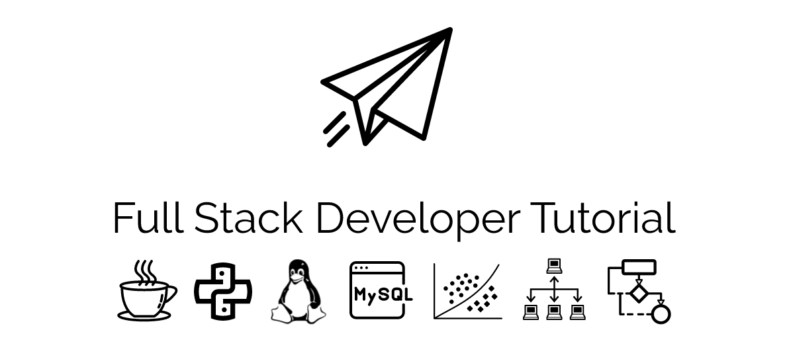

  
    

        嗨，欢迎来做客，即刻开始 CS 学习之旅.
    

    

        Hey, welcome to visit and start the computer science learning journey.
    

|              I              |           II           |           III           |            IV            |            V            |        VI        |         VII         | VIII |            IX            |            X            |            XI            | XII |
| :--------------------------: | :-------------------: | :----------------------: | :---------------------: | :--------------: | :---------------: | :----------------------: | :----------------------: | :----------------------: | :----------------------: | :----------------------: | :----------------------: |
| 算法 [:pencil:](#一数据结构与算法) | Java [:coffee:](#二java) | Python [:snake:](#三python) | 数据库 [:floppy_disk:](#四数据库) | 操作系统 [:computer:](#五操作系统) | 网络通信 [:cloud:](#六网络通信) | 分布式 [:page_with_curl:](#七分布式) | 机器学习  [:mag:](#八机器学习) |工具 [:hammer:](#九工具) |Learn [:books:](#learning-books) |Talking [:bulb:](#talking-bulb) |Author [:boy:](#关于作者-boy)|

  
    

公告（2018/11/15）：QQ技术交流群 862619503
    

    

        个人能力有限，欢迎志同道合的朋友们共同维护。<a href="notes/开源贡献.md">⊱ 开源小组，英雄招募令</a>
    

    

    招募 PHP，Python，Go，C++，分布式中间件，机器学习等等，板块维护者
    

    

        <a href="https://github.com/frank-lam/2019_campus_apply/issues/2" target="_blank">读者信箱（资料、意见、想法都可以在这里留言分享）</a>
    

## 前言

- [全栈修炼手册：如何选择自己的技术栈？](notes/如何选择自己的技术栈.md)

  在编程的世界里，该如何选择自己的技术栈呢。学前端？学 APP 开发？对于 Java、C++、C#、Python、PHP 又如何选择呢？人工智能现如今这么火，是不是机器学习、深度学习更高级一些呢？那么程序员又如何修炼内功呢？

- [全栈开发神兵利器](notes/全栈开发神兵利器.md)

  工欲善其事，必先利其器。这里我将推荐开发过程中的提效工具、开发利器、协作工具、文档技术等等。

## 一、数据结构与算法

- [数据结构与算法](notes/数据结构与算法.md)

　　排序算法、动态规划、递归、回溯法、贪心算法等

- [海量数据处理](notes/海量数据处理.md)

  数据处理典型案例，逐渐更新

## 二、Java

- [Java 基础概念](notes/JavaArchitecture/01%20Java%20基础.md)

　　基本概念、面向对象、关键字、基本数据类型与运算、字符串与数组、异常处理、Object 通用方法

- [Java 集合框架](notes/JavaArchitecture/02%20Java%20集合框架.md)

　　数据结构 & 源码分析：ArrayList、Vector、LinkedList、HashMap、ConcurrentHashMap、HashSet、LinkedHashSet and LinkedHashMap

- [Java 并发编程](notes/JavaArchitecture/03%20Java%20并发编程.md)

　　线程状态、线程机制、线程通信、J.U.C 组件、JMM、线程安全、锁优化

- [Java I/O](notes/JavaArchitecture/04%20Java%20IO.md)

　　磁盘操作、字节操作、字符操作、对象操作、网络操作、NIO

- [Java 虚拟机](notes/JavaArchitecture/05%20Java%20虚拟机.md)

　　运行时数据区域、垃圾收集、内存分配机制、类加载机制、性能调优监控工具

- [Java 设计模式](notes/JavaArchitecture/06%20设计模式.md)

　　Java 常见的 10 余种设计模式，全 23 种设计模式逐步更新

- [Java Web](notes/JavaArchitecture/07%20Java%20Web.md)

　　包含 Servlet & JSP、Spring、SpringMVC、Mybatis、Hibernate、Structs2 核心思想，如 IOC、AOP 等思想。SSM 更详细请转向：[Spring](notes/JavaWeb/Spring.md) | [SpringMVC](https://github.com/frank-lam/SpringMVC_MyBatis_Learning) | [MyBatis](https://github.com/frank-lam/SpringMVC_MyBatis_Learning)

## 三、Python

- Python 语言基础
- Scrapy 爬虫框架
- Flask
- Django

## 四、数据库

- [MySQL](notes/MySQL.md)

  存储引擎、事务隔离级别、索引、主从复制

- [Redis](notes/Redis.md)

  Redis 核心知识

- [SQL](notes/SQL.md)

  常用 SQL 语句

## 五、操作系统

- [操作系统原理](notes/操作系统.md)

　　进程管理、死锁、内存管理、磁盘设备

- [Linux](notes/Linux.md)

　　基础核心概念、常用命令使用

## 六、网络通信

- [计算机网络](notes/计算机网络.md)

　　传输层、应用层（HTTP）、网络层、网络安全

- [RESTful API](notes/RESTful%20API.md)

  软件架构风格、格设计原则和约束条件

- [Web网络安全](notes/网络安全.md)

  web前后端漏洞分析与防御，XSS 攻击、CSRF 攻击、DDoS 攻击、SQL 注入

- Socket 网络编程

## 七、分布式

- [Docker](notes/Docker基础.md)

  容器化引擎服务

- 微服务思想

  服务拆分，持续集成、持续交付、持续部署

- Kubernetes（k8s）

  容器化部署，管理云平台中多个主机上的容器化的应用

- 云计算

  SaaS（软件即服务） 、PaaS（平台即服务） 、IaaS（基础架构即服务）

- Zookeeper

  分布式协调服务

- Dubbo、Thrift（RPC 框架）

  分布式服务治理

- 分布式事务解决方案

- ActiveMQ、Kafka、RabbitMQ

  分布式消息通信

- 熔断，限流，降级机制

- Redis

  分布式缓存

- Mycat

  数据库路由

- Nginx

  反向代理

- Tomcat

  Web Server 服务

- DevOps

  自动化运维

- Go

  并发的、带垃圾回收的、快速编译的语言

【说明】**分布式专题** 笔者也在学习中，这里列举了一些技能列表，笔者将局部更新。敬请期待

## 八、机器学习
- 经典机器学习算法
- Scikit-learn
- Tensorflow

【说明】学习过一段时间算法，但一直未来得及整理。敬请期待

## 九、工具

- [Git](notes/Git.md)

  基本概念，常见命令，速查表

- [Git 工作流](notes/Git工作流.md)

  集中式工作流，功能分支工作流， GitFlow 工作流，Forking 工作流，Pull Requests

- [正则表达式](notes/EfficiencyTools/正则表达式.md)

  常见符号含义，速查表

## Learn :books:

- [LEARN_LIST](notes/LEARNLIST.md)

　　包含阅读清单，学习课程两部分

- [web应用开发标准流程](notes/web应用开发标准流程.md)

## Talking :bulb:

　　本仓库致力于成为一个全栈开发爱好者的学习指南，给初学者一个更明确的学习方向，同时也是对自己技能的强化和巩固。在架构师这条路上，希望和大家一起成长，帮助更多的计算机爱好者能够有一个明确的学习路径。持续不间断的维护本仓库，也欢迎有更多的极客们加入。

　　都说好记性不如烂笔头，定期的学习和整理必然对学习巩固有所帮助，这里通过索引的方式对全栈开发技术做一个系统分类，方便随时巩固和学习，当然还有面试。在学习这条路上难免会有很多盲点和学不完的知识。有道无术，术尚可求，掌握好思维能力才能应对千变万化的技术。不要把大脑当成硬盘，也不要做高速运转的 CPU，而修行自己的大脑成为一个搜索引擎，学会分析解决问题。

　　Since 20,May,2018

### Reference

　　个人的能力有限，在编写的过程中引用了诸多优秀的 GitHub 仓库。本项目的启发来自 [@CyC2018](https://github.com/CyC2018) 的学习笔记，是一个非常优秀的开源项目，在本仓库中部分内容引用文字和图例；引用了 [@计算所的小鼠标](https://github.com/CarpenterLee) 中对于 JCF 的源码分析和理解；引用了  [阿里面试题总结](https://www.nowcoder.com/discuss/5949) 中全部的面试题，并对面经进行了整理勘误，并进行了知识拓展和修改；引用了 [牛客网](https://www.nowcoder.com) 上的面试经验贴。也引用了知乎上的热门回答和优秀博客的回答。在这里特别鸣谢，我将每篇文章中做外链引用说明。

　　文中我也推荐了学习的书籍和学习课程，都将附着上最高清、最形象的配图进行讲解。在文中的配图都来自自己绘制的、博客、Github、PDF书籍等等，这里没法一一感谢，谢谢你们。

　　推荐一些优秀的开源项目，供大家参考，[reference](notes/reference.md)。

### Contributors

　　该项目还在萌芽起步阶段，在编写的过程中难免遇到错误和不足，你可以在 issue 中提出，或是提交你的 contribution。[【开源贡献】如何给我的仓库贡献？](notes/docs/如何给我的仓库贡献.md)

　　感谢以下伙伴们对于本仓库的贡献，如想加入本开源项目，请联系笔者。

　　 

 
 
 
 
 
 

### License

　　本作品采用 [知识共享署名-非商业性使用-相同方式共享 4.0 国际许可协议](https://creativecommons.org/licenses/by-nc-sa/4.0/) 进行许可。使用者可以对本创作进行转载、节选、混编、二次创作，但不得运用于商业目的，且使用时须进行署名，采用本创作的内容必须同样采用本协议进行授权。

　　

## 关于作者 :boy:

  
    

        在颠覆世界的同时，也要好好关照自己。
    

      
    

        from zero to hero.
    

 