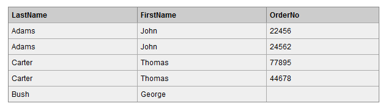
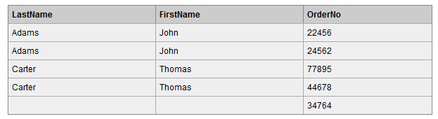

# 前言

在这部分将整理 SQL 语句的使用


# SQL基础

## 1. INNER JOIN、LEFT JOIN、RIGHT JOIN、FULL JOIN

SQL 中的连接查询有四种方式，它们之间其实并没有太大区别，仅仅是查询出来的结果有所不同。

- inner join（内连接）
- left join（左连接）
- right join（右连接）
- full join（全连接）

例如我们有两张表： 


**Orders** 表通过外键 **Id_P** 和 **Persons** 表进行关联。

### 1. inner join，在两张表进行连接查询时，只保留两张表中完全匹配的结果集。

我们使用 inner join 对两张表进行连接查询，sql如下：

```mysql
SELECT Persons.LastName, Persons.FirstName, Orders.OrderNo
FROM Persons
INNER JOIN Orders
ON Persons.Id_P=Orders.Id_P
ORDER BY Persons.LastName
```

查询结果集： 


此种连接方式 Orders 表中 Id_P 字段在 Persons 表中找不到匹配的，则不会列出来。


### 2. left join，在两张表进行连接查询时，会返回左表所有的行，即使在右表中没有匹配的记录

我们使用 left join 对两张表进行连接查询，sql如下：

```mysql
SELECT Persons.LastName, Persons.FirstName, Orders.OrderNo
FROM Persons
LEFT JOIN Orders
ON Persons.Id_P=Orders.Id_P
ORDER BY Persons.LastName
```
查询结果如下： 



可以看到，左表（Persons表）中 LastName 为 Bush 的行的 Id_P 字段在右表（Orders表）中没有匹配，但查询结果仍然保留该行。


### 3. right join，在两张表进行连接查询时，会返回右表所有的行，即使在左表中没有匹配的记录

我们使用right join对两张表进行连接查询，sql如下：

```mysql
SELECT Persons.LastName, Persons.FirstName, Orders.OrderNo
FROM Persons
RIGHT JOIN Orders
ON Persons.Id_P=Orders.Id_P
ORDER BY Persons.LastName
```

 查询结果如下：



Orders 表中最后一条记录 Id_P 字段值为 65，在左表中没有记录与之匹配，但依然保留。

### 4. full join，在两张表进行连接查询时，返回左表和右表中所有没有匹配的行

我们使用 full join 对两张表进行连接查询，sql如下：

```mysql
SELECT Persons.LastName, Persons.FirstName, Orders.OrderNo
FROM Persons
FULL JOIN Orders
ON Persons.Id_P=Orders.Id_P
ORDER BY Persons.LastName
```

查询结果如下： 


查询结果是 left join 和 right join 的并集。

这些连接查询的区别也仅此而已。


参考来源：

- [SQL中INNER JOIN、LEFT JOIN、RIGHT JOIN、FULL JOIN区别 - 杨浪 - 博客园](https://www.cnblogs.com/yanglang/p/8780722.html)


