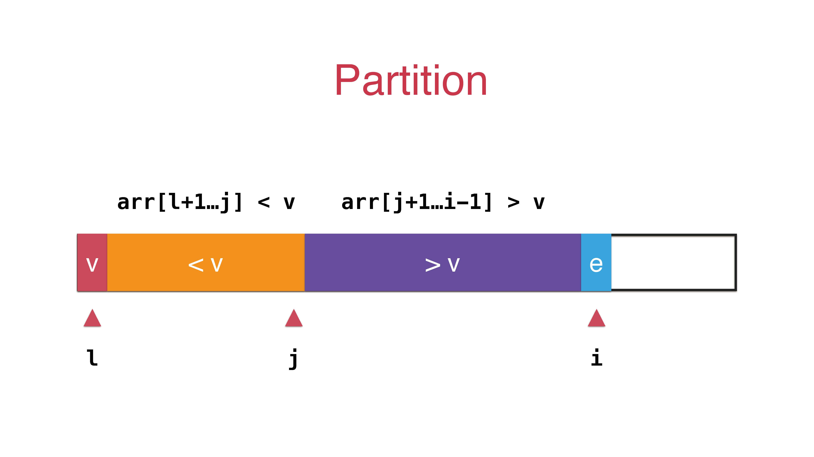

快速排序可以说是20世纪最伟大的算法之一了。相信都有所耳闻，它的速度也正如它的名字那样，是一个非常快的算法了。当然它也后期经过了不断的改进和优化，才被公认为是一个值得信任的非常优秀的算法。

本文将结合快速排序的三方面进行比较和深入解析。


## 快速排序



```java
public class QuickSort {
    // 递归使用快速排序,对arr[l...r]的范围进行排序
    public static void QuickSort(int[] arr,int l,int r){
        if(l>=r)
            return;
        int p = partition(arr,l,r);
        QuickSort(arr,l,p-1);
        QuickSort(arr,p+1,r);
    }

    // 将数组通过p分割成两部分
    // 对arr[l...r]部分进行partition操作
    // 返回p, 使得arr[l...p-1] < arr[p] ; arr[p+1...r] > arr[p]
    public static int partition(int[] arr, int l, int r) {
        swap(arr, l, (int) (Math.random() * (r - l + 1)) + l); // 随机快速排序

        int v = arr[l];
        int j = l;
        for(int i = j +1;i<=r;i++){
            if(arr[i] < v){
                j++;
                swap(arr,i,j);
            }
        }
        swap(arr,l,j);
        return j;
    }

    public static void swap(int[] arr,int i,int j) {
        int temp = arr[i];
        arr[i] = arr[j];
        arr[j] = temp;
    }

    // 打印arr数组的所有内容
    public static void printArray(int[] arr) {

        for (int i = 0; i < arr.length; i++){
            System.out.print( arr[i] );
            System.out.print( ' ' );
        }
        System.out.println();

        return;
    }

    public static void main(String[] args){
        int[] arr = {4,3,12,12};
        QuickSort(arr,0,arr.length-1);
        printArray(arr);
    }
}
```


## 双路快速排序


若果数组中含有大量重复的元素，则partition很可能把数组划分成两个及其不平衡的两部分，时间复杂度退化成O(n²)。这时候应该把小于v和大于v放在数组两端


实际上把等于的部分分散到了数组两端


```java

public class QuickSort2Ways {
    
    // 双路快速排序的partition
    // 返回p, 使得arr[l...p-1] < arr[p] ; arr[p+1...r] > arr[p]
    private static int partition(int[] arr, int l, int r) {

        // 随机在arr[l...r]的范围中, 选择一个数值作为标定点pivot
        swap(arr, l, (int) (Math.random() * (r - l + 1)) + l);

        int v = arr[l];

        // arr[l+1...i) <= v; arr(j...r] >= v
        int i = l + 1, j = r;
        while (true) {
            // 注意这里的边界, arr[i] < 0, 不能是arr[i] <= v
            // 思考一下为什么?
            while (i <= r && arr[i] < v)
                i++;

            // 注意这里的边界, arr[j] > v, 不能是arr[j] >= v
            // 思考一下为什么?
            while (j >= l + 1 && arr[j] > v)
                j--;

            // 对于上面的两个边界的设定, 有的同学在课程的问答区有很好的回答:)
            // 大家可以参考: http://coding.imooc.com/learn/questiondetail/4920.html
            // 答案：多了个等号的判断也会造成两棵子树不平衡

            if (i > j)
                break;

            swap(arr, i, j);
            i++;
            j--;
        }

        swap(arr, l, j);
        return j;
    }

    // 递归使用快速排序,对arr[l...r]的范围进行排序
    private static void QuickSort2Ways(int[] arr, int l, int r) {

        // 对于小规模数组, 使用插入排序
        // if( r - l <= 15 ){
        //    InsertionSort.sort(arr, l, r);
        //    return;
        // }

        int p = partition(arr, l, r);
        QuickSort(arr, l, p - 1);
        QuickSort(arr, p + 1, r);
    }


    private static void swap(int[] arr, int i, int j) {
        int t = arr[i];
        arr[i] = arr[j];
        arr[j] = t;
    }

    // 打印arr数组的所有内容
    public static void printArray(int[] arr) {

        for (int i = 0; i < arr.length; i++) {
            System.out.print(arr[i]);
            System.out.print(' ');
        }
        System.out.println();
        return;
    }

    // 测试 QuickSort
    public static void main(String[] args) {

        //双路快速排序算法也是一个O(nlogn)复杂度的算法
        // 可以在1秒之内轻松处理100万数量级的数据
        int[] arr = {4, 3, 12, 12};
        QuickSort2Ways(arr, 0, arr.length - 1);
        printArray(arr);
    }
}
```


## 三路快速排序


数组分成三个部分，大于v 等于v 小于v


```java

public class QuickSort3Ways {

    // 递归使用快速排序,对arr[l...r]的范围进行排序
    private static void QuickSort3Ways(int[] arr, int l, int r){

        // 随机在arr[l...r]的范围中, 选择一个数值作为标定点pivot
        swap( arr, l, (int)(Math.random()*(r-l+1)) + l );

        int v = arr[l];

        int lt = l;     // arr[l+1...lt] < v
        int gt = r + 1; // arr[gt...r] > v
        int i = l+1;    // arr[lt+1...i) == v
        while( i < gt ){
            if( arr[i] < v){
                swap( arr, i, lt+1);
                i ++;
                lt ++;
            }
            else if( arr[i] > v ){
                swap( arr, i, gt-1);
                gt --;
            }
            else{ // arr[i] == v
                i ++;
            }
        }

        swap( arr, l, lt );

        QuickSort3Ways(arr, l, lt-1);
        QuickSort3Ways(arr, gt, r);
    }


    private static void swap(int[] arr, int i, int j) {
        int t = arr[i];
        arr[i] = arr[j];
        arr[j] = t;
    }

    // 打印arr数组的所有内容
    public static void printArray(int[] arr) {
        for (int i = 0; i < arr.length; i++) {
            System.out.print(arr[i]);
            System.out.print(' ');
        }
        System.out.println();
        return;
    }

    // 测试 QuickSort
    public static void main(String[] args) {
        // 三路快速排序算法也是一个O(nlogn)复杂度的算法
        // 可以在1秒之内轻松处理100万数量级的数据
        int[] arr = {4, 3, 12, 12};
        QuickSort3Ways(arr, 0, arr.length - 1);
        printArray(arr);
    }
}
```

