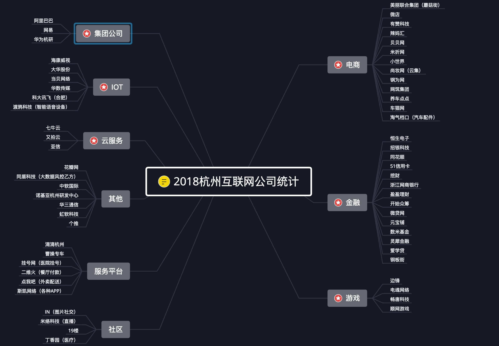

# :rocket:目标大厂

| 序号 | 状态 | 公司                       | 时间                                         | 笔试            | 面试              |   城市    |                             岗位                             |                             官网                             |
| :--: | ---- | :------------------------- | :------------------------------------------- | :-------------- | ----------------- | :-------: | :----------------------------------------------------------: | :----------------------------------------------------------: |
|      |      | **杭州互联网**             |                                              |                 |                   |           |                                                              |                                                              |
|  1   |      | 网易互联网★                | 内推：7月16日-8月8日 网申：8月9日-9月5日 |                 |                   |   杭州    | [Java开发工程师](https://campus.163.com/app/jobDetail/index?id=102) | [site](https://campus.163.com/app/campus/recruitment4campus) |
|  2   | 📤    | 网易游戏★                  |                                              | 8/9             | 8月下旬           |   杭州    | [游戏研发](http://game.campus.163.com/2018/zhiwei/zaixian/jsl/2018/06/27/29329_760517.html#jobList) |           [site](https://campus.163.com/app/hy/lh)           |
|  3   |      | 华为★                      |                                              |                 | 9月中下旬         | 杭州/深圳 | [IT应用软件开发](http://career.huawei.com/reccampportal/campus4_index.html#campus4/pages/joblist/jobDetail.html?jobId=53166&d=1533868343159&type=2&jobFamClsCode=JFC1) | [site](http://career.huawei.com/reccampportal/next/mini/index.html) |
|  4   |      | 有赞★                      | 8/25-10/15                                   | 9/21 10/17 | 9月下旬到11月上旬 |   杭州    | [Java开发校招生](https://www.shixiseng.com/website/youzan/campus-recruit.html) | [site](https://www.shixiseng.com/website/youzan/campus-recruit.html) |
|  6   |      | 蘑菇街★                    |                                              |                 |                   |   杭州    |                                                              |      [site](http://job.mogujie.com/#/campus?_k=79c8ui)       |
|  5   |      | 滴滴★                      |                                              |                 |                   | 杭州/北京 |                                                              |         [site](http://campus.didichuxing.com/campus)         |
|  7   |      | 招银网络科技★              | 9/7 截止                                     | 9/8             |                   |   杭州    | [软件开发工程师](http://cmbnt.cmbchina.com/zhaopin/PositionDetail.aspx?id=207) |   [site](http://cmbnt.cmbchina.com/2019campus/index.html)    |
|  8   |      | 科大讯飞                   | 内推：7月19日-8月25日                        |                 |                   |   杭州    | [软件开发工程师](https://iflytek.cheng95.com/position/detail?channel=2&id=22) |             [site](https://iflytek.cheng95.com/)             |
|  9   |      | 恒生电子                   |                                              |                 |                   |   杭州    | [软件开发工程师](http://campus.hundsun.com/zpdetail/230193316?r=&p=&c=3301&d=&k=) |              [site](http://campus.hundsun.com/)              |
|  10  |      | 同花顺                     |                                              |                 |                   |   杭州    |      [研发工程师](http://job.10jqka.com.cn/school.html)      |              [site](http://job.10jqka.com.cn/)               |
|  11  |      | 浙江大华                   |                                              |                 |                   |   杭州    | [研发支持工程师](http://dahua.zhiye.com/zpdetail/230192018?r=&p=1%5E16&c=3300&d=&k=) | [site](http://dahua.zhiye.com/campus?r=&p=1^16&c=3300&d=&k=#jlt) |
|  12  |      | 海康威视                   |                                              |                 |                   |   杭州    | [应用软件开发工程师](http://campus.hikvision.com/zpdetail/150160563?r=&p=1%5E1&c=3301&d=&k=) |             [site](http://campus.hikvision.com/)             |
|  13  |      | 虹软中国                   |                                              |                 |                   |   杭州    | [JAVA开发工程师](http://job.arcsoft.com.cn/JobList.aspx?flag=2) |    [site](http://job.arcsoft.com.cn/JobList.aspx?flag=2)     |
|  14  |      | 51信用卡                   |                                              |                 |                   |   杭州    |                                                              | [site](https://campus.u51.com/campus_apply/u51#/?anchorName=000&_k=n0g2i5) |
|  15  |      | 新华三                     |                                              |                 |                   |           |                                                              |                                                              |
|  16  |      | 丁香园                     |                                              |                 |                   |   杭州    |                                                              |                             官网                             |
|  17  |      | 贝贝                       |                                              |                 |                   |   杭州    | [Java开发工程师](http://campus.51job.com/beibei2018/position.html) |              [site](https://campus.beibei.com)               |
|  18  |      | 搜狗                       |                                              |                 |                   |   杭州    |                                                              |          [site](http://campus.sogou.com/post.html)           |
|  19  |      | 花瓣网                     |                                              |                 |                   |   杭州    | [Web 开发工程师](http://huaban.com/about/join_us/#web_developer) |           [site](http://huaban.com/about/join_us/)           |
|  20  |      | 吉利集团 （曹操专车） |                                              |                 |                   |   杭州    | [Java开发工程师（优行）](http://campus.geely.com/home/webschool/xzlist?studentType=1#) |    [site](http://campus.geely.com/home/webschool/xzindex)    |
|  21  |      | 典典养车                   |                                              |                 |                   |   杭州    |       [Java开发 5人](http://www.ddyc.com/jobs/1.html)        |            [site](http://www.ddyc.com/jobs.html)             |
|  22  |      | 挖财网                     |                                              |                 |                   |           |                                                              |                                                              |
|      |      |                            |                                              |                 |                   |           |                                                              |                                                              |
|  *   |      | 京东                       |                                              |                 |                   |           | [Java开发工程师](http://campus.jd.com/web/job/job_detail?jobId=561) |              [site](http://campus.jd.com/home)               |
|  *   |      | 饿了么                     |                                              |                 |                   |           | [golang工程师](https://campus.ele.me/job/5b5ed00d519aea016dfc30b6) |          [site](https://campus.ele.me/campus/list)           |
|      |      |                            |                                              |                 |                   |           |                                                              |                                                              |
|      |      | **上海互联网**             |                                              |                 |                   |           |                                                              |                                                              |
|  1   |      | 美团点评★                  | 内推，网申：8/6-10/20                        |                 |                   |   上海    | [后台开发工程师](https://campus.meituan.com/jobs?jobFamily=1&jobId=1561&jobType=1&pageNo=2&workCity=001009) |      [行程](https://campus.meituan.com/campus-recruit)       |
|  2   |      | 百度★                      | 9/8截止                                      | 9/11            | 9/14-21           |   上海    | [Java研发](https://talent.baidu.com/external/baidu/campus.html#/jobDetail/1/120915) | [site](https://talent.baidu.com/external/baidu/campus.html#/jobList) |
|  3   |      | 爱奇艺★                    |                                              |                 |                   |   上海    |                                                              |      [site](http://zhaopin.iqiyi.com/school-index.html)      |
|  4   | 📤    | 拼多多★                    | 7/2-8/3                                      |                 |                   |   上海    | [Java开发工程师](http://pinduoduo.zhiye.com/zpdetail/620197931) |           [site](http://pinduoduo.zhiye.com/home)            |
|  5   |      | 饿了么★                    | 9/20截止                                     |                 |                   | 杭州/上海 | [golang工程师](https://campus.ele.me/job/5b5ed00d519aea016dfc30b6) |          [site](https://campus.ele.me/campus/list)           |
|  6   |      | 携程★                      | 9/4截止                                      | 9/5             |                   |   上海    |        [后台开发](http://recruitment.ctrip.com/list)         |            [site](http://recruitment.ctrip.com/)             |
|  7   |      | 京东★                      | 9/6截止                                      | 9/9             |                   | 上海/杭州 | [Java开发工程师](http://campus.jd.com/web/job/job_detail?jobId=561) |              [site](http://campus.jd.com/home)               |
|  8   |      | 今日头条★                  |                                              |                 |                   | 北京/上海 | [后端开发工程师](https://job.bytedance.com/job/detail/24169) |      [site](https://job.bytedance.com/campus/position)       |
|  9   |      | 58集团                     |                                              | 9/15            |                   |           | [后台开发工程师](http://campus.58.com/detail.html?id=5b1df5ea48aefc7507e491cb&citysId=5b1f354fedec7a2f1997b76b&jobsId=5b1f34b248aefc548dbd2419) |            [site](http://campus.58.com/jobs.html)            |
|  10  |      | 搜狐畅游                   |                                              |                 |                   |           |                                                              |                                                              |
|  11  |      | ThoughtWorks               |                                              |                 |                   |   上海    | [软件开发工程师](https://join.thoughtworks.cn/recruitment_process#jobs) |            [site](https://join.thoughtworks.cn/)             |
|  12  | 📤    | 贝壳                       | 内推：曹蓉，23025254                         |                 |                   |   上海    | [Java研发](http://campus.ke.com/zpdetail/190145551?r=&p=&c=3100&d=&k=) |                [site](http://campus.ke.com/)                 |
|  13  |      | 哔哩哔哩                   | 9/4-10/16                                    |                 |                   |   上海    | [后端研发工程师](http://campus.chinahr.com/2018/bilibili/index.html#t3) |  [site](http://campus.chinahr.com/2018/bilibili/index.html)  |
|      |      |                            |                                              |                 |                   |           |                                                              |                                                              |
|      |      | **深圳互联网**             |                                              |                 |                   |           |                                                              |                                                              |
|  1   |      | 腾讯★                      | 9/12截止                                     |                 | 9/26起            |   深圳    |                         web后台开发                          |                 [site](https://join.qq.com/)                 |
|  2   |      | 迅雷                       |                                              |                 |                   |   深圳    | [服务器开发工程师](http://campus.xunlei.com/position.html?tab=1) |                                                              |
|  3   |      | 顺丰                       |                                              |                 |                   |   深圳    | [JAVA开发工程师](http://campus.sf-tech.com.cn/campusRecruitment/Jobinner1.html?p=29974628167) |                                                              |
|  4   | 📤    | 微众银行                   | 9/16截止                                     | 9/18            | 9月下旬起         |   深圳    | [后台开发](https://webank.cheng95.com/positions/detail?project_id=2&id=5&channel=1) |             [site](https://webank.cheng95.com/)              |
|      |      |                            |                                              |                 |                   |           |                                                              |                                                              |
|      |      | **北京互联网**             |                                              |                 |                   |           |                                                              |                                                              |
|  1   |      | 小米                       |                                              |                 |                   |   北京    |    [服务端工程师](https://hr.xiaomi.com/campus/view/867)     |                                                              |
|  2   |      | 今日头条                   |                                              |                 |                   | 北京/上海 |                                                              |                                                              |
|  3   |      | 新浪                       |                                              |                 |                   |           |                                                              |                                                              |

# :helicopter:练手大厂

| 序号     | 状态     | 公司       | 时间                                         | 笔试 | 城市 | 岗位                                                         | 官网                                                   |
| ---------- | -------------------------------------------- | ---- | ---- | ------------------------------------------------------------ | -------------------------------------------------------- | -------------------------------------------------------- | -------------------------------------------------------- |
| 1 |  | 完美世界 |||北京|||
| 2 |  | 4399 |                                              |      | 广州 |                                                              |                                                          |
| 3 |  | 途牛 | | |  | | |
| 4 |  | WPS | 8/25截止 | | 北京 | [服务端开发工程师](http://join.wps.cn/#/job/7f1c61bb-b8ad-447e-b14d-2354d35c486f?_k=ttbd4w) | |
| 5 |  | 豆瓣 | | | 北京 | [产品开发工程师](https://jobs.douban.com/jobs/campus/#position-cam_cpkf) | |
| 6 |  | 珍爱网 | | | 深圳 | [Java开发工程师](http://zhenai.zhiye.com/zpdetail/190143546) |  |
| 7 |  | 360 | 12日内推截止 | | 北京 | [岗位列表](http://campus.chinahr.com/2019/qihu360/job_intern.html) |  |
| 8 |  | 唯品会 | | | 上海/广州 | [JAVA开发工程师](http://campus.vip.com/rec_1.html) |  |
| 9 |  | 蜻蜓FM | | | 上海 | [软件开发工程师](http://sss.qingting.fm/campus/campus.html?v=4) |  |
| 10 |  | 斗鱼 | | | 武汉 |  |  |
| 11 |  | 魅族科技 | | | 珠海 | [Java开发工程师-系统平台](http://meizu.zhiye.com/zpdetail/230111011?p=1%5E37&c=-1&PageIndex=2) |  |
| 12 | :outbox_tray: | 苏宁 |  | | 南京 | [（提前批）Java开发工程师（总部）](http://campus.suning.cn/rps-web/ftl/campus/campusPositionDetail.htm?poId=9425) |  |
| 13 |  | 搜狐 | | |  |  | |
| 14 |  | 快手 | | | 北京 | [Java开发工程师](https://zhaopin.kuaishou.com/wt/kuaishou/web/index/webPositionN310!getOnePosition?postId=104178&recruitType=1&brandCode=100001&importPost=0&columnId=100001) | [site](https://zhaopin.kuaishou.com/wt/kuaishou/web/index/social) |
| 15 |  | 知乎 | | | | | |
| 16 |  | 喜马拉雅 | | | | | |

