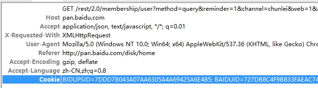
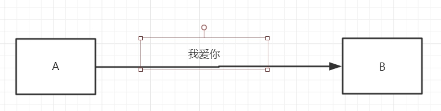
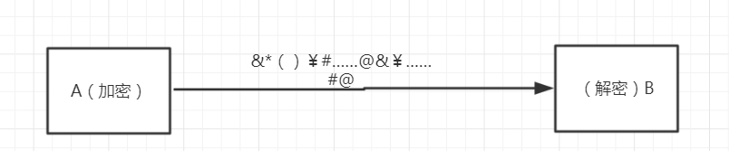
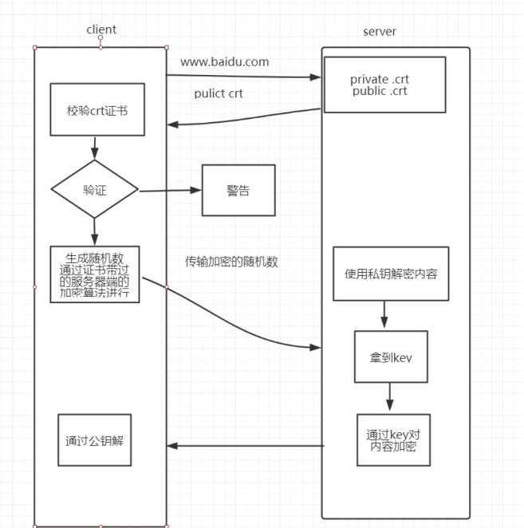

# HTTP协议的概述

1.  客户端和服务器端

 

 

2. 资源

   html/文本、word、avi电影、其他资源

3. 媒体类型

   MIME类型（*MIME* (Multipurpose Internet Mail Extensions) 是描述消息内容类型的因特网标准。 *MIME*消息能包含文本、图像、音频、视频以及其他应用程序专用的数据。 ）

   text/html

   image/jpeg 

4. URI和URL

   URI：web服务器资源的名字，例如： index.html

   URL：`http://www.gupaoedu.com:80/java/index.html[?query-string] #location`

   schema: http/https/ftp.

   host: web服务器的ip地址或者域名

   port: 服务端端口， http默认访问的端口是80

   path: 资源访问路径

   query-string: 查询参数

5. 方法

   GET/PUT/DELETE/POST/HEAD

 HEAD：主要用于确认 URL 的有效性以及资源更新的日期时间等。

### 

# 报文

request参数、 response响应参数

request消息结构包含三部分： （起始行、首部字段、主体） 

 

METHOD /path / http/version-number

Header-Name:value

空行

主体 optional request body

 

 

 

 

response

http/version-number   status code message
header-name:value

 

body

 

 

 

# 状态码

http/1.1版本的协议里面定义了五种类型的状态码

1XX    提示信息

2XX    成功

3XX    重定向

4XX    客户端错误

5XX    服务器端的错误 

 

# 缓存

HTTP协议的特点

1. 无状态

   cookie+session

2. 多次请求

3. 基于TCP协议

 

 

# HTTPS

SSL/TLS

目前最新：SSL 3.0 

ISOC  在 SSL 的基础上发布了升级版本 TLS1.2（最新）

 

## HTTPS的工作原理

 

 

### 第一步， 使用对称加解密

 

 

 

### 第二步，密钥是公开的，所有的客户端都可以拿到

 

 

### 第三步 针对不同的客户端使用不同的密钥

 

 

问题：协商过程是没有加密的，所以还会出现被截断的问题

 

### 第四步：使用非对称加密

非对称：公钥和私钥的概念 

 

 

问题： 客户端如何拿到公钥

1. 服务器端把公钥发送给每一个客户端

2. 服务器端把公钥放到远程服务器，客户端可以请求到

3. 让浏览器保存所有的公钥（不现实）

 

### 第五步 公钥被调包的问题按照上面的方案，永远存在。

 

 

### 第六步：使用第三方机构来解决

 

通过第三方机构，使用第三方机构的私钥对我们【需要传输的公钥】进行加密

 

 

第七部分


 数字证里面包含的内容：

 公司信息、网站信息、数字证书的算法（指纹）、公钥

 

 

连接过程

 

 

 

# RESTful

REST表述性状态转移

使用WEB标准来做一些准则和约束。

 

RESTful的基本概念

1. 在REST中，一切的内容都被认为是一种资源

2. 每个资源都由URI唯一标识

3. 使用统一的接口处理资源请求（POST/GET/PUT/DELETE/HEAD）

4. 无状态（每次请求之前是无关联，没有session）

 

## 资源和URI

1. [/]表示资源的层级关系

2. ？过滤资源

3. 使用_或者-让URI的可读性更好

 

## 统一接口

 GET  获取某个资源。 幂等（取多少次结果都没有变化）

 POST 创建一个新的资源

 PUT 替换某个已有的资源（更新操作） ， 幂等（更新多次只保存一个结果）

 DELETE 删除某个资源


 PATCH/HEAD （用的比较少）

 

## 资源表述

 

MIME 类型（）

accept: text/xml   html文件

Content-Type告诉客户端资源的表述形式

 

 

## 资源链接

 超媒体即应用状态引擎（可以做多层链接）

 https://api.github.com/repos/github

```
{
  "message": "Not Found",
  "documentation_url": "https://developer.github.com/v3"
}
```


## 状态转移

 服务器端不应该保存客户端状态。

 

应用状态 -> 服务器端不保存应用状态

 

 

访问订单   根据接口去查询

访问商品   查询


**待整理查询资料** 

 

## RESTful的最佳设计

 

1. 域名

http://api.gupaoedu.com 

<http://api/gupaoedu.com/api>

 

2. 版本

http://api.gupaoedu.com/v1/user/1

header里面维护版本


3. 路径

http://api.gupaoedu.com/v1/users_list  //获取用户列表

 

http://api.gupaoedu.com/v1/goods-list  //商品列表

 

http://api.gupaoedu.com/v1/users/{id}


4. 过滤信息

<https://api.github.com/user/repos?page=2&per_page=100>

<https://developer.github.com/v3/#rate-limiting> 


5.  状态码

- 业务状态码

- http状态码