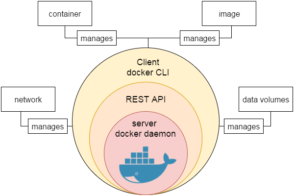

# 前言

Docker 容器化引擎

> 本文内容均来自：【千锋-李伟民老师博客，推荐大家学习】http://www.funtl.com/
>
> 基于以上部分内容做一定的修改

# Docker 简介

## 什么是 Docker

Docker 最初是 dotCloud 公司创始人 Solomon Hykes 在法国期间发起的一个公司内部项目，它是基于 dotCloud 公司多年云服务技术的一次革新，并于 [2013 年 3 月以 Apache 2.0 授权协议开源](https://en.wikipedia.org/wiki/Docker_(software))，主要项目代码在 [GitHub](https://github.com/moby/moby) 上进行维护。Docker 项目后来还加入了 Linux 基金会，并成立推动 [开放容器联盟（OCI）](https://www.opencontainers.org/)。

Docker 自开源后受到广泛的关注和讨论，至今其 GitHub 项目已经超过 4 万 6 千个星标和一万多个 fork。甚至由于 Docker 项目的火爆，在 2013 年底，[dotCloud 公司决定改名为 Docker](https://blog.docker.com/2013/10/dotcloud-is-becoming-docker-inc/)。Docker 最初是在 Ubuntu 12.04 上开发实现的；Red Hat 则从 RHEL 6.5 开始对 Docker 进行支持；Google 也在其 PaaS 产品中广泛应用 Docker。

Docker 使用 Google 公司推出的 [Go 语言](https://golang.org/) 进行开发实现，基于 Linux 内核的 [cgroup](https://zh.wikipedia.org/wiki/Cgroups)，[namespace](https://en.wikipedia.org/wiki/Linux_namespaces)，以及 [AUFS](https://en.wikipedia.org/wiki/Aufs) 类的 [Union FS](https://en.wikipedia.org/wiki/Union_mount) 等技术，对进程进行封装隔离，属于 [操作系统层面的虚拟化技术](https://en.wikipedia.org/wiki/Operating-system-level_virtualization)。由于隔离的进程独立于宿主和其它的隔离的进程，因此也称其为容器。最初实现是基于 [LXC](https://linuxcontainers.org/lxc/introduction/)，从 0.7 版本以后开始去除 LXC，转而使用自行开发的 [libcontainer](https://github.com/docker/libcontainer)，从 1.11 开始，则进一步演进为使用 [runC](https://github.com/opencontainers/runc) 和 [containerd](https://github.com/containerd/containerd)。

Docker 在容器的基础上，进行了进一步的封装，从文件系统、网络互联到进程隔离等等，极大的简化了容器的创建和维护。使得 Docker 技术比虚拟机技术更为轻便、快捷。

下面的图片比较了 Docker 和传统虚拟化方式的不同之处。传统虚拟机技术是虚拟出一套硬件后，在其上运行一个完整操作系统，在该系统上再运行所需应用进程；而容器内的应用进程直接运行于宿主的内核，容器内没有自己的内核，而且也没有进行硬件虚拟。因此容器要比传统虚拟机更为轻便。

## 为什么要使用 Docker

作为一种新兴的虚拟化方式，Docker 跟传统的虚拟化方式相比具有众多的优势。

**更高效的利用系统资源**

由于容器不需要进行硬件虚拟以及运行完整操作系统等额外开销，Docker 对系统资源的利用率更高。无论是应用执行速度、内存损耗或者文件存储速度，都要比传统虚拟机技术更高效。因此，相比虚拟机技术，一个相同配置的主机，往往可以运行更多数量的应用。

**更快速的启动时间**

传统的虚拟机技术启动应用服务往往需要数分钟，而 Docker 容器应用，由于直接运行于宿主内核，无需启动完整的操作系统，因此可以做到秒级、甚至毫秒级的启动时间。大大的节约了开发、测试、部署的时间。

**一致的运行环境**

开发过程中一个常见的问题是环境一致性问题。由于开发环境、测试环境、生产环境不一致，导致有些 bug 并未在开发过程中被发现。而 Docker 的镜像提供了除内核外完整的运行时环境，确保了应用运行环境一致性，从而不会再出现 *「这段代码在我机器上没问题啊」* 这类问题。

**持续交付和部署**

对开发和运维（[DevOps](https://zh.wikipedia.org/wiki/DevOps)）人员来说，最希望的就是一次创建或配置，可以在任意地方正常运行。

使用 Docker 可以通过定制应用镜像来实现持续集成、持续交付、部署。开发人员可以通过 `Dockerfile` 来进行镜像构建，并结合 [持续集成(Continuous Integration)](https://en.wikipedia.org/wiki/Continuous_integration) 系统进行集成测试，而运维人员则可以直接在生产环境中快速部署该镜像，甚至结合 [持续部署(Continuous Delivery/Deployment)](https://en.wikipedia.org/wiki/Continuous_delivery) 系统进行自动部署。

而且使用 `Dockerfile` 使镜像构建透明化，不仅仅开发团队可以理解应用运行环境，也方便运维团队理解应用运行所需条件，帮助更好的生产环境中部署该镜像。

**更轻松的迁移**

由于 Docker 确保了执行环境的一致性，使得应用的迁移更加容易。Docker 可以在很多平台上运行，无论是物理机、虚拟机、公有云、私有云，甚至是笔记本，其运行结果是一致的。因此用户可以很轻易的将在一个平台上运行的应用，迁移到另一个平台上，而不用担心运行环境的变化导致应用无法正常运行的情况。

**更轻松的维护和扩展**

Docker 使用的分层存储以及镜像的技术，使得应用重复部分的复用更为容易，也使得应用的维护更新更加简单，基于基础镜像进一步扩展镜像也变得非常简单。此外，Docker 团队同各个开源项目团队一起维护了一大批高质量的 [官方镜像](https://store.docker.com/search?q=&source=verified&type=image)，既可以直接在生产环境使用，又可以作为基础进一步定制，大大的降低了应用服务的镜像制作成本。

**对比传统虚拟机总结**

| 特性       | 容器               | 虚拟机      |
| ---------- | ------------------ | ----------- |
| 启动       | 秒级               | 分钟级      |
| 硬盘使用   | 一般为 `MB`        | 一般为 `GB` |
| 性能       | 接近原生           | 弱于        |
| 系统支持量 | 单机支持上千个容器 | 一般几十个  |

# Docker 基本概念

## Docker 引擎

Docker 引擎是一个包含以下主要组件的客户端服务器应用程序。

- 一种服务器，它是一种称为守护进程并且长时间运行的程序。
- REST API 用于指定程序可以用来与守护进程通信的接口，并指示它做什么。
- 一个有命令行界面 (CLI) 工具的客户端。

Docker 引擎组件的流程如下图所示：

## Docker 架构

Docker 使用客户端-服务器 (C/S) 架构模式，使用远程 API 来管理和创建 Docker 容器。

Docker 容器通过 Docker 镜像来创建。

**容器与镜像**的关系类似于**面向对象**编程中的**对象与类**。

| Docker | 面向对象 |
| ------ | -------- |
| 容器   | 对象     |
| 镜像   | 类       |

| 标题                | 说明                                                         |
| ------------------- | ------------------------------------------------------------ |
| **镜像**(Images)    | Docker 镜像是用于创建 Docker 容器的模板。                    |
| **容器**(Container) | 容器是独立运行的一个或一组应用。                             |
| **客户端**(Client)  | Docker 客户端通过命令行或者其他工具使用 Docker API (<https://docs.docker.com/reference/api/docker_remote_api>) 与 Docker 的守护进程通信。 |
| **主机**(Host)      | 一个物理或者虚拟的机器用于执行 Docker 守护进程和容器。       |
| **仓库**(Registry)  | Docker 仓库用来保存镜像，可以理解为代码控制中的代码仓库。Docker Hub([https://hub.docker.com](https://hub.docker.com/)) 提供了庞大的镜像集合供使用。 |
| **Docker Machine**  | Docker Machine是一个简化Docker安装的命令行工具，通过一个简单的命令行即可在相应的平台上安装Docker，比如VirtualBox、 Digital Ocean、Microsoft Azure。 |

## Docker 镜像

我们都知道，操作系统分为内核和用户空间。对于 Linux 而言，内核启动后，会挂载 `root` 文件系统为其提供用户空间支持。而 Docker 镜像（Image），就相当于是一个 `root` 文件系统。比如官方镜像 `ubuntu:16.04` 就包含了完整的一套 Ubuntu 16.04 最小系统的 `root` 文件系统。

Docker 镜像是一个特殊的文件系统，除了提供容器运行时所需的程序、库、资源、配置等文件外，还包含了一些为运行时准备的一些配置参数（如匿名卷、环境变量、用户等）。镜像不包含任何动态数据，其内容在构建之后也不会被改变。

**分层存储**

因为镜像包含操作系统完整的 `root` 文件系统，其体积往往是庞大的，因此在 Docker 设计时，就充分利用 [Union FS](https://en.wikipedia.org/wiki/Union_mount) 的技术，将其设计为分层存储的架构。所以严格来说，镜像并非是像一个 ISO 那样的打包文件，镜像只是一个虚拟的概念，其实际体现并非由一个文件组成，而是由一组文件系统组成，或者说，由多层文件系统联合组成。

镜像构建时，会一层层构建，前一层是后一层的基础。每一层构建完就不会再发生改变，后一层上的任何改变只发生在自己这一层。比如，删除前一层文件的操作，实际不是真的删除前一层的文件，而是仅在当前层标记为该文件已删除。在最终容器运行的时候，虽然不会看到这个文件，但是实际上该文件会一直跟随镜像。因此，在构建镜像的时候，需要额外小心，每一层尽量只包含该层需要添加的东西，任何额外的东西应该在该层构建结束前清理掉。

分层存储的特征还使得镜像的复用、定制变的更为容易。甚至可以用之前构建好的镜像作为基础层，然后进一步添加新的层，以定制自己所需的内容，构建新的镜像。

关于镜像构建，将会在后续相关章节中做进一步的讲解。

## Docker 容器

镜像（`Image`）和容器（`Container`）的关系，就像是面向对象程序设计中的 `类` 和 `实例` 一样，镜像是静态的定义，容器是镜像运行时的实体。容器可以被创建、启动、停止、删除、暂停等。

容器的实质是进程，但与直接在宿主执行的进程不同，容器进程运行于属于自己的独立的 [命名空间](https://en.wikipedia.org/wiki/Linux_namespaces)。因此容器可以拥有自己的 `root` 文件系统、自己的网络配置、自己的进程空间，甚至自己的用户 ID 空间。容器内的进程是运行在一个隔离的环境里，使用起来，就好像是在一个独立于宿主的系统下操作一样。这种特性使得容器封装的应用比直接在宿主运行更加安全。也因为这种隔离的特性，很多人初学 Docker 时常常会混淆容器和虚拟机。

前面讲过镜像使用的是分层存储，容器也是如此。每一个容器运行时，是以镜像为基础层，在其上创建一个当前容器的存储层，我们可以称这个为容器运行时读写而准备的存储层为**容器存储层**。

容器存储层的生存周期和容器一样，容器消亡时，容器存储层也随之消亡。因此，任何保存于容器存储层的信息都会随容器删除而丢失。

按照 Docker 最佳实践的要求，容器不应该向其存储层内写入任何数据，容器存储层要保持无状态化。所有的文件写入操作，都应该使用 `数据卷（Volume）`、或者绑定宿主目录，在这些位置的读写会跳过容器存储层，直接对宿主（或网络存储）发生读写，其性能和稳定性更高。

数据卷的生存周期独立于容器，容器消亡，数据卷不会消亡。因此，使用数据卷后，容器删除或者重新运行之后，数据却不会丢失。

## Docker 仓库

镜像构建完成后，可以很容易的在当前宿主机上运行，但是，如果需要在其它服务器上使用这个镜像，我们就需要一个集中的存储、分发镜像的服务，`Docker Registry` 就是这样的服务。

一个 **Docker Registry** 中可以包含多个**仓库**（`Repository`）；每个仓库可以包含多个**标签**（`Tag`）；每个标签对应一个镜像。

通常，一个仓库会包含同一个软件不同版本的镜像，而标签就常用于对应该软件的各个版本。我们可以通过 `<仓库名>:<标签>` 的格式来指定具体是这个软件哪个版本的镜像。如果不给出标签，将以 `latest` 作为默认标签。

以 [Ubuntu 镜像](https://store.docker.com/images/ubuntu) 为例，`ubuntu` 是仓库的名字，其内包含有不同的版本标签，如，`14.04`, `16.04`。我们可以通过 `ubuntu:14.04`，或者 `ubuntu:16.04` 来具体指定所需哪个版本的镜像。如果忽略了标签，比如 `ubuntu`，那将视为 `ubuntu:latest`。

仓库名经常以 *两段式路径* 形式出现，比如 `jwilder/nginx-proxy`，前者往往意味着 Docker Registry 多用户环境下的用户名，后者则往往是对应的软件名。但这并非绝对，取决于所使用的具体 Docker Registry 的软件或服务。

**公有 Docker Registry**

Docker Registry 公开服务是开放给用户使用、允许用户管理镜像的 Registry 服务。一般这类公开服务允许用户免费上传、下载公开的镜像，并可能提供收费服务供用户管理私有镜像。

最常使用的 Registry 公开服务是官方的 [Docker Hub](https://hub.docker.com/)，这也是默认的 Registry，并拥有大量的高质量的官方镜像。除此以外，还有 [CoreOS](https://coreos.com/) 的 [Quay.io](https://quay.io/repository/)，CoreOS 相关的镜像存储在这里；Google 的 [Google Container Registry](https://cloud.google.com/container-registry/)，[Kubernetes](http://kubernetes.io/) 的镜像使用的就是这个服务。

由于某些原因，在国内访问这些服务可能会比较慢。国内的一些云服务商提供了针对 Docker Hub 的镜像服务（`Registry Mirror`），这些镜像服务被称为**加速器**。常见的有 [阿里云加速器](https://cr.console.aliyun.com/#/accelerator)、[DaoCloud 加速器](https://www.daocloud.io/mirror#accelerator-doc) 等。使用加速器会直接从国内的地址下载 Docker Hub 的镜像，比直接从 Docker Hub 下载速度会提高很多。

国内也有一些云服务商提供类似于 Docker Hub 的公开服务。比如 [时速云镜像仓库](https://hub.tenxcloud.com/)、[网易云镜像服务](https://c.163.com/hub#/m/library/)、[DaoCloud 镜像市场](https://hub.daocloud.io/)、[阿里云镜像库](https://cr.console.aliyun.com/) 等。

**私有 Docker Registry**

除了使用公开服务外，用户还可以在本地搭建私有 Docker Registry。Docker 官方提供了 [Docker Registry](https://store.docker.com/images/registry/) 镜像，可以直接使用做为私有 Registry 服务。

开源的 Docker Registry 镜像只提供了 [Docker Registry API](https://docs.docker.com/registry/spec/api/) 的服务端实现，足以支持 `docker` 命令，不影响使用。但不包含图形界面，以及镜像维护、用户管理、访问控制等高级功能。在官方的商业化版本 [Docker Trusted Registry](https://docs.docker.com/datacenter/dtr/2.0/) 中，提供了这些高级功能。

除了官方的 Docker Registry 外，还有第三方软件实现了 Docker Registry API，甚至提供了用户界面以及一些高级功能。比如，[VMWare Harbor](https://github.com/vmware/harbor) 和 [Sonatype Nexus](https://www.sonatype.com/docker)。

