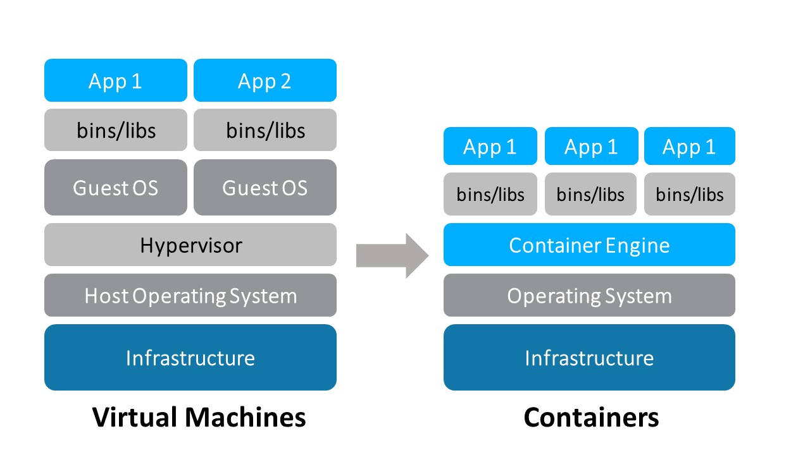
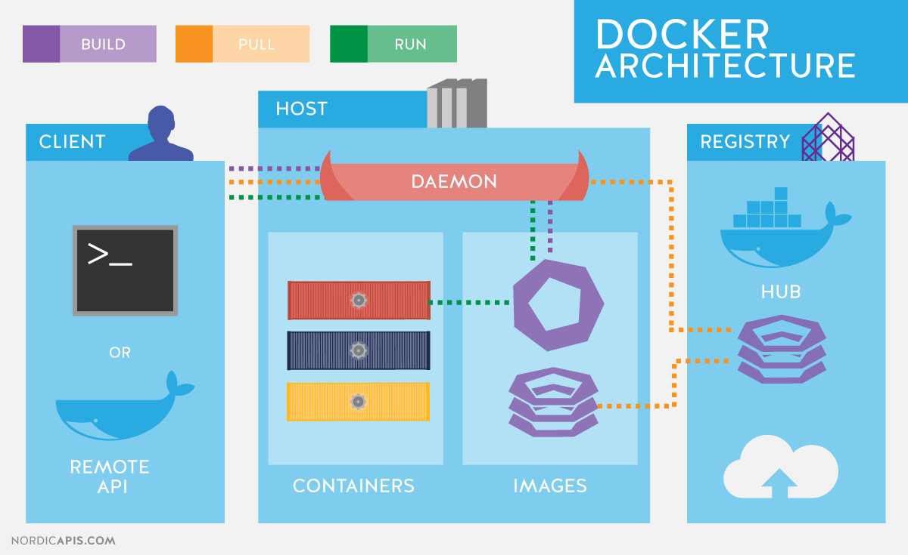
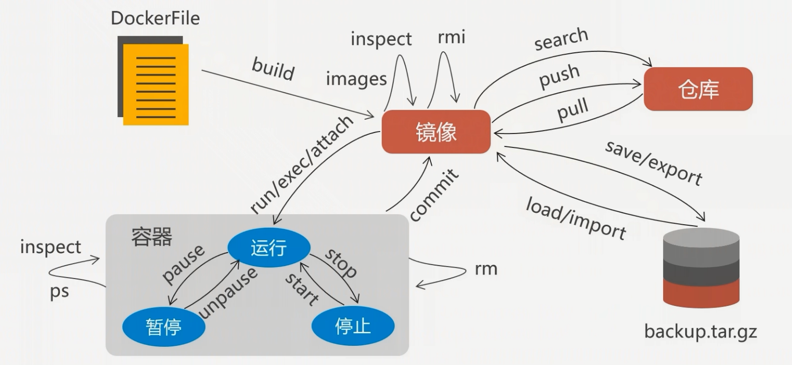

<!-- TOC -->

- [一、Docker 快速入门](#一docker-快速入门)
    - [初探 Docker](#初探-docker)
        - [什么是 Docker](#什么是-docker)
        - [为什么要使用 Docker](#为什么要使用-docker)
    - [CentOS 7 安装 Docker](#centos-7-安装-docker)
    - [Docker 镜像加速器](#docker-镜像加速器)
    - [Docker 常用命令](#docker-常用命令)
        - [1. 启动、停止、重启服务](#1-启动停止重启服务)
        - [2. 拉取一个镜像，启动容器](#2-拉取一个镜像启动容器)
        - [3. 启动的容器列表](#3-启动的容器列表)
        - [4. 查看所有的容器](#4-查看所有的容器)
        - [5. 启动、停止、重启某个容器](#5-启动停止重启某个容器)
        - [6. 查看指定容器的日志记录](#6-查看指定容器的日志记录)
        - [7. 删除某个容器，若正在运行，需要先停止](#7-删除某个容器若正在运行需要先停止)
        - [8. 删除容器](#8-删除容器)
        - [9. 删除镜像](#9-删除镜像)
        - [10. 删除虚悬镜像](#10-删除虚悬镜像)
        - [11. 镜像导入与导出](#11-镜像导入与导出)
- [二、Docker File 镜像构建](#二docker-file-镜像构建)
- [三、Docker Compose](#三docker-compose)
    - [docker-compose 命令安装](#docker-compose-命令安装)
        - [1. 安装 python-pip](#1-安装-python-pip)
        - [2. 安装 Docker-Compose](#2-安装-docker-compose)
    - [docker-compose.yml 规范](#docker-composeyml-规范)
- [四、Docker 实战](#四docker-实战)
    - [实战1：快速搭建 MySQL](#实战1快速搭建-mysql)
    - [实战2：快速搭建 phpMyAdmin](#实战2快速搭建-phpmyadmin)
    - [实战3：快速搭建 GitLab](#实战3快速搭建-gitlab)
- [参考资料](#参考资料)

<!-- /TOC -->
# 一、Docker 快速入门

本文部分内容引用来自：【千锋-李卫民老师博客，推荐大家学习】http://www.funtl.com/

A simple, interactive and fun playground to learn Docker：[Play with Docker](https://labs.play-with-docker.com/)


## 初探 Docker

### 什么是 Docker

　　Docker 最初是 dotCloud 公司创始人 Solomon Hykes 在法国期间发起的一个公司内部项目，它是基于 dotCloud 公司多年云服务技术的一次革新，并于 [2013 年 3 月以 Apache 2.0 授权协议开源](https://en.wikipedia.org/wiki/Docker_(software))，主要项目代码在 [GitHub](https://github.com/moby/moby) 上进行维护。Docker 项目后来还加入了 Linux 基金会，并成立推动 [开放容器联盟（OCI）](https://www.opencontainers.org/)。

　　Docker 自开源后受到广泛的关注和讨论，至今其 GitHub 项目已经超过 4 万 6 千个星标和一万多个 fork。甚至由于 Docker 项目的火爆，在 2013 年底，[dotCloud 公司决定改名为 Docker](https://blog.docker.com/2013/10/dotcloud-is-becoming-docker-inc/)。Docker 最初是在 Ubuntu 12.04 上开发实现的；Red Hat 则从 RHEL 6.5 开始对 Docker 进行支持；Google 也在其 PaaS 产品中广泛应用 Docker。

　　Docker 使用 Google 公司推出的 [Go 语言](https://golang.org/) 进行开发实现，基于 Linux 内核的 [cgroup](https://zh.wikipedia.org/wiki/Cgroups)，[namespace](https://en.wikipedia.org/wiki/Linux_namespaces)，以及 [AUFS](https://en.wikipedia.org/wiki/Aufs) 类的 [Union FS](https://en.wikipedia.org/wiki/Union_mount) 等技术，对进程进行封装隔离，属于 [操作系统层面的虚拟化技术](https://en.wikipedia.org/wiki/Operating-system-level_virtualization)。由于隔离的进程独立于宿主和其它的隔离的进程，因此也称其为容器。最初实现是基于 [LXC](https://linuxcontainers.org/lxc/introduction/)，从 0.7 版本以后开始去除 LXC，转而使用自行开发的 [libcontainer](https://github.com/docker/libcontainer)，从 1.11 开始，则进一步演进为使用 [runC](https://github.com/opencontainers/runc) 和 [containerd](https://github.com/containerd/containerd)。

　　Docker 在容器的基础上，进行了进一步的封装，从文件系统、网络互联到进程隔离等等，极大的简化了容器的创建和维护。使得 Docker 技术比虚拟机技术更为轻便、快捷。

　　下面的图片比较了 Docker 和传统虚拟化方式的不同之处。传统虚拟机技术是虚拟出一套硬件后，在其上运行一个完整操作系统，在该系统上再运行所需应用进程；而容器内的应用进程直接运行于宿主的内核，容器内没有自己的内核，而且也没有进行硬件虚拟。因此容器要比传统虚拟机更为轻便。




### 为什么要使用 Docker



　　作为一种新兴的虚拟化方式，Docker 跟传统的虚拟化方式相比具有众多的优势。

**更高效的利用系统资源**

　　由于容器不需要进行硬件虚拟以及运行完整操作系统等额外开销，Docker 对系统资源的利用率更高。无论是应用执行速度、内存损耗或者文件存储速度，都要比传统虚拟机技术更高效。因此，相比虚拟机技术，一个相同配置的主机，往往可以运行更多数量的应用。

**更快速的启动时间**

　　传统的虚拟机技术启动应用服务往往需要数分钟，而 Docker 容器应用，由于直接运行于宿主内核，无需启动完整的操作系统，因此可以做到秒级、甚至毫秒级的启动时间。大大的节约了开发、测试、部署的时间。

**一致的运行环境**

　　开发过程中一个常见的问题是环境一致性问题。由于开发环境、测试环境、生产环境不一致，导致有些 bug 并未在开发过程中被发现。而 Docker 的镜像提供了除内核外完整的运行时环境，确保了应用运行环境一致性，从而不会再出现 *「这段代码在我机器上没问题啊」* 这类问题。

**持续交付和部署**

　　对开发和运维（[DevOps](https://zh.wikipedia.org/wiki/DevOps)）人员来说，最希望的就是一次创建或配置，可以在任意地方正常运行。

　　使用 Docker 可以通过定制应用镜像来实现持续集成、持续交付、部署。开发人员可以通过 `Dockerfile` 来进行镜像构建，并结合 [持续集成(Continuous Integration)](https://en.wikipedia.org/wiki/Continuous_integration) 系统进行集成测试，而运维人员则可以直接在生产环境中快速部署该镜像，甚至结合 [持续部署(Continuous Delivery/Deployment)](https://en.wikipedia.org/wiki/Continuous_delivery) 系统进行自动部署。

　　而且使用 `Dockerfile` 使镜像构建透明化，不仅仅开发团队可以理解应用运行环境，也方便运维团队理解应用运行所需条件，帮助更好的生产环境中部署该镜像。

**更轻松的迁移**

　　由于 Docker 确保了执行环境的一致性，使得应用的迁移更加容易。Docker 可以在很多平台上运行，无论是物理机、虚拟机、公有云、私有云，甚至是笔记本，其运行结果是一致的。因此用户可以很轻易的将在一个平台上运行的应用，迁移到另一个平台上，而不用担心运行环境的变化导致应用无法正常运行的情况。

**更轻松的维护和扩展**

　　Docker 使用的分层存储以及镜像的技术，使得应用重复部分的复用更为容易，也使得应用的维护更新更加简单，基于基础镜像进一步扩展镜像也变得非常简单。此外，Docker 团队同各个开源项目团队一起维护了一大批高质量的 [官方镜像](https://store.docker.com/search?q=&source=verified&type=image)，既可以直接在生产环境使用，又可以作为基础进一步定制，大大的降低了应用服务的镜像制作成本。

**对比传统虚拟机总结**

| 特性       | 容器               | 虚拟机      |
| ---------- | ------------------ | ----------- |
| 启动       | 秒级               | 分钟级      |
| 硬盘使用   | 一般为 `MB`        | 一般为 `GB` |
| 性能       | 接近原生           | 弱于        |
| 系统支持量 | 单机支持上千个容器 | 一般几十个  |


## CentOS 7 安装 Docker

1. 先更新 yum 软件管理器，然后再安装 Docker

```shell
[root@localhost /] yum -y update
[root@localhost /] yum install -y docker
```

　　说明：上述 `-y` 代表选择程序安装中的 yes 选项

　　或是，直接安装 

```shell
yum install docker
```

2. 验证安装，查看 Docker 版本信息

```shell
[root@localhost /] docker -v
Docker version 1.13.1, build 8633870/1.13.1
You have new mail in /var/spool/mail/root
```

3. 启动 / 重启 / 关闭 Docker 

```shell
[root@localhost /] docker start
[root@localhost /] docker restart
[root@localhost /] docker stop
```


【意外情况】service docker start 无法启动问题

- centos 安装 docker 显示 No package docker available，原因是 yum 没有找到 docker 的包，需要 epel 第三方软件库，运行下面的命令

  `sudo yum install epel-release`

- [【亲测有效】Centos安装完成docker后启动docker报错docker](http://www.cnblogs.com/ECJTUACM-873284962/p/9362840.html)


1. 配置yum源

   vim /etc/yum.repos.d/docker.repo

```ini
[dockerrepo]
name=Docker Repository
baseurl=https://yum.dockerproject.org/repo/main/centos/$releasever/
enabled=1
gpgcheck=1
gpgkey=https://yum.dockerproject.org/gpg
```

2. 通过yum安装

```
yum install docker-engine
service docker start
service docker status
```

3. 日志

```
vim /var/log/docker
```


在 Ubuntu 16.04 LTS 上 离线安装 Docker / Docker-compose - TonyZhang24 - 博客园
https://www.cnblogs.com/atuotuo/p/9272368.html


## Docker 镜像加速器

1. 加速器服务

   [DaoCloud 加速器，一行命令，镜像万千](https://www.daocloud.io/mirror)

   [阿里云 - 开发者平台 - 容器 hub](https://dev.aliyun.com/search.html)

2. 配置 Docker 加速器

　　以 Linux 为例

```shell
curl -sSL https://get.daocloud.io/daotools/set_mirror.sh | sh -s http://f1361db2.m.daocloud.io
```

　　该脚本可以将 --registry-mirror 加入到你的 Docker 配置文件 /etc/docker/daemon.json 中。适用于 Ubuntu14.04、Debian、CentOS6 、CentOS7、Fedora、Arch Linux、openSUSE Leap 42.1，其他版本可能有细微不同。更多详情请访问文档。

　　删除 /etc/docker/daemon.json 中最后一个逗号，重启 Docker 服务即可


## Docker 常用命令



### 1. 启动、停止、重启服务

```shell
[root@localhost ~]# service docker restart
Redirecting to /bin/systemctl restart docker.service
[root@localhost ~]# service docker stop
Redirecting to /bin/systemctl stop docker.service
[root@localhost ~]# service docker start
Redirecting to /bin/systemctl start docker.service
```

### 2. 拉取一个镜像，启动容器

```shell
[root@localhost ~]# docker pull centos
[root@localhost ~]# docker run -it -v /centos_dir:/docker_dir --name biodwhu-1 centos
```

- -i：允许我们对容器内的 (STDIN) 进行交互
- -t：在新容器内指定一个伪终端或终端
- -v：是挂在宿机目录， /centos_dir 是宿机目录，/docker_dir 是当前 Docker 容器的目录，宿机目录必须是绝对的。
- -p：端口映射
- --name：是给容器起一个名字，可省略，省略的话 docker 会随机产生一个名字

- --restart：always

### 3. 启动的容器列表

```shell
[root@localhost ~]# docker ps
```

### 4. 查看所有的容器

```shell
[root@localhost ~]# docker ps -a
```

### 5. 启动、停止、重启某个容器

```shell
[root@localhost ~]# docker start biodwhu-1
biodwhu-1
[root@localhost ~]# docker stop biodwhu-2
biodwhu-2
[root@localhost ~]# docker restart biodwhu-3
biodwhu-3
```

### 6. 查看指定容器的日志记录

```shell
[root@localhost ~]# docker logs -f biodwhu-1
```

### 7. 删除某个容器，若正在运行，需要先停止

```shell
[root@localhost ~]# docker rm biodwhu-1
Error response from daemon: You cannot remove a running container 2d48fc5b7c17b01e6247cbc012013306faf1e54f24651d5e16d6db4e15f92d33. Stop the container before attempting removal or use -f
[root@localhost ~]# docker stop biodwhu-1
biodwhu-1
[root@localhost ~]# docker rm biodwhu-1
biodwhu-1
```

### 8. 删除容器

```shell
# 删除某个容器
[root@localhost ~]# docker rm f3b346204a39

# 删除所有容器
[root@localhost ~]# docker stop $(docker ps -a -q)
[root@localhost ~]# docker rm $(docker ps -a -q)
```

### 9. 删除镜像

```shell
# 删除某个镜像
[root@localhost ~]# docker rmi docker.io/mysql:5.6

# 删除所有镜像
[root@localhost ~]# docker rmi $(docker images -q)

# 强制删除所有镜像
[root@localhost ~]# docker rmi -f $(docker images -q)
```

### 10. 删除虚悬镜像

我们在 build 镜像的过程中，可能会产生一些临时的不具有名称也没有作用的镜像他们的名称一般都是 `<none>` ,我们可以执行下面的命令将其清除掉：

```shell
[root@localhost ~]# docker rmi $(docker images -f "dangling=true" -q)
# 或者
[root@localhost ~]# docker image prune -a -f
```

### 11. 镜像导入与导出

保存镜像

```shell
[root@localhost ~]# docker save a46c2a2722b9 > /var/docker/images_save/mysql.tar.gz
```

加载镜像

```shell
[root@localhost ~]# docker load -i /var/docker/images_save/mysql.tar.gz
```


# 二、Docker File 镜像构建

# 三、Docker Compose

## docker-compose 命令安装

Docker-Compose 是一个部署多个容器的简单但是非常必要的工具.

安装 Docker-Compose 之前，请先安装 python-pip

### 1. 安装 python-pip

1. 首先检查 Linux 有没有安装 python-pip 包，终端执行 pip -v

```shell
[root@localhost ~]# pip -V
-bash: pip: command not found
```

2. 没有 python-pip 包就执行命令

```shell
[root@localhost ~]# yum -y install epel-release
```

3. 执行成功之后，再次执行

```shell
[root@localhost ~]# yum -y install python-pip
```

4. 对安装好的 pip 进行升级

```shell
[root@localhost ~]# pip install --upgrade pip
```

### 2. 安装 Docker-Compose

1. 终端执行

```shell
[root@localhost ~]# pip install docker-compose
```

2. 检查 docker-compose 安装

```shell
[root@localhost ~]# docker-compose -version
```

参考资料：

- [CentOS7下安装Docker-Compose - YatHo - 博客园](https://www.cnblogs.com/YatHo/p/7815400.html)

## docker-compose.yml 规范


# 四、Docker 实战

## 实战1：快速搭建 MySQL

- 官方镜像仓库

  [https://hub.docker.com/_/mysql/](https://hub.docker.com/_/mysql/)

- docker-compose.yml

```yml
version: '3.1'
services:
  mysql:
    restart: always
    image: mysql:5.6
    container_name: mysql
    ports:
      - 3306:3306
    environment:
      TZ: Asia/Shanghai
      MYSQL_ROOT_PASSWORD: 123456
    command:
      --character-set-server=utf8mb4
      --collation-server=utf8mb4_general_ci
      --explicit_defaults_for_timestamp=true
      --lower_case_table_names=1
      --max_allowed_packet=128M
      --sql-mode="STRICT_TRANS_TABLES,NO_AUTO_CREATE_USER,NO_ENGINE_SUBSTITUTION,NO_ZERO_DATE,NO_ZERO_IN_DATE,ERROR_FOR_DIVISION_BY_ZERO"
    volumes:
      - /usr/local/docker/mysql/mysql-data:/var/lib/mysql
```


## 实战2：快速搭建 phpMyAdmin

- 官方镜像仓库

  [phpmyadmin/phpmyadmin](phpmyadmin/phpmyadmin)

- docker-compose.yml

```yml
version: '3.1'
services:
  phpmyadmin:
    image: phpmyadmin/phpmyadmin
    container_name: phpmyadmin
    environment:
     - PMA_ARBITRARY=1
     - PMA_HOST=120.92.17.12
    # - PMA_PORT=3306
    # - PMA_USER=xxx
    # - PMA_PASSWORD=xxx
    restart: always
    ports:
     - 6060:80
    volumes:
     - /sessions
```


## 实战3：快速搭建 GitLab

GitLab 使用163邮箱发送邮件 - 刘锐群的笔记 - CSDN博客
https://blog.csdn.net/liuruiqun/article/details/50000213


gitlab服务器邮箱配置 - weifengCorp - 博客园
https://www.cnblogs.com/weifeng1463/p/8489563.html


twang2218/gitlab-ce-zh - Docker Hub
https://hub.docker.com/r/twang2218/gitlab-ce-zh/

```yml
version: '3'
services:
    web:
      image: 'twang2218/gitlab-ce-zh:10.5'
      restart: always
      hostname: '120.131.11.187'
      environment:
        TZ: 'Asia/Shanghai'
        GITLAB_OMNIBUS_CONFIG: |
          external_url 'http://120.131.11.187:3000'
          gitlab_rails['gitlab_shell_ssh_port'] = 2222
          unicorn['port'] = 8888
          nginx['listen_port'] = 3000
      ports:
        - '3000:3000'
        - '8443:443'
        - '2222:22'
      volumes:
        - /usr/local/docker/gitlab/config:/etc/gitlab
        - /usr/local/docker/gitlab/data:/var/opt/gitlab
        - /usr/local/docker/gitlab/logs:/var/log/gitlab
```


# 参考资料

- [docker前后分离笔记 - 小翼的前端天地](https://my-fe.pub/post/docker-front-and-backend-separation.html#toc-619)
