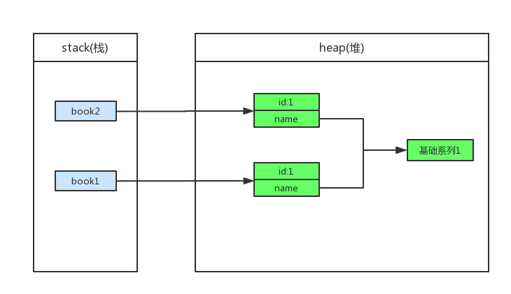
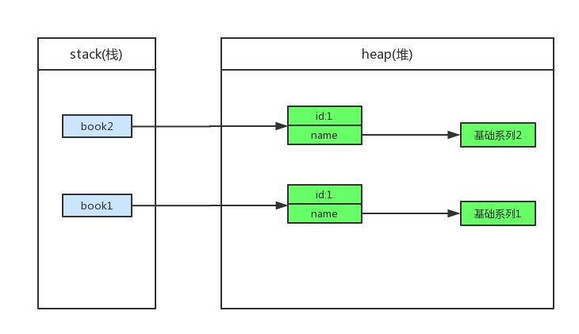
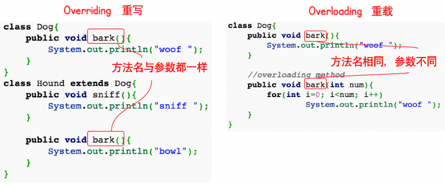
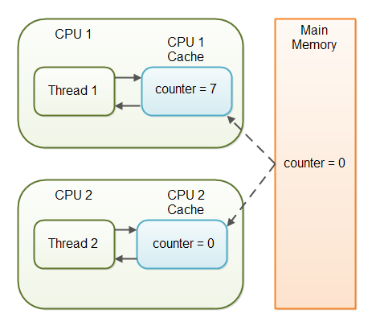

# 前言

本文主要包含 Java 核心基础知识，主要根据以下部分进行节选，选择了个人认为在面试中最为核心的部分。

- 《Java程序员面试笔试宝典》何昊，薛鹏，叶向阳 著
- [《阿里面经OneNote》](https://blog.csdn.net/sinat_22797429/article/details/76293284)

 主要内容：基本概念、面向对象、关键字、基本数据类型与运算、字符串与数组、异常处理、Object 通用方法


# 一、基本概念

## 1. Java程序初始化的顺序是怎么样的

　　在 Java 语言中，当实例化对象时，对象所在类的所有成员变量首先要进行初始化，只有当所有类成员完成初始化后，才会调用对象所在类的构造函数创建象。

**初始化一般遵循3个原则：**

- 静态对象（变量）优先于非静态对象（变量）初始化，静态对象（变量）只初始化一次，而非静态对象（变量）可能会初始化多次；
- 父类优先于子类进行初始化；
- 按照成员变量的定义顺序进行初始化。 即使变量定义散布于方法定义之中，它们依然在任何方法（包括构造函数）被调用之前先初始化；

**加载顺序**

- 父类（静态变量、静态语句块）
- 子类（静态变量、静态语句块）
- 父类（实例变量、普通语句块）
- 父类（构造函数）
- 子类（实例变量、普通语句块）
- 子类（构造函数）


**实例** 

```java
class Base {
    // 1.父类静态代码块
    static {
        System.out.println("Base static block!");
    }
    // 3.父类非静态代码块
    {
        System.out.println("Base block");
    }
    // 4.父类构造器
    public Base() {
        System.out.println("Base constructor!");
    }
}

public class Derived extends Base {
    // 2.子类静态代码块
    static{
        System.out.println("Derived static block!");
    }
    // 5.子类非静态代码块
    {
        System.out.println("Derived block!");
    }
    // 6.子类构造器
    public Derived() {
        System.out.println("Derived constructor!");
    }
    public static void main(String[] args) {
        new Derived();
    }
}
```

结果是：

```
Base static block!
Derived static block!
Base block
Base constructor!
Derived block!
Derived constructor!
```


## 2. Java和C++的区别

- Java 是**纯粹的面向对象语言**，所有的对象都继承自 java.lang.Object，**C++ 为了兼容 C 即支持面向对象也支持面向过程**。
- Java 通过虚拟机从而实现**跨平台特性**，但是 C++ 依赖于**特定的平台**。
- Java 没有指针，它的引用可以理解为安全指针，而 C++ 具有和 C 一样的指针。
- Java 支持**自动垃圾回收**，而 C++ 需要**手动回收**。（C++11 中引入智能指针，使用引用计数法垃圾回收）
- **Java 不支持多重继承**，只能通过实现多个接口来达到相同目的，而 **C++ 支持多重继承**。
- Java 不支持操作符重载，虽然可以对两个 String 对象支持加法运算，但是这是语言内置支持的操作，不属于操作符重载，而 C++ 可以。
- Java 内置了线程的支持，而 C++ 需要依靠第三方库。
- Java 的 **goto 是保留字**，但是不可用，C++ 可以使用 goto。
- Java **不支持条件编译**，C++ 通过 #ifdef #ifndef 等预处理命令从而实现**条件编译**。


参考资料：
- [C++ 工程实践(8)：值语义 - 陈硕 - 博客园](http://www.cnblogs.com/Solstice/archive/2011/08/16/2141515.html)
- [c++11改进我们的程序之垃圾回收](https://www.cnblogs.com/qicosmos/p/3282779.html)


## 3. 反射

### 先看一个知乎回答

　　首先看一个在知乎上的优秀回答吧：

　　反射是什么呢？当我们的程序在运行时，需要动态的加载一些类这些类可能之前用不到所以不用加载到 JVM，而是在运行时根据需要才加载，这样的好处对于服务器来说不言而喻。

　　举个例子我们的项目底层有时是用 mysql，有时用 oracle，需要动态地根据实际情况加载驱动类，这个时候反射就有用了，假设 com.java.dbtest.myqlConnection，com.java.dbtest.oracleConnection 这两个类我们要用，这时候我们的程序就写得比较动态化，通过 Class tc = Class.forName("com.java.dbtest.TestConnection"); 通过类的全类名让 JVM 在服务器中找到并加载这个类，而如果是 Oracle 则传入的参数就变成另一个了。这时候就可以看到反射的好处了，这个动态性就体现出 Java 的特性了！

　　举多个例子，大家如果接触过 spring，会发现当你配置各种各样的 bean 时，是以配置文件的形式配置的，你需要用到哪些 bean 就配哪些，spring 容器就会根据你的需求去动态加载，你的程序就能健壮地运行。


### 什么是反射

　　反射 (Reflection) 是 Java 程序开发语言的特征之一，它允许运行中的 Java 程序获取自身的信息，并且可以操作类或对象的内部属性。通过 Class 获取 class 信息称之为反射（Reflection）

　　简而言之，通过反射，我们可以在运行时获得程序或程序集中每一个类型的成员和成员的信息。

　　程序中一般的对象的类型都是在编译期就确定下来的，而 Java 反射机制可以动态地创建对象并调用其属性，这样的对象的类型在编译期是未知的。所以我们可以通过反射机制直接创建对象，即使这个对象的类型在编译期是未知的。

　　反射的核心是 JVM 在运行时才动态加载类或调用方法/访问属性，它不需要事先（写代码的时候或编译期）知道运行对象是谁。

　　Java 反射框架主要提供以下功能：

　　1. 在运行时判断任意一个对象所属的类

　　2. 在运行时构造任意一个类的对象

　　3. 在运行时判断任意一个类所具有的成员变量和方法（通过反射甚至可以调用 private 方法）

　　4. 在运行时调用任意一个对象的方法

　　**重点**：是运行时而不是编译时


### 主要用途

　　很多人都认为反射在实际的 Java 开发应用中并不广泛，其实不然。

当我们在使用 IDE （如Eclipse，IDEA）时，当我们输入一个对象或类并想调用它的属性或方法时，一按点号，编译器就会自动列出它的属性或方法，这里就会用到反射。

　　**反射最重要的用途就是开发各种通用框架**

　　很多框架（比如 Spring ）都是配置化的（比如通过 XML 文件配置 JavaBean,Action 之类的），为了保证框架的通用性，它们可能需要根据配置文件加载不同的对象或类，调用不同的方法，这个时候就必须用到反射——运行时动态加载需要加载的对象。

　　对与框架开发人员来说，反射虽小但作用非常大，它是各种容器实现的核心。而对于一般的开发者来说，不深入框架开发则用反射用的就会少一点，不过了解一下框架的底层机制有助于丰富自己的编程思想，也是很有益的。

### 获得Class对象

1. 调用运行时类本身的 `.class` 属性

```java
Class clazz1 = Person.class;
System.out.println(clazz1.getName());
```

2. 通过运行时类的对象获取 `getClass();`

```java
Person p = new Person();
Class clazz3 = p.getClass();
System.out.println(clazz3.getName());
```
3. 使用 Class 类的 `forName` 静态方法

```java
public static Class<?> forName(String className)
// 在JDBC开发中常用此方法加载数据库驱动:
Class.forName(driver);
```
4. （了解）通过类的加载器 ClassLoader

```java
ClassLoader classLoader = this.getClass().getClassLoader();
Class clazz5 = classLoader.loadClass(className);
System.out.println(clazz5.getName());
```


参考资料：

- [深入解析Java反射（1） - 基础 | 「浮生若梦」 - sczyh30's blog](https://www.sczyh30.com/posts/Java/java-reflection-1/#%E4%B8%80%E3%80%81%E5%9B%9E%E9%A1%BE%EF%BC%9A%E4%BB%80%E4%B9%88%E6%98%AF%E5%8F%8D%E5%B0%84%EF%BC%9F)
- [学习java应该如何理解反射？ - 知乎](https://www.zhihu.com/question/24304289/answer/147529485)


## 4. 注解

### 什么是注解

　　Annontation 是 Java5 开始引入的新特征，中文名称叫注解。它提供了一种安全的类似注释的机制，用来**将任何的信息或元数据（metadata）与程序元素（类、方法、成员变量等）进行关联**。为程序的元素（类、方法、成员变量）加上更直观更明了的说明，这些说明信息是与程序的业务逻辑无关，并且供指定的工具或框架使用。Annontation 像一种修饰符一样，应用于包、类型、构造方法、方法、成员变量、参数及本地变量的声明语句中。

　　Java 注解是附加在代码中的一些元信息，用于一些工具在编译、运行时进行解析和使用，起到说明、配置的功能。注解不会也不能影响代码的实际逻辑，仅仅起到辅助性的作用。包含在 ` java.lang.annotation` 包中。

　　简单来说：注解其实就是**代码中的特殊标记**，这些标记可以**在编译、类加载、运行时被读取，并执行相对应的处理**。 


### 为什么要用注解

传统的方式，我们是通过配置文件 `.xml` 来告诉类是如何运行的。

有了注解技术以后，我们就可以通过注解告诉类如何运行

例如：我们以前编写 Servlet 的时候，需要在 web.xml 文件配置具体的信息。我们使用了注解以后，可以直接在 Servlet 源代码上，增加注解...Servlet 就被配置到 Tomcat 上了。也就是说，注解可以给类、方法上注入信息。

明显地可以看出，这样是非常直观的，并且 Servlet 规范是推崇这种配置方式的。 


### 基本Annotation

在 java.lang 包下存在着5个基本的 Annotation，重点掌握前三个。

1. @Override 重写注解
   - 如果我们使用IDE重写父类的方法，我们就可以看见它了。
   - @Override是告诉编译器要检查该方法是实现父类的，可以帮我们避免一些低级的错误。
   - 比如，我们在实现 equals() 方法的时候，把 euqals() 打错了，那么编译器就会发现该方法并不是实现父类的，与注解 @Override 冲突，于是就会给予错误。

2. @Deprecated 过时注解
   - 该注解也非常常见，Java 在设计的时候，可能觉得某些方法设计得不好，为了兼容以前的程序，是不能直接把它抛弃的，于是就设置它为过时。
   - Date对象中的 toLocalString() 就被设置成过时了
   - 当我们在程序中调用它的时候，在 IDE 上会出现一条横杠，说明该方法是过时的。

```java
@Deprecated
public String toLocaleString() {
    DateFormat formatter = DateFormat.getDateTimeInstance();
    return formatter.format(this);
}
```

3. @SuppressWarnings 抑制编译器警告注解
   - 该注解在我们写程序的时候并不是很常见，我们可以用它来让编译器不给予我们警告
   - 当我们在使用集合的时候，如果没有指定泛型，那么会提示安全检查的警告
   - 如果我们在类上添加了@SuppressWarnings这个注解，那么编译器就不会给予我们警告了 

4. @SafeVarargs Java 7“堆污染”警告
   - 什么是堆污染呢？？当把一个不是泛型的集合赋值给一个带泛型的集合的时候，这种情况就很容易发生堆污染。
   - 这个注解也是用来抑制编译器警告的注解，用的地方并不多。

5. @FunctionalInterface 用来指定该接口是函数式接口
   - 用该注解显式指定该接口是一个函数式接口。


### 自定义注解类编写规则

1. Annotation 型定义为 @interface, 所有的 Annotation 会自动继承 java.lang.Annotation 这一接口，并且不能再去继承别的类或是接口.
2. 参数成员只能用 public 或默认(default)这两个访问权修饰
3. 参数成员只能用基本类型 byte,short,char,int,long,float,double,boolean 八种基本数据类型和 String、Enum、Class、annotations 等数据类型，以及这一些类型的数组
4. 要获取类方法和字段的注解信息，必须通过 Java 的反射技术来获取 Annotation 对象，因为你除此之外没有别的获取注解对象的方法
5. 注解也可以没有定义成员, 不过这样注解就没啥用了
    PS：自定义注解需要使用到元注解


### 自定义注解实例

```java
import java.lang.annotation.Documented;
import java.lang.annotation.Retention;
import java.lang.annotation.Target;
import static java.lang.annotation.ElementType.FIELD;
import static java.lang.annotation.RetentionPolicy.RUNTIME;

/**
 * 水果名称注解
 */
@Target(FIELD)
@Retention(RUNTIME)
@Documented
public @interface FruitName {
    String value() default "";
}
```

 参考资料：[注解Annotation实现原理与自定义注解例子](https://www.cnblogs.com/acm-bingzi/p/javaAnnotation.html)


## 5. 泛型

### 通俗解释

　　通俗的讲，泛型就是操作类型的 占位符，即：假设占位符为 T，那么此次声明的数据结构操作的数据类型为T类型。

　　假定我们有这样一个需求：写一个排序方法，能够对整型数组、字符串数组甚至其他任何类型的数组进行排序，该如何实现？答案是可以使用 **Java 泛型**。

　　使用 Java 泛型的概念，我们可以写一个泛型方法来对一个对象数组排序。然后，调用该泛型方法来对整型数组、浮点数数组、字符串数组等进行排序。

### 泛型方法

　　你可以写一个泛型方法，该方法在调用时可以接收不同类型的参数。根据传递给泛型方法的参数类型，编译器适当地处理每一个方法调用。

下面是定义泛型方法的规则：

- 所有泛型方法声明都有一个类型参数声明部分（由尖括号分隔），该类型参数声明部分在方法返回类型之前（在下面例子中的 \<E>）。
- 每一个类型参数声明部分包含一个或多个类型参数，参数间用逗号隔开。一个泛型参数，也被称为一个类型变量，是用于指定一个泛型类型名称的标识符。
- 类型参数能被用来声明返回值类型，并且能作为泛型方法得到的实际参数类型的占位符。
- 泛型方法体的声明和其他方法一样。注意类型参数 **只能代表引用型类型，不能是原始类型** （像 int,double,char 的等）。

```java
public class GenericMethodTest
{
   // 泛型方法 printArray                         
   public static < E > void printArray( E[] inputArray )
   {
      // 输出数组元素            
         for ( E element : inputArray ){        
            System.out.printf( "%s ", element );
         }
         System.out.println();
    }
 
    public static void main( String args[] )
    {
        // 创建不同类型数组： Integer, Double 和 Character
        Integer[] intArray = { 1, 2, 3, 4, 5 };
        Double[] doubleArray = { 1.1, 2.2, 3.3, 4.4 };
        Character[] charArray = { 'H', 'E', 'L', 'L', 'O' };
 
        System.out.println( "整型数组元素为:" );
        printArray( intArray  ); // 传递一个整型数组
 
        System.out.println( "\n双精度型数组元素为:" );
        printArray( doubleArray ); // 传递一个双精度型数组
 
        System.out.println( "\n字符型数组元素为:" );
        printArray( charArray ); // 传递一个字符型数组
    } 
}
```


### 泛型类

　　泛型类的声明和非泛型类的声明类似，除了在类名后面添加了类型参数声明部分。

　　和泛型方法一样，泛型类的类型参数声明部分也包含一个或多个类型参数，参数间用逗号隔开。一个泛型参数，也被称为一个类型变量，是用于指定一个泛型类型名称的标识符。因为他们接受一个或多个参数，这些类被称为参数化的类或参数化的类型。

```java
public class Box<T> {
	private T t;
	public void add(T t) {
	    this.t = t;
	}

	public T get() {
	    return t;
	}

	public static void main(String[] args) {
	    Box<Integer> integerBox = new Box<Integer>();
	    Box<String> stringBox = new Box<String>();

	    integerBox.add(new Integer(10));
	    stringBox.add(new String("菜鸟教程"));

	    System.out.printf("整型值为 :%d\n\n", integerBox.get());
	    System.out.printf("字符串为 :%s\n", stringBox.get());
	}
}
```

### 类型通配符

1. 类型通配符一般是使用 `?` 代替具体的类型参数。例如  `List<?>` 在逻辑上是 `List<String>`，`List<Integer>` 等所有 **List<具体类型实参>** 的父类。  

2. 类型通配符上限通过形如 List 来定义，如此定义就是通配符泛型值接受 Number 及其下层子类类型。  

3. 类型通配符下限通过形如 List<? super Number> 来定义，表示类型只能接受 Number 及其三层父类类型，如 Objec 类型的实例。  


参考资料：

- [Java 泛型，了解这些就够用了。 - 逃离沙漠 - 博客园](https://www.cnblogs.com/demingblog/p/5495610.html)
- [Java 泛型 | 菜鸟教程](http://www.runoob.com/java/java-generics.html)
- [【Java心得总结四】Java泛型下——万恶的擦除 - xlturing - 博客园](https://www.cnblogs.com/xltcjylove/p/3671943.html)
  


## 6. 字节与字符的区别

理解编码的关键，是要把字符的概念和字节的概念理解准确。这两个概念容易混淆，我们在此做一下区分：

| 类型           | **概念描述**                                                 | **举例**                      |
| -------------- | ------------------------------------------------------------ | ----------------------------- |
| 字符           | 人们使用的记号，抽象意义上的一个符号。                       | '1', '中', 'a', '$', '￥', …… |
| 字节           | 计算机中存储数据的单元，一个 8 位的二进制数，是一个很具体的存储空间。 | 0x01, 0x45, 0xFA, ……          |
| ANSI 字符串    | 在内存中，如果“字符”是以 **ANSI 编码**形式存在的，一个字符可能使用一个字节或多个字节来表示，那么我们称这种字符串为 **ANSI 字符串**或者**多字节字符串**。 | "中文123" （占7字节）         |
| UNICODE 字符串 | 在内存中，如果“字符”是以在 UNICODE 中的序号存在的，那么我们称这种字符串为 **UNICODE 字符串**或者**宽字节字符串**。 | L"中文123" （占10字节）       |


**字节与字符区别**

它们完全不是一个位面的概念，所以两者之间没有“区别”这个说法。不同编码里，字符和字节的对应关系不同：

| 类型    | **概念描述**                                                 |
| ------- | ------------------------------------------------------------ |
| ASCII   | 一个英文字母（不分大小写）占一个字节的空间，一个中文汉字占两个字节的空间。一个二进制数字序列，在计算机中作为一个数字单元，一般为 8 位二进制数，换算为十进制。最小值 0，最大值 255。 |
| UTF-8   | 一个英文字符等于一个字节，一个中文（含繁体）等于三个字节     |
| Unicode | 一个英文等于两个字节，一个中文（含繁体）等于两个字节。符号：英文标点占一个字节，中文标点占两个字节。举例：英文句号“.”占 1 个字节的大小，中文句号“。”占 2 个字节的大小。 |
| UTF-16  | 一个英文字母字符或一个汉字字符存储都需要 2 个字节（Unicode扩展区的一些汉字存储需要4个字节） |
| UTF-32  | 世界上任何字符的存储都需要 4 个字节                          |


参考资料：

- [字符，字节和编码 - Characters, Bytes And Encoding](http://www.regexlab.com/zh/encoding.htm)


## 7. 有哪些访问修饰符

Java 面向对象的基本思想之一是封装细节并且公开接口。Java 语言采用访问控制修饰符来控制类及类的方法和变量的访问权限，从而向使用者暴露接口，但隐藏实现细节。访问控制分为四种级别：

| 修饰符    | 当前类 | 同 包 | 子 类 | 其他包 |
| --------- | ------ | ----- | ----- | ------ |
| public    | √      | √     | √     | √      |
| protected | √      | √     | √     | ×      |
| default   | √      | √     | ×     | ×      |
| private   | √      | ×     | ×     | ×      |

- 类的成员不写访问修饰时默认为 default。默认对于同一个包中的其他类相当于公开（public），对于不是同一个包中的其他类相当于私有（private）。
- 受保护（protected）对子类相当于公开，对不是同一包中的没有父子关系的类相当于私有。
- Java 中，外部类的修饰符只能是 public 或默认，类的成员（包括内部类）的修饰符可以是以上四种。 


## 8. 深拷贝与浅拷贝

- **浅拷贝**：被复制对象的所有变量都含有与原来的对象相同的值，而所有的对其他对象的引用仍然指向原来的对象。换言之，浅拷贝仅仅复制所拷贝的对象，而不复制它所引用的对象。

<div align="center"> </div>


- **深拷贝**：对基本数据类型进行值传递，对引用数据类型，创建一个新的对象，并复制其内容，此为深拷贝。

<div align="center"> </div>


参考资料：

- [细说 Java 的深拷贝和浅拷贝 - 承香墨影 - SegmentFault 思否](https://segmentfault.com/a/1190000010648514)
- [（基础系列）object clone 的用法、原理和用途 - 掘金](https://juejin.im/post/59bfc707f265da0646188bca)

## 9. Lamda表达式


Lambda 表达式，也可称为闭包，它是推动 Java 8 发布的最重要新特性。

Lambda 允许把函数作为一个方法的参数（函数作为参数传递进方法中）。

使用 Lambda 表达式可以使代码变的更加简洁紧凑。

### 语法

lambda 表达式的语法格式如下：

```java
(parameters) -> expression
或
(parameters) -> { statements; }
```

以下是 lambda 表达式的重要特征:

- **可选类型声明：**不需要声明参数类型，编译器可以统一识别参数值。
- **可选的参数圆括号：**一个参数无需定义圆括号，但多个参数需要定义圆括号。
- **可选的大括号：**如果主体包含了一个语句，就不需要使用大括号。
- **可选的返回关键字：**如果主体只有一个表达式返回值则编译器会自动返回值，大括号需要指定明表达式返回了一个数值。

### Lambda 表达式实例

Lambda 表达式的简单例子:

```java
// 1. 不需要参数,返回值为 5  
() -> 5  
  
// 2. 接收一个参数(数字类型),返回其2倍的值  
x -> 2 * x  
  
// 3. 接受2个参数(数字),并返回他们的差值  
(x, y) -> x – y  
  
// 4. 接收2个int型整数,返回他们的和  
(int x, int y) -> x + y  
  
// 5. 接受一个 string 对象,并在控制台打印,不返回任何值(看起来像是返回void)  
(String s) -> System.out.print(s)
```

在 Java8Tester.java 文件输入以下代码：

```java
public class Java8Tester {
   public static void main(String args[]){
      Java8Tester tester = new Java8Tester();
        
      // 类型声明
      MathOperation addition = (int a, int b) -> a + b;
        
      // 不用类型声明
      MathOperation subtraction = (a, b) -> a - b;
        
      // 大括号中的返回语句
      MathOperation multiplication = (int a, int b) -> { return a * b; };
        
      // 没有大括号及返回语句
      MathOperation division = (int a, int b) -> a / b;
        
      System.out.println("10 + 5 = " + tester.operate(10, 5, addition));
      System.out.println("10 - 5 = " + tester.operate(10, 5, subtraction));
      System.out.println("10 x 5 = " + tester.operate(10, 5, multiplication));
      System.out.println("10 / 5 = " + tester.operate(10, 5, division));
        
      // 不用括号
      GreetingService greetService1 = message ->
      System.out.println("Hello " + message);
        
      // 用括号
      GreetingService greetService2 = (message) ->
      System.out.println("Hello " + message);
        
      greetService1.sayMessage("Runoob");
      greetService2.sayMessage("Google");
   }
    
   interface MathOperation {
      int operation(int a, int b);
   }
    
   interface GreetingService {
      void sayMessage(String message);
   }
    
   private int operate(int a, int b, MathOperation mathOperation){
      return mathOperation.operation(a, b);
   }
}
```

执行以上脚本，输出结果为：

```shell
$ javac Java8Tester.java 
$ java Java8Tester
10 + 5 = 15
10 - 5 = 5
10 x 5 = 50
10 / 5 = 2
Hello Runoob
Hello Google
```
使用 Lambda 表达式需要注意以下两点：

- Lambda 表达式主要用来定义行内执行的方法类型接口，例如，一个简单方法接口。在上面例子中，我们使用各种类型的 Lambda 表达式来定义 MathOperation 接口的方法。然后我们定义了 sayMessage 的执行。
- Lambda 表达式免去了使用匿名方法的麻烦，并且给予 Java 简单但是强大的函数化的编程能力。

### 变量作用域

lambda 表达式只能引用标记了 final 的外层局部变量，这就是说不能在 lambda 内部修改定义在域外的局部变量，否则会编译错误。

在 Java8Tester.java 文件输入以下代码：

```java
public class Java8Tester {
 
   final static String salutation = "Hello! ";
   
   public static void main(String args[]){
      GreetingService greetService1 = message -> 
      System.out.println(salutation + message);
      greetService1.sayMessage("Runoob");
   }
    
   interface GreetingService {
      void sayMessage(String message);
   }
}
```

执行以上脚本，输出结果为：

```shell
$ javac Java8Tester.java 
$ java Java8Tester
Hello! Runoob
```

我们也可以直接在 lambda 表达式中访问外层的局部变量：

```java
public class Java8Tester {
    public static void main(String args[]) {
        final int num = 1;
        Converter<Integer, String> s = (param) -> System.out.println(String.valueOf(param + num));
        s.convert(2);  // 输出结果为 3
    }
 
    public interface Converter<T1, T2> {
        void convert(int i);
    }
}
```

lambda 表达式的局部变量可以不用声明为 final，但是必须不可被后面的代码修改（即隐性的具有 final 的语义）

```java
int num = 1;  
Converter<Integer, String> s = (param) -> System.out.println(String.valueOf(param + num));
s.convert(2);
num = 5;  
//报错信息：Local variable num defined in an enclosing scope must be final or effectively 
 final
```

在 Lambda 表达式当中不允许声明一个与局部变量同名的参数或者局部变量。

```java
String first = ""; 

//编译会出错
Comparator<String> comparator = (first, second) -> Integer.compare(first.length(), second.length()); 
```


## 10. 字符串常量池

　　Java 中字符串对象创建有两种形式，一种为字面量形式，如 `String str = "abc";`，另一种就是使用 new 这种标准的构造对象的方法，如 `String str = new String("abc");`，这两种方式我们在代码编写时都经常使用，尤其是字面量的方式。然而**这两种实现其实存在着一些性能和内存占用的差别**。这一切都是源于 JVM 为了减少字符串对象的重复创建，其维护了一个特殊的内存，这段内存被成为**字符串常量池**或者**字符串字面量池**。

**工作原理**

　　当代码中出现字面量形式创建字符串对象时，JVM首先会对这个字面量进行检查，如果字符串常量池中存在相同内容的字符串对象的引用，则将这个引用返回，否则新的字符串对象被创建，然后将这个引用放入字符串常量池，并返回该引用。

```java
public class Test {
    public static void main(String[] args) {

        String s1 = "abc";
        String s2 = "abc";

        // 以上两个局部变量都存在了常量池中
        System.out.println(s1 == s2); // true


        // new出来的对象不会放到常量池中,内存地址是不同的
        String s3 = new String();
        String s4 = new String();

        /**
     	* 字符串的比较不可以使用双等号,这样会比较内存地址
     	* 字符串比较应当用equals,可见String重写了equals
     	*/
        System.out.println(s3 == s4); // false
        System.out.println(s3.equals(s4)); // true
    }
}
```


## 11. 解释型语言与编译型语言的区别

　　我们使用工具编写的字母加符号的代码，是我们能看懂的高级语言，计算机无法直接理解，计算机需要先对我们编写的代码翻译成计算机语言，才能执行我们编写的程序。

　　将高级语言翻译成计算机语言有编译，解释两种方式。两种方式只是翻译的时间不同。

**1.  编译型语言**

　　编译型语言写得程序在执行之前，需要借助一个程序，将高级语言编写的程序翻译成计算机能懂的机器语言，然后，这个机器语言就能直接执行了，也就是我们常见的（exe文件）。

**2.  解释型语言**

　　解释型语言的程序不需要编译，节省了一道工序，不过解释型的语言在运行的时候需要翻译，每个语句都是执行的时候才翻译，对比编译型语言，效率比较低。通俗来讲，就是借助一个程序，且这个程序能试图理解编写的代码，然后按照编写的代码中的要求执行。

**3.  脚本语言**

　　脚本语言也是一种解释型语言，又被称为扩建的语言，或者动态语言不需要编译，可以直接使用，由解释器来负责解释。

脚本语言一般都是以文本形式存在，类似于一种命令。

**4.  通俗理解编译型语言和解释型语言**

　　同行讨论编译型语言和解释型语言的时候，这么说过，编译型语言相当于做一桌子菜再吃，解释型语言就是吃火锅。解释型的语言执行效率低，类似火锅需要一边煮一边吃。


# 二、面向对象

## 1. Java的四个基本特性，对多态的理解，在项目中哪些地方用到多态

- **Java的四个基本特性**
  - **抽象**：抽象是将一类对象的共同特征总结出来构造类的过程，包括<u>数据抽象</u>和<u>行为抽象</u>两方面。抽象只关注对象有哪些属性和行为，并不关注这些行为的细节是什么。  
  - **封装**：通常认为封装是把数据和操作数据的方法绑定起来，对数据的访问只能通过已定义的接口。面向对象的本质就是将现实世界描绘成一系列完全自治、封闭的对象。我们在类中编写的方法就是对实现细节的一种封装；我们编写一个类就是对数据和数据操作的封装。可以说，封装就是隐藏一切可隐藏的东西，只向外界提供最简单的编程接口。 
  - **继承**：继承是从已有类得到继承信息创建新类的过程。提供继承信息的类被称为父类（超类、基类）；得到继承信息的类被称为子类（派生类）。继承让变化中的软件系统有了一定的延续性，同时继承也是封装程序中可变因素的重要手段。
  - **多态**：多态性是指允许不同子类型的对象对同一消息作出不同的响应。 
- **多态的理解(多态的实现方式)** 
  - **方法重载**（overload）：实现的是**编译时的多态性**（也称为前绑定）。 
  - **方法重写**（override）：实现的是**运行时的多态性**（也称为后绑定）。运行时的多态是面向对象最精髓的东西。 
  - 要实现多态需要做两件事：
    - 1)  **方法重写**（子类继承父类并重写父类中已有的或抽象的方法）；
    - 2)  **对象造型**（用父类型引用引用子类型对象，这样同样的引用调用同样的方法就会根据子类对象的不同而表现出不同的行为）。 
- **项目中对多态的应用** 
  - 举一个简单的例子，在物流信息管理系统中，有两种用户：订购客户和卖房客户，两个客户都可以登录系统，他们有相同的方法 Login，但登陆之后他们会进入到不同的页面，也就是在登录的时候会有不同的操作，两种客户都继承父类的 Login 方法，但对于不同的对象，拥有不同的操作。 
- **面相对象开发方式优点（B65）**
  - 较高的**开发效率**：可以把事物进行抽象，映射为开发的对象。
  - 保证软件的**鲁棒性**：高重用性，可以重用已有的而且在相关领域经过长期测试的代码。
  - 保证软件的**高可维护性**：代码的可读性非常好，设计模式也使得代码结构清晰，拓展性好。


## 2. 什么是重载和重写

- **重载**：重载发生在同一个类中，同名的方法如果有不同的参数列表（参数类型不同、参数个数不同或者二者都不同）则视为重载。 
- **重写**：重写发生在子类与父类之间，重写要求子类被重写方法与父类被重写方法有相同的返回类型，比父类被重写方法更好访问，不能比父类被重写方法声明更多的异常（里氏代换原则）。根据不同的子类对象确定调用的那个方法。 

 <div align="center"> </div>


## 3. 面向对象和面向过程的区别？用面向过程可以实现面向对象吗？

- 面向对象和面向过程的区别 
  - **面向过程**就像是一个细心的管家，事无具细的都要考虑到。而**面向对象**就像是个家用电器，你只需要知道他的功能，不需要知道它的工作原理。 
  - **面向过程**是一种是“事件”为中心的编程思想。就是分析出解决问题所需的步骤，然后用函数把这些步骤实现，并按顺序调用。**面向对象**是以“对象”为中心的编程思想。 
  - 简单的举个例子：汽车发动、汽车到站 
    - 这对于 **面向过程** 来说，是两个事件，汽车启动是一个事件，汽车到站是另一个事件，**面向过程**编程的过程中我们关心的是事件，而不是汽车本身。针对上述两个事件，形成两个函数，之 后依次调用。（事件驱动，动词为主）
    - 然而这对于**面向对象**来说，我们关心的是汽车这类对象，两个事件只是这类对象所具有的行为。而且对于这两个行为的顺序没有强制要求。（对象驱动，名词为主，将问题抽象出具体的对象，而这个对象有自己的属性和方法，在解决问题的时候是将不同的对象组合在一起使用）
- 用面向过程可以实现面向对象吗 ？
  - 如果是 C 语言来展现出面向对象的思想，C 语言中是不是有个叫结构体的东西，这个里面有自己定义的变量 可以通过函数指针就可以实现对象


## 4. 面向对象开发的六个基本原则，在项目中用过哪些原则

- **六个基本原则**（参考《设计模式之禅》）

  - **单一职责**（Single Responsibility Principle 简称 SRP）：**一个类应该仅有一个引起它变化的原因**。在面向对象中，如果只让一个类完成它该做的事，而不涉及与它无关的领域就是践行了高内聚的原则，这个类就只有单一职责。 

  - **里氏替换**（Liskov Substitution Principle 简称 LSP）：**任何时候子类型能够替换掉它们的父类型**。子类一定是增加父类的能力而不是减少父类的能力，因为子类比父类的能力更多，把能力多的对象当成能力少的对象来用当然没有任何问题。 

  - **依赖倒置**（Dependence Inversion Principle 简称 DIP）：**要依赖于抽象，不要依赖于具体类**。要做到依赖倒置，应该做到：①高层模块不应该依赖底层模块，二者都应该依赖于抽象；②抽象不应该依赖于具体实现，具体实现应该依赖于抽象。

  - **接口隔离**（Interface Segregation Principle 简称 ISP）：**不应该强迫客户依赖于他们不用的方法** 。接口要小而专，绝不能大而全。臃肿的接口是对接口的污染，既然接口表示能力，那么一个接口只应该描述一种能力，接口也应该是高度内聚的。 

  - **最少知识原则**（Least Knowledge Principle 简称 LKP）：**只和你的朋友谈话**。迪米特法则又叫最少知识原则，一个对象应当对其他对象有尽可能少的了解。 

  - **开闭原则**（Open Closed Principle 简称 OCP）：**软件实体应当对扩展开放，对修改关闭**。要做到开闭有两个要点：①抽象是关键，一个系统中如果没有抽象类或接口系统就没有扩展点；②封装可变性，将系统中的各种可变因素封装到一个继承结构中，如果多个可变因素混杂在一起，系统将变得复杂而换乱。 

- 其他原则

  - 合成聚和复用：优先使用聚合或合成关系复用代码
  - 面向接口编程
  - 优先使用组合，而非继承
  - 一个类需要的数据应该隐藏在类的内部
  - 类之间应该零耦合，或者只有传导耦合，换句话说，类之间要么没关系，要么只使用另一个类的接口提供的操作
  - 在水平方向上尽可能统一地分布系统功能


- 项目中用到的原则 
  - 单一职责、开放封闭、合成聚合复用(最简单的例子就是String类)、接口隔离


## 5. 内部类有哪些

可以将一个类的定义放在另一个类的定义内部，这就是内部类。

在 Java 中内部类主要分为成员内部类、局部内部类、匿名内部类、静态内部类

### （一）成员内部类

成员内部类也是最普通的内部类，它是外围类的一个成员，所以他是可以**无限制的访问外围类的所有成员属性和方法，尽管是private的**，但是外围类要访问内部类的成员属性和方法则需要通过内部类实例来访问。

```java
public class OuterClass {
    private String str;
   
    public void outerDisplay(){
        System.out.println("outerClass...");
    }
    
    public class InnerClass{
        public void innerDisplay(){
            str = "chenssy..."; //使用外围内的属性
            System.out.println(str);
            outerDisplay();  //使用外围内的方法
        }
    }
    
    // 推荐使用getxxx()来获取成员内部类，尤其是该内部类的构造函数无参数时
    public InnerClass getInnerClass(){
        return new InnerClass();
    }
    
    public static void main(String[] args) {
        OuterClass outer = new OuterClass();
        OuterClass.InnerClass inner = outer.getInnerClass();
        inner.innerDisplay();
    }
}
--------------------
chenssy...
outerClass...
```

在成员内部类中要注意两点：

- 成员内部类中不能存在`static`方法, 但是可以存在`static`域, 前提是需要使用`final`关键字进行修饰.

- 成员内部类是依附于外围类的，所以只有先创建了外围类才能够创建内部类。   


### （二）局部内部类

有这样一种内部类，它是嵌套在方法和作用于内的，对于这个类的使用主要是应用与解决比较复杂的问题，想创建一个类来辅助我们的解决方案，到那时又不希望这个类是公共可用的，所以就产生了局部内部类，局部内部类和成员内部类一样被编译，只是它的作用域发生了改变，它只能在该方法和属性中被使用，出了该方法和属性就会失效。 

```java
//定义在方法里：
public class Parcel5 {
    public Destionation destionation(String str){
        class PDestionation implements Destionation{
            private String label;
            private PDestionation(String whereTo){
                label = whereTo;
            }
            public String readLabel(){
                return label;
            }
        }
        return new PDestionation(str);
    }
    
    public static void main(String[] args) {
        Parcel5 parcel5 = new Parcel5();
        Destionation d = parcel5.destionation("chenssy");
    }
}

//定义在作用域内:
public class Parcel6 {
    private void internalTracking(boolean b){
        if(b){
            class TrackingSlip{
                private String id;
                TrackingSlip(String s) {
                    id = s;
                }
                String getSlip(){
                    return id;
                }
            }
            TrackingSlip ts = new TrackingSlip("chenssy");
            String string = ts.getSlip();
        }
    }
    
    public void track(){
        internalTracking(true);
    }
    
    public static void main(String[] args) {
        Parcel6 parcel6 = new Parcel6();
        parcel6.track();
    }
}
```


### （三）匿名内部类

匿名内部类也就是没有名字的内部类。正因为没有名字，所以匿名内部类只能使用一次，它通常用来简化代码编写。但使用匿名内部类还有个前提条件：必须继承一个父类或实现一个接口


**实例1：不使用匿名内部类来实现抽象方法**

```java
abstract class Person {
    public abstract void eat();
}
 
class Child extends Person {
    public void eat() {
        System.out.println("eat something");
    }
}
 
public class Demo {
    public static void main(String[] args) {
        Person p = new Child();
        p.eat();
    }
}
```

**运行结果**：eat something


可以看到，我们用 Child 继承了 Person 类，然后实现了 Child 的一个实例，将其向上转型为 Person 类的引用

但是，如果此处的 Child 类只使用一次，那么将其编写为独立的一个类岂不是很麻烦？

这个时候就引入了匿名内部类

 

**实例2：匿名内部类的基本实现**

```java
abstract class Person {
    public abstract void eat();
}
 
public class Demo {
    public static void main(String[] args) {
        Person p = new Person() {
            public void eat() {
                System.out.println("eat something");
            }
        };
        p.eat();
    }
}
```

**运行结果**：eat something


可以看到，我们直接将抽象类 Person 中的方法在大括号中实现了，这样便可以省略一个类的书写，并且，匿名内部类还能用于接口上。


**实例3：在接口上使用匿名内部类**

```java
interface Person {
    public void eat();
}
 
public class Demo {
    public static void main(String[] args) {
        Person p = new Person() {
            public void eat() {
                System.out.println("eat something");
            }
        };
        p.eat();
    }
}
```

**运行结果**：eat something

 

由上面的例子可以看出，只要一个类是抽象的或是一个接口，那么其子类中的方法都可以使用匿名内部类来实现

最常用的情况就是在多线程的实现上，因为要实现多线程必须继承 Thread 类或是继承 Runnable 接口

 

**实例4：Thread类的匿名内部类实现**

```java

public class Demo {
    public static void main(String[] args) {
        Thread t = new Thread() {
            public void run() {
                for (int i = 1; i <= 5; i++) {
                    System.out.print(i + " ");
                }
            }
        };
        t.start();
    }
}
```

**运行结果**：1 2 3 4 5

 

**实例5：Runnable接口的匿名内部类实现**

```java
public class Demo {
    public static void main(String[] args) {
        Runnable r = new Runnable() {
            public void run() {
                for (int i = 1; i <= 5; i++) {
                    System.out.print(i + " ");
                }
            }
        };
        Thread t = new Thread(r);
        t.start();
    }
}
```

**运行结果**：1 2 3 4 5


### （四）静态内部类

关键字 static 中提到 static 可以修饰成员变量、方法、代码块，其他它还可以修饰内部类，使用 static 修饰的内部类我们称之为静态内部类，不过我们更喜欢称之为嵌套内部类。静态内部类与非静态内部类之间存在一个最大的区别，我们知道非静态内部类在编译完成之后会隐含地保存着一个引用，该引用是指向创建它的外围内，但是静态内部类却没有。

1. 它的创建是不需要依赖于外围类的。

2. 它不能使用任何外围类的非 static 成员变量和方法。

```java
public class OuterClass {
    private String sex;
    public static String name = "chenssy";
    
    // 静态内部类 
    static class InnerClass1{
        // 在静态内部类中可以存在静态成员
        public static String _name1 = "chenssy_static";
        
        public void display(){ 
            // 静态内部类只能访问外围类的静态成员变量和方法
		   // 不能访问外围类的非静态成员变量和方法
            System.out.println("OutClass name :" + name);
        }
    }
    

    // 非静态内部类
    class InnerClass2{
        // 非静态内部类中不能存在静态成员
        public String _name2 = "chenssy_inner";
        // 非静态内部类中可以调用外围类的任何成员,不管是静态的还是非静态的
        public void display(){
            System.out.println("OuterClass name：" + name);
        }
    }
    
    // 外围类方法
    public void display(){
        // 外围类访问静态内部类：内部类
        System.out.println(InnerClass1._name1);
        // 静态内部类 可以直接创建实例不需要依赖于外围类
        new InnerClass1().display();
        
        // 非静态内部的创建需要依赖于外围类
        OuterClass.InnerClass2 inner2 = new OuterClass().new InnerClass2();
        // 方位非静态内部类的成员需要使用非静态内部类的实例
        System.out.println(inner2._name2);
        inner2.display();
    }
    
    public static void main(String[] args) {
        OuterClass outer = new OuterClass();
        outer.display();
    }
}
----------------
Output:
chenssy_static
OutClass name :chenssy
chenssy_inner
OuterClass name：chenssy
```


## 6. 组合、继承和代理的区别

### 定义

- 组合：在新类中 new 另外一个类的对象，以添加该对象的特性。
- 继承：从基类继承得到子类，获得父类的特性。
- 代理：在代理类中创建某功能的类，调用类的一些方法以获得该类的部分特性。

### 使用场合

- 组合：各部件之间没什么关系，只需要组合即可。例如组装电脑，需要 new CPU(),new RAM(),new Disk()

  ```java
  public class Computer {
      public Computer() {
          CPU cpu=new CPU();
          RAM ram=new RAM();
          Disk disk=new Disk();
      }
  }
  class CPU{    }
  class RAM{    }
  class Disk{    }
  ```

- 继承：子类需要具有父类的功能，各子类之间有所差异。例如 Shape 类作为父类，子类有 Rectangle，CirCle，Triangle……代码不写了，大家都经常用。

- 代理：飞机控制类，我不想暴露太多飞机控制的功能，只需部分前进左右转的控制（而不需要暴露发射导弹功能）。通过在代理类中 new 一个飞机控制对象，然后在方法中添加飞机控制类的各个需要暴露的功能。

  ```java
  public class PlaneDelegation{    
      private PlaneControl planeControl;    //private外部不可访问
  	
      // 飞行员权限代理类，普通飞行员不可以开火
      PlaneDelegation(){
          planeControl = new PlaneControl();
      }
      public void speed(){
          planeControl.speed();
      }
      public void left(){
          planeControl.left();
      }
      public void right(){
          planeControl.right();
      }
  }
  
  final class PlaneControl {// final表示不可继承，控制器都能继承那还得了
      protected void speed() {}
      protected void fire() {}
      protected void left() {}
      protected void right() {}
  }
  ```

**说明：**

- 继承：代码复用，引用不灵活；
- 组合：代码复用，
- 接口：引用灵活； 
- 推荐组合+接口使用，看 IO 中包装流 FilterInputStream 中的策略模式


## 7. 什么是构造函数

构造函数是函数的一种特殊形式。特殊在哪里？构造函数中不需要定义返回类型（void 是无需返回值的意思，请注意区分两者），且构造函数的名称与所在的类名完全一致，其余的与函数的特性相同，可以带有参数列表，可以存在函数的重载现象。 

一般用来初始化一些成员变量，当要生成一个类的对象（实例）的时候就会调用类的构造函数。如果不显示声明类的构造方法，会自动生成一个默认的不带参数的空的构造函数。

```java
public class Demo{
    private int num=0;

    //无参构造函数
    Demo()
    {
        System.out.println("constractor_run");
    }

    //有参构造函数
    Demo(int num)
    {
        System.out.println("constractor_args_run");
    }

    //普通成员函数
    public void demoFunction()
    {
        System.out.println("function_run");
    }
}
```

在这里要说明一点，如果在类中我们不声明构造函数，JVM 会帮我们默认生成一个空参数的构造函数；如果在类中我们声明了带参数列表的构造函数，JVM 就不会帮我们默认生成一个空参数的构造函数，我们想要使用空参数的构造函数就必须自己去显式的声明一个空参的构造函数。 


**构造函数的作用**

　　通过开头的介绍，构造函数的轮廓已经渐渐清晰，那么为什么会有构造函数呢？构造函数有什么作用？构造函数是面向对象编程思想所需求的，它的主要作用有以下两个：

- **创建对象**。任何一个对象创建时，都需要初始化才能使用，所以任何类想要创建实例对象就必须具有构造函数。
- **对象初始化**。构造函数可以对对象进行初始化，并且是给与之格式（参数列表）相符合的对象初始化，是具有一定针对性的初始化函数。


## 8. 向上造型和向下造型

父类引用能指向子类对象，子类引用不能指向父类对象；

**向上造型**

父类引用指向子类对象，例如：

```java
Father f1 = new Son();
```

**向下造型**

把指向子类对象的父类引用赋给子类引用，需要强制转换，例如：

```java
Father f1 = new Son();
Son s1 = (Son)f1;
```

但有运行出错的情况：

```java
Father f2 = new Father();
Son s2 = (Son)f2; //编译无错但运行会出现错误
```

在不确定父类引用是否指向子类对象时，可以用 instanceof 来判断：

```java
if(f3 instanceof Son){
     Son s3 = (Son)f3;
}
```


# 三、关键字

## 1. final与static的区别

### final

- **1. 数据**

  - 声明数据为常量，可以是编译时常量，也可以是在运行时被初始化后不能被改变的常量。

  - 对于基本类型，final 使数值不变；
  - 对于引用类型，final 使引用不变，也就不能引用其它对象，但是被引用的对象本身是可以修改的。

```java
final int x = 1;
// x = 2;  // cannot assign value to final variable 'x'
final A y = new A();
y.a = 1;
```

- **2. 方法**

  - 声明方法不能被子类覆盖。
    - private 方法隐式地被指定为 final，如果在子类中定义的方法和基类中的一个 private 方法签名相同，此时子类的方法不是覆盖基类方法，而是在子类中定义了一个新的方法。

- **3. 类**
  - 声明类不允许被继承。

### static

- **1. 静态变量**

     静态变量在内存中只存在一份，只在类初始化时赋值一次。

       - 静态变量：类所有的实例都共享静态变量，可以直接通过类名来访问它；
       - 实例变量：每创建一个实例就会产生一个实例变量，它与该实例同生共死。

```java
public class A {
    private int x;        // 实例变量
    public static int y;  // 静态变量
}
```

　　注意：不能再成员函数内部定义static变量。

- **2. 静态方法**

  静态方法在类加载的时候就存在了，它不依赖于任何实例，所以静态方法必须有实现，也就是说它不能是抽象方法（abstract）。

- **3. 静态语句块**

  静态语句块在类初始化时运行一次。

- **4. 静态内部类**

  内部类的一种，静态内部类不依赖外部类，且不能访问外部类的非静态的变量和方法。

- **5. 静态导包** 

```java
import static com.xxx.ClassName.*
```

　　在使用静态变量和方法时不用再指明 ClassName，从而简化代码，但可读性大大降低。

- **6. 变量赋值顺序** 

  静态变量的赋值和静态语句块的运行优先于实例变量的赋值和普通语句块的运行，静态变量的赋值和静态语句块的运行哪个先执行取决于它们在代码中的顺序。

```java
public static String staticField = "静态变量";
```

```java
static {
    System.out.println("静态语句块");
}
```

```java
public String field = "实例变量";
```

```java
{
    System.out.println("普通语句块");
}
```

最后才运行构造函数

```java
public InitialOrderTest() {
    System.out.println("构造函数");
}
```

存在继承的情况下，初始化顺序为：

- 父类（静态变量、静态语句块）
- 子类（静态变量、静态语句块）
- 父类（实例变量、普通语句块）
- 父类（构造函数）
- 子类（实例变量、普通语句块）
- 子类（构造函数）


## 2. break、continue、return

### break

跳出当前循环；但是如果是嵌套循环，则只能跳出当前的这一层循环，只有逐层 break 才能跳出所有循环。

```java
for (int i = 0; i < 10; i++) {
    // 在执行i==6时强制终止循环，i==6不会被执行
    if (i == 6)
        break;
    System.out.println(i);  
}  

输出结果为0 1 2 3 4 5 ；6以后的都不会输出
```

### continue

终止当前循环，但是不跳出循环（在循环中 continue 后面的语句是不会执行了），继续往下根据循环条件执行循环。 

```java
for (int i = 0; i < 10; i++) {  
    // i==6不会被执行，而是被中断了    
    if (i == 6)
        continue;
    System.out.println(i);  
}

输出结果为0 1 2 3 4 5 7 8 9； 只有6没有输出
```

### return

- return 从当前的方法中退出，返回到该调用的方法的语句处，继续执行。 
- return 返回一个值给调用该方法的语句，返回值的数据类型必须与方法的声明中的返回值的类型一致。 
- return 后面也可以不带参数，不带参数就是返回空，其实主要目的就是用于想中断函数执行，返回调用函数处。

特别注意：返回值为 void 的方法，从某个判断中跳出，必须用 return。


## 3. final、finally和finalize区别

### final

final 用于声明属性、方法和类，分别表示属性不可变、方法不可覆盖和类不可被继承。

- final 属性：被final修饰的变量不可变（引用不可变）
- final 方法：不允许任何子类重写这个方法，但子类仍然可以使用这个方法
- final 参数：用来表示这个参数在这个函数内部不允许被修改
- final 类：此类不能被继承，所有方法都不能被重写


### finally

　　在异常处理的时候，提供 finally 块来执行任何的清除操作。如果抛出一个异常，那么相匹配的 catch 字句就会执行，然后控制就会进入 finally 块，前提是有 finally 块。例如：数据库连接关闭操作上

　　finally 作为异常处理的一部分，它只能用在 try/catch 语句中，并且附带一个语句块，表示这段语句最终一定会被执行（不管有没有抛出异常），经常被用在需要释放资源的情况下。（×）（**这句话其实存在一定的问题，还没有深入了解，欢迎大家在 issue 中提出自己的见解）** 

- 异常情况说明：
  - 在执行 try 语句块之前已经返回或抛出异常，所以 try 对应的 finally 语句并没有执行。 
  - 我们在 try 语句块中执行了 System.exit (0) 语句，终止了 Java 虚拟机的运行。那有人说了，在一般的 Java 应用中基本上是不会调用这个 System.exit(0) 方法的 
  - 当一个线程在执行 try 语句块或者 catch 语句块时被打断（interrupted）或者被终止（killed），与其相对应的 finally 语句块可能不会执行 
  - 还有更极端的情况，就是在线程运行 try 语句块或者 catch 语句块时，突然死机或者断电，finally 语句块肯定不会执行了。可能有人认为死机、断电这些理由有些强词夺理，没有关系，我们只是为了说明这个问题。 


### finalize

　　finalize() 是 Object 中的方法，当垃圾回收器将要回收对象所占内存之前被调用，即当一个对象被虚拟机宣告死亡时会先调用它 finalize() 方法，让此对象处理它生前的最后事情（这个对象可以趁这个时机挣脱死亡的命运）。要明白这个问题，先看一下虚拟机是如何判断一个对象该死的。

　　可以覆盖此方法来实现对其他资源的回收，例如关闭文件。


#### 判定死亡

　　Java 采用可达性分析算法来判定一个对象是否死期已到。Java中以一系列 "GC  Roots" 对象作为起点，如果一个对象的引用链可以最终追溯到 "GC  Roots" 对象，那就天下太平。

　　否则如果只是A对象引用B，B对象又引用A，A B引用链均未能达到 "GC  Roots" 的话，那它俩将会被虚拟机宣判符合死亡条件，具有被垃圾回收器回收的资格。


#### 最后的救赎

上面提到了判断死亡的依据，但被判断死亡后，还有生还的机会。

如何自我救赎：

1. 对象覆写了 finalize() 方法（这样在被判死后才会调用此方法，才有机会做最后的救赎）；

2. 在 finalize() 方法中重新引用到 "GC  Roots" 链上（如把当前对象的引用 this 赋值给某对象的类变量/成员变量，重新建立可达的引用）.

需要注意：

　　finalize() 只会在对象内存回收前被调用一次 (The finalize method is never invoked more than once by a Java virtual machine for any given object. )

　　finalize() 的调用具有不确定性，只保证方法会调用，但不保证方法里的任务会被执行完（比如一个对象手脚不够利索，磨磨叽叽，还在自救的过程中，被杀死回收了）。


#### finalize()的作用 

　　虽然以上以对象救赎举例，但 finalize() 的作用往往被认为是用来做最后的资源回收。
　　基于在自我救赎中的表现来看，此方法有很大的不确定性（不保证方法中的任务执行完）而且运行代价较高。所以用来回收资源也不会有什么好的表现。

　　综上：finalize() 方法并没有什么鸟用。

　　至于为什么会存在一个鸡肋的方法：书中说 “它不是 C/C++ 中的析构函数，而是 Java 刚诞生时为了使 C/C++ 程序员更容易接受它所做出的一个妥协”。


参考资料：

- [关于finalize() - CSDN博客](https://blog.csdn.net/L_wwbs/article/details/70770447?locationNum=1&fps=1)


## 4. assert有什么作用

　　断言（assert）作为一种软件调试的方法，提供了一种在代码中进行正确性检查的机制，目前很多开发语言都支持这种机制。

　　在实现中，assertion 就是在程序中的一条语句，它对一个 boolean 表达式进行检查，一个正确程序必须保证这个 boolean 表达式的值为 true；如果该值为 false，说明程序已经处于不正确的状态下，系统将给出警告并且退出。一般来说，assertion 用于保证程序最基本、关键的正确性。**assertion 检查通常在开发和测试时开启**。为了提高性能，**在软件发布后，assertion 检查通常是关闭的**。下面简单介绍一下 Java 中 assertion 的实现。

　　在语法上，为了支持 assertion，Java 增加了一个关键字 assert。它包括两种表达式，分别如下：

　　**assert <boolean表达式>**

　　如果 <boolean表达式> 为 true，则程序继续执行。

　　如果为 false，则程序抛出 AssertionError，并终止执行。

 

　　**assert <boolean表达式> : <错误信息表达式>**

　　如果 <boolean表达式> 为 true，则程序继续执行。

　　如果为 false，则程序抛出 java.lang.AssertionError，并输入<错误信息表达式>。

```java
public static void main(String[] args) {
    System.out.println("123");

    int a = 0;
    int b = 1;
    assert a == b; //需显示开启，默认为不开启状态 
    assert a == b : "执行失败！";

    System.out.println("1234");
}
```

assert 的应用范围很多，主要包括：

- 检查控制流
- 检查输入参数是否有效
- 检查函数结果是否有效
- 检查程序不变


### 什么是断言

> 断言是编程术语，表示为一些布尔表达式，程序员相信在程序中的某个特定点该表达式值为真，可以在任何时候启用和禁用断言验证，因此可以在测试时启用断言而在部署时禁用断言。同样，程序投入运行后，最终用户在遇到问题时可以重新启用断言。

使用断言可以创建更稳定、品质更好且 不易于出错的代码。当需要在一个值为 `false` 时中断当前操作的话，可以使用断言。单元测试必须使用断言（Junit/JunitX）。

### 常用断言方法

| 断言                                                         | 描述                                                         |
| ------------------------------------------------------------ | ------------------------------------------------------------ |
| void assertEquals([String message], expected value, actual value) | 断言两个值相等。值可能是类型有 int, short, long, byte, char or java.lang.Object. 第一个参数是一个可选的字符串消息 |
| void assertTrue([String message], boolean condition)         | 断言一个条件为真                                             |
| void assertFalse([String message],boolean condition)         | 断言一个条件为假                                             |
| void assertNotNull([String message], java.lang.Object object) | 断言一个对象不为空(null)                                     |
| void assertNull([String message], java.lang.Object object)   | 断言一个对象为空(null)                                       |
| void assertSame([String message], java.lang.Object expected, java.lang.Object actual) | 断言，两个对象引用相同的对象                                 |
| void assertNotSame([String message], java.lang.Object unexpected, java.lang.Object actual) | 断言，两个对象不是引用同一个对象                             |
| void assertArrayEquals([String message], expectedArray, resultArray) | 断言预期数组和结果数组相等。数组的类型可能是 int, long, short, char, byte or java.lang.Object. |


## 5. volatile

> 每次都读错，美式发音：volatile /'vɑlətl/ adj. [化学] 挥发性的；不稳定的；爆炸性的；反复无常的 

　　volatile 是一个**类型修饰符**（type specifier），它是被设计用来修饰被不同线程访问和修改的变量。在使用 volatile 修饰成员变量后，所有线程在任何时间所看到变量的值都是相同的。此外，使用 volatile 会组织编译器对代码的优化，因此会降低程序的执行效率。所以，除非迫不得已，否则，能不使用 volatile 就尽量不要使用 volatile。

- 每次访问变量时，总是获取主内存的最新值
- 每次修改变量后，立刻写回到主内存中

 <div align="center"> </div>

参考资料：

- [理解java Volatile 关键字 - 个人文章 - SegmentFault 思否](https://segmentfault.com/a/1190000015087945)
  


## 6. instanceof

instanceof 是 Java 的一个二元操作符，类似于 ==，>，< 等操作符。

instanceof 是 Java 的保留关键字。它的作用是测试它左边的对象是否是它右边的类的实例，返回 boolean 的数据类型。

```java
public class Main {
    public static void main(String[] args) {
        Object testObject = new ArrayList();
        displayObjectClass(testObject);
    }
    public static void displayObjectClass(Object o) {
        if (o instanceof Vector)
            System.out.println("对象是 java.util.Vector 类的实例");
        else if (o instanceof ArrayList)
            System.out.println("对象是 java.util.ArrayList 类的实例");
        else
            System.out.println("对象是 " + o.getClass() + " 类的实例");
    }
}
```


## 7. strictfp

strictfp，即 **strict float point** (精确浮点)。 

strictfp 关键字可应用于类、接口或方法。使用 strictfp 关键字声明一个方法时，该方法中所有的 float 和 double 表达式都严格遵守 FP-strict 的限制,符合 IEEE-754 规范。当对一个类或接口使用 strictfp 关键字时，该类中的所有代码，包括嵌套类型中的初始设定值和代码，都将严格地进行计算。严格约束意味着所有表达式的结果都必须是 IEEE 754 算法对操作数预期的结果，以单精度和双精度格式表示。

如果你想让你的浮点运算更加精确，而且不会因为不同的硬件平台所执行的结果不一致的话，可以用关键字strictfp.


## 8. transient

> transient 英 /'trænzɪənt/   adj. 短暂的；路过的  n. 瞬变现象；过往旅客；候鸟

我们都知道一个对象只要实现了 Serilizable 接口，这个对象就可以被序列化，Java 的这种序列化模式为开发者提供了很多便利，我们可以不必关系具体序列化的过程，只要这个类实现了 Serilizable 接口，这个类的所有属性和方法都会自动序列化。

然而在实际开发过程中，我们常常会遇到这样的问题，这个类的有些属性需要序列化，而其他属性不需要被序列化，打个比方，如果一个用户有一些敏感信息（如密码，银行卡号等），为了安全起见，不希望在网络操作（主要涉及到序列化操作，本地序列化缓存也适用）中被传输，这些信息对应的变量就可以加上 transient 关键字。换句话说，这个字段的生命周期仅存于调用者的内存中而不会写到磁盘里持久化。

**总之，Java 的 transient 关键字为我们提供了便利，你只需要实现 Serilizable 接口，将不需要序列化的属性前添加关键字transient，序列化对象的时候，这个属性就不会序列化到指定的目的地中。**


参考资料：

- [Java transient关键字使用小记 - Alexia(minmin) - 博客园](https://www.cnblogs.com/lanxuezaipiao/p/3369962.html)


## 9. native

native（即 JNI，Java Native Interface），凡是一种语言，都希望是纯。比如解决某一个方案都喜欢就单单这个语言来写即可。Java 平台有个用户和本地 C 代码进行互操作的 API，称为 Java Native Interface (Java本地接口)。 

<div align="center"> </div><br/>


参考资料：

- [java中native的用法 - 不止吧 - 博客园](https://www.cnblogs.com/b3051/p/7484501.html)


# 四、基本数据类型与运算

## 1. Java的基本数据类型和引用类型，自动装箱和拆箱

- 4 类 8 种基本数据类型。4 整数型，2 浮点型，1 布尔型，1 字符型

| 类型       | 存储 | 取值范围                                                     | 默认值          | 包装类    |
| ---------- | ---- | ------------------------------------------------------------ | --------------- | --------- |
| **整数型** |      |                                                              |                 |           |
| byte       | 8    | 最大存储数据量是 255，最小 -2<sup>7</sup>，最大 2<sup>7</sup>-1，<br />[-128~127] | (byte) 0        | Byte      |
| short      | 16   | 最大数据存储量是 65536，[-2<sup>15</sup>,2<sup>15</sup>-1]，<br />[-32768,32767]，±3万 | (short) 0       | Short     |
| int        | 32   | 最大数据存储容量是 2<sup>31</sup>-1，<br />[-2<sup>31</sup>,2<sup>31</sup>-1]，±21亿，[ -2147483648, 2147483647] | 0               | Integer   |
| long       | 64   | 最大数据存储容量是 2<sup>64</sup>-1，<br />[-2<sup>63</sup>,2<sup>63</sup>-1]， ±922亿亿（±（922+16个零）） | 0L              | Long      |
| **浮点型** |      |                                                              |                 |           |
| float      | 32   | 数据范围在 3.4e-45~1.4e38，直接赋值时必须在数字后加上 f 或 F | 0.0f            | Float     |
| double     | 64   | 数据范围在 4.9e-324~1.8e308，赋值时可以加 d 或 D 也可以不加  | 0.0d            | Double    |
| **布尔型** |      |                                                              |                 |           |
| boolean    | 1    | true / flase                                                 | false           | Boolean   |
| **字符型** |      |                                                              |                 |           |
| char       | 16   | 存储 Unicode 码，用单引号赋值                                | '\u0000' (null) | Character |

- 引用数据类型
  - 类（class）、接口（interface）、数组
- 自动装箱和拆箱
  - 基本数据类型和它对应的封装类型之间可以相互转换。自动拆装箱是 `jdk5.0` 提供的新特特性，它可以自动实现类型的转换
  - **装箱**：从**基本数据类型**到**封装类型**叫做装箱
  - **拆箱**：从**封装类型**到**基本数据类型**叫拆箱

```java
// jdk 1.5
public class TestDemo {
    public static void main(String[] args) {
        Integer m =10;
        int i = m;
    }
}
```

　　上面的代码在 jdk1.4 以后的版本都不会报错，它实现了自动拆装箱的功能，如果是 jdk1.4，就得这样写了

```java
// jdk 1.4
public class TestDemo {
    public static void main(String[] args) {
        Integer b = new Integer(210);
        int c = b.intValue();
    }
}
```


## 2. ValueOf缓存池

　　new Integer(123)  与 Integer.valueOf(123)  的区别在于，new Integer(123)  每次都会新建一个对象，而 Integer.valueOf(123)  可能会使用缓存对象，因此多次使用 Integer.valueOf(123)  会取得同一个对象的引用。

```java
Integer x = new Integer(123);
Integer y = new Integer(123);
System.out.println(x == y);    // false
Integer z = Integer.valueOf(123);
Integer k = Integer.valueOf(123);
System.out.println(z == k);   // true
```

　　编译器会在自动装箱过程调用 valueOf() 方法，因此多个 Integer 实例使用自动装箱来创建并且值相同，那么就会引用相同的对象。

```java
Integer m = 123;
Integer n = 123;
System.out.println(m == n); // true
```

valueOf() 方法的实现比较简单，就是先判断值是否在缓存池中，如果在的话就直接使用缓存池的内容。

```java
// valueOf 源码实现
public static Integer valueOf(int i) {
    if (i >= IntegerCache.low && i <= IntegerCache.high)
        return IntegerCache.cache[i + (-IntegerCache.low)];
    return new Integer(i);
}
```

在 Java 8 中，Integer 缓存池的大小默认为 -128\~127。

```java
static final int low = -128;
static final int high;
static final Integer cache[];

static {
    // high value may be configured by property
    int h = 127;
    String integerCacheHighPropValue =
        sun.misc.VM.getSavedProperty("java.lang.Integer.IntegerCache.high");
    if (integerCacheHighPropValue != null) {
        try {
            int i = parseInt(integerCacheHighPropValue);
            i = Math.max(i, 127);
            // Maximum array size is Integer.MAX_VALUE
            h = Math.min(i, Integer.MAX_VALUE - (-low) -1);
        } catch( NumberFormatException nfe) {
            // If the property cannot be parsed into an int, ignore it.
        }
    }
    high = h;

    cache = new Integer[(high - low) + 1];
    int j = low;
    for(int k = 0; k < cache.length; k++)
        cache[k] = new Integer(j++);

    // range [-128, 127] must be interned (JLS7 5.1.7)
    assert IntegerCache.high >= 127;
}
```

Java 还将一些其它基本类型的值放在缓冲池中，包含以下这些：

- boolean values true and false
- all byte values
- short values between -128 and 127
- int values between -128 and 127
- char in the range \u0000 to \u007F

因此在使用这些基本类型对应的包装类型时，就可以直接使用缓冲池中的对象。


参考资料：

- [StackOverflow : Differences between new Integer(123), Integer.valueOf(123) and just 123](https://stackoverflow.com/questions/9030817/differences-between-new-integer123-integer-valueof123-and-just-123)


## 3. i++和++i有什么区别

### i++

i++ 是在程序执行完毕后进行自增，而 ++i 是在程序开始执行前进行自增。

**i++ 的操作分三步**

1. 栈中取出 i
2. i 自增 1
3. 将 i 存到栈

三个阶段：内存到寄存器，寄存器自增，写回内存（这三个阶段中间都可以被中断分离开）

所以 i++ 不是原子操作，上面的三个步骤中任何一个步骤同时操作，都可能导致 i 的值不正确自增


### ++i

在多核的机器上，CPU 在读取内存 i 时也会可能发生同时读取到同一值，这就导致两次自增，实际只增加了一次。

i++ 和 ++i 都不是原子操作


**原子性**：指的是一个操作是不可中断的。即使是在多个线程一起执行的时候，一个操作一旦开始，就不会被其他线程打断。


JMM 三大特性：原子性，可见性，有序性。详情请阅读 Github 仓库：[Java 并发编程](03%20Java%20并发编程.md) 一文。


## 4. 位运算符

Java 定义了位运算符，应用于整数类型 (int)，长整型 (long)，短整型 (short)，字符型 (char)，和字节型 (byte)等类型。

下表列出了位运算符的基本运算，假设整数变量A的值为60和变量B的值为13

A（60）：0011 1100

B（13）：0000 1101

| 操作符 | 名称       | 描述                                                         | 例子                          |
| ------ | ---------- | ------------------------------------------------------------ | ----------------------------- |
| ＆     | 与         | 如果相对应位都是 1，则结果为 1，否则为 0                     | （A＆B）得到 12，即 0000 1100 |
| \|     | 或         | 如果相对应位都是 0，则结果为 0，否则为 1                     | （A\|B）得到 61，即 0011 1101 |
| ^      | 异或       | 如果相对应位值相同，则结果为 0，否则为 1                     | （A^B）得到49，即 0011 0001   |
| 〜     | 非         | 按位取反运算符翻转操作数的每一位，即 0 变成 1，1 变成 0      | （〜A）得到-61，即1100 0011   |
| <<     | 左移       | （左移一位乘2）按位左移运算符。左操作数按位左移右操作数指定的位数。左移 n 位表示原来的值乘 2<sup>n</sup> | A << 2得到240，即 1111 0000   |
| >>     |            | （右移一位除2）有符号右移，按位右移运算符。左操作数按位右移右操作数指定的位数 | A >> 2得到15即 1111           |
| >>>    | 无符号右移 | 无符号右移，按位右移补零操作符。左操作数的值按右操作数指定的位数右移，移动得到的空位以零填充 | A>>>2得到15即0000 1111        |


## 5. 原码、补码、反码是什么

### 机器数

　　一个数在计算机中的二进制表示形式，叫做这个数的机器数。机器数是带符号的，在计算机用一个数的最高位存放符号，正数为 0，负数为 1。

　　比如，十进制中的数 +3 ，计算机字长为 8 位，转换成二进制就是 00000011。如果是 -3 ，就是 10000011 。那么，这里的 00000011 和 10000011 就是机器数。


### 真值

　　因为第一位是符号位，所以机器数的形式值就不等于真正的数值。例如上面的有符号数 10000011，其最高位 1 代表负，其真正数值是 -3 而不是形式值 131（10000011 转换成十进制等于 131）。所以，为区别起见，将带符号位的机器数对应的真正数值称为机器数的真值。

例：0000 0001 的真值 = +000 0001 = +1，1000 0001 的真值 = –000 0001 = –1


### 原码

　　原码就是符号位加上真值的绝对值，即用第一位表示符号，其余位表示值。比如如果是 8 位二进制:

　　[+1]<sub>原</sub> = 0000 0001

　　[-1]<sub>原</sub> = 1000 0001

　　第一位是符号位。因为第一位是符号位，所以 8 位二进制数的取值范围就是：[1111 1111 , 0111 1111]，即：[-127 , 127]

　　原码是人脑最容易理解和计算的表示方式


### 反码

反码的表示方法是：

- **正数**的反码是其本身；
- **负数**的反码是在其原码的基础上，**符号位不变，其余各个位取反**。

[+1] = [00000001]<sub>原</sub> = [00000001]<sub>反</sub>

[-1] = [10000001]<sub>原</sub>= [11111110]<sub>反</sub>

可见如果一个反码表示的是负数, 人脑无法直观的看出来它的数值. 通常要将其转换成原码再计算。


### 补码

补码的表示方法是：

- **正数**的补码就是其本身；
- **负数**的补码是在其原码的基础上，符号位不变，其余各位取反, 最后+1。(**反码的基础上 +1**)

[+1] = [0000 0001]<sub>原</sub> = [0000 0001]<sub>反</sub> = [0000 0001]<sub>补</sub>

[-1]  = [1000 0001]<sub>原</sub> = [1111 1110]<sub>反</sub> = [1111 1111]<sub>补</sub>

对于负数，补码表示方式也是人脑无法直观看出其数值的。 通常也需要转换成原码在计算其数值。


参考资料：

- [原码, 反码, 补码 详解 - ziqiu.zhang - 博客园](http://www.cnblogs.com/zhangziqiu/archive/2011/03/30/ComputerCode.html)


## 6. 不用额外变量交换两个整数的值

如果给定整数 a 和 b，用以下三行代码即可交换 a 和b 的值

```java
a = a ^ b;
b = a ^ b;
a = a ^ b;
```

- 假设 a 异或 b 的结果记为 c，**c 就是 a 整数位信息和 b 整数位信息的所有不同信息**。
  - 比如：a = 4 = 100，b = 3 = 011，a^b = c = 111
- a 异或 c 的结果就是 b，比如：a = 4 = 100，c = 111，a^c = 011 = 3 = b
- b 异或c 的结果就是 a，比如：b = 3 = 011，c = 111，b^c = 100 = 4 = a

说明：位运算的题目基本上都带有靠经验积累才会做的特征，也就是准备阶段需要做足够多的题，面试时才会有良好的感觉。


## 7. 不使用运算符进行a+b操作

- a^b;  得到不含进位之和
- (a & b)<<1;  进位
- 只要进位不为零，则迭代；否则返回

```java
#include <stdio.h>

int add(int a, int b)
{
    int c = a & b;
    int r = a ^ b;
    if(c == 0){
        return r;
    }
    else{
        return add(r, c << 1);
    }
}

int main(int argn, char *argv[])
{
    printf("sum = %d\n", add(-10000, 56789));
    return 0;
}
```


## 8. &和&& 、|和||的区别

（1）&& 和 & 都是表示与，区别是 && 只要第一个条件不满足，后面条件就不再判断。而 & 要对所有的条件都进行判断。

```java
// 例如：
public static void main(String[] args) {  
    if((23!=23) && (100/0==0)){  
        System.out.println("运算没有问题。");  
    }else{  
        System.out.println("没有报错");  
    }  
}  
// 输出的是“没有报错”。而将 && 改为 & 就会如下错误：
// Exception in thread "main" java.lang.ArithmeticException: / by zero
```

- 原因：
  - &&时判断第一个条件为 false，后面的 100/0==0 这个条件就没有进行判断。

  - & 时要对所有的条件进行判断，所以会对后面的条件进行判断，所以会报错。


  （2）|| 和 | 都是表示 “或”，区别是 || 只要满足第一个条件，后面的条件就不再判断，而 | 要对所有的条件进行判断。 看下面的程序： 

```java
public static void main(String[] args) {  
    if((23==23)||(100/0==0)){  
    	System.out.println("运算没有问题。");  
    }else{  
    	System.out.println("没有报错");  
    }  
}
// 此时输出“运算没有问题”。若将||改为|则会报错。
```

 - 原因
    - || 判断第一个条件为 true，后面的条件就没有进行判断就执行了括号中的代码
    - 而 | 要对所有的条件进行判断，所以会报错


# 五、字符串与数组

## 1. String,StringBuffer,StringBuilder，以及对String不变性的理解

- String、StringBuffer、StringBuilder 
  - 都是 final 类，都不允许被继承
  - String 长度是不可变的，StringBuffer、StringBuilder 长度是可变的
  - StringBuffer 是线程安全的，StringBuilder 不是线程安全的，但它们两个中的所有方法都是相同的，StringBuffer 在 StringBuilder 的方法之上添加了 synchronized 修饰，保证线程安全
  - StringBuilder 比 StringBuffer 拥有更好的性能
  - 如果一个 String 类型的字符串，在编译时就可以确定是一个字符串常量，则编译完成之后，字符串会自动拼接成一个常量。此时 String 的速度比 StringBuffer 和 StringBuilder 的性能好的多


- String 不变性的理解 
  - String 类是被 final 进行修饰的，不能被继承 
  - 在用 + 号链接字符串的时候会创建新的字符串
  - String s = new String("Hello world"); 可能创建两个对象也可能创建一个对象。如果静态区中有 “Hello world” 字符串常量对象的话，则仅仅在堆中创建一个对象。如果静态区中没有 “Hello world” 对象，则堆上和静态区中都需要创建对象。 
  - 在 Java 中, 通过使用 "+" 符号来串联字符串的时候,，实际上底层会转成通过 StringBuilder 实例的 append() 方法来实现。

 

## 2. String有重写Object的hashcode和toString吗？如果重写equals不重写hashcode会出现什么问题？

- String 有重写 Object 的 hashcode 和 toString吗？ 

  - String 重写了 Object 类的 hashcode 和 toString 方法。 

- 当 equals 方法被重写时，通常有必要重写 hashCode 方法，以维护 hashCode 方法的常规协定，该协定声明相对等的两个对象必须有相同的 hashCode 

  - object1.equals(object2) 时为 true， object1.hashCode() ==  object2.hashCode() 为 true 
  - object1.hashCode() ==  object2.hashCode() 为 false 时，object1.equals(object2) 必定为 false 
  - object1.hashCode() ==  object2.hashCode() 为 true时，但 object1.equals(object2) 不一定定为 true 

- 重写 equals 不重写 hashcode 会出现什么问题 

  - 在存储散列集合时(如 Set 类)，如果原对象.equals(新对象)，但没有对 hashCode 重写，即两个对象拥有不同的 hashCode，则在集合中将会存储两个值相同的对象，从而导致混淆。因此在重写 equals 方法时，必须重写 hashCode 方法。 


## 3. 如果你定义一个类，包括学号，姓名，分数，如何把这个对象作为key？要重写equals和hashcode吗

- 需要重写 equals 方法和 hashcode，必须保证对象的属性改变时，其 hashcode 不能改变。 


## 4. 字面量

在编程语言中，字面量（literal）指的是在源代码中直接表示的一个固定的值。 

八进制是用在整数字面量之前添加 “0” 来表示的。 

十六进制用在整数字面量之前添加 “0x” 或者 “0X” 来表示的

 Java 7 中新增了二进制：用在整数字面量之前添加 “0b” 或者 “0B” 来表示的。  

**在数值字面量中使用下划线**

在 Java7 中，数值字面量，不管是整数还是浮点数都允许在数字之间插入任意多个下划线。并且不会对数值产生影响，目的是方便阅读，规则只能在数字之间使用。

```java
public class BinaryIntegralLiteral {
    public static void main(String[] args) {
        System.out.println(0b010101);
        System.out.println(0B010101);
        System.out.println(0x15A);
        System.out.println(0X15A);
        System.out.println(077);
        System.out.println(5_000);
        /**
         * 输出结果
         * 21 
         * 21 
         * 346 
         * 346 
         * 63
         * 5000
         */
    }
}
```


# 六、异常处理

## 1. 常见异常分为那两种(Exception，Error)，常见异常的基类以及常见的异常

- Throwable 是 Java 语言中所有错误和异常的超类（万物即可抛）。它有两个子类：Error、Exception。 
- 异常种类 

  - **Error**：Error 为错误，是程序无法处理的，如 OutOfMemoryError、ThreadDeath 等，出现这种情况你唯一能做的就是听之任之，交由 JVM 来处理，不过 JVM 在大多数情况下会选择终止线程。 
  - **Exception**：Exception 是程序可以处理的异常。它又分为两种 CheckedException（受捡异常），一种是 UncheckedException（不受检异常）。 
    - **受检异常**（CheckException）：发生在编译阶段，必须要使用 try…catch（或者throws）否则编译不通过。 
    - **非受检异常** （UncheckedException）：是程序运行时错误，例如除 0 会引发 Arithmetic Exception，此时程序奔溃并且无法恢复。 （发生在运行期，具有不确定性，主要是由于程序的逻辑问题所引起的，难以排查，我们一般都需要纵观全局才能够发现这类的异常错误，所以在程序设计中我们需要认真考虑，好好写代码，尽量处理异常，即使产生了异常，也能尽量保证程序朝着有利方向发展。 ）
- 常见异常的基类（Exception）

  - IOException 
  - RuntimeException 
- 常见的异常

<div align="center"></div>


# 七、Object 通用方法

以下为 Object 中的通用方法

```java
public final native Class<?> getClass()

public native int hashCode()

public boolean equals(Object obj)

protected native Object clone() throws CloneNotSupportedException

public String toString()

public final native void notify()

public final native void notifyAll()

public final native void wait(long timeout) throws InterruptedException

public final void wait(long timeout, int nanos) throws InterruptedException

public final void wait() throws InterruptedException

protected void finalize() throws Throwable {} // JVM内存回收之finalize()方法
```

## equals()

**1. equals() 与 == 的区别**

- 对于基本类型，==  判断两个值是否相等，基本类型没有 equals() 方法。
- 对于引用类型，==  判断两个实例是否引用同一个对象，而 equals() 判断引用的对象是否等价。

```java
Integer x = new Integer(1);
Integer y = new Integer(1);
System.out.println(x.equals(y)); // true
System.out.println(x == y);      // false
```

**2. 等价关系** 

（一）自反性

```java
x.equals(x); // true
```

（二）对称性

```java
x.equals(y) == y.equals(x); // true
```

（三）传递性

```java
if (x.equals(y) && y.equals(z))
    x.equals(z); // true;
```

（四）一致性

多次调用 equals() 方法结果不变

```java
x.equals(y) == x.equals(y); // true
```

（五）与 null 的比较

对任何不是 null 的对象 x 调用 x.equals(null) 结果都为 false

```java
x.euqals(null); // false;
```

**3. 实现** 

- 检查是否为同一个对象的引用，如果是直接返回 true；
- 检查是否是同一个类型，如果不是，直接返回 false；
- 将 Object 实例进行转型；
- 判断每个关键域是否相等。

```java
public class EqualExample {
    private int x;
    private int y;
    private int z;

    public EqualExample(int x, int y, int z) {
        this.x = x;
        this.y = y;
        this.z = z;
    }

    @Override
    public boolean equals(Object o) {
        if (this == o) return true;
        if (o == null || getClass() != o.getClass()) return false;

        EqualExample that = (EqualExample) o;

        if (x != that.x) return false;
        if (y != that.y) return false;
        return z == that.z;
    }
}
```

## hashCode()

　　hasCode() 返回散列值，而 equals() 是用来判断两个实例是否等价。**等价的两个实例散列值一定要相同，但是散列值相同的两个实例不一定等价。**

　　在覆盖 equals() 方法时应当总是覆盖 hashCode() 方法，保证等价的两个实例散列值也相等。

　　下面的代码中，新建了两个等价的实例，并将它们添加到 HashSet 中。我们希望将这两个实例当成一样的，只在集合中添加一个实例，但是因为 EqualExample 没有实现 hasCode() 方法，因此这两个实例的散列值是不同的，最终导致集合添加了两个等价的实例。

```java
EqualExample e1 = new EqualExample(1, 1, 1);
EqualExample e2 = new EqualExample(1, 1, 1);
System.out.println(e1.equals(e2)); // true
HashSet<EqualExample> set = new HashSet<>();
set.add(e1);
set.add(e2);
System.out.println(set.size());   // 2
```

　　理想的散列函数应当具有均匀性，即不相等的实例应当均匀分布到所有可能的散列值上。这就要求了散列函数要把所有域的值都考虑进来，可以将每个域都当成 R 进制的某一位，然后组成一个 R 进制的整数。R 一般取 31，因为它是一个奇素数，如果是偶数的话，当出现乘法溢出，信息就会丢失，因为与 2 相乘相当于向左移一位。

　　一个数与 31 相乘可以转换成移位和减法：`31\*x == (x<<5)-x`，编译器会自动进行这个优化。

```java
@Override
public int hashCode() {
    int result = 17;
    result = 31 * result + x;
    result = 31 * result + y;
    result = 31 * result + z;
    return result;
}
```

## toString()

默认返回 ToStringExample@4554617c 这种形式，其中 @ 后面的数值为**散列码的无符号十六进制**表示。

```java
public class ToStringExample {
    private int number;

    public ToStringExample(int number) {
        this.number = number;
    }
}
```

```java
ToStringExample example = new ToStringExample(123);
System.out.println(example.toString());
```

```html
ToStringExample@4554617c
```

## clone()

**1. cloneable** 

clone() 是 Object 的 protect 方法，它不是 public，一个类不显式去重写 clone()，其它类就不能直接去调用该类实例的 clone() 方法。

```java
public class CloneExample {
    private int a;
    private int b;
}
```

```java
CloneExample e1 = new CloneExample();
// CloneExample e2 = e1.clone(); // 'clone()' has protected access in 'java.lang.Object'
```

重写 clone() 得到以下实现：

```java
public class CloneExample {
    private int a;
    private int b;

    @Override
    protected CloneExample clone() throws CloneNotSupportedException {
        return (CloneExample)super.clone();
    }
}
```

```java
CloneExample e1 = new CloneExample();
try {
    CloneExample e2 = e1.clone();
} catch (CloneNotSupportedException e) {
    e.printStackTrace();
}
```

```html
java.lang.CloneNotSupportedException: CloneTest
```

以上抛出了 CloneNotSupportedException，这是因为 CloneTest 没有实现 Cloneable 接口。

```java
public class CloneExample implements Cloneable {
    private int a;
    private int b;

    @Override
    protected Object clone() throws CloneNotSupportedException {
        return super.clone();
    }
}
```

应该注意的是，clone() 方法并不是 Cloneable 接口的方法，而是 Object 的一个 protected 方法。Cloneable 接口只是规定，如果一个类没有实现 Cloneable 接口又调用了 clone() 方法，就会抛出 CloneNotSupportedException。


参考资料：

- [【必读】搞懂 Java equals 和 hashCode 方法 - 掘金](https://juejin.im/post/5ac4d8abf265da23a4050ae3)


# 更新日志

- 2018/7/11 v1.0 第一版
- 2018/7/31 v2.0 基础版
- 2018/8/30-31 v3.0 初版
