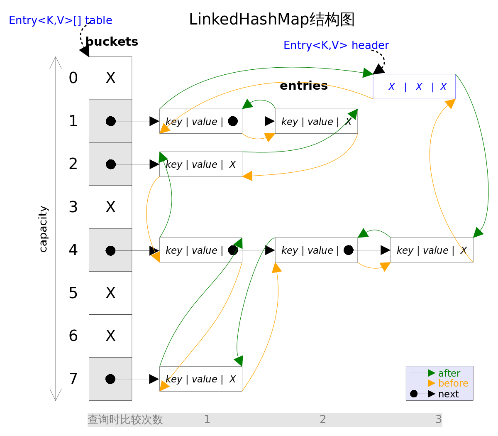

[TOC]

<!-- TOC -->

- [前言](#前言)
- [一、概述](#一概述)
    - [集合框架图](#集合框架图)
    - [Collection](#collection)
    - [Map](#map)
    - [工具类](#工具类)
    - [通用实现](#通用实现)
- [二、深入源码分析](#二深入源码分析)
    - [ArrayList](#arraylist)
        - [1. 概览](#1-概览)
        - [2. 序列化](#2-序列化)
        - [3. 扩容](#3-扩容)
        - [4. 删除元素](#4-删除元素)
        - [5. Fail-Fast](#5-fail-fast)
    - [Vector](#vector)
        - [1. 同步](#1-同步)
        - [2. ArrayList 与 Vector](#2-arraylist-与-vector)
        - [3. Vector 替代方案](#3-vector-替代方案)
    - [LinkedList](#linkedlist)
        - [1. 概览](#1-概览-1)
        - [2. 新增方法](#2-新增方法)
        - [3. 查询方法](#3-查询方法)
        - [4. 总结](#4-总结)
        - [5. ArrayList 与 LinkedList](#5-arraylist-与-linkedlist)
    - [HashMap](#hashmap)
        - [1. 存储结构](#1-存储结构)
        - [2. 拉链法的工作原理](#2-拉链法的工作原理)
        - [3. put 操作](#3-put-操作)
        - [4. 确定桶下标](#4-确定桶下标)
        - [5. 扩容-基本原理](#5-扩容-基本原理)
        - [6. 扩容-重新计算桶下标](#6-扩容-重新计算桶下标)
        - [7. 扩容-计算数组容量](#7-扩容-计算数组容量)
        - [8. 链表转红黑树](#8-链表转红黑树)
        - [9. HashMap 与 HashTable](#9-hashmap-与-hashtable)
    - [ConcurrentHashMap](#concurrenthashmap)
        - [1. 存储结构](#1-存储结构-1)
        - [2. size 操作](#2-size-操作)
        - [3. JDK 1.8 的改动](#3-jdk-18-的改动)
    - [HashSet](#hashset)
        - [1. 成员变量](#1-成员变量)
        - [2. 构造函数](#2-构造函数)
        - [3. add](#3-add)
        - [4. 总结](#4-总结-1)
    - [LinkedHashSet and LinkedHashMap](#linkedhashset-and-linkedhashmap)
        - [1. 概览](#1-概览-2)
        - [2. get()](#2-get)
        - [3. put()](#3-put)
        - [4. remove()](#4-remove)
        - [5. LinkedHashSet](#5-linkedhashset)
        - [6. LinkedHashMap经典用法](#6-linkedhashmap经典用法)
- [三、容器中的设计模式](#三容器中的设计模式)
    - [迭代器模式](#迭代器模式)
    - [适配器模式](#适配器模式)
- [四、面试指南](#四面试指南)
    - [1. ArrayList和LinkedList是常用的两种存储结构，有哪些区别呢？【阿里面试】](#1-arraylist和linkedlist是常用的两种存储结构有哪些区别呢阿里面试)
    - [2. HashMap和HashTable的区别，HashMap中的key可以是任何对象或数据类型吗？HashTable是线程安全的么？](#2-hashmap和hashtable的区别hashmap中的key可以是任何对象或数据类型吗hashtable是线程安全的么)
    - [3. HashMap和ConcurrentHashMap区别， ConcurrentHashMap 线程安全吗， ConcurrentHashMap如何保证线程安全？](#3-hashmap和concurrenthashmap区别 concurrenthashmap 线程安全吗 concurrenthashmap如何保证线程安全)
    - [4. Hashtable的原理是什么？深入分析底层源码【阿里内推面试】](#4-hashtable的原理是什么深入分析底层源码阿里内推面试)
    - [5. Hash冲突的解决办法有哪些？](#5-hash冲突的解决办法有哪些)
    - [6. 什么是迭代器？【面试宝典】](#6-什么是迭代器面试宝典)
    - [7. 因为别人知道源码怎么实现的，故意构造相同的hash的字符串进行攻击，怎么处理？那jdk7怎么办？](#7-因为别人知道源码怎么实现的故意构造相同的hash的字符串进行攻击怎么处理那jdk7怎么办)
    - [ArrayList如何快速排序 ？【阿里面经】](#arraylist如何快速排序-阿里面经)

<!-- /TOC -->
# 前言

Java集合框架(Java Collections Framework, JCF)也称容器，这里可以类比C++中的STL，在市面上似乎还没能找到一本详细介绍的书籍。在这里分为以下及部分对集合框架进行底层数据结构和源码分析，及其面试中常见的问题。比如：阿里面试必问HashMap和ConcurrentHashMap原理。相信本文的阅读会对集合框架有更深一步的了解。

- ArrayList
- Vector
- LinkedList
- HashMap
- ConcurrentHashMap
- HashSet
- LinkedHashMap

 

本文参考：

- [CarpenterLee/JCFInternals: 深入理解Java集合框架](https://github.com/CarpenterLee/JCFInternals)
- [crossoverJie/Java-Interview: 👨‍🎓 Java related : basic, concurrent, algorithm](https://github.com/crossoverJie/Java-Interview)
- [Interview-Notebook/Java 容器.md at master · CyC2018/Interview-Notebook](https://github.com/CyC2018/Interview-Notebook/blob/master/notes/Java%20%E5%AE%B9%E5%99%A8.md)
  

# 一、概述

​	Java集合框架提供了数据持有对象的方式，提供了对数据集合的操作。Java集合框架位于`java.util`包下，主要有三个大类：`Collection`、`Map`接口以及对集合进行操作的`工具类`。


## 集合框架图


## Collection


- `ArrayList`：**线程不同步**。默认初始容量为10，当数组大小不足时容量扩大为1.5倍。为追求效率，ArrayList没有实现同步（synchronized），如果需要多个线程并发访问，用户可以手动同步，也可使用Vector替代。 
- `LinkedList`：**线程不同步**。**双向链接实现**。*LinkedList*同时实现了*List*接口和*Deque*接口，也就是说它既可以看作一个顺序容器，又可以看作一个队列（*Queue*），同时又可以看作一个栈（*Stack*）。这样看来，*LinkedList*简直就是个全能冠军。当你需要使用栈或者队列时，可以考虑使用*LinkedList*，一方面是因为Java官方已经声明不建议使用*Stack*类，更遗憾的是，Java里根本没有一个叫做*Queue*的类（它是个接口名字）。关于栈或队列，现在的首选是*ArrayDeque*，它有着比*LinkedList*（当作栈或队列使用时）有着更好的性能。 
- `Stack and Queue`：Java里有一个叫做*Stack*的类，却没有叫做*Queue*的类（它是个接口名字）。当需要使用栈时，Java已不推荐使用*Stack*，而是推荐使用更高效的*ArrayDeque*；既然*Queue*只是一个接口，当需要使用队列时也就首选*ArrayDeque*了（次选是*LinkedList*）。 
- `Vector`：**线程同步**。默认初始容量为10，当数组大小不足时容量扩大为2倍。它的同步是通过`Iterator`方法加`synchronized`实现的。
- `Stack`：**线程同步**。继承自`Vector`，添加了几个方法来完成栈的功能。现在已经不推荐使用Stack，在栈和队列中有限使用ArrayDeque，其次是LinkedList。
- `TreeSet`：**线程不同步**，内部使用`NavigableMap`操作。默认元素“自然顺序”排列，可以通过`Comparator`改变排序。*TreeSet里面有一个TreeMap*（适配器模式）
- `HashSet`：**线程不同步**，内部使用`HashMap`进行数据存储，提供的方法基本都是调用`HashMap`的方法，所以两者本质是一样的。**集合元素可以为**`NULL`。
- `Set`：Set是一种不包含重复元素的Collection，Set最多只有一个null元素。Set集合通常可以通过Map集合通过适配器模式得到。
- `PriorityQueue`：Java中*PriorityQueue*实现了*Queue*接口，不允许放入`null`元素；其通过堆实现，具体说是通过完全二叉树（*complete binary tree*）实现的**小顶堆**（任意一个非叶子节点的权值，都不大于其左右子节点的权值），也就意味着可以通过数组来作为*PriorityQueue*的底层实现。 
  - **优先队列的作用是能保证每次取出的元素都是队列中权值最小的**（Java的优先队列每次取最小元素，C++的优先队列每次取最大元素）。这里牵涉到了大小关系，**元素大小的评判可以通过元素本身的自然顺序（natural ordering），也可以通过构造时传入的比较器**（*Comparator*，类似于C++的仿函数）。 
- `NavigableSet`：添加了搜索功能，可以对给定元素进行搜索：小于、小于等于、大于、大于等于，放回一个符合条件的最接近给定元素的 key。
- `EnumSet`：线程不同步。内部使用Enum数组实现，速度比`HashSet`快。**只能存储在构造函数传入的枚举类的枚举值**。


## Map


- `TreeMap`：线程不同步，基于 **红黑树** （Red-Black tree）的NavigableMap 实现，**能够把它保存的记录根据键排序,默认是按键值的升序排序，也可以指定排序的比较器，当用Iterator 遍历TreeMap时，得到的记录是排过序的。**
  - **TreeMap底层通过红黑树（Red-Black tree）实现**，也就意味着`containsKey()`, `get()`, `put()`, `remove()`都有着`log(n)`的时间复杂度。其具体算法实现参照了《算法导论》。
- `HashMap`：线程不同步。根据`key`的`hashcode`进行存储，内部使用静态内部类`Node`的数组进行存储，默认初始大小为16，每次扩大一倍。当发生Hash冲突时，采用拉链法（链表）。。JDK 1.8中：**当单个桶中元素个数大于等于8时，链表实现改为红黑树实现；当元素个数小于6时，变回链表实现。由此来防止hashCode攻击。**
  - Java HashMap采用的是冲突链表方式。  
  - HashMap是Hashtable的轻量级实现，可以接受为null的键值\(key\)和值\(value\)，而Hashtable不允许。
- `LinkedHashMap`：**保存了记录的插入顺序**，在用Iterator遍历LinkedHashMap时，先得到的记录肯定是先插入的. 也可以在构造时用带参数，按照应用次数排序。在遍历的时候会比HashMap慢，不过有种情况例外，当HashMap容量很大，实际数据较少时，遍历起来可能会比LinkedHashMap慢，因为LinkedHashMap的遍历速度只和实际数据有关，和容量无关，而HashMap的遍历速度和他的容量有关。
- `HashTable`：**线程安全**，HashMap的迭代器\(Iterator\)是`fail-fast`迭代器。**HashTable不能存储NULL的key和value。**
- `WeakHashMap`：从名字可以看出它是某种 *Map*。它的特殊之处在于 *WeakHashMap* 里的`entry`可能会被GC自动删除，即使程序员没有调用`remove()`或者`clear()`方法。 WeakHashMap的存储结构类似于HashMap
  - 既然有 *WeekHashMap*，是否有 *WeekHashSet* 呢？答案是没有:( 。不过Java *Collections*工具类给出了解决方案，`Collections.newSetFromMap(Map<E,Boolean> map)`方法可以将任何 *Map*包装成一个*Set*。

  


## 工具类

- `Collections`、`Arrays`：集合类的一个工具类帮助类，其中提供了一系列静态方法，用于对集合中元素进行排序、搜索以及线程安全等各种操作。

- `Comparable`、`Comparator`：一般是用于对象的比较来实现排序，两者略有区别。

  > - 类设计者没有考虑到比较问题而没有实现Comparable接口。这是我们就可以通过使用Comparator，这种情况下，我们是不需要改变对象的。
  > - 一个集合中，我们可能需要有多重的排序标准，这时候如果使用Comparable就有些捉襟见肘了，可以自己继承Comparator提供多种标准的比较器进行排序。


说明：线程不同步的时候可以通过，Collections.synchronizedList() 方法来包装一个线程同步方法


## 通用实现

<table align="center"><tr><td colspan="2" rowspan="2" align="center" border="0"></td><th colspan="5" align="center">Implementations</th></tr><tr><th>Hash Table</th><th>Resizable Array</th><th>Balanced Tree</th><th>Linked List</th><th>Hash Table + Linked List</th></tr><tr><th rowspan="4">Interfaces</th><th>Set</th><td><tt>HashSet</tt></td><td></td><td><tt>TreeSet</tt></td><td></td><td><tt>LinkedHashSet</tt></td></tr><tr><th>List</th><td></td><td><tt>ArrayList</tt></td><td></td><td><tt>LinkedList</tt></td><td></td></tr><tr><th>Deque</th><td></td><td><tt>ArrayDeque</tt></td><td></td><td><tt>LinkedList</tt></td><td></td></tr><tr><th>Map</th><td><tt>HashMap</tt></td><td></td><td><tt>TreeMap</tt></td><td></td><td><tt>LinkedHashMap</tt></td></tr></table>


**参考资料：**

- [CarpenterLee/JCFInternals:深入理解Java集合框架](https://github.com/CarpenterLee/JCFInternals)
- [Java基础-集合框架 - 掘金](https://juejin.im/post/5af86ac8f265da0ba063410e)


# 二、深入源码分析

源码分析基于 JDK 1.8，在 IDEA 中 double shift 调出 Search EveryWhere，查找源码文件，找到之后就可以阅读源码。

## ArrayList

### 1. 概览

实现了 RandomAccess 接口，因此支持随机访问，这是理所当然的，因为 ArrayList 是基于数组实现的。

```java
public class ArrayList<E> extends AbstractList<E>
        implements List<E>, RandomAccess, Cloneable, java.io.Serializable
```

数组的默认大小为 10。

```java
private static final int DEFAULT_CAPACITY = 10;
```

<div align="center"> </div><br/>


### 2. 序列化

基于数组实现，保存元素的数组使用 transient 修饰，该关键字声明数组默认不会被序列化。ArrayList 具有动态扩容特性，因此保存元素的数组不一定都会被使用，那么就没必要全部进行序列化。ArrayList 重写了 writeObject() 和 readObject() 来控制只序列化数组中有元素填充那部分内容。

```java
transient Object[] elementData; // non-private to simplify nested class access
```


### 3. 扩容

添加元素时使用 ensureCapacityInternal() 方法来保证容量足够，如果不够时，需要使用 grow() 方法进行扩容，新容量的大小为 `oldCapacity + (oldCapacity >> 1)`，也就是旧容量的 1.5 倍。

扩容操作需要调用 `Arrays.copyOf()` 把原数组整个复制到新数组中，这个操作代价很高，因此最好在创建 ArrayList 对象时就指定大概的容量大小，减少扩容操作的次数。

```java
public boolean add(E e) {
    ensureCapacityInternal(size + 1);  // Increments modCount!!
    elementData[size++] = e;
    return true;
}

private void ensureCapacityInternal(int minCapacity) {
    if (elementData == DEFAULTCAPACITY_EMPTY_ELEMENTDATA) {
        minCapacity = Math.max(DEFAULT_CAPACITY, minCapacity);
    }
    ensureExplicitCapacity(minCapacity);
}

private void ensureExplicitCapacity(int minCapacity) {
    modCount++;
    // overflow-conscious code
    if (minCapacity - elementData.length > 0)
        grow(minCapacity);
}

private void grow(int minCapacity) {
    // overflow-conscious code
    int oldCapacity = elementData.length;
    int newCapacity = oldCapacity + (oldCapacity >> 1);
    if (newCapacity - minCapacity < 0)
        newCapacity = minCapacity;
    if (newCapacity - MAX_ARRAY_SIZE > 0)
        newCapacity = hugeCapacity(minCapacity);
    // minCapacity is usually close to size, so this is a win:
    elementData = Arrays.copyOf(elementData, newCapacity);
}
```


### 4. 删除元素

需要调用 System.arraycopy() 将 index+1 后面的元素都复制到 index 位置上。

```java
public E remove(int index) {
    rangeCheck(index);
    modCount++;
    E oldValue = elementData(index);
    int numMoved = size - index - 1;
    if (numMoved > 0)
        System.arraycopy(elementData, index+1, elementData, index, numMoved);
    elementData[--size] = null; // clear to let GC do its work
    return oldValue;
}
```


### 5. Fail-Fast

modCount 用来记录 ArrayList 结构发生变化的次数。结构发生变化是指添加或者删除至少一个元素的所有操作，或者是调整内部数组的大小，仅仅只是设置元素的值不算结构发生变化。

在进行序列化或者迭代等操作时，需要比较操作前后 modCount 是否改变，如果改变了需要抛出 ConcurrentModificationException。

```java
private void writeObject(java.io.ObjectOutputStream s)
    throws java.io.IOException{
    // Write out element count, and any hidden stuff
    int expectedModCount = modCount;
    s.defaultWriteObject();

    // Write out size as capacity for behavioural compatibility with clone()
    s.writeInt(size);

    // Write out all elements in the proper order.
    for (int i=0; i<size; i++) {
        s.writeObject(elementData[i]);
    }

    if (modCount != expectedModCount) {
        throw new ConcurrentModificationException();
    }
}
```


## Vector

### 1. 同步

它的实现与 ArrayList 类似，但是使用了 synchronized 进行同步。

```java
public synchronized boolean add(E e) {
    modCount++;
    ensureCapacityHelper(elementCount + 1);
    elementData[elementCount++] = e;
    return true;
}

public synchronized E get(int index) {
    if (index >= elementCount)
        throw new ArrayIndexOutOfBoundsException(index);

    return elementData(index);
}
```


### 2. ArrayList 与 Vector

- Vector 是同步的，因此开销就比 ArrayList 要大，访问速度更慢。最好使用 ArrayList 而不是 Vector，因为同步操作完全可以由程序员自己来控制；
- Vector 每次扩容请求其大小的 2 倍空间，而 ArrayList 是 1.5 倍。


### 3. Vector 替代方案

为了获得线程安全的 ArrayList，可以使用 `Collections.synchronizedList();` 得到一个线程安全的 ArrayList。

```java
List<String> list = new ArrayList<>();
List<String> synList = Collections.synchronizedList(list);
```

也可以使用 concurrent 并发包下的 CopyOnWriteArrayList 类。

```java
List<String> list = new CopyOnWriteArrayList<>();
```

CopyOnWriteArrayList 是一种 CopyOnWrite 容器，从以下源码看出：读取元素是从原数组读取；添加元素是在复制的新数组上。读写分离，因而可以在并发条件下进行不加锁的读取，读取效率高，适用于读操作远大于写操作的场景。

```java
public boolean add(E e) {
    final ReentrantLock lock = this.lock;
    lock.lock();
    try {
        Object[] elements = getArray();
        int len = elements.length;
        Object[] newElements = Arrays.copyOf(elements, len + 1); 
        newElements[len] = e;
        setArray(newElements);
        return true;
    } finally {
        lock.unlock();
    }
}

final void setArray(Object[] a) {
    array = a;
}

@SuppressWarnings("unchecked")
private E get(Object[] a, int index) {
    return (E) a[index];
}
```


## LinkedList

<div align="center"> </div><br/>

### 1. 概览

如图所示 `LinkedList` 底层是基于双向链表实现的，也是实现了 `List` 接口，所以也拥有 List 的一些特点(JDK1.7/8 之后取消了循环，修改为双向链表)。 

基于双向链表实现，内部使用 Node 来存储链表节点信息。

```java
private static class Node<E> {
    E item;
    Node<E> next;
    Node<E> prev;
}
```

每个链表存储了 Head 和 Tail 指针：

```java
transient Node<E> first;
transient Node<E> last;
```

### 2. 新增方法

```java
public boolean add(E e) {
    linkLast(e);
    return true;
}

/**
* Links e as last element.
*/
void linkLast(E e) {
    final Node<E> l = last;
    final Node<E> newNode = new Node<>(l, e, null);
    last = newNode;
    if (l == null)
        first = newNode;
    else
        l.next = newNode;
    size++;
    modCount++;
}
```

可见每次插入都是移动指针，和 ArrayList 的拷贝数组来说效率要高上不少。

### 3. 查询方法

```java
public E get(int index) {
	checkElementIndex(index);
	return node(index).item;
}
    
Node<E> node(int index) {
	// assert isElementIndex(index);
    if (index < (size >> 1)) {
        Node<E> x = first;
        for (int i = 0; i < index; i++)
            x = x.next;
        return x;
	} else {
        Node<E> x = last;
        for (int i = size - 1; i > index; i--)
            x = x.prev;
        return x;
	}
}
```

由此可以看出是使用二分查找来看 `index` 离 size 中间距离来判断是从头结点正序查还是从尾节点倒序查。

- node()会以`O(n/2)`的性能去获取一个结点
  - 如果索引值大于链表大小的一半，那么将从尾结点开始遍历

这样的效率是非常低的，特别是当 index 越接近 size 的中间值时。

### 4. 总结

- LinkedList 插入，删除都是移动指针效率很高。
- 查找需要进行遍历查询，效率较低。


   

### 5. ArrayList 与 LinkedList

- ArrayList 基于动态数组实现，LinkedList 基于双向链表实现；
- ArrayList 支持随机访问，LinkedList 不支持；
- LinkedList 在任意位置添加删除元素更快。


## HashMap

为了便于理解，以下源码分析以 JDK 1.7 为主。

### 1. 存储结构

内部包含了一个 Entry 类型的数组 table。

```java
transient Entry[] table;
```

其中，Entry 就是存储数据的键值对，它包含了四个字段。从 next 字段我们可以看出 Entry 是一个链表，即数组中的每个位置被当成一个桶，一个桶存放一个链表，链表中存放哈希值相同的 Entry。也就是说，HashMap 使用拉链法来解决冲突。


<div align="center"> </div><br/>

```java
static class Entry<K,V> implements Map.Entry<K,V> {
    final K key;
    V value;
    Entry<K,V> next;
    int hash;

    Entry(int h, K k, V v, Entry<K,V> n) {
        value = v;
        next = n;
        key = k;
        hash = h;
    }

    public final K getKey() {
        return key;
    }

    public final V getValue() {
        return value;
    }

    public final V setValue(V newValue) {
        V oldValue = value;
        value = newValue;
        return oldValue;
    }

    public final boolean equals(Object o) {
        if (!(o instanceof Map.Entry))
            return false;
        Map.Entry e = (Map.Entry)o;
        Object k1 = getKey();
        Object k2 = e.getKey();
        if (k1 == k2 || (k1 != null && k1.equals(k2))) {
            Object v1 = getValue();
            Object v2 = e.getValue();
            if (v1 == v2 || (v1 != null && v1.equals(v2)))
                return true;
        }
        return false;
    }

    public final int hashCode() {
        return Objects.hashCode(getKey()) ^ Objects.hashCode(getValue());
    }

    public final String toString() {
        return getKey() + "=" + getValue();
    }

    /**
     * This method is invoked whenever the value in an entry is
     * overwritten by an invocation of put(k,v) for a key k that's already
     * in the HashMap.
     */
    void recordAccess(HashMap<K,V> m) {
    }

    /**
     * This method is invoked whenever the entry is
     * removed from the table.
     */
    void recordRemoval(HashMap<K,V> m) {
    }
}
```


### 2. 拉链法的工作原理

```java
HashMap<String, String> map = new HashMap<>();
map.put("K1", "V1");
map.put("K2", "V2");
map.put("K3", "V3");
```

- 新建一个 HashMap，默认大小为 16；
- 插入 <K1,V1> 键值对，先计算 K1 的 hashCode 为 115，使用除留余数法得到所在的桶下标 115%16=3。
- 插入 <K2,V2> 键值对，先计算 K2 的 hashCode 为 118，使用除留余数法得到所在的桶下标 118%16=6。
- 插入 <K3,V3> 键值对，先计算 K3 的 hashCode 为 118，使用除留余数法得到所在的桶下标 118%16=6，插在 <K2,V2> 前面。

应该注意到链表的插入是以头插法方式进行的，例如上面的 <K3,V3> 不是插在 <K2,V2> 后面，而是插入在链表头部。

查找需要分成两步进行：

- 计算键值对所在的桶；
- 在链表上顺序查找，时间复杂度显然和链表的长度成正比。

<div align="center"> </div><br/>


### 3. put 操作

```java
public V put(K key, V value) {
    if (table == EMPTY_TABLE) {
        inflateTable(threshold);
    }
    // 键为 null 单独处理
    if (key == null)
        return putForNullKey(value);
    int hash = hash(key);
    // 确定桶下标
    int i = indexFor(hash, table.length);
    // 先找出是否已经存在键为 key 的键值对，如果存在的话就更新这个键值对的值为 value
    for (Entry<K,V> e = table[i]; e != null; e = e.next) {
        Object k;
        if (e.hash == hash && ((k = e.key) == key || key.equals(k))) {
            V oldValue = e.value;
            e.value = value;
            e.recordAccess(this);
            return oldValue;
        }
    }

    modCount++;
    // 插入新键值对
    addEntry(hash, key, value, i);
    return null;
}
```

HashMap 允许插入键为 null 的键值对。因为无法调用 null 的 hashCode()，也就无法确定该键值对的桶下标，只能通过强制指定一个桶下标来存放。HashMap 使用第 0 个桶存放键为 null 的键值对。

```java
private V putForNullKey(V value) {
    for (Entry<K,V> e = table[0]; e != null; e = e.next) {
        if (e.key == null) {
            V oldValue = e.value;
            e.value = value;
            e.recordAccess(this);
            return oldValue;
        }
    }
    modCount++;
    addEntry(0, null, value, 0);
    return null;
}
```

使用链表的头插法，也就是新的键值对插在链表的头部，而不是链表的尾部。

```java
void addEntry(int hash, K key, V value, int bucketIndex) {
    if ((size >= threshold) && (null != table[bucketIndex])) {
        resize(2 * table.length);
        hash = (null != key) ? hash(key) : 0;
        bucketIndex = indexFor(hash, table.length);
    }

    createEntry(hash, key, value, bucketIndex);
}

void createEntry(int hash, K key, V value, int bucketIndex) {
    Entry<K,V> e = table[bucketIndex];
    // 头插法，链表头部指向新的键值对
    table[bucketIndex] = new Entry<>(hash, key, value, e);
    size++;
}
```

```java
Entry(int h, K k, V v, Entry<K,V> n) {
    value = v;
    next = n;
    key = k;
    hash = h;
}
```


### 4. 确定桶下标

很多操作都需要先确定一个键值对所在的桶下标。

```java
int hash = hash(key);
int i = indexFor(hash, table.length);
```

（一）计算 hash 值

```java
final int hash(Object k) {
    int h = hashSeed;
    if (0 != h && k instanceof String) {
        return sun.misc.Hashing.stringHash32((String) k);
    }

    h ^= k.hashCode();

    // This function ensures that hashCodes that differ only by
    // constant multiples at each bit position have a bounded
    // number of collisions (approximately 8 at default load factor).
    h ^= (h >>> 20) ^ (h >>> 12);
    return h ^ (h >>> 7) ^ (h >>> 4);
}
```

```java
public final int hashCode() {
    return Objects.hashCode(key) ^ Objects.hashCode(value);
}
```

（二）取模

令 x = 1<<4，即 x 为 2 的 4 次方，它具有以下性质：

```java
x   : 00010000
x-1 : 00001111
```

令一个数 y 与 x-1 做与运算，可以去除 y 位级表示的第 4 位以上数：

```java
y       : 10110010
x-1     : 00001111
y&(x-1) : 00000010
```

这个性质和 y 对 x 取模效果是一样的：

```java
x   : 00010000
y   : 10110010
y%x : 00000010
```

我们知道，位运算的代价比求模运算小的多，因此在进行这种计算时用位运算的话能带来更高的性能。

确定桶下标的最后一步是将 key 的 hash 值对桶个数取模：hash%capacity，如果能保证 capacity 为 2 的 n 次方，那么就可以将这个操作转换为位运算。

```java
static int indexFor(int h, int length) {
    return h & (length-1);
}
```


### 5. 扩容-基本原理

设 HashMap 的 table 长度为 M，需要存储的键值对数量为 N，如果哈希函数满足均匀性的要求，那么每条链表的长度大约为 N/M，因此平均查找次数的复杂度为 O(N/M)。

为了让查找的成本降低，应该尽可能使得 N/M 尽可能小，因此需要保证 M 尽可能大，也就是说 table 要尽可能大。HashMap 采用动态扩容来根据当前的 N 值来调整 M 值，使得空间效率和时间效率都能得到保证。

和扩容相关的参数主要有：capacity、size、threshold 和 load_factor。

| 参数        | 含义                                                         |
| ----------- | ------------------------------------------------------------ |
| capacity    | table 的容量大小，默认为 16，需要注意的是 capacity 必须保证为 2 的 n 次方。 |
| size        | table 的实际使用量。                                         |
| threshold   | size 的临界值，size 必须小于 threshold，如果大于等于，就必须进行扩容操作。 |
| load_factor | 装载因子，table 能够使用的比例，threshold = capacity * load_factor。 |

```java
static final int DEFAULT_INITIAL_CAPACITY = 16;

static final int MAXIMUM_CAPACITY = 1 << 30;

static final float DEFAULT_LOAD_FACTOR = 0.75f;

transient Entry[] table;

transient int size;

int threshold;

final float loadFactor;

transient int modCount;
```

从下面的添加元素代码中可以看出，当需要扩容时，令 capacity 为原来的两倍。

```java
void addEntry(int hash, K key, V value, int bucketIndex) {
    Entry<K,V> e = table[bucketIndex];
    table[bucketIndex] = new Entry<>(hash, key, value, e);
    if (size++ >= threshold)
        resize(2 * table.length);
}
```

扩容使用 resize() 实现，需要注意的是，扩容操作同样需要把旧 table 的所有键值对重新插入新的 table 中，因此这一步是很费时的。

```java
void resize(int newCapacity) {
    Entry[] oldTable = table;
    int oldCapacity = oldTable.length;
    if (oldCapacity == MAXIMUM_CAPACITY) {
        threshold = Integer.MAX_VALUE;
        return;
    }
    Entry[] newTable = new Entry[newCapacity];
    transfer(newTable);
    table = newTable;
    threshold = (int)(newCapacity * loadFactor);
}

void transfer(Entry[] newTable) {
    Entry[] src = table;
    int newCapacity = newTable.length;
    for (int j = 0; j < src.length; j++) {
        Entry<K,V> e = src[j];
        if (e != null) {
            src[j] = null;
            do {
                Entry<K,V> next = e.next;
                int i = indexFor(e.hash, newCapacity);
                e.next = newTable[i];
                newTable[i] = e;
                e = next;
            } while (e != null);
        }
    }
}
```


### 6. 扩容-重新计算桶下标

在进行扩容时，需要把键值对重新放到对应的桶上。HashMap 使用了一个特殊的机制，可以降低重新计算桶下标的操作。

假设原数组长度 capacity 为 8，扩容之后 new capacity 为 16：

```java
javacapacity : 00010000
new capacity : 00100000
```

对于一个 Key，它的哈希值如果在第 6 位上为 0，那么取模得到的结果和之前一样；如果为 1，那么得到的结果为原来的结果 + 8。


### 7. 扩容-计算数组容量

HashMap 构造函数允许用户传入的容量不是 2 的 n 次方，因为它可以自动地将传入的容量转换为 2 的 n 次方。

先考虑如何求一个数的掩码，对于 10010000，它的掩码为 11111111，可以使用以下方法得到：

```java
mask |= mask >> 1    11011000
mask |= mask >> 2    11111100
mask |= mask >> 4    11111111
```

mask+1 是大于原始数字的最小的 2 的 n 次方。

```java
num     10010000
mask+1 100000000
```

以下是 HashMap 中计算数组容量的代码：

```java
static final int tableSizeFor(int cap) {
    int n = cap - 1;
    n |= n >>> 1;
    n |= n >>> 2;
    n |= n >>> 4;
    n |= n >>> 8;
    n |= n >>> 16;
    return (n < 0) ? 1 : (n >= MAXIMUM_CAPACITY) ? MAXIMUM_CAPACITY : n + 1;
}
```


### 8. 链表转红黑树

从 JDK 1.8 开始，一个桶存储的链表长度大于 8 时会将链表转换为红黑树。


### 9. HashMap 与 HashTable

- HashTable 使用 synchronized 来进行同步。
- HashMap 可以插入键为 null 的 Entry。
- HashMap 的迭代器是 fail-fast 迭代器。
- HashMap 不能保证随着时间的推移 Map 中的元素次序是不变的。


## ConcurrentHashMap

### 1. 存储结构

```java
static final class HashEntry<K,V> {
    final int hash;
    final K key;
    volatile V value;
    volatile HashEntry<K,V> next;
}
```

ConcurrentHashMap 和 HashMap 实现上类似，最主要的差别是 ConcurrentHashMap 采用了分段锁（Segment），每个分段锁维护着几个桶（HashEntry），多个线程可以同时访问不同分段锁上的桶，从而使其并发度更高（并发度就是 Segment 的个数）。

Segment 继承自 **ReentrantLock**。

```java
static final class Segment<K,V> extends ReentrantLock implements Serializable {

    private static final long serialVersionUID = 2249069246763182397L;

    static final int MAX_SCAN_RETRIES =
        Runtime.getRuntime().availableProcessors() > 1 ? 64 : 1;

    transient volatile HashEntry<K,V>[] table;

    transient int count;

    transient int modCount;

    transient int threshold;

    final float loadFactor;
}
```

```java
final Segment<K,V>[] segments;
```

默认的并发级别为 16，也就是说默认创建 16 个 Segment。

```java
static final int DEFAULT_CONCURRENCY_LEVEL = 16;
```


<div align="center"> </div><br/>


### 2. size 操作

每个 Segment 维护了一个 count 变量来统计该 Segment 中的键值对个数。

```java
/**
 * The number of elements. Accessed only either within locks
 * or among other volatile reads that maintain visibility.
 */
transient int count;
```

在执行 size 操作时，需要遍历所有 Segment 然后把 count 累计起来。

ConcurrentHashMap 在执行 size 操作时先尝试不加锁，如果连续两次不加锁操作得到的结果一致，那么可以认为这个结果是正确的。

尝试次数使用 RETRIES_BEFORE_LOCK 定义，该值为 2，retries 初始值为 -1，因此尝试次数为 3。

如果尝试的次数超过 3 次，就需要对每个 Segment 加锁。

```java
/**
 * Number of unsynchronized retries in size and containsValue
 * methods before resorting to locking. This is used to avoid
 * unbounded retries if tables undergo continuous modification
 * which would make it impossible to obtain an accurate result.
 */
static final int RETRIES_BEFORE_LOCK = 2;

public int size() {
    // Try a few times to get accurate count. On failure due to
    // continuous async changes in table, resort to locking.
    final Segment<K,V>[] segments = this.segments;
    int size;
    boolean overflow; // true if size overflows 32 bits
    long sum;         // sum of modCounts
    long last = 0L;   // previous sum
    int retries = -1; // first iteration isn't retry
    try {
        for (;;) {
            // 超过尝试次数，则对每个 Segment 加锁
            if (retries++ == RETRIES_BEFORE_LOCK) {
                for (int j = 0; j < segments.length; ++j)
                    ensureSegment(j).lock(); // force creation
            }
            sum = 0L;
            size = 0;
            overflow = false;
            for (int j = 0; j < segments.length; ++j) {
                Segment<K,V> seg = segmentAt(segments, j);
                if (seg != null) {
                    sum += seg.modCount;
                    int c = seg.count;
                    if (c < 0 || (size += c) < 0)
                        overflow = true;
                }
            }
            // 连续两次得到的结果一致，则认为这个结果是正确的
            if (sum == last)
                break;
            last = sum;
        }
    } finally {
        if (retries > RETRIES_BEFORE_LOCK) {
            for (int j = 0; j < segments.length; ++j)
                segmentAt(segments, j).unlock();
        }
    }
    return overflow ? Integer.MAX_VALUE : size;
}
```

### 3. JDK 1.8 的改动

JDK 1.7 使用分段锁机制来实现并发更新操作，核心类为 Segment，它继承自重入锁 ReentrantLock，并发程度与 Segment 数量相等。

JDK 1.8 使用了 CAS 操作来支持更高的并发度，在 CAS 操作失败时使用内置锁 synchronized。

并且 JDK 1.8 的实现也在链表过长时会转换为红黑树。


## HashSet

前面已经说过*HashSet*是对*HashMap*的简单包装，对*HashSet*的函数调用都会转换成合适的*HashMap*方法，因此*HashSet*的实现非常简单，只有不到300行代码。这里不再赘述。

```java
//HashSet是对HashMap的简单包装
public class HashSet<E>
{
	......
	private transient HashMap<E,Object> map;//HashSet里面有一个HashMap
    // Dummy value to associate with an Object in the backing Map
    private static final Object PRESENT = new Object();
    public HashSet() {
        map = new HashMap<>();
    }
    ......
    public boolean add(E e) {//简单的方法转换
        return map.put(e, PRESENT)==null;
    }
    ......
}
```


### 1. 成员变量

首先了解下 `HashSet` 的成员变量:

```java
    private transient HashMap<E,Object> map;

    // Dummy value to associate with an Object in the backing Map
    private static final Object PRESENT = new Object();
```

发现主要就两个变量:

- `map` ：用于存放最终数据的。
- `PRESENT` ：是所有写入 map 的 `value` 值。

### 2. 构造函数

```java
    public HashSet() {
        map = new HashMap<>();
    }
    
    public HashSet(int initialCapacity, float loadFactor) {
        map = new HashMap<>(initialCapacity, loadFactor);
    }    
```

构造函数很简单，利用了 `HashMap` 初始化了 `map` 。


### 3. add

```java
    public boolean add(E e) {
        return map.put(e, PRESENT)==null;
    }
```

比较关键的就是这个 `add()` 方法。 可以看出它是将存放的对象当做了 `HashMap` 的健，`value` 都是相同的 `PRESENT` 。由于 `HashMap` 的 `key` 是不能重复的，所以每当有重复的值写入到 `HashSet` 时，`value` 会被覆盖，但 `key` 不会收到影响，这样就保证了 `HashSet` 中只能存放不重复的元素。


### 4. 总结

`HashSet` 的原理比较简单，几乎全部借助于 `HashMap` 来实现的。

所以 `HashMap` 会出现的问题 `HashSet` 依然不能避免。


## LinkedHashSet and LinkedHashMap

### 1. 概览

如果你已看过前面关于 HashSet 和 HashMap，的讲解，一定能够想到本文将要讲解的 LinkedHashSet 和 LinkedHashMap 其实也是一回事。 LinkedHashSet 和 LinkedHashMap 在Java里也有着相同的实现，前者仅仅是对后者做了一层包装，也就是说LinkedHashSet里面有一个LinkedHashMap（**适配器模式**）。因此本文将重点分析LinkedHashMap。

LinkedHashMap 实现了Map接口，即允许放入key为null的元素，也允许插入value为null的元素。从名字上可以看出该容器是 LinkedList 和 HashMap 的混合体，也就是说它同时满足 HashMap 和 LinkedList 的某些特性。**可将 LinkedHashMap 看作采用 LinkedList 增强的 HashMap。**

<div align="center"> </div><br/>


事实上*LinkedHashMap*是*HashMap*的直接子类，**二者唯一的区别是LinkedHashMap在HashMap的基础上，采用双向链表（doubly-linked list）的形式将所有entry连接起来，这样是为保证元素的迭代顺序跟插入顺序相同**。上图给出了*LinkedHashMap*的结构图，主体部分跟*HashMap*完全一样，多了`header`指向双向链表的头部（是一个哑元），**该双向链表的迭代顺序就是entry的插入顺序**。

除了可以保迭代历顺序，这种结构还有一个好处：**迭代LinkedHashMap时不需要像HashMap那样遍历整个table，而只需要直接遍历header指向的双向链表即可**，也就是说*LinkedHashMap*的迭代时间就只跟`entry`的个数相关，而跟`table`的大小无关。

有两个参数可以影响*LinkedHashMap*的性能：初始容量（inital capacity）和负载系数（load factor）。初始容量指定了初始`table`的大小，负载系数用来指定自动扩容的临界值。当`entry`的数量超过`capacity*load_factor`时，容器将自动扩容并重新哈希。对于插入元素较多的场景，将初始容量设大可以减少重新哈希的次数。

将对象放入到*LinkedHashMap*或*LinkedHashSet*中时，有两个方法需要特别关心：`hashCode()`和`equals()`。**hashCode()方法决定了对象会被放到哪个bucket里，当多个对象的哈希值冲突时，equals()方法决定了这些对象是否是“同一个对象”**。所以，如果要将自定义的对象放入到`LinkedHashMap`或`LinkedHashSet`中，需要*@Override*`hashCode()`和`equals()`方法。

通过如下方式可以得到一个跟源*Map* **迭代顺序**一样的*LinkedHashMap*：

```java
void foo(Map m) {
    Map copy = new LinkedHashMap(m);
    ...
}
```

出于性能原因，*LinkedHashMap*是非同步的（not synchronized），如果需要在多线程环境使用，需要程序员手动同步；或者通过如下方式将*LinkedHashMap*包装成（wrapped）同步的：

`Map m = Collections.synchronizedMap(new LinkedHashMap(...));`

### 2. get()

`get(Object key)`方法根据指定的`key`值返回对应的`value`。该方法跟`HashMap.get()`方法的流程几乎完全一样，读者可自行[参考前文](https://github.com/CarpenterLee/JCFInternals/blob/master/markdown/6-HashSet%20and%20HashMap.md#get)，这里不再赘述。

### 3. put()

`put(K key, V value)`方法是将指定的`key, value`对添加到`map`里。该方法首先会对`map`做一次查找，看是否包含该元组，如果已经包含则直接返回，查找过程类似于`get()`方法；如果没有找到，则会通过`addEntry(int hash, K key, V value, int bucketIndex)`方法插入新的`entry`。

注意，这里的**插入有两重含义**：

> 1. 从`table`的角度看，新的`entry`需要插入到对应的`bucket`里，当有哈希冲突时，采用头插法将新的`entry`插入到冲突链表的头部。
> 2. 从`header`的角度看，新的`entry`需要插入到双向链表的尾部。

[](https://github.com/CarpenterLee/JCFInternals/blob/master/PNGFigures/LinkedHashMap_addEntry.png)

`addEntry()`代码如下：

```java
// LinkedHashMap.addEntry()
void addEntry(int hash, K key, V value, int bucketIndex) {
    if ((size >= threshold) && (null != table[bucketIndex])) {
        resize(2 * table.length);// 自动扩容，并重新哈希
        hash = (null != key) ? hash(key) : 0;
        bucketIndex = hash & (table.length-1);// hash%table.length
    }
    // 1.在冲突链表头部插入新的entry
    HashMap.Entry<K,V> old = table[bucketIndex];
    Entry<K,V> e = new Entry<>(hash, key, value, old);
    table[bucketIndex] = e;
    // 2.在双向链表的尾部插入新的entry
    e.addBefore(header);
    size++;
}
```

上述代码中用到了`addBefore()`方法将新`entry e`插入到双向链表头引用`header`的前面，这样`e`就成为双向链表中的最后一个元素。`addBefore()`的代码如下：

```java
// LinkedHashMap.Entry.addBefor()，将this插入到existingEntry的前面
private void addBefore(Entry<K,V> existingEntry) {
    after  = existingEntry;
    before = existingEntry.before;
    before.after = this;
    after.before = this;
}
```

上述代码只是简单修改相关`entry`的引用而已。

### 4. remove()

`remove(Object key)`的作用是删除`key`值对应的`entry`，该方法的具体逻辑是在`removeEntryForKey(Object key)`里实现的。`removeEntryForKey()`方法会首先找到`key`值对应的`entry`，然后删除该`entry`（修改链表的相应引用）。查找过程跟`get()`方法类似。

注意，这里的**删除也有两重含义**：

> 1. 从`table`的角度看，需要将该`entry`从对应的`bucket`里删除，如果对应的冲突链表不空，需要修改冲突链表的相应引用。
> 2. 从`header`的角度来看，需要将该`entry`从双向链表中删除，同时修改链表中前面以及后面元素的相应引用。

[](https://github.com/CarpenterLee/JCFInternals/blob/master/PNGFigures/LinkedHashMap_removeEntryForKey.png)

`removeEntryForKey()`对应的代码如下：

```javascript
// LinkedHashMap.removeEntryForKey()，删除key值对应的entry
final Entry<K,V> removeEntryForKey(Object key) {
	......
	int hash = (key == null) ? 0 : hash(key);
    int i = indexFor(hash, table.length);// hash&(table.length-1)
    Entry<K,V> prev = table[i];// 得到冲突链表
    Entry<K,V> e = prev;
    while (e != null) {// 遍历冲突链表
        Entry<K,V> next = e.next;
        Object k;
        if (e.hash == hash &&
            ((k = e.key) == key || (key != null && key.equals(k)))) {// 找到要删除的entry
            modCount++; size--;
            // 1. 将e从对应bucket的冲突链表中删除
            if (prev == e) table[i] = next;
            else prev.next = next;
            // 2. 将e从双向链表中删除
            e.before.after = e.after;
            e.after.before = e.before;
            return e;
        }
        prev = e; e = next;
    }
    return e;
}
```

### 5. LinkedHashSet

前面已经说过*LinkedHashSet*是对*LinkedHashMap*的简单包装，对*LinkedHashSet*的函数调用都会转换成合适的*LinkedHashMap*方法，因此*LinkedHashSet*的实现非常简单，这里不再赘述。

```java
public class LinkedHashSet<E>
    extends HashSet<E>
    implements Set<E>, Cloneable, java.io.Serializable {
    ......
    // LinkedHashSet里面有一个LinkedHashMap
    public LinkedHashSet(int initialCapacity, float loadFactor) {
        map = new LinkedHashMap<>(initialCapacity, loadFactor);
    }
	......
    public boolean add(E e) {//简单的方法转换
        return map.put(e, PRESENT)==null;
    }
    ......
}
```

### 6. LinkedHashMap经典用法

*LinkedHashMap*除了可以保证迭代顺序外，还有一个非常有用的用法：可以轻松实现一个采用了FIFO替换策略的缓存。具体说来，LinkedHashMap有一个子类方法`protected boolean removeEldestEntry(Map.Entry<K,V> eldest)`，该方法的作用是告诉Map是否要删除“最老”的Entry，所谓最老就是当前Map中最早插入的Entry，如果该方法返回`true`，最老的那个元素就会被删除。在每次插入新元素的之后LinkedHashMap会自动询问removeEldestEntry()是否要删除最老的元素。这样只需要在子类中重载该方法，当元素个数超过一定数量时让removeEldestEntry()返回true，就能够实现一个固定大小的FIFO策略的缓存。示例代码如下：

```java
/** 一个固定大小的FIFO替换策略的缓存 */
class FIFOCache<K, V> extends LinkedHashMap<K, V>{
    private final int cacheSize;
    public FIFOCache(int cacheSize){
        this.cacheSize = cacheSize;
    }

    // 当Entry个数超过cacheSize时，删除最老的Entry
    @Override
    protected boolean removeEldestEntry(Map.Entry<K,V> eldest) {
       return size() > cacheSize;
    }
}
```


# 三、容器中的设计模式

## 迭代器模式

<div align="center"> </div><br/>

Collection 实现了 Iterable 接口，其中的 iterator() 方法能够产生一个 Iterator 对象，通过这个对象就可以迭代遍历 Collection 中的元素。

从 JDK 1.5 之后可以使用 foreach 方法来遍历实现了 Iterable 接口的聚合对象。

```java
List<String> list = new ArrayList<>();
list.add("a");
list.add("b");
for (String item : list) {
    System.out.println(item);
}
```


## 适配器模式

java.util.Arrays#asList() 可以把数组类型转换为 List 类型。

```java
@SafeVarargs
public static <T> List<T> asList(T... a)
```

如果要将数组类型转换为 List 类型，应该注意的是 asList() 的参数为泛型的变长参数，因此不能使用基本类型数组作为参数，只能使用相应的包装类型数组。

```java
Integer[] arr = {1, 2, 3};
List list = Arrays.asList(arr);
```

也可以使用以下方式生成 List。

```java
List list = Arrays.asList(1,2,3);
```


# 四、面试指南

## 1. ArrayList和LinkedList是常用的两种存储结构，有哪些区别呢？【阿里面试】

- ArrayList和LinkedList可想从名字分析，它们一个是Array(动态数组)的数据结构，一个是Link(链表)的数据结构，此外，它们两个都是对List接口的实现。前者是数组队列，相当于动态数组；后者为双向链表结构，也可当作堆栈、队列、双端队列
- 当随机访问List时（get和set操作），ArrayList比LinkedList的效率更高，因为LinkedList是线性的数据存储方式，所以需要移动指针从前往后依次查找。
- 当对数据进行增加和删除的操作时(add和remove操作)，LinkedList比ArrayList的效率更高，因为ArrayList是数组，所以在其中进行增删操作时，会对操作点之后所有数据的下标索引造成影响，需要进行数据的移动。
- 从利用效率来看，ArrayList自由性较低，因为它需要手动的设置固定大小的容量，但是它的使用比较方便，只需要创建，然后添加数据，通过调用下标进行使用；而LinkedList自由性较高，能够动态的随数据量的变化而变化，但是它不便于使用。
- ArrayList主要控件开销在于需要在lList列表预留一定空间；而LinkList主要控件开销在于需要存储结点信息以及结点指针信息。


- *ArrayList、LinkedList和Vector如何选择？*
  - 当对数据的主要操作为索引或只在集合的末端增加、删除元素时，使用ArrayList或Vector效率比较高；
  - 当对数据的操作主要为制定位置的插入或删除操作时，使用LinkedList效率比较高；
  - 当在多线程中使用容器时（即多个线程会同时访问该容器），选用Vector较为安全；


## 2. HashMap和HashTable的区别，HashMap中的key可以是任何对象或数据类型吗？HashTable是线程安全的么？

- **Hash Map和HashTable的区别**  

  - Hashtable的方法是同步的，HashMap非同步，所以在多线程场合要手动同步HashMap这个区别就像Vector和ArrayList一样。 
  - Hashtable不允许 null 值(key 和 value 都不可以)，HashMap允许 null 值(key和value都可以)。 
  - 两者的遍历方式大同小异，Hashtable仅仅比HashMap多一个elements方法。 

  Hashtable 和 HashMap 都能通过values()方法返回一个 Collection ，然后进行遍历处理。 

  两者也都可以通过 entrySet() 方法返回一个 Set ， 然后进行遍历处理。 

  - HashTable使用Enumeration，HashMap使用Iterator。 
  - 哈希值的使用不同，Hashtable直接使用对象的hashCode。而HashMap重新计算hash值，而且用于代替求模。 
  - Hashtable中hash数组默认大小是11，增加的方式是 old*2+1。HashMap中hash数组的默认大小是16，而且一定是2的指数。 
  - HashTable基于Dictionary类，而HashMap基于AbstractMap类 

- **HashMap中的key可以是任何对象或数据类型吗** 

  - 可以为null，但不能是可变对象，如果是可变对象的话，对象中的属性改变，则对象HashCode也进行相应的改变，导致下次无法查找到已存在Map中的数据。 
  - 如果可变对象在HashMap中被用作键，那就要小心在改变对象状态的时候，不要改变它的哈希值了。我们只需要保证成员变量的改变能保证该对象的哈希值不变即可。 

- **HashTable是线程安全的么** 

  - HashTable是线程安全的，其实现是在对应的方法上添加了synchronized关键字进行修饰，由于在执行此方法的时候需要获得对象锁，则执行起来比较慢。所以现在如果为了保证线程安全的话，使用CurrentHashMap。 


## 3. HashMap和ConcurrentHashMap区别， ConcurrentHashMap 线程安全吗， ConcurrentHashMap如何保证线程安全？

- **HashMap和Concurrent HashMap区别？** 
  - HashMap是非线程安全的，CurrentHashMap是线程安全的。 
  - ConcurrentHashMap将整个Hash桶进行了分段segment，也就是将这个大的数组分成了几个小的片段segment，而且每个小的片段segment上面都有锁存在，那么在插入元素的时候就需要先找到应该插入到哪一个片段segment，然后再在这个片段上面进行插入，而且这里还需要获取segment锁。 
  - ConcurrentHashMap让锁的粒度更精细一些，并发性能更好。 
- **ConcurrentHashMap 线程安全吗， ConcurrentHashMap如何保证 线程安全？** 
  - HashTable容器在竞争激烈的并发环境下表现出效率低下的原因是所有访问HashTable的线程都必须竞争同一把锁，那假如容器里有多把锁，每一把锁用于锁容器其中一部分数据，那么当多线程访问容器里不同数据段的数据时，线程间就不会存在锁竞争，从而可以有效的提高并发访问效率，这就是ConcurrentHashMap所使用的**锁分段技术**，首先将数据分成一段一段的存储，然后给每一段数据配一把锁，当一个线程占用锁访问其中一个段数据的时候，其他段的数据也能被其他线程访问。 
  - get操作的高效之处在于整个get过程不需要加锁，除非读到的值是空的才会加锁重读。get方法里将要使用的共享变量都定义成volatile，如用于统计当前Segement大小的count字段和用于存储值的HashEntry的value。定义成volatile的变量，能够在线程之间保持可见性，能够被多线程同时读，并且保证不会读到过期的值，但是只能被单线程写（有一种情况可以被多线程写，就是写入的值不依赖于原值），在get操作里只需要读不需要写共享变量count和value，所以可以不用加锁。 
  - Put方法首先定位到Segment，然后在Segment里进行插入操作。插入操作需要经历两个步骤，第一步判断是否需要对Segment里的HashEntry数组进行扩容，第二步定位添加元素的位置然后放在HashEntry数组里。 


## 4. Hashtable的原理是什么？深入分析底层源码【阿里内推面试】

Hashtable使用链地址法进行元素存储，通过一个实际的例子来演示一下插入元素的过程：

假设我们现在Hashtable的容量为5，已经存在了(5,5)，(13,13)，(16,16)，(17,17)，(21,21)这 5 个键值对，目前他们在Hashtable中的位置如下：

  

现在，我们插入一个新的键值对，put(16,22)，假设key=16的索引为1.但现在索引1的位置有两个Entry了，所以程序会对链表进行迭代。迭代的过程中，发现其中有一个Entry的key和我们要插入的键值对的key相同，所以现在会做的工作就是将newValue=22替换oldValue=16，然后返回oldValue=16. 

 


然后我们现在再插入一个，put(33,33)，key=33的索引为3，并且在链表中也不存在key=33的Entry，所以将该节点插入链表的第一个位置。 

 


**Hashtable 与 HashMap 的简单比较**

1. HashTable 基于 Dictionary 类，而 HashMap 是基于 AbstractMap。Dictionary 是任何可将键映射到相应值的类的抽象父类，而 AbstractMap 是基于 Map 接口的实现，它以最大限度地减少实现此接口所需的工作。
2. HashMap 的 key 和 value 都允许为 null，而 Hashtable 的 key 和 value 都不允许为 null。HashMap 遇到 key 为 null 的时候，调用 putForNullKey 方法进行处理，而对 value 没有处理；Hashtable遇到 null，直接返回 NullPointerException。
3. Hashtable 方法是同步，而HashMap则不是。我们可以看一下源码，Hashtable 中的几乎所有的 public 的方法都是 synchronized 的，而有些方法也是在内部通过 synchronized 代码块来实现。所以有人一般都建议如果是涉及到多线程同步时采用 HashTable，没有涉及就采用 HashMap，但是在 Collections 类中存在一个静态方法：synchronizedMap()，该方法创建了一个线程安全的 Map 对象，并把它作为一个封装的对象来返回。


**参考资料：**

- [Hashtable 的实现原理 - Java 集合学习指南 - 极客学院Wiki](http://wiki.jikexueyuan.com/project/java-collection/hashtable.html)


## 5. Hash冲突的解决办法有哪些？

- 链地址法
- 开放地址法（向后一位）
  - 线性探测
  - 平方探测
  - 二次哈希
- 再哈希法


## 6. 什么是迭代器？【面试宝典】

​	Java集合框架的集合类，我们有时候称之为容器。容器的种类有很多种，比如ArrayList、LinkedList、HashSet...，每种容器都有自己的特点，ArrayList底层维护的是一个数组；LinkedList是链表结构的；HashSet依赖的是哈希表，每种容器都有自己特有的数据结构。

​	因为容器的内部结构不同，很多时候可能不知道该怎样去遍历一个容器中的元素。所以为了使对容器内元素的操作更为简单，Java引入了迭代器模式！ 

　　把访问逻辑从不同类型的集合类中抽取出来，从而避免向外部暴露集合的内部结构。

**	迭代器模式：就是提供一种方法对一个容器对象中的各个元素进行访问，而又不暴露该对象容器的内部细。**

```java
public static void main(String[] args) {
    //使用迭代器遍历ArrayList集合
    Iterator<String> listIt = list.iterator();
    while(listIt.hasNext()){
        System.out.println(listIt.hasNext());
    }
    //使用迭代器遍历Set集合
    Iterator<String> setIt = set.iterator();
    while(setIt.hasNext()){
        System.out.println(listIt.hasNext());
    }
    //使用迭代器遍历LinkedList集合
    Iterator<String> linkIt = linkList.iterator();
    while(linkIt.hasNext()){
        System.out.println(listIt.hasNext());
    }
}
```

参考资料：

- [深入理解Java中的迭代器 - Mr·Dragon - 博客园](https://www.cnblogs.com/zyuze/p/7726582.html)
  


## 7. 因为别人知道源码怎么实现的，故意构造相同的hash的字符串进行攻击，怎么处理？那jdk7怎么办？

- **怎么处理构造相同hash的字符串进行攻击?** 

  - 当客户端提交一个请求并附带参数的时候，web应用服务器会把我们的参数转化成一个HashMap存储，这个HashMap的逻辑结构如下：key1-->value1; 
  - 但是物理存储结构是不同的，key值会被转化成Hashcode，这个hashcode有会被转成数组的下标：0-->value1； 
  - 不同的string就会产生相同hashcode而导致碰撞，碰撞后的物理存储结构可能如下：0-->value1-->value2; 
  - 限制post和get参数的个数，越少越好；限制post数据的大小；使用WAF过滤。

- **Jdk7 如何处理hashcode字符串攻击** 

  - HashMap会动态的使用一个专门的treemap实现来替换掉它。 


## ArrayList如何快速排序 ？【阿里面经】