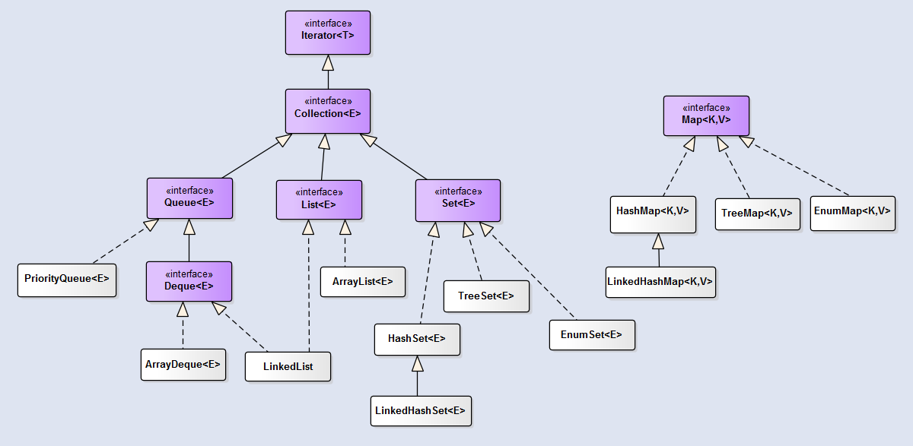
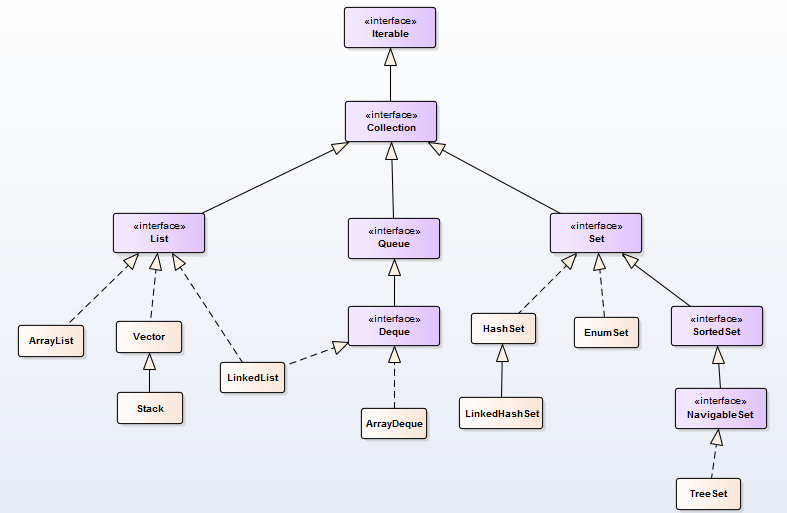

[TOC]

<!-- TOC -->

- [集合框架](#集合框架)
    - [第一部分：概述](#第一部分概述)
        - [整体框架](#整体框架)
        - [Collection](#collection)
        - [Map](#map)
        - [工具类](#工具类)
        - [上述接口的通用实现见下表：](#上述接口的通用实现见下表)
    - [第二部分：面试常见问题](#第二部分面试常见问题)
        - [1. ArrayList和LinkedList是常用的两种存储结构，有哪些区别呢？【阿里面试】](#1-arraylist和linkedlist是常用的两种存储结构有哪些区别呢阿里面试)
        - [2. HashMap和HashTable的区别，HashMap中的key可以是任何对象或数据类型吗？HashTable是线程安全的么？](#2-hashmap和hashtable的区别hashmap中的key可以是任何对象或数据类型吗hashtable是线程安全的么)
        - [3. HashMap和ConcurrentHashMap区别， ConcurrentHashMap 线程安全吗， ConcurrentHashMap如何保证线程安全？](#3-hashmap和concurrenthashmap区别 concurrenthashmap 线程安全吗 concurrenthashmap如何保证线程安全)
        - [4. Hashtable的原理是什么？【阿里内推面试】](#4-hashtable的原理是什么阿里内推面试)
        - [5. Hash冲突的解决办法有哪些？](#5-hash冲突的解决办法有哪些)
        - [6. 什么是迭代器？【面试宝典】](#6-什么是迭代器面试宝典)
        - [7. 因为别人知道源码怎么实现的，故意构造相同的hash的字符串进行攻击，怎么处理？那jdk7怎么办？](#7-因为别人知道源码怎么实现的故意构造相同的hash的字符串进行攻击怎么处理那jdk7怎么办)

<!-- /TOC -->

## 集合框架

### 第一部分：概述

​	Java集合框架提供了数据持有对象的方式，提供了对数据集合的操作。Java集合框架位于`java.util`包下，主要有三个大类：`Collection`、`Map`接口以及对集合进行操作的`工具类`。


#### 整体框架




#### Collection



- `ArrayList`：**线程不同步**。默认初始容量为10，当数组大小不足时容量扩大为1.5倍。为追求效率，ArrayList没有实现同步（synchronized），如果需要多个线程并发访问，用户可以手动同步，也可使用Vector替代。 
- `LinkedList`：**线程不同步**。**双向链接实现**。*LinkedList*同时实现了*List*接口和*Deque*接口，也就是说它既可以看作一个顺序容器，又可以看作一个队列（*Queue*），同时又可以看作一个栈（*Stack*）。这样看来，*LinkedList*简直就是个全能冠军。当你需要使用栈或者队列时，可以考虑使用*LinkedList*，一方面是因为Java官方已经声明不建议使用*Stack*类，更遗憾的是，Java里根本没有一个叫做*Queue*的类（它是个接口名字）。关于栈或队列，现在的首选是*ArrayDeque*，它有着比*LinkedList*（当作栈或队列使用时）有着更好的性能。 
- `Stack and Queue`：Java里有一个叫做*Stack*的类，却没有叫做*Queue*的类（它是个接口名字）。当需要使用栈时，Java已不推荐使用*Stack*，而是推荐使用更高效的*ArrayDeque*；既然*Queue*只是一个接口，当需要使用队列时也就首选*ArrayDeque*了（次选是*LinkedList*）。 
- `Vector`：**线程同步**。默认初始容量为10，当数组大小不足时容量扩大为2倍。它的同步是通过`Iterator`方法加`synchronized`实现的。
- `Stack`：**线程同步**。继承自`Vector`，添加了几个方法来完成栈的功能。现在已经不推荐使用Stack，在栈和队列中有限使用ArrayDeque，其次是LinkedList。
- `TreeSet`：**线程不同步**，内部使用`NavigableMap`操作。默认元素“自然顺序”排列，可以通过`Comparator`改变排序。*TreeSet里面有一个TreeMap*（适配器模式）
- `HashSet`：**线程不同步**，内部使用`HashMap`进行数据存储，提供的方法基本都是调用`HashMap`的方法，所以两者本质是一样的。**集合元素可以为**`NULL`。
- `Set`：Set是一种不包含重复元素的Collection，Set最多只有一个null元素。Set集合通常可以通过Map集合通过适配器模式得到。
- `PriorityQueue`：Java中*PriorityQueue*实现了*Queue*接口，不允许放入`null`元素；其通过堆实现，具体说是通过完全二叉树（*complete binary tree*）实现的**小顶堆**（任意一个非叶子节点的权值，都不大于其左右子节点的权值），也就意味着可以通过数组来作为*PriorityQueue*的底层实现。 
  - **优先队列的作用是能保证每次取出的元素都是队列中权值最小的**（Java的优先队列每次取最小元素，C++的优先队列每次取最大元素）。这里牵涉到了大小关系，**元素大小的评判可以通过元素本身的自然顺序（natural ordering），也可以通过构造时传入的比较器**（*Comparator*，类似于C++的仿函数）。 
- `NavigableSet`：添加了搜索功能，可以对给定元素进行搜索：小于、小于等于、大于、大于等于，放回一个符合条件的最接近给定元素的 key。
- `EnumSet`：线程不同步。内部使用Enum数组实现，速度比`HashSet`快。**只能存储在构造函数传入的枚举类的枚举值**。


#### Map


- `TreeMap`：线程不同步，基于 **红黑树** （Red-Black tree）的NavigableMap 实现，**能够把它保存的记录根据键排序,默认是按键值的升序排序，也可以指定排序的比较器，当用Iterator 遍历TreeMap时，得到的记录是排过序的。**
  - **TreeMap底层通过红黑树（Red-Black tree）实现**，也就意味着`containsKey()`, `get()`, `put()`, `remove()`都有着`log(n)`的时间复杂度。其具体算法实现参照了《算法导论》。
- `HashMap`：线程不同步。根据`key`的`hashcode`进行存储，内部使用静态内部类`Node`的数组进行存储，默认初始大小为16，每次扩大一倍。当发生Hash冲突时，采用拉链法（链表）。。JDK 1.8中：**当单个桶中元素个数大于等于8时，链表实现改为红黑树实现；当元素个数小于6时，变回链表实现。由此来防止hashCode攻击。**
  - Java HashMap采用的是冲突链表方式。  
  - HashMap是Hashtable的轻量级实现，可以接受为null的键值\(key\)和值\(value\)，而Hashtable不允许。
- `LinkedHashMap`：**保存了记录的插入顺序**，在用Iterator遍历LinkedHashMap时，先得到的记录肯定是先插入的. 也可以在构造时用带参数，按照应用次数排序。在遍历的时候会比HashMap慢，不过有种情况例外，当HashMap容量很大，实际数据较少时，遍历起来可能会比LinkedHashMap慢，因为LinkedHashMap的遍历速度只和实际数据有关，和容量无关，而HashMap的遍历速度和他的容量有关。
- `HashTable`：**线程安全**，HashMap的迭代器\(Iterator\)是`fail-fast`迭代器。**HashTable不能存储NULL的key和value。**
- `WeakHashMap`：从名字可以看出它是某种 *Map*。它的特殊之处在于 *WeakHashMap* 里的`entry`可能会被GC自动删除，即使程序员没有调用`remove()`或者`clear()`方法。 WeakHashMap的存储结构类似于HashMap
  - 既然有 *WeekHashMap*，是否有 *WeekHashSet* 呢？答案是没有:( 。不过Java *Collections*工具类给出了解决方案，`Collections.newSetFromMap(Map<E,Boolean> map)`方法可以将任何 *Map*包装成一个*Set*。
- 


#### 工具类

- `Collections`、`Arrays`：集合类的一个工具类帮助类，其中提供了一系列静态方法，用于对集合中元素进行排序、搜索以及线程安全等各种操作。

- `Comparable`、`Comparator`：一般是用于对象的比较来实现排序，两者略有区别。

  > - 类设计者没有考虑到比较问题而没有实现Comparable接口。这是我们就可以通过使用Comparator，这种情况下，我们是不需要改变对象的。
  > - 一个集合中，我们可能需要有多重的排序标准，这时候如果使用Comparable就有些捉襟见肘了，可以自己继承Comparator提供多种标准的比较器进行排序。


说明：线程不同步的时候可以通过，Collections.synchronizedList() 方法来包装一个线程同步方法


#### 上述接口的通用实现见下表：

<table align="center"><tr><td colspan="2" rowspan="2" align="center" border="0"></td><th colspan="5" align="center">Implementations</th></tr><tr><th>Hash Table</th><th>Resizable Array</th><th>Balanced Tree</th><th>Linked List</th><th>Hash Table + Linked List</th></tr><tr><th rowspan="4">Interfaces</th><th>Set</th><td><tt>HashSet</tt></td><td></td><td><tt>TreeSet</tt></td><td></td><td><tt>LinkedHashSet</tt></td></tr><tr><th>List</th><td></td><td><tt>ArrayList</tt></td><td></td><td><tt>LinkedList</tt></td><td></td></tr><tr><th>Deque</th><td></td><td><tt>ArrayDeque</tt></td><td></td><td><tt>LinkedList</tt></td><td></td></tr><tr><th>Map</th><td><tt>HashMap</tt></td><td></td><td><tt>TreeMap</tt></td><td></td><td><tt>LinkedHashMap</tt></td></tr></table>


**参考资料：**

- [CarpenterLee/JCFInternals:深入理解Java集合框架](https://github.com/CarpenterLee/JCFInternals)
- [Java基础-集合框架 - 掘金](https://juejin.im/post/5af86ac8f265da0ba063410e)


### 第二部分：面试常见问题

#### 1. ArrayList和LinkedList是常用的两种存储结构，有哪些区别呢？【阿里面试】

- ArrayList和LinkedList可想从名字分析，它们一个是Array(动态数组)的数据结构，一个是Link(链表)的数据结构，此外，它们两个都是对List接口的实现。前者是数组队列，相当于动态数组；后者为双向链表结构，也可当作堆栈、队列、双端队列
- 当随机访问List时（get和set操作），ArrayList比LinkedList的效率更高，因为LinkedList是线性的数据存储方式，所以需要移动指针从前往后依次查找。
- 当对数据进行增加和删除的操作时(add和remove操作)，LinkedList比ArrayList的效率更高，因为ArrayList是数组，所以在其中进行增删操作时，会对操作点之后所有数据的下标索引造成影响，需要进行数据的移动。
- 从利用效率来看，ArrayList自由性较低，因为它需要手动的设置固定大小的容量，但是它的使用比较方便，只需要创建，然后添加数据，通过调用下标进行使用；而LinkedList自由性较高，能够动态的随数据量的变化而变化，但是它不便于使用。
- ArrayList主要控件开销在于需要在lList列表预留一定空间；而LinkList主要控件开销在于需要存储结点信息以及结点指针信息。


- *ArrayList、LinkedList和Vector如何选择？*
  - 当对数据的主要操作为索引或只在集合的末端增加、删除元素时，使用ArrayList或Vector效率比较高；
  - 当对数据的操作主要为制定位置的插入或删除操作时，使用LinkedList效率比较高；
  - 当在多线程中使用容器时（即多个线程会同时访问该容器），选用Vector较为安全；


#### 2. HashMap和HashTable的区别，HashMap中的key可以是任何对象或数据类型吗？HashTable是线程安全的么？

- **Hash Map和HashTable的区别**  

  - Hashtable的方法是同步的，HashMap非同步，所以在多线程场合要手动同步HashMap这个区别就像Vector和ArrayList一样。 
  - Hashtable不允许 null 值(key 和 value 都不可以)，HashMap允许 null 值(key和value都可以)。 
  - 两者的遍历方式大同小异，Hashtable仅仅比HashMap多一个elements方法。 

  Hashtable 和 HashMap 都能通过values()方法返回一个 Collection ，然后进行遍历处理。 

  两者也都可以通过 entrySet() 方法返回一个 Set ， 然后进行遍历处理。 

  - HashTable使用Enumeration，HashMap使用Iterator。 
  - 哈希值的使用不同，Hashtable直接使用对象的hashCode。而HashMap重新计算hash值，而且用于代替求模。 
  - Hashtable中hash数组默认大小是11，增加的方式是 old*2+1。HashMap中hash数组的默认大小是16，而且一定是2的指数。 
  - HashTable基于Dictionary类，而HashMap基于AbstractMap类 

- **HashMap中的key可以是任何对象或数据类型吗** 

  - 可以为null，但不能是可变对象，如果是可变对象的话，对象中的属性改变，则对象HashCode也进行相应的改变，导致下次无法查找到已存在Map中的数据。 
  - 如果可变对象在HashMap中被用作键，那就要小心在改变对象状态的时候，不要改变它的哈希值了。我们只需要保证成员变量的改变能保证该对象的哈希值不变即可。 

- **HashTable是线程安全的么** 

  - HashTable是线程安全的，其实现是在对应的方法上添加了synchronized关键字进行修饰，由于在执行此方法的时候需要获得对象锁，则执行起来比较慢。所以现在如果为了保证线程安全的话，使用CurrentHashMap。 


#### 3. HashMap和ConcurrentHashMap区别， ConcurrentHashMap 线程安全吗， ConcurrentHashMap如何保证线程安全？

- **HashMap和Concurrent HashMap区别？** 
  - HashMap是非线程安全的，CurrentHashMap是线程安全的。 
  - ConcurrentHashMap将整个Hash桶进行了分段segment，也就是将这个大的数组分成了几个小的片段segment，而且每个小的片段segment上面都有锁存在，那么在插入元素的时候就需要先找到应该插入到哪一个片段segment，然后再在这个片段上面进行插入，而且这里还需要获取segment锁。 
  - ConcurrentHashMap让锁的粒度更精细一些，并发性能更好。 
- **ConcurrentHashMap 线程安全吗， ConcurrentHashMap如何保证 线程安全？** 
  - HashTable容器在竞争激烈的并发环境下表现出效率低下的原因是所有访问HashTable的线程都必须竞争同一把锁，那假如容器里有多把锁，每一把锁用于锁容器其中一部分数据，那么当多线程访问容器里不同数据段的数据时，线程间就不会存在锁竞争，从而可以有效的提高并发访问效率，这就是ConcurrentHashMap所使用的**锁分段技术**，首先将数据分成一段一段的存储，然后给每一段数据配一把锁，当一个线程占用锁访问其中一个段数据的时候，其他段的数据也能被其他线程访问。 
  - get操作的高效之处在于整个get过程不需要加锁，除非读到的值是空的才会加锁重读。get方法里将要使用的共享变量都定义成volatile，如用于统计当前Segement大小的count字段和用于存储值的HashEntry的value。定义成volatile的变量，能够在线程之间保持可见性，能够被多线程同时读，并且保证不会读到过期的值，但是只能被单线程写（有一种情况可以被多线程写，就是写入的值不依赖于原值），在get操作里只需要读不需要写共享变量count和value，所以可以不用加锁。 
  - Put方法首先定位到Segment，然后在Segment里进行插入操作。插入操作需要经历两个步骤，第一步判断是否需要对Segment里的HashEntry数组进行扩容，第二步定位添加元素的位置然后放在HashEntry数组里。 


#### 4. Hashtable的原理是什么？【阿里内推面试】

Hashtable使用链地址法进行元素存储，通过一个实际的例子来演示一下插入元素的过程：

假设我们现在Hashtable的容量为5，已经存在了(5,5)，(13,13)，(16,16)，(17,17)，(21,21)这 5 个键值对，目前他们在Hashtable中的位置如下：

  

现在，我们插入一个新的键值对，put(16,22)，假设key=16的索引为1.但现在索引1的位置有两个Entry了，所以程序会对链表进行迭代。迭代的过程中，发现其中有一个Entry的key和我们要插入的键值对的key相同，所以现在会做的工作就是将newValue=22替换oldValue=16，然后返回oldValue=16. 

 


然后我们现在再插入一个，put(33,33)，key=33的索引为3，并且在链表中也不存在key=33的Entry，所以将该节点插入链表的第一个位置。 

 


**Hashtable 与 HashMap 的简单比较**

1. HashTable 基于 Dictionary 类，而 HashMap 是基于 AbstractMap。Dictionary 是任何可将键映射到相应值的类的抽象父类，而 AbstractMap 是基于 Map 接口的实现，它以最大限度地减少实现此接口所需的工作。
2. HashMap 的 key 和 value 都允许为 null，而 Hashtable 的 key 和 value 都不允许为 null。HashMap 遇到 key 为 null 的时候，调用 putForNullKey 方法进行处理，而对 value 没有处理；Hashtable遇到 null，直接返回 NullPointerException。
3. Hashtable 方法是同步，而HashMap则不是。我们可以看一下源码，Hashtable 中的几乎所有的 public 的方法都是 synchronized 的，而有些方法也是在内部通过 synchronized 代码块来实现。所以有人一般都建议如果是涉及到多线程同步时采用 HashTable，没有涉及就采用 HashMap，但是在 Collections 类中存在一个静态方法：synchronizedMap()，该方法创建了一个线程安全的 Map 对象，并把它作为一个封装的对象来返回。


**参考资料：**

- [Hashtable 的实现原理 - Java 集合学习指南 - 极客学院Wiki](http://wiki.jikexueyuan.com/project/java-collection/hashtable.html)


#### 5. Hash冲突的解决办法有哪些？

- 链地址法
- 开放地址法（向后一位）
  - 线性探测
  - 平方探测
  - 二次哈希
- 再哈希法


#### 6. 什么是迭代器？【面试宝典】

​	Java集合框架的集合类，我们有时候称之为容器。容器的种类有很多种，比如ArrayList、LinkedList、HashSet...，每种容器都有自己的特点，ArrayList底层维护的是一个数组；LinkedList是链表结构的；HashSet依赖的是哈希表，每种容器都有自己特有的数据结构。

​	因为容器的内部结构不同，很多时候可能不知道该怎样去遍历一个容器中的元素。所以为了使对容器内元素的操作更为简单，Java引入了迭代器模式！ 

　　把访问逻辑从不同类型的集合类中抽取出来，从而避免向外部暴露集合的内部结构。

**	迭代器模式：就是提供一种方法对一个容器对象中的各个元素进行访问，而又不暴露该对象容器的内部细。**

```java
public static void main(String[] args) {
    //使用迭代器遍历ArrayList集合
    Iterator<String> listIt = list.iterator();
    while(listIt.hasNext()){
        System.out.println(listIt.hasNext());
    }
    //使用迭代器遍历Set集合
    Iterator<String> setIt = set.iterator();
    while(setIt.hasNext()){
        System.out.println(listIt.hasNext());
    }
    //使用迭代器遍历LinkedList集合
    Iterator<String> linkIt = linkList.iterator();
    while(linkIt.hasNext()){
        System.out.println(listIt.hasNext());
    }
}
```

参考资料：

- [深入理解Java中的迭代器 - Mr·Dragon - 博客园](https://www.cnblogs.com/zyuze/p/7726582.html)
  


#### 7. 因为别人知道源码怎么实现的，故意构造相同的hash的字符串进行攻击，怎么处理？那jdk7怎么办？

- **怎么处理构造相同hash的字符串进行攻击?** 

  - 当客户端提交一个请求并附带参数的时候，web应用服务器会把我们的参数转化成一个HashMap存储，这个HashMap的逻辑结构如下：key1-->value1; 
  - 但是物理存储结构是不同的，key值会被转化成Hashcode，这个hashcode有会被转成数组的下标：0-->value1； 
  - 不同的string就会产生相同hashcode而导致碰撞，碰撞后的物理存储结构可能如下：0-->value1-->value2; 
  - 限制post和get参数的个数，越少越好；限制post数据的大小；使用WAF过滤。

- **Jdk7 如何处理hashcode字符串攻击** 

  - HashMap会动态的使用一个专门的treemap实现来替换掉它。 
