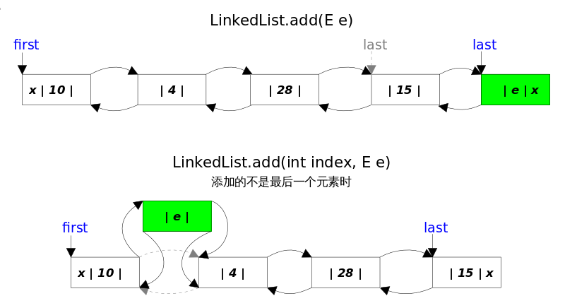
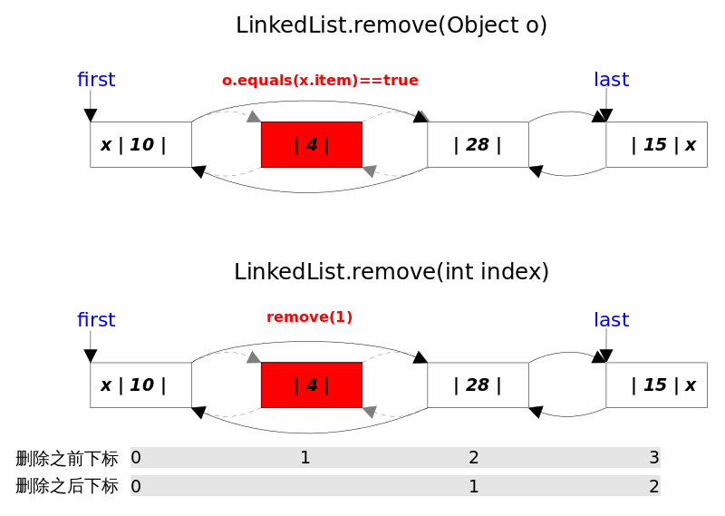
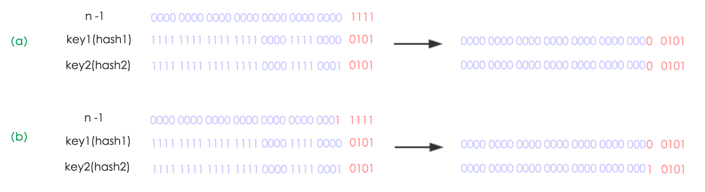
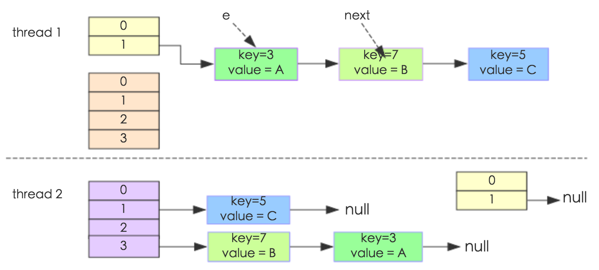
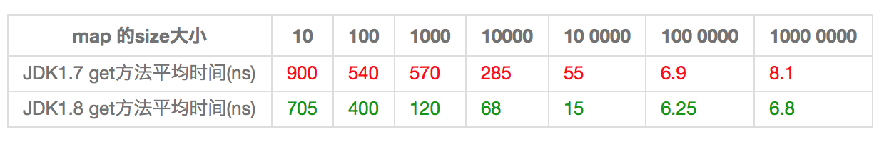
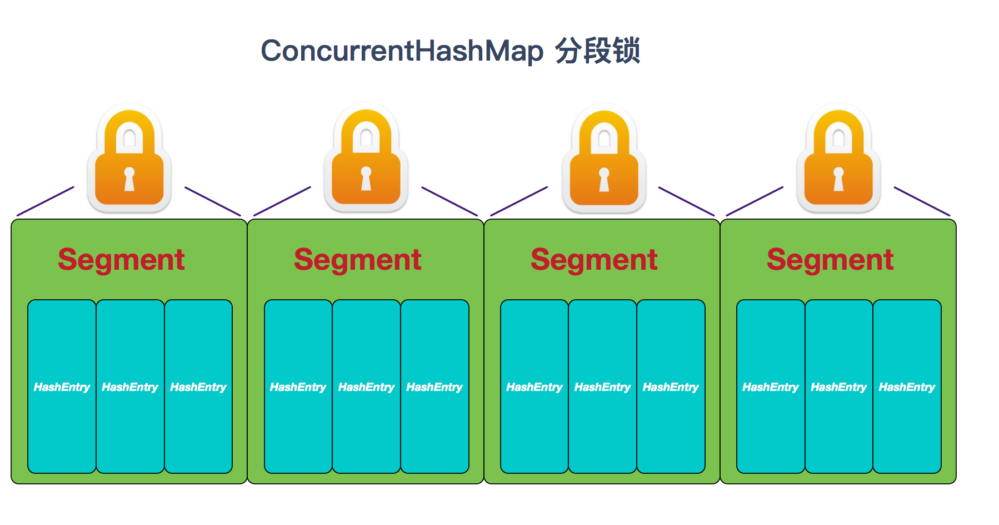
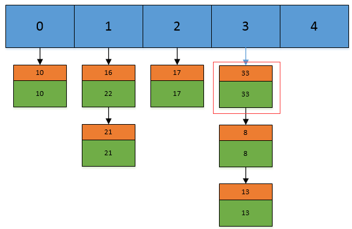
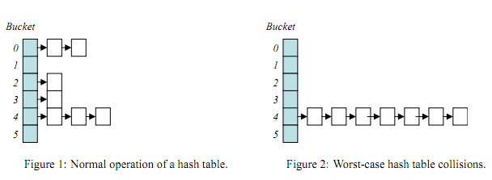

<!-- TOC -->

- [前言](#前言)
- [一、概述](#一概述)
    - [集合框架图](#集合框架图)
    - [Collection](#Collection)
    - [Map](#Map)
    - [工具类](#工具类)
    - [通用实现](#通用实现)
- [二、深入源码分析](#二深入源码分析)
    - [ArrayList](#ArrayList)
        - [1. 概览](#1-概览)
        - [2. 序列化](#2-序列化)
        - [3. 扩容](#3-扩容)
        - [4. 删除元素](#4-删除元素)
        - [5. Fail-Fast](#5-Fail-Fast)
    - [Vector](#Vector)
        - [1. 同步](#1-同步)
        - [2. ArrayList 与 Vector](#2-ArrayList-与-Vector)
        - [3. Vector 替代方案](#3-Vector-替代方案)
            - [synchronizedList](#synchronizedList)
            - [CopyOnWriteArrayList](#CopyOnWriteArrayList)
    - [LinkedList](#LinkedList)
        - [1. 概览](#1-概览-1)
        - [2. add()](#2-add)
        - [3. remove()](#3-remove)
        - [4. get()](#4-get)
        - [5. 总结](#5-总结)
        - [6. ArrayList 与 LinkedList](#6-ArrayList-与-LinkedList)
    - [HashMap](#HashMap)
        - [1. 存储结构](#1-存储结构)
            - [JDK1.7 的存储结构](#jdk17-的存储结构)
            - [JDK1.8 的存储结构](#jdk18-的存储结构)
        - [2. 重要参数](#2-重要参数)
        - [3. 确定哈希桶数组索引位置](#3-确定哈希桶数组索引位置)
        - [4. 分析HashMap的put方法](#4-分析HashMap的put方法)
        - [5. 扩容机制](#5-扩容机制)
        - [6. 线程安全性](#6-线程安全性)
        - [7. JDK1.8与JDK1.7的性能对比](#7-jdk18与jdk17的性能对比)
        - [8. Hash较均匀的情况](#8-hash较均匀的情况)
        - [9. Hash极不均匀的情况](#9-hash极不均匀的情况)
        - [10. HashMap与Hashtable](#10-HashMap与Hashtable)
        - [11. 小结](#11-小结)
    - [ConcurrentHashMap](#ConcurrentHashMap)
        - [1. 概述](#1-概述)
        - [2. 存储结构](#2-存储结构)
        - [2. size 操作](#2-size-操作)
        - [3. 同步方式](#3-同步方式)
        - [4. JDK 1.8 的改动](#4-jdk-18-的改动)
    - [HashSet](#hashset)
        - [1. 成员变量](#1-成员变量)
        - [2. 构造函数](#2-构造函数)
        - [3. add()](#3-add)
        - [4. 总结](#4-总结)
    - [LinkedHashSet and LinkedHashMap](#LinkedHashSet-and-LinkedHashMap)
        - [1. 概览](#1-概览-2)
        - [2. get()](#2-get)
        - [3. put()](#3-put)
        - [4. remove()](#4-remove)
        - [5. LinkedHashSet](#5-LinkedHashSet)
        - [6. LinkedHashMap经典用法](#6-LinkedHashMap经典用法)
- [三、容器中的设计模式](#三容器中的设计模式)
    - [迭代器模式](#迭代器模式)
    - [适配器模式](#适配器模式)
- [四、面试指南](#四面试指南)
    - [1. ArrayList和LinkedList区别](#1-ArrayList和LinkedList区别)
    - [2. HashMap和Hashtable区别，HashMap的key类型](#2-HashMap和Hashtable区别HashMap的key类型)
    - [3. HashMap和ConcurrentHashMap](#3-HashMap和ConcurrentHashMap)
    - [4. Hashtable的原理](#4-Hashtable的原理)
    - [5. Hash冲突的解决办法](#5-hash冲突的解决办法)
    - [6. 什么是迭代器](#6-什么是迭代器)
    - [7. 构造相同hash的字符串进行攻击，这种情况应该怎么处理？JDK7如何处理](#7-构造相同hash的字符串进行攻击这种情况应该怎么处理jdk7如何处理)
    - [8. HashMap为什么大小是2的幂次](#8-HashMap为什么大小是2的幂次)
- [更新日志](#更新日志)

<!-- /TOC -->
# 前言

　　Java集合框架 (Java Collections Framework, JCF) 也称容器，这里可以类比 C++ 中的 STL，在市面上似乎还没能找到一本详细介绍的书籍。在这里主要对如下部分进行源码分析，及在面试中常见的问题。

　　例如，在阿里面试常问到的 HashMap 和 ConcurrentHashMap 原理等等。深入源码分析是面试中必备的技能，通过本文的阅读会对集合框架有更深一步的了解。


本文参考：

- [CarpenterLee/JCFInternals: 深入理解Java集合框架](https://github.com/CarpenterLee/JCFInternals)
- [crossoverJie/Java-Interview: 👨‍🎓 Java related : basic, concurrent, algorithm](https://github.com/crossoverJie/Java-Interview)
- [Interview-Notebook/Java 容器.md at master · CyC2018/Interview-Notebook](https://github.com/CyC2018/Interview-Notebook/blob/master/notes/Java%20%E5%AE%B9%E5%99%A8.md)


# 一、概述

　　Java集合框架提供了数据持有对象的方式，提供了对数据集合的操作。Java 集合框架位于 ` java.util` 包下，主要有三个大类：**Collection(接口)**、**Map(接口)**、**集合工具类**。


## 集合框架图

<div align="center"> </div>


## Collection

- `ArrayList`：**线程不同步**。默认初始容量为 10，当数组大小不足时容量扩大为 1.5 倍。为追求效率，ArrayList 没有实现同步（synchronized），如果需要多个线程并发访问，用户可以手动同步，也可使用 Vector 替代。 
- `LinkedList`：**线程不同步**。**双向链接实现**。LinkedList 同时实现了 List 接口和 Deque 接口，也就是说它既可以看作一个顺序容器，又可以看作一个队列（Queue），同时又可以看作一个栈（Stack）。这样看来，LinkedList 简直就是个全能冠军。当你需要使用栈或者队列时，可以考虑使用 LinkedList，一方面是因为 Java 官方已经声明不建议使用 Stack 类，更遗憾的是，Java 里根本没有一个叫做 Queue 的类（它是个接口名字）。关于栈或队列，现在的首选是 ArrayDeque，它有着比 LinkedList（当作栈或队列使用时）有着更好的性能。 
- `Stack and Queue`：Java 里有一个叫做 Stack 的类，却没有叫做 Queue 的类（它是个接口名字）。当需要使用栈时，Java 已不推荐使用 Stack，而是推荐使用更高效的 ArrayDeque；既然 Queue 只是一个接口，当需要使用队列时也就首选 ArrayDeque 了（次选是 LinkedList ）。 
- `Vector`：**线程同步**。默认初始容量为 10，当数组大小不足时容量扩大为 2 倍。它的同步是通过 `Iterator` 方法加 `synchronized` 实现的。
- `Stack`：**线程同步**。继承自 Vector，添加了几个方法来完成栈的功能。现在已经不推荐使用 Stack，在栈和队列中有限使用 ArrayDeque，其次是 LinkedList。
- `TreeSet`：**线程不同步**，内部使用 `NavigableMap` 操作。默认元素 “自然顺序” 排列，可以通过 `Comparator` 改变排序。TreeSet 里面有一个 TreeMap（适配器模式）
- `HashSet`：**线程不同步**，内部使用 HashMap 进行数据存储，提供的方法基本都是调用 HashMap 的方法，所以两者本质是一样的。集合元素可以为 NULL。
- `Set`：Set 是一种不包含重复元素的 Collection，Set 最多只有一个 null 元素。Set 集合通常可以通过 Map 集合通过适配器模式得到。
- `PriorityQueue`：Java 中 PriorityQueue 实现了 Queue 接口，不允许放入 null 元素；其通过堆实现，具体说是通过完全二叉树（complete binary tree）实现的**小顶堆**（任意一个非叶子节点的权值，都不大于其左右子节点的权值），也就意味着可以通过数组来作为 PriorityQueue 的底层实现。 
  - **优先队列的作用是能保证每次取出的元素都是队列中权值最小的**（Java 的优先队列每次取最小元素，C++ 的优先队列每次取最大元素）。这里牵涉到了大小关系，**元素大小的评判可以通过元素本身的自然顺序（natural ordering），也可以通过构造时传入的比较器**（*Comparator*，类似于 C++ 的仿函数）。 
- `NavigableSet`：添加了搜索功能，可以对给定元素进行搜索：小于、小于等于、大于、大于等于，放回一个符合条件的最接近给定元素的 key。
- `EnumSet`：线程不同步。内部使用 Enum 数组实现，速度比 `HashSet` 快。**只能存储在构造函数传入的枚举类的枚举值**。


　　注释：更多设计模式，请转向 [Java 设计模式](06%20设计模式.md)


## Map

- `TreeMap`：线程不同步，基于 **红黑树** （Red-Black tree）的 NavigableMap 实现，能够把它保存的记录根据键排序，默认是按键值的升序排序，也可以指定排序的比较器，当用 Iterator 遍历 TreeMap 时，得到的记录是排过序的。
  - **TreeMap 底层通过红黑树（Red-Black tree）实现**，也就意味着 `containsKey()`, `get()`, `put()`, `remove()` 都有着 `log(n)` 的时间复杂度。其具体算法实现参照了《算法导论》。
- `Hashtable`：**线程安全**，HashMap 的迭代器 \(Iterator\) 是 `fail-fast` 迭代器。**Hashtable 不能存储 NULL 的 key 和 value。**
- `HashMap`：线程不同步。根据 `key` 的 `hashcode` 进行存储，内部使用静态内部类 `Node` 的数组进行存储，默认初始大小为 16，每次扩大一倍。当发生 Hash 冲突时，采用拉链法（链表）。JDK 1.8中：**当单个桶中元素个数大于等于8时，链表实现改为红黑树实现；当元素个数小于6时，变回链表实现。由此来防止hashCode攻击。**
  - Java HashMap 采用的是冲突链表方式。  
  - HashMap 是 Hashtable 的轻量级实现，可以接受为 null 的键值 (key\) 和值 \(value\)，而 Hashtable 不允许。
- `LinkedHashMap`：**保存了记录的插入顺序**，在用 Iterator 遍历 LinkedHashMap 时，先得到的记录肯定是先插入的。也可以在构造时用带参数，按照应用次数排序。在遍历的时候会比 HashMap 慢，不过有种情况例外，当 HashMap 容量很大，实际数据较少时，遍历起来可能会比 LinkedHashMap 慢，因为 LinkedHashMap 的遍历速度只和实际数据有关，和容量无关，而 HashMap 的遍历速度和他的容量有关。
- `WeakHashMap`：从名字可以看出它是某种 Map。它的特殊之处在于 WeakHashMap 里的 entry 可能会被 GC 自动删除，即使程序员没有调用 `remove()` 或者 `clear()` 方法。 WeakHashMap 的存储结构类似于HashMap
  - 既然有 WeekHashMap，是否有 WeekHashSet 呢？答案是没有！不过 Java Collections 工具类给出了解决方案，`Collections.newSetFromMap(Map<E,Boolean> map)` 方法可以将任何 Map包装成一个Set。


## 工具类

- `Collections`、`Arrays`：集合类的一个工具类帮助类，其中提供了一系列静态方法，用于对集合中元素进行排序、搜索以及线程安全等各种操作。

- `Comparable`、`Comparator`：一般是用于对象的比较来实现排序，两者略有区别。

  > - 类设计者没有考虑到比较问题而没有实现 Comparable 接口。这是我们就可以通过使用 Comparator，这种情况下，我们是不需要改变对象的。
  > - 一个集合中，我们可能需要有多重的排序标准，这时候如果使用 Comparable 就有些捉襟见肘了，可以自己继承 Comparator 提供多种标准的比较器进行排序。


**说明**：线程不同步的时候可以通过，Collections.synchronizedList() 方法来包装一个线程同步方法


## 通用实现

<table align="center"><tr><td colspan="2" rowspan="2" align="center" border="0"></td><th colspan="5" align="center">Implementations</th></tr><tr><th>Hash Table</th><th>Resizable Array</th><th>Balanced Tree</th><th>Linked List</th><th>Hash Table + Linked List</th></tr><tr><th rowspan="4">Interfaces</th><th>Set</th><td><tt>HashSet</tt></td><td></td><td><tt>TreeSet</tt></td><td></td><td><tt>LinkedHashSet</tt></td></tr><tr><th>List</th><td></td><td><tt>ArrayList</tt></td><td></td><td><tt>LinkedList</tt></td><td></td></tr><tr><th>Deque</th><td></td><td><tt>ArrayDeque</tt></td><td></td><td><tt>LinkedList</tt></td><td></td></tr><tr><th>Map</th><td><tt>HashMap</tt></td><td></td><td><tt>TreeMap</tt></td><td></td><td><tt>LinkedHashMap</tt></td></tr></table>


**参考资料：**

- [CarpenterLee/JCFInternals:深入理解Java集合框架](https://github.com/CarpenterLee/JCFInternals)
- [Java基础-集合框架 - 掘金](https://juejin.im/post/5af86ac8f265da0ba063410e)


# 二、深入源码分析

源码分析基于 JDK 1.8 / JDK 1.7，在 IDEA 中 double shift 调出 Search EveryWhere，查找源码文件，找到之后就可以阅读源码。

## ArrayList

### 1. 概览

实现了 RandomAccess 接口，因此支持随机访问，这是理所当然的，因为 ArrayList 是基于数组实现的。

```java
public class ArrayList<E> extends AbstractList<E>
        implements List<E>, RandomAccess, Cloneable, java.io.Serializable
```

数组的默认大小为 10。

```java
private static final int DEFAULT_CAPACITY = 10;
```

<div align="center"> </div>


### 2. 序列化

基于数组实现，保存元素的数组使用 transient 修饰，该关键字声明数组默认不会被序列化。ArrayList 具有动态扩容特性，因此保存元素的数组不一定都会被使用，那么就没必要全部进行序列化。ArrayList 重写了 writeObject() 和 readObject() 来控制只序列化数组中有元素填充那部分内容。

```java
transient Object[] elementData; // non-private to simplify nested class access
```


### 3. 扩容

添加元素时使用 ensureCapacityInternal() 方法来保证容量足够，如果不够时，需要使用 grow() 方法进行扩容，新容量的大小为 `oldCapacity + (oldCapacity >> 1)`，也就是旧容量的 1.5 倍。

扩容操作需要调用 `Arrays.copyOf()` 把原数组整个复制到新数组中，这个操作代价很高，因此最好在创建 ArrayList 对象时就指定大概的容量大小，减少扩容操作的次数。

```java
// JDK 1.8
    
public boolean add(E e) {
    ensureCapacityInternal(size + 1);  // Increments modCount!!
    elementData[size++] = e;
    return true;
}

// 判断数组是否越界
private void ensureCapacityInternal(int minCapacity) {
    if (elementData == DEFAULTCAPACITY_EMPTY_ELEMENTDATA) {
        minCapacity = Math.max(DEFAULT_CAPACITY, minCapacity);
    }
    ensureExplicitCapacity(minCapacity);
}

private void ensureExplicitCapacity(int minCapacity) {
    modCount++;
    // overflow-conscious code
    if (minCapacity - elementData.length > 0)
        grow(minCapacity);
}

// 扩容
private void grow(int minCapacity) {
    // overflow-conscious code
    int oldCapacity = elementData.length;
    int newCapacity = oldCapacity + (oldCapacity >> 1); // 1.5倍
    if (newCapacity - minCapacity < 0)
        newCapacity = minCapacity;
    if (newCapacity - MAX_ARRAY_SIZE > 0)
        newCapacity = hugeCapacity(minCapacity);
    // minCapacity is usually close to size, so this is a win:
    elementData = Arrays.copyOf(elementData, newCapacity);
}

private static int hugeCapacity(int minCapacity) {
    if (minCapacity < 0) // overflow
        throw new OutOfMemoryError();
    return (minCapacity > MAX_ARRAY_SIZE) ? Integer.MAX_VALUE : MAX_ARRAY_SIZE;
}
```


### 4. 删除元素

需要调用 System.arraycopy() 将 index+1 后面的元素都复制到 index 位置上。

```java
public E remove(int index) {
    rangeCheck(index);
    modCount++;
    E oldValue = elementData(index);
    int numMoved = size - index - 1;
    if (numMoved > 0)
        System.arraycopy(elementData, index+1, elementData, index, numMoved);
    elementData[--size] = null; // clear to let GC do its work
    return oldValue;
}
```


### 5. Fail-Fast

**开始之前我们想讲讲，什么是 fail-fast 机制?**

fail-fast 机制在遍历一个集合时，当集合结构被修改，会抛出 Concurrent Modification Exception。

fail-fast 会在以下两种情况下抛出 Concurrent Modification Exception

（1）单线程环境

- 集合被创建后，在遍历它的过程中修改了结构。

- 注意 remove() 方法会让 expectModcount 和 modcount 相等，所以是不会抛出这个异常。

（2）多线程环境

- 当一个线程在遍历这个集合，而另一个线程对这个集合的结构进行了修改。


modCount 用来记录 ArrayList 结构发生变化的次数。结构发生变化是指**添加**或者**删除**至少一个元素的所有操作，或者是调整内部数组的大小，仅仅只是设置元素的值不算结构发生变化。

在进行序列化或者迭代等操作时，需要比较操作前后 modCount 是否改变，如果改变了需要抛出 Concurrent Modification Exception。

```java
private void writeObject(java.io.ObjectOutputStream s) throws java.io.IOException{
    // Write out element count, and any hidden stuff
    int expectedModCount = modCount;
    s.defaultWriteObject();

    // Write out size as capacity for behavioural compatibility with clone()
    s.writeInt(size);

    // Write out all elements in the proper order.
    for (int i=0; i<size; i++) {
        s.writeObject(elementData[i]);
    }

    if (modCount != expectedModCount) {
        throw new ConcurrentModificationException();
    }
}
```


## Vector

### 1. 同步

它的实现与 ArrayList 类似，但是使用了 synchronized 进行同步。

```java
public synchronized boolean add(E e) {
    modCount++;
    ensureCapacityHelper(elementCount + 1);
    elementData[elementCount++] = e;
    return true;
}

public synchronized E get(int index) {
    if (index >= elementCount)
        throw new ArrayIndexOutOfBoundsException(index);
    return elementData(index);
}
```


### 2. ArrayList 与 Vector

- Vector 是同步的，因此开销就比 ArrayList 要大，访问速度更慢。最好使用 ArrayList 而不是 Vector，因为同步操作完全可以由程序员自己来控制；
- Vector 每次扩容请求其大小的 2 倍空间，而 ArrayList 是 1.5 倍。


### 3. Vector 替代方案

#### synchronizedList

为了获得线程安全的 ArrayList，可以使用  `Collections.synchronizedList();`  得到一个线程安全的  ArrayList。

```java
List<String> list = new ArrayList<>();
List<String> synList = Collections.synchronizedList(list);
```


#### CopyOnWriteArrayList

<div align="center"> </div><br/>


也可以使用 concurrent 并发包下的 CopyOnWriteArrayList 类。

```java
List<String> list = new CopyOnWriteArrayList<>();
```

CopyOnWrite 容器即写时复制的容器。通俗的理解是**当我们往一个容器添加元素的时候，不直接往当前容器添加，而是先将当前容器进行 Copy，复制出一个新的容器，然后新的容器里添加元素，添加完元素之后，再将原容器的引用指向新的容器**。这样做的好处是我们可以对 CopyOnWrite 容器进行并发的读，而不需要加锁，因为当前容器不会添加任何元素。所以 CopyOnWrite 容器也是一种**读写分离**的思想，读和写不同的容器。 

```java
public boolean add(T e) {
    final ReentrantLock lock = this.lock;
    lock.lock();
    try {
        Object[] elements = getArray();
        int len = elements.length;
        // 复制出新数组
        Object[] newElements = Arrays.copyOf(elements, len + 1);
        // 把新元素添加到新数组里
        newElements[len] = e;
        // 把原数组引用指向新数组
        setArray(newElements);
        return true;
    } finally {
        lock.unlock();
    }
}

final void setArray(Object[] a) {
    array = a;
}
```

读的时候不需要加锁，如果读的时候有多个线程正在向 ArrayList 添加数据，读还是会读到旧的数据，因为写的时候不会锁住旧的 ArrayList。  

```java
public E get(int index) {
    return get(getArray(), index);
}
```

**CopyOnWrite的缺点**

- CopyOnWrite 容器有很多优点，但是同时也存在两个问题，即内存占用问题和数据一致性问题。所以在开发的时候需要注意一下。

**内存占用问题**。

- 因为 CopyOnWrite 的写时复制机制，所以在进行写操作的时候，内存里会同时驻扎两个对象的内存，旧的对象和新写入的对象（注意：在复制的时候只是复制容器里的引用，只是在写的时候会创建新对象添加到新容器里，而旧容器的对象还在使用，所以有两份对象内存）。如果这些对象占用的内存比较大，比如说 200M 左右，那么再写入 100M 数据进去，内存就会占用 300M，那么这个时候很有可能造成频繁的 Yong GC 和 Full GC。之前我们系统中使用了一个服务由于每晚使用 CopyOnWrite 机制更新大对象，造成了每晚 15 秒的 Full GC，应用响应时间也随之变长。

- 针对内存占用问题，可以通过压缩容器中的元素的方法来减少大对象的内存消耗，比如，如果元素全是 10 进制的数字，可以考虑把它压缩成 36 进制或 64 进制。或者不使用 CopyOnWrite 容器，而使用其他的并发容器，如  ConcurrentHashMap 。

**数据一致性问题**。

- CopyOnWrite 容器只能保证数据的最终一致性，不能保证数据的实时一致性。所以如果你希望写入的的数据，马上能读到，请不要使用 CopyOnWrite 容器。

- 关于 C++ 的 STL 中，曾经也有过 Copy-On-Write 的玩法，参见陈皓的《[C++ STL String类中的Copy-On-Write](http://blog.csdn.net/haoel/article/details/24058)》，后来，因为有很多线程安全上的事，就被去掉了。


参考资料：

- [聊聊并发-Java中的Copy-On-Write容器 | 并发编程网 – ifeve.com](http://ifeve.com/java-copy-on-write/)


## LinkedList

<div align="center"> </div>

### 1. 概览

**LinkedList 底层是基于双向链表实现的**，也是实现了 List 接口，所以也拥有 List 的一些特点 (JDK1.7/8 之后取消了循环，修改为双向链表) 。 

LinkedList 同时实现了 List 接口和 Deque 接口，也就是说它既可以看作一个顺序容器，又可以看作一个队列（Queue），同时又可以看作一个栈（Stack）。这样看来， LinkedList 简直就是个全能冠军。当你需要使用栈或者队列时，可以考虑使用 LinkedList ，一方面是因为 Java 官方已经声明不建议使用 Stack 类，更遗憾的是，Java里根本没有一个叫做 Queue 的类（它是个接口名字）。

关于栈或队列，现在的首选是 ArrayDeque，它有着比 LinkedList （当作栈或队列使用时）有着更好的性能。 

基于双向链表实现，内部使用 Node 来存储链表节点信息。

```java
private static class Node<E> {
    E item;
    Node<E> next;
    Node<E> prev;
}
```

每个链表存储了 Head 和 Tail 指针：

```java
transient Node<E> first;
transient Node<E> last;
```

LinkedList 的实现方式决定了所有跟下标相关的操作都是线性时间，而在首段或者末尾删除元素只需要常数时间。为追求效率*LinkedList*没有实现同步（synchronized），如果需要多个线程并发访问，可以先采用 `Collections.synchronizedList()` 方法对其进行包装。 


### 2. add()

<div align="center"> </div>

add() 方法有两个版本，一个是 `add(E e)`，该方法在 LinkedList 的末尾插入元素，因为有 last 指向链表末尾，在末尾插入元素的花费是常数时间。只需要简单修改几个相关引用即可；另一个是 `add(int index, E element)`，该方法是在指定下表处插入元素，需要先通过线性查找找到具体位置，然后修改相关引用完成插入操作。

```java
// JDK 1.8
public boolean add(E e) {
    linkLast(e);
    return true;
}

/**
* Links e as last element.
*/
void linkLast(E e) {
    final Node<E> l = last;
    final Node<E> newNode = new Node<>(l, e, null);
    last = newNode;
    if (l == null)
        first = newNode;
    else
        l.next = newNode;
    size++;
    modCount++;
}

```
`add(int index, E element)` 的逻辑稍显复杂，可以分成两部分

1. 先根据 index 找到要插入的位置；

2. 修改引用，完成插入操作。


```java
public void add(int index, E element) {
    checkPositionIndex(index);
    if (index == size)
        linkLast(element);
    else
        linkBefore(element, node(index));
}

private void checkPositionIndex(int index) {
    if (!isPositionIndex(index))
        throw new IndexOutOfBoundsException(outOfBoundsMsg(index));
}
```

上面代码中的 `node(int index)` 函数有一点小小的 trick，因为链表双向的，可以从开始往后找，也可以从结尾往前找，具体朝那个方向找取决于条件 `index < (size >> 1)`，也即是 index 是靠近前端还是后端。


### 3. remove()

remove() 方法也有两个版本，一个是删除跟指定元素相等的第一个元素 `remove(Object o)`，另一个是删除指定下标处的元素 `remove(int index)`。

<div align="center"> </div>

两个删除操作都要：

1. 先找到要删除元素的引用；
2. 修改相关引用，完成删除操作。

在寻找被删元素引用的时候 `remove(Object o)` 调用的是元素的 equals 方法，而 `remove(int index)` 使用的是下标计数，两种方式都是线性时间复杂度。在步骤 2 中，两个 `revome()` 方法都是通过 `unlink(Node<E> x)` 方法完成的。这里需要考虑删除元素是第一个或者最后一个时的边界情况。  


### 4. get()

```java
public E get(int index) {
	checkElementIndex(index);
	return node(index).item;
}
    
Node<E> node(int index) {
	// assert isElementIndex(index);
    if (index < (size >> 1)) {
        Node<E> x = first;
        for (int i = 0; i < index; i++)
            x = x.next;
        return x;
	} else {
        Node<E> x = last;
        for (int i = size - 1; i > index; i--)
            x = x.prev;
        return x;
	}
}
```

由此可以看出是使用二分查找来看 `index` 离 size 中间距离来判断是从头结点正序查还是从尾节点倒序查。

- node() 会以 `O(n/2)` 的性能去获取一个结点
  - 如果索引值大于链表大小的一半，那么将从尾结点开始遍历

这样的效率是非常低的，特别是当 index 越接近 size 的中间值时。


### 5. 总结

- LinkedList 插入，删除都是移动指针效率很高。
- 查找需要进行遍历查询，效率较低。


### 6. ArrayList 与 LinkedList

- ArrayList 基于动态数组实现，LinkedList 基于双向链表实现；
- ArrayList 支持随机访问，LinkedList 不支持；
- LinkedList 在任意位置添加删除元素更快。


## HashMap

我们这篇文章就来试着分析下 HashMap 的源码，由于 HashMap 底层涉及到太多方面，一篇文章总是不能面面俱到，所以我们可以带着面试官常问的几个问题去看源码：

1. 了解底层如何存储数据的
2. HashMap 的几个主要方法
3. HashMap 是如何确定元素存储位置的以及如何处理哈希冲突的
4. HashMap 扩容机制是怎样的
5. JDK 1.8 在扩容和解决哈希冲突上对 HashMap 源码做了哪些改动？有什么好处?


HashMap 的内部功能实现很多，本文主要从根据 key 获取哈希桶数组索引位置、put 方法的详细执行、扩容过程三个具有代表性的点深入展开讲解。

### 1. 存储结构

#### JDK1.7 的存储结构

在 1.7 之前 JDK 采用「拉链法」来存储数据，即数组和链表结合的方式：

 <div align="center"> </div>

 「拉链法」用专业点的名词来说叫做**链地址法**。简单来说，就是数组加链表的结合。在每个数组元素上存储的都是一个链表。

我们之前说到不同的 key 可能经过 hash 运算可能会得到相同的地址，但是一个数组单位上只能存放一个元素，采用链地址法以后，如果遇到相同的 hash 值的 key 的时候，我们可以将它放到作为数组元素的链表上。待我们去取元素的时候通过 hash 运算的结果找到这个链表，再在链表中找到与 key 相同的节点，就能找到 key 相应的值了。

JDK1.7 中新添加进来的元素总是放在数组相应的角标位置，而原来处于该角标的位置的节点作为 next 节点放到新节点的后边。稍后通过源码分析我们也能看到这一点。

 

####  JDK1.8 的存储结构

对于 JDK1.8 之后的 `HashMap` 底层在解决哈希冲突的时候，就不单单是使用数组加上单链表的组合了，因为当处理如果 hash 值冲突较多的情况下，链表的长度就会越来越长，此时通过单链表来寻找对应 Key 对应的 Value 的时候就会使得时间复杂度达到 O(n)，因此在 JDK1.8 之后，在链表新增节点导致链表长度超过 `TREEIFY_THRESHOLD = 8`  的时候，就会在添加元素的同时将原来的单链表转化为红黑树。

对数据结构很在行的读者应该，知道红黑树是一种易于增删改查的二叉树，他对与数据的查询的时间复杂度是 `O(logn)` 级别，所以利用红黑树的特点就可以更高效的对 `HashMap` 中的元素进行操作。

<div align="center"> </div><br/>

 

从结构实现来讲，HashMap 是数组+链表+红黑树（JDK1.8增加了红黑树部分）实现的，如下如所示。 

<div align="center"> </div>


**这里需要讲明白两个问题：数据底层具体存储的是什么？这样的存储方式有什么优点呢？** 

（1）从源码可知，HashMap 类中有一个非常重要的字段，就是 Node[] table，即哈希桶数组，明显它是一个 Node 的数组。我们来看 Node（ JDK1.8 中） 是何物。

```java
static class Node<K,V> implements Map.Entry<K,V> {
    final int hash;    //用来定位数组索引位置
    final K key;
    V value;
    Node<K,V> next;   //链表的下一个node

    Node(int hash, K key, V value, Node<K,V> next) { ... }
    public final K getKey(){ ... }
    public final V getValue() { ... }
    public final String toString() { ... }
    public final int hashCode() { ... }
    public final V setValue(V newValue) { ... }
    public final boolean equals(Object o) { ... }
}
```

Node 是 HashMap 的一个内部类，实现了 Map.Entry 接口，本质是就是一个映射（键值对）。上图中的每个黑色圆点就是一个Node对象。

（2）HashMap 就是使用哈希表来存储的。哈希表为解决冲突，可以采用**开放地址法**和**链地址法**等来解决问题， Java 中 HashMap 采用了链地址法。链地址法，简单来说，就是数组加链表的结合。在每个数组元素上都一个链表结构，当数据被 Hash 后，得到数组下标，把数据放在对应下标元素的链表上。例如程序执行下面代码：

```java
map.put("美团","小美");
```

系统将调用 "美团" 这个 key 的 hashCode() 方法得到其 hashCode 值（该方法适用于每个 Java 对象），然后再通过 Hash 算法的后两步运算（高位运算和取模运算，下文有介绍）来定位该键值对的存储位置，有时两个 key 会定位到相同的位置，表示发生了 Hash 碰撞。当然 Hash 算法计算结果越分散均匀，Hash 碰撞的概率就越小，map 的存取效率就会越高。

如果哈希桶数组很大，即使较差的 Hash 算法也会比较分散，如果哈希桶数组数组很小，即使好的 Hash 算法也会出现较多碰撞，所以就需要在空间成本和时间成本之间权衡，其实就是在根据实际情况确定哈希桶数组的大小，并在此基础上设计好的 hash 算法减少 Hash 碰撞。

**那么通过什么方式来控制 map 使得 Hash 碰撞的概率又小，哈希桶数组（Node[] table）占用空间又少呢？**

答案就是好的 Hash 算法和扩容机制。

在理解 Hash 和扩容流程之前，我们得先了解下 HashMap 的几个字段。从 HashMap 的默认构造函数源码可知，构造函数就是对下面几个字段进行初始化，源码如下：

```java
int threshold;             // 所能容纳的key-value对极限 
final float loadFactor;    // 负载因子
int modCount;  
int size;
```

首先，**Node[] table的初始化长度 length (默认值是16)**，**Load factor 为负载因子(默认值是0.75)**，threshold 是 HashMap 所能容纳的最大数据量的 Node (键值对)个数。**threshold = length * Load factor**。也就是说，在数组定义好长度之后，负载因子越大，所能容纳的键值对个数越多。

结合负载因子的定义公式可知，threshold 就是在此 Load factor 和 length (数组长度)对应下允许的最大元素数目，超过这个数目就重新 resize(扩容)，扩容后的 HashMap 容量是之前容量的两倍。默认的负载因子 0.75 是对空间和时间效率的一个平衡选择，建议大家不要修改，除非在时间和空间比较特殊的情况下，如果内存空间很多而又对时间效率要求很高，可以降低负载因子 Load factor 的值；相反，如果内存空间紧张而对时间效率要求不高，可以增加负载因子 loadFactor 的值，这个值可以大于1。

size 这个字段其实很好理解，就是 HashMap 中实际存在的键值对数量。注意和 table 的长度 length、容纳最大键值对数量 threshold 的区别。而 modCount 字段主要用来记录 HashMap 内部结构发生变化的次数，主要用于迭代的快速失败。强调一点，内部结构发生变化指的是结构发生变化，例如 put 新键值对，但是某个 key 对应的 value 值被覆盖不属于结构变化。

在 HashMap 中，哈希桶数组 table 的长度 length 大小必须为 2<sup>n</sup>（一定是合数），这是一种非常规的设计，常规的设计是把桶的大小设计为素数。相对来说素数导致冲突的概率要小于合数，具体证明可以参考 [为什么一般hashtable的桶数会取一个素数？](https://blog.csdn.net/liuqiyao_01/article/details/14475159) ，**Hashtable 初始化桶大小为 11，就是桶大小设计为素数的应用（Hashtable 扩容后不能保证还是素数）**。HashMap 采用这种非常规设计，**主要是为了在取模和扩容时做优化，同时为了减少冲突，HashMap 定位哈希桶索引位置时，也加入了高位参与运算的过程**。

这里存在一个问题，即使负载因子和 Hash 算法设计的再合理，也免不了会出现拉链过长的情况，一旦出现拉链过长，则会严重影响 HashMap 的性能。于是，在 JDK1.8 版本中，对数据结构做了进一步的优化，引入了红黑树。而当链表长度太长（默认超过8）时，链表就转换为红黑树，利用红黑树快速增删改查的特点提高 HashMap 的性能，其中会用到红黑树的插入、删除、查找等算法。本文不再对红黑树展开讨论，想了解更多红黑树数据结构的工作原理可以参考：[教你初步了解红黑树](https://blog.csdn.net/v_july_v/article/details/6105630)。


### 2. 重要参数

| 参数                | 说明                                                         |
| ------------------- | ------------------------------------------------------------ |
| buckets             | 在 HashMap 的注释里使用哈希桶来形象的表示数组中每个地址位置。注意这里并不是数组本身，数组是装哈希桶的，他可以被称为**哈希表**。 |
| capacity            | table 的容量大小，默认为 16。需要注意的是 capacity 必须保证为 2 的 n 次方。 |
| size                | table 的实际使用量。                                         |
| threshold           | size 的临界值，size 必须小于 threshold，如果大于等于，就必须进行扩容操作。 |
| loadFactor          | 装载因子，table 能够使用的比例，threshold = capacity * loadFactor。 |
| TREEIFY_THRESHOLD   | 树化阀值，哈希桶中的节点个数大于该值（默认为8）的时候将会被转为红黑树行存储结构。 |
| UNTREEIFY_THRESHOLD | 非树化阀值，小于该值（默认为 6）的时候将再次改为单链表的格式存储 |


### 3. 确定哈希桶数组索引位置

很多操作都需要先确定一个键值对所在的桶下标。

```java
int hash = hash(key);
int i = indexFor(hash, table.length);
```

（一）计算 hash 值

```java
final int hash(Object k) {
    int h = hashSeed;
    if (0 != h && k instanceof String) {
        return sun.misc.Hashing.stringHash32((String) k);
    }

    h ^= k.hashCode();

    // This function ensures that hashCodes that differ only by
    // constant multiples at each bit position have a bounded
    // number of collisions (approximately 8 at default load factor).
    h ^= (h >>> 20) ^ (h >>> 12);
    return h ^ (h >>> 7) ^ (h >>> 4);
}
public final int hashCode() {
    return Objects.hashCode(key) ^ Objects.hashCode(value);
}
```

（二）取模

令 x = 1<<4，即 x 为 2 的 4 次方，它具有以下性质：

```
x   : 00010000
x-1 : 00001111
```

令一个数 y 与 x-1 做与运算，可以去除 y 位级表示的第 4 位以上数：

```
y       : 10110010
x-1     : 00001111
y&(x-1) : 00000010
```

这个性质和 y 对 x 取模效果是一样的：

```
y   : 10110010
x   : 00010000
y%x : 00000010
```

我们知道，位运算的代价比求模运算小的多，因此在进行这种计算时用位运算的话能带来更高的性能。

确定桶下标的最后一步是将 key 的 hash 值对桶个数取模：hash%capacity，如果能保证 capacity 为 2 的 n 次方，那么就可以将这个操作转换为位运算。

```java
static int indexFor(int h, int length) {
    return h & (length-1);
}
```


### 4. 分析HashMap的put方法


　　HashMap 的 put 方法执行过程可以通过下图来理解，自己有兴趣可以去对比源码更清楚地研究学习。

<div align="center"> </div><br/>

①.判断键值对数组 table[i] 是否为空或为 null，否则执行 resize() 进行扩容；

②.根据键值 key 计算 hash 值得到插入的数组索引i，如果 table[i]==null，直接新建节点添加，转向 ⑥，如果table[i] 不为空，转向 ③；

③.判断 table[i] 的首个元素是否和 key 一样，如果相同直接覆盖 value，否则转向 ④，这里的相同指的是 hashCode 以及 equals；

④.判断table[i] 是否为 treeNode，即 table[i] 是否是红黑树，如果是红黑树，则直接在树中插入键值对，否则转向 ⑤；

⑤.遍历 table[i]，判断链表长度是否大于 8，大于 8 的话把链表转换为红黑树，在红黑树中执行插入操作，否则进行链表的插入操作；遍历过程中若发现 key 已经存在直接覆盖 value 即可；

⑥.插入成功后，判断实际存在的键值对数量 size 是否超多了最大容量 threshold，如果超过，进行扩容。

JDK1.8 HashMap 的 put 方法源码如下:

```java
public V put(K key, V value) {
    // 对key的hashCode()做hash
    return putVal(hash(key), key, value, false, true);
}

final V putVal(int hash, K key, V value, boolean onlyIfAbsent,
               boolean evict) {
    Node<K,V>[] tab; Node<K,V> p; int n, i;
    // 步骤①：tab为空则创建
    if ((tab = table) == null || (n = tab.length) == 0)
        n = (tab = resize()).length;
    // 步骤②：计算index，并对null做处理 
    if ((p = tab[i = (n - 1) & hash]) == null) 
        tab[i] = newNode(hash, key, value, null);
    else {
        Node<K,V> e; K k;
        // 步骤③：节点key存在，直接覆盖value
        if (p.hash == hash &&
            ((k = p.key) == key || (key != null && key.equals(k))))
            e = p;
        // 步骤④：判断该链为红黑树
        else if (p instanceof TreeNode)
            e = ((TreeNode<K,V>)p).putTreeVal(this, tab, hash, key, value);
        // 步骤⑤：该链为链表
        else {
            for (int binCount = 0; ; ++binCount) {
                if ((e = p.next) == null) {
                    p.next = newNode(hash, key,value,null);
                     //链表长度大于8转换为红黑树进行处理
                    if (binCount >= TREEIFY_THRESHOLD - 1) // -1 for 1st  
                        treeifyBin(tab, hash);
                    break;
                }
                 // key已经存在直接覆盖value
                if (e.hash == hash &&
                    ((k = e.key) == key || (key != null && key.equals(k)))) 
                           break;
                p = e;
            }
        }
        
        if (e != null) { // existing mapping for key
            V oldValue = e.value;
            if (!onlyIfAbsent || oldValue == null)
                e.value = value;
            afterNodeAccess(e);
            return oldValue;
        }
    }
    ++modCount;
    // 步骤⑥：超过最大容量 就扩容
    if (++size > threshold)
        resize();
    afterNodeInsertion(evict);
    return null;
}
```

### 5. 扩容机制

扩容 (resize) 就是重新计算容量，向 HashMap 对象里不停的添加元素，而 HashMap 对象内部的数组无法装载更多的元素时，对象就需要扩大数组的长度，以便能装入更多的元素。当然 Java 里的数组是无法自动扩容的，方法是使用一个新的数组代替已有的容量小的数组，就像我们用一个小桶装水，如果想装更多的水，就得换大水桶。

我们分析下 resize 的源码，鉴于 JDK1.8 融入了红黑树，较复杂，为了便于理解我们仍然使用 JDK1.7 的代码，好理解一些，本质上区别不大，具体区别后文再说。

```JAVA
void resize(int newCapacity) {   //传入新的容量
    Entry[] oldTable = table;    //引用扩容前的Entry数组
    int oldCapacity = oldTable.length;         
    if (oldCapacity == MAXIMUM_CAPACITY) {  //扩容前的数组大小如果已经达到最大(2^30)了
        threshold = Integer.MAX_VALUE; //修改阈值为int的最大值(2^31-1)，这样以后就不会扩容了
        return;
    }
 
    Entry[] newTable = new Entry[newCapacity];  //初始化一个新的Entry数组
    transfer(newTable);                         //！！将数据转移到新的Entry数组里
    table = newTable;                           //HashMap的table属性引用新的Entry数组
    threshold = (int)(newCapacity * loadFactor);//修改阈值
}
```

这里就是使用一个容量更大的数组来代替已有的容量小的数组，transfer() 方法将原有 Entry 数组的元素拷贝到新的 Entry 数组里。

```java
void transfer(Entry[] newTable) {
    Entry[] src = table;                   //src引用了旧的Entry数组
    int newCapacity = newTable.length;
    for (int j = 0; j < src.length; j++) { //遍历旧的Entry数组
        Entry<K,V> e = src[j];             //取得旧Entry数组的每个元素
        if (e != null) {
            src[j] = null;//释放旧Entry数组的对象引用（for循环后，旧的Entry数组不再引用任何对象）
            do {
                Entry<K,V> next = e.next;
                int i = indexFor(e.hash, newCapacity); //！！重新计算每个元素在数组中的位置
                e.next = newTable[i]; //标记[1]
                newTable[i] = e;      //将元素放在数组上
                e = next;             //访问下一个Entry链上的元素
            } while (e != null);
        }
    }
}
```

newTable[i] 的引用赋给了 e.next，也就是使用了单链表的头插入方式，同一位置上新元素总会被放在链表的头部位置；这样先放在一个索引上的元素终会被放到 Entry 链的尾部(如果发生了 hash 冲突的话），这一点和 Jdk1.8 有区别，下文详解。在旧数组中同一条 Entry 链上的元素，通过重新计算索引位置后，有可能被放到了新数组的不同位置上。

下面举个例子说明下扩容过程。假设了我们的 hash 算法就是简单的用 key mod 一下表的大小（也就是数组的长度）。其中的哈希桶数组 table 的 size=2， 所以 key = 3、7、5，put 顺序依次为 5、7、3。在 mod 2 以后都冲突在 table[1] 这里了。这里假设负载因子 loadFactor=1，即当键值对的实际大小 size 大于 table 的实际大小时进行扩容。接下来的三个步骤是哈希桶数组 resize 成 4，然后所有的 Node 重新 rehash 的过程。

<div align="center"> </div>

下面我们讲解下 JDK1.8 做了哪些优化。经过观测可以发现，我们使用的是 2 次幂的扩展 (指长度扩为原来 2 倍)，所以，元素的位置要么是在原位置，要么是在原位置再移动 2 次幂的位置。看下图可以明白这句话的意思，n 为 table 的长度，图（a）表示扩容前的 key1 和 key2 两种 key 确定索引位置的示例，图（b）表示扩容后 key1 和 key2 两种 key 确定索引位置的示例，其中 hash1 是 key1 对应的哈希与高位运算结果。

<div align="center"> </div><br/>

元素在重新计算 hash 之后，因为 n 变为 2 倍，那么 n-1 的 mask 范围在高位多 1bit (红色)，因此新的 index 就会发生这样的变化：

<div align="center"> </div>

因此，我们在扩充 HashMap 的时候，不需要像 JDK1.7 的实现那样重新计算 hash，只需要看看原来的 hash 值新增的那个 bit 是 1 还是 0 就好了，是 0 的话索引没变，是 1 的话索引变成“原索引+oldCap”，可以看看下图为 16 扩充为 32 的 resize 示意图：

<div align="center"> </div><br/>

这个设计确实非常的巧妙，既省去了重新计算 hash 值的时间，而且同时，由于新增的 1bit 是 0 还是 1 可以认为是随机的，因此 resize 的过程，均匀的把之前的冲突的节点分散到新的 bucket 了。这一块就是 JDK1.8 新增的优化点。有一点注意区别，JDK1.7 中 rehash 的时候，旧链表迁移新链表的时候，如果在新表的数组索引位置相同，则链表元素会倒置，但是从上图可以看出，JDK1.8 不会倒置。有兴趣的同学可以研究下 JDK1.8 的 resize源 码，写的很赞，如下:

```java
final Node<K,V>[] resize() {
    Node<K,V>[] oldTab = table;
    int oldCap = (oldTab == null) ? 0 : oldTab.length;
    int oldThr = threshold;
    int newCap, newThr = 0;
    if (oldCap > 0) {
        // 超过最大值就不再扩充了，就只好随你碰撞去吧
        if (oldCap >= MAXIMUM_CAPACITY) {
            threshold = Integer.MAX_VALUE;
            return oldTab;
        }
        // 没超过最大值，就扩充为原来的2倍
        else if ((newCap = oldCap << 1) < MAXIMUM_CAPACITY &&
                 oldCap >= DEFAULT_INITIAL_CAPACITY)
            newThr = oldThr << 1; // double threshold
    }
    else if (oldThr > 0) // initial capacity was placed in threshold
        newCap = oldThr;
    else {               // zero initial threshold signifies using defaults
        newCap = DEFAULT_INITIAL_CAPACITY;
        newThr = (int)(DEFAULT_LOAD_FACTOR * DEFAULT_INITIAL_CAPACITY);
    }
    // 计算新的resize上限
    if (newThr == 0) {

        float ft = (float)newCap * loadFactor;
        newThr = (newCap < MAXIMUM_CAPACITY && ft < (float)MAXIMUM_CAPACITY ?
                  (int)ft : Integer.MAX_VALUE);
    }
    threshold = newThr;
    @SuppressWarnings({"rawtypes"，"unchecked"})
        Node<K,V>[] newTab = (Node<K,V>[])new Node[newCap];
    table = newTab;
    if (oldTab != null) {
        // 把每个bucket都移动到新的buckets中
        for (int j = 0; j < oldCap; ++j) {
            Node<K,V> e;
            if ((e = oldTab[j]) != null) {
                oldTab[j] = null;
                if (e.next == null)
                    newTab[e.hash & (newCap - 1)] = e;
                else if (e instanceof TreeNode)
                    ((TreeNode<K,V>)e).split(this, newTab, j, oldCap);
                else { // 链表优化重hash的代码块
                    Node<K,V> loHead = null, loTail = null;
                    Node<K,V> hiHead = null, hiTail = null;
                    Node<K,V> next;
                    do {
                        next = e.next;
                        // 原索引
                        if ((e.hash & oldCap) == 0) {
                            if (loTail == null)
                                loHead = e;
                            else
                                loTail.next = e;
                            loTail = e;
                        }
                        // 原索引+oldCap
                        else {
                            if (hiTail == null)
                                hiHead = e;
                            else
                                hiTail.next = e;
                            hiTail = e;
                        }
                    } while ((e = next) != null);
                    // 原索引放到bucket里
                    if (loTail != null) {
                        loTail.next = null;
                        newTab[j] = loHead;
                    }
                    // 原索引+oldCap放到bucket里
                    if (hiTail != null) {
                        hiTail.next = null;
                        newTab[j + oldCap] = hiHead;
                    }
                }
            }
        }
    }
    return newTab;
}
```

### 6. 线程安全性

在多线程使用场景中，应该尽量避免使用线程不安全的 HashMap，而使用线程安全的 ConcurrentHashMap。那么为什么说 HashMap 是线程不安全的，下面举例子说明在并发的多线程使用场景中使用 HashMap 可能造成死循环。代码例子如下(便于理解，仍然使用 JDK1.7 的环境)：

```java
public class HashMapInfiniteLoop {  

    private static HashMap<Integer,String> map = new HashMap<Integer,String>(2，0.75f);  
    public static void main(String[] args) {  
        map.put(5， "C");  

        new Thread("Thread1") {  
            public void run() {  
                map.put(7, "B");  
                System.out.println(map);  
            };  
        }.start();  
        new Thread("Thread2") {  
            public void run() {  
                map.put(3, "A);  
                System.out.println(map);  
            };  
        }.start();        
    }  
}
```

其中，map初始化为一个长度为2的数组，loadFactor=0.75，threshold=2*0.75=1，也就是说当put第二个key的时候，map就需要进行resize。

通过设置断点让线程1和线程2同时debug到transfer方法(3.3小节代码块)的首行。注意此时两个线程已经成功添加数据。放开thread1的断点至transfer方法的“Entry next = e.next;” 这一行；然后放开线程2的的断点，让线程2进行resize。结果如下图。

<div align="center"> </div>

注意，Thread1的 e 指向了key(3)，而next指向了key(7)，其在线程二rehash后，指向了线程二重组后的链表。

线程一被调度回来执行，先是执行 newTalbe[i] = e， 然后是e = next，导致了e指向了key(7)，而下一次循环的next = e.next导致了next指向了key(3)。

<div align="center"> </div>


<div align="center"> </div>

e.next = newTable[i] 导致 key(3).next 指向了 key(7)。注意：此时的key(7).next 已经指向了key(3)， 环形链表就这样出现了。


<div align="center"> </div>

于是，当我们用线程一调用map.get(11)时，悲剧就出现了——Infinite Loop。

### 7. JDK1.8与JDK1.7的性能对比

HashMap中，如果key经过hash算法得出的数组索引位置全部不相同，即Hash算法非常好，那样的话，getKey方法的时间复杂度就是O(1)，如果Hash算法技术的结果碰撞非常多，假如Hash算极其差，所有的Hash算法结果得出的索引位置一样，那样所有的键值对都集中到一个桶中，或者在一个链表中，或者在一个红黑树中，时间复杂度分别为O(n)和O(lgn)。 鉴于JDK1.8做了多方面的优化，总体性能优于JDK1.7，下面我们从两个方面用例子证明这一点。

### 8. Hash较均匀的情况

为了便于测试，我们先写一个类Key，如下：

```java
class Key implements Comparable<Key> {

    private final int value;

    Key(int value) {
        this.value = value;
    }

    @Override
    public int compareTo(Key o) {
        return Integer.compare(this.value, o.value);
    }

    @Override
    public boolean equals(Object o) {
        if (this == o) return true;
        if (o == null || getClass() != o.getClass())
            return false;
        Key key = (Key) o;
        return value == key.value;
    }

    @Override
    public int hashCode() {
        return value;
    }
}
```

这个类复写了equals方法，并且提供了相当好的hashCode函数，任何一个值的hashCode都不会相同，因为直接使用value当做hashcode。为了避免频繁的GC，我将不变的Key实例缓存了起来，而不是一遍一遍的创建它们。代码如下：

```java
public class Keys {

    public static final int MAX_KEY = 10_000_000;
    private static final Key[] KEYS_CACHE = new Key[MAX_KEY];

    static {
        for (int i = 0; i < MAX_KEY; ++i) {
            KEYS_CACHE[i] = new Key(i);
        }
    }

    public static Key of(int value) {
        return KEYS_CACHE[value];
    }
}
```

现在开始我们的试验，测试需要做的仅仅是，创建不同size的HashMap（1、10、100、......10000000），屏蔽了扩容的情况，代码如下：

```java
static void test(int mapSize) {

    HashMap<Key, Integer> map = new HashMap<Key,Integer>(mapSize);
    for (int i = 0; i < mapSize; ++i) {
        map.put(Keys.of(i), i);
    }

    long beginTime = System.nanoTime(); //获取纳秒
    for (int i = 0; i < mapSize; i++) {
        map.get(Keys.of(i));
    }
    long endTime = System.nanoTime();
    System.out.println(endTime - beginTime);
}

public static void main(String[] args) {
    for(int i=10;i<= 1000 0000;i*= 10){
        test(i);
    }
}
```

在测试中会查找不同的值，然后度量花费的时间，为了计算getKey的平均时间，我们遍历所有的get方法，计算总的时间，除以key的数量，计算一个平均值，主要用来比较，绝对值可能会受很多环境因素的影响。结果如下：

<div align="center"> </div><br/>

通过观测测试结果可知，JDK1.8的性能要高于JDK1.7 15%以上，在某些size的区域上，甚至高于100%。由于Hash算法较均匀，JDK1.8引入的红黑树效果不明显，下面我们看看Hash不均匀的的情况。

### 9. Hash极不均匀的情况

假设我们又一个非常差的Key，它们所有的实例都返回相同的hashCode值。这是使用HashMap最坏的情况。代码修改如下：

```java
class Key implements Comparable<Key> {

    //...

    @Override
    public int hashCode() {
        return 1;
    }
}
```

仍然执行main方法，得出的结果如下表所示：

<div align="center"> </div><br/>

从表中结果中可知，随着size的变大，JDK1.7的花费时间是增长的趋势，而JDK1.8是明显的降低趋势，并且呈现对数增长稳定。当一个链表太长的时候，HashMap会动态的将它替换成一个红黑树，这话的话会将时间复杂度从O(n)降为O(logn)。hash算法均匀和不均匀所花费的时间明显也不相同，这两种情况的相对比较，可以说明一个好的hash算法的重要性。

测试环境：处理器为2.2 GHz Intel Core i7，内存为16 GB 1600 MHz DDR3，SSD硬盘，使用默认的JVM参数，运行在64位的OS X 10.10.1上。


### 10. HashMap与Hashtable

1. Hashtable 使用 synchronized 来进行同步。
2. HashMap 可以插入键为 null 的 Entry。
3. HashMap 的迭代器是 fail-fast 迭代器。
4. HashMap 不能保证随着时间的推移 Map 中的元素次序是不变的。


### 11. 小结

1. 扩容是一个特别耗性能的操作，所以当程序员在使用 HashMap 的时候，估算 map 的大小，初始化的时候给一个大致的数值，避免 map 进行频繁的扩容。
2. 负载因子是可以修改的，也可以大于1，但是建议不要轻易修改，除非情况非常特殊。
3. HashMap 是线程不安全的，不要在并发的环境中同时操作 HashMap，建议使用 ConcurrentHashMap。
4. JDK1.8 引入红黑树大程度优化了 HashMap 的性能。


参考资料：

- [Java 8系列之重新认识HashMap——美团技术](https://tech.meituan.com/java_hashmap.html)
- [搞懂 Java HashMap 源码 - 掘金](https://juejin.im/post/5ac83fa35188255c5668afd0)
- [搞懂 Java equals 和 hashCode 方法 - 掘金](https://juejin.im/post/5ac4d8abf265da23a4050ae3)


## ConcurrentHashMap

### 1. 概述　　

　　众所周知，哈希表是中非常高效，复杂度为 O(1) 的数据结构，在 Java 开发中，我们最常见到最频繁使用的就是 HashMap 和 Hashtable，但是在线程竞争激烈的并发场景中使用都不够合理。

　　**HashMap** ：先说 HashMap，HashMap 是**线程不安全**的，在并发环境下，可能会形成**环状链表**（扩容时可能造成），导致 get 操作时，cpu 空转，所以，在并发环境中使 用HashMap 是非常危险的。

　　**Hashtable** ： Hashtable 和 HashMap的实现原理几乎一样，差别无非是：（1）Hashtable不允许key和value为null；（2）Hashtable是线程安全的。

　　但是 Hashtable 线程安全的策略实现代价却太大了，简单粗暴，get/put 所有相关操作都是 synchronized 的，这相当于给整个哈希表加了一把大锁，多线程访问时候，只要有一个线程访问或操作该对象，那其他线程只能阻塞，相当于将所有的操作串行化，在竞争激烈的并发场景中性能就会非常差。

<div align="center"> </div>

　　Hashtable 性能差主要是由于所有操作需要竞争同一把锁，而如果容器中有多把锁，每一把锁锁一段数据，这样在多线程访问时不同段的数据时，就不会存在锁竞争了，这样便可以有效地提高并发效率。这就是ConcurrentHashMap 所采用的 "**分段锁**" 思想。

<div align="center"> </div><br/>

### 2. 存储结构

ConcurrentHashMap 采用了非常精妙的"分段锁"策略，ConcurrentHashMap 的主干是个 Segment 数组。

```java
 final Segment<K,V>[] segments;
```

　　Segment 继承了 ReentrantLock，所以它就是一种可重入锁（ReentrantLock)。在 ConcurrentHashMap，一个 Segment 就是一个子哈希表，Segment 里维护了一个 HashEntry 数组，并发环境下，对于不同 Segment 的数据进行操作是不用考虑锁竞争的。（就按默认的 ConcurrentLeve 为16来讲，理论上就允许 16 个线程并发执行，有木有很酷）

　　**所以，对于同一个 Segment 的操作才需考虑线程同步，不同的 Segment 则无需考虑。**

Segment 类似于 HashMap，一个 Segment 维护着一个 HashEntry 数组

```java
transient volatile HashEntry<K,V>[] table;
```

HashEntry 是目前我们提到的最小的逻辑处理单元了。一个 ConcurrentHashMap 维护一个 Segment 数组，一个 Segment 维护一个 HashEntry 数组。

```java
static final class HashEntry<K,V> {
    final int hash;
    final K key;
    volatile V value;
    volatile HashEntry<K,V> next;
}
```

　　ConcurrentHashMap 和 HashMap 实现上类似，最主要的差别是 ConcurrentHashMap 采用了分段锁（Segment），每个分段锁维护着几个桶（HashEntry），多个线程可以同时访问不同分段锁上的桶，从而使其并发度更高（并发度就是 Segment 的个数）。

Segment 继承自 **ReentrantLock**。

```java
static final class Segment<K,V> extends ReentrantLock implements Serializable {

    private static final long serialVersionUID = 2249069246763182397L;

    static final int MAX_SCAN_RETRIES =
        Runtime.getRuntime().availableProcessors() > 1 ? 64 : 1;

    transient volatile HashEntry<K,V>[] table;

    transient int count;

    transient int modCount;

    transient int threshold;

    final float loadFactor;
}
```

```java
final Segment<K,V>[] segments;
```

默认的并发级别为 16，也就是说默认创建 16 个 Segment。

```java
static final int DEFAULT_CONCURRENCY_LEVEL = 16;
```


### 2. size 操作

每个 Segment 维护了一个 count 变量来统计该 Segment 中的键值对个数。

```java
/**
 * The number of elements. Accessed only either within locks
 * or among other volatile reads that maintain visibility.
 */
transient int count;
```

在执行 size 操作时，需要遍历所有 Segment 然后把 count 累计起来。

ConcurrentHashMap 在执行 size 操作时先尝试不加锁，如果连续两次不加锁操作得到的结果一致，那么可以认为这个结果是正确的。

尝试次数使用 RETRIES_BEFORE_LOCK 定义，该值为 2，retries 初始值为 -1，因此尝试次数为 3。

如果尝试的次数超过 3 次，就需要对每个 Segment 加锁。

```java
/**
 * Number of unsynchronized retries in size and containsValue
 * methods before resorting to locking. This is used to avoid
 * unbounded retries if tables undergo continuous modification
 * which would make it impossible to obtain an accurate result.
 */
static final int RETRIES_BEFORE_LOCK = 2;

public int size() {
    // Try a few times to get accurate count. On failure due to
    // continuous async changes in table, resort to locking.
    final Segment<K,V>[] segments = this.segments;
    int size;
    boolean overflow; // true if size overflows 32 bits
    long sum;         // sum of modCounts
    long last = 0L;   // previous sum
    int retries = -1; // first iteration isn't retry
    try {
        for (;;) {
            // 超过尝试次数，则对每个 Segment 加锁
            if (retries++ == RETRIES_BEFORE_LOCK) {
                for (int j = 0; j < segments.length; ++j)
                    ensureSegment(j).lock(); // force creation
            }
            sum = 0L;
            size = 0;
            overflow = false;
            for (int j = 0; j < segments.length; ++j) {
                Segment<K,V> seg = segmentAt(segments, j);
                if (seg != null) {
                    sum += seg.modCount;
                    int c = seg.count;
                    if (c < 0 || (size += c) < 0)
                        overflow = true;
                }
            }
            // 连续两次得到的结果一致，则认为这个结果是正确的
            if (sum == last)
                break;
            last = sum;
        }
    } finally {
        if (retries > RETRIES_BEFORE_LOCK) {
            for (int j = 0; j < segments.length; ++j)
                segmentAt(segments, j).unlock();
        }
    }
    return overflow ? Integer.MAX_VALUE : size;
}
```

### 3. 同步方式

Segment 继承自 ReentrantLock，所以我们可以很方便的对每一个 Segment 上锁。

对于读操作，获取 Key 所在的 Segment 时，需要保证可见性。具体实现上可以使用 volatile 关键字，也可使用锁。但使用锁开销太大，而使用 volatile 时每次写操作都会让所有 CPU 内缓存无效，也有一定开销。ConcurrentHashMap 使用如下方法保证可见性，取得最新的 Segment。

```java
Segment<K,V> s = (Segment<K,V>)UNSAFE.getObjectVolatile(segments, u)
```

获取 Segment 中的 HashEntry 时也使用了类似方法

```java
HashEntry<K,V> e = (HashEntry<K,V>) UNSAFE.getObjectVolatile
  (tab, ((long)(((tab.length - 1) & h)) << TSHIFT) + TBASE)
```

对于写操作，并不要求同时获取所有 Segment 的锁，因为那样相当于锁住了整个 Map。它会先获取该 Key-Value 对所在的 Segment 的锁，获取成功后就可以像操作一个普通的 HashMap 一样操作该 Segment，并保证该Segment 的安全性。
同时由于其它 Segment 的锁并未被获取，因此理论上可支持 concurrencyLevel（等于 Segment 的个数）个线程安全的并发读写。

获取锁时，并不直接使用 lock 来获取，因为该方法获取锁失败时会挂起。事实上，它使用了自旋锁，如果 tryLock 获取锁失败，说明锁被其它线程占用，此时通过循环再次以 tryLock 的方式申请锁。如果在循环过程中该 Key 所对应的链表头被修改，则重置 retry 次数。如果 retry 次数超过一定值，则使用 lock 方法申请锁。

这里使用自旋锁是因为自旋锁的效率比较高，但是它消耗 CPU 资源比较多，因此在自旋次数超过阈值时切换为互斥锁。


### 4. JDK 1.8 的改动

- JDK 1.7 使用分段锁机制来实现并发更新操作，核心类为 Segment，它继承自重入锁 ReentrantLock，并发程度与 Segment 数量相等。

- JDK 1.8 使用了 CAS 操作来支持更高的并发度，在 CAS 操作失败时使用内置锁 synchronized。

- 并且 JDK 1.8 的实现也在链表过长时会转换为红黑树。


参考资料：

- [ConcurrentHashMap演进从Java7到Java8](http://www.jasongj.com/java/concurrenthashmap/)

- [ConcurrentHashMap实现原理及源码分析 - dreamcatcher-cx - 博客园](https://www.cnblogs.com/chengxiao/p/6842045.html)


## HashSet

　　前面已经说过 HashSet 是对 HashMap 的简单包装，对 HashSet 的函数调用都会转换成合适的 HashMap 方法，因此 HashSet 的实现非常简单，只有不到 300 行代码（适配器模式）。这里不再赘述。

```java
//HashSet是对HashMap的简单包装
public class HashSet<E>
{
	......
	private transient HashMap<E,Object> map;//HashSet里面有一个HashMap
    // Dummy value to associate with an Object in the backing Map
    private static final Object PRESENT = new Object();
    public HashSet() {
        map = new HashMap<>();
    }
    ......
    public boolean add(E e) {//简单的方法转换
        return map.put(e, PRESENT)==null;
    }
    ......
}
```


### 1. 成员变量

首先了解下 `HashSet` 的成员变量:

```java
    private transient HashMap<E,Object> map;

    // Dummy value to associate with an Object in the backing Map
    private static final Object PRESENT = new Object();
```

发现主要就两个变量:

- `map` ：用于存放最终数据的。
- `PRESENT` ：是所有写入 map 的 `value` 值。


### 2. 构造函数

```java
    public HashSet() {
        map = new HashMap<>();
    }
    
    public HashSet(int initialCapacity, float loadFactor) {
        map = new HashMap<>(initialCapacity, loadFactor);
    }    
```

构造函数很简单，利用了 `HashMap` 初始化了 `map` 。


### 3. add()

```java
    public boolean add(E e) {
        return map.put(e, PRESENT)==null;
    }
```

比较关键的就是这个 `add()` 方法。 可以看出它是将存放的对象当做了 `HashMap` 的健，`value` 都是相同的 `PRESENT` 。由于 `HashMap` 的 `key` 是不能重复的，所以每当有重复的值写入到 `HashSet` 时，`value` 会被覆盖，但 `key` 不会收到影响，这样就保证了 `HashSet` 中只能存放不重复的元素。


### 4. 总结

`HashSet` 的原理比较简单，几乎全部借助于 `HashMap` 来实现的。

所以 `HashMap` 会出现的问题 `HashSet` 依然不能避免。


## LinkedHashSet and LinkedHashMap

### 1. 概览

　　如果你已看过前面关于 HashSet 和 HashMap，的讲解，一定能够想到本文将要讲解的 LinkedHashSet 和 LinkedHashMap 其实也是一回事。 LinkedHashSet 和 LinkedHashMap 在 Java 里也有着相同的实现，前者仅仅是对后者做了一层包装，也就是说 LinkedHashSet 里面有一个 LinkedHashMap（**适配器模式**）。因此本文将重点分析 LinkedHashMap。

　　LinkedHashMap 实现了 Map 接口，即允许放入 key 为 null 的元素，也允许插入 value 为 null 的元素。从名字上可以看出该容器是 LinkedList 和 HashMap 的混合体，也就是说它同时满足 HashMap 和 LinkedList 的某些特性。**可将 LinkedHashMap 看作采用 LinkedList 增强的 HashMap。**

<div align="center"> </div><br/>


事实上 LinkedHashMap 是 HashMap 的直接子类，**二者唯一的区别是 LinkedHashMap 在 HashMap 的基础上，采用双向链表（doubly-linked list）的形式将所有 entry 连接起来，这样是为保证元素的迭代顺序跟插入顺序相同**。上图给出了 LinkedHashMap 的结构图，主体部分跟 HashMap 完全一样，多了 `header` 指向双向链表的头部（是一个哑元），**该双向链表的迭代顺序就是 entry 的插入顺序**。

除了可以保迭代历顺序，这种结构还有一个好处：**迭代 LinkedHashMap 时不需要像 HashMap 那样遍历整个table，而只需要直接遍历 header 指向的双向链表即可**，也就是说 LinkedHashMap 的迭代时间就只跟`entry`的个数相关，而跟`table`的大小无关。

有两个参数可以影响 LinkedHashMap 的性能：**初始容量**（inital capacity）和**负载系数**（load factor）。初始容量指定了初始`table`的大小，负载系数用来指定自动扩容的临界值。当`entry`的数量超过`capacity*load_factor`时，容器将自动扩容并重新哈希。对于插入元素较多的场景，将初始容量设大可以减少重新哈希的次数。

将对象放入到 LinkedHashMap 或 LinkedHashSet 中时，有两个方法需要特别关心：`hashCode()` 和 `equals()`。**hashCode() 方法决定了对象会被放到哪个 bucket 里，当多个对象的哈希值冲突时，equals() 方法决定了这些对象是否是“同一个对象”**。所以，如果要将自定义的对象放入到 `LinkedHashMap` 或 `LinkedHashSet` 中，需要 *@Override*`hashCode()` 和 `equals()` 方法。

通过如下方式可以得到一个跟源 Map 迭代顺序 一样的 LinkedHashMap：

```java
void foo(Map m) {
    Map copy = new LinkedHashMap(m);
    ...
}
```

出于性能原因，LinkedHashMap 是非同步的（not synchronized），如果需要在多线程环境使用，需要程序员手动同步；或者通过如下方式将 LinkedHashMap 包装成（wrapped）同步的：

`Map m = Collections.synchronizedMap(new LinkedHashMap(...));`


### 2. get()

`get(Object key)` 方法根据指定的 `key` 值返回对应的 `value`。该方法跟`HashMap.get()`方法的流程几乎完全一样，读者可自行[参考前文](https://github.com/CarpenterLee/JCFInternals/blob/master/markdown/6-HashSet%20and%20HashMap.md#get)，这里不再赘述。


### 3. put()

`put(K key, V value)` 方法是将指定的 `key, value` 对添加到 `map` 里。该方法首先会对 `map` 做一次查找，看是否包含该元组，如果已经包含则直接返回，查找过程类似于`get()`方法；如果没有找到，则会通过 `addEntry(int hash, K key, V value, int bucketIndex)` 方法插入新的 `entry`。

注意，这里的**插入有两重含义**：

> 1. 从 table 的角度看，新的 entry 需要插入到对应的 bucket 里，当有哈希冲突时，采用头插法将新的 entry 插入到冲突链表的头部。
> 2. 从 header 的角度看，新的 entry 需要插入到双向链表的尾部。

<div align="center"> </div>

`addEntry()`代码如下：

```java
// LinkedHashMap.addEntry()
void addEntry(int hash, K key, V value, int bucketIndex) {
    if ((size >= threshold) && (null != table[bucketIndex])) {
        resize(2 * table.length);// 自动扩容，并重新哈希
        hash = (null != key) ? hash(key) : 0;
        bucketIndex = hash & (table.length-1);// hash%table.length
    }
    // 1.在冲突链表头部插入新的entry
    HashMap.Entry<K,V> old = table[bucketIndex];
    Entry<K,V> e = new Entry<>(hash, key, value, old);
    table[bucketIndex] = e;
    // 2.在双向链表的尾部插入新的entry
    e.addBefore(header);
    size++;
}
```

上述代码中用到了 `addBefore()`方 法将新 `entry e` 插入到双向链表头引用 `header` 的前面，这样 `e` 就成为双向链表中的最后一个元素。`addBefore()` 的代码如下：

```java
// LinkedHashMap.Entry.addBefor()，将this插入到existingEntry的前面
private void addBefore(Entry<K,V> existingEntry) {
    after  = existingEntry;
    before = existingEntry.before;
    before.after = this;
    after.before = this;
}
```

上述代码只是简单修改相关 `entry` 的引用而已。


### 4. remove()

`remove(Object key)`的作用是删除`key`值对应的`entry`，该方法的具体逻辑是在`removeEntryForKey(Object key)`里实现的。`removeEntryForKey()`方法会首先找到`key`值对应的`entry`，然后删除该`entry`（修改链表的相应引用）。查找过程跟`get()`方法类似。

注意，这里的**删除也有两重含义**：

> 1. 从`table`的角度看，需要将该`entry`从对应的`bucket`里删除，如果对应的冲突链表不空，需要修改冲突链表的相应引用。
> 2. 从`header`的角度来看，需要将该`entry`从双向链表中删除，同时修改链表中前面以及后面元素的相应引用。


<div align="center"> </div><br/>

`removeEntryForKey()` 对应的代码如下：

```javascript
// LinkedHashMap.removeEntryForKey()，删除key值对应的entry
final Entry<K,V> removeEntryForKey(Object key) {
	......
	int hash = (key == null) ? 0 : hash(key);
    int i = indexFor(hash, table.length);// hash&(table.length-1)
    Entry<K,V> prev = table[i];// 得到冲突链表
    Entry<K,V> e = prev;
    while (e != null) {// 遍历冲突链表
        Entry<K,V> next = e.next;
        Object k;
        if (e.hash == hash &&
            ((k = e.key) == key || (key != null && key.equals(k)))) {// 找到要删除的entry
            modCount++; size--;
            // 1. 将e从对应bucket的冲突链表中删除
            if (prev == e) table[i] = next;
            else prev.next = next;
            // 2. 将e从双向链表中删除
            e.before.after = e.after;
            e.after.before = e.before;
            return e;
        }
        prev = e; e = next;
    }
    return e;
}
```


### 5. LinkedHashSet

前面已经说过*LinkedHashSet*是对*LinkedHashMap*的简单包装，对*LinkedHashSet*的函数调用都会转换成合适的*LinkedHashMap*方法，因此*LinkedHashSet*的实现非常简单，这里不再赘述。

```java
public class LinkedHashSet<E>
    extends HashSet<E>
    implements Set<E>, Cloneable, java.io.Serializable {
    ......
    // LinkedHashSet里面有一个LinkedHashMap
    public LinkedHashSet(int initialCapacity, float loadFactor) {
        map = new LinkedHashMap<>(initialCapacity, loadFactor);
    }
	......
    public boolean add(E e) {//简单的方法转换
        return map.put(e, PRESENT)==null;
    }
    ......
}
```


### 6. LinkedHashMap经典用法

LinkedHashMap 除了可以保证迭代顺序外，还有一个非常有用的用法：可以轻松实现一个采用了FIFO替换策略的缓存。具体说来，LinkedHashMap 有一个子类方法 `protected boolean removeEldestEntry(Map.Entry<K,V> eldest)`，该方法的作用是告诉 Map 是否要删除“最老”的 Entry，所谓最老就是当前 Map 中最早插入的 Entry，如果该方法返回 true，最老的那个元素就会被删除。在每次插入新元素的之后 LinkedHashMap 会自动询问 removeEldestEntry() 是否要删除最老的元素。这样只需要在子类中重载该方法，当元素个数超过一定数量时让 removeEldestEntry() 返回 true，就能够实现一个固定大小的 FIFO 策略的缓存。示例代码如下：

```java
/** 一个固定大小的FIFO替换策略的缓存 */
class FIFOCache<K, V> extends LinkedHashMap<K, V>{
    private final int cacheSize;
    public FIFOCache(int cacheSize){
        this.cacheSize = cacheSize;
    }

    // 当Entry个数超过cacheSize时，删除最老的Entry
    @Override
    protected boolean removeEldestEntry(Map.Entry<K,V> eldest) {
       return size() > cacheSize;
    }
}
```


# 三、容器中的设计模式

## 迭代器模式

<div align="center"> </div><br/>

Collection 实现了 Iterable 接口，其中的 iterator() 方法能够产生一个 Iterator 对象，通过这个对象就可以迭代遍历 Collection 中的元素。

从 JDK 1.5 之后可以使用 foreach 方法来遍历实现了 Iterable 接口的聚合对象。

```java
List<String> list = new ArrayList<>();
list.add("a");
list.add("b");
for (String item : list) {
    System.out.println(item);
}
```


## 适配器模式

java.util.Arrays.asList() 可以把数组类型转换为 List 类型。

```java
@SafeVarargs
public static <T> List<T> asList(T... a)
```

如果要将数组类型转换为 List 类型，应该注意的是 asList() 的参数为泛型的变长参数，因此不能使用基本类型数组作为参数，只能使用相应的包装类型数组。

```java
Integer[] arr = {1, 2, 3};
List list = Arrays.asList(arr);
```

也可以使用以下方式生成 List。

```java
List list = Arrays.asList(1,2,3);
```


# 四、面试指南

## 1. ArrayList和LinkedList区别

- ArrayList 和 LinkedList 可想从名字分析，它们一个是 Array (动态数组) 的数据结构，一个是 Link (链表) 的数据结构，此外，它们两个都是对 List 接口的实现。前者是数组队列，相当于动态数组；后者为双向链表结构，也可当作堆栈、队列、双端队列；
- **当随机访问 List 时**（get和set操作），ArrayList 比 LinkedList的效率更高，因为 LinkedList 是线性的数据存储方式，所以需要移动指针从前往后依次查找；
- **当对数据进行增加和删除的操作时**（add 和 remove 操作），LinkedList 比 ArrayList 的效率更高，因为 ArrayList 是数组，所以在其中进行增删操作时，会对操作点之后所有数据的下标索引造成影响，需要进行数据的移动；
- **从利用效率来看**，ArrayList 自由性较低，因为它需要手动的设置固定大小的容量，但是它的使用比较方便，只需要创建，然后添加数据，通过调用下标进行使用；而 LinkedList 自由性较高，能够动态的随数据量的变化而变化，但是它不便于使用；
- ArrayList 主要空间开销在于需要在 List 列表预留一定空间；而 LinkList 主要控件开销在于需要存储结点信息以及结点指针信息。


- **ArrayList、LinkedList 和 Vector如何选择？**
  - 当对数据的主要操作为索引或只在集合的末端增加、删除元素时，使用 ArrayList 或 Vector 效率比较高；
  - 当对数据的操作主要为指定位置的插入或删除操作时，使用 LinkedList 效率比较高；
  - 当在多线程中使用容器时（即多个线程会同时访问该容器），选用 Vector 较为安全；


## 2. HashMap和Hashtable区别，HashMap的key类型

- **HashMap和Hashtable的区别**  

  - Hashtable 的方法是同步的，HashMap 非同步，所以在多线程场合要手动同步。
  - Hashtable 不允许 null 值 (key 和 value 都不可以)，HashMap 允许 null 值( key 和 value 都可以)。 
  - 两者的遍历方式大同小异，Hashtable 仅仅比 HashMap 多一个 elements 方法。 

  - Hashtable 和 HashMap 都能通过 values() 方法返回一个 Collection ，然后进行遍历处理。 

  - 两者也都可以通过 entrySet() 方法返回一个 Set ， 然后进行遍历处理。 

  - Hashtable 使用 Enumeration，HashMap 使用 Iterator。 
  - 哈希值的使用不同，Hashtable 直接使用对象的 hashCode。而 HashMap 重新计算hash值，而且用于代替求模。 
  - Hashtable 中 hash 数组默认大小是11，增加的方式是 old*2+1。HashMap 中 hash 数组的默认大小是16，而且一定是 2 的指数。 
  - Hashtable 基于 Dictionary 类，而 HashMap 基于 AbstractMap 类 

- **HashMap中的key可以是任何对象或数据类型吗** 

  - 可以为null，但不能是可变对象，如果是可变对象的话，对象中的属性改变，则对象 HashCode 也进行相应的改变，导致下次无法查找到已存在Map中的数据。 
  - 如果可变对象在 HashMap 中被用作键，那就要小心在改变对象状态的时候，不要改变它的哈希值了。我们只需要保证成员变量的改变能保证该对象的哈希值不变即可。 

- **Hashtable是线程安全的么** 

  - Hashtable 是线程安全的，其实现是在对应的方法上添加了 synchronized 关键字进行修饰，由于在执行此方法的时候需要获得对象锁，则执行起来比较慢。所以现在如果为了保证线程安全的话，使用 CurrentHashMap。 


## 3. HashMap和ConcurrentHashMap

- **HashMap和Concurrent HashMap区别？** 
  - HashMap 是非线程安全的，CurrentHashMap 是线程安全的。 
  - ConcurrentHashMap 将整个 Hash 桶进行了分段 segment，也就是将这个大的数组分成了几个小的片段segment，而且每个小的片段 segment 上面都有锁存在，那么在插入元素的时候就需要先找到应该插入到哪一个片段 segment，然后再在这个片段上面进行插入，而且这里还需要获取 segment 锁。 
  - ConcurrentHashMap 让锁的粒度更精细一些，并发性能更好。 
- **ConcurrentHashMap 线程安全吗， ConcurrentHashMap如何保证 线程安全？** 
  - Hashtable 容器在竞争激烈的并发环境下表现出效率低下的原因是所有访问 Hashtable 的线程都必须竞争同一把锁，那假如容器里有多把锁，每一把锁用于锁容器其中一部分数据，那么当多线程访问容器里不同数据段的数据时，线程间就不会存在锁竞争，从而可以有效的提高并发访问效率，这就是 ConcurrentHashMap 所使用的**分段锁**，首先将数据分成一段一段的存储，然后给每一段数据配一把锁，当一个线程占用锁访问其中一个段数据的时候，其他段的数据也能被其他线程访问。 
  - get 操作的高效之处在于整个 get 过程不需要加锁，除非读到的值是空的才会加锁重读。**get 方法里将要使用的共享变量都定义成 volatile**，如用于统计当前 Segement 大小的 count 字段和用于存储值的 HashEntry 的 value。定义成 volatile 的变量，能够在线程之间保持可见性，能够被多线程同时读，并且保证不会读到过期的值，但是只能被单线程写（有一种情况可以被多线程写，就是写入的值不依赖于原值），在 get 操作里只需要读不需要写共享变量 count 和 value，所以可以不用加锁。 
  - put 方法首先定位到 Segment，然后在 Segment 里进行插入操作。
    - 插入操作需要经历两个步骤：（1）判断是否需要对 Segment 里的 HashEntry 数组进行扩容；（2）定位添加元素的位置然后放在HashEntry数组里。 


## 4. Hashtable的原理

**Hashtable 使用链地址法进行元素存储，通过一个实际的例子来演示一下插入元素的过程：**

假设我们现在 Hashtable 的容量为 5，已经存在了 (8,8)，(10,10)，(13,13)，(16,16)，(17,17)，(21,21) 这 6 个键值对，目前他们在 Hashtable 中的位置如下：

<div align="center"> </div><br/>


现在，我们插入一个新的键值对，put(16,22)，假设 key=16 的索引为 1.但现在索引 1 的位置有两个 Entry 了，所以程序会对链表进行迭代。迭代的过程中，发现其中有一个 Entry 的 key 和我们要插入的键值对的 key 相同，所以现在会做的工作就是将 newValue=22 替换 oldValue=16，然后返回 oldValue = 16. 


<div align="center"> </div><br/>


然后我们现在再插入一个，put(33,33)，key=33 的索引为 3，并且在链表中也不存在 key=33 的 Entry，所以将该节点插入链表的第一个位置。 

<div align="center"> </div><br/>


**Hashtable 与 HashMap 的简单比较**

1. Hashtable 基于 Dictionary 类，而 HashMap 是基于 AbstractMap。Dictionary 是任何可将键映射到相应值的类的抽象父类，而 AbstractMap 是基于 Map 接口的实现，它以最大限度地减少实现此接口所需的工作。
2. HashMap 的 key 和 value 都允许为 null，而 Hashtable 的 key 和 value 都不允许为 null。HashMap 遇到 key 为 null 的时候，调用 putForNullKey 方法进行处理，而对 value 没有处理；Hashtable遇到 null，直接返回 NullPointerException。
3. **Hashtable 方法是同步，而HashMap则不是**。我们可以看一下源码，Hashtable 中的几乎所有的 public 的方法都是 synchronized 的，而有些方法也是在内部通过 synchronized 代码块来实现。所以有人一般都建议如果是涉及到多线程同步时采用 Hashtable，没有涉及就采用 HashMap，但是在 Collections 类中存在一个静态方法：**synchronizedMap()**，该方法创建了一个线程安全的 Map 对象，并把它作为一个封装的对象来返回。


**参考资料：**

- [Hashtable 的实现原理 - Java 集合学习指南 - 极客学院Wiki](http://wiki.jikexueyuan.com/project/java-collection/hashtable.html)


## 5. Hash冲突的解决办法

- 链地址法
- 开放地址法（向后一位）
  - 线性探测
  - 平方探测
  - 二次哈希
- 再哈希法


## 6. 什么是迭代器

　　Java 集合框架的集合类，我们有时候称之为容器。容器的种类有很多种，比如 ArrayList、LinkedList、HashSet...，每种容器都有自己的特点，ArrayList 底层维护的是一个数组；LinkedList 是链表结构的；HashSet 依赖的是哈希表，每种容器都有自己特有的数据结构。

　　因为容器的内部结构不同，很多时候可能不知道该怎样去遍历一个容器中的元素。所以为了使对容器内元素的操作更为简单，Java 引入了迭代器模式！ 

　　把访问逻辑从不同类型的集合类中抽取出来，从而避免向外部暴露集合的内部结构。

　　**迭代器模式**：就是提供一种方法对一个容器对象中的各个元素进行访问，而又不暴露该对象容器的内部细节。

```java
public static void main(String[] args) {
    // 使用迭代器遍历ArrayList集合
    Iterator<String> listIt = list.iterator();
    while(listIt.hasNext()){
        System.out.println(listIt.hasNext());
    }
    // 使用迭代器遍历Set集合
    Iterator<String> setIt = set.iterator();
    while(setIt.hasNext()){
        System.out.println(listIt.hasNext());
    }
    // 使用迭代器遍历LinkedList集合
    Iterator<String> linkIt = linkList.iterator();
    while(linkIt.hasNext()){
        System.out.println(listIt.hasNext());
    }
}
```

参考资料：

- [深入理解Java中的迭代器 - Mr·Dragon - 博客园](https://www.cnblogs.com/zyuze/p/7726582.html)
  


## 7. 构造相同hash的字符串进行攻击，这种情况应该怎么处理？JDK7如何处理

**攻击原理：**

　　当客户端发送一个请求到服务器，如果该请求中带有参数，服务器端会将 参数名-参数值 作为 key-value 保存在 HashMap 中。如果有人恶意构造请求，在请求中加入大量相同 hash 值的 String 参数名（key），那么在服务器端用于存储这些 key-value 对的 HashMap 会被强行退化成链表，如图：

<div align="center"> </div>

如果数据量足够大，那么在查找，插入时会占用大量 CPU，达到拒绝服务攻击的目的。

 

**怎么处理**

1. 限制 POST 和 GET 请求的参数个数
2. 限制 POST 请求的请求体大小
3. Web Application FireWall（WAF）


**JDK7如何处理**

HashMap 会动态的使用一个专门 TreeMap 实现来替换掉它。


## 8. HashMap为什么大小是2的幂次

首先来看一下 HashMap 的 put 方法的源码

```java
public V put(K key, V value) {
    if (key == null)                
        return putForNullKey(value);  //将空key的Entry加入到table[0]中
    int hash = hash(key.hashCode());  //计算key.hashcode()的hash值，hash函数由HashMap自己实现
    int i = indexFor(hash, table.length);  //获取将要存放的数组下标
    /*
     * for中的代码用于：当hash值相同且key相同的情况下，使用新值覆盖旧值（其实就是修改功能）
     */
    //注意：for循环在第一次执行时就会先判断条件
    for (Entry<K, V> e = table[i]; e != null; e = e.next) {
        Object k;
        //hash值相同且key相同的情况下，使用新值覆盖旧值
        if (e.hash == hash && ((k = e.key) == key || key.equals(k))) {
            V oldValue = e.value;
            e.value = value;
            //e.recordAccess(this);
            return oldValue;//返回旧值
        }
    }
    modCount++;
    addEntry(hash, key, value, i);//增加一个新的Entry到table[i]
    return null;//如果没有与传入的key相等的Entry，就返回null
}
```

```java
/**
 * "按位与"来获取数组下标
 */
static int indexFor(int h, int length) {
    return h & (length - 1);
}

```

**HashMap 始终将自己的桶保持在2<sup>n</sup>，这是为什么？indexFor这个方法解释了这个问题**

大家都知道计算机里面位运算是基本运算，位运算的效率是远远高于取余 % 运算的

举个例子：2<sup>n</sup> 转换成二进制就是 1+n 个 0，减 1 之后就是 0+n个1，如16 -> 10000，15 -> 01111

那么根据 & 位运算的规则，都为 1 (真)时，才为 1，那 0≤运算后的结果≤15，假设 h <= 15，那么运算后的结果就是 h 本身，h >15，运算后的结果就是最后四位二进制做 & 运算后的值，最终，就是 % 运算后的余数。

当容量一定是 2<sup>n</sup> 时，h & (length - 1) == h % length


# 更新日志

- 2018/8/3 v2.5 基础版
- 2018/9/1 v3.0 初稿版
