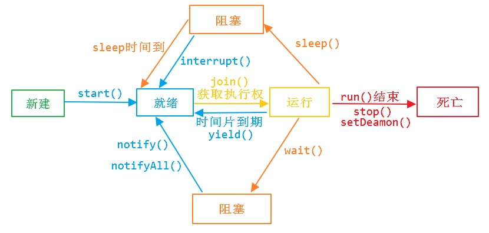
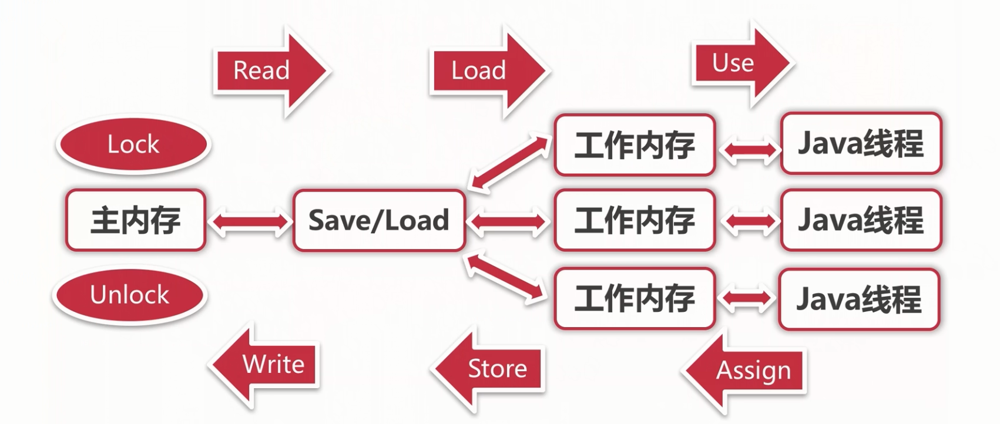

[TOC]

<!-- TOC -->

- [并发编程](#并发编程)
    - [1. 线程状态转换](#1-线程状态转换)
        - [新建（New）](#新建new)
        - [可运行（Runnable）](#可运行runnable)
        - [阻塞（Blocking）](#阻塞blocking)
        - [无限期等待（Waiting）](#无限期等待waiting)
        - [限期等待（Timed Waiting）](#限期等待timed-waiting)
        - [死亡（Terminated）](#死亡terminated)
    - [2. Java实现多线程的方式及三种方式的区别【阿里面经Onenote】](#2-java实现多线程的方式及三种方式的区别阿里面经onenote)
        - [实现 Runnable 接口](#实现-runnable-接口)
        - [实现 Callable 接口](#实现-callable-接口)
        - [继承 Thread 类](#继承-thread-类)
        - [实现接口 VS 继承 Thread](#实现接口-vs-继承-thread)
    - [3. 基础线程机制：什么是守护线程、等待线程、礼让线程、线程阻塞？](#3-基础线程机制什么是守护线程等待线程礼让线程线程阻塞)
        - [Daemon（守护线程）](#daemon守护线程)
        - [Executor](#executor)
        - [sleep()](#sleep)
        - [yield()](#yield)
        - [线程阻塞](#线程阻塞)
    - [4. 线程间的协作（信息交互）【阿里面经Onenote】](#4-线程间的协作信息交互阿里面经onenote)
        - [join()](#join)
        - [wait() notify() notifyAll()](#wait-notify-notifyall)
        - [await() signal() signalAll()](#await-signal-signalall)
        - [sleep和wait分别是那个类的方法，有什么区别【阿里面经Onenote】](#sleep和wait分别是那个类的方法有什么区别阿里面经onenote)
    - [5. 互斥同步](#5-互斥同步)
        - [synchronized](#synchronized)
        - [ReentrantLock](#reentrantlock)
        - [synchronized 和 ReentrantLock 比较](#synchronized-和-reentrantlock-比较)
        - [synchronized与lock的区别，使用场景。看过synchronized的源码没？【阿里面经Onenote】](#synchronized与lock的区别使用场景看过synchronized的源码没阿里面经onenote)
        - [什么是乐观锁和悲观锁](#什么是乐观锁和悲观锁)
        - [synchronized底层如何实现的？用在代码块和方法上有什么区别？](#synchronized底层如何实现的用在代码块和方法上有什么区别)
    - [6. Java 内存模型（JMM）](#6-java-内存模型jmm)
        - [主内存与工作内存](#主内存与工作内存)
        - [内存间交互操作](#内存间交互操作)
        - [内存模型三大特性](#内存模型三大特性)
        - [volatile 与synchronized 的区别](#volatile-与synchronized-的区别)
    - [7. 什么是线程池？如果让你设计一个动态大小的线程池，如何设计，应该有哪些方法？线程池创建的方式？【阿里面经Onenote】](#7-什么是线程池如果让你设计一个动态大小的线程池如何设计应该有哪些方法线程池创建的方式阿里面经onenote)
    - [8. 什么是并发和并行](#8-什么是并发和并行)
    - [9. 什么是线程安全【阿里面经Onenote】](#9-什么是线程安全阿里面经onenote)
        - [非线程安全!=不安全？](#非线程安全不安全)
        - [线程安全十万个为什么？](#线程安全十万个为什么)
    - [10. 什么是死锁？死锁的四个必要条件？](#10-什么是死锁死锁的四个必要条件)
        - [什么是死锁](#什么是死锁)
        - [死锁的四个必要条件](#死锁的四个必要条件)
        - [处理死锁的策略](#处理死锁的策略)
        - [死锁预防](#死锁预防)
        - [死锁避免](#死锁避免)
    - [11. volatile 关键字的如何保证内存可见性【阿里面经Onenote】](#11-volatile-关键字的如何保证内存可见性阿里面经onenote)
    - [12. 什么是线程？线程和进程有什么区别？为什么要使用多线程【阿里面经Onenote】](#12-什么是线程线程和进程有什么区别为什么要使用多线程阿里面经onenote)
    - [13. 多线程共用一个数据变量需要注意什么？【阿里面经Onenote】](#13-多线程共用一个数据变量需要注意什么阿里面经onenote)
    - [14. Java是否有内存泄露和内存溢出【阿里面经Onenote】](#14-java是否有内存泄露和内存溢出阿里面经onenote)
    - [](#)
    - [15. 线程间通信和进程间通信？](#15-线程间通信和进程间通信)
        - [进程间通信](#进程间通信)
        - [进程间通信](#进程间通信-1)
    - [16. 什么是同步和异步，阻塞和非阻塞？](#16-什么是同步和异步阻塞和非阻塞)
        - [同步](#同步)
        - [异步](#异步)
        - [阻塞](#阻塞)
        - [非阻塞](#非阻塞)
    - [17. 并发包（待完善）](#17-并发包待完善)
- [附录：参考资料](#附录参考资料)

<!-- /TOC -->

## 并发编程

### 1. 线程状态转换

[](https://github.com/CyC2018/Interview-Notebook/blob/master/pics/ace830df-9919-48ca-91b5-60b193f593d2.png)

#### 新建（New）

创建后尚未启动。

#### 可运行（Runnable）

可能正在运行，也可能正在等待 CPU 时间片。

包含了操作系统线程状态中的 Running 和 Ready。

#### 阻塞（Blocking）

这个状态下, 是在多个线程有同步操作的场景，比如正在等待另一个线程的synchronized 块的执行释放，或者可重入的 synchronized块里别人调用wait() 方法，也就是线程在等待进入临界区。 

#### 无限期等待（Waiting）

等待其它线程显式地唤醒，否则不会被分配 CPU 时间片。

| 进入方法                                   | 退出方法                             |
| ------------------------------------------ | ------------------------------------ |
| 没有设置 Timeout 参数的 Object.wait() 方法 | Object.notify() / Object.notifyAll() |
| 没有设置 Timeout 参数的 Thread.join() 方法 | 被调用的线程执行完毕                 |
| LockSupport.park() 方法                    | -                                    |

#### 限期等待（Timed Waiting）

无需等待其它线程显式地唤醒，在一定时间之后会被系统自动唤醒。

调用 Thread.sleep() 方法使线程进入限期等待状态时，常常用“使一个线程睡眠”进行描述。

调用 Object.wait() 方法使线程进入限期等待或者无限期等待时，常常用“挂起一个线程”进行描述。

睡眠和挂起是用来描述行为，而阻塞和等待用来描述状态。

阻塞和等待的区别在于，阻塞是被动的，它是在等待获取一个排它锁。而等待是主动的，通过调用 Thread.sleep() 和 Object.wait() 等方法进入。

| 进入方法                                 | 退出方法                                        |
| ---------------------------------------- | ----------------------------------------------- |
| Thread.sleep() 方法                      | 时间结束                                        |
| 设置了 Timeout 参数的 Object.wait() 方法 | 时间结束 / Object.notify() / Object.notifyAll() |
| 设置了 Timeout 参数的 Thread.join() 方法 | 时间结束 / 被调用的线程执行完毕                 |
| LockSupport.parkNanos() 方法             | -                                               |
| LockSupport.parkUntil() 方法             | -                                               |

#### 死亡（Terminated）

- 线程因为run方法正常退出而自然死亡
- 因为一个没有捕获的异常终止了run方法而意外死亡


### 2. Java实现多线程的方式及三种方式的区别【阿里面经Onenote】

- 实现多线程的方式 

  - 继承Thread类，重写run函数。 
  - 实现Runnable接口 
  - 实现Callable接口 

- 三种方式的区别 

  - 实现Runnable接口可以避免Java单继承特性而带来的局限；增强程序的健壮性，代码能够被多个线程共享，代码与数据是独立的；适合多个相同程序代码的线程区处理同一资源的情况。 

  - 继承Thread类和实现Runnable方法启动线程都是使用start方法，然后JVM虚拟机将此线程放到就绪队列中，如果有处理机可用，则执行run方法。 

  - 实现Callable接口要实现call方法，并且线程执行完毕后会有返回值。其他的两种都是重写run方法，没有返回值。 

    

实现 Runnable 和 Callable 接口的类只能当做一个可以在线程中运行的任务，不是真正意义上的线程，因此最后还需要通过 Thread 来调用。可以说任务是通过线程驱动从而执行的。


#### 实现 Runnable 接口

需要实现 run() 方法。

通过 Thread 调用 start() 方法来启动线程。

```java
public class MyRunnable implements Runnable {
    public void run() {
        // ...
    }
}
```

```java
public static void main(String[] args) {
    MyRunnable instance = new MyRunnable();
    Thread thread = new Thread(instance);
    thread.start();
}
```

#### 实现 Callable 接口

与 Runnable 相比，Callable 可以有返回值，返回值通过 FutureTask 进行封装。

```java
public class MyCallable implements Callable<Integer> {
    public Integer call() {
        return 123;
    }
}
```

```java
public static void main(String[] args) throws ExecutionException, InterruptedException {
    MyCallable mc = new MyCallable();
    FutureTask<Integer> ft = new FutureTask<>(mc);
    Thread thread = new Thread(ft);
    thread.start();
    System.out.println(ft.get());
}
```

#### 继承 Thread 类

同样也是需要实现 run() 方法，因为 Thread 类也实现了 Runable 接口。

```java
public class MyThread extends Thread {
    public void run() {
        // ...
    }
}
```

```java
public static void main(String[] args) {
    MyThread mt = new MyThread();
    mt.start();
}
```

#### 实现接口 VS 继承 Thread

实现接口会更好一些，因为：

- Java 不支持多重继承，因此继承了 Thread 类就无法继承其它类，但是可以实现多个接口；
- 类可能只要求可执行就行，继承整个 Thread 类开销过大。


### 3. 基础线程机制：什么是守护线程、等待线程、礼让线程、线程阻塞？



#### Daemon（守护线程）

Java 中有两类线程：User Thread(用户线程)、Daemon Thread(守护线程)

用户线程即运行在前台的线程，而守护线程是运行在后台的线程。 守护线程作用是为其他前台线程的运行提供便利服务，而且仅在普通、非守护线程仍然运行时才需要，比如垃圾回收线程就是一个守护线程。当 VM 检测仅剩一个守护线程，而用户线程都已经退出运行时，VM就会退出，因为没有如果没有了被守护这，也就没有继续运行程序的必要了。如果有非守护线程仍然存活，VM 就不会退出。

守护线程并非只有虚拟机内部提供，用户在编写程序时也可以自己设置守护线程。用户可以用 Thread 的 setDaemon（true）方法设置当前线程为守护线程。

虽然守护线程可能非常有用，但必须小心确保其他所有非守护线程消亡时，不会由于它的终止而产生任何危害。因为你不可能知道在所有的用户线程退出运行前，守护线程是否已经完成了预期的服务任务。一旦所有的用户线程退出了，虚拟机也就退出运行了。 因此，不要在守护线程中执行业务逻辑操作（比如对数据的读写等）。

 **另外有几点需要注意：**

- setDaemon(true)必须在调用线程的 start()方法之前设置，否则会跑出 IllegalThreadStateException 异常。
- 在守护线程中产生的新线程也是守护线程。
- 不要认为所有的应用都可以分配给守护线程来进行服务，比如读写操作或者计算逻辑。


#### Executor

Executor 管理多个异步任务的执行，而无需程序员显式地管理线程的生命周期。这里的异步是指多个任务的执行互不干扰，不需要进行同步操作。

主要有三种 Executor：

- CachedThreadPool：一个任务创建一个线程；
- FixedThreadPool：所有任务只能使用固定大小的线程；
- SingleThreadExecutor：相当于大小为 1 的 FixedThreadPool。

```java
public static void main(String[] args) {
    ExecutorService executorService = Executors.newCachedThreadPool();
    for (int i = 0; i < 5; i++) {
        executorService.execute(new MyRunnable());
    }
    executorService.shutdown();
}
```


#### sleep()

Thread.sleep(millisec) 方法会休眠当前正在执行的线程，millisec 单位为毫秒。

sleep() 可能会抛出 InterruptedException，因为异常不能跨线程传播回 main() 中，因此必须在本地进行处理。线程中抛出的其它异常也同样需要在本地进行处理。

```java
public void run() {
    try {
        Thread.sleep(3000);
    } catch (InterruptedException e) {
        e.printStackTrace();
    }
}
```


#### yield()

对静态方法 Thread.yield() 的调用声明了当前线程已经完成了生命周期中最重要的部分，可以切换给其它线程来执行。该方法只是对线程调度器的一个建议，而且也只是建议具有相同优先级的其它线程可以运行。

```java
public void run() {
    Thread.yield();
}
```


#### 线程阻塞

线程可以阻塞于四种状态：

- 当线程执行 Thread.sleep()时，它一直阻塞到指定的毫秒时间之后，或者阻塞被另一个线程打断；
- 当线程碰到一条 wait()语句时，它会一直阻塞到接到通知（notify()）、被中断或经过了指定毫秒时间为止（若制定了超时值的话）
- 线程阻塞与不同 I/O 的方式有多种。常见的一种方式是 InputStream的read()方法，该方法一直阻塞到从流中读取一个字节的数据为止，它可以无限阻塞，因此不能指定超时时间；
- 线程也可以阻塞等待获取某个对象锁的排他性访问权限（即等待获得 synchronized 语句必须的锁时阻塞）。

> 注意，并非所有的阻塞状态都是可中断的，以上阻塞状态的前两种可以被中断，后两种不会对中断做出反应


### 4. 线程间的协作（信息交互）【阿里面经Onenote】

当多个线程可以一起工作去解决某个问题时，如果某些部分必须在其它部分之前完成，那么就需要对线程进行协调。

#### join()

在线程中调用另一个线程的 join() 方法，会将当前线程挂起，而不是忙等待，直到目标线程结束。

对于以下代码，虽然 b 线程先启动，但是因为在 b 线程中调用了 a 线程的 join() 方法，b 线程会等待 a 线程结束才继续执行，因此最后能够保证 a 线程的输出先于 b 线程的输出。

```java
public class JoinExample {

    private class A extends Thread {
        @Override
        public void run() {
            System.out.println("A");
        }
    }

    private class B extends Thread {

        private A a;

        B(A a) {
            this.a = a;
        }

        @Override
        public void run() {
            try {
                a.join();
            } catch (InterruptedException e) {
                e.printStackTrace();
            }
            System.out.println("B");
        }
    }

    public void test() {
        A a = new A();
        B b = new B(a);
        b.start();
        a.start();
    }
}
```

```java
public static void main(String[] args) {
    JoinExample example = new JoinExample();
    example.test();
}
```

```
A
B
```

#### wait() notify() notifyAll()

调用 wait() 使得线程等待某个条件满足，线程在等待时会被挂起，当其他线程的运行使得这个条件满足时，其它线程会调用 notify() 或者 notifyAll() 来唤醒挂起的线程。

它们都属于 Object 的一部分，而不属于 Thread。

只能用在同步方法或者同步控制块中使用，否则会在运行时抛出 IllegalMonitorStateExeception。

使用 wait() 挂起期间，线程会释放锁。这是因为，如果没有释放锁，那么其它线程就无法进入对象的同步方法或者同步控制块中，那么就无法执行 notify() 或者 notifyAll() 来唤醒挂起的线程，造成死锁。

```java
public class WaitNotifyExample {
    public synchronized void before() {
        System.out.println("before");
        notifyAll();
    }

    public synchronized void after() {
        try {
            wait();
        } catch (InterruptedException e) {
            e.printStackTrace();
        }
        System.out.println("after");
    }
}
```

```java
public static void main(String[] args) {
    ExecutorService executorService = Executors.newCachedThreadPool();
    WaitNotifyExample example = new WaitNotifyExample();
    executorService.execute(() -> example.after());
    executorService.execute(() -> example.before());
}
```

```
before
after
```

**wait() 和 sleep() 的区别**

- wait() 是 Object 的方法，而 sleep() 是 Thread 的静态方法；
- wait() 会释放锁，sleep() 不会。


#### await() signal() signalAll()

java.util.concurrent 类库中提供了 Condition 类来实现线程之间的协调，可以在 Condition 上调用 await() 方法使线程等待，其它线程调用 signal() 或 signalAll() 方法唤醒等待的线程。相比于 wait() 这种等待方式，await() 可以指定等待的条件，因此更加灵活。

使用 Lock 来获取一个 Condition 对象。

```java
public class AwaitSignalExample {
    private Lock lock = new ReentrantLock();
    private Condition condition = lock.newCondition();

    public void before() {
        lock.lock();
        try {
            System.out.println("before");
            condition.signalAll();
        } finally {
            lock.unlock();
        }
    }

    public void after() {
        lock.lock();
        try {
            condition.await();
            System.out.println("after");
        } catch (InterruptedException e) {
            e.printStackTrace();
        } finally {
            lock.unlock();
        }
    }
}
```

```java
public static void main(String[] args) {
    ExecutorService executorService = Executors.newCachedThreadPool();
    AwaitSignalExample example = new AwaitSignalExample();
    executorService.execute(() -> example.after());
    executorService.execute(() -> example.before());
}
```

```
before
after
```


#### sleep和wait分别是那个类的方法，有什么区别【阿里面经Onenote】

- sleep和wait 
  - sleep是Thread类的方法 
  - wait是Object类的方法 
- 有什么区别 
  - sleep()方法（休眠）是线程类（Thread）的静态方法，调用此方法会让当前线程暂停执行指定的时间，将执行机会（CPU）让给其他线程，但是对象的锁依然保持，因此休眠时间结束后会自动恢复（线程回到就绪状态）。 
  - wait()是Object类的方法，调用对象的wait()方法导致当前线程放弃对象的锁（线程暂停执行），进入对象的等待池（wait pool），只有调用对象的notify()方法（或notifyAll()方法）时才能唤醒等待池中的线程进入等锁池（lock pool），如果线程重新获得对象的锁就可以进入就绪状态。 


### 5. 互斥同步

Java 提供了两种锁机制来控制多个线程对共享资源的互斥访问，第一个是 JVM 实现的 synchronized，而另一个是 JDK 实现的 ReentrantLock。

#### synchronized

**1. 同步一个代码块**

```java
public void func() {
    synchronized (this) {
        // ...
    }
}
```

它只作用于同一个对象，如果调用两个对象上的同步代码块，就不会进行同步。

对于以下代码，使用 ExecutorService 执行了两个线程，由于调用的是同一个对象的同步代码块，因此这两个线程会进行同步，当一个线程进入同步语句块时，另一个线程就必须等待。

```java
public class SynchronizedExample {

    public void func1() {
        synchronized (this) {
            for (int i = 0; i < 10; i++) {
                System.out.print(i + " ");
            }
        }
    }
}
```

```java
public static void main(String[] args) {
    SynchronizedExample e1 = new SynchronizedExample();
    ExecutorService executorService = Executors.newCachedThreadPool();
    executorService.execute(() -> e1.func1());
    executorService.execute(() -> e1.func1());
}
```

```java
0 1 2 3 4 5 6 7 8 9 0 1 2 3 4 5 6 7 8 9
```

对于以下代码，两个线程调用了不同对象的同步代码块，因此这两个线程就不需要同步。从输出结果可以看出，两个线程交叉执行。

```java
public static void main(String[] args) {
    SynchronizedExample e1 = new SynchronizedExample();
    SynchronizedExample e2 = new SynchronizedExample();
    ExecutorService executorService = Executors.newCachedThreadPool();
    executorService.execute(() -> e1.func1());
    executorService.execute(() -> e2.func1());
}
```

```
0 0 1 1 2 2 3 3 4 4 5 5 6 6 7 7 8 8 9 9
```

**2. 同步一个方法**

```java
public synchronized void func () {
    // ...
}
```

它和同步代码块一样，作用于同一个对象。


**3. 同步一个类**

```java
public void func() {
    synchronized (SynchronizedExample.class) {
        // ...
    }
}
```

作用于整个类，也就是说两个线程调用同一个类的不同对象上的这种同步语句，也会进行同步。

```java
public class SynchronizedExample {

    public void func2() {
        synchronized (SynchronizedExample.class) {
            for (int i = 0; i < 10; i++) {
                System.out.print(i + " ");
            }
        }
    }
}
```

```java
public static void main(String[] args) {
    SynchronizedExample e1 = new SynchronizedExample();
    SynchronizedExample e2 = new SynchronizedExample();
    ExecutorService executorService = Executors.newCachedThreadPool();
    executorService.execute(() -> e1.func2());
    executorService.execute(() -> e2.func2());
}
```

```
0 1 2 3 4 5 6 7 8 9 0 1 2 3 4 5 6 7 8 9
```

**4. 同步一个静态方法**

- 非静态同步函数的锁是：this
- 静态的同步函数的锁是：字节码对象

```java
public synchronized static void fun() {
    // ...
}
```

作用于整个类。


#### ReentrantLock

```java
public class LockExample {

    private Lock lock = new ReentrantLock();

    public void func() {
        lock.lock();
        try {
            for (int i = 0; i < 10; i++) {
                System.out.print(i + " ");
            }
        } finally {
            lock.unlock(); // 确保释放锁，从而避免发生死锁。
        }
    }
}
```

```java
public static void main(String[] args) {
    LockExample lockExample = new LockExample();
    ExecutorService executorService = Executors.newCachedThreadPool();
    executorService.execute(() -> lockExample.func());
    executorService.execute(() -> lockExample.func());
}
```

```
0 1 2 3 4 5 6 7 8 9 0 1 2 3 4 5 6 7 8 9
```

ReentrantLock 是 java.util.concurrent（J.U.C）包中的锁，相比于 synchronized，它多了以下高级功能：

**1. 等待可中断**

当持有锁的线程长期不释放锁的时候，正在等待的线程可以选择放弃等待，改为处理其他事情。

**2. 可实现公平锁**

公平锁是指多个线程在等待同一个锁时，必须按照申请锁的时间顺序来依次获得锁。

synchronized 中的锁是非公平的，ReentrantLock 默认情况下也是非公平的，但可以通过带布尔值的构造函数要求使用公平锁。

**3. 锁绑定多个条件**

一个 ReentrantLock 对象可以同时绑定多个 Condition 对象。


#### synchronized 和 ReentrantLock 比较

**1. 锁的实现**

synchronized 是 JVM 实现的，而 ReentrantLock 是 JDK 实现的。

**2. 性能**

新版本 Java 对 synchronized 进行了很多优化，例如自旋锁等。目前来看它和 ReentrantLock 的性能基本持平了，因此性能因素不再是选择 ReentrantLock 的理由。synchronized 有更大的性能优化空间，应该优先考虑 synchronized。

**3. 功能**

ReentrantLock 多了一些高级功能。

**4. 使用选择**

除非需要使用 ReentrantLock 的高级功能，否则优先使用 synchronized。这是因为 synchronized 是 JVM 实现的一种锁机制，JVM 原生地支持它，而 ReentrantLock 不是所有的 JDK 版本都支持。并且使用 synchronized 不用担心没有释放锁而导致死锁问题，因为 JVM 会确保锁的释放。


#### synchronized与lock的区别，使用场景。看过synchronized的源码没？【阿里面经Onenote】

- synchronized与lock的区别 

  - （用法）synchronized(隐式锁)：在需要同步的对象中加入此控制，synchronized可以加在方法上，也可以加在特定代码块中，括号中表示需要锁的对象。 
  - （用法）lock（显示锁）：需要显示指定起始位置和终止位置。一般使用ReentrantLock类做为锁，多个线程中必须要使用一个ReentrantLock类做为对 象才能保证锁的生效。且在加锁和解锁处需要通过lock()和unlock()显示指出。所以一般会在finally块中写unlock()以防死锁。 
  - （性能）synchronized是托管给JVM执行的，而lock是java写的控制锁的代码。在Java1.5中，synchronize是性能低效的。因为 这是一个重量级操作，需要调用操作接口，导致有可能加锁消耗的系统时间比加锁以外的操作还多。相比之下使用Java提供的Lock对象，性能更高一些。但 是到了Java1.6，发生了变化。synchronize在语义上很清晰，可以进行很多优化，有<u>适应自旋，锁消除，锁粗化，轻量级锁，偏向锁</u>等等。导致 在Java1.6上synchronize的性能并不比Lock差。 
  - （机制）**synchronized原始采用的是CPU悲观锁机制，即线程获得的是独占锁**。独占锁意味着其 他线程只能依靠阻塞来等待线程释放锁。**Lock用的是乐观锁方式**。所谓乐观锁就是，每次不加锁而是假设没有冲突而去完成某项操作，如果因为冲突失败就重试，直到成功为止。乐观锁实现的机制就 是CAS操作（Compare and Swap）。 

   

#### 什么是乐观锁和悲观锁

- 为什么需要锁（并发控制）？
  - 在多用户环境中，在同一时间可能会有多个用户更新相同的记录，这会产生冲突。这就是著名的并发性问题。
  - 典型的冲突有：
    - 丢失更新：一个事务的更新覆盖了其它事务的更新结果，就是所谓的更新丢失。例如：用户A把值从6改为2，用户B把值从2改为6，则用户A丢失了他的更新。
    - 脏读：当一个事务读取其它完成一半事务的记录时，就会发生脏读取。例如：用户A,B看到的值都是6，用户B把值改为2，用户A读到的值仍为6。
  - 为了解决这些并发带来的问题。 我们需要引入并发控制机制。
- 并发控制机制
  - **悲观锁：假定会发生并发冲突，**屏蔽一切可能违反数据完整性的操作。
  - **乐观锁：假设不会发生并发冲突，**只在提交操作时检查是否违反数据完整性。乐观锁不能解决脏读的问题。

参考资料：

- [乐观锁与悲观锁——解决并发问题 - WhyWin - 博客园](https://www.cnblogs.com/0201zcr/p/4782283.html)


#### synchronized底层如何实现的？用在代码块和方法上有什么区别？

- synchronized底层如何实现的 

- 用在代码块和方法上有什么区别？ 
  - synchronized用在代码块锁的是调用该方法的对象（this），也可以选择锁住任何一个对象。 
  - synchronized用在方法上锁的是调用该方法的对象， 
  - synchronized用在代码块可以减小锁的粒度，从而提高并发性能。 
  - 无论用在代码块上还是用在方法上，都是获取对象的锁；每一个对象只有一个锁与之相关联；实现同步需要很大的系统开销作为代价，甚至可能造成死锁，所以尽量避免无谓的同步控制。 
- synchronized与static synchronized的区别 
  - synchronized是对类的当前实例进行加锁，防止其他线程同时访问该类的该实例的所有synchronized块，同一个类的两个不同实例就没有这种约束了。 
  - 那么static synchronized恰好就是要控制类的所有实例的访问了，static synchronized是限制线程同时访问jvm中该类的所有实例同时访问对应的代码快。 


### 6. Java 内存模型（JMM）

Java 内存模型试图屏蔽各种硬件和操作系统的内存访问差异，以实现让 Java 程序在各种平台下都能达到一致的内存访问效果。

#### 主内存与工作内存

处理器上的寄存器的读写的速度比内存快几个数量级，为了解决这种速度矛盾，在它们之间加入了高速缓存。

加入高速缓存带来了一个新的问题：缓存一致性。如果多个缓存共享同一块主内存区域，那么多个缓存的数据可能会不一致，需要一些协议来解决这个问题。

[](https://github.com/CyC2018/Interview-Notebook/blob/master/pics/68778c1b-15ab-4826-99c0-3b4fd38cb9e9.png)

所有的变量都存储在主内存中，每个线程还有自己的工作内存，工作内存存储在高速缓存或者寄存器中，保存了该线程使用的变量的主内存副本拷贝。

线程只能直接操作工作内存中的变量，不同线程之间的变量值传递需要通过主内存来完成。

[](https://github.com/CyC2018/Interview-Notebook/blob/master/pics/47358f87-bc4c-496f-9a90-8d696de94cee.png)


 

#### 内存间交互操作

Java 内存模型定义了 8 个操作来完成主内存和工作内存的交互操作。




- 关于主内存与工作内存之间的具体交互协议，即一个变量如何从主内存拷贝到工作内存、如何从工作内存同步到主内存之间的实现细节，Java内存模型定义了以下八种操作来完成：
  - **lock（锁定）**：作用于主内存的变量，把一个变量标识为一条线程独占状态。
  - **unlock（解锁）**：作用于主内存变量，把一个处于锁定状态的变量释放出来，释放后的变量才可以被其他线程锁定。
  - **read（读取）**：作用于主内存变量，把一个变量值从主内存传输到线程的工作内存中，以便随后的load动作使用
  - **load（载入）**：作用于工作内存的变量，它把read操作从主内存中得到的变量值放入工作内存的变量副本中。
  - **use（使用）**：作用于工作内存的变量，把工作内存中的一个变量值传递给执行引擎，每当虚拟机遇到一个需要使用变量的值的字节码指令时将会执行这个操作。
  - **assign（赋值）**：作用于工作内存的变量，它把一个从执行引擎接收到的值赋值给工作内存的变量，每当虚拟机遇到一个给变量赋值的字节码指令时执行这个操作。
  - **store（存储）**：作用于工作内存的变量，把工作内存中的一个变量的值传送到主内存中，以便随后的write的操作。
  - **write（写入）**：作用于主内存的变量，它把store操作从工作内存中一个变量的值传送到主内存的变量中。

　　

​	如果要把一个变量从主内存中复制到工作内存，就需要按顺寻地执行read和load操作，如果把变量从工作内存中同步回主内存中，就要按顺序地执行store和write操作。Java内存模型只要求上述操作必须按顺序执行，而没有保证必须是连续执行。也就是read和load之间，store和write之间是可以插入其他指令的，如对主内存中的变量a、b进行访问时，可能的顺序是read a，read b，load b， load a。


**Java内存模型还规定了在执行上述八种基本操作时，必须满足如下规则：**

- 不允许read和load、store和write操作之一单独出现
- 不允许一个线程丢弃它的最近assign的操作，即变量在工作内存中改变了之后必须同步到主内存中。
- 不允许一个线程无原因地（没有发生过任何assign操作）把数据从工作内存同步回主内存中。
- 一个新的变量只能在主内存中诞生，不允许在工作内存中直接使用一个未被初始化（load或assign）的变量。即就是对一个变量实施use和store操作之前，必须先执行过了assign和load操作。
- 一个变量在同一时刻只允许一条线程对其进行lock操作，lock和unlock必须成对出现
- 如果对一个变量执行lock操作，将会清空工作内存中此变量的值，在执行引擎使用这个变量前需要重新执行load或assign操作初始化变量的值
- 如果一个变量事先没有被lock操作锁定，则不允许对它执行unlock操作；也不允许去unlock一个被其他线程锁定的变量。
- 对一个变量执行unlock操作之前，必须先把此变量同步到主内存中（执行store和write操作）。


#### 内存模型三大特性

**（1）原子性**

- 概念
  - 事物有原子性，这个概念大概都清楚，即一个操作或多个操作要么执行的过程中不被任何因素打断，要么不执行。
- 如何实现原子性？
  - 通过同步代码块synchronized 或者local 锁来确保原子性


**（2）可见性**

- 概念
  - 当多个线程共享同一个变量时，其中一个线程修改了这个变量，其他线程能够立即看到修改后的值。
- 如何实现可见性？（这里如果不理解java内存模型就可能不会明白后面会讲到）
  - 使用volatile 关键字来实现线程之间的可见性。
- 为什么要实现可见性？        
  - 当线程拿到全局变量时，会临时存在当前线程的内存当中进行操作。相当于这个线程的局部变量，这个对其他线程是不可见的。因为cpu 只会执行一个。所以当一个线程的数据修改后，还没有及时更新到全局变量中去，而另外一个线程就执行，所以造成数据冲突。也就是线程安全问题。所以要实现这个线程之间的可见性。


**（3）有序性**

- 线程按顺序执行，线程中有代码，即让代码按顺序执行。优化代码。
- 如何实现有序性？
  - 通过join 方法，让其他线程等待。


#### volatile 与synchronized 的区别

**（1）仅靠volatile不能保证线程的安全性。（原子性）**

- ① volatile轻量级，只能修饰变量。synchronized重量级，还可修饰方法
- ② volatile只能保证数据的可见性，不能用来同步，因为多个线程并发访问volatile修饰的变量不会阻塞。

synchronized不仅保证可见性，而且还保证原子性，因为，只有获得了锁的线程才能进入临界区，从而保证临界区中的所有语句都全部执行。多个线程争抢synchronized锁对象时，会出现阻塞。

**（2）线程安全性**

线程安全性包括两个方面，①可见性。②原子性。

从上面自增的例子中可以看出：仅仅使用volatile并不能保证线程安全性。而synchronized则可实现线程的安全性。


### 7. 什么是线程池？如果让你设计一个动态大小的线程池，如何设计，应该有哪些方法？线程池创建的方式？【阿里面经Onenote】

- 什么是线程池 

  - 线程池顾名思义就是事先创建若干个可执行的线程放入一个池（容器）中，需要的时候从池中获取线程不用自行创建，使用完毕不需要销毁线程而是放回池中，从而减少创建和销毁线程对象的开销。 

- 设计一个动态大小的线程池，如何设计，应该有哪些方法 

  - 一个线程池包括以下四个基本组成部分： 
    - 线程管理器(ThreadPool)：用于创建并管理线程池，包括创建线程，销毁线程池，添加新任务； 
    - 工作线程(PoolWorker)：线程池中线程，在没有任务时处于等待状态，可以循环的执行任务； 
    - 任务接口(Task)：每个任务必须实现的接口，以供工作线程调度任务的执行，它主要规定了任务的入口，任务执行完后的收尾工作，任务的执行状态等； 
    - 任务队列(TaskQueue)：用于存放没有处理的任务。提供一种缓冲机制； 
  - 所包含的方法 
    - private ThreadPool()  创建线程池 
    - public static ThreadPool getThreadPool()  获得一个默认线程个数的线程池  
    - public void execute(Runnable task)  执行任务,其实只是把任务加入任务队列，什么时候执行有线程池管理器决定 
    - public void execute(Runnable[] task)  批量执行任务,其实只是把任务加入任务队列，什么时候执行有线程池管理器决定 
    - public void destroy()  销毁线程池,该方法保证在所有任务都完成的情况下才销毁所有线程，否则等待任务完成才销毁 
    - public int getWorkThreadNumber() 返回工作线程的个数  
    - public int getFinishedTasknumber() 返回已完成任务的个数,这里的已完成是只出了任务队列的任务个数，可能该任务并没有实际执行完成 
    - public void addThread() 在保证线程池中所有线程正在执行，并且要执行线程的个数大于某一值时。增加线程池中线程的个数 
    - public void reduceThread() 在保证线程池中有很大一部分线程处于空闲状态，并且空闲状态的线程在小于某一值时，减少线程池中线程的个数  

- 线程池四种创建方式

  Java通过Executors提供四种线程池，分别为：

  - newCachedThreadPool创建一个可缓存线程池，如果线程池长度超过处理需要，可灵活回收空闲线程，若无可回收，则新建线程。
  - newFixedThreadPool 创建一个定长线程池，可控制线程最大并发数，超出的线程会在队列中等待。
  - newScheduledThreadPool 创建一个定长线程池，支持定时及周期性任务执行。
  - newSingleThreadExecutor 创建一个单线程化的线程池，它只会用唯一的工作线程来执行任务，保证所有任务按照指定顺序(FIFO, LIFO, 优先级)执行。


### 8. 什么是并发和并行

- 并行就是两个任务同时运行，就是甲任务进行的同时，乙任务也在进行。(需要多核CPU)
- 并发是指两个任务都请求运行，而处理器只能按受一个任务，就把这两个任务安排轮流进行，由于时间间隔较短，使人感觉两个任务都在运行。
- 比如我跟两个网友聊天，左手操作一个电脑跟甲聊，同时右手用另一台电脑跟乙聊天，这就叫并行。
- 如果用一台电脑我先给甲发个消息，然后立刻再给乙发消息，然后再跟甲聊，再跟乙聊。这就叫并发。


参考资料：

- [Cplusplus-Concurrency-In-Practice/1.1 What is concurrency.md at master · forhappy/Cplusplus-Concurrency-In-Practice](https://github.com/forhappy/Cplusplus-Concurrency-In-Practice/blob/master/zh/chapter1-Introduction/1.1%20What%20is%20concurrency.md)


### 9. 什么是线程安全【阿里面经Onenote】

当多个线程访问同一个对象时，如果不用考虑这些线程在运行时环境下的调度和交替运行，也不需要进行额外的同步，或者在调用方进行任何其他的协调操作，调用这个对象的行为都可以获取正确的结果，那这个对象是线程安全的。——来自《深入理解Java虚拟机》

- 定义 

  - 某个类的行为与其规范一致。 
  - 不管多个线程是怎样的执行顺序和优先级,或是wait,sleep,join等控制方式,，如果一个类在多线程访问下运转一切正常，并且访问类不需要进行额外的同步处理或者协调，那么我们就认为它是线程安全的。  

- 如何保证线程安全？

  - 对变量使用volitate 
  - 对程序段进行加锁(synchronized,lock) 

- 注意 

  - 非线程安全的集合在多线程环境下可以使用，但并不能作为多个线程共享的属性，可以作为某个线程独享的属性。 

  - 例如Vector是线程安全的，ArrayList不是线程安全的。如果每一个线程中new一个ArrayList，而这个ArrayList只是在这一个线程中使用，肯定没问题。 

    

#### 非线程安全!=不安全？

有人在使用过程中有一个不正确的观点：我的程序是多线程的，不能使用ArrayList要使用Vector，这样才安全。

**非线程安全并不是多线程环境下就不能使用**。注意我上面有说到：**多线程操作同一个对象**。注意是**同一个对象**。比如最上面那个模拟，就是在主线程中new的一个ArrayList然后多个线程操作同一个ArrayList对象。

如果是每个线程中new一个ArrayList，而这个ArrayList只在这一个线程中使用，那么肯定是没问题的。


#### 线程安全十万个为什么？

**问：平时项目中使用锁和synchronized比较多，而很少使用volatile，难道就没有保证可见性？**
答：锁和synchronized即可以保证原子性，也可以保证可见性。都是通过保证同一时间只有一个线程执行目标代码段来实现的。

**问：锁和synchronized为何能保证可见性？**
答：根据[JDK 7的Java doc](http://docs.oracle.com/javase/7/docs/api/java/util/concurrent/package-summary.html#MemoryVisibility)中对`concurrent`包的说明，一个线程的写结果保证对另外线程的读操作可见，只要该写操作可以由`happen-before`原则推断出在读操作之前发生。

> The results of a write by one thread are guaranteed to be **visible** to a read by another thread only if the write operation happens-before the read operation. The synchronized and volatile constructs, as well as the Thread.start() and Thread.join() methods, can form happens-before relationships.

**问：既然锁和synchronized即可保证原子性也可保证可见性，为何还需要volatile？**
答：synchronized和锁需要通过操作系统来仲裁谁获得锁，开销比较高，而volatile开销小很多。因此在只需要保证可见性的条件下，使用volatile的性能要比使用锁和synchronized高得多。

**问：既然锁和synchronized可以保证原子性，为什么还需要AtomicInteger这种的类来保证原子操作？**
答：锁和synchronized需要通过操作系统来仲裁谁获得锁，开销比较高，而AtomicInteger是通过CPU级的CAS操作来保证原子性，开销比较小。所以使用AtomicInteger的目的还是为了提高性能。

**问：还有没有别的办法保证线程安全**
答：有。尽可能避免引起非线程安全的条件——共享变量。如果能从设计上避免共享变量的使用，即可避免非线程安全的发生，也就无须通过锁或者synchronized以及volatile解决原子性、可见性和顺序性的问题。

**问：synchronized即可修饰非静态方式，也可修饰静态方法，还可修饰代码块，有何区别**
答：synchronized修饰非静态同步方法时，锁住的是当前实例；synchronized修饰静态同步方法时，锁住的是该类的Class对象；synchronized修饰静态代码块时，锁住的是`synchronized`关键字后面括号内的对象。


参考资料：

- [Java进阶（二）当我们说线程安全时，到底在说什么](http://www.jasongj.com/java/thread_safe/)


### 10. 什么是死锁？死锁的四个必要条件？

#### 什么是死锁

- 如果一个进程集合里面的每个进程都在等待只能由这个集合中的其他一个进程（包括他自身）才能引发的事件，这种情况就是死锁。

这个定义可能有点拗口，下面用一个简单例子说明。

```
资源A、B，进程C、D描述如下：

资源A和资源B，都是不可剥夺资源，
现在进程C已经申请了资源A，进程D也申请了资源B，
进程C接下来的操作需要用到资源B，而进程D恰好也在申请资源A，
进程C、D都得不到接下来的资源，那么就引发了死锁。

```

​	*然后套用回去定义*：如果一个进程集合里面（进程C和进程D）的每个进程（进程C和进程D）都在等待只能由这个集合中的其他一个进程（对于进程C，他在等进程D；对于进程D，他在等进程C）才能引发的事件（释放相应资源）。

​	这里的资源包括了软的资源（代码块）和硬的资源（例如扫描仪）。
	资源一般可以分两种：**可剥夺资源（Preemptable）**和**不可剥夺资源 （Nonpreemptable）**。一般来说对于由可剥夺资源引起的死锁可以由系统的重新分配资源来解决，所以一般来说大家说的<u>死锁都是由于不可剥夺资源 所引起的</u>。

#### 死锁的四个必要条件

- **互斥条件（Mutual exclusion）**：资源不能被共享，只能由一个进程使用。
- **请求与保持条件（Hold and wait）**：已经得到资源的进程可以再次申请新的资源。
- **非剥夺条件（No pre-emption）**：已经分配的资源不能从相应的进程中被强制地剥夺。
- **循环等待条件（Circular wait）**：系统中若干进程组成环路，该环路中每个进程都在等待相邻进程正占用的资源。

#### 处理死锁的策略

- 忽略该问题。例如鸵鸟算法，该算法可以应用在极少发生死锁的的情况下。为什么叫鸵鸟算法呢，因为传说中鸵鸟看到危险就把头埋在地底下，可能鸵鸟觉得看不到危险也就没危险了吧。跟掩耳盗铃有点像。
- 检测死锁并且恢复。
- 仔细地对资源进行动态分配，以避免死锁。
- 通过破除死锁四个必要条件之一，来防止死锁产生。

#### 死锁预防 

- **打破互斥条件**  `一般无法破除` 。即允许进程同时访问某些资源。但是，有的资源是不允许被同时访问的，像打印机等等，这是由资源本身的属性所决定的。所以，这种办法并无实用价值。
- **打破不可抢占条件**  `加入超时操作`。即允许进程强行从占有者那里夺取某些资源。就是说，当一个进程已占有了某些资源，它又申请新的资源，但不能立即被满足时，它必须释放所占有的全部资源，以后再重新申请。它所释放的资源可以分配给其它进程。这就相当于该进程占有的资源被隐蔽地强占了。这种预防死锁的方法实现起来困难，会降低系统性能。
- **打破占有且申请条件** `一次性获取所有资源`。可以实行资源预先分配策略。即进程在运行前一次性地向系统申请它所需要的全部资源。如果某个进程所需的全部资源得不到满足，则不分配任何资源，此进程暂不运行。只有当系统能够满足当前进程的全部资源需求时，才一次性地将所申请的资源全部分配给该进程。由于运行的进程已占有了它所需的全部资源，所以不会发生占有资源又申请资源的现象，因此不会发生死锁。但是，这种策略也有如下缺点： 
  - 在许多情况下，一个进程在执行之前不可能知道它所需要的全部资源。这是由于进程在执行时是动态的，不可预测的； 
  - 资源利用率低。无论所分资源何时用到，一个进程只有在占有所需的全部资源后才能执行。即使有些资源最后才被该进程用到一次，但该进程在生存期间却一直占有它们，造成长期占着不用的状况。这显然是一种极大的资源浪费； 
  - 降低了进程的并发性。因为资源有限，又加上存在浪费，能分配到所需全部资源的进程个数就必然少了。 
- **打破循环等待条件** `按顺序后去自愿`，实行资源有序分配策略。采用这种策略，即把资源事先分类编号，按号分配，使进程在申请，占用资源时不会形成环路。所有进程对资源的请求必须严格按资源序号递增的顺序提出。进程占用了小号资源，才能申请大号资源，就不会产生环路，从而预防了死锁。这种策略与前面的策略相比，资源的利用率和系统吞吐量都有很大提高，但是也存在以下缺点： 
  - 限制了进程对资源的请求，同时给系统中所有资源合理编号也是件困难事，并增加了系统开销； 
  - 为了遵循按编号申请的次序，暂不使用的资源也需要提前申请，从而增加了进程对资源的占用时间。 

#### 死锁避免 

- 安全序列 
- 银行家算法 


### 11. volatile 关键字的如何保证内存可见性【阿里面经Onenote】

- volatile 关键字的作用 

  - 保证内存的可见性 
  - 防止指令重排 
  - 注意：volatile 并不保证原子性 

- 内存可见性 

  - volatile保证可见性的原理是在每次访问变量时都会进行一次刷新，因此每次访问都是主内存中最新的版本。所以volatile关键字的作用之一就是保证变量修改的实时可见性。 

- 当且仅当满足以下所有条件时，才应该使用volatile变量 

  - 对变量的写入操作不依赖变量的当前值，或者你能确保只有单个线程更新变量的值。 
  - 该变量没有包含在具有其他变量的不变式中。 

- volatile使用建议 

  - 在两个或者更多的线程需要访问的成员变量上使用volatile。当要访问的变量已在synchronized代码块中，或者为常量时，没必要使用volatile。 
  - 由于使用volatile屏蔽掉了JVM中必要的代码优化，所以在效率上比较低，因此一定在必要时才使用此关键字。 

- volatile和synchronized区别 

  - volatile不会进行加锁操作： 

  volatile变量是一种稍弱的同步机制在访问volatile变量时不会执行加锁操作，因此也就不会使执行线程阻塞，因此volatile变量是一种比synchronized关键字更轻量级的同步机制。 

  - volatile 变量作用类似于同步变量读写操作： 

  从内存可见性的角度看，写入volatile变量相当于退出同步代码块，而读取volatile变量相当于进入同步代码块。 

  - volatile 不如 synchronized安全： 

  在代码中如果过度依赖volatile变量来控制状态的可见性，通常会比使用锁的代码更脆弱，也更难以理解。仅当volatile变量能简化代码的实现以及对同步策略的验证时，才应该使用它。一般来说，用同步机制会更安全些。 

  - volatile 无法同时保证内存可见性和原则性： 

  加锁机制（即同步机制）既可以确保可见性又可以确保原子性，而volatile变量只能确保可见性，原因是声明为volatile的简单变量如果当前值与该变量以前的值相关，那么volatile关键字不起作用，也就是说如下的表达式都不是原子操作：“count++”、“count = count+1”。 

   


### 12. 什么是线程？线程和进程有什么区别？为什么要使用多线程【阿里面经Onenote】

（1）线程和进程

- 进程是操作系统**分配资源**的最小单位 
- 线程是**CPU调度**的最小单位  

（2）使用线程的原因

- 使用多线程可以减少程序的响应时间；
- 与进程相比，线程的创建和切换开销更小；
- 多核电脑上，可以同时执行多个线程，提高资源利用率；
- 简化程序的结构，使程序便于理解和维护；


### 13. 多线程共用一个数据变量需要注意什么？【阿里面经Onenote】

- 当我们在线程对象（Runnable）中定义了全局变量，run方法会修改该变量时，如果有多个线程同时使用该线程对象，那么就会造成全局变量的值被同时修改，造成错误. 
- ThreadLocal是JDK引入的一种机制，它用于解决线程间共享变量，使用ThreadLocal声明的变量，即使在线程中属于全局变量，针对每个线程来讲，这个变量也是独立的。 
- volatile变量每次被线程访问时，都强迫线程从主内存中重读该变量的最新值，而当该变量发生修改变化时，也会强迫线程将最新的值刷新回主内存中。这样一来，不同的线程都能及时的看到该变量的最新值。 


### 14. Java是否有内存泄露和内存溢出【阿里面经Onenote】

- 静态集合类，使用Set、Vector、HashMap等集合类的时候需要特别注意。当这些类被定义成静态的时候，由于他们的生命周期跟应用程序一样长，这时候就有可能发生内存泄漏。 

```java
// 例子 
class StaticTest 
{ 
    private static Vector v = new Vector(10); 
    public void init() 
    { 
        for (int i = 1; i < 100; i++) 
        { 
            Object object = new Object(); 
            v.add(object); 
            object = null; 
        } 
    } 
} 
```

在上面的代码中，循环申请了Object对象，并添加到Vector中，然后设置为null，可是这些对象呗vector引用着，因此必能被GC回收，因此造成内存泄漏。因此要释放这些对象，还需要将它们从vector删除，最简单的方法就是将vector设置为null 

 

- 监听器： 在Java编程中，我们都需要和监听器打交道，通常一个应用中会用到很多监听器，我们会调用一个控件，诸如addXXXListener()等方法来增加监听器，但往往在释放的时候却没有去删除这些监听器，从而增加了内存泄漏的机会。 

- 物理连接：一些物理连接，比如[数据库](http://lib.csdn.net/base/mysql)连接和网络连接，除非其显式的关闭了连接，否则是不会自动被GC 回收的。Java 数据库连接一般用DataSource.getConnection()来创建，当不再使用时必须用Close()方法来释放，因为这些连接是独立于JVM的。对于Resultset 和Statement 对象可以不进行显式回收，但Connection 一定要显式回收，因为Connection 在任何时候都无法自动回收，而Connection一旦回收，Resultset 和Statement 对象就会立即为NULL。但是如果使用连接池，情况就不一样了，除了要显式地关闭连接，还必须显式地关闭Resultset Statement 对象（关闭其中一个，另外一个也会关闭），否则就会造成大量的Statement 对象无法释放，从而引起内存泄漏。。一般情况下，在try代码块里创建连接，在finally里释放连接，就能够避免此类内存泄漏。 

- 内部类和外部模块等的引用：内部类的引用是比较容易遗忘的一种，而且一旦没释放可能导致一系列的后继类对象没有释放。在调用外部模块的时候，也应该注意防止内存泄漏，如果模块A调用了外部模块B的一个方法，如： 

public void register(Object o) 

这个方法有可能就使得A模块持有传入对象的引用，这时候需要查看B模块是否提供了出去引用的方法，这种情况容易忽略，而且发生内存泄漏的话，还比较难察觉。 

- 单例模式：因为单利对象初始化后将在JVM的整个生命周期内存在，如果它持有一个外部对象的（生命周期比较短）引用，那么这个外部对象就不能被回收，从而导致内存泄漏。如果这个外部对象还持有其他对象的引用，那么内存泄漏更严重。 


### 

### 15. 线程间通信和进程间通信？

#### 线程间通信

- synchronized同步

  - 这种方式，本质上就是“共享内存”式的通信。多个线程需要访问同一个共享变量，谁拿到了锁（获得了访问权限），谁就可以执行。

- while轮询的方式

  - 在这种方式下，线程A不断地改变条件，线程ThreadB不停地通过while语句检测这个条件(list.size()==5)是否成立 ，从而实现了线程间的通信。但是这种方式会浪费CPU资源。之所以说它浪费资源，是因为JVM调度器将CPU交给线程B执行时，它没做啥“有用”的工作，只是在不断地测试 某个条件是否成立。就类似于现实生活中，某个人一直看着手机屏幕是否有电话来了，而不是： 在干别的事情，当有电话来时，响铃通知TA电话来了。

- wait/notify机制

  - 当条件未满足时，线程A调用wait() 放弃CPU，并进入阻塞状态。（不像while轮询那样占用CPU）

    当条件满足时，线程B调用 notify()通知 线程A，所谓通知线程A，就是唤醒线程A，并让它进入可运行状态。

- 管道通信

  - java.io.PipedInputStream 和 java.io.PipedOutputStream进行通信


#### 进程间通信

- **管道（Pipe）** ：管道可用于具有亲缘关系进程间的通信，允许一个进程和另一个与它有共同祖先的进程之间进行通信。
- **命名管道（named pipe）** ：命名管道克服了管道没有名字的限制，因此，除具有管道所具有的功能外，它还允许无亲缘关 系 进程间的通信。命名管道在文件系统中有对应的文件名。命名管道通过命令mkfifo或系统调用mkfifo来创建。
- **信号（Signal）** ：信号是比较复杂的通信方式，用于通知接受进程有某种事件发生，除了用于进程间通信外，进程还可以发送 信号给进程本身；Linux除了支持Unix早期信号语义函数sigal外，还支持语义符合Posix.1标准的信号函数sigaction（实际上，该函数是基于BSD的，BSD为了实现可靠信号机制，又能够统一对外接口，用sigaction函数重新实现了signal函数）。
- **消息（Message）队列** ：消息队列是消息的链接表，包括Posix消息队列system V消息队列。有足够权限的进程可以向队列中添加消息，被赋予读权限的进程则可以读走队列中的消息。消息队列克服了信号承载信息量少，管道只能承载无格式字节流以及缓冲区大小受限等缺
- **共享内存** ：使得多个进程可以访问同一块内存空间，是最快的可用IPC形式。是针对其他通信机制运行效率较低而设计的。往往与其它通信机制，如信号量结合使用，来达到进程间的同步及互斥。
- **内存映射（mapped memory）** ：内存映射允许任何多个进程间通信，每一个使用该机制的进程通过把一个共享的文件映射到自己的进程地址空间来实现它。
- **信号量（semaphore）** ：主要作为进程间以及同一进程不同线程之间的同步手段。
- **套接口（Socket）** ：更为一般的进程间通信机制，可用于不同机器之间的进程间通信。起初是由Unix系统的BSD分支开发出来的，但现在一般可以移植到其它类Unix系统上：linux和System V的变种都支持套接字。


参考资料：

- [Java线程与线程、进程与进程之间通信方式 | 理想村 | 屠杭镝的博客](https://www.tuhd.top/2017/08/04/2017-08-04-threadandprocess/)
- [JAVA多线程之线程间的通信方式 - hapjin - 博客园](https://www.cnblogs.com/hapjin/p/5492619.html)


### 16. 什么是同步和异步，阻塞和非阻塞？


> 同步和异步关注的是消息通信机制 (synchronous communication/ asynchronous communication)

#### 同步

- 在发出一个同步调用时，在没有得到结果之前，该调用就不返回。
- 例如：按下电饭锅的煮饭按钮，然后等待饭煮好，把饭盛出来，然后再去炒菜。

#### 异步

- 在发出一个异步调用后，调用者不会立刻得到结果，该调用就返回了。
- 例如：按下电钮锅的煮饭按钮，直接去炒菜或者做别的事情，当电饭锅“滴滴滴”响的时候，再回去把饭盛出来。显然，异步式编程要比同步式编程高效得多。


> 阻塞和非阻塞关注的是程序在等待调用结果（消息，返回值）时的状态.

#### 阻塞

- 调用结果返回之前，当前线程会被挂起。调用线程只有在得到结果之后才会返回。
- 例子：你打电话问书店老板有没有《分布式系统》这本书，你如果是阻塞式调用，你会一直把自己“挂起”，直到得到这本书有没有的结果 

#### 非阻塞

- 在不能立刻得到结果之前，该调用不会阻塞当前线程。
- 例子：你打电话问书店老板有没有《分布式系统》这本书，你不管老板有没有告诉你，你自己先一边去玩了， 当然你也要偶尔过几分钟check一下老板有没有返回结果。 


参考资料：

- [深入理解并发 / 并行，阻塞 / 非阻塞，同步 / 异步 - 后端 - 掘金](https://juejin.im/entry/58ae4636b123db0052b1caf8)


### 17. 并发包（非常重要！！！待整理）

#### concurrenthashmap分段锁的细节？【蚂蚁金服面经】

#### 并发包里了解哪些 【蚂蚁金服面经】

> 待补充


## concurrent包下面，都用过什么？

- concurrent下面的包 
  - Executor  用来创建线程池，在实现Callable接口时，添加线程。 
  - FeatureTask 此 FutureTask 的 get 方法所返回的结果类型。 
  - TimeUnit 
  - Semaphore  
  - LinkedBlockingQueue  
- 所用过的类 
  - Executor   


## -----------------------------分割线-----------------------


## 从volatile说到,i++原子操作,线程安全问题


从volatile说到,i++原子操作,线程安全问题 - CSDN博客
https://blog.csdn.net/zbw18297786698/article/details/53420780


## 附录：参考资料

- [Interview-Notebook/Java 并发.md at master · CyC2018/Interview-Notebook](https://github.com/CyC2018/Interview-Notebook/blob/master/notes/Java%20%E5%B9%B6%E5%8F%91.md)
- [Java 并发编程-极客学院Wiki](http://wiki.jikexueyuan.com/project/java-concurrency/)
  

