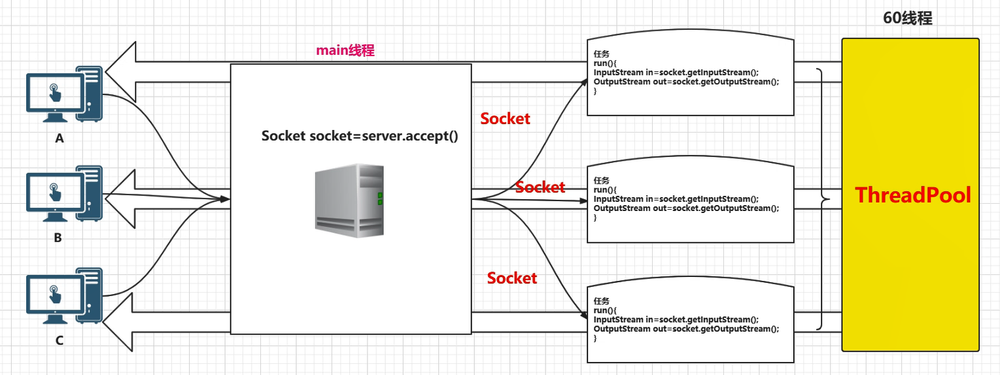

[TOC]

# Java IO

Java 的 I/O 大概可以分成以下几类：

- 磁盘操作：File
- 字节操作：InputStream 和 OutputStream
- 字符操作：Reader 和 Writer
- 对象操作：Serializable
- 网络操作：Socket
- 新的输入/输出：NIO


## 1、磁盘操作

File 类可以用于表示文件和目录的信息，但是它不表示文件的内容。

递归地输出一个目录下所有文件：

```java
public static void listAllFiles(File dir)
{
    if (dir == null || !dir.exists()) {
        return;
    }
    if (dir.isFile()) {
        System.out.println(dir.getName());
        return;
    }
    for (File file : dir.listFiles()) {
        listAllFiles(file);
    }
}
```


## 2、字节操作（*Stream）

使用字节流操作进行文件复制：

```java
public static void copyFile(String src, String dist) throws IOException
{
    FileInputStream in = new FileInputStream(src);
    FileOutputStream out = new FileOutputStream(dist);
    byte[] buffer = new byte[20 * 1024];
    // read() 最多读取 buffer.length 个字节
    // 返回的是实际读取的个数
    // 返回 -1 的时候表示读到 eof，即文件尾
    while (in.read(buffer, 0, buffer.length) != -1) {
        out.write(buffer);
    }
    in.close();
    out.close();
}
```


Java I/O 使用了装饰者模式来实现。以 InputStream 为例，InputStream 是抽象组件，FileInputStream 是 InputStream 的子类，属于具体组件，提供了字节流的输入操作。FilterInputStream 属于抽象装饰者，装饰者用于装饰组件，为组件提供额外的功能，例如 BufferedInputStream 为 FileInputStream 提供缓存的功能。

实例化一个具有缓存功能的字节流对象时，只需要在 FileInputStream 对象上再套一层 BufferedInputStream 对象即可。

```java
FileInputStream fileInputStream = new FileInputStream(filePath);
BufferedInputStream bufferedInputStream = new BufferedInputStream(fileInputStream);
```

DataInputStream 装饰者提供了对更多数据类型进行输入的操作，比如 int、double 等基本类型。


## 3、字符操作（*Reader | *Writer）

不管是磁盘还是网络传输，最小的存储单元都是字节，而不是字符。**但是在程序中操作的通常是字符形式的数据，因此需要提供对字符进行操作的方法。**

- InputStreamReader 实现从**字节流**解码成**字符流**；
- OutputStreamWriter 实现**字符流**编码成为**字节流**。

逐行输出文本文件的内容：

```java
public static void readFileContent(String filePath) throws IOException
{
    FileReader fileReader = new FileReader(filePath);
    BufferedReader bufferedReader = new BufferedReader(fileReader);
    String line;
    while ((line = bufferedReader.readLine()) != null) {
        System.out.println(line);
    }
    // 装饰者模式使得 BufferedReader 组合了一个 Reader 对象
    // 在调用 BufferedReader 的 close() 方法时会去调用 fileReader 的 close() 方法
    // 因此只要一个 close() 调用即可
    bufferedReader.close();
}
```

编码就是把字符转换为字节，而解码是把字节重新组合成字符。

如果编码和解码过程使用不同的编码方式那么就出现了乱码。

- GBK 编码中，中文字符占 2 个字节，英文字符占 1 个字节；
- UTF-8 编码中，中文字符占 3 个字节，英文字符占 1 个字节；
- UTF-16be 编码中，中文字符和英文字符都占 2 个字节。

UTF-16be 中的 be 指的是 Big Endian，也就是大端。相应地也有 UTF-16le，le 指的是 Little Endian，也就是小端。

Java 使用双字节编码 UTF-16be，这不是指 Java 只支持这一种编码方式，而是说 char 这种类型使用 UTF-16be 进行编码。char 类型占 16 位，也就是两个字节，Java 使用这种双字节编码是为了让一个中文或者一个英文都能使用一个 char 来存储。

String 可以看成一个字符序列，可以指定一个编码方式将它转换为字节序列，也可以指定一个编码方式将一个字节序列转换为 String。

```java
String str1 = "中文";
byte[] bytes = str1.getBytes("UTF-8");
String str2 = new String(bytes, "UTF-8");
System.out.println(str2);
```

在调用无参数 getBytes() 方法时，默认的编码方式不是 UTF-16be。双字节编码的好处是可以使用一个 char 存储中文和英文，而将 String 转为 bytes[] 字节数组就不再需要这个好处，因此也就不再需要双字节编码。getBytes() 的默认编码方式与平台有关，一般为 UTF-8。

```java
byte[] bytes = str1.getBytes();
```


## 4、Java序列化，如何实现序列化和反序列化，常见的序列化协议有哪些？ 

   

### Java序列化定义 

- 将那些实现了Serializable接口的对象转换成一个字节序列，并能够在以后将这个字节序列完全恢复为原来的对象，序列化可以弥补不同操作系统之间的差异。 

### Java序列化的作用 

- Java远程方法调用（RMI） | 详情转向：[Java远程方法调用 - 维基百科，自由的百科全书](https://zh.wikipedia.org/wiki/Java%E8%BF%9C%E7%A8%8B%E6%96%B9%E6%B3%95%E8%B0%83%E7%94%A8)
- 对JavaBeans进行序列化 

### 如何实现序列化和反序列化 

- 实现序列化方法 
  - 实现Serializable接口 
    - 该接口只是一个可序列化的标志，并没有包含实际的属性和方法。 
    - 如果不在改方法中添加readObject()和writeObject()方法，则采取默认的序列化机制。如果添加了这两个方法之后还想利用Java默认的序列化机制，则在这两个方法中分别调用defaultReadObject()和defaultWriteObject()两个方法。 
    - 为了保证安全性，可以使用transient关键字进行修饰不必序列化的属性。因为在反序列化时，private修饰的属性也能发查看到。 
  - 实现ExternalSerializable方法 
    - 自己对要序列化的内容进行控制，控制那些属性能被序列化，那些不能被序列化。 
- 反序列化 
  - 实现Serializable接口的对象在反序列化时不需要调用对象所在类的构造方法，完全基于字节。 
  - 实现externalSerializable接口的方法在反序列化时会调用构造方法。 
- 注意事项 
  - 被static修饰的属性不会被序列化 
  - 对象的类名、属性都会被序列化，方法不会被序列化 
  - 要保证序列化对象所在类的属性也是可以被序列化的 
  - 当通过网络、文件进行序列化时，必须按照写入的顺序读取对象。 
  - 反序列化时必须有序列化对象时的class文件 
  - 最好显示的声明serializableID，因为在不同的JVM之间，默认生成serializableID 可能不同，会造成反序列化失败。 


transient 关键字可以使一些属性不会被序列化。

**ArrayList 序列化和反序列化的实现** ：ArrayList 中存储数据的数组是用 transient 修饰的，因为这个数组是动态扩展的，并不是所有的空间都被使用，因此就不需要所有的内容都被序列化。通过重写序列化和反序列化方法，使得可以只序列化数组中有内容的那部分数据。

```java
private transient Object[] elementData;
```

### 常见的序列化协议有哪些 

- COM主要用于Windows平台，并没有真正实现跨平台，另外COM的序列化的原理利用了编译器中虚表，使得其学习成本巨大。 

- CORBA是早期比较好的实现了跨平台，跨语言的序列化协议。COBRA的主要问题是参与方过多带来的版本过多，版本之间兼容性较差，以及使用复杂晦涩。 

- XML&SOAP 

  - XML是一种常用的序列化和反序列化协议，具有跨机器，跨语言等优点。 
  - SOAP（Simple Object Access protocol） 是一种被广泛应用的，基于XML为序列化和反序列化协议的结构化消息传递协议。SOAP具有安全、可扩展、跨语言、跨平台并支持多种传输层协议。 

- JSON（JavaScript Object Notation） 

  - 这种Associative array格式非常符合工程师对对象的理解。 
  - 它保持了XML的人眼可读（Human-readable）的优点。 
  - 相对于XML而言，序列化后的数据更加简洁。  
  - 它具备javascript的先天性支持，所以被广泛应用于Web browser的应用常景中，是Ajax的事实标准协议。 
  - 与XML相比，其协议比较简单，解析速度比较快。 
  - 松散的Associative array使得其具有良好的可扩展性和兼容性。 

- Thrift是Facebook开源提供的一个高性能，轻量级RPC服务框架，其产生正是为了满足当前大数据量、分布式、跨语言、跨平台数据通讯的需求。Thrift在空间开销和解析性能上有了比较大的提升，对于对性能要求比较高的分布式系统，它是一个优秀的RPC解决方案；但是由于Thrift的序列化被嵌入到Thrift框架里面，Thrift框架本身并没有透出序列化和反序列化接口，这导致其很难和其他传输层协议共同使用 

- Protobuf具备了优秀的序列化协议的所需的众多典型特征 

  - 标准的IDL和IDL编译器，这使得其对工程师非常友好。 
  - 序列化数据非常简洁，紧凑，与XML相比，其序列化之后的数据量约为1/3到1/10。 
  - 解析速度非常快，比对应的XML快约20-100倍。 
  - 提供了非常友好的动态库，使用非常简介，反序列化只需要一行代码。由于其解析性能高，序列化后数据量相对少，非常适合应用层对象的持久化场景 

- Avro的产生解决了JSON的冗长和没有IDL的问题，Avro属于Apache Hadoop的一个子项目。 Avro提供两种序列化格式：JSON格式或者Binary格式。Binary格式在空间开销和解析性能方面可以和Protobuf媲美，JSON格式方便测试阶段的调试。适合于高性能的序列化服务。 

- 几种协议的对比 

  - XML序列化（Xstream）无论在性能和简洁性上比较差； 
  - Thrift与Protobuf相比在时空开销方面都有一定的劣势； 
  - Protobuf和Avro在两方面表现都非常优越。 


## -----------------------------------------------------------------------------------------------------

## 2. 序列化的底层怎么实现的【蚂蚁金服-面经】


## 3. Java中的NIO，BIO，AIO分别是什么？

- **同步阻塞IO（BIO）**：用户进程发起一个IO操作以后，必须等待IO操作的真正完成后，才能继续运行。
- **同步非阻塞IO（NIO）**：用户进程发起一个IO操作以后，可做其它事情，但用户进程需要经常询问IO操作是否完成，这样造成不必要的CPU资源浪费。
- **异步非阻塞IO（AIO）**：用户进程发起一个IO操作然后，立即返回，等IO操作真正的完成以后，应用程序会得到IO操作完成的通知。类比Future模式。


- 先来个例子理解一下概念，以银行取款为例：
  - **同步 ：** 自己亲自出马持银行卡到银行取钱（使用同步IO时，Java自己处理IO读写）。
  - **异步 ：** 委托一小弟拿银行卡到银行取钱，然后给你（使用异步IO时，Java将IO读写委托给OS处理，需要将数据缓冲区地址和大小传给OS(银行卡和密码)，OS需要支持异步IO操作API）。
  - **阻塞 ：** ATM排队取款，你只能等待（使用阻塞IO时，Java调用会一直阻塞到读写完成才返回）。
    - **非阻塞 ：** 柜台取款，取个号，然后坐在椅子上做其它事，等号广播会通知你办理，没到号你就不能去，你可以不断问大堂经理排到了没有，大堂经理如果说还没到你就不能去（使用非阻塞IO时，如果不能读写Java调用会马上返回，当IO事件分发器会通知可读写时再继续进行读写，不断循环直到读写完成）。


### BIO 

**定义：**BIO 全称Block-IO 是一种**阻塞同步**的通信模式。我们常说的Stock IO 一般指的是BIO。是一个比较传统的通信方式，**模式简单**，**使用方便**。但**并发处理能力低**，**通信耗时**，**依赖网速**。

**BIO 设计原理：**

服务器通过一个Acceptor线程负责监听客户端请求和为每个客户端创建一个新的线程进行链路处理。典型的一请求一应答模式。若客户端数量增多，频繁地创建和销毁线程会给服务器打开很大的压力。后改良为用线程池的方式代替新增线程，被称为伪异步IO。

服务器提供IP地址和监听的端口，客户端通过TCP的三次握手与服务器连接，连接成功后，双放才能通过套接字(Stock)通信。

**小结：**

BIO模型中通过**Socket**和**ServerSocket**完成套接字通道的实现。阻塞，同步，建立连接耗时。


为了改进这种一连接一线程的模型，我们可以使用线程池来管理这些线程（需要了解更多请参考前面提供的文章），实现1个或多个线程处理N个客户端的模型（但是底层还是使用的同步阻塞I/O），通常被称为“**伪异步I/O模型**“。



实现很简单，我们只需要将新建线程的地方，交给线程池管理即可。

我们知道，如果使用CachedThreadPool线程池（不限制线程数量，如果不清楚请参考文首提供的文章），其实除了能自动帮我们管理线程（复用），看起来也就像是1:1的客户端：线程数模型，而使用FixedThreadPool我们就有效的控制了线程的最大数量，保证了系统有限的资源的控制，实现了N:M的伪异步I/O模型。

但是，正因为限制了线程数量，如果发生大量并发请求，超过最大数量的线程就只能等待，直到线程池中的有空闲的线程可以被复用。而对Socket的输入流就行读取时，会一直阻塞，直到发生：

- 有数据可读
- 可用数据以及读取完毕
- 发生空指针或I/O异常

所以在读取数据较慢时（比如数据量大、网络传输慢等），大量并发的情况下，其他接入的消息，只能一直等待，这就是最大的弊端。

*而后面即将介绍的NIO，就能解决这个难题。*


### NIO

NIO 全称New IO，也叫Non-Block IO 是一种**非阻塞同步**的通信模式。

**NIO 设计原理：**

NIO 相对于BIO来说一大进步。客户端和服务器之间通过Channel通信。NIO可以在Channel进行读写操作。这些Channel都会被注册在Selector多路复用器上。Selector通过一个线程不停的轮询这些Channel。找出已经准备就绪的Channel执行IO操作。
NIO 通过一个线程轮询，实现千万个客户端的请求，这就是非阻塞NIO的特点。

1）**缓冲区Buffer**：它是NIO与BIO的一个重要区别。*BIO是将数据直接写入或读取到Stream对象中*。而NIO的数据操作都是在缓冲区中进行的。缓冲区实际上是一个数组。Buffer最常见的类型是ByteBuffer，另外还有CharBuffer，ShortBuffer，IntBuffer，LongBuffer，FloatBuffer，DoubleBuffer。

2）**通道Channel**：和流不同，通道是双向的。NIO可以通过Channel进行数据的读，写和同时读写操作。通道分为两大类：一类是网络读写（SelectableChannel），一类是用于文件操作（FileChannel），我们使用的SocketChannel和ServerSocketChannel都是SelectableChannel的子类。

3）**多路复用器Selector**：NIO编程的基础。多路复用器提供选择已经就绪的任务的能力。就是Selector会不断地轮询注册在其上的通道（Channel），如果某个通道处于就绪状态，会被Selector轮询出来，然后通过SelectionKey可以取得就绪的Channel集合，从而进行后续的IO操作。服务器端只要提供一个线程负责Selector的轮询，就可以接入成千上万个客户端，这就是JDK NIO库的巨大进步。

小结：**NIO模型中通过SocketChannel和ServerSocketChannel完成套接字通道的实现。非阻塞/阻塞，同步，避免TCP建立连接使用三次握手带来的开销。**


### AIO (NIO.2)

- 异步非阻塞，服务器实现模式为一个有效请求一个线程，客户端的I/O请求都是由OS先完成了再通知服务器应用去启动线程进行处理. 
- AIO方式使用于连接数目多且连接比较长（重操作）的架构，比如**相册服务器**，充分调用OS参与并发操作，编程比较复杂，JDK7开始支持。 

AIO 并没有采用NIO的多路复用器，而是使用异步通道的概念。其read，write方法的返回类型都是Future对象。而Future模型是异步的，其核心思想是：去主函数等待时间。

小结：**AIO模型中通过AsynchronousSocketChannel和AsynchronousServerSocketChannel完成套接字通道的实现。非阻塞，异步**。


### 总结

1. BIO模型中通过**Socket**和**ServerSocket**完成套接字通道实现。阻塞，同步，连接耗时。

2. NIO模型中通过**SocketChannel**和**ServerSocketChannel**完成套接字通道实现。非阻塞/阻塞，同步，避免TCP建立连接使用三次握手带来的开销。
3. AIO模型中通过**AsynchronousSocketChannel**和**AsynchronousServerSocketChannel**完成套接字通道实现。非阻塞，异步。


**另外，**I/O属于底层操作，需要操作系统支持，并发也需要操作系统的支持，所以性能方面不同操作系统差异会比较明显。 


参考：

- [Java BIO、NIO、AIO 学习-力量来源于赤诚的爱！-51CTO博客](http://blog.51cto.com/stevex/1284437)
- [Netty序章之BIO NIO AIO演变 - JavaEE教程 - SegmentFault 思否](https://segmentfault.com/a/1190000012976683)
- [Java 网络IO编程总结（BIO、NIO、AIO均含完整实例代码） - CSDN博客](https://blog.csdn.net/anxpp/article/details/51512200#t3)
- [Java IO Tutorial](http://tutorials.jenkov.com/java-io/index.html)
  

## 3. BIO，NIO，AIO区别

**BIO（阻塞同步通信模式）**：客户端和服务器连接需要三次握手，使用简单，但吞吐量小
**NIO（非阻塞同步通信模式）**：客户端与服务器通过Channel连接，采用多路复用器轮询注册的Channel。提高吞吐量和可靠性。
**AIO（非阻塞异步通信模式）**：NIO的升级版，采用异步通道实现异步通信，其read和write方法均是异步方法。


## 4. Stock通信的伪代码实现流程

服务器绑定端口：server = new ServerSocket(PORT)
服务器阻塞监听：socket = server.accept()
服务器开启线程：new Thread(Handle handle)
服务器读写数据：BufferedReader PrintWriter 
客户端绑定IP和PORT：new Socket(IP_ADDRESS, PORT)
客户端传输接收数据：BufferedReader PrintWriter


# 参考资料


# 并发包

## concurrent包下面，都用过什么？

- concurrent下面的包 
  - Executor  用来创建线程池，在实现Callable接口时，添加线程。 
  - FeatureTask 此 FutureTask 的 get 方法所返回的结果类型。 
  - TimeUnit 
  - Semaphore  
  - LinkedBlockingQueue  
- 所用过的类 
  - Executor   

