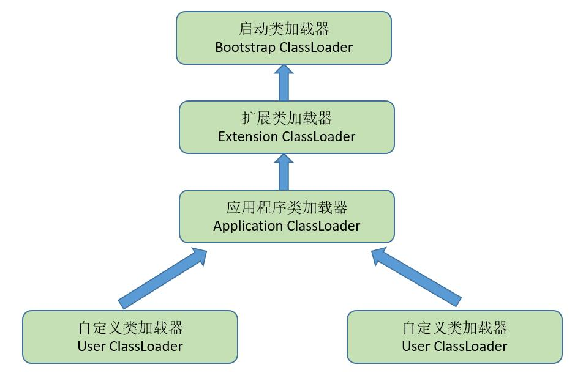

[TOC]


# Java虚拟机

## 1. 运行时数据区域（Java虚拟机内存的划分，每个区域的功能）？

[](https://github.com/CyC2018/Interview-Notebook/blob/master/pics/540631a4-6018-40a5-aed7-081e2eeeaeea.png)

 

### （1）程序计数器（线程私有）

- 记录正在执行的虚拟机字节码指令的地址（行号）（如果正在执行的是本地方法时其值为undefined）

- 唯一一个在Java虚拟机规范中没有规定任何OutOfMemoryError情况的区域

  

### （2）虚拟机栈（线程私有）

- （栈内存）为虚拟机执行java方法服务：方法被调用时创建栈帧-->局部变量表->局部变量、对象引用 
- 如果线程请求的栈深度超出了虚拟机所允许的深度，就会出现StackOverFlowError。-Xss规定了栈的最大空间 
- 虚拟机栈可以动态扩展，如果扩展到无法申请到足够的内存，会出现OutOfMemoryError（OOM）

[](https://github.com/CyC2018/Interview-Notebook/blob/master/pics/f5757d09-88e7-4bbd-8cfb-cecf55604854.png)

可以通过 -Xss 这个虚拟机参数来指定一个程序的 Java 虚拟机栈内存大小：

```
java -Xss=512M HackTheJava
```

该区域可能抛出以下异常：

- 当线程请求的栈深度超过最大值，会抛出 StackOverflowError 异常；

- 栈进行动态扩展时如果无法申请到足够内存，会抛出 OutOfMemoryError 异常。

  

### （3）本地方法栈（线程私有）

- java虚拟机栈是为虚拟机执行Java方法服务的，**而本地方法栈则为虚拟机执使用到的Native方法服务**。 
- Java虚拟机没有对本地方法栈的使用和数据结构做强制规定。Sun HotSpot把Java虚拟机栈和本地方法栈合二为一 
- 本地方法不是用 Java 实现，对待这些方法需要特别处理。
- 与 Java 虚拟机栈类似，它们之间的区别只不过是本地方法栈为本地方法服务。
- 会抛出StackOverFlowError和OutOfMemoryError 

[](https://github.com/CyC2018/Interview-Notebook/blob/master/pics/JNIFigure1.gif)

 

### （4）堆

所有对象实例都在这里分配内存。

是垃圾收集的主要区域（"GC 堆"）。现代的垃圾收集器基本都是采用分代收集算法，主要思想是针对不同的对象采取不同的垃圾回收算法。虚拟机把 Java 堆分成以下三块：

- 新生代（Young Generation）
- 老年代（Old Generation）
- 永久代（Permanent Generation）

当一个对象被创建时，它首先进入新生代，之后有可能被转移到老年代中。

新生代存放着大量的生命很短的对象，因此新生代在三个区域中垃圾回收的频率最高。为了更高效地进行垃圾回收，把新生代继续划分成以下三个空间：

- ### Eden（伊甸园）
- From Survivor（幸存者）
- To Survivor

[](https://github.com/CyC2018/Interview-Notebook/blob/master/pics/ppt_img.gif)

 

Java 堆不需要连续内存，并且可以动态增加其内存，增加失败会抛出 OutOfMemoryError 异常。

可以通过 -Xms 和 -Xmx 两个虚拟机参数来指定一个程序的 Java 堆内存大小，第一个参数设置初始值，第二个参数设置最大值。

```
java -Xms=1M -Xmx=2M HackTheJava
```


### （5）方法区

**用于存放已被加载的类信息*（包含：类版本、字段、方法、接口）*、常量、静态变量、即时编译器编译后的代码等数据。**

和 Java 堆一样不需要连续的内存，并且可以动态扩展，动态扩展失败一样会抛出 OutOfMemoryError 异常。

对这块区域进行垃圾回收的主要目标是对常量池的回收和对类的卸载，但是一般比较难实现。

JDK 1.7 之前，HotSpot 虚拟机把它当成永久代来进行垃圾回收，JDK 1.8 之后，取消了永久代，用 metaspace（元数据）区替代。


### （6）运行时常量池

运行时常量池是方法区的一部分。

Class 文件中的常量池（编译器生成的各种字面量和符号引用）会在类加载后被放入这个区域。

除了在编译期生成的常量，还允许动态生成，例如 String 类的 intern()。

```java
在TLAB空间中存在

// 字节码常量
String s1 = "123";
String s2 = "123";
System.out.println(s1 == s1);  //  true
```


### （7）直接内存

在 JDK 1.4 中新加入了 NIO 类，它可以使用 Native 函数库直接分配堆外内存，然后通过一个存储在 Java 堆里的 DirectByteBuffer 对象作为这块内存的引用进行操作。这样能在一些场景中显著提高性能，因为避免了在 Java 堆和 Native 堆中来回复制数据。


## 2. 判断一个对象是否存活？（对象已死吗）

**程序计数器、虚拟机栈和本地方法栈**这三个区域属于线程私有的，只存在于线程的生命周期内，线程结束之后也会消失，因此不需要对这三个区域进行垃圾回收。垃圾回收主要是针对 **Java 堆和方法区**进行。

### 1. 引用计数算法

**描述：**给对象中添加一个引用计数器每当有一个地方引用它时，计数器就加1；当引用失效时，计数器值就减1；任何时刻计数器为0的对象就是不可能在被使用的。

**缺陷：**很难解决对象间相互循环引用的问题


### 2. 可达性分析算法

通过 GC Roots 作为起始点进行搜索，能够到达到的对象都是存活的，不可达的对象可被回收。

[](https://github.com/CyC2018/Interview-Notebook/blob/master/pics/0635cbe8.png)

Java 虚拟机使用该算法来判断对象是否可被回收，在 Java 中 GC Roots 一般包含以下内容：

- 虚拟机栈（栈帧中的本地变量表）中引用的对象。
- 方法区中静态属性引用的对象。
- 方法区中常量引用的对象。
- 本地方法栈中 JNI （即一般说的 Native 方法）引用的对象。


### 3. 引用类型

无论是通过引用计算算法判断对象的引用数量，还是通过可达性分析算法判断对象是否可达，判定对象是否可被回收都与引用有关。

在 JDK 1.2 之后，Java 对引用的概念进行了扩充，将引用分为**强引用（Strong Reference）、软引用（Soft Reference）、弱引用（Weak Reference）、虚引用（Phantom Reference）**4种，这4种引用强度依次逐渐减弱。 

- **强引用** ：在程序代码中普遍存在，垃圾收集器永远不会回收被引用的对象。
- **软引用** ：是用来描述一些还有用但并非必须的对象。在系统将要**发生内存溢出异常之前**，将会把这些对象列进回收范围之中进行第二次回收。如果这次回收还没有足够的内存，才会抛出内存溢出异常。
- **弱引用**：也是用来描述非必须对象的，强度比软引用更弱一些，被弱引用关联的对象只能生存到下一次垃圾收集发生之前。
- **虚引用**：也称为幽灵引用或者幻影引用，它是最弱的一种引用关系。唯一的目的就是能在这个对象被收集器回收时收到一个系统通知。


### 4. 方法区的回收

Java虚拟机规范中确实说过可以**不要求虚拟机在方法区实现垃圾收集**，而且在方法区中进行垃圾收集的**“性价比”一般比较低**：在堆中，尤其在新生代中，常规的应用一次垃圾收集一般可以回收**70% ~ 95%的空间**，而永久代的垃圾收集效率远低于此。

永久代的垃圾收集主要回收两部分：**废弃常量** 和 **无用的类**。

- 回收废弃常量与回收 Java 堆中的对象非常类似。
- 要判定一个类是否是“无用的类”的条件相对苛刻许多。类需要同时满足下面3个条件才能算“无用的类”
  - 该类的所有实例都已经被回收。
  - 加载该类的 ClassLoader 已经被回收。
  - 该类对应的 java.lang.Class 对象没有在任何地方被引用，无法在任何地方通过反射访问该类的方法。

在大量使用反射、动态代理、GGLib 等 ByteCode 框架、动态生成 Jsp 以及 OSGI 这类频繁自定义 ClassLoader 的场景都需要虚拟机具备类卸载的功能，以保证永久代不会溢出。     

   

### 5. finalize()

finalize() 类似 C++ 的析构函数，用来做关闭外部资源等工作。但是 try-finally 等方式可以做的更好，并且该方法运行代价高昂，不确定性大，无法保证各个对象的调用顺序，因此最好不要使用。

当一个对象可被回收时，如果需要执行该对象的 finalize() 方法，那么就有可能通过在该方法中让对象重新被引用，从而实现自救。自救只能进行一次，如果回收的对象之前调用了 finalize() 方法自救，后面回收时不会调用 finalize() 方法。


## 3. 垃圾收集算法（垃圾处理方法3种）

### 1. 标记 - 清除

[](https://github.com/CyC2018/Interview-Notebook/blob/master/pics/a4248c4b-6c1d-4fb8-a557-86da92d3a294.jpg)

首先标记出所有需要回收的对象，在标记完成后统一回收所有标记的对象。

 **不足：**

- **效率问题**：标记和清除的效率都不高
- **空间问题**：标记清除之后会产生大量不连续的内存碎片，导致以后需要分配较大对象时，无法找到足够的连续内存而不得不提前触发另外一次垃圾收集。


### 2. 标记 - 整理

[](https://github.com/CyC2018/Interview-Notebook/blob/master/pics/902b83ab-8054-4bd2-898f-9a4a0fe52830.jpg)

 

复制收集算法在对象存活率较高时就要进行较多的复制操作，效率会变低。更关键的是，如果不想浪费 50% 的空间，就需要有额外的空间进行分配担保，所以老年代一般不能直接选用这种算法。

“标记-整理”算法的标记过程仍然与“标记-清除”算法一样，而后续是让所有存活的对象都向一端移动，然后直接清理掉端边界以外的内存。


### 3. 复制

[](https://github.com/CyC2018/Interview-Notebook/blob/master/pics/e6b733ad-606d-4028-b3e8-83c3a73a3797.jpg)

 

现在的商业虚拟机都采用这种收集算法来回收新生代。

HotSopt 将内存分为一块比较大的 Eden 空间和两块比较小的 Survivor 空间，每次使用 Eden 和其中一块 Survivor 。当回收时，将 Eden 和 Survivor 中还存活着的对象一次性复制到另外一块 Survivor 空间上，最后清理掉 Eden 和 刚才用过的 Survivor 空间。

HotSopt 虚拟机默认 Eden 和 Survivor 的大小比例是 8:1，也就是新生代中可用内存空间为整个新生代容量的 90%（80%+10%），只有10%的内存会被“浪费”。

当 Survivor 空间不够用时，需要依赖其他内存（老年代）进行**分配担保**（Handle Promotion）。如果另外一块 Survivor 空间没有足够空间存放上一次新生代收集下来的存活对象时，这些对象向直接通过分配担保机制进入老年代。


### *. 分代收集

现在的商业虚拟机采用分代收集算法，它根据对象存活周期将内存划分为几块，不同块采用适当的收集算法。（类似于分段锁）


**一般将 Java 堆分为新生代和老年代。**

- 新生代使用：复制算法
- 老年代使用：标记 - 清理 或者 **标记 - 整理** 算法


## 4. 垃圾收集器有哪些？【阿里面经OneNote】

[](https://github.com/CyC2018/Interview-Notebook/blob/master/pics/c625baa0-dde6-449e-93df-c3a67f2f430f.jpg)

 以上是 HotSpot 虚拟机中的 7 个垃圾收集器，连线表示垃圾收集器可以配合使用。

- **单线程与并行（多线程）**：
  - 单线程指的是垃圾收集器只使用一个线程进行收集，而并行使用多个线程。
- **串行与并发**：
  - 串行指的是垃圾收集器与用户程序交替执行，这意味着在执行垃圾收集的时候需要停顿用户程序；
  - 并发指的是垃圾收集器和用户程序同时执行。除了 CMS 和 G1 之外，其它垃圾收集器都是以串行的方式执行。

### 1. Serial 收集器

[](https://github.com/CyC2018/Interview-Notebook/blob/master/pics/22fda4ae-4dd5-489d-ab10-9ebfdad22ae0.jpg)

Serial 翻译为串行，也就是说它以串行的方式执行。

它是单线程的收集器，只会使用一个线程进行垃圾收集工作。

它的优点是简单高效，对于单个 CPU 环境来说，由于没有线程交互的开销，因此拥有最高的单线程收集效率。

它是 Client 模式下的默认新生代收集器，因为在用户的桌面应用场景下，分配给虚拟机管理的内存一般来说不会很大。Serial 收集器收集几十兆甚至一两百兆的新生代停顿时间可以控制在一百多毫秒以内，只要不是太频繁，这点停顿是可以接受的。


### 2. ParNew 收集器

[](https://github.com/CyC2018/Interview-Notebook/blob/master/pics/81538cd5-1bcf-4e31-86e5-e198df1e013b.jpg)

 

它是 Serial 收集器的多线程版本。

是 Server 模式下的虚拟机首选新生代收集器，除了性能原因外，主要是因为除了 Serial 收集器，只有它能与 CMS 收集器配合工作。

默认开启的线程数量与 CPU 数量相同，可以使用 -XX:ParallelGCThreads 参数来设置线程数。


### 3. Parallel Scavenge 收集器

与 ParNew 一样是并行的多线程收集器。

其它收集器关注点是尽可能缩短垃圾收集时用户线程的停顿时间，而它的目标是达到一个可控制的吞吐量，它被称为“吞吐量优先”收集器。这里的吞吐量指 CPU 用于运行用户代码的时间占总时间的比值。

停顿时间越短就越适合需要与用户交互的程序，良好的响应速度能提升用户体验。而高吞吐量则可以高效率地利用 CPU 时间，尽快完成程序的运算任务，主要适合在后台运算而不需要太多交互的任务。

提供了两个参数用于精确控制吞吐量，分别是控制最大垃圾收集停顿时间 -XX:MaxGCPauseMillis 参数以及直接设置吞吐量大小的 -XX:GCTimeRatio 参数（值为大于 0 且小于 100 的整数）。缩短停顿时间是以牺牲吞吐量和新生代空间来换取的：新生代空间变小，垃圾回收变得频繁，导致吞吐量下降。

还提供了一个参数 -XX:+UseAdaptiveSizePolicy，这是一个开关参数，打开参数后，就不需要手工指定新生代的大小（-Xmn）、Eden 和 Survivor 区的比例（-XX:SurvivorRatio）、晋升老年代对象年龄（-XX:PretenureSizeThreshold）等细节参数了，虚拟机会根据当前系统的运行情况收集性能监控信息，动态调整这些参数以提供最合适的停顿时间或者最大的吞吐量，这种方式称为 GC 自适应的调节策略（GC Ergonomics）。


### 4. Serial Old 收集器

[](https://github.com/CyC2018/Interview-Notebook/blob/master/pics/08f32fd3-f736-4a67-81ca-295b2a7972f2.jpg)

 是 Serial 收集器的老年代版本，也是给 Client 模式下的虚拟机使用。如果用在 Server 模式下，它有两大用途：

- 在 JDK 1.5 以及之前版本（Parallel Old 诞生以前）中与 Parallel Scavenge 收集器搭配使用。

- 作为 CMS 收集器的后备预案，在并发收集发生 Concurrent Mode Failure 时使用。

  

### 5. Parallel Old 收集器

[](https://github.com/CyC2018/Interview-Notebook/blob/master/pics/278fe431-af88-4a95-a895-9c3b80117de3.jpg)

 是 Parallel Scavenge 收集器的老年代版本。

在注重吞吐量以及 CPU 资源敏感的场合，都可以优先考虑 Parallel Scavenge 加 Parallel Old 收集器。


### 6. CMS 收集器

[](https://github.com/CyC2018/Interview-Notebook/blob/master/pics/62e77997-6957-4b68-8d12-bfd609bb2c68.jpg)

 CMS（Concurrent Mark Sweep），Mark Sweep 指的是标记 - 清除算法。

特点：并发收集、低停顿。

分为以下四个流程：

- 初始标记：仅仅只是标记一下 GC Roots 能直接关联到的对象，速度很快，需要停顿。
- 并发标记：进行 GC Roots Tracing 的过程，它在整个回收过程中耗时最长，不需要停顿。
- 重新标记：为了修正并发标记期间因用户程序继续运作而导致标记产生变动的那一部分对象的标记记录，需要停顿。
- 并发清除：不需要停顿。

在整个过程中耗时最长的并发标记和并发清除过程中，收集器线程都可以与用户线程一起工作，不需要进行停顿。

优点：

- 并发收集
- 低停顿

具有以下缺点：

- 吞吐量低：低停顿时间是以牺牲吞吐量为代价的，导致 CPU 利用率不够高。

- 无法处理浮动垃圾，可能出现 Concurrent Mode Failure。浮动垃圾是指并发清除阶段由于用户线程继续运行而产生的垃圾，这部分垃圾只能到下一次 GC 时才能进行回收。由于浮动垃圾的存在，因此需要预留出一部分内存，意味着 CMS 收集不能像其它收集器那样等待老年代快满的时候再回收。如果预留的内存不够存放浮动垃圾，就会出现 Concurrent Mode Failure，这时虚拟机将临时启用 Serial Old 来替代 CMS。

- 标记 - 清除算法导致的空间碎片，往往出现老年代空间剩余，但无法找到足够大连续空间来分配当前对象，不得不提前触发一次 Full GC。

  

### 7. G1 收集器

G1（Garbage-First），它是一款面向服务端应用的垃圾收集器，在多 CPU 和大内存的场景下有很好的性能。HotSpot 开发团队赋予它的使命是未来可以替换掉 CMS 收集器。

Java 堆被分为新生代、老年代和永久代，其它收集器进行收集的范围都是整个新生代或者老年代，而 G1 可以直接对新生代和老年代一起回收。

[](https://github.com/CyC2018/Interview-Notebook/blob/master/pics/4cf711a8-7ab2-4152-b85c-d5c226733807.png)

G1 把堆划分成多个大小相等的独立区域（Region），新生代和老年代不再物理隔离。

[](https://github.com/CyC2018/Interview-Notebook/blob/master/pics/9bbddeeb-e939-41f0-8e8e-2b1a0aa7e0a7.png)

通过引入 Region 的概念，从而将原来的一整块内存空间划分成多个的小空间，使得每个小空间可以单独进行垃圾回收。这种划分方法带来了很大的灵活性，使得可预测的停顿时间模型成为可能。通过记录每个 Region 垃圾回收时间以及回收所获得的空间（这两个值是通过过去回收的经验获得），并维护一个优先列表，每次根据允许的收集时间，优先回收价值最大的 Region。

每个 Region 都有一个 Remembered Set，用来记录该 Region 对象的引用对象所在的 Region。通过使用 Remembered Set，在做可达性分析的时候就可以避免全堆扫描。

[](https://github.com/CyC2018/Interview-Notebook/blob/master/pics/f99ee771-c56f-47fb-9148-c0036695b5fe.jpg)

 

如果不计算维护 Remembered Set 的操作，G1 收集器的运作大致可划分为以下几个步骤：

- 初始标记
- 并发标记
- 最终标记：为了修正在并发标记期间因用户程序继续运作而导致标记产生变动的那一部分标记记录，虚拟机将这段时间对象变化记录在线程的 Remembered Set Logs 里面，最终标记阶段需要把 Remembered Set Logs 的数据合并到 Remembered Set 中。这阶段需要停顿线程，但是可并行执行。
- 筛选回收：首先对各个 Region 中的回收价值和成本进行排序，根据用户所期望的 GC 停顿时间来制定回收计划。此阶段其实也可以做到与用户程序一起并发执行，但是因为只回收一部分 Region，时间是用户可控制的，而且停顿用户线程将大幅度提高收集效率。

具备如下特点：

- 空间整合：整体来看是基于“标记 - 整理”算法实现的收集器，从局部（两个 Region 之间）上来看是基于“复制”算法实现的，这意味着运行期间不会产生内存空间碎片。
- 可预测的停顿：能让使用者明确指定在一个长度为 M 毫秒的时间片段内，消耗在 GC 上的时间不得超过 N 毫秒。

更详细内容请参考：[Getting Started with the G1 Garbage Collector](http://www.oracle.com/webfolder/technetwork/tutorials/obe/java/G1GettingStarted/index.html)


### 8. 比较

| 收集器                | 单线程/并行 | 串行/并发 | 新生代/老年代   | 收集算法             | 目标         | 适用场景                                      |
| --------------------- | ----------- | --------- | --------------- | -------------------- | ------------ | --------------------------------------------- |
| **Serial**            | 单线程      | 串行      | 新生代          | 复制                 | 响应速度优先 | 单 CPU 环境下的 Client 模式                   |
| **Serial Old**        | 单线程      | 串行      | 老年代          | 标记-整理            | 响应速度优先 | 单 CPU 环境下的 Client 模式、CMS 的后备预案   |
| **ParNew**            | 并行        | 串行      | 新生代          | 复制算法             | 响应速度优先 | 多 CPU 环境时在 Server 模式下与 CMS 配合      |
| **Parallel Scavenge** | 并行        | 串行      | 新生代          | 复制算法             | 吞吐量优先   | 在后台运算而不需要太多交互的任务              |
| **Parallel Old**      | 并行        | 串行      | 老年代          | 标记-整理            | 吞吐量优先   | 在后台运算而不需要太多交互的任务              |
| **CMS**               | 并行        | 并发      | 老年代          | 标记-清除            | 响应速度优先 | 集中在互联网站或 B/S 系统服务端上的 Java 应用 |
| **G1**                | 并行        | 并发      | 新生代 + 老年代 | 标记-整理 + 复制算法 | 响应速度优先 | 面向服务端应用，将来替换 CMS                  |


参考：[Java GC | Pandora](https://hellojz.me/2017/10/10/jvm/gc/)


## 5. 内存分配与回收策略

### 1. Minor GC 和 Full GC

- Minor GC：发生在新生代上，因为新生代对象存活时间很短，因此 Minor GC 会频繁执行，执行的速度一般也会比较快。
- Full GC：发生在老年代上，老年代对象其存活时间长，因此 Full GC 很少执行，执行速度会比 Minor GC 慢很多。

### 2. 内存分配策略

#### （一）对象优先在 Eden 分配

大多数情况下，对象在新生代 Eden 区分配，当 Eden 区空间不够时，发起 Minor GC。

#### （二）大对象直接进入老年代

大对象是指需要连续内存空间的对象，最典型的大对象是那种很长的字符串以及数组。

经常出现大对象会提前触发垃圾收集以获取足够的连续空间分配给大对象。

-XX:PretenureSizeThreshold，大于此值的对象直接在老年代分配，避免在 Eden 区和 Survivor 区之间的大量内存复制。

#### （三）长期存活的对象进入老年代

为对象定义年龄计数器，对象在 Eden 出生并经过 Minor GC 依然存活，将移动到 Survivor 中，年龄就增加 1 岁，增加到一定年龄则移动到老年代中。

-XX:MaxTenuringThreshold 用来定义年龄的阈值。

#### （四）动态对象年龄判定

虚拟机并不是永远地要求对象的年龄必须达到 MaxTenuringThreshold 才能晋升老年代，如果在 Survivor 中相同年龄所有对象大小的总和大于 Survivor 空间的一半，则年龄大于或等于该年龄的对象可以直接进入老年代，无需等到 MaxTenuringThreshold 中要求的年龄。

#### （五）空间分配担保

在发生 Minor GC 之前，虚拟机先检查老年代最大可用的连续空间是否大于新生代所有对象总空间，如果条件成立的话，那么 Minor GC 可以确认是安全的。

如果不成立的话虚拟机会查看 HandlePromotionFailure 设置值是否允许担保失败，如果允许那么就会继续检查老年代最大可用的连续空间是否大于历次晋升到老年代对象的平均大小，如果大于，将尝试着进行一次 Minor GC；如果小于，或者 HandlePromotionFailure 设置不允许冒险，那么就要进行一次 Full GC。

### 3. Full GC 的触发条件

对于 Minor GC，其触发条件非常简单，当 Eden 空间满时，就将触发一次 Minor GC。而 Full GC 则相对复杂，有以下条件：

#### （一）调用 System.gc()

只是建议虚拟机执行 Full GC，但是虚拟机不一定真正去执行。不建议使用这种方式，而是让虚拟机管理内存。

#### （二）老年代空间不足

老年代空间不足的常见场景为前文所讲的大对象直接进入老年代、长期存活的对象进入老年代等。

为了避免以上原因引起的 Full GC，应当尽量不要创建过大的对象以及数组。除此之外，可以通过 -Xmn 虚拟机参数调大新生代的大小，让对象尽量在新生代被回收掉，不进入老年代。还可以通过 -XX:MaxTenuringThreshold 调大对象进入老年代的年龄，让对象在新生代多存活一段时间。

#### （三）空间分配担保失败

使用复制算法的 Minor GC 需要老年代的内存空间作担保，如果担保失败会执行一次 Full GC。具体内容请参考上面的第五小节。

#### （四）JDK 1.7 及以前的永久代空间不足

在 JDK 1.7 及以前，HotSpot 虚拟机中的方法区是用永久代实现的，永久代中存放的为一些 Class 的信息、常量、静态变量等数据。

当系统中要加载的类、反射的类和调用的方法较多时，永久代可能会被占满，在未配置为采用 CMS GC 的情况下也会执行 Full GC。如果经过 Full GC 仍然回收不了，那么虚拟机会抛出 java.lang.OutOfMemoryError。

为避免以上原因引起的 Full GC，可采用的方法为增大永久代空间或转为使用 CMS GC。

#### （五）Concurrent Mode Failure

执行 CMS GC 的过程中同时有对象要放入老年代，而此时老年代空间不足（可能是 GC 过程中浮动垃圾过多导致暂时性的空间不足），便会报 Concurrent Mode Failure 错误，并触发 Full GC。


## 6. 类加载机制

虚拟机把描述类的数据从Class文件加载到内存，并对数据进行校验、转换解析和初始化，最终形成可以被虚拟机直接使用的Java类型，这就是虚拟机类加载机制。 （类是在运行期间动态加载的。）

懒加载机制

### 类的生命周期

[](https://github.com/CyC2018/Interview-Notebook/blob/master/pics/32b8374a-e822-4720-af0b-c0f485095ea2.jpg)

 

包括以下 7 个阶段：

- **加载（Loading）**
- **验证（Verification）**
- **准备（Preparation）**
- **解析（Resolution）**
- **初始化（Initialization）**
- 使用（Using）
- 卸载（Unloading）

其中解析过程在某些情况下可以在初始化阶段之后再开始，这是为了支持 Java 的动态绑定。

这7个阶段中的：加载、验证、准备、初始化、卸载的顺序是固定的。*但它们并不一定是严格同步串行执行，它们之间可能会有交叉*，但总是以“开始”的顺序总是按部就班的。至于解析则有可能在初始化之后才开始，**这是为了支持Java语言的运行时绑定（也称为动态绑定或晚期绑定）**。 


### 类初始化时机

虚拟机规范中并没有强制约束何时进行加载，但是规范严格规定了有且只有下列五种情况必须对类进行初始化（加载、验证、准备都会随之发生）：

- 遇到 new、getstatic、putstatic、invokestatic 这四条字节码指令时，如果类没有进行过初始化，则必须先触发其初始化。最常见的生成这 4 条指令的场景是：使用 new 关键字实例化对象的时候；读取或设置一个类的静态字段（被 final 修饰、已在编译期把结果放入常量池的静态字段除外）的时候；以及调用一个类的静态方法的时候。
- 使用 java.lang.reflect 包的方法对类进行反射调用的时候，如果类没有进行初始化，则需要先触发其初始化。
- 当初始化一个类的时候，如果发现其父类还没有进行过初始化，则需要先触发其父类的初始化。
- 当虚拟机启动时，用户需要指定一个要执行的主类（包含 main() 方法的那个类），虚拟机会先初始化这个主类；
- 当使用 JDK 1.7 的动态语言支持时，如果一个 java.lang.invoke.MethodHandle 实例最后的解析结果为 REF_getStatic, REF_putStatic, REF_invokeStatic 的方法句柄，并且这个方法句柄所对应的类没有进行过初始化，则需要先触发其初始化；

以上 5 种场景中的行为称为对一个类进行主动引用。除此之外，所有引用类的方式都不会触发初始化，称为被动引用。被动引用的常见例子包括：

- 通过子类引用父类的静态字段，不会导致子类初始化。

```
System.out.println(SubClass.value);  // value 字段在 SuperClass 中定义
```

- 通过数组定义来引用类，不会触发此类的初始化。该过程会对数组类进行初始化，数组类是一个由虚拟机自动生成的、直接继承自 Object 的子类，其中包含了数组的属性和方法。

```
SuperClass[] sca = new SuperClass[10];
```

- 常量在编译阶段会存入调用类的常量池中，本质上并没有直接引用到定义常量的类，因此不会触发定义常量的类的初始化。

```
System.out.println(ConstClass.HELLOWORLD);
```


### 类加载过程

包含了加载、验证、准备、解析和初始化这 5 个阶段。

#### 1. 加载

加载是类加载的一个阶段，注意不要混淆。

加载过程完成以下三件事：

- 通过一个类的全限定名来获取定义此类的二进制字节流。
- 将这个字节流所代表的静态存储结构转化为方法区的运行时存储结构。
- 在内存中生成一个代表这个类的 Class 对象，作为方法区这个类的各种数据的访问入口。


其中二进制字节流可以从以下方式中获取：

- **文件：**从 ZIP 包读取，这很常见，最终成为日后 JAR、EAR、WAR 格式的基础。
- **网络：**从网络中获取，这种场景最典型的应用是 Applet。
- **计算生成一个二进制流：**运行时计算生成，这种场景使用得最多得就是动态代理技术，在 java.lang.reflect.Proxy 中，就是用了 ProxyGenerator.generateProxyClass 的代理类的二进制字节流。
- **由其他文件生成：**由其他文件生成，典型场景是 JSP 应用，即由 JSP 文件生成对应的 Class 类。
- **数据库：**从数据库读取，这种场景相对少见，例如有些中间件服务器（如 SAP Netweaver）可以选择把程序安装到数据库中来完成程序代码在集群间的分发。 ...


#### 2. 验证

目的是：确保 Class 文件的字节流中包含的信息符合当前虚拟机的要求，并且不会危害虚拟机自身的安全。

- 文件格式验证：验证字节流是否符合 Class 文件格式的规范，并且能被当前版本的虚拟机处理。
- 元数据验证：对字节码描述的信息进行语义分析，以保证其描述的信息符合 Java 语言规范的要求。
- 字节码验证：通过数据流和控制流分析，确保程序语义是合法、符合逻辑的。
- 符号引用验证：发生在虚拟机将符号引用转换为直接引用的时候，对类自身以外（常量池中的各种符号引用）的信息进行匹配性校验。


#### 3. 准备

类变量是被 static 修饰的变量，准备阶段为类变量分配内存并设置初始值，使用的是方法区的内存。

实例变量不会在这阶段分配内存，它将会在对象实例化时随着对象一起分配在 Java 堆中。（实例化不是类加载的一个过程，类加载发生在所有实例化操作之前，并且类加载只进行一次，实例化可以进行多次）

初始值一般为 0 值，例如下面的类变量 value 被初始化为 0 而不是 123。

```
public static int value = 123;
```

如果类变量是常量，那么会按照表达式来进行初始化，而不是赋值为 0。

```
public static final int value = 123;
```


#### 4. 解析

将常量池的符号引用替换为直接引用的过程。

- 类或接口的解析
- 字段解析
- 类方法解析
- 接口方法解析


#### 5. 初始化

初始化阶段才真正开始执行类中的定义的 Java 程序代码。初始化阶段即虚拟机执行类构造器 <clinit>() 方法的过程。

在准备阶段，类变量已经赋过一次系统要求的初始值，而在初始化阶段，根据程序员通过程序制定的主观计划去初始化类变量和其它资源。

<clinit>() 方法具有以下特点：

- 是由编译器自动收集类中所有类变量的赋值动作和静态语句块（static{} 块）中的语句合并产生的，编译器收集的顺序由语句在源文件中出现的顺序决定。特别注意的是，静态语句块只能访问到定义在它之前的类变量，定义在它之后的类变量只能赋值，不能访问。例如以下代码：

```java
public class Test {
    static {
        i = 0;                // 给变量赋值可以正常编译通过
        System.out.print(i);  // 这句编译器会提示“非法向前引用”
    }
    static int i = 1;
}
```

- 与类的构造函数（或者说实例构造器 <init>()）不同，不需要显式的调用父类的构造器。虚拟机会自动保证在子类的 <clinit>() 方法运行之前，父类的 <clinit>() 方法已经执行结束。因此虚拟机中第一个执行 <clinit>() 方法的类肯定为 java.lang.Object。
- 由于父类的 <clinit>() 方法先执行，也就意味着父类中定义的静态语句块要优于子类的变量赋值操作。例如以下代码：

```java
static class Parent {
    public static int A = 1;
    static {
        A = 2;
    }
}

static class Sub extends Parent {
    public static int B = A;
}

public static void main(String[] args) {
     System.out.println(Sub.B);  // 输出结果是父类中的静态变量 A 的值，也就是 2。
}
```

- <clinit>() 方法对于类或接口不是必须的，如果一个类中不包含静态语句块，也没有对类变量的赋值操作，编译器可以不为该类生成 <clinit>() 方法。
- 接口中不可以使用静态语句块，但仍然有类变量初始化的赋值操作，因此接口与类一样都会生成 <clinit>() 方法。但接口与类不同的是，执行接口的 <clinit>() 方法不需要先执行父接口的 <clinit>() 方法。只有当父接口中定义的变量使用时，父接口才会初始化。另外，接口的实现类在初始化时也一样不会执行接口的 <clinit>() 方法。
- 虚拟机会保证一个类的 <clinit>() 方法在多线程环境下被正确的加锁和同步，如果多个线程同时初始化一个类，只会有一个线程执行这个类的 <clinit>() 方法，其它线程都会阻塞等待，直到活动线程执行 <clinit>() 方法完毕。如果在一个类的 <clinit>() 方法中有耗时的操作，就可能造成多个线程阻塞，在实际过程中此种阻塞很隐蔽。


### 类加载器

在 Java 虚拟机外部实现，以便让应用程序自己决定如何去获取所需要的类。（通过一个类的全限之名获取描述此类的二进制字节流）

只有被同一个类加载器加载的类才可能会相等。相同的字节码被不同的类加载器加载的类不想等。


#### 1. 类与类加载器

两个类相等：类本身相等，并且使用同一个类加载器进行加载。这是因为每一个类加载器都拥有一个独立的类名称空间。

这里的相等，包括类的 Class 对象的 equals() 方法、isAssignableFrom() 方法、isInstance() 方法的返回结果为 true，也包括使用 instanceof 关键字做对象所属关系判定结果为 true。

#### 2. 类加载器分类

从 Java 虚拟机的角度来讲，只存在以下两种不同的类加载器：

- 启动类加载器（Bootstrap ClassLoader），这个类加载器用 C++ 实现，是虚拟机自身的一部分；
- 所有其他类的加载器，这些类由 Java 实现，独立于虚拟机外部，并且全都继承自抽象类 java.lang.ClassLoader。

从 Java 开发人员的角度看，类加载器可以划分得更细致一些：

- 启动类加载器（Bootstrap ClassLoader）此类加载器负责将存放在 <JAVA_HOME>\lib 目录中的，或者被 -Xbootclasspath 参数所指定的路径中的，并且是虚拟机识别的（仅按照文件名识别，如 rt.jar，名字不符合的类库即使放在 lib 目录中也不会被加载）类库加载到虚拟机内存中。启动类加载器无法被 Java 程序直接引用，用户在编写自定义类加载器时，如果需要把加载请求委派给启动类加载器，直接使用 null 代替即可。
- 扩展类加载器（Extension ClassLoader）这个类加载器是由 ExtClassLoader（sun.misc.Launcher$ExtClassLoader）实现的。它负责将 <JAVA_HOME>/lib/ext 或者被 java.ext.dir 系统变量所指定路径中的所有类库加载到内存中，开发者可以直接使用扩展类加载器。
- 应用程序类加载器（Application ClassLoader）这个类加载器是由 AppClassLoader（sun.misc.Launcher$AppClassLoader）实现的。由于这个类加载器是 ClassLoader 中的 getSystemClassLoader() 方法的返回值，因此一般称为系统类加载器。它负责加载用户类路径（ClassPath）上所指定的类库，开发者可以直接使用这个类加载器，如果应用程序中没有自定义过自己的类加载器，一般情况下这个就是程序中默认的类加载器。

#### 3. 双亲委派模型

##### JVM如何加载一个类的过程，双亲委派模型中有哪些方法有没有可能父类加载器和子类加载器，加载同一个类？如果加载同一个类，该使用哪一个类？

- 双亲委派机制图 

  

- 双亲委派概念 

  - 如果一个类加载器收到了类加载的请求，它首先不会自己去尝试加载这个类，而是把这个请求委派给父类加载器去完成，每一个层次的加载器都是如此，因此所有的类加载请求都会传给顶层的启动类加载器，只有当父加载器反馈自己无法完成该加载请求（该加载器的搜索范围中没有找到对应的类）时，子加载器才会尝试自己去加载。 

- 加载器 

  - **启动（Bootstrap）类加载器：**是用本地代码实现的类装入器，它负责将 <Java_Runtime_Home>/lib下面的类库加载到内存中（比如rt.jar）。由于引导类加载器涉及到虚拟机本地实现细节，开发者无法直接获取到启动类加载器的引用，所以不允许直接通过引用进行操作。 
  - **标准扩展（Extension）类加载器：**是由 Sun 的 ExtClassLoader（sun.misc.Launcher$ExtClassLoader）实现的。它负责将< Java_Runtime_Home >/lib/ext或者由系统变量 java.ext.dir指定位置中的类库加载到内存中。开发者可以直接使用标准扩展类加载器。、 
  - **系统（System）类加载器：**由 Sun 的 AppClassLoader（sun.misc.Launcher$AppClassLoader）实现的。它负责将系统类路径（CLASSPATH）中指定的类库加载到内存中。开发者可以直接使用系统类加载器。除了以上列举的三种类加载器，还有一种比较特殊的类型 — 线程上下文类加载器。 

- 如果加载同一个类，该使用哪一个类？ 

  - 父类的 


## 7. Student s = new Student();在内存中做了哪些事情?

- 加载Student.class文件进内存 
- 在栈内存为s开辟空间 
- 在堆内存为学生对象开辟空间 
- 对学生对象的成员变量进行默认初始化 
- 对学生对象的成员变量进行显示初始化 
- 通过构造方法对学生对象的成员变量赋值 
- 学生对象初始化完毕，把对象地址赋值给s变量 


### 


## 2. JVM如何GC，新生代，老年代，持久代，都存储哪些东西，以及各个区的作用？ 

- 新生代 
  - 在方法中去new一个对象，那这方法调用完毕后，对象就会被回收，这就是一个典型的新生代对象。 
- 老年代 
  - 在新生代中经历了N次垃圾回收后仍然存活的对象就会被放到老年代中。而且大对象直接进入老年代 
  - 当Survivor空间不够用时，需要依赖于老年代进行分配担保，所以大对象直接进入老年代 
- 永久代 
  - 即方法区。 


## 3. GC用的引用可达性分析算法中，哪些对象可作为GC Roots对象？ 

- Java虚拟机栈中的对象 
- 方法区中的静态成员 
- 方法区中的常量引用对象 
- 本地方法区中的JNI（Native方法）引用对象。 


## 4. 什么时候进行MinGC，FullGC 

- MinGC 
  - 新生代中的垃圾收集动作，采用的是复制算法 
  - 对于较大的对象，在Minor GC的时候可以直接进入老年代 
- FullGC 
  - Full GC是发生在老年代的垃圾收集动作，采用的是标记-清除/整理算法。 
  - 由于老年代的对象几乎都是在Survivor区熬过来的，不会那么容易死掉。因此Full GC发生的次数不会有Minor GC那么频繁，并且Time(Full GC)>Time(Minor GC) 


## . 用什么工具可以查出内存泄漏 

- MemoryAnalyzer：一个功能丰富的 JAVA 堆转储文件分析工具，可以帮助你发现内存漏洞和减少内存消耗 
- EclipseMAT：是一款开源的JAVA内存分析软件，查找内存泄漏，能容易找到大块内存并验证谁在一直占用它，它是基于Eclipse RCP(Rich Client Platform)，可以下载RCP的独立版本或者Eclipse的插件 
- JProbe：分析Java的内存泄漏。 


## JVM线程死锁，你该如何判断是因为什么？如果用VisualVM，dump线程信息出来，会有哪些信息 

- 常常需要在隔两分钟后再次收集一次thread dump，如果得到的输出相同，仍然是大量thread都在等待给同一个地址上锁，那么肯定是死锁了。 


## 1. 用什么工具调试程序？JConsole，用过吗？

 JConsole 中，您将能够监视 JVM 内存的使用情况、线程堆栈跟踪、已装入的类和 VM 信息以及 CE MBean。 


## 2. 了解过JVM调优没，基本思路是什么


## 3. 用Jstack调试过吗？【阿里实习生面试】

## 


## * 虚拟机参数

大多数的配置都是为堆服务的

（1）-XX 对于系统级别的（JVM）的配置

- 比如配置日志信息或者配置JVM使用什么样的垃圾回收器

（2）非-XX 配置基本都是对应用层面上的配置

`+ 表示启动`，`- 表示禁用`


# 参考资料

- [面试JVM 听这堂课就够了_面试jvm 听这堂课就够了_腾讯视频](https://v.qq.com/x/cover/bcmtqgpddsbj75k/g1423t1uwp5.html)

- [咕泡学院-James老师_腾讯课堂](https://ke.qq.com/teacher/2904270631)

- [Java虚拟机概述和基本概念](https://centmeng.github.io/2017/03/30/Java%E6%9E%B6%E6%9E%84%E5%B8%88-JVM/)

  