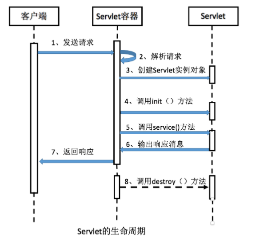
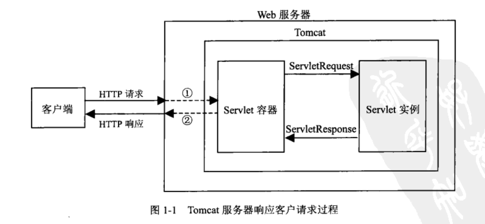

[TOC]

# 一、Servlet & JSP


JavaWeb（一）Servlet中的ServletConfig与ServletContext - 苦水润喉 - 博客园
http://www.cnblogs.com/zhangyinhua/p/7629099.html


JavaWeb（一）之细说Servlet - 苦水润喉 - 博客园
https://www.cnblogs.com/zhangyinhua/p/7625851.html

## 1. Servlet执行流程


## 2. Servlet生命周期【阿里面经OneNote】

- **void init(ServletConfig servletConfig)** ：Servlet对象创建之后马上执行的初始化方法，只执行一次；
- **void service(ServletRequest servletRequest, ServletResponse servletResponse)** ：每次处理请求都是在调用这个方法，它会被调用多次；
- **void destroy() **：在Servlet被销毁之前调用，负责释放Servlet对象占用的资源的方法；

特性：

​	单例，一个类只有一个对象，当然可能存在多个Servlet类

​	线程不安全的，所以它的效率高。

Servlet类由自己编写，但对象由服务器来创建，并由服务器来调用相应的方法　


服务器启动时(web.xml中配置load-on-startup=1，默认为0)或者第一次请求该 servlet 时，就会初始化一个 Servlet 对象，也就是会执行初始化方法 init(ServletConfig conf)

该servlet对象去处理所有客户端请求，在service(ServletRequest req，ServletResponse res)方法中执行

最后服务器关闭时，才会销毁这个servlet对象，执行destroy()方法。


<div align="center"> </div><br/>

<div align="center"> </div><br/>


**总结（面试会问）：**　　　

1）Servlet何时创建

​	默认第一次访问servlet时创建该对象（调用init()方法）

2）Servlet何时销毁

​	服务器关闭servlet就销毁了(调用destroy()方法)

3）每次访问必须执行的方法

​	public void service(ServletRequest arg0, ServletResponse arg1)


## 3. Tomcat装载Servlet的三种情况 


## 4. JavaBean


## 5. Servlet中forward和redirect有什么区别【B172】

forward内部跳转 和redirect重定向跳转（外部跳转）的区别 - 简书
https://www.jianshu.com/p/5ad843665997


## Jsp和Servlet的区别 

- Servlet是一个特殊的Java程序，它运行于服务器的JVM中，能够依靠服务器的支持向浏览器提供显示内容。JSP本质上是Servlet的一种简易形式，JSP会被服务器处理成一个类似于Servlet的Java程序，可以简化页面内容的生成。Servlet和JSP最主要的不同点在于，Servlet的应用逻辑是在Java文件中，并且完全从表示层中的HTML分离开来。而JSP的情况是Java和HTML可以组合成一个扩展名为.jsp的文件。有人说，Servlet就是在Java中写HTML，而JSP就是在HTML中写Java代码，当然这个说法是很片面且不够准确的。JSP侧重于视图，Servlet更侧重于控制逻辑，在MVC架构模式中，JSP适合充当视图（view）而Servlet适合充当控制器 

1. 保存会话状态，有哪些方式、区别如何 

   - 由于HTTP协议本身是无状态的，服务器为了区分不同的用户，就需要对用户会话进行跟踪，简单的说就是为用户进行登记，为用户分配唯一的ID，下一次用户在请求中包含此ID，服务器据此判断到底是哪一个用户。  
     - ①URL 重写：在URL中添加用户会话的信息作为请求的参数，或者将唯一的会话ID添加到URL结尾以标识一个会话。  
     - ②设置表单隐藏域：将和会话跟踪相关的字段添加到隐式表单域中，这些信息不会在浏览器中显示但是提交表单时会提交给服务器。  

   这两种方式很难处理跨越多个页面的信息传递，因为如果每次都要修改URL或在页面中添加隐式表单域来存储用户会话相关信息，事情将变得非常麻烦。  

   - ③**补充：**[HTML5](http://lib.csdn.net/base/html5)中可以使用Web Storage技术通过JavaScript来保存数据，例如可以使用localStorage和sessionStorage来保存用户会话的信息，也能够实现会话跟踪。 

 

图解JSP与Servlet的关系 - 孟祥通 - 博客园
https://www.cnblogs.com/iOS-mt/p/5619440.html


## tomcat和Servlet的联系

​	Tomcat 是Web应用服务器,是一个Servlet/JSP容器. Tomcat 作为Servlet容器,负责处理客户请求,把请求传送给Servlet,并将Servlet的响应传送回给客户.而Servlet是一种运行在支持Java语言的服务器上的组件.。

　　Servlet最常见的用途是扩展Java Web服务器功能,提供非常安全的,可移植的,易于使用的CGI替代品。

　　从http协议中的请求和响应可以得知，浏览器发出的请求是一个请求文本，而浏览器接收到的也应该是一个响应文本。

　　但是在上面这个图中，并不知道是如何转变的，只知道浏览器发送过来的请求也就是request，我们响应回去的就用response。忽略了其中的细节，现在就来探究一下。


<div align="center"> </div><br/>

​	1）Tomcat将http请求文本接收并解析，然后封装成HttpServletRequest类型的request对象，所有的HTTP头数据读可以通过request对象调用对应的方法查询到。

　　2）Tomcat同时会要响应的信息封装为HttpServletResponse类型的response对象，通过设置response属性就可以控制要输出到浏览器的内容，然后将response交给tomcat，tomcat就会将其变成响应文本的格式发送给浏览器。

　　Java Servlet API 是Servlet容器(tomcat)和servlet之间的接口，它定义了serlvet的各种方法，还定义了Servlet容器传送给Servlet的对象类，其中最重要的就是ServletRequest和ServletResponse。

　　所以说我们在编写servlet时，需要实现Servlet接口，按照其规范进行操作。


参考资料：

- [JavaWeb（一）之细说Servlet - 苦水润喉 - 博客园](http://www.cnblogs.com/zhangyinhua/p/7625851.html#_lab2_0_1)


## cookie和session的区别 

- session 在服务器端，cookie 在客户端（浏览器） 
- session 的运行依赖 session id，而 session id 是存在 cookie 中的，也就是说，如果浏览器禁用了 cookie ，同时 session 也会失效（但是可以通过其它方式实现，比如在 url 中传递 session_id） 
- session 可以放在 文件、数据库、或内存中都可以。 
- 用户验证这种场合一般会用 session 
- cookie不是很安全，别人可以分析存放在本地的COOKIE并进行COOKIE欺骗  考虑到安全应当使用session。 
- session会在一定时间内保存在服务器上。当访问增多，会比较占用你服务器的性能考虑到减轻服务器性能方面，应当使用COOKIE。 
- 单个cookie保存的数据不能超过4K，很多浏览器都限制一个站点最多保存20个cookie。 


# 二、Spring


[Spring框架]Spring IOC的原理及详解。 - 一枝花算不算浪漫 - 博客园
https://www.cnblogs.com/wang-meng/p/5597490.html


## IOC


### 依赖注入方式

- 基于`set`方法 : 实现特定属性的public set()方法,来让`IoC`容器调用注入所依赖类型的对象.（常用）

- 基于接口 : 实现特定接口以供`IoC`容器注入所依赖类型的对象.
- 基于构造函数 : 实现特定参数的构造函数,在创建对象时来让`IoC`容器注入所依赖类型的对象.
- 基于注解 : 通过`Java`的注解机制来让`IoC`容器注入所依赖类型的对象,例如`Spring`框架中的`@Autowired`.

**依赖查找 :** 它相对于`依赖注入`而言是一种更为主动的方法,它会在需要的时候通过调用框架提供的方法来获取对象,获取时需要提供相关的配置文件路径、key等信息来确定获取对象的状态.


### IOC入门案例

**第一步：导入jar包**

做spring最基本的功能时，导入核心的4个jar包 `spring-bens-4.x.x.RELEASE.jar`  、`spring-core-4.x.x.RELEASE.jar`、 `spring-context-4.x.x.RELEASE.jar`、 `spring-expression-4.x.x.RELEASE.jar`  (SpEL)
同时还需要导入支持日志输出的jar包 commons-logging-1.2.jar 和 log4j-1.2.x.jar

**第二步：创建类，在类里创建方法**

```java
public class User{
    public void add(){
        System.out.println("add()");
    }
}12345
```

**第三步：创建spring配置文件，配置创建类**

（1）Spring的核心配置文件的名称和位置是不固定的，建议放在src目录下，官方建议文件名：applicationContext.xml 
（2）引入schema约束

```xml
<?xml version="1.0"?>
<beans xmlns="http://www.springframework.org/schema/beans"
    xmlns:xsi="http://www.w3.org/2001/XMLSchema-instance"
    xsi:schemaLocation="
        http://www.springframework.org/schema/beans http://www.springframework.org/schema/beans/spring-beans.xsd">
```

(3) 配置创建类

```xml
<bean id="user" class="cn.wang.ioc.User"></bean>
```

**第四步：测试对象的创建**

```java
public class TestIoc {
    @Test
    public void testPerson() {
        // 1.加载Spring配置文件
        ApplicationContext context = new ClassPathXmlApplicationContext(
                "bean1.xml");
        // 2.得到配置文件创建的对象
        Person person = (Person) context.getBean("person");
        System.out.println(person);
    }
}
```


## AOP


1. 


## Spring的bean管理

### bean实例化的三种方式（xml）

在spring里通过配置文件创建对象

**第一种：使用类的无参构造方法创建（前提有无参构造）**

```xml
<bean id="user" class="cn.wang.ioc.User"></bean>
```


**第二种：使用静态工厂创建对象** 
（1）创建静态工厂类

```
//Person的静态工厂
public class PersonFactory {
    // 静态方法，返回Person对象
    public static Person getInstance() {
        return new Person();
    }
}1234567
```

（2）配置文件配置静态工厂

```xml
<bean id="person" class="cn.wang.property.PersonFactory" factory-method="getInstance"></bean>
```


**第三种：使用实例工厂创建对象** 
（1）创建实例工厂类

```java
//Person的实例工厂
public class PersonFactory {
    public Person getInstance() {
        return new Person();
    }
}
```

（2）配置文件配置实例工厂

```xml
<bean id="personFactory" class="cn.wang.property.PersonFactory"></bean>
<bean id="person" factory-bean="personFactory" factory-method="getInstance"></bean>
```


### bean标签常用属性

**1. id属性**

id属性址名称任意命名，id属性值不包含特殊符号 ，根据id得到配置对象

**2. class属性**

创建对象所在类的全路径

**3. name属性**

功能与id相同，但是可以包含特殊符号

**4. scope属性**

（1）singtleton:默认值，单例（多次调用返回同一对象）

```java
Person p1 = (Person) context.getBean("person");
Person p2 = (Person) context.getBean("person");
```

（2）prototype：多例，多次调用返回不同对象 
（3）request：创建对象放到request域中 
（4）session：创建对象方法哦session域中 
（5）globalSession：创建对象放到globalSession域中


## Spring IOC，AOP以及其优点 ？【蚂蚁金服面经】


## Spring中autowire和resourse关键字的区别？


参考资料：

- [第二章 IOC + AOP 底层原理 - 赵计刚 - 博客园](https://www.cnblogs.com/java-zhao/p/7039868.html)


参考学习仓库

Java-Guide/Spring学习与面试.md at master · Snailclimb/Java-Guide
https://github.com/Snailclimb/Java-Guide/blob/master/%E4%B8%BB%E6%B5%81%E6%A1%86%E6%9E%B6/Spring%E5%AD%A6%E4%B9%A0%E4%B8%8E%E9%9D%A2%E8%AF%95.md


biezhi/java-bible: 我的技术摘要
https://github.com/biezhi/java-bible


# 二、Struts2


# 三、Hibernate


