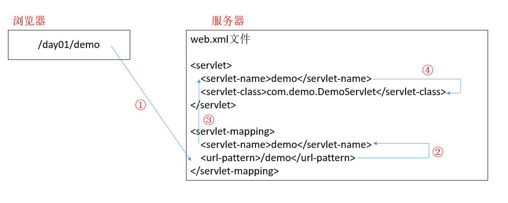
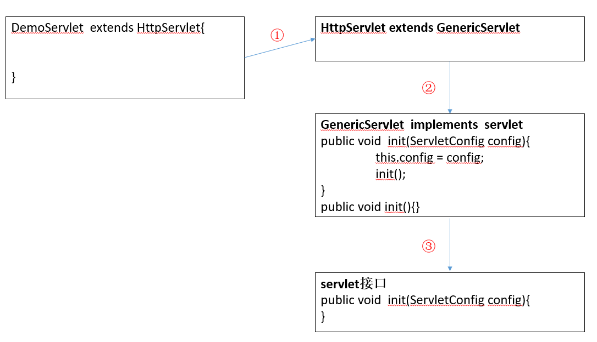
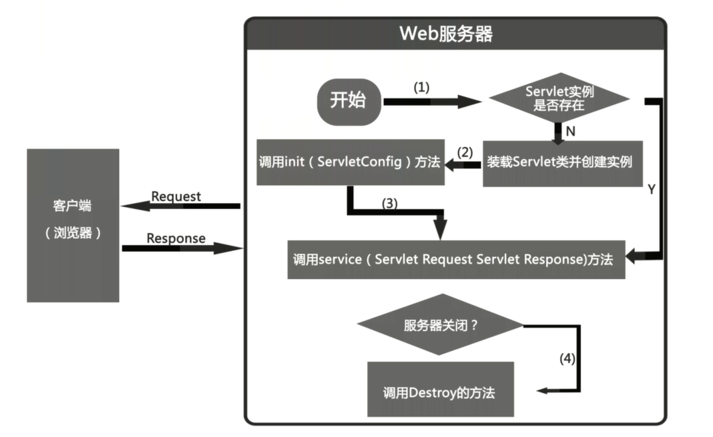
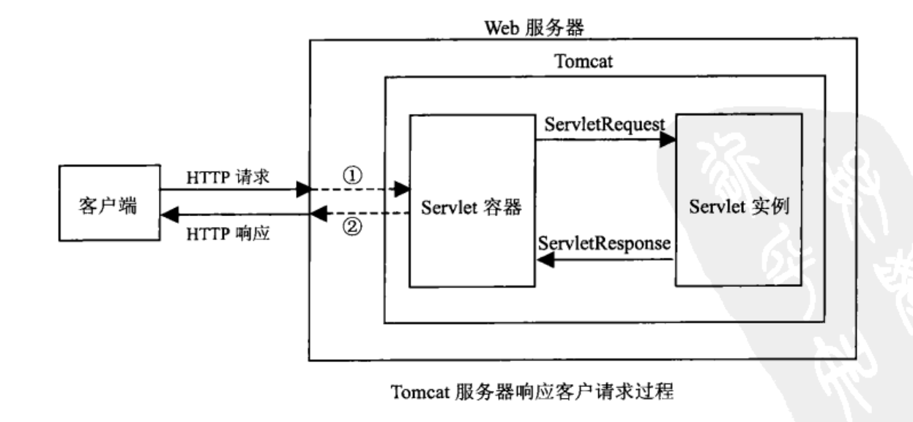

<!-- TOC -->

- [前言](#前言)
- [一、Servlet / JSP / Web](#一servlet--jsp--web)
    - [1. 什么是Servlet](#1-什么是servlet)
    - [2. Tomcat容器等级](#2-tomcat容器等级)
    - [3. Servlet执行流程](#3-servlet执行流程)
        - [浏览器请求](#浏览器请求)
        - [服务器创建对象](#服务器创建对象)
        - [调用init方法](#调用init方法)
        - [调用service方法](#调用service方法)
        - [向浏览器响应](#向浏览器响应)
    - [4. Servlet生命周期](#4-servlet生命周期)
    - [5. Tomcat装载Servlet的三种情况](#5-tomcat装载servlet的三种情况)
    - [6. forward和redirect](#6-forward和redirect)
    - [7. Jsp和Servlet的区别](#7-jsp和servlet的区别)
    - [8. tomcat和Servlet的联系](#8-tomcat和servlet的联系)
    - [9. cookie和session的区别](#9-cookie和session的区别)
    - [10. JavaEE中的三层结构和MVC](#10-javaee中的三层结构和mvc)
    - [11. RESTful 架构](#11-restful-架构)
        - [什么是REST](#什么是rest)
        - [什么是RESTful API](#什么是restful-api)
        - [RESTful 风格](#restful-风格)
- [二、Spring](#二spring)
    - [1. Spring IOC、AOP的理解、实现的原理，以及优点](#1-spring-iocaop的理解实现的原理以及优点)
        - [IOC](#ioc)
        - [AOP](#aop)
    - [2. 什么是依赖注入，注入的方式有哪些](#2-什么是依赖注入注入的方式有哪些)
    - [3. Spring IOC初始化过程](#3-spring-ioc初始化过程)
    - [4. 项目中Spring AOP用在什么地方，为什么这么用，切点，织入，通知用自己的话描述一下](#4-项目中spring-aop用在什么地方为什么这么用切点织入通知用自己的话描述一下)
    - [5. AOP动态代理2种实现原理，他们的区别是什么？](#5-aop动态代理2种实现原理他们的区别是什么)
    - [6. Struts拦截器和Spring AOP区别](#6-struts拦截器和spring-aop区别)
    - [7. Spring 是如何管理事务的，事务管理机制](#7-spring-是如何管理事务的事务管理机制)
        - [如何管理的](#如何管理的)
    - [8. Spring中bean加载机制，生命周期](#8-spring中bean加载机制生命周期)
        - [加载机制](#加载机制)
        - [生命周期](#生命周期)
    - [9. Bean实例化的三种方式](#9-bean实例化的三种方式)
    - [10. BeanFactory 和 FactoryBean的区别](#10-beanfactory-和-factorybean的区别)
    - [11. BeanFactory和ApplicationContext的区别](#11-beanfactory和applicationcontext的区别)
        - [BeanFactory](#beanfactory)
        - [两者装载bean的区别](#两者装载bean的区别)
        - [我们该用BeanFactory还是ApplicationContent](#我们该用beanfactory还是applicationcontent)
        - [ApplicationContext其他特点](#applicationcontext其他特点)
        - [spring的AOP（常用的是拦截器）](#spring的aop常用的是拦截器)
        - [spring载入多个上下文](#spring载入多个上下文)
    - [12. ApplicationContext 上下文的生命周期](#12-applicationcontext-上下文的生命周期)
    - [13. Spring中autowire和resourse关键字的区别](#13-spring中autowire和resourse关键字的区别)
    - [14. Spring的注解讲一下，介绍Spring中的熟悉的注解](#14-spring的注解讲一下介绍spring中的熟悉的注解)
        - [一： 组件类注解](#一-组件类注解)
        - [二：装配bean时常用的注解](#二装配bean时常用的注解)
    - [15. Spring 中用到了那些设计模式？](#15-spring-中用到了那些设计模式)
        - [工厂模式（Factory Method）](#工厂模式factory-method)
        - [单态模式【单例模式】（Singleton）](#单态模式单例模式singleton)
        - [适配器（Adapter）](#适配器adapter)
        - [代理（Proxy）](#代理proxy)
        - [观察者（Observer）](#观察者observer)
    - [16. Spring 的优点有哪些](#16-spring-的优点有哪些)
    - [17. IOC和AOP用到的设计模式](#17-ioc和aop用到的设计模式)
- [二、SpringMVC](#二springmvc)
    - [1. Spring MVC的工作原理](#1-spring-mvc的工作原理)
    - [2. Spring MVC注解的优点](#2-spring-mvc注解的优点)
- [三、Hibernate](#三hibernate)
    - [1. 简述Hibernate常见优化策略。](#1-简述hibernate常见优化策略)
    - [2. Hibernate一级缓存与二级缓存之间的区别](#2-hibernate一级缓存与二级缓存之间的区别)
    - [3. Hibernate的理解](#3-hibernate的理解)
- [四、MyBatis](#四mybatis)
    - [1. Mybatis原理](#1-mybatis原理)
    - [2. Hibernate了解吗，Mybatis和Hibernate的区别](#2-hibernate了解吗mybatis和hibernate的区别)
- [五、Tomcat](#五tomcat)
    - [1. tomcat加载基本流程，涉及到的参数](#1-tomcat加载基本流程涉及到的参数)
- [附录：参考资料](#附录参考资料)

<!-- /TOC -->
# 前言

在本文中将总结 Java Web 开发技术和相关框架的核心知识。因框架知识体系比较庞大，具体每个框架的使用我将放在 `../JavaWeb` 这个目录下，包含 Spring、Strust2、Hibernate、Spring Boot 等框架。


- Spring
- Strust2
- Hibernate
- Mybatis
- Spring MVC
- Spring Boot
- Dubbo


> 在面试指南中将列举面试中常见的考点，包含Servlet、JSP、Spring、中间件等常考Java Web框架知识
>


参考资料：

- [JSP-Servlet的工作流程 - wwfy - 博客园](https://www.cnblogs.com/w-wfy/p/5833103.html)


# 一、Servlet / JSP / Web

## 1. 什么是Servlet

Servlet 是在服务器上运行的小程序。一个 servlet 就是一个 Java 类，并且可以通过 “请求—响应” 编程模式来访问的这个驻留在服务器内存里的 servlet 程序。  

类的继承关系如下：

<div align="center"></div>

Servlet三种实现方式：

- 实现javax.servlet.Servlet接口

- 继承javax.servlet.GenericServlet类
- 继承javax.servlet.http.HttpServlet类

　　通常会去继承HttpServlet类来完成Servlet。


## 2. Tomcat容器等级

Tomcat的容器分为4个等级，Servlet的容器管理Context容器，一个Context对应一个Web工程。

<div align="center"></div>


## 3. Servlet执行流程

主要描述了从浏览器到服务器，再从服务器到浏览器的整个执行过程

### 浏览器请求

<div align="center"></div>

浏览器向服务器请求时，服务器不会直接执行我们的类，而是到 web.xml 里寻找路径名 
① 浏览器输入访问路径后，携带了请求行，头，体 
② 根据访问路径找到已注册的 servlet 名称
③ 根据映射找到对应的 servlet 名 
④ 根据根据 servlet 名找到我们全限定类名，既我们自己写的类

### 服务器创建对象

<div align="center"></div>

① 服务器找到全限定类名后，通过反射创建对象，同时也创建了 servletConfig，里面存放了一些初始化信息（注意服务器只会创建一次 servlet 对象，所以 servletConfig 也只有一个）


### 调用init方法

<div align="center"></div>

① 对象创建好之后，首先要执行 init 方法，但是我们发现我们自定义类下没有 init 方法，所以程序会到其父类 HttpServlet 里找 
② 我们发现 HttpServlet 里也没有 init 方法，所以继续向上找，既向其父类 GenericServlet 中继续寻找,在 GenericServlet 中我们发现了 init 方法，则执行 init 方法（对接口 Servlet 中的 init 方法进行了重写） 

注意： 在 GenericServlet 中执行 public void init(ServletConfig config) 方法的时候，又调用了自己无参无方法体的 init() 方法，其目的是为了方便开发者，如果开发者在初始化的过程中需要实现一些功能，可以重写此方法。


### 调用service方法

<div align="center"></div>

接着，服务器会先创建两个对象：ServletRequest 请求对象和 ServletResponse 响应对象，用来封装浏览器的请求数据和封装向浏览器的响应数据 
① 接着服务器会默认在我们写的类里寻找 service(ServletRequest req, ServletResponse res) 方法，但是 DemoServlet 中不存在，那么会到其父类中寻找 
② 到父类 HttpServlet 中发现有此方法，则直接调用此方法，并将之前创建好的两个对象传入 
③ 然后将传入的两个参数强转，并调用 HttpServlet 下的另外个 service 方法 
④ 接着执行 `service(HttpServletRequest req, HttpServletResponse resp) `方法，在此方法内部进行了判断请求方式，并执行doGet和doPost，但是doGet和doPost方法已经被我们自己重写了，所以会执行我们重写的方法 
看到这里，你或许有疑问：为什么我们不直接重写service方法？ 
因为如果重写service方法的话，我们需要将强转，以及一系列的安全保护判断重新写一遍，会存在安全隐患

### 向浏览器响应
<div align="center"></div>


## 4. Servlet生命周期

- `void init(ServletConfig servletConfig) `：Servlet对象创建之后马上执行的初始化方法，只执行一次；
- `void service(ServletRequest servletRequest, ServletResponse servletResponse) `：每次处理请求都是在调用这个方法，它会被调用多次；
- `void destroy() `：在Servlet被销毁之前调用，负责释放 Servlet 对象占用的资源的方法；

特性：

- 线程不安全的，所以它的效率高。
- 单例，一个类只有一个对象，当然可能存在多个 Servlet 类

Servlet 类由自己编写，但对象由服务器来创建，并由服务器来调用相应的方法　


服务器启动时 ( web.xml中配置`load-on-startup=1`，默认为0 ) 或者第一次请求该 servlet 时，就会初始化一个 Servlet 对象，也就是会执行初始化方法 init(ServletConfig conf)

该 servlet 对象去处理所有客户端请求，在 `service(ServletRequest req，ServletResponse res)` 方法中执行

最后服务器关闭时，才会销毁这个 servlet 对象，执行 destroy() 方法。

<div align="center"> </div><br/>

**总结（面试会问）：**　　　

1）Servlet何时创建

	默认第一次访问servlet时创建该对象（调用init()方法）

2）Servlet何时销毁

	服务器关闭servlet就销毁了(调用destroy()方法)

3）每次访问必须执行的方法

	public void service(ServletRequest arg0, ServletResponse arg1)


## 5. Tomcat装载Servlet的三种情况

1. Servlet容器启动时自动装载某些Servlet，实现它只需要在web.xml文件中的 `<servlet></servlet>` 之间添加以下代码：

```xml
<load-on-startup>1</load-on-startup>
```

　　其中，数字越小表示优先级越高。

　　例如：我们在 web.xml 中设置 TestServlet2 的优先级为 1，而 TestServlet1 的优先级为 2，启动和关闭Tomcat：优先级高的先启动也先关闭。　　

2. 客户端首次向某个Servlet发送请求

3. Servlet 类被修改后，Tomcat 容器会重新装载 Servlet。


## 6. forward和redirect

*本节参考：《Java程序员面试笔试宝典》P172*

　　在设计 Web 应用程序时，经常需要把一个系统进行结构化设计，即按照模块进行划分，让不同的 Servlet 来实现不同的功能，例如可以让其中一个 Servlet 接收用户的请求，另外一个 Servlet 来处理用户的请求。为了实现这种程序的模块化，就需要保证在不同的 Servlet 之间可以相互跳转，而 Servlet 中主要有两种实现跳转的方式：forward 与 redirect 方式。

　　forward 是服务器内部的重定向，服务器直接访问目标地址的 URL，把那个 URL 的响应内容读取过来，而客户端并不知道，因此在客户端浏览器的地址栏中不会显示转向后的地址，还是原来的地址。由于在整个定向的过程中用的是同一个 Request，因此 forward 会将 Request 的信息带到被定向的 JSP 或 Servlet 中使用。

　　redirect 则是客户端的重定向，是完全的跳转，即客户端浏览器会获取到跳转后的地址，然后重新发送请求，因此浏览器中会显示跳转后的地址。同事，由于这种方式比 forward 方式多了一次网络请求，因此其效率要低于 forward 方式。需要注意的是，客户端的重定向可以通过设置特定的 HTTP 头或改写 JavaScript 脚本实现。

　　下图可以更好的说明二者的区别：

<div align="center"></div>

　　鉴于以上的区别，一般当 forward 方式可以满足需求时，尽可能地使用 forward 方式。但在有些情况下，例如，需要跳转到下一个其他服务器上的资源，则必须使用 redirect 方式。

引申：filter的作用是什么？主要实现什么方法？

filter 使用户可以改变一个 request 并且修改一个 response。filter 不是一个 Servlet，它不能产生一个 response，但它能够在一个 request 到达 Servlet 之前预处理 request，也可以在离开 Servlet 时处理 response。filter 其实是一个 “Servlet Chaining” (Servler 链)。

一个 filter 的作用包括以下几个方面：

1）在 Servlet 被调用之前截获

2）在 Servlet 被调用之前检查 Servlet Request

3）根据需要修改 Request 头和 Request 数据

4）根据需要修改 Response 头和 Response 数据

5）在 Servlet 被调用之后截获


## 7. Jsp和Servlet的区别

**1、不同之处在哪？**

- Servlet 在 Java 代码中通过 HttpServletResponse 对象动态输出 HTML 内容
- JSP 在静态 HTML 内容中嵌入 Java 代码，Java 代码被动态执行后生成 HTML 内容

**2、各自的特点**

- Servlet 能够很好地组织业务逻辑代码，但是在 Java 源文件中通过字符串拼接的方式生成动态 HTML 内容会导致代码维护困难、可读性差
- JSP 虽然规避了 Servlet 在生成 HTML 内容方面的劣势，但是在 HTML 中混入大量、复杂的业务逻辑同样也是不可取的

**3、通过MVC双剑合璧**

既然 JSP 和 Servlet 都有自身的适用环境，那么能否扬长避短，让它们发挥各自的优势呢？答案是肯定的——MVC(Model-View-Controller)模式非常适合解决这一问题。

MVC模式（Model-View-Controller）是软件工程中的一种软件架构模式，把软件系统分为三个基本部分：模型（Model）、视图（View）和控制器（Controller）：

- Controller——负责转发请求，对请求进行处理
- View——负责界面显示
- Model——业务功能编写（例如算法实现）、数据库设计以及数据存取操作实现


在 JSP/Servlet 开发的软件系统中，这三个部分的描述如下所示：

<div align="center"></div><br/>

1. Web 浏览器发送 HTTP 请求到服务端，被 Controller(Servlet) 获取并进行处理（例如参数解析、请求转发）
2. Controller(Servlet) 调用核心业务逻辑——Model部分，获得结果
3. Controller(Servlet) 将逻辑处理结果交给 View（JSP），动态输出 HTML 内容
4. 动态生成的 HTML 内容返回到浏览器显示

MVC 模式在 Web 开发中的好处是非常明显，它规避了 JSP 与 Servlet 各自的短板，Servlet 只负责业务逻辑而不会通过 out.append() 动态生成 HTML 代码；JSP 中也不会充斥着大量的业务代码。这大大提高了代码的可读性和可维护性。


## 8. tomcat和Servlet的联系

　　Tomcat是Web应用服务器，是一个Servlet/JSP容器。Tomcat 作为 Servlet 容器，负责处理客户请求，把请求传送给Servlet，并将Servlet的响应传送回给客户。而 Servlet 是一种运行在支持 Java 语言的服务器上的组件。Servlet最常见的用途是扩展 Java Web 服务器功能，提供非常安全的，可移植的，易于使用的CGI替代品。

　　从 http 协议中的请求和响应可以得知，浏览器发出的请求是一个请求文本，而浏览器接收到的也应该是一个响应文本。但是在上面这个图中，并不知道是如何转变的，只知道浏览器发送过来的请求也就是 request，我们响应回去的就用 response。忽略了其中的细节，现在就来探究一下。

<div align="center"></div>

① Tomcat 将 http 请求文本接收并解析，然后封装成 HttpServletRequest 类型的 request 对象，所有的 HTTP 头数据读可以通过 request 对象调用对应的方法查询到。

② Tomcat 同时会要响应的信息封装为 HttpServletResponse 类型的 response 对象，通过设置 response 属性就可以控制要输出到浏览器的内容，然后将 response 交给 tomcat，tomcat 就会将其变成响应文本的格式发送给浏览器

Java Servlet API 是 Servlet 容器(tomcat) 和 servlet 之间的接口，它定义了 serlvet 的各种方法，还定义了 Servlet 容器传送给 Servlet 的对象类，其中最重要的就是 ServletRequest 和 ServletResponse。所以说我们在编写 servlet 时，需要实现 Servlet 接口，按照其规范进行操作。

 

## 9. cookie和session的区别

类似这种面试题，实际上都属于“开放性”问题，你扯到哪里都可以。不过如果我是面试官的话，我还是希望对方能做到一点——不要混淆 session 和 session 实现。

本来 session 是一个抽象概念，开发者为了实现中断和继续等操作，将 user agent 和 server 之间一对一的交互，抽象为“会话”，进而衍生出“会话状态”，也就是 session 的概念。

而 cookie 是一个实际存在的东西，http 协议中定义在 header 中的字段。可以认为是 session 的一种后端无状态实现。

而我们今天常说的 “session”，是为了绕开 cookie 的各种限制，通常借助 cookie 本身和后端存储实现的，一种更高级的会话状态实现。

所以 cookie 和 session，你可以认为是同一层次的概念，也可以认为是不同层次的概念。具体到实现，session 因为 session id 的存在，通常要借助 cookie 实现，但这并非必要，只能说是通用性较好的一种实现方案。


**引申**

1. 由于 HTTP 协议是无状态的协议，所以服务端需要记录用户的状态时，就需要用某种机制来识具体的用户，这个机制就是 Session。典型的场景比如购物车，当你点击下单按钮时，由于 HTTP 协议无状态，所以并不知道是哪个用户操作的，所以服务端要为特定的用户创建了特定的 Session，用用于标识这个用户，并且跟踪用户，这样才知道购物车里面有几本书。这个 Session 是保存在服务端的，有一个唯一标识。在服务端保存Session 的方法很多，内存、数据库、文件都有。集群的时候也要考虑 Session 的转移，在大型的网站，一般会有专门的 Session 服务器集群，用来保存用户会话，这个时候 Session 信息都是放在内存的，使用一些缓存服务比如 Memcached 之类的来放 Session。

2. 思考一下服务端如何识别特定的客户？

   这个时候 Cookie 就登场了。每次 HTTP 请求的时候，客户端都会发送相应的 Cookie 信息到服务端。实际上大多数的应用都是用 Cookie 来实现 Session 跟踪的，第一次创建 Session 的时候，服务端会在 HTTP 协议中告诉客户端，需要在 Cookie 里面记录一个Session ID，以后每次请求把这个会话 ID 发送到服务器，我就知道你是谁了。有人问，如果客户端的浏览器禁用了 Cookie 怎么办？一般这种情况下，会使用一种叫做URL重写的技术来进行会话跟踪，即每次 HTTP 交互，URL后面都会被附加上一个诸如 sid=xxxxx 这样的参数，服务端据此来识别用户。

3. Cookie 其实还可以用在一些方便用户的场景下，设想你某次登陆过一个网站，下次登录的时候不想再次输入账号了，怎么办？这个信息可以写到 Cookie 里面，访问网站的时候，网站页面的脚本可以读取这个信息，就自动帮你把用户名给填了，能够方便一下用户。这也是 Cookie 名称的由来，给用户的一点甜头。


所以，总结一下：

- Session 是在服务端保存的一个数据结构，用来跟踪用户的状态，这个数据可以保存在集群、数据库、文件中；
- Cookie 是客户端保存用户信息的一种机制，用来记录用户的一些信息，也是实现 Session 的一种方式。


## 10. JavaEE中的三层结构和MVC

做企业应用开发时，经常采用三层架构分层：表示层、业务层、持久层。表示层负责接收用户请求、转发请求、显示数据等；业务层负责组织业务逻辑；持久层负责持久化业务对象。

这三个分层，每一层都有不同的模式，就是架构模式。**表示层**最常用的架构模式就是MVC。

因此，MVC 是三层架构中表示层最常用的架构模式。


MVC 是**客户端**的一种设计模式，所以他天然就不考虑数据如何存储的问题。作为客户端，只需要解决用户界面、交互和业务逻辑就好了。在 MVC 模式中，View 负责的是用户界面，Controller 负责交互，Model 负责业务逻辑。至于数据如何存储和读取，当然是由 Model 调用服务端的接口来完成。

在三层架构中，并没有客户端/服务端的概念，所以表示层、业务层的任务其实和 MVC 没什么区别，而持久层在 MVC 里面是没有的。


各层次的关系：表现层的控制->服务层->数据持久化层。

<div align="center"></div>


参考资料：

- [JavaEE中的三层结构和MVC - cuiyi's blog（崔毅 crazycy） - BlogJava](http://www.blogjava.net/crazycy/archive/2006/07/03/56387.html)
- [三层构架和 MVC 不同吗？ - 知乎](https://www.zhihu.com/question/24291079)


## 11. RESTful 架构

### 什么是REST

可以总结为一句话：REST 是所有 Web 应用都应该遵守的架构设计指导原则。 
Representational State Transfer，翻译是”表现层状态转化”。 
面向资源是 REST 最明显的特征，对于同一个资源的一组不同的操作。资源是服务器上一个可命名的抽象概念，资源是以名词为核心来组织的，首先关注的是名词。REST要求，必须通过统一的接口来对资源执行各种操作。对于每个资源只能执行一组有限的操作。（7个HTTP方法：GET/POST/PUT/DELETE/PATCH/HEAD/OPTIONS）

### 什么是RESTful API

符合REST架构设计的API。

### RESTful 风格

以豆瓣网为例

1. 应该尽量将 API 部署在专用域名之下 
   `http://api.douban.com`/v2/user/1000001?apikey=XXX

2. 应该将 API 的版本号放入URL 
   `http://api.douban.com/v2`/user/1000001?apikey=XXX

3. 在 RESTful 架构中，每个网址代表一种资源（resource），所以网址中`不能有动词，只能有名词`，而且所用的`名词往往与数据库的表格名对应`。一般来说，数据库中的表都是同种记录的”集合”（collection），所以 API 中的名词也应该使用复数。 
   http://api.douban.com/v2/`book`/:id (获取图书信息) 
   http://api.douban.com/v2/`movie`/subject/:id (电影条目信息) 
   http://api.douban.com/v2/`music`/:id (获取音乐信息) 
   http://api.douban.com/v2/`event`/:id (获取同城活动)

4. 对于资源的具体操作类型，由HTTP动词表示。常用的HTTP动词有下面四个(对应`增/删/改/查`)。 
   **GET**（`select`）：从服务器取出资源（一项或多项）。 
   eg. 获取图书信息 `GET` <http://api.douban.com/v2/book/:id>\

   **POST**（`create`）：在服务器新建一个资源。 
   eg. 用户收藏某本图书 `POST` <http://api.douban.com/v2/book/:id/collection>

   **PUT**（`update`）：在服务器更新资源（客户端提供改变后的完整资源）。 
   eg. 用户修改对某本图书的收藏 `PUT` <http://api.douban.com/v2/book/:id/collection>

   **DELETE**（`delete`）：从服务器删除资源。 
   eg. 用户删除某篇笔记 `DELETE` <http://api.douban.com/v2/book/annotation/:id>

5. 如果记录数量很多，服务器不可能都将它们返回给用户。API应该提供参数，过滤返回结果

   ?limit=10：指定返回记录的数量
   eg. 获取图书信息 `GET` <http://api.douban.com/v2/book/:id>`?limit=10`

6. 服务器向用户返回的状态码和提示信息 
   每个状态码代表不同意思, 就像代号一样

   2系 代表正常返回

   4系 代表数据异常 

   5系 代表服务器异常


# 二、Spring

## 1. Spring IOC、AOP的理解、实现的原理，以及优点 

Spring的IoC容器是Spring的核心，Spring AOP是spring框架的重要组成部分

### IOC

- **我的理解**
  - 正常的情况下，比如有一个类，在类里面有方法（不是静态的方法），调用类里面的方法，创建类的对象，使用对象调用方法，创建类对象的过程，需要new出来对象
  - 通过控制反转，把对象的创建不是通过new方式实现，而是交给Spring配置创建类对象
  - IOC的意思是控件反转也就是由容器控制程序之间的关系，这也是spring的优点所在，把控件权交给了外部容器，之前的写法，由程序代码直接操控，而现在控制权由应用代码中转到了外部容器，控制权的转移是所谓反转。换句话说之前用new的方式获取对象，现在由spring给你至于怎么给你就是di了。


- **Spring IOC实现原理** 
  - 创建xml配置文件，配置要创建的对象类
  - 通过反射创建实例； 
  - 获取需要注入的接口实现类并将其赋值给该接口。 

- **优点**

  - 解耦合，开发更方便组织分工
  - 高层不依赖于底层（依赖倒置）
  - 是应用更容易测试
  - 因为把对象生成放在了XML里定义，所以当我们需要换一个实现子类将会变成很简单（一般这样的对象都是现实于某种接口的），只要修改XML就可以了，这样我们甚至可以实现对象的热插拨


### AOP

- **我的理解**

  - AOP（Aspect Oriented Programming ）称为面向切面编程，扩展功能不是修改源代码实现，在程序开发中主要用来解决一些系统层面上的问题，比如日志，事务，权限等待，Struts2的拦截器设计就是基于AOP的思想，是个比较经典的例子。
  - 面向切面编程（aop）是对面向对象编程（oop）的补充 
  - 面向切面编程提供声明式事务管理
  - AOP就是典型的代理模式的体现

- **Spring AOP实现原理** 

  - 动态代理（利用**反射和动态编译**将代理模式变成动态的） 

  - JDK的动态代理

    - JDK内置的Proxy动态代理可以在运行时动态生成字节码，而没必要针对每个类编写代理类
    - JDKProxy返回动态代理类，是目标类所实现接口的另一个实现版本，它实现了对目标类的代理（如同UserDAOProxy与UserDAOImp的关系） 

  - cglib动态代理 

    - CGLibProxy返回的动态代理类，则是目标代理类的一个子类（代理类扩展了UserDaoImpl类） 
    - cglib继承被代理的类，重写方法，织入通知，动态生成字节码并运行

- **优点**

  - 各个步骤之间的良好隔离性 
  - 源代码无关性
  - 松耦合
  - 易扩展
  - 代码复用


## 2. 什么是依赖注入，注入的方式有哪些

- DI（依赖注入）

  - 所谓依赖注入，就是把底层类作为参数传入上层类，实现上层类对下层类的控制。DI依赖注入，向类里面属性注入值 ，依赖注入不能单独存在，需要在IOC基础上完成操作。

- - 使用set方法注入 
  - 使用有参构造注入 
  - 使用接口注入
  - 注解注入(@Autowire) 


## 3. Spring IOC初始化过程

 <div align="center"> </div><br/>

 IOC容器的初始化分为三个过程实现：

- 第一个过程是Resource资源定位。这个Resouce指的是BeanDefinition的资源定位。这个过程就是容器找数据的过程，就像水桶装水需要先找到水一样。
- 第二个过程是BeanDefinition的载入过程。这个载入过程是把用户定义好的Bean表示成Ioc容器内部的数据结构，而这个容器内部的数据结构就是BeanDefition。
- 第三个过程是向IOC容器注册这些BeanDefinition的过程，这个过程就是将前面的BeanDefition保存到HashMap中的过程。


更详细说明请阅读：[2 IOC容器初始化过程 - CSDN博客](https://blog.csdn.net/u010723709/article/details/47046211)


 参考资料：

- [Spring IOC容器的初始化过程 - 掘金](https://juejin.im/post/5af8f8066fb9a07ac85a853e)
- [Spring IOC核心源码学习 | Yikun](https://yikun.github.io/2015/05/29/Spring-IOC%E6%A0%B8%E5%BF%83%E6%BA%90%E7%A0%81%E5%AD%A6%E4%B9%A0/)


## 4. 项目中Spring AOP用在什么地方，为什么这么用，切点，织入，通知用自己的话描述一下

- **Joinpoint（连接点）（重要）**
  - 类里面可以被增强的方法，这些方法称为连接点
- **Pointcut（切入点）（重要）**
  - 所谓切入点是指我们要对哪些Joinpoint进行拦截的定义
- **Advice（通知/增强）（重要）**
  - 所谓通知是指拦截到Joinpoint之后所要做的事情就是通知.通知分为前置通知，后置通知，异常通知，最终通知，环绕通知（切面要完成的功能）
- **Aspect（切面）**：
  - 是切入点和通知（引介）的结合
- **Introduction（引介）**
  - 引介是一种特殊的通知在不修改类代码的前提下， Introduction可以在运行期为类动态地添加一些方法或Field.
- **Target（目标对象）**
  - 代理的目标对象（要增强的类）
- **Weaving（织入）**
  - 是把增强应用到目标的过程，把advice 应用到 target的过程
- **Proxy（代理）**
  - 一个类被AOP织入增强后，就产生一个结果代理类

AOP（Aspect Oriented Programming ）称为面向切面编程，扩展功能不是修改源代码实现，在程序开发中主要用来解决一些系统层面上的问题，比如日志，事务，权限等待，Struts2的拦截器设计就是基于AOP的思想，是个比较经典的例子。


## 5. AOP动态代理2种实现原理，他们的区别是什么？

- 动态代理与cglib实现的区别
  - JDK动态代理只能对实现了接口的类生成代理，而不能针对类. 
  - cglib是针对类实现代理，主要是对指定的类生成一个子类，覆盖其中的方法因为是继承，所以该类或方法最好不要声明成final。 
  - JDK代理是不需要以来第三方的库，只要JDK环境就可以进行代理 
  - cglib必须依赖于cglib的类库，但是它需要类来实现任何接口代理的是指定的类生成一个子类，覆盖其中的方法，是一种继承 

 


## 6. Struts拦截器和Spring AOP区别


Struts2拦截器浅析-慕课网
https://www.imooc.com/learn/450


## 7. Spring 是如何管理事务的，事务管理机制

事务管理可以帮助我们保证数据的一致性，对应企业的实际应用很重要。

Spring的事务机制包括声明式事务和编程式事务。

- **编程式事务管理**：Spring推荐使用TransactionTemplate，实际开发中使用声明式事务较多。
- **声明式事务管理**：将我们从复杂的事务处理中解脱出来，获取连接，关闭连接、事务提交、回滚、异常处理等这些操作都不用我们处理了，Spring都会帮我们处理。

**声明式事务管理使用了AOP面向切面编程实现的，本质就是在目标方法执行前后进行拦截。在目标方法执行前加入或创建一个事务，在执行方法执行后，根据实际情况选择提交或是回滚事务**。

### 如何管理的

Spring事务管理主要包括3个接口，Spring的事务主要是由它们(**PlatformTransactionManager，TransactionDefinition，TransactionStatus**)三个共同完成的。

**1. PlatformTransactionManager**：事务管理器–主要用于平台相关事务的管理

主要有三个方法：

- commit 事务提交；
- rollback 事务回滚；
- getTransaction 获取事务状态。

**2. TransactionDefinition**：事务定义信息–用来定义事务相关的属性，给事务管理器PlatformTransactionManager使用

这个接口有下面四个主要方法：

- getIsolationLevel：获取隔离级别；
- getPropagationBehavior：获取传播行为；
- getTimeout：获取超时时间；
- isReadOnly：是否只读（保存、更新、删除时属性变为false–可读写，查询时为true–只读）

事务管理器能够根据这个返回值进行优化，这些事务的配置信息，都可以通过配置文件进行配置。

**3. TransactionStatus**：事务具体运行状态–事务管理过程中，每个时间点事务的状态信息。

例如它的几个方法：

- hasSavepoint()：返回这个事务内部是否包含一个保存点，
- isCompleted()：返回该事务是否已完成，也就是说，是否已经提交或回滚
- isNewTransaction()：判断当前事务是否是一个新事务

**声明式事务的优缺点**：

- **优点**：不需要在业务逻辑代码中编写事务相关代码，只需要在配置文件配置或使用注解（@Transaction），这种方式没有侵入性。
- **缺点**：声明式事务的最细粒度作用于方法上，如果像代码块也有事务需求，只能变通下，将代码块变为方法。

<http://blog.csdn.net/jie_liang/article/details/77600742>


## 8. Spring中bean加载机制，生命周期

### 加载机制

【Spring】详解Spring中Bean的加载 - weknow619 - 博客园
https://www.cnblogs.com/weknow619/p/6673667.html

### 生命周期

在传统的Java应用中，bean的生命周期很简单。使用Java关键字new进行bean实例化，然后该bean就可以使用了。一旦该bean不再被使用，则由Java自动进行垃圾回收。

相比之下，Spring容器中的bean的生命周期就显得相对复杂多了。正确理解Spring bean的生命周期非常重要，因为你或许要利用Spring提供的扩展点来自定义bean的创建过程。下图展示了bean装载到Spring应用上下文中的一个典型的生命周期过程。 

<div align="center"> </div><br/>

上图bean在Spring容器中从创建到销毁经历了若干阶段，每一阶段都可以针对Spring如何管理bean进行个性化定制

**正如你所见，在bean准备就绪之前，bean工厂执行了若干启动步骤。我们对上图进行详细描述：**

1. Spring 对 Bean 进行实例化；
   - 相当于程序中的new Xx()
2. Spring 将值和 Bean 的引用注入进 Bean 对应的属性中；
3. **如果Bean实现了 BeanNameAware 接口**，Spring 将 Bean 的 ID 传递给setBeanName()方法
   - 实现BeanNameAware清主要是为了通过Bean的引用来获得Bean的ID，一般业务中是很少有在Bean的ID的

1. **如果Bean实现了BeanFactoryAware接口**，Spring将调用setBeanDactory(BeanFactory bf)方法并把BeanFactory容器实例作为参数传入。
   - 实现BeanFactoryAware 主要目的是为了获取Spring容器，如Bean通过Spring容器发布事件等

1. **如果Bean实现了ApplicationContextAwaer接口**，Spring容器将调用setApplicationContext(ApplicationContext ctx)方法，将bean所在的应用上下文的引用传入进来
   - 作用与BeanFactory类似都是为了获取Spring容器，不同的是Spring容器在调用setApplicationContext方法时会把它自己作为setApplicationContext 的参数传入，而Spring容器在调用setBeanDactory前需要程序员自己指定（注入）setBeanDactory里的参数BeanFactory

1. **如果Bean实现了BeanPostProcess接口**，Spring将调用它们的postProcessBeforeInitialization（预初始化）方法
   - 作用是在Bean实例创建成功后对进行增强处理，如对Bean进行修改，增加某个功能
2. **如果Bean实现了InitializingBean接口**，Spring将调用它们的afterPropertiesSet方法，作用与在配置文件中对Bean使用init-method声明初始化的作用一样，都是在Bean的全部属性设置成功后执行的初始化方法。
3. **如果Bean实现了BeanPostProcess接口**，Spring将调用它们的postProcessAfterInitialization（后初始化）方法
   - 作用与6的一样，只不过6是在Bean初始化前执行的，而这个是在Bean初始化后执行的，时机不同

1. 经过以上的工作后，Bean将一直驻留在应用上下文中给应用使用，直到应用上下文被销毁
2. **如果Bean实现了DispostbleBean接口**，Spring将调用它的destory方法，作用与在配置文件中对Bean使用destory-method属性的作用一样，都是在Bean实例销毁前执行的方法。


## 9. Bean实例化的三种方式

- 使用类的无参构造创建（此种方式用的最多）
- 使用静态工厂创建对象
- 使用实例工厂创建对象


## 10. BeanFactory 和 FactoryBean的区别

- **BeanFactory**是个Factory，也就是IOC容器或对象工厂，在Spring中，所有的Bean都是由BeanFactory(也就是IOC容器)来进行管理的，提供了实例化对象和拿对象的功能。
- **FactoryBean**是个Bean，这个Bean不是简单的Bean，而是一个能生产或者修饰对象生成的工厂Bean,它的实现与设计模式中的工厂模式和修饰器模式类似。


## 11. BeanFactory和ApplicationContext的区别

### BeanFactory

是Spring里面最低层的接口，提供了最简单的容器的功能，只提供了实例化对象和拿对象的功能。

### 两者装载bean的区别

- **BeanFactory**：在启动的时候不会去实例化Bean，中有从容器中拿Bean的时候才会去实例化；
- **ApplicationContext**：在启动的时候就把所有的Bean全部实例化了。它还可以为Bean配置lazy-init=true来让Bean延迟实例化；

### 我们该用BeanFactory还是ApplicationContent

**BeanFactory** 延迟实例化的优点：

应用启动的时候占用资源很少，对资源要求较高的应用，比较有优势；

缺点：速度会相对来说慢一些。而且有可能会出现空指针异常的错误，而且通过bean工厂创建的bean生命周期会简单一些

**ApplicationContext** 不延迟实例化的优点：

- 所有的Bean在启动的时候都加载，系统运行的速度快；
- 在启动的时候所有的Bean都加载了，我们就能在系统启动的时候，尽早的发现系统中的配置问题
- 建议web应用，在启动的时候就把所有的Bean都加载了。

缺点：把费时的操作放到系统启动中完成，所有的对象都可以预加载，缺点就是消耗服务器的内存

### ApplicationContext其他特点

除了提供BeanFactory所支持的所有功能外，ApplicationContext还有额外的功能

- 默认初始化所有的Singleton，也可以通过配置取消预初始化。
- 继承MessageSource，因此支持国际化。
- 资源访问，比如访问URL和文件（ResourceLoader）；
- 事件机制，（有继承关系）上下文 ，使得每一个上下文都专注于一个特定的层次，比如应用的web层；
- 同时加载多个配置文件。
- 消息发送、响应机制（ApplicationEventPublisher）；
- 以声明式方式启动并创建Spring容器。

由于ApplicationContext会预先初始化所有的Singleton Bean，于是在系统创建前期会有较大的系统开销，但一旦ApplicationContext初始化完成，程序后面获取Singleton Bean实例时候将有较好的性能。

也可以为bean设置lazy-init属性为true，即Spring容器将不会预先初始化该bean。

### spring的AOP（常用的是拦截器）

一般拦截器都是实现HandlerInterceptor，其中有三个方法preHandle、postHandle、afterCompletion

1. preHandle：执行controller之前执行
2. postHandle：执行完controller，return modelAndView之前执行，主要操作modelAndView的值
3. afterCompletion：controller返回后执行

### spring载入多个上下文

不同项目使用不同分模块策略，spring配置文件分为

- applicationContext.xml(主文件，包括JDBC配置，hibernate.cfg.xml，与所有的Service与DAO基类)
- applicationContext-cache.xml(cache策略，包括hibernate的配置)
- applicationContext-jmx.xml(JMX，调试hibernate的cache性能)
- applicationContext-security.xml(acegi安全)
- applicationContext-transaction.xml(事务)
- moduleName-Service.xml
- moduleName-dao.xml


## 12. ApplicationContext 上下文的生命周期

PS：可以借鉴Servlet的生命周期，实例化、初始init、接收请求service、销毁destroy;

Spring上下文中的Bean也类似，【Spring上下文的生命周期】

1. 实例化一个Bean，也就是我们通常说的new；
2. 按照Spring上下文对实例化的Bean进行配置，也就是IOC注入
3. 如果这个Bean实现了BeanNameAware接口，会调用它实现的setBeanName(String beanId)方法，此处传递的是Spring配置文件中Bean的ID；
4. 如果这个Bean实现了BeanFactoryAware接口，会调用它实现的setBeanFactory()，传递的是Spring工厂本身（可以用这个方法获取到其他Bean）；
5. 如果这个Bean实现了ApplicationContextAware接口，会调用setApplicationContext(ApplicationContext)方法，传入Spring上下文，该方式同样可以实现步骤4，但比4更好，以为ApplicationContext是BeanFactory的子接口，有更多的实现方法；
6. 如果这个Bean关联了BeanPostProcessor接口，将会调用postProcessBeforeInitialization(Object obj, String s)方法，BeanPostProcessor经常被用作是Bean内容的更改，并且由于这个是在Bean初始化结束时调用After方法，也可用于内存或缓存技术；
7. 如果这个Bean在Spring配置文件中配置了init-method属性会自动调用其配置的初始化方法；
8. 如果这个Bean关联了BeanPostProcessor接口，将会调用postAfterInitialization(Object obj, String s)方法；

注意：以上工作完成以后就可以用这个Bean了，那这个Bean是一个single的，所以一般情况下我们调用同一个ID的Bean会是在内容地址相同的实例

1. 当Bean不再需要时，会经过清理阶段，如果Bean实现了DisposableBean接口，会调用其实现的destroy方法
2. 最后，如果这个Bean的Spring配置中配置了destroy-method属性，会自动调用其配置的销毁方法

以上10步骤可以作为面试或者笔试的模板，另外这里描述的是应用Spring上下文Bean的生命周期，如果应用Spring的工厂也就是BeanFactory的话去掉第5步就Ok了；


## 13. Spring中autowire和resourse关键字的区别

@Resource和@Autowired都是做bean的注入时使用，其实@Resource并不是Spring的注解，它的包是javax.annotation.Resource，需要导入，但是Spring支持该注解的注入。 

1、共同点

两者都可以写在字段和setter方法上。两者如果都写在字段上，那么就不需要再写setter方法。

2、不同点

**（1）@Autowired**

@Autowired为Spring提供的注解，需要导入包org.springframework.beans.factory.annotation.Autowired;只按照byType注入。

```java
public class TestServiceImpl {
    // 下面两种@Autowired只要使用一种即可
    @Autowired
    private UserDao userDao; // 用于字段上
    
    @Autowired
    public void setUserDao(UserDao userDao) { // 用于属性的方法上
        this.userDao = userDao;
    }
}
```

@Autowired注解是按照类型（byType）装配依赖对象，默认情况下它要求依赖对象必须存在，如果允许null值，可以设置它的required属性为false。如果我们想使用按照名称（byName）来装配，可以结合@Qualifier注解一起使用。如下：

```java
public class TestServiceImpl {
    @Autowired
    @Qualifier("userDao")
    private UserDao userDao; 
}
```


**（2）@Resource**

@Resource默认按照ByName自动注入，由J2EE提供，需要导入包javax.annotation.Resource。@Resource有两个重要的属性：name和type，而Spring将@Resource注解的name属性解析为bean的名字，而type属性则解析为bean的类型。所以，如果使用name属性，则使用byName的自动注入策略，而使用type属性时则使用byType自动注入策略。如果既不制定name也不制定type属性，这时将通过反射机制使用byName自动注入策略。

```javascript
public class TestServiceImpl {
    // 下面两种@Resource只要使用一种即可
    @Resource(name="userDao")
    private UserDao userDao; // 用于字段上
    
    @Resource(name="userDao")
    public void setUserDao(UserDao userDao) { // 用于属性的setter方法上
        this.userDao = userDao;
    }
}
```

注：最好是将@Resource放在setter方法上，因为这样更符合面向对象的思想，通过set、get去操作属性，而不是直接去操作属性。

@Resource装配顺序：

1. 如果同时指定了name和type，则从Spring上下文中找到唯一匹配的bean进行装配，找不到则抛出异常。

2. 如果指定了name，则从上下文中查找名称（id）匹配的bean进行装配，找不到则抛出异常。

3. 如果指定了type，则从上下文中找到类似匹配的唯一bean进行装配，找不到或是找到多个，都会抛出异常。
4. 如果既没有指定name，又没有指定type，则自动按照byName方式进行装配；如果没有匹配，则回退为一个原始类型进行匹配，如果匹配则自动装配。

@Resource的作用相当于@Autowired，只不过@Autowired按照byType自动注入。


## 14. Spring的注解讲一下，介绍Spring中的熟悉的注解

> 思考：spring怎么知道应该哪些Java类当初bean类处理？ 
>
> 答案：使用配置文件或者注解的方式进行标识需要处理的java类! 

### 一： 组件类注解

@Component ：标准一个普通的spring Bean类。 
@Repository：标注一个DAO组件类。 
@Service：标注一个业务逻辑组件类。 
@Controller：标注一个控制器组件类。 

这些都是注解在平时的开发过程中出镜率极高，@Component、@Repository、@Service、@Controller实质上属于同一类注解，用法相同，功能相同，区别在于标识组件的类型。@Component可以代替@Repository、@Service、@Controller，因为这三个注解是被@Component标注的。如下代码

```java
@Target({ElementType.TYPE})
@Retention(RetentionPolicy.RUNTIME)
@Documented
@Component
public @interface Controller {
    String value() default "";
}
```

举例：

（1）当一个组件代表数据访问层（DAO）的时候，我们使用@Repository进行注解，如下

```java
@Repository
public class HappyDaoImpl implements HappyDao{
private final static Logger LOGGER = LoggerFactory.getLogger(HappyDaoImpl .class);
public void  club(){
        //do something ,like drinking and singing
    }
}1234567
```

（2）当一个组件代表业务层时，我们使用@Service进行注解，如下

```java
@Service(value="goodClubService")
//使用@Service注解不加value ,默认名称是clubService
public class ClubServiceImpl implements ClubService {
    @Autowired
    private ClubDao clubDao;

    public void doHappy(){
        //do some Happy
    }
 }12345678910
```

（3）当一个组件作为前端交互的控制层，使用@Controller进行注解，如下

```java
@Controller
public class HappyController {
    @Autowired //下面进行讲解
    private ClubService clubService;

    // Control the people entering the Club
    // do something
}
/*Controller相关的注解下面进行详细讲解，这里简单引入@Controller*/
```

**3、总结注意点**

1. 被注解的java类当做Bean实例，Bean实例的名称默认是Bean类的首字母小写，其他部分不变。@Service也可以自定义Bean名称，但是必须是唯一的！ 
2. 尽量使用对应组件注解的类替换@Component注解，在spring未来的版本中，@Controller，@Service，@Repository会携带更多语义。并且便于开发和维护！ 
3. 指定了某些类可作为Spring Bean类使用后，最好还需要让spring搜索指定路径，在Spring配置文件加入如下配置： 

```xml
<!-- 自动扫描指定包及其子包下的所有Bean类 -->
<context:component-scan base-package="org.springframework.*"/>
```


### 二：装配bean时常用的注解

@Autowired：属于Spring 的org.springframework.beans.factory.annotation包下,可用于为类的属性、构造器、方法进行注值 
@Resource：不属于spring的注解，而是来自于JSR-250位于java.annotation包下，使用该annotation为目标bean指定协作者Bean。 

...


更详细请转向：[Spring常用注解介绍【经典总结】 - CSDN博客](https://blog.csdn.net/u010648555/article/details/76299467)


## 15. Spring 中用到了那些设计模式？

Spring框架中使用到了大量的设计模式，下面列举了比较有代表性的：

- 代理模式—在AOP和remoting中被用的比较多。
- 单例模式—在spring配置文件中定义的bean默认为单例模式。
- 模板方法—用来解决代码重复的问题。比如. RestTemplate, JmsTemplate, JpaTemplate。
- 工厂模式—BeanFactory用来创建对象的实例。
- 适配器–spring aop
- 装饰器–spring data hashmapper
- 观察者– spring 时间驱动模型
- 回调–Spring ResourceLoaderAware回调接口

### 工厂模式（Factory Method）

Spring容器就是实例化和管理Bean的工厂

工厂模式隐藏了创建类的细节，返回值必定是接口或者抽象类,而不是具体的某个对象，工厂类根据条件生成不同的子类实例。当得到子类的实例后，就可以调用基类中的方法，不必考虑返回的是哪一个子类的实例。

这个很明显，在各种BeanFactory以及ApplicationContext创建中都用到了；

**Spring通过配置文件，就可以管理所有的bean，而这些bean就是Spring工厂能产生的实例，因此，首先我们在Spring配置文件中对两个实例进行配置**。

### 单态模式【单例模式】（Singleton）

**Spring默认将所有的Bean设置成 单例模式，即对所有的相同id的Bean的请求，都将返回同一个共享的Bean实例。这样就可以大大降低Java创建对象和销毁时的系统开销**。

使用Spring将Bean设置称为单例行为，则无需自己完成单例模式。

| 可以通过singleton=“true | false” 或者 scope=“？”来指定 |


### 适配器（Adapter）

**在Spring的Aop中，使用的Advice（通知）来增强被代理类的功能。Spring实现这一AOP功能的原理就使用代理模式（1、JDK动态代理。2、CGLib字节码生成技术代理。）对类进行方法级别的切面增强，即，生成被代理类的代理类， 并在代理类的方法前，设置拦截器，通过执行拦截器重的内容增强了代理方法的功能，实现的面向切面编程**。

### 代理（Proxy）

Spring实现了一种能够通过额外的方法调用完成任务的设计模式 - 代理设计模式,比如JdkDynamicAopProxy和Cglib2AopProxy。

代理设计模式的一个很好的例子是**org.springframework.aop.framework.ProxyFactoryBean**。**该工厂根据Spring bean构建AOP代理。该类实现了定义getObject()方法的FactoryBean接口。此方法用于将需求Bean的实例返回给bean factory**。在这种情况下，它不是返回的实例，而是AOP代理。在执行代理对象的方法之前，可以通过调用补充方法来进一步“修饰”代理对象(其实所谓的静态代理不过是在装饰模式上加了个要不要你来干动作行为而已，而不是装饰模式什么也不做就加了件衣服，其他还得由你来全权完成)。

### 观察者（Observer）

定义对象间的一种一对多的依赖关系，当一个对象的状态发生改变时，所有依赖于它的对象都得到通知并被自动更新。**spring中Observer模式常用的地方是listener的实现。如ApplicationListener**。


补充面试题：Spring里面的工厂模式和代理模式，IO中的装饰者模式，挑几个最熟的能讲讲思路和伪代码实现？


## 16. Spring 的优点有哪些

1. 降低了组件之间的耦合性 ，实现了软件各层之间的解耦 
2. 可以使用容易提供的众多服务，如事务管理，消息服务等 
3. 容器提供单例模式支持 
4. 容器提供了AOP技术，利用它很容易实现如权限拦截，运行期监控等功能 
5. 容器提供了众多的辅助类，能加快应用的开发 
6. spring对于主流的应用框架提供了集成支持，如hibernate，JPA，Struts等 
7. spring属于低侵入式设计，代码的污染极低 
8. 独立于各种应用服务器 
9. spring的DI机制降低了业务对象替换的复杂性 
10. Spring的高度开放性，并不强制应用完全依赖于Spring，开发者可以自由选择spring的部分或全部 


## 17. IOC和AOP用到的设计模式

用过spring的朋友都知道spring的强大和高深，都觉得深不可测，其实当你真正花些时间读一读源码就知道它的一些技术实现其实是建立在一些最基本的技术之上而已；例如AOP(面向方面编程)的实现是建立在CGLib提供的类代理和jdk提供的接口代理，IOC(控制反转)的实现建立在工厂模式、Java反射机制和jdk的操作XML的DOM解析方式.


# 二、SpringMVC

## 1. Spring MVC的工作原理

Spring MVC 的工作原理如下图：  


  

- ① 客户端的所有请求都交给前端控制器DispatcherServlet来处理，它会负责调用系统的其他模块来真正处理用户的请求。  
- ② DispatcherServlet收到请求后，将根据请求的信息（包括URL、HTTP协议方法、请求头、请求参数、Cookie等）以及HandlerMapping的配置找到处理该请求的Handler（任何一个对象都可以作为请求的Handler）。  
- ③ 在这个地方Spring会通过HandlerAdapter对该处理进行封装。  
- ④ HandlerAdapter是一个适配器，它用统一的接口对各种Handler中的方法进行调用。  
- ⑤ Handler完成对用户请求的处理后，会返回一个ModelAndView对象给DispatcherServlet，ModelAndView顾名思义，包含了数据模型以及相应的视图的信息。  
- ⑥ ModelAndView的视图是逻辑视图，DispatcherServlet还要借助ViewResolver完成从逻辑视图到真实视图对象的解析工作。  
- ⑦ 当得到真正的视图对象后，DispatcherServlet会利用视图对象对模型数据进行渲染。  
- ⑧ 客户端得到响应，可能是一个普通的HTML页面，也可以是XML或JSON字符串，还可以是一张图片或者一个PDF文件。 


**组件及其作用**

1. 前端控制器 (DispatcherServlet)

   接收请求，响应结果，相当于转发器，中央处理器。负责调用系统的其他模块来真正处理用户的请求。 

   有了DispatcherServlet减少了其他组件之间的耦合度

2. 处理器映射器 (HandlerMapping)

   作用：根据请求的 url 查找 Handler

3. **处理器 (Handler)**

   注意：编写 Handler 时按照 HandlerAdapter 的要求去做，这样适配器才可以去正确执行 Handler

4. 处理器适配器 (HandlerAdapter)

   作用：按照特定规则（HandlerAdapter要求的规则）执行Handler。

5. 视图解析器 (ViewResolver)

   作用：进行视图解析，根据逻辑视图解析成真正的视图 (View)

6. **视图 (View)**

   View 是一个接口实现类支持不同的 View 类型（jsp,pdf等等）

注意：只需要程序员开发，处理器和视图。


## 2. Spring MVC注解的优点


# 三、Hibernate

## 1. 简述Hibernate常见优化策略。

- 制定合理的缓存策略（二级缓存、查询缓存）。  
- 采用合理的Session管理机制。  
- 尽量使用延迟加载特性。  
- 设定合理的批处理参数。  
- 如果可以，选用UUID作为主键生成器。  
- 如果可以，选用基于版本号的乐观锁替代悲观锁。  
- 在开发过程中, 开启hibernate.show_sql选项查看生成的SQL，从而了解底层的状况；开发完成后关闭此选项。  
- 考虑数据库本身的优化，合理的索引、恰当的数据分区策略等都会对持久层的性能带来可观的提升，但这些需要专业的DBA（数据库管理员）提供支持。 


## 2. Hibernate一级缓存与二级缓存之间的区别

- Hibernate的Session提供了一级缓存的功能，默认总是有效的，当应用程序保存持久化实体、修改持久化实体时，Session并不会立即把这种改变提交到数据库，而是缓存在当前的Session中，除非显示调用了Session的flush()方法或通过close()方法关闭Session。通过一级缓存，可以减少程序与数据库的交互，从而提高数据库访问性能。  
- SessionFactory级别的二级缓存是全局性的，所有的Session可以共享这个二级缓存。不过二级缓存默认是关闭的，需要显示开启并指定需要使用哪种二级缓存实现类（可以使用第三方提供的实现）。一旦开启了二级缓存并设置了需要使用二级缓存的实体类，SessionFactory就会缓存访问过的该实体类的每个对象，除非缓存的数据超出了指定的缓存空间。  
- 一级缓存和二级缓存都是对整个实体进行缓存，不会缓存普通属性，如果希望对普通属性进行缓存，可以使用查询缓存。查询缓存是将HQL或SQL语句以及它们的查询结果作为键值对进行缓存，对于同样的查询可以直接从缓存中获取数据。查询缓存默认也是关闭的，需要显示开启。 


## 3. Hibernate的理解


# 四、MyBatis

## 1. Mybatis原理

## 2. Hibernate了解吗，Mybatis和Hibernate的区别


# 五、Tomcat

## 1. tomcat加载基本流程，涉及到的参数


# 附录：参考资料


参考资料：

- [Java-Guide/Spring学习与面试.md at master · Snailclimb/Java-Guide](https://github.com/Snailclimb/Java-Guide/blob/master/%E4%B8%BB%E6%B5%81%E6%A1%86%E6%9E%B6/Spring%E5%AD%A6%E4%B9%A0%E4%B8%8E%E9%9D%A2%E8%AF%95.md)
- [biezhi/java-bible: 我的技术摘要](https://github.com/biezhi/java-bible)
- [Spring 常见的一些面试题整理 搜云库](https://www.souyunku.com/2018/03/21/spring/)

参考面经：

- [阿里Java研发工程师实习面经_笔经面经_牛客网](https://www.nowcoder.com/discuss/72899?type=2&order=3&pos=509&page=1)

- [网易面经（Java开发岗） - Andya - 博客园](https://www.cnblogs.com/Andya/p/7456511.html )


