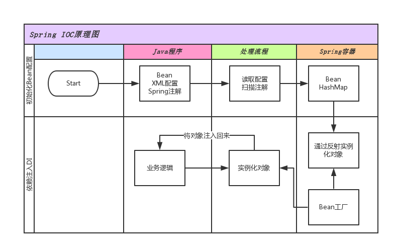
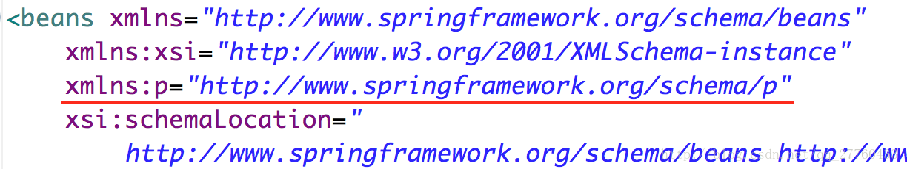
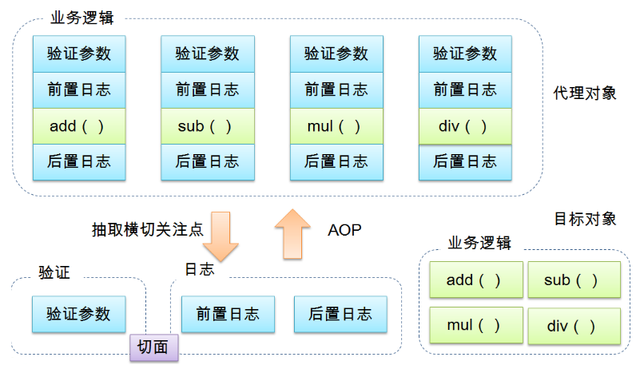
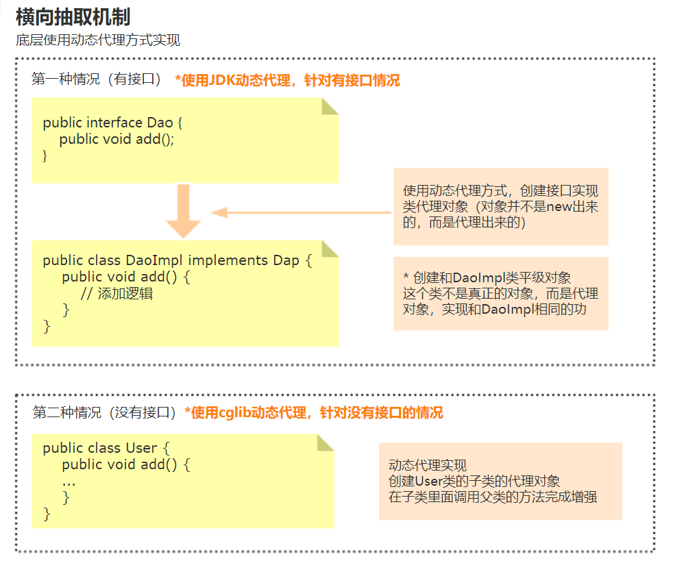
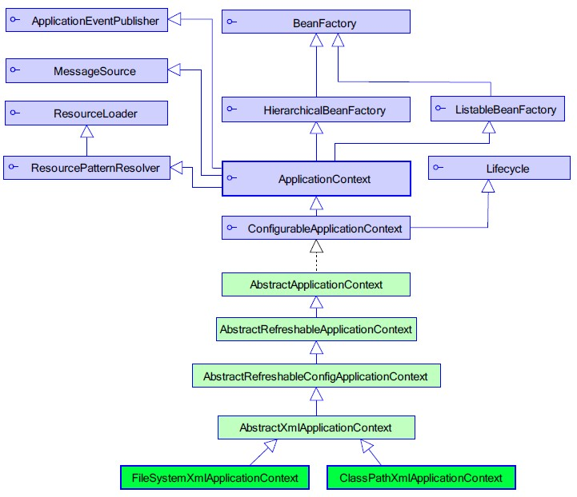

[TOC]

<!-- TOC -->

- [前言](#前言)
- [一、基础概念](#一基础概念)
    - [1. JavaBean](#1-javabean)
    - [2. Bean](#2-bean)
    - [3. 传统Javabean与Spring中的bean的区别](#3-传统javabean与spring中的bean的区别)
    - [4. POJO](#4-pojo)
- [二、Spring核心技术](#二spring核心技术)
    - [1. IOC（控制反转）](#1-ioc控制反转)
        - [1.1 什么是IOC](#11-什么是ioc)
        - [1.2 IoC能做什么](#12-ioc能做什么)
        - [1.3 IoC和DI](#13-ioc和di)
        - [1.4 IOC底层原理 (降低类之间的耦合度)](#14-ioc底层原理-降低类之间的耦合度)
        - [1.5 Spring中怎么用](#15-spring中怎么用)
            - [（1）配置文件方式](#1配置文件方式)
            - [（2）注解方式](#2注解方式)
    - [2. DI（依赖注入）](#2-di依赖注入)
        - [2.1 什么是依赖注入](#21-什么是依赖注入)
        - [2.2 为什么使用依赖注入](#22-为什么使用依赖注入)
        - [2.3 为什么要实现松耦合](#23-为什么要实现松耦合)
        - [2.4 IOC和DI区别](#24-ioc和di区别)
        - [2.5 依赖注入方式](#25-依赖注入方式)
            - [（1）使用set方法注入](#1使用set方法注入)
            - [（2）使用有参构造注入](#2使用有参构造注入)
            - [（3）注入对象类型属性](#3注入对象类型属性)
            - [（4）p名称空间注入](#4p名称空间注入)
            - [（5）注入复杂类型属性](#5注入复杂类型属性)
    - [3. AOP（面向切面编程）](#3-aop面向切面编程)
        - [3.1 什么是AOP](#31-什么是aop)
        - [3.2 底层原理](#32-底层原理)
            - [第一种 JDK 自带的动态代理技术](#第一种-jdk-自带的动态代理技术)
            - [第二种 CGLIB(CodeGenerationLibrary)是一个开源项目](#第二种-cglibcodegenerationlibrary是一个开源项目)
        - [3.3 AOP操作术语](#33-aop操作术语)
        - [3.4 Spring的AOP操作](#34-spring的aop操作)
            - [（1）AOP准备操作](#1aop准备操作)
            - [（2）使用表达式配置切入点](#2使用表达式配置切入点)
        - [3.5 使用xml实现AOP](#35-使用xml实现aop)
        - [3.6 使用注解实现AOP](#36-使用注解实现aop)
        - [3.7 为什么需要代理模式？](#37-为什么需要代理模式)
        - [3.8 静态代理](#38-静态代理)
        - [3.9 动态代理，使用JDK内置的Proxy实现](#39-动态代理使用jdk内置的proxy实现)
        - [3.10 动态代理，使用cglib实现](#310-动态代理使用cglib实现)
    - [4. Spring Ioc容器](#4-spring-ioc容器)
        - [4.1 Bean作用域](#41-bean作用域)
        - [4.2 Bean 的生命周期](#42-bean-的生命周期)
        - [4.3 BeanFactory 和ApplicationContext（Bean工厂和应用上下文）](#43-beanfactory-和applicationcontextbean工厂和应用上下文)

<!-- /TOC -->

# 前言

为了更好的深入学习Spring核心技术，在这里整理了Spring相关的常见核心知识，和面试知识点，本文将通过浅显易懂的语言和代码实现，相信可以在最短的时间内进行巩固学习。


本文参考：

- [理解并实现一个IOC容器](https://github.com/biezhi/java-bible/blob/master/ioc/index.md)
- [【源码实现】Java-Guide/Spring学习与面试.md at master · Snailclimb/Java-Guide](https://github.com/Snailclimb/Java-Guide/blob/master/%E4%B8%BB%E6%B5%81%E6%A1%86%E6%9E%B6/Spring%E5%AD%A6%E4%B9%A0%E4%B8%8E%E9%9D%A2%E8%AF%95.md)
- [一起来谈谈 Spring AOP！ - 掘金](https://juejin.im/post/5aa7818af265da23844040c6)
- [黑马程序员Spring2016学习笔记](https://github.com/Only-lezi/spring-learning/tree/master/spring-learning-article)
- [Spring学习总结（二）——静态代理、JDK与CGLIB动态代理、AOP+IoC - 张果 - 博客园](http://www.cnblogs.com/best/p/5679656.html)
- [Spring IoC有什么好处呢？ - 知乎](https://www.zhihu.com/question/23277575/answer/169698662)
- [极客学院Spring Wiki](http://wiki.jikexueyuan.com/project/spring/transaction-management.html) 
- [【必读】Spring W3Cschool教程](https://www.w3cschool.cn/wkspring/f6pk1ic8.html) 
- [【必读】Java新手如何学习Spring、Struts、Hibernate三大框架？ - 知乎，深度好文](https://www.zhihu.com/question/21142149)
  


个人的使用体会

- **spring**：核心提供依赖注入
- **spring mvc**： mvc框架
- **spring boot**：说不太出什么感觉，跟mvc比就感觉配置少了好多
- **spring cloud**：围绕微服务的一套东西 


from 2018/7/27


# 一、基础概念

## 1. JavaBean

**JavaBean是一种组件技术**，就好像你做了一个扳子，而这个扳子会在很多地方被拿去用，这个扳子也提供多种功能(你可以拿这个扳子扳、锤、撬等等)，而这个扳子就是一个组件。

　**JavaBean是一个遵循特定写法的Java类**，它通常具有如下特点：

- 这个Java类必须具有一个无参的构造函数
- 属性必须私有化。
- 私有化的属性必须通过public类型的方法暴露给其它程序，并且方法的命名也必须遵守一定的命名规范。
- 这个类应是可序列化的。（比如可以实现Serializable 接口，用于实现bean的持久性）

许多开发者把JavaBean看作遵从特定命名约定的POJO。 简而言之，当一个POJO可序列化，有一个无参的构造函数，使用getter和setter方法来访问属性时，他就是一个JavaBean。  

```java
package gacl.javabean.study;

/**
 * @author gacl
 * Person类就是一个最简单的JavaBean
 */
public class Person {

    //Person类封装的私有属性
    // 姓名 String类型
    private String name;
    // 性别 String类型
    private String sex;
    // 年龄 int类型
    private int age;
  
   
    /**
     * 无参数构造方法
     */
    public Person() {
        
    }
    
    //Person类对外提供的用于访问私有属性的public方法
    public String getName() {
        return name;
    }
    public void setName(String name) {
        this.name = name;
    }
    public String getSex() {
        return sex;
    }
    public void setSex(String sex) {
        this.sex = sex;
    }
    public int getAge() {
        return age;
    }
    public void setAge(int age) {
        this.age = age;
    }
}
```

JavaBean在J2EE开发中，通常用于封装数据，对于遵循以上写法的JavaBean组件，其它程序可以通过反射技术实例化JavaBean对象，并且通过反射那些遵守命名规范的方法，从而获知JavaBean的属性，进而调用其属性保存数据。 


## 2. Bean

- **Bean的中文含义是“豆子”，Bean的含义是可重复使用的Java组件**。所谓组件就是一个由可以自行进行内部管理的一个或几个类所组成、外界不了解其内部信息和运行方式的群体。使用它的对象只能通过接口来操作。
- Bean并不需要继承特别的基类(BaseClass)或实现特定的接口(Interface)。Bean的编写规范使Bean的容器(Container)能够分析一个Java类文件，并将其方法(Methods)翻译成属性(Properties)，即把Java类作为一个Bean类使用。Bean的编写规范包括Bean类的构造方法、定义属性和访问方法编写规则。
- Java Bean是基于Java的组件模型，由**属性、方法和事件**3部分组成。在该模型中，JavaBean可以被修改或与其他组件结合以生成新组件或完整的程序。它是一种Java类，通过封装成为具有某种功能或者处理某个业务的对象。因此，也可以通过嵌在JSP页面内的Java代码访问Bean及其属性。


## 3. 传统Javabean与Spring中的bean的区别

Javabean已经没人用了

springbean可以说是javabean的发展, 但已经完全不是一回事儿了

 

**用处不同：**传统javabean更多地作为值传递参数，而spring中的bean用处几乎无处不在，任何组件都可以被称为bean。

**写法不同：**传统javabean作为值对象，要求每个属性都提供getter和setter方法；但spring中的bean只需为接受设值注入的属性提供setter方法。

**生命周期不同：**传统javabean作为值对象传递，不接受任何容器管理其生命周期；spring中的bean有spring管理其生命周期行为。

所有可以被spring容器实例化并管理的java类都可以称为bean。

原来服务器处理页面返回的值都是直接使用request对象，后来增加了javabean来管理对象，所有页面值只要是和javabean对应，就可以用类.GET属性方法来获取值。javabean不只可以传参数，也可以处理数据，相当与把一个服务器执行的类放到了页面上，使对象管理相对不那么乱（对比asp的时候所有内容都在页面上完成）。

spring中的bean，是通过配置文件、javaconfig等的设置，有spring自动实例化，用完后自动销毁的对象。让我们只需要在用的时候使用对象就可以，不用考虑如果创建类对象（这就是spring的注入）。一般是用在服务器端代码的执行上。


## 4. POJO

POJO 和JavaBean是我们常见的两个关键字，一般容易混淆，POJO全称是Plain Ordinary Java Object / Pure Old Java Object，中文可以翻译成：普通Java类，**具有一部分getter/setter方法的那种类就可以称作POJO**，但是JavaBean则比 POJO复杂很多， Java Bean 是可复用的组件，对 Java Bean 并没有严格的规范，理论上讲，任何一个 Java 类都可以是一个 Bean 。但通常情况下，由于 Java Bean 是被容器所创建（如 Tomcat) 的，所以 Java Bean 应具有一个无参的构造器，另外，通常 Java Bean 还要实现 Serializable 接口用于实现 Bean 的持久性。 Java Bean 是不能被跨进程访问的  


一般在web应用程序中建立一个数据库的映射对象时，我们只能称它为POJO。
POJO(Plain Old Java Object)这个名字用来强调它是一个普通java对象，而不是一个特殊的对象。
2005年11月时，“POJO”主要用来指代那些没用遵从特定的Java对象模型，约定或框架如EJB的Java对象.
理想地讲，一个POJO是一个不受任何限制的Java对象（除了Java语言规范）。例如一个POJO不应该是

      1. 扩展预定的类，如  public class Foo extends javax.servlet.http.HttpServlet { ...
    
      2. 实现预定的接口，如  public class Bar implements javax.ejb.EntityBean { ...
    
      3. 包含预定的标注，如  @javax.ejb.Entity public class Baz{ ...
  然后，因为技术上的困难及其他原因，许多兼容POJO风格的软件产品或框架事实上仍然要求使用预定的标注，譬如用于更方便的持久化。


# 二、Spring核心技术

## 1. IOC（控制反转）

### 1.1 什么是IOC

IoC(Inversion of Control)，意为控制反转，不是什么技术，而是一种设计思想。Ioc意味着**将你设计好的对象交给容器控制，而不是传统的在你的对象内部直接控制**。

如何理解好Ioc呢？理解好Ioc的关键是要明确“谁控制谁，控制什么，为何是反转（有反转就应该有正转了），哪些方面反转了”，那我们来深入分析一下：

- **谁控制谁，控制什么**：传统Java SE程序设计，我们直接在对象内部通过new进行创建对象，是程序主动去创建依赖对象；而IoC是有专门一个容器来创建这些对象，即由Ioc容器来控制对 象的创建；谁控制谁？当然是IoC 容器控制了对象；控制什么？那就是主要控制了外部资源获取（不只是对象包括比如文件等）。
- **为何是反转，哪些方面反转了**：有反转就有正转，传统应用程序是由我们自己在对象中主动控制去直接获取依赖对象，也就是正转；而反转则是由容器来帮忙创建及注入依赖对象；为何是反转？因为由容器帮我们查找及注入依赖对象，对象只是被动的接受依赖对象，所以是反转；哪些方面反转了？依赖对象的获取被反转了。

**简单来说**

> 正转：比如有一个类，在类里面有方法（不是静态的方法），调用类里面的方法，创建类的对象，使用对象调用方法，创建类对象的过程，需要new出来对象
>
> 反转：把对象的创建不是通过new方式实现，而是交给Spring配置创建类对象


【必读】IOC深度理解，请转向：[深入浅出IOC](../JavaWeb/深入浅出IOC.md)


### 1.2 IoC能做什么

IoC 不是一种技术，只是一种思想，一个重要的面向对象编程的法则，它能指导我们如何设计出松耦合、更优良的程序。传统应用程序都是由我们在类内部主动创建依赖对象，从而导致类与类之间高耦合，难于测试；有了IoC容器后，把创建和查找依赖对象的控制权交给了容器，由容器进行注入组合对象，所以对象与对象之间是松散耦合，这样也方便测试，利于功能复用，更重要的是使得程序的整个体系结构变得非常灵活。

其实IoC对编程带来的最大改变不是从代码上，而是从思想上，发生了“主从换位”的变化。应用程序原本是老大，要获取什么资源都是主动出击，但是在IoC/DI思想中，应用程序就变成被动的了，被动的等待IoC容器来创建并注入它所需要的资源了。

IoC很好的体现了面向对象设计法则之一—— 好莱坞法则：“别找我们，我们找你”；即由IoC容器帮对象找相应的依赖对象并注入，而不是由对象主动去找。

### 1.3 IoC和DI

**DI—Dependency Injection，即“依赖注入”**：组件之间依赖关系由容器在运行期决定，形象的说，即由容器动态的将某个依赖关系注入到组件之中。依赖注入的目的并非为软件系统带来更多功能，而是为了提升组件重用的频率，并为系统搭建一个灵活、可扩展的平台。通过依赖注入机制，我们只需要通过简单的配置，而无需任何代码就可指定目标需要的资源，完成自身的业务逻辑，而不需要关心具体的资源来自何处，由谁实现。

理解DI的关键是：“**谁依赖谁，为什么需要依赖，谁注入谁，注入了什么**”，那我们来深入分析一下：

- **谁依赖于谁：** 当然是应用程序依赖于IoC容器；
- **为什么需要依赖：** 应用程序需要IoC容器来提供对象需要的外部资源；
- **谁注入谁：** 很明显是IoC容器注入应用程序某个对象，应用程序依赖的对象；
- **注入了什么：** 就是注入某个对象所需要的外部资源（包括对象、资源、常量数据）。

IoC和DI由什么关系呢？其实它们是同一个概念的不同角度描述，由于控制反转概念比较含糊（可能只是理解为容器控制对象这一个层面，很难让人想到谁来维护对象关系），所以2004年大师级人物Martin Fowler又给出了一个新的名字：“依赖注入”，相对IoC 而言，**“依赖注入”**明确描述了**“被注入对象依赖IoC容器配置依赖对象”**。

对于Spring Ioc这个核心概念，我相信每一个学习Spring的人都会有自己的理解。这种概念上的理解没有绝对的标准答案，仁者见仁智者见智。 理解了IoC和DI的概念后，一切都将变得简单明了，剩下的工作只是在框架中堆积木而已，下一节来看看Spring是怎么用的


### 1.4 IOC底层原理 (降低类之间的耦合度)

- 底层原理使用技术
  - xml配置文件
  - dom4j解决xml
  - 工厂设计模式
  - 反射
- 原理

```java
//伪代码
//需要实例化的类
public class UserService{
}

public class UserServlet{
    //得到UserService的对象
    //原始的做法：new 对象();  来创建
    
    //经过spring后
    UserFactory.getService();   //(下面两步的代码调用的)
}
```

**第一步：创建xml配置文件，配置要创建的对象类**

```xml
<bean id="userService" class="cn.blinkit.UserService"/>
```

**第二步：创建工厂类，使用dom4j解析配置文件+反射**

```java
public class Factory {
    //返回UserService对象的方法
    public static UserService getService() {
        //1.使用dom4j来解析xml文件  
        //根据id值userService，得到id值对应的class属性值
        String classValue = "class属性值";
        //2.使用反射来创建类对象
        Class clazz = Class.forName(classValue)；
        //创建类的对象
        UserService service = clazz.newInstance();
        return service;
    }
}
```

 

超详细原理讲解：[java-bible/4.principle.md at master · biezhi/java-bible](https://github.com/biezhi/java-bible/blob/master/ioc/4.principle.md)


<div align="center"> </div><br/>


### 1.5 Spring中怎么用

#### （1）配置文件方式

我们在Spring中是这样获取对象的：

```java
public static void main(String[] args) {   
	ApplicationContext context = new FileSystemXmlApplicationContext("applicationContext.xml");   
	Lol lol = (Lol) context.getBean("lol");   
	lol.gank(); 
}
```

一起看看Spring如何让它生效呢，在 `applicationContext.xml` 配置文件中是酱紫的：

```xml
<bean id="lol" class="com.biezhi.test.Lol">
	<property name="name" value="剑圣" />   
</bean>  
```

`Lol` 类是这样的：

```java
public class Lol {

	private String name;
	
	public Lol() {
	}
	
	public void gank(){
		System.out.println(this.name + "在gank!!");
	}
	
	public String getName() {
		return name;
	}

	public void setName(String name) {
		this.name = name;
	}
}
```

上面的代码运行结果自然是 `剑圣在gank!!`。

#### （2）注解方式

Spring更高级的用法，在3.0版本之后有了基于Annotation的注入实现，为毛每次都要配置 `Xml` 看到都蛋疼。。

首先还是要在 `xml` 中配置启用注解方式

```xml
<context:annotation-config/>  
```

这样就能使用注解驱动依赖注入了，下面是一个使用场景

```java
public class Lol {

	@Autowired
	private DuangService duangService ;
	
	public void buyDuang(String name, int money) {
		duangService.buy(name, money);
	}
}
```

```java
@Service("duangService")
public class DuangService {
	
	public void buy(String name, int money){
		if(money > 0){
			System.out.println(name + "买了" + money + "毛钱的特效，装逼成功！");
		} else{
			System.out.println(name + "没钱还想装逼，真是匪夷所思");
		}
	}
}
```

这只是一个简单的例子，剑圣打野的时候想要买5毛钱的三杀特效，嗯。。虽然不符合逻辑

此时 `DuangService` 已经注入到 `Lol` 对象中，运行代码的结果（这里是例子，代码不能运行的）就是：

```java
德玛买了5毛钱的特效，装逼成功！
```


## 2. DI（依赖注入）

### 2.1 什么是依赖注入

在依赖注入的模式下，创建被调用者得工作不再由调用者来完成，创建被调用者实例的工作通常由Spring容器完成，然后注入调用者。**创建对象时，向类里的属性设置值**


### 2.2 为什么使用依赖注入

为了实现代码/模块之间松耦合。


### 2.3 为什么要实现松耦合

上层调用下层，上层依赖于下层，当下层剧烈变动时上层也要跟着变动，这就会导致模块的复用性降低而且大大提高了开发的成本。

一般情况下抽象的变化概率很小，让用户程序依赖于抽象，实现的细节也依赖于抽象。即使实现细节不断变动，只要抽象不变，客户程序就不需要变化。这大大降低了客户程序与实现细节的耦合度。


### 2.4 IOC和DI区别

1. IOC控制反转，把对象创建交给Spring配置 
2. DI依赖注入，向类里面属性注入值 
3. 关系，依赖注入不能单独存在，需要在IOC基础上完成操作


### 2.5 依赖注入方式

1. 使用set方法注入 

2. 使用有参构造注入 

3. 使用接口注入

说明：Spring框架中支持前两种方式


#### （1）使用set方法注入

```xml
<bean id="person" class="cn.wang.property.Person">
<!--set方法注入属性
    name属性值：类中定义的属性名称
    value属性值：设置具体的值
-->
        <property name="pname" value="zs"></property>
</bean>1234567
```

#### （2）使用有参构造注入

```java
public class Person {
    private String pname;

    public void setPname(String pname) {
        this.pname = pname;
    }
}
```

```xml
<bean id="user" class="cn.wang.ioc.User">
        <!--构造方法注入属性-->
        <constructor-arg name="pname" value="Tony"></constructor-arg>
</bean>
```

#### （3）注入对象类型属性 

- 创建service和dao类，在service中得到dao 

具体实现过程 

- 在service中把dao作为属性，生成dao的set方法

```java
public class UserService {
    // 1.定义UserDao类型属性
    private UserDao userDao;

    // 2.生成set方法
    public void setUserDao(UserDao userDao) {
        this.userDao = userDao;
    }
}
```

1. 配置文件注入关系

```java
<bean id="userDao" class="cn.wang.property.UserDao">
        <property name="name" value="Tom"></property>
    </bean>
    <bean id="userService" class="cn.wang.property.UserService">
        <!--name属性值：UserService类里的属性名称-->
        <!--ref属性:UserDao类配置bean标签中的id值-->
        <property name="userDao" ref="userDao"></property>
    </bean>12345678
```

#### （4）p名称空间注入 




#### （5）注入复杂类型属性

```java
<!-- 注入复杂类型属性值 -->
    <!-- 
    String pname;
    String[] arrs;
    List<String> list;
    Map<String, String> map;
    Properties props; 
    -->
    <bean id="person" class="cn.wang.property.Person">
        <property name="pname" value="zs"></property>
        <property name="arrs">
            <list>
                <value>aaa</value>
                <value>bbb</value>
                <value>ccc</value>
            </list>
        </property>
        <property name="list">
            <list>
                <value>qqq</value>
                <value>www</value>
                <value>eee</value>
            </list>
        </property>
        <property name="map">
            <map>
                <entry key="001" value="Tom"></entry>
                <entry key="002" value="Amy"></entry>
                <entry key="003" value="Jim"></entry>
            </map>
        </property>
        <property name="props">
            <props>
                <prop key="username">admin</prop>
                <prop key="passwprd">admin</prop>
            </props>
        </property>
    </bean>
```


## 3. AOP（面向切面编程）


<div align="center"> </div><br/>


### 3.1 什么是AOP

AOP（Aspect Oriented Programming ）称为面向切面编程，扩展功能不是修改源代码实现，在程序开发中主要用来解决一些系统层面上的问题，比如日志，事务，权限等待，Struts2的拦截器设计就是基于AOP的思想，是个比较经典的例子。

- AOP：面向切面编程，扩展功能不修改源代码实现
- AOP采取**横向抽取机制**，取代了传统**纵向继承**体系重复性代码（性能监视、事务管理、安全检查、缓存）


**spring的底层采用两种方式进行增强**

         第一：Spring传统AOP 纯java实现，在运行期，对目标对象进行代理，织入增强代码
    
         第二：AspectJ第三方开源技术，Spring已经整合AspectJ，提供对AspectJ注解的支持，开发AOP程序 更加容易（企业主流）

### 3.2 底层原理

<div align="center"> </div><br/>


#### 第一种 JDK 自带的动态代理技术

JDK动态代理必须基于接口进行代理

作用：使用代理可以对目标对象进行性能监控（计算运行时间）、安全检查（是否具有权限）、 记录日志等。

注意：必须要有接口才能进行代理，代理后对象必须转换为接口类型


#### 第二种 CGLIB(CodeGenerationLibrary)是一个开源项目

Spring使用CGlib 进行AOP代理， hibernate 也是支持CGlib（默认使用 javassist ）需要下载cglib 的jar包（Spring 最新版本3.2 内部已经集成了cglib ，**无需下载cglib的jar** ）

**作用：可以为目标类，动态创建子类，对目标类方法进行代理（无需接口）**

原理：Spring AOP 底层，会判断用户是根据接口代理还是目标类代理，如果针对接口代理就使用JDK代理，如果针对目标类代理就使用Cglib代理。

<div align="center"> </div><br/>


### 3.3 AOP操作术语

以下面代码为例：

```java
public class User {
    public void add() {...}
    public void delete() {...}
    public void update() {...}
    public void query() {...}
}
```

- **Joinpoint（连接点）（重要）**
  - 类里面可以被增强的方法，这些方法称为连接点

- **Pointcut（切入点）（重要）**
  - 所谓切入点是指我们要对哪些 Joinpoint  进行拦截的定义

- **Advice（通知/增强）（重要）**

  - 所谓通知是指拦截到 Joinpoint 之后所要做的事情就是通知。通知分为**前置通知，后置通知，异常通知，最终通知，环绕通知**（方法之前和方法之后）

- **Aspect（切面）**：
  - 把增强应用到具体方法上面，过程成为切面。

- **Introduction（引介）**
  - 引介是一种特殊的通知在不修改类代码的前提下， Introduction 可以在运行期为类动态地添加一些方法或 Field。

- **Target（目标对象）**
  - 代理的目标对象（要增强的类）

- **Weaving（织入）**
  - 是把增强应用到目标的过程，把 advice 应用到 target的过程

- **Proxy（代理）**
  - 一个类被 AOP 织入增强后，就产生一个结果代理类


### 3.4 Spring的AOP操作

- 在Spring里面进行Aop操作，使用aspectj实现
  - aspectj不是Spring的一部分，和Spring一起使用进行Aop操作 
  - Spring2.0以后新增了对aspectj的支持

- 使用aspectj实现aop有两种方式
  - 基于aspectj的xml配置
  - 基于aspectj的注解方式

#### （1）AOP准备操作

1、除了导入基本的jar包之外，还需要导入aop相关的jar包：

```
aopalliance-1.0.jar
aspectjweaver-1.8.7.jar
spring-aspects-5.0.4.RELEASE.jar
spring-aop-5.0.4.RELEASE.jar
```

2、创建Spring核心配置文件 
除了引入了约束spring-beans之外还需要引入新约束spring-aop

```xml
<?xml version="1.0" encoding="UTF-8"?>
<beans xmlns="http://www.springframework.org/schema/beans"
       xmlns:xsi="http://www.w3.org/2001/XMLSchema-instance"
       xsi:schemaLocation="
        http://www.springframework.org/schema/beans http://www.springframework.org/schema/beans/spring-beans.xsd
        http://www.springframework.org/schema/context http://www.springframework.org/schema/context/spring-aop.xsd">

</beans>12345678
```

#### （2）使用表达式配置切入点

1. 切入点：实际增强的方法
2. 常用的表达式
   execution(<访问修饰符>? <返回类型> <方法名>(<参数>)<异常>)
   （1）对包内的add方法进行增强
   `execution(* cn.blinkit.aop.Book.add(..))`
   （2）* 是对类里面的所有方法进行增强
   `execution(* cn.blinkit.aop.Book.*(..))`
   （3）*.* 是所有的类中的方法进行增强
   `execution(* *.*(..))`
   （4）匹配所有save开头的方法
   `execution(* save*(..))`


### 3.5 使用xml实现AOP

**aop配置代码：** Book

```java
public class Book {
    public void add() {
        System.out.println("add......");
    }
}
```

MyBook

```java
public class MyBook {
    public void before1() {
        System.out.println("前置增强......");
    }

    public void after1() {
        System.out.println("后置增强......");
    }

    //环绕通知
    public void around1(ProceedingJoinPoint proceedingJoinPoint) throws Throwable {
        //方法之前
        System.out.println("方法之前.....");

        //执行被增强的方法
        proceedingJoinPoint.proceed();

        //方法之后
        System.out.println("方法之后......");

    }
}
```

xml配置

```xml
    <!--1. 配置对象-->
    <bean id="book" class="cn.blinkit.aop.Book"></bean>
    <bean id="myBook" class="cn.blinkit.aop.MyBook"></bean>

    <!--2. 配置aop操作-->
    <aop:config>
        <!--2.1 配置切入点-->
        <aop:pointcut id="pointcut1" expression="execution(* cn.blinkit.aop.Book.*(..))"></aop:pointcut>

        <!--2.2 配置切面
                把增强用到方法上面
        -->
        <aop:aspect ref="myBook">
            <!--
                aop:before   :前置通知
                aop:after    :后置通知
                aop:around   :环绕通知
                配置增强类型
                method : 增强类里面使用哪个方法作为前置
            -->
            <aop:before method="before1" pointcut-ref="pointcut1"></aop:before>
            <aop:after method="after1" pointcut-ref="pointcut1"></aop:after>
            <aop:around method="around1" pointcut-ref="pointcut1"></aop:around>
        </aop:aspect>
    </aop:config>
```

测试代码

```java
public class AOPTest {
    @Test
    public void testBook() {
        ApplicationContext context = new ClassPathXmlApplicationContext("cn/blinkit/aop/spring-aop.xml");
        Book book = (Book) context.getBean("book");
        book.add();

    }
}
```


### 3.6 使用注解实现AOP

1. 创建对象
   (1)创建Book和MyBook **（增强类）** 对象

2. 在spring核心配置文件中，开启aop操作
   具体操作见xml配置文件代码：

   ```xml
   <?xml version="1.0" encoding="UTF-8"?>
   <beans xmlns="http://www.springframework.org/schema/beans"
          xmlns:xsi="http://www.w3.org/2001/XMLSchema-instance"
          xmlns:aop="http://www.springframework.org/schema/aop"
          xsi:schemaLocation="http://www.springframework.org/schema/beans http://www.springframework.org/schema/beans/spring-beans.xsd
           http://www.springframework.org/schema/aop http://www.springframework.org/schema/aop/spring-aop.xsd">
   
       <!-- 1.开启aop操作 -->
       <aop:aspectj-autoproxy></aop:aspectj-autoproxy>
   
       <!-- 2.配置对象 -->
       <bean id="book" class="com.jxs.aspectj.Book"></bean>
       <bean id="nbBook" class="com.jxs.aspectj.NBBook"></bean>
   
   </beans>
   ```

3. 在增强类上面使用注解完成aop操作
   （1）类上面加上`@Aspect`
   （2）方法上面加上
   `@Before(value = "execution(* cn.blinkit.aop.anno.Book.*(..))")`
   `@After(value = "表达式")`
   `@Around(value = "表达式")`等...

4. 

**Book**

```java
public class Book {
    public void add() {
        System.out.println("add...注解版本...");
    }
}
```

**MyBook增强类**

```java
@Aspect
public class MyBook {
    //在方法上面使用注解完成增强配置
    @Before(value = "execution(* cn.blinkit.aop.anno.Book.*(..))")
    public void before1() {
        System.out.println("前置增强...注解版本...");
    }

    @After(value = "execution(* cn.blinkit.aop.anno.Book.*(..))")
    public void after1() {
        System.out.println("后置增强...注解版本...");
    }

    //环绕通知
    @Around(value = "execution(* cn.blinkit.aop.anno.Book.*(..))")
    public void around1(ProceedingJoinPoint proceedingJoinPoint) throws Throwable {
        //方法之前
        System.out.println("方法之前...注解版本...");

        //执行被增强的方法
        proceedingJoinPoint.proceed();

        //方法之后
        System.out.println("方法之后...注解版本...");

    }
}
```

**xml配置**

```xml
<!--开启aop操作-->
    <aop:aspectj-autoproxy></aop:aspectj-autoproxy>

    <!--创建对象-->
    <bean id="book" class="cn.blinkit.aop.anno.Book"></bean>
    <bean id="myBook" class="cn.blinkit.aop.anno.MyBook"></bean>
```


### 3.7 为什么需要代理模式？

假设需实现一个计算的类Math、完成加、减、乘、除功能，如下所示：  

```java
package com.zhangguo.Spring041.aop01;

public class Math {
    //加
    public int add(int n1,int n2){
        int result=n1+n2;
        System.out.println(n1+"+"+n2+"="+result);
        return result;
    }
    
    
    //减
    public int sub(int n1,int n2){
        int result=n1-n2;
        System.out.println(n1+"-"+n2+"="+result);
        return result;
    }
    
    //乘
    public int mut(int n1,int n2){
        int result=n1*n2;
        System.out.println(n1+"X"+n2+"="+result);
        return result;
    }
    
    //除
    public int div(int n1,int n2){
        int result=n1/n2;
        System.out.println(n1+"/"+n2+"="+result);
        return result;
    }
}
```

现在需求发生了变化，要求项目中所有的类在执行方法时输出执行耗时。最直接的办法是修改源代码，如下所示：  

```java
package com.zhangguo.Spring041.aop01;

import java.util.Random;

public class Math {
    //加
    public int add(int n1,int n2){
        //开始时间
        long start=System.currentTimeMillis();
        lazy();
        int result=n1+n2;
        System.out.println(n1+"+"+n2+"="+result);
        Long span= System.currentTimeMillis()-start;
        System.out.println("共用时："+span);
        return result;
    }
    
    //减
    public int sub(int n1,int n2){
        //开始时间
        long start=System.currentTimeMillis();
        lazy();
        int result=n1-n2;
        System.out.println(n1+"-"+n2+"="+result);
        Long span= System.currentTimeMillis()-start;
        System.out.println("共用时："+span);
        return result;
    }
    
    //乘
    public int mut(int n1,int n2){
        //开始时间
        long start=System.currentTimeMillis();
        lazy();
        int result=n1*n2;
        System.out.println(n1+"X"+n2+"="+result);
        Long span= System.currentTimeMillis()-start;
        System.out.println("共用时："+span);
        return result;
    }
    
    //除
    public int div(int n1,int n2){
        //开始时间
        long start=System.currentTimeMillis();
        lazy();
        int result=n1/n2;
        System.out.println(n1+"/"+n2+"="+result);
        Long span= System.currentTimeMillis()-start;
        System.out.println("共用时："+span);
        return result;
    }
    
    //模拟延时
    public void lazy()
    {
        try {
            int n=(int)new Random().nextInt(500);
            Thread.sleep(n);
        } catch (InterruptedException e) {
            e.printStackTrace();
        }
    }
}
```


缺点：

1. 工作量特别大，如果项目中有多个类，多个方法，则要修改多次。
2. 违背了设计原则：开闭原则（OCP），对扩展开放，对修改关闭，而为了增加功能把每个方法都修改了，也不便于维护。
3. 违背了设计原则：单一职责（SRP），每个方法除了要完成自己本身的功能，还要计算耗时、延时；每一个方法引起它变化的原因就有多种。
4. 违背了设计原则：依赖倒转（DIP），抽象不应该依赖细节，两者都应该依赖抽象。而在Test类中，Test与Math都是细节。

解决：

- 使用静态代理可以解决部分问题（请往下看...）


### 3.8 静态代理

 1、定义抽象主题接口

```java
package com.zhangguo.Spring041.aop02;

/**
 * 接口
 * 抽象主题
 */
public interface IMath {
    //加
    int add(int n1, int n2);

    //减
    int sub(int n1, int n2);

    //乘
    int mut(int n1, int n2);

    //除
    int div(int n1, int n2);

}
```

2、主题类，算术类，实现抽象接口

```java
package com.zhangguo.Spring041.aop02;

/**
 * 被代理的目标对象
 *真实主题
 */
public class Math implements IMath {
    //加
    public int add(int n1,int n2){
        int result=n1+n2;
        System.out.println(n1+"+"+n2+"="+result);
        return result;
    }
    
    //减
    public int sub(int n1,int n2){
        int result=n1-n2;
        System.out.println(n1+"-"+n2+"="+result);
        return result;
    }
    
    //乘
    public int mut(int n1,int n2){
        int result=n1*n2;
        System.out.println(n1+"X"+n2+"="+result);
        return result;
    }
    
    //除
    public int div(int n1,int n2){
        int result=n1/n2;
        System.out.println(n1+"/"+n2+"="+result);
        return result;
    }
}
```

3、代理类 

```java
package com.zhangguo.Spring041.aop02;

import java.util.Random;

/**
 * 静态代理类
 */
public class MathProxy implements IMath {

    //被代理的对象
    IMath math=new Math();
    
    //加
    public int add(int n1, int n2) {
        //开始时间
        long start=System.currentTimeMillis();
        lazy();
        int result=math.add(n1, n2);
        Long span= System.currentTimeMillis()-start;
        System.out.println("共用时："+span);
        return result;
    }

    //减法
    public int sub(int n1, int n2) {
        //开始时间
        long start=System.currentTimeMillis();
        lazy();
        int result=math.sub(n1, n2);
        Long span= System.currentTimeMillis()-start;
        System.out.println("共用时："+span);
        return result;
    }

    //乘
    public int mut(int n1, int n2) {
        //开始时间
        long start=System.currentTimeMillis();
        lazy();
        int result=math.mut(n1, n2);
        Long span= System.currentTimeMillis()-start;
        System.out.println("共用时："+span);
        return result;
    }
    
    //除
    public int div(int n1, int n2) {
        //开始时间
        long start=System.currentTimeMillis();
        lazy();
        int result=math.div(n1, n2);
        Long span= System.currentTimeMillis()-start;
        System.out.println("共用时："+span);
        return result;
    }

    //模拟延时
    public void lazy()
    {
        try {
            int n=(int)new Random().nextInt(500);
            Thread.sleep(n);
        } catch (InterruptedException e) {
            e.printStackTrace();
        }
    }
}
```

4、测试运行 

```java
package com.zhangguo.Spring041.aop02;

public class Test {
    
    IMath math=new MathProxy();
    @org.junit.Test
    public void test01()
    {
        int n1=100,n2=5;
        math.add(n1, n2);
        math.sub(n1, n2);
        math.mut(n1, n2);
        math.div(n1, n2);
    }
}
```

5、小结 

通过静态代理，是否完全解决了上述的4个问题：

**已解决：**

- 解决了“开闭原则（OCP）”的问题，因为并没有修改Math类，而扩展出了MathProxy类。

- 解决了“依赖倒转（DIP）”的问题，通过引入接口。

- 解决了“单一职责（SRP）”的问题，Math类不再需要去计算耗时与延时操作，但从某些方面讲MathProxy还是存在该问题。

**未解决：**

- 如果项目中有多个类，则需要编写多个代理类，工作量大，不好修改，不好维护，不能应对变化。

如果要解决上面的问题，可以使用动态代理。


### 3.9 动态代理，使用JDK内置的Proxy实现

只需要一个代理类，而不是针对每个类编写代理类。

在上一个示例中修改代理类MathProxy如下：

```java
package com.zhangguo.Spring041.aop03;

import java.lang.reflect.InvocationHandler;
import java.lang.reflect.Method;
import java.lang.reflect.Proxy;
import java.util.Random;

/**
 * 动态代理类
 */
public class DynamicProxy implements InvocationHandler {

    //被代理的对象
    Object targetObject;
    
    /**
     * 获得被代理后的对象
     * @param object 被代理的对象
     * @return 代理后的对象
     */
    public Object getProxyObject(Object object){
        this.targetObject=object;
        return Proxy.newProxyInstance(
                targetObject.getClass().getClassLoader(), //类加载器
                targetObject.getClass().getInterfaces(),  //获得被代理对象的所有接口
                this);  //InvocationHandler对象
        //loader:一个ClassLoader对象，定义了由哪个ClassLoader对象来生成代理对象进行加载
        //interfaces:一个Interface对象的数组，表示的是我将要给我需要代理的对象提供一组什么接口，如果我提供了一组接口给它，那么这个代理对象就宣称实现了该接口(多态)，这样我就能调用这组接口中的方法了
        //h:一个InvocationHandler对象，表示的是当我这个动态代理对象在调用方法的时候，会关联到哪一个InvocationHandler对象上，间接通过invoke来执行
    }
    
    
    /**
     * 当用户调用对象中的每个方法时都通过下面的方法执行，方法必须在接口
     * proxy 被代理后的对象
     * method 将要被执行的方法信息（反射）
     * args 执行方法时需要的参数
     */
    public Object invoke(Object proxy, Method method, Object[] args) throws Throwable {
        //被织入的内容，开始时间
        long start=System.currentTimeMillis();
        lazy();
        
        //使用反射在目标对象上调用方法并传入参数
        Object result=method.invoke(targetObject, args);
        
        //被织入的内容，结束时间
        Long span= System.currentTimeMillis()-start;
        System.out.println("共用时："+span);
        
        return result;
    }
    
    //模拟延时
    public void lazy()
    {
        try {
            int n=(int)new Random().nextInt(500);
            Thread.sleep(n);
        } catch (InterruptedException e) {
            e.printStackTrace();
        }
    }

}
```

测试运行：  

```java
package com.zhangguo.Spring041.aop03;

public class Test {
    
    //实例化一个MathProxy代理对象
    //通过getProxyObject方法获得被代理后的对象
    IMath math=(IMath)new DynamicProxy().getProxyObject(new Math());
    @org.junit.Test
    public void test01()
    {
        int n1=100,n2=5;
        math.add(n1, n2);
        math.sub(n1, n2);
        math.mut(n1, n2);
        math.div(n1, n2);
    }
    
    IMessage message=(IMessage) new DynamicProxy().getProxyObject(new Message());
    @org.junit.Test
    public void test02()
    {
        message.message();
    }
}
```

小结：

 JDK内置的Proxy动态代理可以在运行时动态生成字节码，而没必要针对每个类编写代理类。中间主要使用到了一个接口InvocationHandler与Proxy.newProxyInstance静态方法，参数说明如下：

使用内置的Proxy实现动态代理有一个问题：**被代理的类必须实现接口，未实现接口则没办法完成动态代理。**

如果项目中有些类没有实现接口，则不应该为了实现动态代理而刻意去抽出一些没有实例意义的接口，通过cglib可以解决该问题。


### 3.10 动态代理，使用cglib实现

CGLIB(Code Generation Library)是一个开源项目,是一个强大的，高性能，高质量的Code生成类库，它可以在运行期扩展Java类与实现Java接口，通俗说cglib可以在运行时动态生成字节码。

1、引用cglib，通过maven

2、使用cglib完成动态代理，大概的原理是：cglib继承被代理的类，重写方法，织入通知，动态生成字节码并运行，因为是继承所以final类是没有办法动态代理的。具体实现如下：  

```java
package com.zhangguo.Spring041.aop04;

import java.lang.reflect.Method;
import java.util.Random;

import net.sf.cglib.proxy.Enhancer;
import net.sf.cglib.proxy.MethodInterceptor;
import net.sf.cglib.proxy.MethodProxy;

/*
 * 动态代理类
 * 实现了一个方法拦截器接口
 */
public class DynamicProxy implements MethodInterceptor {

    // 被代理对象
    Object targetObject;

    //Generate a new class if necessary and uses the specified callbacks (if any) to create a new object instance. 
    //Uses the no-arg constructor of the superclass.
    //动态生成一个新的类，使用父类的无参构造方法创建一个指定了特定回调的代理实例
    public Object getProxyObject(Object object) {
        this.targetObject = object;
        //增强器，动态代码生成器
        Enhancer enhancer=new Enhancer();
        //回调方法
        enhancer.setCallback(this);
        //设置生成类的父类类型
        enhancer.setSuperclass(targetObject.getClass());
        //动态生成字节码并返回代理对象
        return enhancer.create();
    }

    // 拦截方法
    public Object intercept(Object object, Method method, Object[] args, MethodProxy methodProxy) throws Throwable {
        // 被织入的横切内容，开始时间 before
        long start = System.currentTimeMillis();
        lazy();

        // 调用方法
        Object result = methodProxy.invoke(targetObject, args);

        // 被织入的横切内容，结束时间
        Long span = System.currentTimeMillis() - start;
        System.out.println("共用时：" + span);
        
        return result;
    }

    // 模拟延时
    public void lazy() {
        try {
            int n = (int) new Random().nextInt(500);
            Thread.sleep(n);
        } catch (InterruptedException e) {
            e.printStackTrace();
        }
    }

}
```

测试运行：  

```java
package com.zhangguo.Spring041.aop04;

public class Test {
    //实例化一个DynamicProxy代理对象
    //通过getProxyObject方法获得被代理后的对象
    Math math=(Math)new DynamicProxy().getProxyObject(new Math());
    @org.junit.Test
    public void test01()
    {
        int n1=100,n2=5;
        math.add(n1, n2);
        math.sub(n1, n2);
        math.mut(n1, n2);
        math.div(n1, n2);
    }
    //另一个被代理的对象,不再需要重新编辑代理代码
    Message message=(Message) new DynamicProxy().getProxyObject(new Message());
    @org.junit.Test
    public void test02()
    {
        message.message();
    }
}
```

**小结**

使用cglib可以实现动态代理，即使被代理的类没有实现接口，但被代理的类必须不是final类。


## 4. Spring Ioc容器

### 4.1 Bean作用域

Spring 框架支持以下五个作用域，如果你使用 web-aware ApplicationContext 时，其中三个是可用的。

| 作用域         | 描述                                                         |
| -------------- | ------------------------------------------------------------ |
| singleton      | 在spring IoC容器仅存在一个Bean实例，Bean以单例方式存在，默认值 |
| prototype      | 每次从容器中调用Bean时，都返回一个新的实例，即每次调用getBean()时，相当于执行newXxxBean() |
| request        | 每次HTTP请求都会创建一个新的Bean，该作用域仅适用于WebApplicationContext环境 |
| session        | 同一个HTTP Session共享一个Bean，不同Session使用不同的Bean，仅适用于WebApplicationContext环境 |
| global-session | 一般用于Portlet应用环境，改作用于仅适用于WebApplicationContext环境 |


### 4.2 Bean 的生命周期

在传统的Java应用中，bean的生命周期很简单。使用Java关键字new进行bean实例化，然后该bean就可以使用了。一旦该bean不再被使用，则由Java自动进行垃圾回收。

相比之下，Spring容器中的bean的生命周期就显得相对复杂多了。正确理解Spring bean的生命周期非常重要，因为你或许要利用Spring提供的扩展点来自定义bean的创建过程。下图展示了bean装载到Spring应用上下文中的一个典型的生命周期过程。 

<div align="center"> </div><br/>

上图bean在Spring容器中从创建到销毁经历了若干阶段，每一阶段都可以针对Spring如何管理bean进行个性化定制

**正如你所见，在bean准备就绪之前，bean工厂执行了若干启动步骤。我们对上图进行详细描述：**

1. Spring 对 Bean 进行实例化；
   - 相当于程序中的new Xx()
2. Spring 将值和 Bean 的引用注入进 Bean 对应的属性中；
3. **如果Bean实现了 BeanNameAware 接口**，Spring 将 Bean 的 ID 传递给setBeanName()方法
   - 实现BeanNameAware清主要是为了通过Bean的引用来获得Bean的ID，一般业务中是很少有在Bean的ID的

4. **如果Bean实现了BeanFactoryAware接口**，Spring将调用setBeanDactory(BeanFactory bf)方法并把BeanFactory容器实例作为参数传入。
   - 实现BeanFactoryAware 主要目的是为了获取Spring容器，如Bean通过Spring容器发布事件等

5. **如果Bean实现了ApplicationContextAwaer接口**，Spring容器将调用setApplicationContext(ApplicationContext ctx)方法，将bean所在的应用上下文的引用传入进来
   - 作用与BeanFactory类似都是为了获取Spring容器，不同的是Spring容器在调用setApplicationContext方法时会把它自己作为setApplicationContext 的参数传入，而Spring容器在调用setBeanDactory前需要程序员自己指定（注入）setBeanDactory里的参数BeanFactory

6. **如果Bean实现了BeanPostProcess接口**，Spring将调用它们的postProcessBeforeInitialization（预初始化）方法
   - 作用是在Bean实例创建成功后对进行增强处理，如对Bean进行修改，增加某个功能
7. **如果Bean实现了InitializingBean接口**，Spring将调用它们的afterPropertiesSet方法，作用与在配置文件中对Bean使用init-method声明初始化的作用一样，都是在Bean的全部属性设置成功后执行的初始化方法。
8. **如果Bean实现了BeanPostProcess接口**，Spring将调用它们的postProcessAfterInitialization（后初始化）方法
   - 作用与6的一样，只不过6是在Bean初始化前执行的，而这个是在Bean初始化后执行的，时机不同

9. 经过以上的工作后，Bean将一直驻留在应用上下文中给应用使用，直到应用上下文被销毁
10. **如果Bean实现了DispostbleBean接口**，Spring将调用它的destory方法，作用与在配置文件中对Bean使用destory-method属性的作用一样，都是在Bean实例销毁前执行的方法。


### 4.3 BeanFactory 和ApplicationContext（Bean工厂和应用上下文）

Bean 工厂（com.springframework.beans.factory.BeanFactory）是Spring 框架最核心的接口，它提供了高级IoC 的配置机制。

应用上下文（com.springframework.context.ApplicationContext）建立在BeanFactory 基础之上。

几乎所有的应用场合我们都直接使用ApplicationContext 而非底层的BeanFactory。

<div align="center"> </div><br/>

ApplicationContext 的初始化和BeanFactory有一个重大的区别：

- BeanFactory在初始化容器时，并未实例化Bean，直到第一次访问某个Bean 时才实例目标Bean；
- 而ApplicationContext 则在初始化应用上下文时就实例化所有单实例的Bean 。 

```xml
ApplicationContext ctx = new ClassPathXmlApplicationContext("com/baobaotao/context/beans.xml");
ApplicationContext ctx = new FileSystemXmlApplicationContext("com/baobaotao/context/beans.xml");
ApplicationContext ctx = new ClassPathXmlApplicationContext(new String[]{"conf/beans1.xml","conf/beans2.xml"});
```

参考资料：

- [BeanFactory 和ApplicationContext（Bean工厂和应用上下文） - 品互网络](http://www.pinhuba.com/spring/101250.htm)


