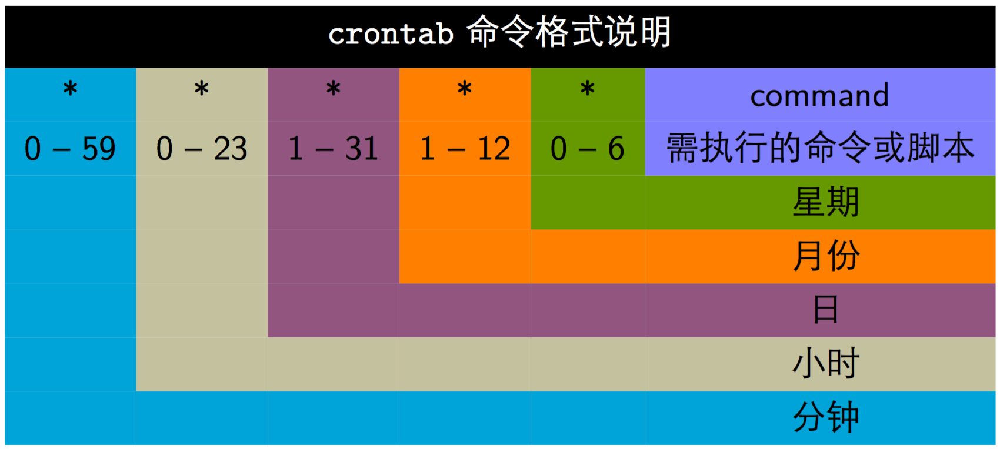
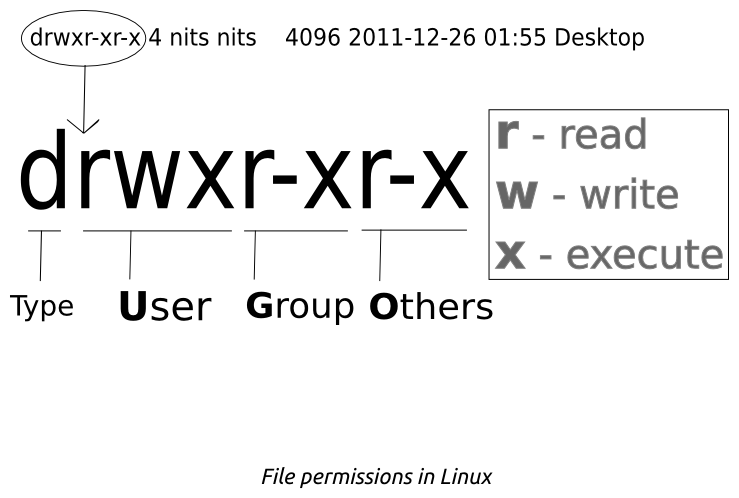

#### 

# Linux

[TOC]

<!-- TOC -->

- [Linux](#linux)
    - [1、Linux 系统的顶层目录结构](#1linux-系统的顶层目录结构)
        - [★  proc下都放什么文件？【腾讯面试】](#★--proc下都放什么文件腾讯面试)
    - [2、什么是硬链接与软链接？【腾讯】](#2什么是硬链接与软链接腾讯)
    - [3、Linux查看CPU、内存占用的命令【腾讯】](#3linux查看cpu内存占用的命令腾讯)
        - [top](#top)
        - [cat /proc/meminfo](#cat-procmeminfo)
        - [free](#free)
    - [4、定时任务crontab【腾讯】](#4定时任务crontab腾讯)
    - [5、文件权限](#5文件权限)
        - [★ chmod 修改权限](#★-chmod-修改权限)
    - [6、文件与目录的基本操作](#6文件与目录的基本操作)
        - [1. ls](#1-ls)
        - [2. cd](#2-cd)
        - [3. mkdir](#3-mkdir)
        - [4. rmdir](#4-rmdir)
        - [5. touch](#5-touch)
        - [6. cp](#6-cp)
        - [7. rm](#7-rm)
        - [8. mv](#8-mv)
    - [7、获取文件内容](#7获取文件内容)
        - [1. cat](#1-cat)
        - [2. tac](#2-tac)
        - [3. more](#3-more)
        - [4. less](#4-less)
        - [5. head](#5-head)
        - [6. tail](#6-tail)
        - [7. od](#7-od)
        - [★ Linux查看日志文件的方式](#★-linux查看日志文件的方式)
    - [8、指令与文件搜索](#8指令与文件搜索)
        - [1. which](#1-which)
        - [2. whereis](#2-whereis)
        - [3. locate](#3-locate)
        - [4. find（完全匹配）](#4-find完全匹配)
        - [*. grep的使用，一定要掌握，每次都会问在文件中查找（包含匹配）](#-grep的使用一定要掌握每次都会问在文件中查找包含匹配)
        - [*. 管道](#-管道)
    - [9、压缩与打包](#9压缩与打包)
        - [压缩文件名](#压缩文件名)
        - [压缩指令](#压缩指令)
            - [1. gzip](#1-gzip)
            - [2. bzip2](#2-bzip2)
            - [3. xz](#3-xz)
        - [打包](#打包)
    - [10、Bash](#10bash)
        - [特性](#特性)
        - [变量操作](#变量操作)
        - [指令搜索顺序](#指令搜索顺序)
        - [数据流重定向](#数据流重定向)
        - [输入重定向](#输入重定向)
    - [9、正则表达式](#9正则表达式)
        - [cut](#cut)
        - [grep](#grep)
        - [printf](#printf)
        - [awk](#awk)
        - [sed](#sed)
    - [10、进程管理](#10进程管理)
        - [查看进程](#查看进程)
            - [1. ps](#1-ps)
            - [2. top](#2-top)
            - [3. pstree](#3-pstree)
            - [4. netstat](#4-netstat)
        - [进程状态](#进程状态)
            - [SIGCHLD](#sigchld)
            - [wait()](#wait)
            - [waitpid()](#waitpid)
            - [孤儿进程](#孤儿进程)
            - [僵尸进程](#僵尸进程)
    - [11、进程和线程的区别【腾讯】](#11进程和线程的区别腾讯)
    - [12、kill用法，某个进程杀不掉的原因（进入内核态，忽略kill信号）](#12kill用法某个进程杀不掉的原因进入内核态忽略kill信号)
    - [14、包管理工具](#14包管理工具)
        - [软件类型](#软件类型)
        - [发行版](#发行版)
    - [15、系统管理命令（如查看内存使用、网络情况）](#15系统管理命令如查看内存使用网络情况)
    - [16、磁盘管理](#16磁盘管理)
    - [17、VIM 三个模式](#17vim-三个模式)
    - [17、Screen命令](#17screen命令)
    - [18、常用快捷方式](#18常用快捷方式)
    - [高并发网络编程之epoll详解 - CSDN博客](#高并发网络编程之epoll详解---csdn博客)
- [参考资料：](#参考资料)

<!-- /TOC -->


## 1、Linux 系统的顶层目录结构 


```json
/           root, 根目录
├── bin     存放用户二进制文件
├── boot    存放内核引导配置文件
├── dev     存放设备文件
├── etc     存放系统配置文件
├── home    用户主目录
├── lib     动态共享库
├── lost+found  文件系统恢复时的恢复文件
├── media   可卸载存储介质挂载点
├── mnt     文件系统临时挂载点
├── opt     附加的应用程序包
├── proc    系统内存的映射目录，提供内核与进程信息
├── root    root 用户主目录
├── sbin    存放系统二进制文件
├── srv     存放服务相关数据
├── sys     sys 虚拟文件系统挂载点
├── tmp     存放临时文件
├── usr     所有系统默认软件都会安装到这个目录(unix software resource)
└── var     存放邮件、系统日志等变化文件，存放系统或程序运行过程中的数据文件(variable)
```

以下是对这些目录的解释：

- **/bin：**
  - bin是Binary的缩写, 这个目录存放着最经常使用的命令。

- **/boot：**
  - 这里存放的是启动Linux时使用的一些核心文件，包括一些连接文件以及镜像文件。

- **/dev ：**
  - dev是Device(设备)的缩写, 该目录下存放的是Linux的外部设备，在Linux中访问设备的方式和访问文件的方式是相同的。

- **/etc：** 
  - 这个目录用来存放所有的系统管理所需要的配置文件和子目录。

- **/home：**
  - 用户的主目录，在Linux中，每个用户都有一个自己的目录，一般该目录名是以用户的账号命名的。

- **/lib：**
  - 这个目录里存放着系统最基本的动态连接共享库，其作用类似于Windows里的DLL文件。几乎所有的应用程序都需要用到这些共享库。

- **/lost+found：**
  - 这个目录一般情况下是空的，当系统非法关机后，这里就存放了一些文件。

- **/media：**
  - linux系统会自动识别一些设备，例如U盘、光驱等等，当识别后，linux会把识别的设备挂载到这个目录下。

- **/mnt：**
  - 系统提供该目录是为了让用户临时挂载别的文件系统的，我们可以将光驱挂载在/mnt/上，然后进入该目录就可以查看光驱里的内容了。

- **/opt：**
  - 这是给主机额外安装软件所摆放的目录。比如你安装一个ORACLE数据库则就可以放到这个目录下。默认是空的。

- **/proc：**

  - 此目录的所有数据都在内存里，如 系统核心，外部设备，网络状态。由于所有数据都储存在内存里，所以不占用磁盘空间； 这个目录是一个虚拟的目录，它是系统内存的映射，我们可以通过直接访问这个目录来获取系统信息。

  ```
  more /proc/meminfo
  ```

  

  - 这个目录的内容不在硬盘上而是在内存里，我们也可以直接修改里面的某些文件，比如可以通过下面的命令来屏蔽主机的ping命令，使别人无法ping你的机器：

  ```shell
  echo 1 > /proc/sys/net/ipv4/icmp_echo_ignore_all
  ```

- **/root：**
  - 该目录为系统管理员，也称作超级权限者的用户主目录。
- **/sbin：**
  - s就是Super User的意思，这里存放的是系统管理员使用的系统管理程序。
- **/selinux：**
  - 这个目录是Redhat/CentOS所特有的目录，Selinux是一个安全机制，类似于windows的防火墙，但是这套机制比较复杂，这个目录就是存放selinux相关的文件的。
- **/srv：**
  - 该目录存放一些服务启动之后需要提取的数据。
- **/sys：**
  - 这是linux2.6内核的一个很大的变化。该目录下安装了2.6内核中新出现的一个文件系统 sysfs 。
  - sysfs文件系统集成了下面3种文件系统的信息：针对进程信息的proc文件系统、针对设备的devfs文件系统以及针对伪终端的devpts文件系统。
  - 该文件系统是内核设备树的一个直观反映。
  - 当一个内核对象被创建的时候，对应的文件和目录也在内核对象子系统中被创建。
- **/tmp：**
  - 这个目录是用来存放一些临时文件的。
- **/usr：**
  -  这是一个非常重要的目录，用户的很多应用程序和文件都放在这个目录下，类似于windows下的program files目录。
- **/usr/bin：**
  - 系统用户使用的应用程序。
- **/usr/sbin：**
  - 超级用户使用的比较高级的管理程序和系统守护程序。
- **/usr/src：**
  - 内核源代码默认的放置目录。
- **/var：**
  - 这个目录中存放着在不断扩充着的东西，我们习惯将那些经常被修改的目录放在这个目录下。包括各种日志文件。

在linux系统中，有几个目录是比较重要的，平时需要注意不要误删除或者随意更改内部文件。

**/etc：** 上边也提到了，这个是系统中的配置文件，如果你更改了该目录下的某个文件可能会导致系统不能启动。

**/bin, /sbin, /usr/bin, /usr/sbin:** 这是系统预设的执行文件的放置目录，比如 ls 就是在/bin/ls 目录下的。

值得提出的是，**/bin, /usr/bin** 是给系统用户使用的指令（除root外的通用户），而**/sbin, /usr/sbin** 则是给root使用的指令。

**/var：** 这是一个非常重要的目录，系统上跑了很多程序，那么每个程序都会有相应的日志产生，而这些日志就被记录到这个目录下，具体在/var/log 目录下，另外mail的预设放置也是在这里。

> 注意：在Linux中一切皆文件

### ★  proc下都放什么文件？【腾讯面试】


## 2、什么是硬链接与软链接？【腾讯】


几个硬连接＝几个名字的同一个房子

**硬链接（Hard Link）**：硬连接不能跨越不同的文件系统，硬连接记录的是目标的inode；不能连接目录。硬连接与原始文件都删除才意味着文件被删除。

几个软链接=几个指向源文件的路标

**软链接（Symbolic Link，又称符号链接）**：软链接能跨越不同的文件系统，软链接记录的是目标的path。源文件删除后，则软链接无效。**相当于Windows系统中的“快捷方式”**

注意：复制是建造一个一模一样的房子，inode是不同的。

命令

```
 硬链接：ln 源文件 链接名
 软链接：ln -s 源文件 链接名
```

查看inode信息

```shell
[root@chengchi test]# stat abby.txt
  File: ‘abby.txt’
  Size: 22              Blocks: 8          IO Block: 4096   regular file
Device: fd01h/64769d    Inode: 2106782     Links: 2
Access: (0644/-rw-r--r--)  Uid: (    0/    root)   Gid: (    0/    root)
Access: 2018-07-22 16:37:18.640787898 +0800
Modify: 2018-07-22 16:37:10.678607855 +0800
Change: 2018-07-22 16:37:10.833611360 +0800
 Birth: -
 

[root@chengchi test]# ls -li
total 8
2106782 -rw-r--r-- 2 root root 22 Jul 22 16:37 abby.txt
2106782 -rw-r--r-- 2 root root 22 Jul 22 16:37 hard
2106780 lrwxrwxrwx 1 root root  8 Jul 22 16:36 soft -> abby.txt

```


参考资料：

- [ln命令_Linux ln 命令用法详解：用来为文件创件连接](http://man.linuxde.net/ln)
- [linux 硬链接与软连接简单的对比试验_哔哩哔哩 (゜-゜)つロ 干杯~-bilibili](https://www.bilibili.com/video/av9769329?from=search&seid=5663546178393951142)
- [【 linux从入门到放弃】10：文件和文件夹进阶inode_哔哩哔哩 (゜-゜)つロ 干杯~-bilibili](https://www.bilibili.com/video/av6068432?from=search&seid=12178075587929134931)
  


## 3、Linux查看CPU、内存占用的命令【腾讯】 

### top

**top命令**可以实时动态地查看系统的整体运行情况，是一个综合了多方信息监测系统性能和运行信息的实用工具。通过top命令所提供的互动式界面，用热键可以管理。

 

### cat /proc/meminfo

查看RAM使用情况最简单的方法是通过`/proc/meminfo`。这个动态更新的虚拟文件实际上是许多其他内存相关工具(如：free / ps / top)等的组合显示。`/proc/meminfo`列出了所有你想了解的内存的使用情况。 

free命令是一个快速查看内存使用情况的方法，它是对 /proc/meminfo 收集到的信息的一个概述。

 

### free

这个命令用于显示系统当前内存的使用情况，包括已用内存、可用内存和交换内存的情况

默认情况下free会以字节为单位输出内存的使用量

```
$ free
             total       used       free     shared    buffers     cached
Mem:       3566408    1580220    1986188          0     203988     902960
-/+ buffers/cache:     473272    3093136
Swap:      4000176          0    4000176
```

如果你想以其他单位输出内存的使用量，需要加一个选项，-g为GB，-m为MB，-k为KB，-b为字节

```
$ free -g
             total       used       free     shared    buffers     cached
Mem:             3          1          1          0          0          0
-/+ buffers/cache:          0          2
Swap:            3          0          3
```

如果你想查看所有内存的汇总，请使用-t选项，使用这个选项会在输出中加一个汇总行

```
ramesh@ramesh-laptop:~$ free -t
             total       used       free     shared    buffers     cached
Mem:       3566408    1592148    1974260          0     204260     912556
-/+ buffers/cache:     475332    3091076
Swap:      4000176          0    4000176
Total:     7566584    1592148    5974436
```


## 4、定时任务crontab【腾讯】 

crontab命令常见于Unix和类Unix的操作系统之中，用于设置周期性被执行的指令。该命令从标准输入设备读取指令，并将其存放于“crontab”文件中，以供之后读取和执行。该词来源于希腊语chronos（χρόνος），原意是时间。

通常，crontab储存的指令被守护进程激活，crond常常在后台运行，每一分钟检查是否有预定的作业需要执行。这类作业一般称为cron jobs。

**crontab文件**


crontab文件包含送交cron守护进程的一系列作业和指令。每个用户可以拥有自己的crontab文件；同时，操作系统保存一个针对整个系统的crontab文件，该文件通常存放于/etc或者/etc之下的子目录中，而这个文件只能由系统管理员来修改。

crontab文件的每一行均遵守特定的格式，由空格或tab分隔为数个领域，每个领域可以放置单一或多个数值。

**操作符号**
在一个区域里填写多个数值的方法：

逗号（','）分开的值，例如：“1,3,4,7,8”
连词符（'-'）指定值的范围，例如：“1-6”，意思等同于“1,2,3,4,5,6”
星号（'*'）代表任何可能的值。例如，在“小时域”里的星号等于是“每一个小时”，等等
某些cron程序的扩展版本也支持斜线（'/'）操作符，用于表示跳过某些给定的数。例如，“*/3”在小时域中等于“0,3,6,9,12,15,18,21”等被3整除的数；



**时间设置**

```
# 文件格式说明
#  ——分钟（0 - 59）
# |  ——小时（0 - 23）
# | |  ——日（1 - 31）
# | | |  ——月（1 - 12）
# | | | |  ——星期（0 - 7，星期日=0或7）
# | | | | |
# * * * * * 被执行的命令
```

注：

1. 在“星期域”（第五个域），0和7都被视为星期日。
2. 不很直观的用法：如果日期和星期同时被设定，那么其中的一个条件被满足时，指令便会被执行。请参考下例。
3. 前5个域称之**分时日月周**，可方便个人记忆。

从第六个域起，指明要执行的命令。


**实例**

 每1分钟执行一次command

```shell
* * * * * command
```

每小时的第3和第15分钟执行

```shell
3,15 * * * * command
```

在上午8点到11点的第3和第15分钟执行

```shell
3,15 8-11 * * * command
```

每隔两天的上午8点到11点的第3和第15分钟执行

```shell
3,15 8-11 */2 * * command
```


**参考资料**：

- [crontab命令_Linux crontab 命令用法详解：提交和管理用户的需要周期性执行的任务](http://man.linuxde.net/crontab)
  

## 5、文件权限



- `Type`: 很多种 (最常见的是 `-` 为文件, `d` 为文件夹, 其他的还有`l`, `n` … 这种东西, 真正自己遇到了, 网上再搜就好, 一次性说太多记不住的).
  - d：目录
  - -：文件
  - l：链接文件
- `User`: 后面跟着的三个空是使用 User 的身份能对这个做什么处理 (`r` 可读; `w` 可写; `x可`执行; `-` 不能完成某个操作).
- `Group`: 一个 Group 里可能有一个或多个 user, 这些权限的样式和 User 一样.
- `Others`: 除了 User 和 Group 以外人的权限.

如果有朋友对 User, group, others 这几个没什么概念的话, 我这里补充一下. User 一般就是指你, 这个正在使用电脑的人. Group 是一个 User 的集合, 最开始创建新 User 的时候, 他也为这个 User 创建了一个和 User 一样名字的 Group, 这个新 Group 里只有这个 User. 一般来说, 像一个企业部门的电脑, 都可以放在一个 Group 里, 分享了一些共享文件和权限. Others 就是除了上面提到的 User 和 Group 以外的人.

 

**文件时间有以下三种：**

- modification time (mtime)：文件的内容更新就会更新；
- status time (ctime)：文件的状态（权限、属性）更新就会更新；
- access time (atime)：读取文件时就会更新。


### ★ chmod 修改权限

可以将一组权限用数字来表示，此时一组权限的 3 个位当做二进制数字的位，从左到右每个位的权值为 4、2、1，即每个权限对应的数字权值为 r : 4、w : 2、x : 1。

```shell
# chmod [-R] xyz dirname/filename
```

示例：将 .bashrc 文件的权限修改为 -rwxr-xr--。

```shell
# chmod 754 .bashrc
```

也可以使用符号来设定权限。

```shell
# chmod [ugoa]  [+-=] [rwx] dirname/filename
- u：拥有者
- g：所属群组
- o：其他人
- a：所有人
- +：添加权限
- -：移除权限
- =：设定权限
```

示例：为 .bashrc 文件的所有用户添加写权限。

```shell
# chmod a+w .bashrc
```


参考资料：

- [Linux 文件权限 - Linux 简易教学 | 莫烦Python](https://morvanzhou.github.io/tutorials/others/linux-basic/3-01-file-permissions/)
- [带你玩转Linux命令行（基础入门篇） - CSDN博客](https://blog.csdn.net/u012104219/article/details/79125771)


## 6、文件与目录的基本操作

### 1. ls

列出文件或者目录的信息，目录的信息就是其中包含的文件。

```
# ls [-aAdfFhilnrRSt] file|dir
-a ：列出全部的文件
-d ：仅列出目录本身
-l ：以长数据串行列出，包含文件的属性与权限等等数据
```

### 2. cd

更换当前目录。

```
cd [相对路径或绝对路径]
```

### 3. mkdir

创建目录。

```
# mkdir [-mp] 目录名称
-m ：配置目录权限
-p ：递归创建目录
```

### 4. rmdir

删除目录，目录必须为空。

```
rmdir [-p] 目录名称
-p ：递归删除目录
```

### 5. touch

更新文件时间或者建立新文件。

```
# touch [-acdmt] filename
-a ： 更新 atime
-c ： 更新 ctime，若该文件不存在则不建立新文件
-m ： 更新 mtime
-d ： 后面可以接更新日期而不使用当前日期，也可以使用 --date="日期或时间"
-t ： 后面可以接更新时间而不使用当前时间，格式为[YYYYMMDDhhmm]
```

### 6. cp

复制文件。

如果源文件有两个以上，则目的文件一定要是目录才行。

```
cp [-adfilprsu] source destination
-a ：相当于 -dr --preserve=all 的意思，至于 dr 请参考下列说明
-d ：若来源文件为链接文件，则复制链接文件属性而非文件本身
-i ：若目标文件已经存在时，在覆盖前会先询问
-p ：连同文件的属性一起复制过去
-r ：递归持续复制
-u ：destination 比 source 旧才更新 destination，或 destination 不存在的情况下才复制
--preserve=all ：除了 -p 的权限相关参数外，还加入 SELinux 的属性, links, xattr 等也复制了
```

### 7. rm

删除文件。

```
# rm [-fir] 文件或目录
-r ：递归删除
```

### 8. mv

移动文件。

```
# mv [-fiu] source destination
# mv [options] source1 source2 source3 .... directory
-f ： force 强制的意思，如果目标文件已经存在，不会询问而直接覆盖
```


## 7、获取文件内容

### 1. cat

取得文件内容。

```
# cat [-AbEnTv] filename
-n ：打印出行号，连同空白行也会有行号，-b 不会
```

### 2. tac

是 cat 的反向操作，从最后一行开始打印。

### 3. more

和 cat 不同的是它可以一页一页查看文件内容，比较适合大文件的查看。

- 按Space键：显示文本的下一屏内容。
- 按Enier键：只显示文本的下一行内容。
- 按斜线符`/`：接着输入一个模式，可以在文本中寻找下一个相匹配的模式。
- 按H键：显示帮助屏，该屏上有相关的帮助信息。
- 按B键：显示上一屏内容。
- 按Q键：退出rnore命令。

### 4. less

和 more 类似，但是多了一个向前翻页的功能。

### 5. head

取得文件前几行。

```
# head [-n number] filename
-n ：后面接数字，代表显示几行的意思
```

### 6. tail

是 head 的反向操作，只是取得是后几行。

### 7. od

以字符或者十六进制的形式显示二进制文件。

### ★ Linux查看日志文件的方式


## 8、指令与文件搜索

### 1. which

指令搜索。

```
# which [-a] command
-a ：将所有指令列出，而不是只列第一个
```

### 2. whereis

文件搜索。速度比较快，因为它只搜索几个特定的目录。

```
# whereis [-bmsu] dirname/filename
```

### 3. locate

文件搜索。可以用关键字或者正则表达式进行搜索。

**注意：** locate是从数据库中读取数据，而不是从文件系统中读取。从数据库中读取时是读取updatedb命令返回的结果，而updatedb命令默认是一天（24小时）才自动运行一次，这就意味着如果是最新创建的文件，使用locate命令可能查找不到。

**解决方法：** 
在使用locate命令前，先手动运行updatedb命令（需要root权限）：`sudo updatedb`


```
# locate安装
sudo yum install mlocate
updatedb
```


**实例**

搜索etc目录下所有以sh开头的文件：

```
locate /etc/sh
```

搜索用户主目录下，所有以m开头的文件：

```
locate ~/m
```

搜索用户主目录下，所有以m开头的文件，并且忽略大小写：

```
locate -i ~/m
```

### 4. find（完全匹配）

文件搜索。可以使用文件的属性和权限进行搜索。

```
# find [basedir] [option]
example: find . -name "shadow*"
```

（一）与时间有关的选项

```
-mtime  n ：列出在 n 天前的那一天修改过内容的文件
-mtime +n ：列出在 n 天之前 (不含 n 天本身) 修改过内容的文件
-mtime -n ：列出在 n 天之内 (含 n 天本身) 修改过内容的文件
-newer file ： 列出比 file 更新的文件
```

+4、4 和 -4 的指示的时间范围如下：

[](https://github.com/CyC2018/Interview-Notebook/blob/master/pics/658fc5e7-79c0-4247-9445-d69bf194c539.png)

 

（二）与文件拥有者和所属群组有关的选项

```
-uid n
-gid n
-user name
-group name
-nouser ：搜索拥有者不存在 /etc/passwd 的文件
-nogroup：搜索所属群组不存在于 /etc/group 的文件
```

（三）与文件权限和名称有关的选项

```
-name filename
-size [+-]SIZE：搜寻比 SIZE 还要大 (+) 或小 (-) 的文件。这个 SIZE 的规格有：c: 代表 byte，k: 代表 1024bytes。所以，要找比 50KB 还要大的文件，就是 -size +50k
-type TYPE
-perm mode  ：搜索权限等于 mode 的文件
-perm -mode ：搜索权限包含 mode 的文件
-perm /mode ：搜索权限包含任一 mode 的文件
```

### *. grep的使用，一定要掌握，每次都会问在文件中查找（包含匹配）

**grep**（global search regular expression(RE) and print out the line，全面搜索正则表达式并把行打印出来）是一种强大的文本搜索工具，它能使用正则表达式搜索文本，并把匹配的行打印出来。

 

例子：在目录~/test下递归查找包含字符串"hello"的所有文件，并显示匹配行的行号

```
slot@slot-ubt:~/test$ grep -Rn "hello" ~/test 
/home/slot/test/aa:1:hello world!
/home/slot/test/cc:1:hello world!
/home/slot/test/bb:1:hello world!
```

### *. 管道

管线是将一个命令的标准输出作为另一个命令的标准输入，在数据需要经过多个步骤的处理之后才能得到我们想要的内容时就可以使用管线。

在命令之间使用 | 分隔各个管线命令。

```
$ ls -al /etc | less
```

查看已经建立TCP请求的个数

```
netstat -an | grep ESTABLISHED| wc -l
```


 参考资料

- [Linux查找命令 - 简书](https://www.jianshu.com/p/72c579528337)


## 9、压缩与打包

### 压缩文件名

Linux 底下有很多压缩文件名，常见的如下：

| 扩展名    | 压缩程序                              |
| --------- | ------------------------------------- |
| *.Z       | compress                              |
| *.zip     | zip                                   |
| *.gz      | gzip                                  |
| *.bz2     | bzip2                                 |
| *.xz      | xz                                    |
| *.tar     | tar 程序打包的数据，没有经过压缩      |
| *.tar.gz  | tar 程序打包的文件，经过 gzip 的压缩  |
| *.tar.bz2 | tar 程序打包的文件，经过 bzip2 的压缩 |
| *.tar.xz  | tar 程序打包的文件，经过 xz 的压缩    |

### 压缩指令

#### 1. gzip

gzip 是 Linux 使用最广的压缩指令，可以解开 compress、zip 与 gzip 所压缩的文件。

经过 gzip 压缩过，源文件就不存在了。

有 9 个不同的压缩等级可以使用。

可以使用 zcat、zmore、zless 来读取压缩文件的内容。

```
$ gzip [-cdtv#] filename
-c ：将压缩的数据输出到屏幕上
-d ：解压缩
-t ：检验压缩文件是否出错
-v ：显示压缩比等信息
-# ： # 为数字的意思，代表压缩等级，数字越大压缩比越高，默认为 6
```

#### 2. bzip2

提供比 gzip 更高的压缩比。

查看命令：bzcat、bzmore、bzless、bzgrep。

```
$ bzip2 [-cdkzv#] filename
-k ：保留源文件
```

#### 3. xz

提供比 bzip2 更佳的压缩比。

可以看到，gzip、bzip2、xz 的压缩比不断优化。不过要注意的是，压缩比越高，压缩的时间也越长。

查看命令：xzcat、xzmore、xzless、xzgrep。

```
$ xz [-dtlkc#] filename
```

### 打包

压缩指令只能对一个文件进行压缩，而打包能够将多个文件打包成一个大文件。tar 不仅可以用于打包，也可以使用 gip、bzip2、xz 将打包文件进行压缩。

```
$ tar [-z|-j|-J] [cv] [-f 新建的 tar 文件] filename...  ==打包压缩
$ tar [-z|-j|-J] [tv] [-f 已有的 tar 文件]              ==查看
$ tar [-z|-j|-J] [xv] [-f 已有的 tar 文件] [-C 目录]    ==解压缩
-z ：使用 zip；
-j ：使用 bzip2；
-J ：使用 xz；
-c ：新建打包文件；
-t ：查看打包文件里面有哪些文件；
-x ：解打包或解压缩的功能；
-v ：在压缩/解压缩的过程中，显示正在处理的文件名；
-f : filename：要处理的文件；
-C 目录 ： 在特定目录解压缩。
```

| 使用方式 | 命令                                                  |
| -------- | ----------------------------------------------------- |
| 打包压缩 | tar -jcv -f filename.tar.bz2 要被压缩的文件或目录名称 |
| 查 看    | tar -jtv -f filename.tar.bz2                          |
| 解压缩   | tar -jxv -f filename.tar.bz2 -C 要解压缩的目录        |


## 10、Bash

Shell 是一个用 C 语言编写的程序，它是用户使用 Linux 的桥梁。Shell 既是一种命令语言，又是一种程序设计语言。可以通过 Shell 请求内核提供服务，Bash 正是 Shell 的一种。

Shell 是指一种应用程序，这个应用程序提供了一个界面，用户通过这个界面访问操作系统内核的服务。

Ken Thompson 的 sh 是第一种 Unix Shell，Windows Explorer 是一个典型的图形界面 Shell。


Shell 编程跟 java、php 编程一样，只要有一个能编写代码的文本编辑器和一个能解释执行的脚本解释器就可以了。

Linux 的 Shell 种类众多，常见的有：

- Bourne Shell（/usr/bin/sh或/bin/sh）
- **Bourne Again Shell（/bin/bash）**
- C Shell（/usr/bin/csh）
- K Shell（/usr/bin/ksh）
- Shell for Root（/sbin/sh）
- ……

本教程关注的是 Bash，也就是 Bourne Again Shell，由于易用和免费，Bash 在日常工作中被广泛使用。同时，Bash 也是大多数Linux 系统默认的 Shell。

在一般情况下，人们并不区分 Bourne Shell 和 Bourne Again Shell，所以，像 **#!/bin/sh**，它同样也可以改为 **#!/bin/bash**。

\#! 告诉系统其后路径所指定的程序即是解释此脚本文件的 Shell 程序。


参考资料：

- [Linux脚本开头#!/bin/bash和#!/bin/sh是什么意思以及区别 - CSDN博客](https://blog.csdn.net/y_hanxiao/article/details/78638479)


### 特性

- 命令历史：记录使用过的命令
- 命令与文件补全：快捷键：tab
- 命名别名：例如 lm 是 ls -al 的别名
- shell scripts
- 通配符：例如 ls -l /usr/bin/X* 列出 /usr/bin 下面所有以 X 开头的文件

### 变量操作

对一个变量赋值直接使用 =。

对变量取用需要在变量前加上 $ ，也可以用 ${} 的形式；

输出变量使用 echo 命令。

```
$ x=abc
$ echo $x
$ echo ${x}
```

变量内容如果有空格，必须使用双引号或者单引号。

- **双引号内的特殊字符可以保留原本特性**，例如 x="lang is $LANG"，则 x 的值为 lang is zh_TW.UTF-8；
- **单引号内的特殊字符就是特殊字符本身**，例如 x='lang is $LANG'，则 x 的值为 lang is $LANG。

可以使用 `指令` 或者 (指令) 的方式将指令的执行结果赋值给变量。例如 version=(uname -r)，则 version 的值为 4.15.0-22-generic。

可以使用 export 命令将自定义变量转成环境变量，环境变量可以在子程序中使用，所谓子程序就是由当前 Bash 而产生的子 Bash。

Bash 的变量可以声明为数组和整数数字。注意数字类型没有浮点数。如果不进行声明，默认是字符串类型。变量的声明使用 declare 命令：

```
$ declare [-aixr] variable
-a ： 定义为数组类型
-i ： 定义为整数类型
-x ： 定义为环境变量
-r ： 定义为 readonly 类型
```

使用 [ ] 来对数组进行索引操作：

```
$ array[1]=a
$ array[2]=b
$ echo ${array[1]}
```

### 指令搜索顺序

- 以绝对或相对路径来执行指令，例如 /bin/ls 或者 ./ls ；
- 由别名找到该指令来执行；
- 由 Bash 内建的指令来执行；
- 按 $PATH 变量指定的搜索路径的顺序找到第一个指令来执行。

### 数据流重定向

重定向指的是使用文件代替标准输入、标准输出和标准错误输出。

| 1                          | 代码 | 运算符    |
| -------------------------- | ---- | --------- |
| 标准输入 (/dev/stdin)      | 0    | < 或 <<   |
| 标准输出 (/dev/stdout)     | 1    | > 或 >>   |
| 标准错误输出 (/dev/stderr) | 2    | 2> 或 2>> |

其中，**有一个箭头的表示以覆盖的方式重定向**，**而有两个箭头的表示以追加的方式重定向**。

可以将不需要的标准输出以及标准错误输出重定向到 /dev/null，相当于扔进垃圾箱。

**注意：**在错误输出的时候 `2>`或`2>>`后加文件名不能出现空格

```
biod@biod-HP-Z640-Workstation:~/test$ llc 2>index.txt
biod@biod-HP-Z640-Workstation:~/test$ cat index.txt
程序“llc”尚未安装。 您可以使用以下命令安装：
sudo apt install llvm
biod@biod-HP-Z640-Workstation:~/test$

```


在实际的应用中，上面的写法有一定问题，因为我们编写的时候并不能确定我们写的是正确的还是错误的，也就无法确定写入正确的文件还是错误的文件，因此这里仅作了解，用处不大。

**正确输出和错误输出同时保存:**

| 命令                     | 例子                               | 说明                                                     |
| ------------------------ | ---------------------------------- | -------------------------------------------------------- |
| 命令 > 文件 2>&1         | ll > abby.txt 2>&1                 | 以覆盖的方式，把正确输出和错误输出都保存到同一个文件当中 |
| **命令 >> 文件 2>&1**    | ll >> abby.txt 2>&1                | 以追加的方式，把正确输出和错误输出都保存到同一个文件当中 |
| 命令 &>文件              | llc &> abby.txt                    | 以覆盖的方式，把正确输出和错误输出都保存到同一个文件当中 |
| **命令&>>文件**          | llc &>> abby.txt                   | 以追加的方式，把正确输出和错误输出都保存到同一个文件当中 |
| **命令>>文件1 2>>文件2** | netstat >>success.txt 2>>error.txt | 把正确的输出追加到文件1中，把错误的输出追加到文件2中     |


如果需要将标准输出以及标准错误输出同时重定向到一个文件，需要将某个输出转换为另一个输出，例如 2>&1 表示将标准错误输出转换为标准输出。

```
$ find /home -name .bashrc > list 2>&1
```

### 输入重定向

**wc命令**用来计算数字。利用wc指令我们可以计算文件的Byte数、字数或是列数，若不指定文件名称，或是所给予的文件名为“-”，则wc指令会从标准输入设备读取数据。

 语法 

```
wc(选项)(参数)
```

选项 

```
-c或--bytes或——chars：只显示Bytes数；
-l或——lines：只显示列数；
-w或——words：只显示字数。
```

参数 

文件：需要统计的文件列表。


参考资料：

- [Shell 教程 | 菜鸟教程](http://www.runoob.com/linux/linux-shell.html)


## 9、正则表达式


### cut

cut 对数据进行切分，取出想要的部分。切分过程一行一行地进行。

```
$ cut
-d ：分隔符
-f ：经过 -d 分隔后，使用 -f n 取出第 n 个区间
-c ：以字符为单位取出区间
```


例如有一个学生报表信息，包含No、Name、Mark、Percent：

```
[root@localhost text]# cat test.txt 
No Name Mark Percent
01 tom 69 91
02 jack 71 87
03 alex 68 98
```

使用 **-f** 选项提取指定字段：

```
[root@localhost text]# cut -f 1 test.txt 
No
01
02
03
```

```
[root@localhost text]# cut -f2,3 test.txt 
Name Mark
tom 69
jack 71
alex 68
```

**--complement** 选项提取指定字段之外的列（打印除了第二列之外的列）：

```
[root@localhost text]# cut -f2 --complement test.txt 
No Mark Percent
01 69 91
02 71 87
03 68 98
```

使用 **-d** 选项指定字段分隔符：

```shell
[root@localhost text]# cat test2.txt 
No;Name;Mark;Percent
01;tom;69;91
02;jack;71;87
03;alex;68;98
```

```shell
[root@localhost text]# cut -f2 -d";" test2.txt 
Name
tom
jack
alex
```


### grep

g/re/p（globally search a regular expression and print)，使用正则表示式进行全局查找并打印。

```shell
$ grep [-acinv] [--color=auto] 搜寻字符串 filename
-c ： 计算找到个数
-i ： 忽略大小写
-n ： 输出行号
-v ： 反向选择，亦即显示出没有 搜寻字符串 内容的那一行
--color=auto ：找到的关键字加颜色显示
```

示例：把含有 the 字符串的行提取出来（注意默认会有 --color=auto 选项，因此以下内容在 Linux 中有颜色显示 the 字符串）

```shell
$ grep -n 'the' regular_express.txt
8:I can't finish the test.
12:the symbol '*' is represented as start.
15:You are the best is mean you are the no. 1.
16:The world Happy is the same with "glad".
18:google is the best tools for search keyword
```

因为 { 和 } 在 shell 是有特殊意义的，因此必须要使用转义字符进行转义。

```shell
$ grep -n 'go\{2,5\}g' regular_express.txt
```


### printf

用于格式化输出。

它不属于管道命令，在给 printf 传数据时需要使用 $( ) 形式。

```shell
$ printf '%10s %5i %5i %5i %8.2f \n' $(cat printf.txt)
    DmTsai    80    60    92    77.33
     VBird    75    55    80    70.00
       Ken    60    90    70    73.33
```


### awk

是由 Alfred Aho，Peter Weinberger, 和 Brian Kernighan 创造，awk 这个名字就是这三个创始人名字的首字母。

awk 每次处理一行，处理的最小单位是字段，每个字段的命名方式为：$n，n 为字段号，从 1 开始，$0 表示一整行。

示例 1：取出登录用户的用户名和 ip

```
$ last -n 5
dmtsai pts/0 192.168.1.100 Tue Jul 14 17:32 still logged in
dmtsai pts/0 192.168.1.100 Thu Jul 9 23:36 - 02:58 (03:22)
dmtsai pts/0 192.168.1.100 Thu Jul 9 17:23 - 23:36 (06:12)
dmtsai pts/0 192.168.1.100 Thu Jul 9 08:02 - 08:17 (00:14)
dmtsai tty1 Fri May 29 11:55 - 12:11 (00:15)

$ last -n 5 | awk '{print $1 "\t" $3}
```

可以根据字段的某些条件进行匹配，例如匹配字段小于某个值的那一行数据。

```
$ awk '条件类型 1 {动作 1} 条件类型 2 {动作 2} ...' filename
```

示例 2：/etc/passwd 文件第三个字段为 UID，对 UID 小于 10 的数据进行处理。

```
$ cat /etc/passwd | awk 'BEGIN {FS=":"} $3 < 10 {print $1 "\t " $3}'
root 0
bin 1
daemon 2
```

awk 变量：

| 变量名称 | 代表意义                     |
| -------- | ---------------------------- |
| NF       | 每一行拥有的字段总数         |
| NR       | 目前所处理的是第几行数据     |
| FS       | 目前的分隔字符，默认是空格键 |

示例 3：输出正在处理的行号，并显示每一行有多少字段

```
$ last -n 5 | awk '{print $1 "\t lines: " NR "\t columns: " NF}'
dmtsai lines: 1 columns: 10
dmtsai lines: 2 columns: 10
dmtsai lines: 3 columns: 10
dmtsai lines: 4 columns: 10
dmtsai lines: 5 columns: 9
```


### sed

Linux sed命令是利用script来处理文本文件。使得文本替换脚本化，操作很类似于vim

sed可依照script的指令，来处理、编辑文本文件。

Sed主要用来自动编辑一个或多个文件；简化对文件的反复操作；编写转换程序等。


**语法**

```
sed [-hnV][-e<script>][-f<script文件>][文本文件]\
```

**动作说明**：

- a ：新增， a 的后面可以接字串，而这些字串会在新的一行出现(目前的下一行)～
- c ：取代， c 的后面可以接字串，这些字串可以取代 n1,n2 之间的行！
- d ：删除，因为是删除啊，所以 d 后面通常不接任何咚咚；
- i ：插入， i 的后面可以接字串，而这些字串会在新的一行出现(目前的上一行)；
- p ：打印，亦即将某个选择的数据印出。通常 p 会与参数 sed -n 一起运行～
- s ：取代，可以直接进行取代的工作哩！通常这个 s 的动作可以搭配正规表示法！例如 1,20s/old/new/g 就是啦！


**示例**（这里就不一一展开示例了，更多请参考下面的链接）

```
# 替换文件中的所有匹配项
sed -i 's/原字符串/替换字符串/g' filename
```


参考文档：

- [Linux sed命令 | 菜鸟教程](http://www.runoob.com/linux/linux-comm-sed.html)
- [sed 字符串替换 - Amei1314 - 博客园](https://www.cnblogs.com/linux-wangkun/p/5745584.html)
  


## 10、进程管理

### 查看进程

#### 1. ps

查看某个时间点的进程信息

示例一：查看自己的进程

```
# ps -l
```

示例二：查看系统所有进程

```
# ps aux
```

示例三：查看特定的进程

```
# ps aux | grep threadx
```

#### 2. top

实时显示进程信息

示例：两秒钟刷新一次

```
# top -d 2
```

#### 3. pstree

查看进程树

示例：查看所有进程树

```
# pstree -A
```

#### 4. netstat

查看占用端口的进程

示例：查看特定端口的进程

```
# netstat -anp | grep port
```


参考资料：

- [https://www.bilibili.com/video/av9539203?from=search&seid=12568422774751055363](https://www.bilibili.com/video/av9539203?from=search&seid=12568422774751055363)


### 进程状态

[](https://github.com/CyC2018/Interview-Notebook/blob/master/pics/76a49594323247f21c9b3a69945445ee.png)

 

| 状态 | 说明                                                         |
| ---- | ------------------------------------------------------------ |
| R    | running or runnable (on run queue)                           |
| D    | uninterruptible sleep (usually I/O)                          |
| S    | interruptible sleep (waiting for an event to complete)       |
| Z    | zombie (terminated but not reaped by its parent) 僵尸进程    |
| T    | stopped (either by a job control signal or because it is being traced) |


#### SIGCHLD

当一个子进程改变了它的状态时：停止运行，继续运行或者退出，有两件事会发生在父进程中：

- 得到 SIGCHLD 信号；
- waitpid() 或者 wait() 调用会返回。

[](https://github.com/CyC2018/Interview-Notebook/blob/master/pics/flow.png)

其中子进程发送的 SIGCHLD 信号包含了子进程的信息，包含了进程 ID、进程状态、进程使用 CPU 的时间等。

在子进程退出时，它的进程描述符不会立即释放，这是为了让父进程得到子进程信息。父进程通过 wait() 和 waitpid() 来获得一个已经退出的子进程的信息。


#### wait()

```
pid_t wait(int *status)
```

父进程调用 wait() 会一直阻塞，直到收到一个子进程退出的 SIGCHLD 信号，之后 wait() 函数会销毁子进程并返回。

如果成功，返回被收集的子进程的进程 ID；如果调用进程没有子进程，调用就会失败，此时返回 -1，同时 errno 被置为 ECHILD。

参数 status 用来保存被收集的子进程退出时的一些状态，如果我们对这个子进程是如何死掉的毫不在意，只想把这个子进程消灭掉，可以设置这个参数为 NULL：

```
pid = wait(NULL);
```


#### waitpid()

```
pid_t waitpid(pid_t pid, int *status, int options)
```

作用和 wait() 完全相同，但是多了两个可由用户控制的参数 pid 和 options。

pid 参数指示一个子进程的 ID，表示只关心这个子进程的退出 SIGCHLD 信号。如果 pid=-1 时，那么和 wait() 作用相同，都是关心所有子进程退出的 SIGCHLD 信号。

options 参数主要有 WNOHANG 和 WUNTRACED 两个选项，WNOHANG 可以使 waitpid() 调用变成非阻塞的，也就是说它会立即返回，父进程可以继续执行其它任务。


#### 孤儿进程

一个父进程退出，而它的一个或多个子进程还在运行，那么这些子进程将成为孤儿进程。

孤儿进程将被 init 进程（进程号为 1）所收养，并由 init 进程对它们完成状态收集工作。

由于孤儿进程会被 init 进程收养，所以孤儿进程不会对系统造成危害。


#### 僵尸进程

一个子进程的进程描述符在子进程退出时不会释放，只有当父进程通过 wait() 或 waitpid() 获取了子进程信息后才会释放。如果子进程退出，而父进程并没有调用 wait() 或 waitpid()，那么子进程的进程描述符仍然保存在系统中，这种进程称之为僵尸进程。

僵尸进程通过 ps 命令显示出来的状态为 Z（zombie）。

系统所能使用的进程号是有限的，如果大量的产生僵尸进程，将因为没有可用的进程号而导致系统不能产生新的进程。

要消灭系统中大量的僵尸进程，只需要将其父进程杀死，此时所有的僵尸进程就会变成孤儿进程，从而被 init 所收养，这样 init 就会释放所有的僵死进程所占有的资源，从而结束僵尸进程。


参考资料：

- [孤儿进程与僵尸进程[总结] - Anker's Blog - 博客园](https://www.cnblogs.com/Anker/p/3271773.html)
- [《深入理解计算机系统》异常控制流——读书笔记 - CSDN博客](https://blog.csdn.net/zhanghaodx082/article/details/12280689)
- [Linux系统学习笔记：异常控制流 - CSDN博客](https://blog.csdn.net/yangxuefeng09/article/details/10066357)
- [Linux 之守护进程、僵死进程与孤儿进程 | LiuYongbin](http://liubigbin.github.io/2016/03/11/Linux-%E4%B9%8B%E5%AE%88%E6%8A%A4%E8%BF%9B%E7%A8%8B%E3%80%81%E5%83%B5%E6%AD%BB%E8%BF%9B%E7%A8%8B%E4%B8%8E%E5%AD%A4%E5%84%BF%E8%BF%9B%E7%A8%8B/)
- [CSAPP笔记第八章异常控制流 呕心沥血千行笔记- DDUPzy - 博客园](https://www.cnblogs.com/zy691357966/p/5480537.html)
  

## 11、进程和线程的区别【腾讯】

**进程：**CPU资源分配的最小单位

**线程：**CPU调度的最小单位

例子：

开个QQ，开了一个进程；开了迅雷，开了一个进程。 在QQ的这个进程里，传输文字开一个线程、传输语音开了一个线程、弹出对话框又开了一个线程。

所以运行某个软件，相当于开了一个进程。在这个软件运行的过程里（在这个进程里），多个工作支撑的完成QQ的运行，那么这“多个工作”分别有一个线程。

所以一个进程管着多个线程。

通俗的讲：“进程是爹妈，管着众多的线程儿子”...

[进程与线程的一个简单解释 - 阮一峰的网络日志](http://www.ruanyifeng.com/blog/2013/04/processes_and_threads.html)


## 12、kill用法，某个进程杀不掉的原因（进入内核态，忽略kill信号） 

1. 该进程是僵尸进程（STAT z），此时进程已经释放所有的资源，但是没有被父进程释放。僵尸进程要等到父进程结束，或者重启系统才可以被释放。
2. 进程处于“核心态”，并且在等待不可获得的资源，处于“核心态 ”的资源默认忽略所有信号。只能重启系统。


参考资料：

- [linux kill -9 杀不掉的进程 - CSDN博客](https://blog.csdn.net/lemontree1945/article/details/79169178)


## 14、包管理工具

RPM 和 DPKG 为最常见的两类软件包管理工具。RPM 全称为 Redhat Package Manager，最早由 Red Hat 公司制定实施，随后被 GNU 开源操作系统接受并成为很多 Linux 系统 (RHEL) 的既定软件标准。与 RPM 进行竞争的是基于 Debian 操作系统 (UBUNTU) 的 DEB 软件包管理工具 DPKG，全称为 Debian Package，功能方面与 RPM 相似。

YUM 基于 RPM，具有依赖管理功能，并具有软件升级的功能。


### 软件类型

1. 源码包    需要编译   *.tar.gz
2. 二进制包    已编译   *.rpm


### 发行版

Linux 发行版是 Linux 内核及各种应用软件的集成版本。

| 基于的包管理工具（包类型） | 商业发行版 | 社区发行版      | 工具         | 在线安装（自动解决依赖关系） |
| -------------------------- | ---------- | --------------- | ------------ | ---------------------------- |
| RPM                        | Red Hat    | Fedora / CentOS | rpm/rpmbuild | yum                          |
| DPKG                       | Ubuntu     | Debian          | dpkg         | apt                          |

注意：不管是源码包，还是二进制包，安装时都可能会有依赖关系！


## 15、系统管理命令（如查看内存使用、网络情况）

free -m

ifconfig、ping、netstat、traceroute、dig和nslookup、host、hostname、route、arp、ethtool、GUI管理命令system-config-network


Linux网络配置和网络诊断命令介绍_百度经验
https://jingyan.baidu.com/article/c1465413b694d90bfcfc4c87.html


## 16、磁盘管理

**df命令**用于显示磁盘分区上的可使用的磁盘空间。默认显示单位为KB。可以利用该命令来获取硬盘被占用了多少空间，目前还剩下多少空间等信息。 

查看系统磁盘设备，默认是KB为单位：

```shell
[root@LinServ-1 ~]# df
文件系统               1K-块        已用     可用 已用% 挂载点
/dev/sda2            146294492  28244432 110498708  21% /
/dev/sda1              1019208     62360    904240   7% /boot
tmpfs                  1032204         0   1032204   0% /dev/shm
/dev/sdb1            2884284108 218826068 2518944764   8% /data1
```

使用`-h`选项以KB以上的单位来显示，可读性高：

```shell
[root@LinServ-1 ~]# df -h
文件系统              容量  已用 可用 已用% 挂载点
/dev/sda2             140G   27G  106G  21% /
/dev/sda1             996M   61M  884M   7% /boot
tmpfs                1009M     0 1009M   0% /dev/shm
/dev/sdb1             2.7T  209G  2.4T   8% /data1
```


## 17、VIM 三个模式

- 一般指令模式（Command mode）：VIM 的默认模式，可以用于移动游标查看内容；
- 编辑模式（Insert mode）：按下 "i" 等按键之后进入，可以对文本进行编辑；
- 指令列模式（Bottom-line mode）：按下 ":" 按键之后进入，用于保存退出等操作。

[](https://github.com/CyC2018/Interview-Notebook/blob/master/pics/5942debd-fc00-477a-b390-7c5692cc8070.jpg)

 

在指令列模式下，有以下命令用于离开或者保存文件。

| 命令 | 作用                                                         |
| ---- | ------------------------------------------------------------ |
| :w   | 写入磁盘                                                     |
| :w!  | 当文件为只读时，强制写入磁盘。到底能不能写入，与用户对该文件的权限有关 |
| :q   | 离开                                                         |
| :q!  | 强制离开不保存                                               |
| :wq  | 写入磁盘后离开                                               |
| :wq! | 强制写入磁盘后离开                                           |


## 17、Screen命令


## 18、常用快捷方式

ctrl + c：强制终止当前命令

ctrl + l：清屏

ctrl + a：光标移动到命令行首

ctrl + e：光标移动到命令行尾

ctrl + u：从光标所在位置删除到行首

ctrl + z：把命令放入后台（配合fg使用）

ctrl + r：在历史命令中搜索


## 高并发网络编程之epoll详解 - CSDN博客

https://blog.csdn.net/shenya1314/article/details/73691088


# 参考资料

【Linux】初踏足Linux的大门 - CSDN博客

https://blog.csdn.net/qq_41035588/article/details/80947383


(2 封私信 / 18 条消息)如何学习（记住）linux命令（常用选项）？ - 知乎
https://www.zhihu.com/question/21690166/answer/66721478


# 更新日志

2018/7/23 v.1.0.0版本