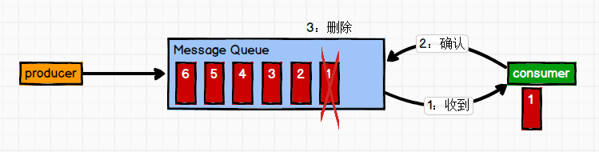

<!-- TOC -->

- [深入浅出 Kafka（一）初识](#深入浅出-kafka一初识)
    - [一、定义](#一定义)
    - [二、消息队列（Message Queue）](#二消息队列message-queue)
        - [传统消息队列的应用场景](#传统消息队列的应用场景)
        - [使用消息队列的好处](#使用消息队列的好处)
        - [消息队列的两种模式](#消息队列的两种模式)
            - [1. 点对点（Queue，不可重复消费）](#1-点对点queue不可重复消费)
            - [2. 发布/订阅（Topic，可以重复消费）](#2-发布订阅topic可以重复消费)
    - [三、Kafka基础架构](#三kafka基础架构)
    - [参考资料](#参考资料)

<!-- /TOC -->
# 深入浅出 Kafka（一）初识

> 开始前，可以阅读 Kafka 官方介绍：[Kafka 中文文档 - ApacheCN](http://kafka.apachecn.org/intro.html)

## 一、定义 

Kafka 是一个分布式的基于发布/订阅模式的消息队列（Message Queue），主要应用于大数据实时处理领域。 

## 二、消息队列（Message Queue）

### 传统消息队列的应用场景

### 使用消息队列的好处 

- 解耦 
  - 允许你独立的扩展或修改两边的处理过程，只要确保它们遵守同样的接口约束。 

- 可恢复性 
  - 系统的一部分组件失效时，不会影响到整个系统。消息队列降低了进程间的耦合度，所以即使一个处理消息的进程挂掉，加入队列中的消息仍然可以在系统恢复后被处理。 

- 缓冲
  - 有助于控制和优化数据流经过系统的速度，解决生产消息和消费消息的处理速度不一致的情况。 

- 灵活性 & 峰值处理能力
  - 在访问量剧增的情况下，应用仍然需要继续发挥作用，但是这样的突发流量并不常见。如果为以能处理这类峰值访问为标准来投入资源随时待命无疑是巨大的浪费。使用消息队列能够使关键组件顶住突发的访问压力，而不会因为突发的超负荷的请求而完全崩溃。 

- 异步通信 
  - 很多时候，用户不想也不需要立即处理消息。消息队列提供了异步处理机制，允许用户把一个消息放入队列，但并不立即处理它。想向队列中放入多少消息就放多少，然后在需要的时候再去处理它们。

### 消息队列的两种模式

Java消息服务（Java Message Service，JMS）规范目前支持两种消息模型：点对点（point to point， queue）和发布/订阅（publish/subscribe，topic）。

#### 1. 点对点（Queue，不可重复消费）

消息生产者生产消息发送到queue中，然后消息消费者从queue中取出并且消费消息。
消息被消费以后，queue中不再有存储，所以消息消费者不可能消费到已经被消费的消息。Queue支持存在多个消费者，但是对一个消息而言，只会有一个消费者可以消费。

#### 2. 发布/订阅（Topic，可以重复消费）

Pub/Sub发布订阅（广播）：使用topic作为通信载体

消息生产者（发布）将消息发布到topic中，同时有多个消息消费者（订阅）消费该消息。和点对点方式不同，发布到topic的消息会被所有订阅者消费。

topic实现了发布和订阅，当你发布一个消息，所有订阅这个topic的服务都能得到这个消息，所以从1到N个订阅者都能得到一个消息的拷贝。

## 三、Kafka基础架构

- **Producer**：消息生产者，就是向kafka broker发消息的客户端；

- **Consumer**：消息消费者，向kafka broker取消息的客户端；

- **Consumer Group(CG)**：消费者组，由多个consumer组成。****消费者组内每个消费者负责消费不同分区的数据，一个分区只能由一个消费者消费；消费者组之间互不影响。所有的消费者都属于某个消费者组，即消费者组是逻辑上的一个订阅者。

- **Broker** 一台kafka服务器就是一个broker。一个集群由多个broker组成。一个broker可以容纳多个topic。

- **Topic** 可以理解为一个队列，**生产者和消费者面向的都是一个topic**；

- **Partidion** 为了实现扩展性，一个非常大的topic可以分布到多个broker（即服务器）上，**一个topic可以分为多个partition**，每个partition是一个有序的队列；（分区主要使用来实现负载均衡）

- **Replica** 副本，为保证集群中的某个节点发生故障时，该节点上的partition数据不丢失，且kafka仍然能够继续工作，kafka提供了副本机制，一个topic的每个分区都有若干个副本，一个**leader**和若干个**follower**。

- **Leader** 每个分区多个副本的“主”，生产者发送数据的对象，以及消费者消费数据的对象都是leader。

- **Follower** 每个分区多个副本中的“从”，实时从leader中同步数据，保持和leader数据的同步。leader发生故障时，某个follower会成为新的follower。

## 参考资料

- [Note/Kafka.md at master · Tiankx1003/Note](https://github.com/Tiankx1003/Note/blob/master/Markdown/HadoopEcosys/Kafka.md)
