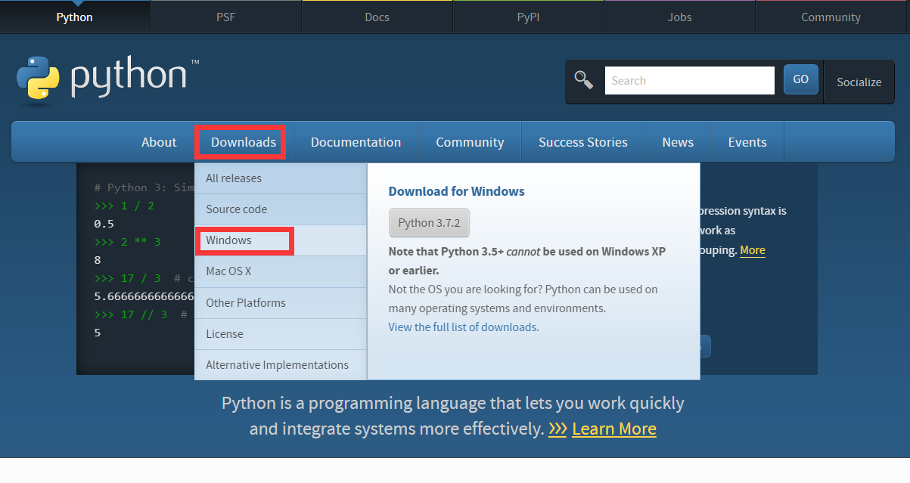
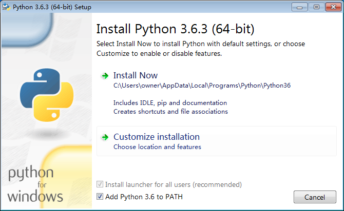
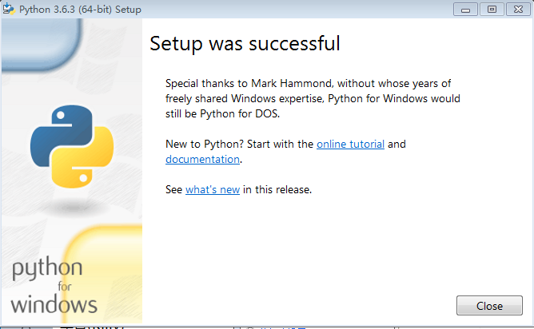
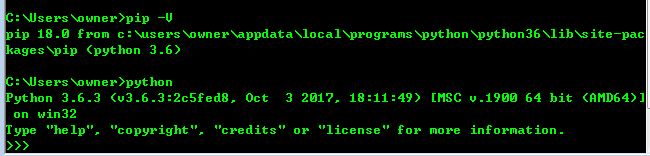
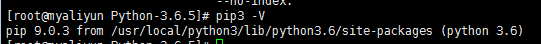
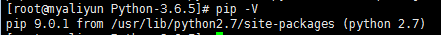

#### Windows安装

---

>  [Python官网](https://www.python.org/)

- 打开官网下载安装包

  

- 安装包介绍

  ```css
  Python 3.6.8 --> Python版本
  Windows X86 web-based installer -->32位 web在线安装，下载包很小
  Windows X86 executable installer -->32位 常见以 .exe 结尾可执行安装包 # 推荐这个
  Windows X86 embeddable zip file -->32位 Zip的源码压缩包
  # 请根据系统 64/32 选择 下载
  X86 --> 32位系统
  X86-64 --> 64位系统
  ```


- 安装

  > # 勾选 Add Python 3.6 to PATH  ---> 自动配置环境变量

  - Install Now ` 默认设置`

  

  - Customize installation ` 自定义安装选项`

  

  > 勾选 pip 
  >
  > 其他可根据情况勾选

  

  > 根据自身情况可选择勾选与修改，一般默认即可
  >
  > 继续 Install 即可

  

##### 验证安装

- 组合键(Win + R) 打开运行，输入`cmd`

  

  

  ```python
  #命令行界面输入
  pip -V
  python # 进入后 exit()可退出 
  # 输出如图示
  ```

  

- 安装结束

#### Liunx安装
---

##### 前言

>  Liunx发行版自带Python2版本
>
>  命令行 python2 | python 即可进入交互式界面

##### 下载安装包

- 安装依赖包

  ```python
  sudo yum install -y openssl-devel bzip2-devel expat-devel gdbm-devel readline-devel sqlite-devel
  ```

- 下载安装包

  ```python
  wget https://www.python.org/ftp/python/3.6.5/Python-3.6.5.tgz
  # 其他版本可在官网下载，以3.65为例
  ```

  > [Python官网](https://www.python.org/ftp/python)

  

##### 安装

- 解压安装

  ```python
  tar -zxvf Python-3.6.5.tgz # 解压安装包
  ```

- 编译安装

  ```python
  # 进入解压后文件夹
  cd Python-3.6.5  
  # 创建安装目录
  mkdir /usr/local/python3
  # 指明安装路径
  ./configure -prefix=/usr/local/python3
  # 编译安装
  sudo make && make install
  ```

  

- 建立软连接

  ```python
  #为python3创建软连接
  sudo ln -s /usr/local/python3/bin/python3 /usr/bin/python3 
  #为pip3创建软连接
  sudo ln -s /usr/local/python3/bin/pip3 /usr/bin/pip3  
  ```

##### 验证

  ```python
# shell界面 输入
python3
# shell输入 
pip3 -V  # V大写
  ```




##### Python2 

- 前面提到Liunx自带Python2版本，但是没有pip包管理工具

- 安装Python2 pip包管理工具

  ```python
  # 安装依赖
  sudo yum -y install epel-release
  # 安装pip
  sudo yum install python-pip
  # 验证
  pip -V
  ```

  

---

#### Mac下安装Python

> [Python官网](https://www.python.org)

##### 源码安装

> Mac也是类unix系统,也可参考Liunx下安装Python方式一致

##### 安装包安装

- 下载Mac安装包

  

  ------

  > 根据系统位数,下载相应版本pkg安装即可

  

  - 双击安装即可

    

##### 验证

```shell
# shell 下
pip -V #v 大写
python3
```

