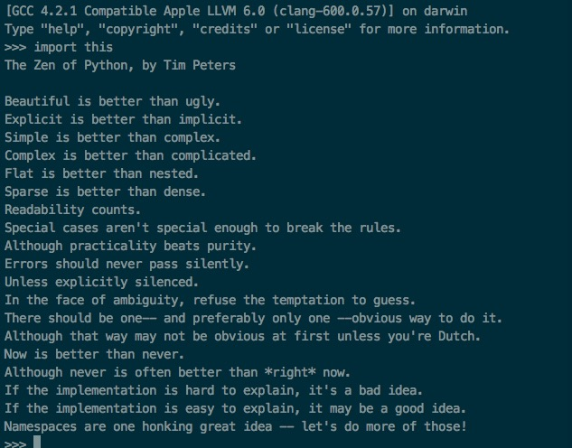

#### Python诞生发展

---

- Python的创始人为吉多·范罗苏姆（Guido van Rossum,江湖人称“龟叔“）。1989年的圣诞节期间，吉多·范罗苏姆为了在阿姆斯特丹打发时间，决心开发一个新的脚本解释程序，作为ABC语言的一种继承。之所以选中Python作为程序的名字，是因为他是BBC电视剧——蒙提·派森的飞行马戏团的爱好者。
- Python 2.0于2000年10月16日发布，增加了实现完整的垃圾回收，并且支持Unicode。同时，整个开发过程更加透明，社群对开发进度的影响逐渐扩大。
- Python 3.0于2008年12月3日发布，此版不完全兼容之前的Python源代码。

#### Python理念

---

- Python 特性
  - Python是完全面向对象的语言,所以**一切皆对象**
  - Python拥有丰富的第三库
  - Python有相对较少的关键字，结构简单，和一个明确定义的语法，学习起来更加简单
  - Python的设计哲学是“优雅”、“明确”、“简单”
  - 等等特性

-  Python不足
  - 饱受诟病的运行速度

    > 个人认为动态语言都有这个小瑕疵

  - 代码无法加密

    > 无法像C JAVA 编译成二进制机器码

- Python应用领域
  - Web程序
  - GUI开发
  - 科学计算
  - 机器学习

- Python小彩蛋
  -  人生苦短,我用Python

    > 等价于“PHP是世界上最好的编程语言”

  - Python之禅

    > Python设计者认为如何使用Python的建议

    ```python
    # Python交互式命令行
    >>> imoport this
    ```

    

#### Python基础语法

------

##### 注释

- 采用`#`行注释

  > 不同于Js，GO等语言采用  // 注释 

  ```python
  # 这是行注释
  print("python")
  ```

- 块注释采用成对`'''`或者`"""`

  ```python
  #!/usr/bin/python3 
  '''
  这是多行注释，用三个单引号
  这是多行注释，用三个单引号 
  这是多行注释，用三个单引号
  '''
  
  """
  这是多行注释，用三个双引号
  这是多行注释，用三个双引号 
  这是多行注释，用三个双引号
  """
  ```

##### 编码

- **Python2** 时采用`ASCII编码 `，**Python3** 采用utf-8为默认编码，支持中文

  ```python
  # -*- coding: utf-8 -*-
  # Python2 中使用中文需要在开头指定编码方式,否则会抛出编码错误异常
  ```


##### 行与缩进

- Python最具特色的就是使用缩进来表示代码块，不需要使用大括号 {}  

  - 个人建议统一使用4个空格缩进
  - **每个代码块内缩进应该一致**

  ```python
  if True:
      print('这是一个代码块'）
  else:
      print('这是又一个代码块'）
  ```

  ------

  ```python
  if True: 
       print("这是一个代码块") 
     print("这是错误的！！")  # 缩进不一致，会导致运行错误
                                      
  File "<tokenize>", line 3
      print("这是错误的！！")
      ^
  IndentationError: unindent does not match any outer indentation level 
  ```

- 多行语句

  - 当一行代码太长是，采用`\`来实现多行语句

  - [], {}, 或 () 中的多行语句，不需要使用反斜杠(\) 

    ```python
    t = "我\
         太\
         长\
         了"
    t = "我" +\
         "太"+\
         "长" +\
         "了"
    ```

    ------

    ```python
    lis = [
        1,
        2,
        3,
    ]
    ```

- 同行显示多局代码

  - Python可以在同一行中使用多条语句，语句之间使用分`;`号分割

    ```python
    # 条件语句 : 后空格 执行语句
    if True: print('这是一个代码块'）
    # 其他语句 ;分割
    print("第一句");print("第二句") 
    ```

     