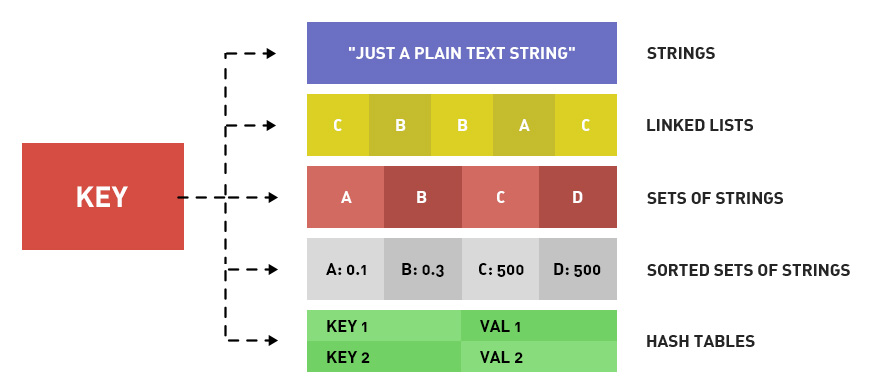
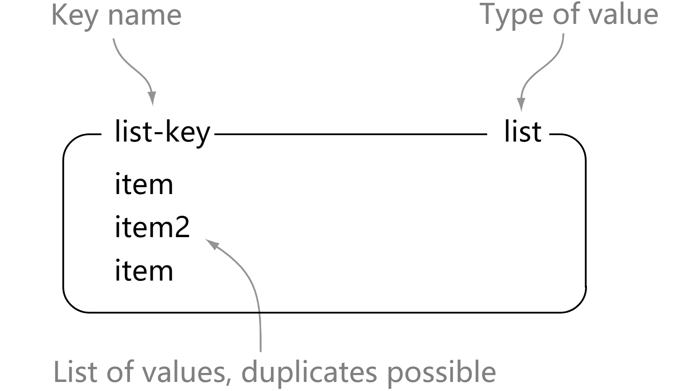
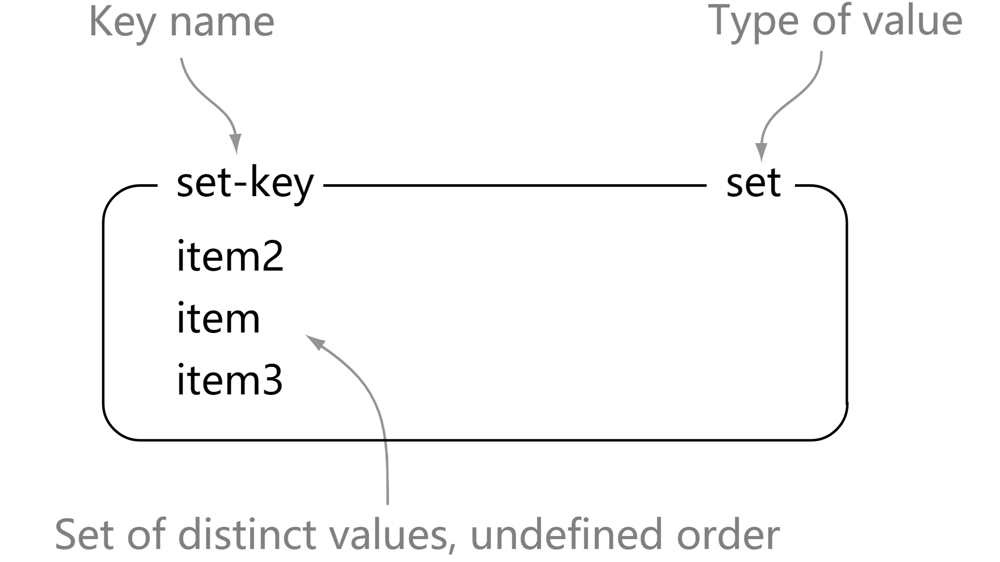
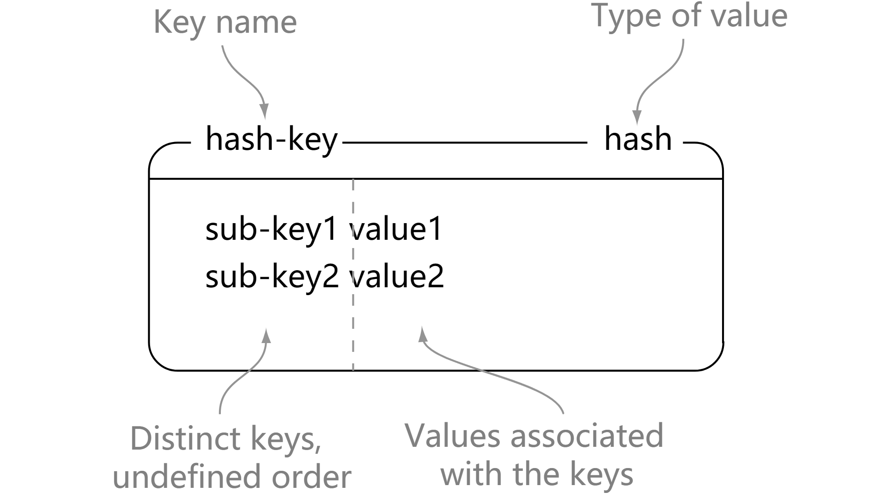

# 前言

这里将持续整理一些 Redis 核心笔记

中文社区：[redis.cn](http://redis.cn/)


# 一、Redis

## 1. 简介


单线程为什么这么快？

1. 纯内存
2. 非阻塞IO
3. 避免线程切换和竞争消耗


单线程Redis注意事项

1. 一次只运行一条命令

2. 拒绝长（慢）命令，例如：keys、flushall、flushdb、slow lua script、mutil/exec、operate big value(collection)

3. Redis其实不是单线程，fysnc file descriptor进行持久化


特性

1. 速度快
2. 持久化
3. 多钟数据结构
4. 支持多种编程语言
5. 功能丰富
6. 简单
7. 主从复制
8. 高可用，分布式


## 2. 应用场景

缓存系统

排行榜

计数器

社交网络

消息队列系统

实时系统


## 3. 数据类型

<div align="center"></div><br/>

| 结构类型 | 结构存储的值                                                 | 结构的读写能力                                               |
| -------- | ------------------------------------------------------------ | ------------------------------------------------------------ |
| STRING   | 可以是字符串、整数或者浮点数                                 | 对整个字符串或者字符串的其中一部分执行操作<br/>对整数和浮点数执行自增或自减操作 |
| LIST     | 一个链表，链表上的每个节点都包含了一个字符串                 | 从两端压入或者弹出元素 <br/>对单个或者多个元素<br/>进行修剪，只保留一个范围内的元素 |
| SET      | 包含字符串的无序收集器（unordered collection），并且被包含的每个字符串都是独一无二、各不相同的 | 添加、获取、移除单个元素<br/>检查一个元素是否存在于集合中<br/>计算交集、并集、差集<br/>从集合里面随机获取元素 |
| HAST     | 包含键值对的无序散列表                                       | 添加、获取、移除单个键值对<br/>获取所有键值对<br/>检查某个键是否存在 |
| ZSET     | 字符串成员（member）与浮点数分值（score）之间的有序映射，元素的排列顺序由分值的大小决定 | 添加、获取、删除元素<br/>根据分值范围或者成员来获取元素<br/>计算一个键的排名 |


### STRING

<div align="center"></div>

**设置语法**

```
set key value [EX seconds] [PX ms] [nx|xx]
```

- key: 键名
- value: 键值
- ex seconds: 键秒级过期时间
- ex ms: 键毫秒及过期时间
- nx: 键不存在才能设置，setnx和nx选项作用一样，用于添加，分布式锁的实现
- xx: 键存在才能设置，setxx和xx选项作用一样，用于更新

**常用命令**

```redis
> set hello world
OK
> get hello
"world"
> del hello
(integer) 1
> get hello
(nil)
```

书中提到一个有趣的概念，批量操作mget可以提供效率节省时间

逐条 get/se t的时间消耗公式：

```
n次get/set时间 = n次网络时间 + n次命令时间
```

批量get/set的时间消耗公式： `n次get/set时间 = 1次网络时间 + n次命令时间`

合理的使用批量操作可以提高Redis性能，但是注意不要量太大，**如果过量的话可能会导致Redis阻塞**


**时间复杂度**

- set: O(1)
- get: O(1)
- del: O(k)，k为键的个数
- mget: O(k)，k为键的个数
- mset: O(k)，k为键的个数
- append: O(1)
- str: O(1)
- getrange: O(n), n为字符串的长度


**内部编码**

- int: 8字节长整型
- embstr: 小于39字节值
- raw: 大于39字节的值


**典型场景**

- 缓存
- 计算器
- 分布式锁


**场景**

- 缓存
- 计算器
- 分布式锁


### LIST

<div align="center"></div>

```shell
> rpush list-key item
(integer) 1
> rpush list-key item2
(integer) 2
> rpush list-key item
(integer) 3
> lrange list-key 0 -1
1) "item"
2) "item2"
3) "item"
> lindex list-key 1
"item2"
> lpop list-key
"item"
> lrange list-key 0 -1
1) "item2"
2) "item"
```


### SET


<div align="center"></div>

```shell
> sadd set-key item
(integer) 1
> sadd set-key item2
(integer) 1
> sadd set-key item3
(integer) 1
> sadd set-key item
(integer) 0
> smembers set-key
1) "item"
2) "item2"
3) "item3"
> sismember set-key item4
(integer) 0
> sismember set-key item
(integer) 1
> srem set-key item2
(integer) 1
> srem set-key item2
(integer) 0
> smembers set-key
1) "item"
2) "item3"
```


### HASH

<div align="center"></div>

**创建哈希类型的键值**

```shell
127.0.0.1:6379> hset user name LotusChing 
(integer) 1
127.0.0.1:6379> hset user age 21
(integer) 1
127.0.0.1:6379> hset user gender "Male"
(integer) 1
```

HSET 不支持创建一次性创建多field

```shell
127.0.0.1:6379> hset user name "LotusChing" age 21
(error) ERR wrong number of arguments for 'hset' command
```

**获取哈希键中的field值**

```shell
127.0.0.1:6379> hget user name
"LotusChing"
127.0.0.1:6379> hget user age
"21"
127.0.0.1:6379> hget user gender
"Male"
```

HGET 不支持一次获取多个field

**获取哈希键中的fields**

```shell
127.0.0.1:6379> hekys user
1) "name"
2) "age"
```

**获取哈希键中的所有field的value**

```shell
127.0.0.1:6379> hvals user
1) "LotusChing"
2) "21"
```

**删除哈希键中某个field**

```shell
127.0.0.1:6379> hdel user age
(integer) 1
127.0.0.1:6379> hkeys user
1) "name"
```

**统计哈希中field的个数**

```shell
127.0.0.1:6379> hkeys user
1) "name"
2) "age"
3) "gender"
127.0.0.1:6379> hlen user
(integer) 3
```

**批量设置哈希键的field**

```shell
127.0.0.1:6379> hmset user name "LotusChing" age 21 gender "Male"
OK
127.0.0.1:6379> hkeys user
1) "name"
2) "age"
3) "gender"
127.0.0.1:6379> hvals user
1) "LotusChing"
2) "21"
3) "Male"
```

**批量获取哈希键中field的value**

```shell
127.0.0.1:6379> hmget user name age gender
1) "LotusChing"
2) "21"
3) "Male"
```

**判断哈希键中field是否存在**

```shell
127.0.0.1:6379> hexists user name
(integer) 1
127.0.0.1:6379> hexists user hobbies
(integer) 0
```

**一次性获取哈希键中所有的fields和values**

注意：尽量避免使用`hgetall`，因为如果哈希键field过多的话，可能会导致Redis阻塞，建议使用`hmget`获取所需哈希键中的field值，或者采用`hscan`

```shell
127.0.0.1:6379> hgetall user
1) "name"
2) "LotusChing"
3) "age"
4) "21"
5) "gender"
6) "Male"
```


### ZSET

<div align="center"></div>


```shell
> zadd zset-key 728 member1
(integer) 1
> zadd zset-key 982 member0
(integer) 1
> zadd zset-key 982 member0
(integer) 0
> zrange zset-key 0 -1 withscores
1) "member1"
2) "728"
3) "member0"
4) "982"
> zrangebyscore zset-key 0 800 withscores
1) "member1"
2) "728"
> zrem zset-key member1
(integer) 1
> zrem zset-key member1
(integer) 0
> zrange zset-key 0 -1 withscores
1) "member0"
2) "982"
```


参考资料：

- [Chapter 1: Getting to know Redis | Redis Labs](https://redislabs.com/ebook/part-1-getting-started/chapter-1-getting-to-know-redis/)


## 4. 通用命令

- keys

- dbsize

- del

- exists

- expire key seconds

- ttl

- persist

- type


**过期时间**

```shell
redis> SET cache_page "www.google.com"
OK

redis> EXPIRE cache_page 30  # 设置过期时间为 30 秒
(integer) 1

redis> TTL cache_page    # 查看剩余生存时间
(integer) 23

redis> EXPIRE cache_page 30000   # 更新过期时间
(integer) 1

redis> TTL cache_page
(integer) 29996
```


## 6. Redis持久化

Redis 持久化之RDB和AOF - ITDragon龙 - 博客园
https://www.cnblogs.com/itdragon/p/7906481.html


# 参考资料

- [ops_book/listlie-886829.md at master · LotusChing/ops_book](ops_book/listlie-886829.md at master · LotusChing/ops_book)


# 更新日志

- 2018/9/4 init1.0