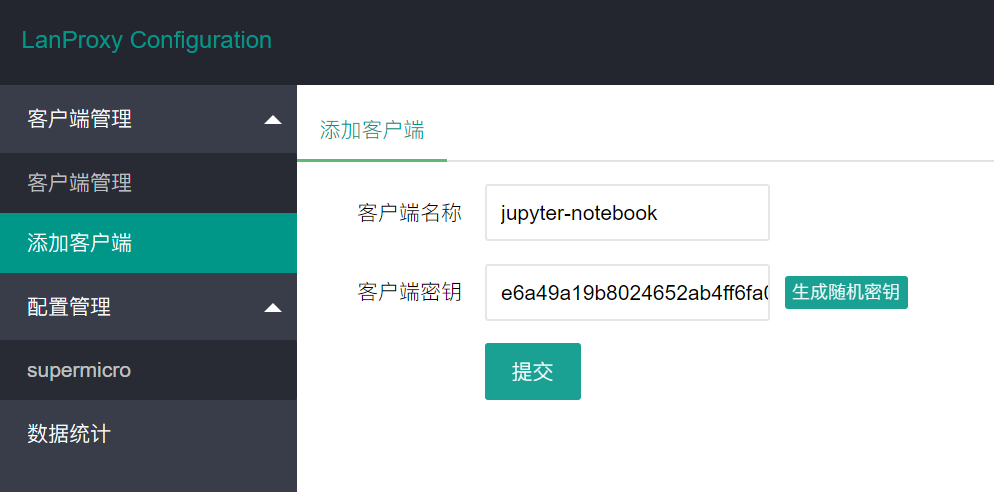
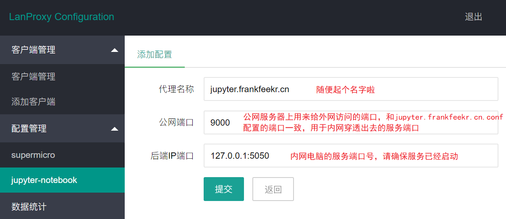
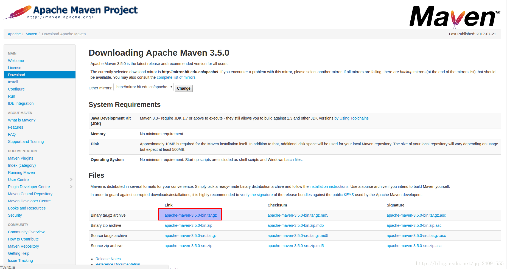
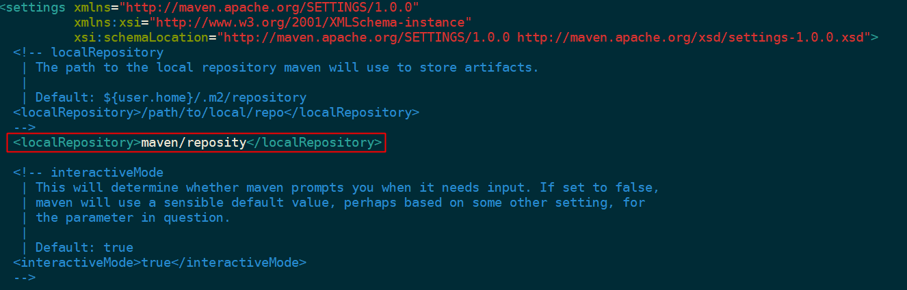
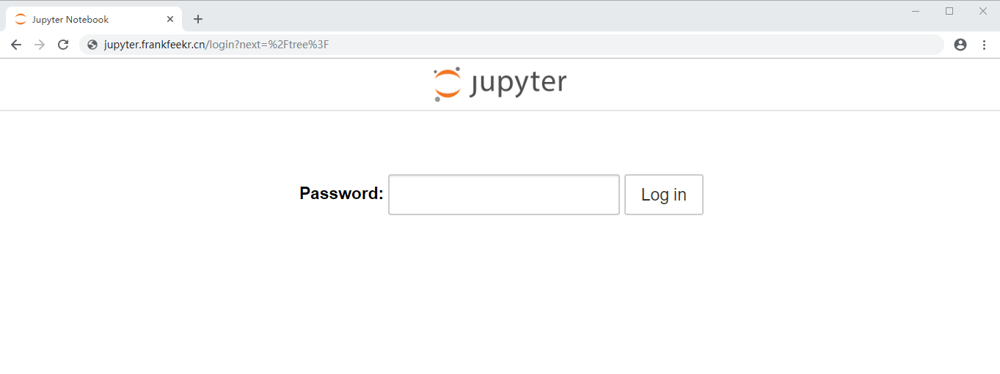
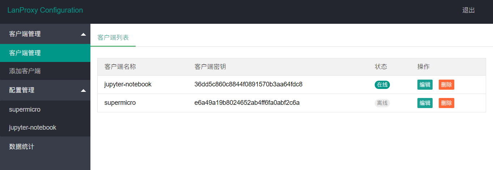
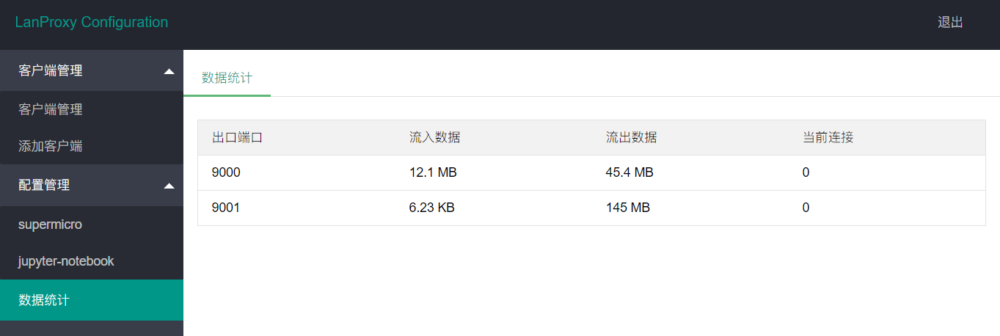

<!-- TOC -->

- [手把手教你，搭建内网穿透服务](#手把手教你搭建内网穿透服务)
    - [一、概述](#一概述)
        - [1.1 什么是内网穿透](#11-什么是内网穿透)
        - [1.2 什么是 lanproxy](#12-什么是-lanproxy)
        - [1.3 原理](#13-原理)
    - [二、快速开始](#二快速开始)
        - [2.1 硬件与环境要求](#21-硬件与环境要求)
        - [2.2 公网服务器配置（Docker 一键启动）](#22-公网服务器配置docker-一键启动)
            - [基础环境安装](#基础环境安装)
            - [通过 Docker，启动 lanproxy 服务](#通过-docker启动-lanproxy-服务)
            - [Nginx 反向代理配置域名](#nginx-反向代理配置域名)
            - [继续配置 lanproxy 后台服务](#继续配置-lanproxy-后台服务)
        - [2.3 内网电脑配置（Java 客户端）](#23-内网电脑配置java-客户端)
            - [Java 1.8 安装](#java-18-安装)
            - [maven 安装](#maven-安装)
            - [启动内网服务](#启动内网服务)
            - [运行 lanproxy client 服务](#运行-lanproxy-client-服务)
            - [lanproxy 网页后台服务](#lanproxy-网页后台服务)
        - [2.4 内网电脑配置（GO 客户端）](#24-内网电脑配置go-客户端)
            - [安装Go环境安装](#安装go环境安装)
            - [拉取 ffay/lanproxy-go-client 代码](#拉取-ffaylanproxy-go-client-代码)
            - [安装客户端依赖包](#安装客户端依赖包)
            - [启动客户端](#启动客户端)
    - [三、总结](#三总结)
    - [参考资料](#参考资料)

<!-- /TOC -->

# 手把手教你，搭建内网穿透服务

在很多场景下内网穿透都是我们常常遇到的需求，之前也用过花生壳、ngrok、FRP 等等一些工具，但是由于限速、收费、安全各方面因素只好放弃了。

目前所在实验室主要从事深度学习和机器学习相关工作，有一台高配 GPU 计算型服务器，大家使用 Jupyter Notebook 在网页上进行编码工作，但是只能在学院内网才能进行使用，在外面就无法使用让人比较抓狂。如果购买阿里云等深度学习服务，价格昂贵，只好决定通过内网穿透实现公网工作。

近期无意间看到 [「传送门：lanproxy」](https://github.com/ffay/lanproxy) 这款开源工具，正好实验室购置了一台公网服务器，正好可以实现内网穿透，决定入坑折腾一番。对于有后台开发基础的同学还是挺简单的，不过好记性不如烂笔头，来吧，这里手把手深入探索一番。


## 一、概述

### 1.1 什么是内网穿透

好吧，先上一段百度百科的定义

> 内网穿透，即NAT穿透，网络连接时术语，计算机是局域网内时，外网与内网的计算机节点需要连接通信，有时就会出现不支持内网穿透。

反正简单来说，就是能通过公网访问你的内网服务，把你的内网通过一台公网服务器，穿透出去。


### 1.2 什么是 lanproxy

lanproxy 是一个将局域网个人电脑、服务器代理到公网的内网穿透工具，目前仅支持 tcp 流量转发，可支持任何 tcp 上层协议（访问内网网站、本地支付接口调试、ssh 访问、远程桌面...）。目前市面上提供类似服务的有花生壳、TeamView、GoToMyCloud 等等，但要使用第三方的公网服务器就必须为第三方付费，并且这些服务都有各种各样的限制，此外，由于数据包会流经第三方，因此对数据安全也是一大隐患。[https://lanproxy.io2c.com](https://lanproxy.io2c.com/)


### 1.3 原理

内网穿透的原理如下图所示：

1. 用户访问我们的服务器，这个服务器是有公网IP的，所以用户可以无压力访问
2. 服务器与本地电脑保持长链接，当有请求的时候，服务器将请求转发到我们的本地电脑
3. 本地电脑将响应回复给服务器
4. 服务器将响应回复给用户


   <div align="center"></div>


要搭建内网穿透，我们得完成两个任务

1. 在公网能访问的服务器上运行我们的内网穿透服务；
2. 在本地电脑上面运行内网穿透客户端。

当然，你可以自己根据原理实现一套，不过我们有现成的三方开源工具，可以帮我们实现这一套功能。这个就是我们今天的主角 [lanproxy](https://github.com/ffay/lanproxy)。

 

## 二、快速开始

> 这里我将手把手带你配置 lanproxy 穿透服务，这里配置主要分成了 **公网服务器配置** 和 **内网电脑配置** 。
>
> 在内网电脑配置中分为：Java 客户端和 GO 客户端

### 2.1 硬件与环境要求

> 这里以我的环境为例

1. **一台公网服务器**（Centos 7.4，当然这不重要，反正都 docker 啦）
   - docker（简化更多的配置，这里采用 docker 容器进行搭建）
   - Nginx 环境
2. **一台内网电脑**（Ubuntu 16.04）
   - Java JDK 1.8
   - Maven（包依赖管理工具）
   - docker 启动服务，tensorflow（jupyter notebook）
3. **已备案的域名**
   - 此步骤也可省略，但端口太多通过 Nginx 配合域名进行转发，使用更加方便。故这里我也将会配置两个公网域名


### 2.2 公网服务器配置（Docker 一键启动）

#### 基础环境安装

1. 安装 docker 服务，以 CentOS 7.4 为例

```shell
1、安装依赖包
$ sudo yum install -y yum-utils  device-mapper-persistent-data  lvm2

2、设置稳定版仓库
$ sudo yum-config-manager   --add-repo  https://download.docker.com/linux/centos/docker-ce.repo

3、安装
//安装最新版本
$ sudo yum install docker-ce

//或者安装指定版本
$ yum list docker-ce --showduplicates | sort -r
    //显示有以下版本
    docker-ce.x86_64            18.03.0.ce-1.el7.centos             docker-ce-stable
//指定一个版本进行安装
$ sudo yum install docker-ce-<VERSION STRING>

4、启动doker
$ sudo systemctl start docker

5、通过运行hello-world镜像验证安装是否成功
$ sudo docker run hello-world
```

2. 安装 Nginx 服务，以 CentOS 7.4 为例

```shell
1.添加Nginx到YUM源
$ sudo rpm -Uvh http://nginx.org/packages/centos/7/noarch/RPMS/nginx-release-centos-7-0.el7.ngx.noarch.rpm

2.安装Nginx
$ sudo yum install -y nginx
Nginx将完成安装在你的CentOS 7 服务器中。

3.启动Nginx
$ service nginx start
```

- 更多配置请参考：[CentOS 7 yum 安装 Nginx - 菜鸟路上的小白 - CSDN博客](https://blog.csdn.net/u012486840/article/details/52610320)


#### 通过 Docker，启动 lanproxy 服务

启动 Docker 后运行一下代码

```
docker run -d \
           --name lanproxy-server \
           -p 8090:8090 \
           -p 4900:4900 \
           -p 4993:4993 \
           -p 9000-9100:9000-9100 \
           biodwhu/lanproxy
```

输入你的公网服务器 IP:8090，例如：http://120.92.10.120:8090/，即可看到如下的界面。好啦，到这里 lanproxy 的基础环境已经搭建成功，是不是很快，这就是 docker 的魅力。如果不用 docker 启动，请参考 lanproxy 的官方文档。


默认：account/password：admin/admin


#### Nginx 反向代理配置域名

在上一步，我们通过 docker 启动了一个 lanproxy 环境，但是通过 IP 和端口号组合的方式并不优雅。这里我将解析两个域名通过 Nginx 进行端口转发。

```shell
# 两个域名都解析到你的公网上去

# 这个域名由于访问 lanproxy 管理后台
lanproxy.frankfeekr.cn  => 120.92.10.120  | Nginx to => 127.0.0.1:8090

# 这个域名由于访问你的内网电脑服务，9000 端口可自由的在 lanproxy 管理后台进行配置
jupyter.frankfeekr.cn   => 120.92.10.120  | Nginx to => 127.0.0.1:9000
```


好啦，上门就是对域名进行了一些简单的解释，现在开始 Nginx 的配置

1. 进入 `/etc/nginx/conf.d` Nginx 的配置目录，在这里创建配置文件

2. 创建 `lanproxy.frankfeekr.cn.conf` 配置文件

```yml
server {
    listen 80;
    # 这里使用自己的域名
    server_name lanproxy.frankfeekr.cn;
    charset utf-8;
    location / {
        proxy_set_header   X-Real-IP $remote_addr;
        proxy_set_header   Host      $http_host;
        # 这里根据你的 lanproxy 配置，改成 config.server.port的值
        proxy_pass       http://127.0.0.1:8090;
        client_max_body_size 35m;
        proxy_http_version 1.1;
        proxy_set_header Upgrade $http_upgrade;
        proxy_set_header Connection "upgrade";
    }
}
```

3. 创建  `jupyter.frankfeekr.cn.conf` 配置文件

```yml
server {
    listen 80;
    # 这里使用自己的域名
    server_name jupyter.frankfeekr.cn;
    charset utf-8;
    location / {
        proxy_set_header   X-Real-IP $remote_addr;
        proxy_set_header   Host      $http_host;
        # 这里根据你的lanproxy配置，改成 外网接口 的值，在lanproxy后台网页上配置，后面配置
        proxy_pass       http://127.0.0.1:9000;
        client_max_body_size 35m;
        proxy_http_version 1.1;
        proxy_set_header Upgrade $http_upgrade;
        proxy_set_header Connection "upgrade";
    }
}
```

4. 重启 Nginx 服务

```shell
$ service nginx restart
```


至此，你可以通过域名 http://lanproxy.frankfeekr.cn 进行访问 lanproxy 网页后台配置


#### 继续配置 lanproxy 后台服务

1. 添加一个客户端



2. 添加配置




至此，服务端的配置就完成了。下面开始内网电脑的配置。


### 2.3 内网电脑配置（Java 客户端）

> 这里我的内网是一台 Ubuntu 16.04 的服务器，以下我都将以此为例

#### Java 1.8 安装

1. 下载 JDK1.8（lanproxy 支持 JDK1.7 以上环境）

```shell
$ wget https://download.oracle.com/otn-pub/java/jdk/8u191-b12/2787e4a523244c269598db4e85c51e0c/jdk-8u191-linux-x64.tar.gz
```

1. 解压安装包，移动文件夹到 /user/lib 目录

```shell
$ tar -zxvf jdk-8u191-linux-x64.tar.gz
$ mv jdk1.8.0_191 /usr/lib/jdk/jdk1.8.0_191
```

1. 环境变量配置

   这里是将环境变量配置在 etc/profile，即为所有用户配置 JDK 环境。

```shell
$ vim + etc/profile
```

​	环境设置

```shell
#set java env
export JAVA_HOME=/usr/lib/jdk/jdk1.8.0_191
export JRE_HOME=${JAVA_HOME}/jre    
export CLASSPATH=.:${JAVA_HOME}/lib:${JRE_HOME}/lib    
export PATH=${JAVA_HOME}/bin:$PATH
```

​	执行命令使修改立即生效

```shell
$ source /etc/profile
```

1. 配置软连接

   软连接相当于windows系统中的快捷键，部分软件可能会从/usr/bin目录下查找Java，因此添加该软连接防止其他软件查找不到的情况。

```shell
$ sudo update-alternatives --install /usr/bin/java  java  /usr/lib/jdk/jdk1.8.0_191/java 300   
$ sudo update-alternatives --install /usr/bin/javac  javac  /usr/lib/jdk/jdk1.8.0_191/bin/javac 300 
```

1. 测试安装是否成功

```shell
# 在终端输入，出现版本号则表示安装成功
$ java -version
```


更详细文档：

- [ubuntu16.04搭建jdk1.8运行环境 - 朝花夕拾 - CSDN博客](https://blog.csdn.net/smile_from_2015/article/details/80056297)


#### maven 安装

maven 是个项目管理工具，在编程领域应用广泛。

1.  [官网](http://maven.apache.org/download.cgi) 下载maven。


```shell
$ wget https://www-eu.apache.org/dist/maven/maven-3/3.6.0/binaries/apache-maven-3.6.0-bin.tar.gz
```

2. 解压到 /opt/maven 目录

创建 manve 目录。

```shell
$ sudo mkdir /opt/maven
```

解压到 /opt/maven 目录下。

```shell
$ sudo tar zxvf apache-maven-3.6.0-bin.tar.gz -C /opt/maven
```

3. 配置 maven 环境

```shell
$ vim + /etc/profile
```

在文件内容后面添加以下内容：

```shell
# set maven env
export M2_HOME=/opt/maven/apache-maven-3.6.0
export CLASSPATH=$CLASSPATH:$M2_HOME/lib
export PATH=$PATH:$M2_HOME/bin
```

保存，输入以下命令使配置文件生效。

```shell
$ source /etc/profile
```

验证是否安装成功。

```shell
$ mvn -v
```

4. 修改 maven 源为阿里云，以及仓库默认存放路径。这样 maven 下载 jar 包的速度会快很多。

打开 maven 的配置文件

```shell
$ vim /opt/maven/apache-maven-3.6.0/conf/settings.xml
```

在 /home 目录下生成 maven/repository 文件夹



```xml
<localRepository>maven/reposity</localRepository>
```

修改源


```xml
<mirrors>
    <mirror>
      <id>alimaven</id>
      <name>aliyun maven</name>
  　　<url>http://maven.aliyun.com/nexus/content/groups/public/</url>
      <mirrorOf>central</mirrorOf>        
    </mirror>
</mirrors>
```


至此，Maven 安装成功


参考资料：

- [ubuntu16.04安装maven - Rocky的编程随记 - CSDN博客](https://blog.csdn.net/qq_24091555/article/details/76039475)


#### 启动内网服务

在前面我们将 jupyter.frankfeekr.cn 反向代理（公网服务器 9000 服务，内网 5050）


这里我们需要确保在内网电脑上，浏览器能够访问到 127.0.0.1:5050 这个服务。以我的 jupyter notebook 为例：


这里，我的内网服务已经启动。接下来只需要启动 lanproxy 客户端即可。


#### 运行 lanproxy client 服务

官方提供了两种方式运行客户端，一种方式是使用官方提供的 GO，另一种通过 Java 环境运行。本文采用主流的 Java 方式运行

1. 克隆 `lanproxy` 代码到本地电脑

```bash
$ git clone https://github.com/ffay/lanproxy.git lanproxy
```

2. 打包 `lanproxy`
   打包之前需要确保你安装了 `maven`

```bash
$ cd lanproxy
$ mvn package
```

3. 修改配置文件信息
   打包完成之后，客户端文件会出现在 `distribution/proxy-client-0.1` 目录下，打开之后有是个文件夹：`bin`、`conf`、`lib`和`log`，配置信息在 `conf/config.properties` 文件内，根据前面服务端的配置信息修改一下。

```bash
# 这里是在lanproxy后台配置的密钥
client.key=e6a49a19b8024652ab4ff2210abf2c6a

# 配置ssl信息，根据服务端的配置填写（enable = false 就不需要配置）
ssl.enable=false
ssl.jksPath=test.jks
ssl.keyStorePassword=123456

# 服务器的ip
server.host=120.92.10.120

#proxy-server ssl默认端口4993，默认普通端口4900
#ssl.enable=true时这里填写ssl端口，ssl.enable=false时这里填写普通端口
server.port=4900
```

4. 启动客户端
   客户端信息配置完成之后就可以启动客户端了

```bash
# mac/linux使用这个
$ bash  bin/startup.sh

# Windows 直接运行 bin/startup.bat
```

5. 访问测试

   至此，即可通过公网域名 http://jupyter.frankfeekr.cn 访问内网服务，实现内网穿透



当然你也可以通过公网 IP 和域名访问，例如：http://120.92.10.120:9000 这种方式访问！

6. 停止客户端

```shell
$ bash  bin/stop.sh
```


#### lanproxy 网页后台服务

客户端启动服务后，后台可查看状态（在线 / 离线）




流量统计




### 2.4 内网电脑配置（GO 客户端）

GitHub 客户端主页：[lanproxy-go-client](https://github.com/ffay/lanproxy-go-client)

不想安装 Java 环境的可以选择 Go

#### 安装Go环境安装

**1. buntu、Debian或Linux Mint安装Go语言**

基于 Debian的 Linux 发行版本都可以使用 apt-get 命令来进行安装：

```shell
sudo apt-get install golang
```

要查看当前系统安装的 Go 语言版本可以使用如下命令：

```shell
go version
```

由于 Go 代码必需保存在 workspace(工作区)中，所以我们必需在 **Home** 目录(例如 ~/workspace)创建一个**workspace** 目录并定义 **GOPATH** 环境变量指向该目录，这个目录将被 Go 工具用于保存和编辑二进制文件。

```shell
mkdir ~/workspace
echo 'export GOPATH="$HOME/workspace"' >> ~/.bashrc
source ~/.bashrc
```

根据不同的需要，我们可以使用 apt-get 安装 Go tools：

```shell
sudo apt-cache search golang
```


**2. Fedora、CentOS或RHEL安装Go语言**

基于 Red Hat 的 Linux 发行版本都可以使用 yum 命令来进行安装：

```shell
sudo yum update
sudo yum install golang
```

要查看当前系统安装的 Go 语言版本可以使用如下命令：

```shell
go version
```

接下来还是在 Home 目录(例如 ~/workspace)创建一个 workspace 目录并定义 GOPATH 环境变量指向该目录，这个目录将被 Go 工具用于保存和编辑二进制文件。

```shell
mkdir ~/workspace
echo 'export GOPATH="$HOME/workspace"' >> ~/.bashrc
source ~/.bashrc
```

根据不同的需要，我们可以使用 yum 安装 Go tools：

```shell
yum search golang
```


参考资料：[如何为Linux安装Go语言 - Go语言中文网 - Golang中文社区](https://studygolang.com/articles/7482)


#### 拉取 ffay/lanproxy-go-client 代码

```shell
git clone https://github.com/ffay/lanproxy-go-client.git
```


#### 安装客户端依赖包

```shell
cd lanproxy-go-client
sh build-release.sh
```

安装后，这时候在目录下会出现文件。


#### 启动客户端

**普通端口连接**

```shell
# mac 64位
nohup ./client_darwin_amd64 -s SERVER_IP -p SERVER_PORT -k CLIENT_KEY &

# linux 64位
nohup ./client_linux_amd64 -s SERVER_IP -p SERVER_PORT -k CLIENT_KEY &

# windows 64 位
./client_windows_amd64.exe -s SERVER_IP -p SERVER_PORT -k CLIENT_KEY
```


**SSL端口连接**

```shell
# mac 64位
nohup ./client_darwin_amd64 -s SERVER_IP -p SERVER_SSL_PORT -k CLIENT_KEY -ssl true &

# linux 64位
nohup ./client_linux_amd64 -s SERVER_IP -p SERVER_SSL_PORT -k CLIENT_KEY -ssl true &

# windows 64 位
./client_windows_amd64.exe -s SERVER_IP -p SERVER_SSL_PORT -k CLIENT_KEY -ssl true
```

例如：

```
nohup ./client_linux_amd64 -s lp.thingsglobal.org -p 4900 -k 01c1e176d6ee466c8db717a8 &
```

命令参数：

```shell
GLOBAL OPTIONS:
   -k value       client key
   -s value       proxy server host
   -p value       proxy server port (default: 4900)
   --ssl value    enable ssl (default: "false", -p value should be server ssl port)
   --cer value    ssl cert path, default skip verify certificate
   --help, -h     show help
   --version, -v  print the version
```


## 三、总结

通过以上的配置，只要有一台公网电脑，即可实现内网穿透功能。摆脱花生壳的域名端口限制，流量限制，带宽限制。笔者的公网服务器为 6M 带宽，通过公网映射，文件下载测试大概在 800K/s - 1.5M/s 范围，如果仅是普通的网站服务完全可以完美穿透。


## 参考资料

- [基于docker搭建lanproxy内网穿透服务 - 奉强的个人博客](https://www.fengqiangboy.com/15229403526064.html)
- [lanproxy GitHub 官方主页](https://github.com/fengqiangboy/lanproxy-docker)
- [linux设置开机自启动 - ssooking - 博客园](https://www.cnblogs.com/ssooking/p/6094740.html)


