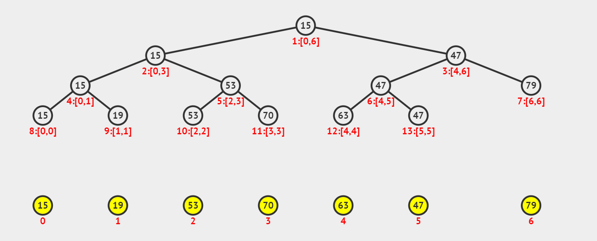
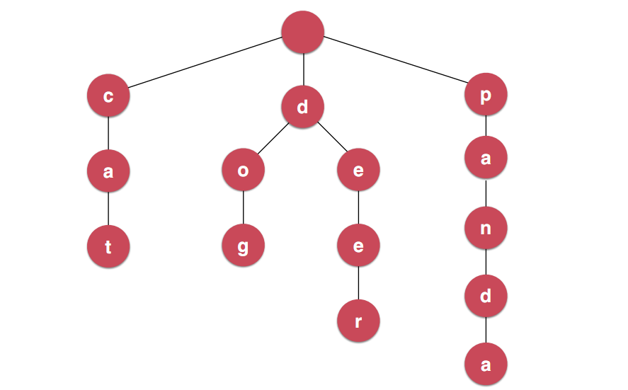

# 数据结构

## 一、基础数据结构

### 字符串

- 标准库，解析，匹配等

### 线性表

- 数组	

- 动态数组

### 栈和队列

### 链表

### 哈希表


## 二、高级数据结构

### 1. 线段树

线段树（segment tree），顾名思义， 是用来存放给定区间（segment, or interval）内对应信息的一种数据结构。与树状数组（binary indexed tree）相似，线段树也用来处理数组相应的区间查询（range query）和元素更新（update）操作。与树状数组不同的是，线段树不止可以适用于区间求和的查询，也可以进行区间最大值，区间最小值（Range Minimum/Maximum Query problem）或者区间异或值的查询。

对应于树状数组，线段树进行更新（update）的操作为 O(logn)，进行区间查询（range query）的操作也为 O(logn)。



在线可视化：https://visualgo.net/en/segmenttree


#### 303. 区域和检索 - 数组不可变 （LeetCode）


https://leetcode-cn.com/problems/range-sum-query-immutable

```java
class NumArray {
    private int[] data;

    public NumArray(int[] nums) {
        this.data = new int[nums.length];
        for (int i = 0; i < nums.length; i++) {
            this.data[i] = nums[i];
        }
    }

    public void update(int index, int val) {
        this.data[index] = val;
    }

    public int sumRange(int left, int right) {
        int sum = 0;
        for (int i = left; i <= right; i++) {
            sum += this.data[i];
        }
        return sum;
    }
}
```


#### 307. 区域和检索 - 数组可修改 （LeetCode）

https://leetcode-cn.com/problems/range-sum-query-mutable

```java

class NumArray {
    public class SegmentTree<E> {
        private E[] tree;
        private E[] data;
        private Merger<E> merger;

        public SegmentTree(E[] arr, Merger<E> merger){

            this.merger = merger;

            data = (E[])new Object[arr.length];
            for(int i = 0 ; i < arr.length ; i ++)
                data[i] = arr[i];

            tree = (E[])new Object[4 * arr.length];
            buildSegmentTree(0, 0, arr.length - 1);
        }

        // 在treeIndex的位置创建表示区间[l...r]的线段树
        private void buildSegmentTree(int treeIndex, int l, int r){

            if(l == r){
                tree[treeIndex] = data[l];
                return;
            }

            int leftTreeIndex = leftChild(treeIndex);
            int rightTreeIndex = rightChild(treeIndex);

            // int mid = (l + r) / 2;
            int mid = l + (r - l) / 2;
            buildSegmentTree(leftTreeIndex, l, mid);
            buildSegmentTree(rightTreeIndex, mid + 1, r);

            tree[treeIndex] = merger.merge(tree[leftTreeIndex], tree[rightTreeIndex]);
        }

        public int getSize(){
            return data.length;
        }

        public E get(int index){
            if(index < 0 || index >= data.length)
                throw new IllegalArgumentException("Index is illegal.");
            return data[index];
        }

        // 返回完全二叉树的数组表示中，一个索引所表示的元素的左孩子节点的索引
        private int leftChild(int index){
            return 2*index + 1;
        }

        // 返回完全二叉树的数组表示中，一个索引所表示的元素的右孩子节点的索引
        private int rightChild(int index){
            return 2*index + 2;
        }

        // 返回区间[queryL, queryR]的值
        public E query(int queryL, int queryR){

            if(queryL < 0 || queryL >= data.length ||
                    queryR < 0 || queryR >= data.length || queryL > queryR)
                throw new IllegalArgumentException("Index is illegal.");

            return query(0, 0, data.length - 1, queryL, queryR);
        }

        // 在以treeIndex为根的线段树中[l...r]的范围里，搜索区间[queryL...queryR]的值
        private E query(int treeIndex, int l, int r, int queryL, int queryR){

            if(l == queryL && r == queryR)
                return tree[treeIndex];

            int mid = l + (r - l) / 2;
            // treeIndex的节点分为[l...mid]和[mid+1...r]两部分

            int leftTreeIndex = leftChild(treeIndex);
            int rightTreeIndex = rightChild(treeIndex);
            if(queryL >= mid + 1)
                return query(rightTreeIndex, mid + 1, r, queryL, queryR);
            else if(queryR <= mid)
                return query(leftTreeIndex, l, mid, queryL, queryR);

            E leftResult = query(leftTreeIndex, l, mid, queryL, mid);
            E rightResult = query(rightTreeIndex, mid + 1, r, mid + 1, queryR);
            return merger.merge(leftResult, rightResult);
        }

        // 将index位置的值，更新为e
        public void set(int index, E e){

            if(index < 0 || index >= data.length)
                throw new IllegalArgumentException("Index is illegal");

            data[index] = e;
            set(0, 0, data.length - 1, index, e);
        }

        // 在以treeIndex为根的线段树中更新index的值为e
        private void set(int treeIndex, int l, int r, int index, E e){

            if(l == r){
                tree[treeIndex] = e;
                return;
            }

            int mid = l + (r - l) / 2;
            // treeIndex的节点分为[l...mid]和[mid+1...r]两部分

            int leftTreeIndex = leftChild(treeIndex);
            int rightTreeIndex = rightChild(treeIndex);
            if(index >= mid + 1)
                set(rightTreeIndex, mid + 1, r, index, e);
            else // index <= mid
                set(leftTreeIndex, l, mid, index, e);

            tree[treeIndex] = merger.merge(tree[leftTreeIndex], tree[rightTreeIndex]);
        }

        @Override
        public String toString(){
            StringBuilder res = new StringBuilder();
            res.append('[');
            for(int i = 0 ; i < tree.length ; i ++){
                if(tree[i] != null)
                    res.append(tree[i]);
                else
                    res.append("null");

                if(i != tree.length - 1)
                    res.append(", ");
            }
            res.append(']');
            return res.toString();
        }
    }

    public interface Merger<E> {
        E merge(E a, E b);
    }

    private SegmentTree<Integer> segTree;

    public NumArray(int[] nums) {

        if(nums.length != 0){
            Integer[] data = new Integer[nums.length];
            for(int i = 0 ; i < nums.length ; i ++)
                data[i] = nums[i];
            segTree = new SegmentTree<>(data, (a, b) -> a + b);
        }
    }

    public void update(int i, int val) {
        if(segTree == null)
            throw new IllegalArgumentException("Error");
        segTree.set(i, val);
    }

    public int sumRange(int i, int j) {
        if(segTree == null)
            throw new IllegalArgumentException("Error");
        return segTree.query(i, j);
    }
}
```


### 2. Trie

https://blog.csdn.net/jt102605/article/details/84258314

https://blog.csdn.net/longgeqiaojie304/article/details/106316103

发生在微软的一个真实案例：

在一个古老的手持设备中实现一个通讯录功能，但是当时的手持设备的芯片运算能力是非常低的，所以他们发现当通讯录中记录的条目非常多的时候，搜索通讯录中的内容是非常慢的。但是这个问题是被微软的一个实习生解决了。其实他解决的方式非常简单，他就是使用了这种Trie数据结构来解决的。




### 树和二叉树

- 二叉树

- 二分搜索树

- AVL 树

- B 和 B+

- 二分查找法
  - Leetcode 704.

- 红黑树


### 集合和映射


### 优先队列和堆


### Trie

### 并查集
