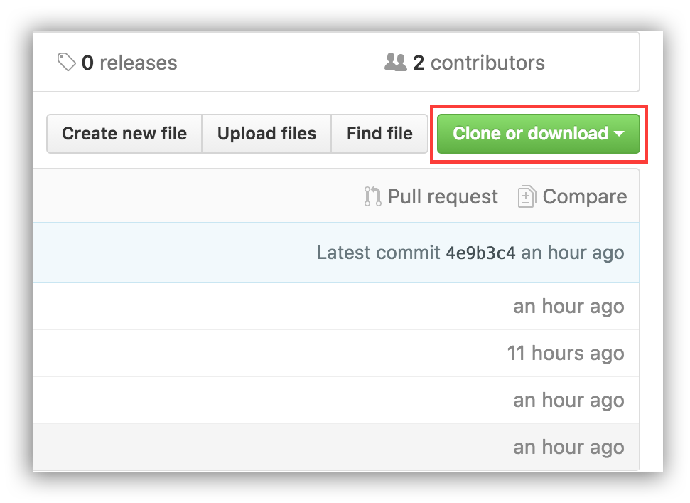

▲ [GO HOME](https://github.com/frank-lam/2019_campus_apply)


# 前言

本开源项目还在萌芽起步阶段，在编写的过程中难免遇到错误和不足，非常欢迎大家能够给出自己的意见，成为这个开源项目的贡献者。

这里有两种方式可以对项目进行指正和贡献。

- **issue**：如果内容上有错误和不足，可以直接在 issue 中提出来（关于 issue 可在网页上直接操作，这里就不说明）

- **contribution**：当然如果你有更好的想法，可以直接贡献你的 contribution（下文将教你如何进行开源贡献）


# 开始你第一个开源贡献

## 1. Fork 一个仓库

通过点击页面右侧的 Fork 按钮来 Fork 一个仓库. 这将会复制一个仓库到你的账号中去。

<div align="center"></div>


## 2. 克隆仓库

现在我们克隆这个项目到本地. 点击克隆按钮然后点击 *copy to clipboard* 图标.

<div align="center"></div>


```shell
git clone "url you just copied"
```


这里的 “url you just copied” (命令行中不需要冒号) 是仓库地址 . 填入在上一步获得到的地址。

例如:

```shell
git clone https://github.com/this-is-you/first-contributions.git
```

这里的 `this-is-you` 是你的GitHub账户. 复制你first-contributions 这个项目的内容到你的电脑。


## 3. 创建一个分支

在你的电脑中改变一个仓库文件夹 (如果你还没到这一步):

```shell
cd first-contributions
```

创建一个分支使用 `git checkout` 命令:

```shell
git checkout -b <add-your-name>
```

例如:

```shell
git checkout -b add-alonzo-church
```

(分支的名称不需要 *add* 这个词, 但有一种情况可以加上，就是把你的名字加上去。)


## 4. 做一些改动然后递交

用编辑器打开 `Contributors.md` 这个文件, 把你的名字加进去然后保存.在这个目录下执行 `git status`, 你就会发现已经有变化了. 把改变的文件加入你的分支只需要执行 `git add`命令:

```shell
git add Contributors.md
```

递交刚才的文件执行 `git commit` 命令:

```shell
git commit -m "Add <your-name> to Contributors list"
```

替换 ``成你的名字

5. 推送变动内容到GitHub

推送变动执行 `git push`:

```shell
git push origin <add-your-name>
```

替换成你之前创建的分支名称


## 6. 查看你提交的变动

进入GitHub项目主页, 你会看到一个 `Compare & pull request` 按钮，点击这个按钮.

<div align="center"></div>

现在提交你的递交请求.

<div align="center"></div>

很快我就会把所有的变动合并到这个项目的主分支，一旦变动合并，你将会受到一个通知邮件。 你项目的主分支将不会有变动，是为了和我的项目保持同步


## 7. 保持你的fork和仓库同步

首先，切换主分支

```shell
git checkout master
```

然后加上仓库的地址 `upstream remote url`:

```shell
git remote add upstream https://github.com/Roshanjossey/first-contributions
```

This is a way of telling git that another version of this project exists in the specified url and we’re calling it `upstream`. Once the changes are merged, fetch the new version of my repository:

```shell
git fetch upstream
```

Here we’re fetching all the changes in my fork (upstream remote). Now, you need to merge the new revision of my repository into your master branch.

```shell
git rebase upstream/master
```

Here you’re applying all the changes you fetched to master branch. If you push the master branch now, your fork will also have the changes:

```shell
git push origin master
```

Notice here you’re pushing to the remote named origin.

At this point I have merged your branch ``into my master branch, and you have merged my master branch into your own master branch. Your branch is now no longer needed, so you may delete it:

```shell
git branch -d <add-your-name>
```

同样你可以删除你远程仓库

```shell
git push origin --delete <add-your-name>
```

这不是必须的, but the name of this branch shows its rather special purpose. Its life can be made correspondingly short.


引用：

- [一步一步教你完成Github的第一个Contribution](https://www.zcfy.cc/article/a-step-by-step-guide-to-making-your-first-github-contribution-4142.html?t=new)
- [git如何与原始仓库同步 - CSDN博客](https://blog.csdn.net/libing403/article/details/51729744)