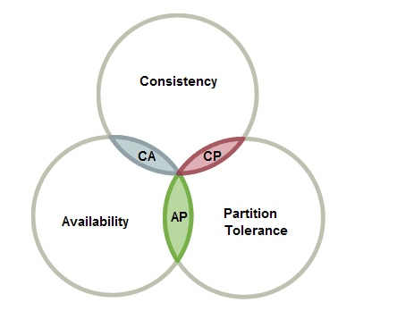

# Zookeeper

## CAP 定理

在了解Zookeeper之前，首先需要了解在分布式系统（distributed system）中的基本定理：CAP定理
定义：**CAP定理指的是在一个分布式系统中，Consistency（一致性）、 Availability（可用性）、Partition tolerance（分区容错性），三者不可兼得**。CAP定理的命名就是这三个指标的首字母。

- **Partition tolerance** 指的是在分布式系统中，由于不同的服务器之间可能无法通讯，所以需要一定的容错机制，默认情况下认为 Partition tolerance总是成立。

- **Consistency **指的是在分布式系统中，不同的服务器上所存储的数据需要一致，可以理解成当服务器A执行操作数据的指令后，服务器B上也要应用同样的操作以保证其所提供的数据同A中的一致。
- **Availability** 指的是分布式系统中，每当服务端收到客户端的请求，服务端都必须给出回应。

为什么说这三者不能同时满足呢，其主要原因在于Consistency 和 Availability不可能同时成立。
假如要保证分布式系统的高数据一致性，则服务端之间一定要在同步后才能开放给客户端进行新的读写操作。即通过加锁同步操作使其可以被看成是一个原子的操作，而在锁定期间，服务端是无法提供服务的，这样服务端是无法做到高可用的，也就违背了Availability。
假如要保证分布式系统的高可用性，则服务端必须无时无刻给客户端提供服务。而服务端间数据同步的操作由于受到网络等因素的影响，无法实时的进行同步数据，假如服务器A上的数据进行了修改而尚未同步到服务器B上，所以此时服务器B所提供的数据就不是最新的，因而违反了Consistency 。

<div align="center"></div>

## Zookeeper概述

ZooKeeper是一个分布式的，开放源码的分布式协调服务，是Google的Chubby一个开源的实现，是Hadoop和Hbase的重要组件。它是一个为分布式应用提供一致性服务的软件，提供的功能包括：配置维护、域名服务、分布式同步、组服务等。Zookeeper官网地址为 http://zookeeper.apache.org/

- 分布式协调服务，即在集群的节点中通过可靠的消息传递，来协调集群的工作。
- 为分布式应用一致性，指在分布式环境中，保证集群之间的数据传递的一致。

## Zookeeper特点

- 顺序一致性
  从同一个客户端发起的事务请求，将会严格按照其发起顺序被应用到zookeeper中
- 原子性
  所有事物请求的处理结果在整个集群中所有机器上的应用情况是一致的，要么整个集群中所有机器都成功应用了某一事务，要么都没有应用某一事务，不会出现集群中部分机器应用了事务，另一部分没有应用的情况。
- 单一视图
  无论客户端连接的是哪个zookeeper服务端，其获取的服务端数据模型都是一致的。
- 可靠性
  一旦服务端成功的应用了一个事务，并完成对客户端的响应，那么该事务所引起的服务端状态变更将会一直保留下来，直到有另一个事务又对其进行了改变。
- 实时性
  Zookeeper并不是一种强一致性，只能保证顺序一致性和最终一致性，只能称为达到了伪实时性。（和Spring Cloud Eureka不同，Eureka主要保证CAP的AP,其优先保证可用性。旨在提供高可用的服务。而Zookeeper保证CP,其旨在维护数据的高一致性）

## 集群搭建

- 1.安装jdk，并且配置jdk的环境变量

- 2.去官网下载zookeeper的安装包，上传到linux集群环境下 <http://zookeeper.apache.org/>

- 3.解压安装包 `tar -zxvf zookeeper-X.X.X.tar.gz`

- 4.进入conf目录，复制zoo-sample.cfg为zoo.cfg,zoo.cfg及为Zookeeper的默认配置文件，我们通过修改zoo.cfg即可配置zookeeper

  -  修改dataDir路径
    指定zookeeper将数据保存在哪个目录下，如果不修改，默认在/tmp下，由于该目录下数据可能会被linux自动清理，所以一定要修改该路径

  - 修改服务器列表
    单机模式：在zoo.cfg中只配置一个server.id就是单机模式了
    伪分布式：在zoo.cfg中配置多个server.id，其中ip都是当前机器，而端口各不相同，这就是伪集群模式
    完全分布式：多台机器上各自配置server.id

    ```shell
    server.1=xxx.xxx.xxx.xxx:2888:3888
    server.2=xxx.xxx.xxx.xxx:2888:3888
    server.3=xxx.xxx.xxx.xxx:2888:3888
    ```

  - 在dataDir路径下生成myid文件
    在dataDir目录下cat一个叫myid的文件，写入你所分配给当前机器的server.id

- 5.Zookeeper操作指令

  和Redis，Mysql等服务类似,访问Zookeeper安装路径下的`bin/zkServer.sh` 即可完成对服务端的启动，停止等操作，具体参数可通过`bin/zkServer.sh --help`查询,以下是常用指令
  
  ```shell
  bin/zkServer.sh start #启动zookeeper服务
  bin/zkServer.sh stop #停止zookeeper服务
  bin/zkServer.sh restart #重启zookeeper服务
  bin/zkServer.sh status #查看服务器状态
  ```
  

注意！搭建在多台服务器上的Zookeeper都需要启动，如果不想一台一台的启动，可以通过编写批量启动的shell脚本通过ssh的方式实现对Zookeeper集群的管理。或者安装CDH等Hadoop 发行版实现对Zookeeper集群的管理

## Zookeeper节点状态

LOOKING：寻找Leader状态，处于该状态需要进入选举流程
LEADING：领导者状态，处于该状态的节点说明是角色已经是Leader
FOLLOWING：跟随者状态，表示Leader已经选举出来，当前节点角色是Follower
OBSERVER：观察者状态，表明当前节点角色是Observer，Observer节点不参与投票，只负责同步Leader状态

## Zookeeper数据模型

- Zookeeper的数据结构非常类似于文件系统。是由节点组成的树形结构。不同的是文件系统是由文件夹和文件来组成的树，而Zookeeper中是由Znode来组成的树。每一个Znode里都可以存放一段数据，Znode下还可以挂载零个或多个子Znode节点，从而组成一个树形结构。
- 节点类型
  - 顺序节点：除了前缀是指定的名字外，在名字后会自带一个独一无二自动增长的的编号
  - 普通节点：指定节点名字就叫什么名字
  - 临时节点：一个客户端连接创建的临时节点，会在当客户端会话结束时立即自动删除。
  - 持久节点：创建出来后只要不删除就不会消失，无论客户端是否连接。

## 常用Shell操作

- 连接zookeeper客户端
  `bin/zkCli.sh [-server ip:port]` 
- 列出节点：
  `ls path [watch]`
- 创建节点：
  `create [-s] [-e] path data acl` 
- 获取节点：
  `get path [watch]`
- 更新操作：
  `set path data [version]`
- 删除操作：
  `delete path [version]`

## Zookeeper原理

- 为了保证Zookeeper集群数据一致性，由Leader节点负责决策，其他Follower节点负责投票。
- 某一时刻集群里只能有且仅有一个Leader。
- Leader可以执行增删改和查询操作，而Follower只能进行查询操作。
- 所有的更新操作都会被转交给Leader来处理，Leader批准的任务，再发送给Follower去执行来保证和Leader的一致性。
- 由于网络是不稳定的，为了保证任务顺序的一致，所有的任务都被赋予一个事务id（zxid）它代表了提案的整体顺序。zxid由两部分组成：周期（epoch）和计数器（counter）。在当前的实现中zxid是一个64位整数，高32位为epoch，低32位为counter，因此zxid也可以记为一个整数对(epoch, count)。epoch的值代表Leader的改变，每当选举产生一个新的Leader就会生成一个它独有的epoch编号。ZooKeeper使用了一种简单的算法将一个唯一的zxid赋给提案：Leader对每个提案只是简单地递增zxid以得到一个唯一的zxid值。Leader激活算法会保证只有一个Leader使用一个特定的epoch，因此这个简单的算法可以保证每个提案都有一个唯一的id。
- 当集群内的节点过半通过，Leader就可以认为一个客户端请求提案通过

## 原子广播

Zookeeper的核心是原子广播，这个机制保证了各个server之间的同步。实现这个机制的协议叫做Zab协议。Zab协议有恢复模式和广播模式两种模式。当服务启动或者在Leader崩溃后，Zab就进入了恢复模式，当领导者被选举出来，且大多数server的完成了和Leader的状态同步以后，恢复模式就结束了。
当服务启动或者在领导者崩溃后，Zab就进入了恢复模式，当领导者被选举出来，且大多数server的完成了和Leader的状态同步以后，恢复模式就结束了。状态同步保证了Leader和server具有相同的系统状态。
当Leader和多数的Follower进行了状态同步后，就进入了广播状态。此时当一个Server加入Zookeeper，它会在恢复模式下启动,发现Leader并和Leader进行状态同步。同步完成后，它也参与消息广播。Zookeeper服务一直维持在Broadcast状态，直到Leader崩溃或者Leader失去了大部分的Follower支持。

## 选主流程

上文已说当Leader崩溃或者Leader失去大多数的follower时，Zookeeper处于恢复模式，在恢复模式下需要重新选举出一个新的Leader，让所有的 Server都恢复到一个正确的状态。Zookeeper的选举算法有两种：一种是基于basic paxos实现的，另外一种是基于fast paxos算法实现的。系统默认的选举算法为fast paxos。

Basic paxos：当前Server发起选举的线程,向所有Server发起询问,选举线程收到所有回复,计算zxid最大Server,并推荐此为Leader，若此提议获得n/2+1票通过（过半同意）,此为Leader，否则重复上述流程，直到Leader选出。

Fast paxos:某Server首先向所有Server提议自己要成为Leader，当其它Server收到提议以后，解决epoch和 zxid的冲突，并接受对方的提议，然后向对方发送接受提议完成的消息，重复这个流程，最后一定能选举出Leader。(即提议方解决其他所有epoch和 zxid的冲突,即为Leader)。

## 过半同意

当只有Leader或少数机器批准执行某个任务时，则极端情况下Leader和这些少量机器挂掉，则无法保证新Leader知道之前已经批准该任务，这样就违反了数据可靠性。所以Leader在批准一个任务之前应该保证集群里大部分的机器知道这个提案，这样即使Leader挂掉，选举出来的新Leader也会从其他Follower处获取这个提案。而如果Leader要求所有Follower都同意才执行提案也不行，此时若有一个机器挂掉，Leader就无法继续工作，这样的话整个集群相当于单节点，无法保证可靠性
