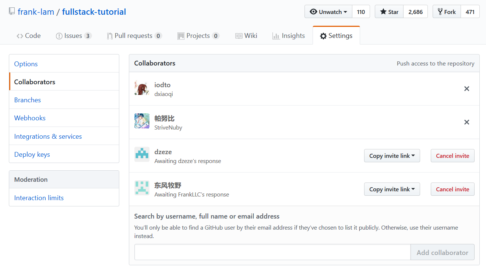

▲ [GO HOME](https://github.com/frank-lam/2019_campus_apply)   |  ▲ [开源贡献文档格式说明](https://github.com/frank-lam/fullstack-tutorial/wiki)

# 开源小组，英雄招募令

诚挚要请您加入我们的「全栈开发-开源小组」

个人能力有限，欢迎志同道合的朋友们共同维护本仓库，一起加入开源世界。

本仓库致力于成为全栈技术开发，不限于语言、算法。

招募 Java，PHP，Python，Go，C++，Node.js，分布式中间件，前端，机器学习，深度学习，计算机视觉等等，板块维护者。当然只要是和技术相关都行啦，欢迎大家的加入。

如果对开源贡献有兴趣，可以加入下方的 QQ 群和我们交流。

 
 

想要成为 Collaborators 协作者，请在 QQ 群里私信我

如果只想进行技术交流学习，可直接加入本仓库的技术交流群。

 
 

