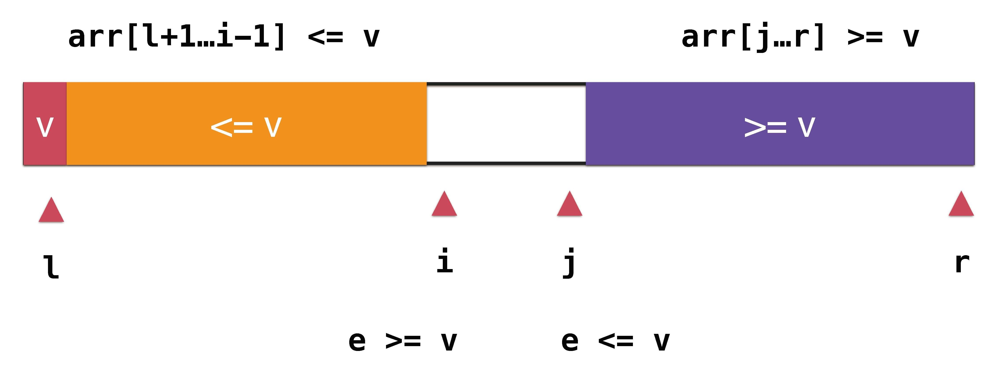
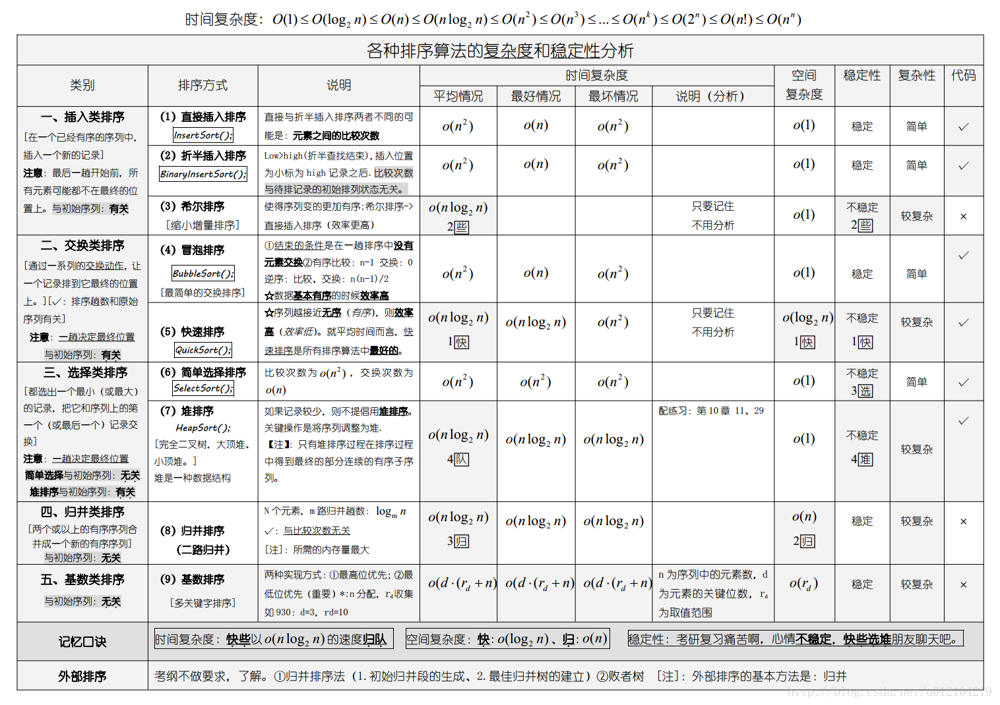
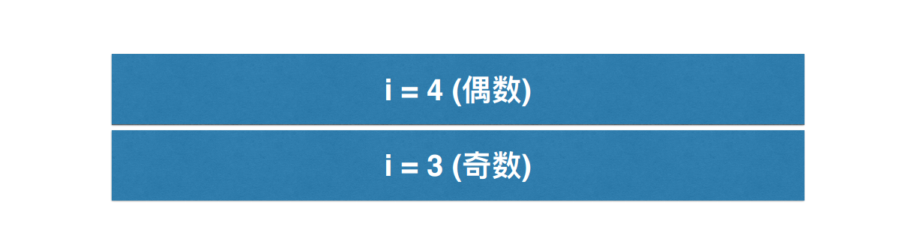
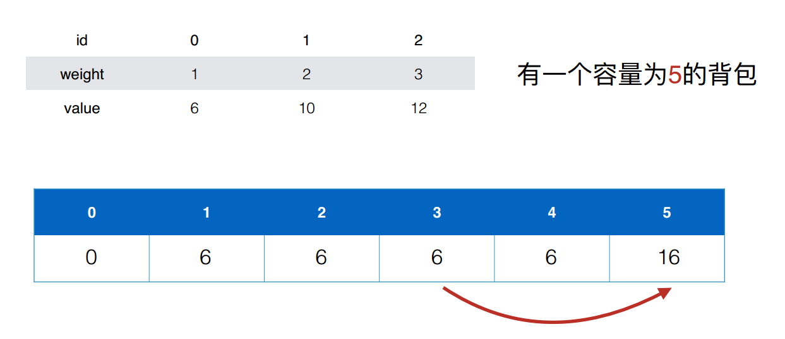
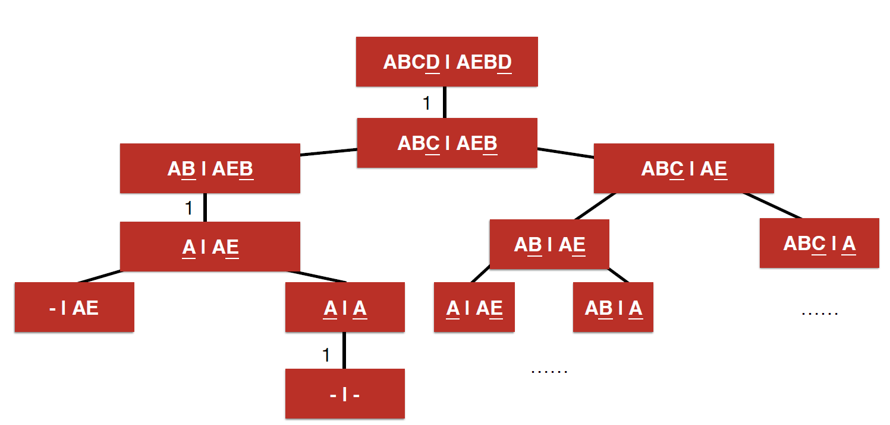

<!-- TOC -->

- [前言](#前言)
- [第一部分：数据结构](#第一部分数据结构)
    - [一、线性表](#一线性表)
    - [二、栈和队列](#二栈和队列)
    - [三、树和二叉树](#三树和二叉树)
        - [1. 红黑树](#1-红黑树)
        - [2. 二叉树](#2-二叉树)
            - [二分查找法](#二分查找法)
            - [二叉树遍历](#二叉树遍历)
        - [3. 二分搜索树](#3-二分搜索树)
            - [深度优先遍历（前序、中序、后序遍历）](#深度优先遍历前序中序后序遍历)
            - [广度优先遍历（层序遍历）](#广度优先遍历层序遍历)
        - [4. AVL树](#4-avl树)
        - [5. B和B+](#5-b和b)
    - [四、字符串和数组](#四字符串和数组)
- [第二部分：算法思想](#第二部分算法思想)
    - [一、排序](#一排序)
        - [1. 选择排序（Selection Sort）](#1-选择排序selection-sort)
        - [2. 插入排序（Insertion Sort）](#2-插入排序insertion-sort)
        - [3. 冒泡排序（Bubble Sort）](#3-冒泡排序bubble-sort)
        - [4. 希尔排序（Shell Sort）](#4-希尔排序shell-sort)
        - [5. 归并排序（Merge Sort）](#5-归并排序merge-sort)
        - [6. 快速排序（Quick Sort）](#6-快速排序quick-sort)
            - [1. 普通快速排序](#1-普通快速排序)
            - [2. 双路快速排序](#2-双路快速排序)
            - [3. 三路快速排序](#3-三路快速排序)
        - [7. 堆排序（Heap Sort）](#7-堆排序heap-sort)
            - [1. 堆](#1-堆)
            - [2. 上浮和下沉](#2-上浮和下沉)
            - [3.插入元素](#3插入元素)
            - [4. 删除最大元素](#4-删除最大元素)
            - [5. 堆排序](#5-堆排序)
            - [6. 堆排序的应用——Top K问题](#6-堆排序的应用top-k问题)
        - [8. 计数排序和流排序](#8-计数排序和流排序)
        - [9. 排序算法总结](#9-排序算法总结)
    - [二、递归和回溯法](#二递归和回溯法)
        - [1. 例题](#1-例题)
        - [2. 排列问题](#2-排列问题)
        - [3. 组合问题](#3-组合问题)
        - [4. 回溯法的剪枝](#4-回溯法的剪枝)
        - [5. 二维平面回溯法](#5-二维平面回溯法)
        - [6. floodfill算法](#6-floodfill算法)
    - [三、动态规划](#三动态规划)
        - [1. 斐波那契数列](#1-斐波那契数列)
            - [1.1 递归方式（自顶向下）](#11-递归方式自顶向下)
            - [1.2 记忆化搜索（自底向上）](#12-记忆化搜索自底向上)
            - [1.3 动态规划](#13-动态规划)
        - [2. 背包问题](#2-背包问题)
            - [（1）记忆化搜索](#1记忆化搜索)
            - [（2）动态规划](#2动态规划)
            - [（3）动态规划优化思路1](#3动态规划优化思路1)
            - [（4）动态规划优化思路2](#4动态规划优化思路2)
            - [（5）背包问题更多变种](#5背包问题更多变种)
        - [3. 最长上升子序列](#3-最长上升子序列)
        - [4. 最长公共子序列](#4-最长公共子序列)
    - [四、贪心算法](#四贪心算法)
        - [1. assign-cookies](#1-assign-cookies)
- [第三部分：面试指南](#第三部分面试指南)
    - [1. 判单链表是否对称](#1-判单链表是否对称)
    - [2. 合并两个有序数组成一个有序数组](#2-合并两个有序数组成一个有序数组)
    - [3. 求二叉树中值为x的结点的层号](#3-求二叉树中值为x的结点的层号)
    - [阿里面经OneNote](#阿里面经onenote)
- [第四部分：参考资料](#第四部分参考资料)

<!-- /TOC -->
# 前言

本文将系统总结算法面试和经典数据结构相关知识点，在这里分成 【数据结构】 和 【算法】 两部分展开。这里将展示主要的核心知识点，关于代码面试的Leetcode习题请转向代码仓库：[Interview-code](https://github.com/frank-lam/interview_code)


- 阅读书籍
  - 《算法4》
  - 《程序员代码面试指南》
  - 《剑指Offer》

- 学习课程
  - 刘宇波：玩转数据结构，从入门到进阶
  - 刘宇波：程序员的内功修炼，学好算法与数据结构
  - 刘宇波：玩转算法面试 leetcode题库分门别类详细解析

- 在线OJ
  - [Leetcode中国版](https://leetcode-cn.com/)
  - [牛客网](https://www.nowcoder.com/)


# 第一部分：数据结构

## 一、线性表

- 数组
- 链表

## 二、栈和队列


## 三、树和二叉树

### 1. 2-3树


### 2. 红黑树

红黑树的特性: 

（1）每个节点或者是黑色的，或者是红色的

（2）根节点是黑色的

（3）每个叶子节点（NIL，最后的空结点）是黑色。 [注意：这里叶子节点，是指为空(NIL或NULL)的叶子节点！] 

（4）如果一个节点是红色的，那么他的孩子结点都是黑色的

（5）从任意一个节点到叶子节点，经过的黑色节点是一样的。[这里也就可以得到插入的节点必然为红色]


红黑树(一)之 原理和算法详细介绍 - 如果天空不死 - 博客园
http://www.cnblogs.com/skywang12345/p/3245399.html

JCFInternals/5-TreeSet and TreeMap.md at 049c84bb65a3114ba4b8355d83c490fb9b26c6af · CarpenterLee/JCFInternals
https://github.com/CarpenterLee/JCFInternals/blob/049c84bb65a3114ba4b8355d83c490fb9b26c6af/markdown/5-TreeSet%20and%20TreeMap.md


### 3. 二叉树

#### 二分查找法

在有序表中，通过不断的二分判断mid与目标是否一致，并缩小目标所在区间。

**代码实现**

```java
// 非递归实现
private static int search(int[] data, int l, int r, int target) {
    int mid;
    while(l < r) {
        mid = (l + r) / 2;
        if(data[mid] == target) {
            return mid;
        } else if(data[mid] < target) {
            l = mid + 1;
        } else {
            r = mid;
        }
    }
    return -1;
}
// 递归实现
private static int searchDfs(int[] data, int l, int r, int target) {
    if(l >= r) {
        return -1;
    }
    int mid = (l + r) / 2;
    if(target == data[mid]) {
        return mid;
    } else if(target > data[mid]) {
        return searchDfs(data, mid + 1, r, target);
    } else {
        return searchDfs(data, l, mid, target);
    }
}
```

##### 

### 4.. 二叉树遍历

#### 深度优先遍历（前序、中序、后序遍历）

```C++
/**
 * 前序遍历 非递归实现
 * Definition for a binary tree node.
 * struct TreeNode {
 *     int val;
 *     TreeNode *left;
 *     TreeNode *right;
 *     TreeNode(int x) : val(x), left(NULL), right(NULL) {}
 * };
 */
class Solution {
public:
    vector<int> preorderTraversal(TreeNode* root) {
        vector<int> ans;
        TreeNode* node = root;
        stack<TreeNode*> s;
        map<TreeNode*, bool> M;
        if(node != NULL) {
            s.push(node);
            while (!s.empty()) {
                node = s.top();
                if (!M[node]) {
                    ans.push_back(node->val);
                    M[node] = true;
                }
                if (node->left != NULL) {
                    s.push(node->left);
                    node->left = NULL;
                } else if (node->right != NULL) {
                    s.push(node->right);
                    node->right = NULL;
                } else {
                    s.pop();
                }
            }
        }
        return ans;
    }
};
```

```c++
/**
 * 中序遍历
 * Definition for a binary tree node.
 * struct TreeNode {
 *     int val;
 *     TreeNode *left;
 *     TreeNode *right;
 *     TreeNode(int x) : val(x), left(NULL), right(NULL) {}
 * };
 */
class Solution {
public:
    vector<int> inorderTraversal(TreeNode* root) {
        vector<int> ans;
        if(root != NULL) {
            traversal(root, ans);
        }
        return ans;
    }
    
    void traversal(TreeNode* node, vector<int> &ans) {
        if(node->left != NULL) {
            traversal(node->left, ans);
        }
        ans.push_back(node->val);
        if(node->right != NULL) {
            traversal(node->right, ans);
        }
    }
};
```


```c++
/**
 * 后序遍历
 * Definition for a binary tree node.
 * struct TreeNode {
 *     int val;
 *     TreeNode *left;
 *     TreeNode *right;
 *     TreeNode(int x) : val(x), left(NULL), right(NULL) {}
 * };
 */
class Solution {
public:
    vector<int> postorderTraversal(TreeNode* root) {
        vector<int> ans;
        if(root != NULL) {
            traversal(root, ans);
        }
        return ans;
    }

    void traversal(TreeNode* node, vector<int> &ans) {
        if(node->left != NULL) {
            traversal(node->left, ans);
        }
        if(node->right != NULL) {
            traversal(node->right, ans);
        }
        ans.push_back(node->val);
    }
};
```

#### 广度优先遍历（层序遍历）

### 5. AVL树


### 6. B和B+


## 四、字符串和数组


# 第二部分：算法思想

## 一、排序

### 1. 选择排序（Selection Sort）

选择出数组中的最小元素，将它与数组的第一个元素交换位置。再从剩下的元素中选择出最小的元素，将它与数组的第二个元素交换位置。不断进行这样的操作，直到将整个数组排序。 


**代码实现**

```java
public static void sort(int[] arr) {
    for (int i = 0; i < arr.length; i++) {
        // 寻找[i, n)区间里的最小值的索引
        int minIndex = i;
        for (int j = i + 1; j < arr.length; j++) {
            if(arr[minIndex] > arr[j]){
                minIndex = j;
            }
        }
        swap( arr , i , minIndex);
    }
}

private static void swap(int[] arr, int i, int j) {
    int t = arr[i];
    arr[i] = arr[j];
    arr[j] = t;
}
```

**算法分析**

表现最稳定的排序算法之一，因为无论什么数据进去都是O(n2)的时间复杂度，所以用到它的时候，数据规模越小越好。唯一的好处可能就是不占用额外的内存空间了吧。理论上讲，选择排序可能也是平时排序一般人想到的最多的排序方法了吧。

 

### 2. 插入排序（Insertion Sort）

插入排序从左到右进行，每次都将当前元素插入到左侧已经排序的数组中，使得插入之后左部数组依然有序。

第 j 元素是通过不断向左比较并交换来实现插入过程：当第 j 元素小于第 j - 1 元素，就将它们的位置交换，然后令 j 指针向左移动一个位置，不断进行以上操作。


**代码实现**

```java
public static void sort(int[] arr) {
    for (int i = 0; i < arr.length - 1; i++) {
        for (int j = i + 1; j > 0; j--) {
            if (arr[j] < arr[j - 1])
                swap(arr, j, j - 1); // 大量的交换会消耗时间
            else
                break;
        }
    }
}

// 改进版插入排序（减少了数组元素的操作次数）
public static void better_sort(int[] arr) {
    for (int i = 0; i < arr.length; i++) {
        int e = arr[i];
        int j = i;
        for (; j > 0; j--) {
            if (e < arr[j - 1])
                arr[j] = arr[j - 1];
            else
                break;
        }
        arr[j] = e;
    }
}

private static void swap(int[] arr, int i, int j) {
    int t = arr[i];
    arr[i] = arr[j];
    arr[j] = t;
}
```

**算法分析**

插入排序在实现上，通常采用in-place排序（即只需用到O(1)的额外空间的排序），因而在从后向前扫描过程中，需要反复把已排序元素逐步向后挪位，为最新元素提供插入空间。

 

### 3. 冒泡排序（Bubble Sort）

通过从左到右不断交换相邻逆序的相邻元素，在一轮的交换之后，可以让未排序的元素上浮到右侧。

在一轮循环中，如果没有发生交换，就说明数组已经是有序的，此时可以直接退出。


**代码实现**

```java
private static void sort(int[] arr) {
    for (int i = arr.length - 1; i > 0; i--) { // 从最后一位开始确定
        boolean swapped = false;
        for (int j = 0; j < i; j++) {
            if(arr[j] > arr[j+1]){
                swapped = true;
                swap(arr,j,j+1);
            }
        }
        if(!swapped)
            return;
    }
}

private static void swap(int[] arr, int i, int j) {
    int t = arr[i];
    arr[i] = arr[j];
    arr[j] = t;
}
```


### 4. 希尔排序（Shell Sort）

1959年Shell发明，第一个突破O(n2)的排序算法，是简单插入排序的改进版。它与插入排序的不同之处在于，它会优先比较距离较远的元素。希尔排序又叫**缩小增量排序**。


**算法描述**

先将整个待排序的记录序列分割成为若干子序列分别进行直接插入排序，具体算法描述：

- 选择一个增量序列t1，t2，…，tk，其中ti>tj，tk=1；
- 按增量序列个数k，对序列进行k 趟排序；
- 每趟排序，根据对应的增量ti，将待排序列分割成若干长度为m 的子序列，分别对各子表进行直接插入排序。仅增量因子为1 时，整个序列作为一个表来处理，表长度即为整个序列的长度。


**代码实现**

```java
// 希尔排序
public static void sort(int[] arr) {
    int n = arr.length;
    for (int h = n / 2; h > 0; h = h / 2) {
        // 内部是一个插入排序
        for (int i = 0; i < n; i = i + h) {

            int e = arr[i];
            int j = i;
            for (; j > 0; j = j - h) {
                if (e < arr[j - h])
                    arr[j] = arr[j - h];
                else
                    break;
            }
            arr[j] = e;
        }
    }
}


// 希尔排序2
public static void sort2(int[] arr) {
    int n = arr.length;
    // 计算 increment sequence: 1, 4, 13, 40, 121, 364, 1093...
    int h = 1;
    while (h < n / 3) h = 3 * h + 1;

    System.out.println(h);

    while (h >= 1) {
        // h-sort the array
        for (int i = h; i < n; i++) {
            
            // 对 arr[i], arr[i-h], arr[i-2*h], arr[i-3*h]... 使用插入排序
            int e = arr[i];
            int j = i;
            for (; j >= h && e < arr[j - h]; j -= h)
                arr[j] = arr[j - h];
            arr[j] = e;
        }

        h /= 3;
    }
}
```

**算法分析**

对于大规模的数组，插入排序很慢，因为它只能交换相邻的元素，每次只能将逆序数量减少 1。

希尔排序的出现就是为了改进插入排序的这种局限性，它通过交换不相邻的元素，每次可以将逆序数量减少大于 1。

希尔排序使用插入排序对间隔 h 的序列进行排序。通过不断减小 h，最后令 h=1，就可以使得整个数组是有序的。


### 5. 归并排序（Merge Sort）

归并排序的思想是将数组分成两部分，分别进行排序，然后归并起来。把长度为n的输入序列分成两个长度为n/2的子序列；对这两个子序列分别采用归并排序；将两个排序好的子序列合并成一个最终的排序序列。


**代码实现**

> 1.归并方法
>
> 归并方法将数组中两个已经排序的部分归并成一个。

```java
private static void sort(int[] arr) {
    __MergeSort(arr, 0, arr.length - 1);
}

private static void __MergeSort(int[] arr, int l, int r) {
    if (l >= r)
        return;
    int mid = (l + r) / 2;
    __MergeSort(arr, l, mid);
    __MergeSort(arr, mid + 1, r);
    merge(arr, l, mid, r);
}

// 将arr[l...mid]和arr[mid+1...r]两部分进行归并
private static void merge(int[] arr, int l, int mid, int r) {
    int[] aux = Arrays.copyOfRange(arr, l, r + 1);

    // 初始化，i指向左半部分的起始索引位置l；j指向右半部分起始索引位置mid+1
    int i = l, j = mid + 1;
    for (int k = l; k <= r; k++) {
        if (i > mid) {  // 如果左半部分元素已经全部处理完毕
            arr[k] = aux[j - l];
            j++;
        } else if (j > r) {   // 如果右半部分元素已经全部处理完毕
            arr[k] = aux[i - l];
            i++;
        } else if (aux[i - l] < aux[j - l]) {  // 左半部分所指元素 < 右半部分所指元素
            arr[k] = aux[i - l];
            i++;
        } else {  // 左半部分所指元素 >= 右半部分所指元素
            arr[k] = aux[j - l];
            j++;
        }
    }
}
```

> 2.自底向上归并排序

```java
private static void sort(int[] arr) {
    int N = arr.length;
    int[] aux = new int[N];
    for (int sz = 1; sz < N; sz += sz)
        for (int i = 0; i + sz < N; i += sz + sz)
            merge(arr, i, i + sz - 1, Math.min(i + sz + sz - 1, N - 1));
}
```


### 6. 快速排序（Quick Sort）

快速排序可以说是20世纪最伟大的算法之一了。相信都有所耳闻，它的速度也正如它的名字那样，是一个非常快的算法了。当然它也后期经过了不断的改进和优化，才被公认为是一个值得信任的非常优秀的算法。


**代码实现**

#### 1. 普通快速排序

```java
// 递归使用快速排序,对arr[l...r]的范围进行排序
public static void QuickSort(int[] arr,int l,int r){
    if(l>=r)
        return;
    int p = partition(arr,l,r);
    QuickSort(arr,l,p-1);
    QuickSort(arr,p+1,r);
}

// 将数组通过p分割成两部分
// 对arr[l...r]部分进行partition操作
// 返回p, 使得arr[l...p-1] < arr[p] ; arr[p+1...r] > arr[p]
public static int partition(int[] arr, int l, int r) {
    swap(arr, l, (int) (Math.random() % (r - l + 1)) + l);  // 加入这一行变成随机快速排序

    int v = arr[l];
    int j = l;
    for(int i = j +1;i<=r;i++){
        if(arr[i] < v){
            j++;
            swap(arr,i,j);
        }
    }
    swap(arr,l,j);
    return j;
}

public static void swap(int[] arr,int i,int j) {
    int temp = arr[i];
    arr[i] = arr[j];
    arr[j] = temp;
}
```

快速排序是原地排序，不需要辅助数组，但是递归调用需要辅助栈。

快速排序最好的情况下是每次都正好能将数组对半分，这样递归调用次数才是最少的。这种情况下比较次数为 CN=2CN/2+N，复杂度为 O(NlogN)。

最坏的情况下，第一次从最小的元素切分，第二次从第二小的元素切分，如此这般。因此最坏的情况下需要比较 N2/2。为了防止数组最开始就是有序的，在进行快速排序时需要随机打乱数组。


#### 2. 双路快速排序

若果数组中含有大量重复的元素，则partition很可能把数组划分成两个及其不平衡的两部分，时间复杂度退化成O(n²)。这时候应该把小于v和大于v放在数组两端。



```java
// 双路快速排序的partition
// 返回p, 使得arr[l...p-1] < arr[p] ; arr[p+1...r] > arr[p]
private static int partition(int[] arr, int l, int r) {

    // 随机在arr[l...r]的范围中, 选择一个数值作为标定点pivot
    // swap(arr, l, (int) (Math.random() % (r - l + 1)) + l);

    int v = arr[l];

    // arr[l+1...i) <= v; arr(j...r] >= v
    int i = l + 1, j = r;
    while (true) {
        // 注意这里的边界, arr[i].compareTo(v) < 0, 不能是arr[i].compareTo(v) <= 0
        // 思考一下为什么?
        while (i <= r && arr[i] < v)
            i++;

        // 注意这里的边界, arr[j].compareTo(v) > 0, 不能是arr[j].compareTo(v) >= 0
        // 思考一下为什么?
        while (j >= l + 1 && arr[j] > v)
            j--;

        // 对于上面的两个边界的设定, 有的同学在课程的问答区有很好的回答:)
        // 大家可以参考: http://coding.imooc.com/learn/questiondetail/4920.html
        if (i > j)
            break;
        
        swap(arr, i, j);
        i++;
        j--;
    }

    swap(arr, l, j);

    return j;
}

// 递归使用快速排序,对arr[l...r]的范围进行排序
private static void QuickSort2Ways(int[] arr, int l, int r) {
    // 对于小规模数组, 使用插入排序
    if (l >= r) return;
    int p = partition(arr, l, r);
    QuickSort2Ways(arr, l, p - 1);
    QuickSort2Ways(arr, p + 1, r);
}
```

#### 3. 三路快速排序

数组分成三个部分，大于v 等于v 小于v

在具有大量重复键值对的情况下使用三路快排


```java
// 递归使用快速排序,对arr[l...r]的范围进行排序
private static void QuickSort3Ways(int[] arr, int l, int r){

    // 随机在arr[l...r]的范围中, 选择一个数值作为标定点pivot
    swap( arr, l, (int)(Math.random()*(r-l+1)) + l );

    int v = arr[l];

    int lt = l;     // arr[l+1...lt] < v
    int gt = r + 1; // arr[gt...r] > v
    int i = l+1;    // arr[lt+1...i) == v
    while( i < gt ){
        if( arr[i] < v){
            swap( arr, i, lt+1);
            i ++;
            lt ++;
        }
        else if( arr[i] > v ){
            swap( arr, i, gt-1);
            gt --;
        }
        else{ // arr[i] == v
            i ++;
        }
    }
    swap( arr, l, lt );

    QuickSort3Ways(arr, l, lt-1);
    QuickSort3Ways(arr, gt, r);
}
```


### 7. 堆排序（Heap Sort）

#### 1. 堆

堆的某个节点的值总是大于等于子节点的值，并且堆是一颗完全二叉树。

堆可以用数组来表示，因为堆是完全二叉树，而完全二叉树很容易就存储在数组中。位置 k 的节点的父节点位置为 k/2，而它的两个子节点的位置分别为 2k 和 2k+1。这里不使用数组索引为 0 的位置，是为了更清晰地描述节点的位置关系。


#### 2. 上浮和下沉

在堆中，当一个节点比父节点大，那么需要交换这个两个节点。交换后还可能比它新的父节点大，因此需要不断地进行比较和交换操作，把这种操作称为**上浮（ShiftUp）**。

 

```java
private void shiftUp(int k){
    while( k > 1 && data[k/2] < data[k])){
        swap(k, k/2);
        k /= 2;
    }
}
```


类似地，当一个节点比子节点来得小，也需要不断地向下进行比较和交换操作，把这种操作称为**下沉（Shift Down）**。一个节点如果有两个子节点，应当与两个子节点中最大那么节点进行交换。

 

```java
private void shiftDown(int k){
    while( 2*k <= count ){ // 当前结点有左孩子
        int j = 2*k; // 在此轮循环中,data[k]和data[j]交换位置
        if( j+1 <= count && data[j+1] > data[j] )
            j ++;
        // data[j] 是 data[2*k]和data[2*k+1]中的最大值

        if( data[k] >= data[j] ) 
            break;
        swap(k, j);
        k = j;
    }
}
```

#### 3.插入元素

将新元素放到数组末尾，然后上浮到合适的位置。  

```java
// 向最大堆中插入一个新的元素 item
public void insert(Item item){
    assert count + 1 <= capacity;
    data[count+1] = item;
    count ++;
    shiftUp(count);
}
```

#### 4. 删除最大元素

```java
// 从最大堆中取出堆顶元素, 即堆中所存储的最大数据
public Item extractMax(){
    assert count > 0;
    Item ret = data[1];
    
    swap( 1 , count );
    count --;
    shiftDown(1);
    return ret;
}
```

#### 5. 堆排序

由于堆可以很容易得到最大的元素并删除它，不断地进行这种操作可以得到一个递减序列。如果把最大元素和当前堆中数组的最后一个元素交换位置，并且不删除它，那么就可以得到一个从尾到头的递减序列，从正向来看就是一个递增序列。因此很容易使用堆来进行排序。并且堆排序是原地排序，不占用额外空间。

```java
// 不使用一个额外的最大堆, 直接在原数组上进行原地的堆排序
public class HeapSort {

    // 对整个arr数组使用HeapSort1排序
    // HeapSort1, 将所有的元素依次添加到堆中, 在将所有元素从堆中依次取出来, 即完成了排序
    // 无论是创建堆的过程, 还是从堆中依次取出元素的过程, 时间复杂度均为O(nlogn)
    // 整个堆排序的整体时间复杂度为O(nlogn)
    public static void sort1(Comparable[] arr){

        int n = arr.length;
        MaxHeap<Comparable> maxHeap = new MaxHeap<Comparable>(n);
        for( int i = 0 ; i < n ; i ++ )
            maxHeap.insert(arr[i]);

        for( int i = n-1 ; i >= 0 ; i -- )
            arr[i] = maxHeap.extractMax();
    }


    // 只通过shiftDown操作进行排序
    public static void sort2(Comparable[] arr){
        int n = arr.length;

        // 注意，此时我们的堆是从0开始索引的
        // 从(最后一个元素的索引-1)/2开始
        // 最后一个元素的索引 = n-1
        for( int i = (n-1-1)/2 ; i >= 0 ; i -- )
            shiftDown2(arr, n, i);

        for( int i = n-1; i > 0 ; i-- ){ // 这个的目的是让序列从小到大排序
            swap( arr, 0, i);
            shiftDown2(arr, i, 0);
        }
    }

    // 交换堆中索引为i和j的两个元素
    private static void swap(Object[] arr, int i, int j){
        Object t = arr[i];
        arr[i] = arr[j];
        arr[j] = t;
    }

    // 原始的shiftDown过程
    private static void shiftDown(Comparable[] arr, int n, int k){
        while( 2*k+1 < n ){
            int j = 2*k+1;
            if( j+1 < n && arr[j+1].compareTo(arr[j]) > 0 )
                j += 1;

            if( arr[k].compareTo(arr[j]) >= 0 )break;

            swap( arr, k, j);
            k = j;
        }
    }

    // 优化的shiftDown过程, 使用赋值的方式取代不断的swap,
    // 该优化思想和我们之前对插入排序进行优化的思路是一致的
    private static void shiftDown2(Comparable[] arr, int n, int k){

        Comparable e = arr[k];
        while( 2*k+1 < n ){
            int j = 2*k+1;
            if( j+1 < n && arr[j+1].compareTo(arr[j]) > 0 )
                j += 1;

            if( e.compareTo(arr[j]) >= 0 )
                break;

            arr[k] = arr[j];
            k = j;
        }

        arr[k] = e;
    }

    // 测试 HeapSort
    public static void main(String[] args) {
        Integer[] arr = {10, 91, 8, 7, 6, 5, 4, 3, 2, 1};
        HeapSort.sort2(arr);
        PrintHelper.printArray(arr);
    }
}
```

#### 6. 堆排序的应用——Top K问题

例如，有1亿个浮点数，如何找出其中最大的10000个？（B326）


### 8. 计数排序

https://www.cnblogs.com/freedom314/p/5847092.html


### 9. 排序算法总结

|          | 平均时间复杂度 | 原地排序 | 额外空间 | 稳定排序 |
| :------: | :------------: | :------: | :------: | :------: |
| 插入排序 |     O(n^2)     |    √     |   O(1)   |    √     |
| 归并排序 |    O(nlogn)    |    ×     |   O(n)   |    √     |
| 快速排序 |    O(nlogn)    |    √     | O(logn)  |    ×     |
|  堆排序  |    O(nlogn)    |    √     |   O(1)   |    ×     |

稳定排序：对于相等的元素，在排序后，原来靠前的元素依然靠前。相等元素的相对位置没有发生变化。

```java
// 可以通过⾃自定义⽐比较函数，让排序算法不不存在稳定性的问题。
bool operator<(const Student& otherStudent){
    return score != otherStudent.score ?
    score > otherStudent.score :
    name < otherStudent.name;
}
```


 


## 二、递归和回溯法

### 1. 例题


### 2. 排列问题


### 3. 组合问题


### 4. 回溯法的剪枝


### 5. 二维平面回溯法


### 6. floodfill算法


## 三、动态规划

递归和动态规划都是将原问题拆成多个子问题然后求解，他们之间最本质的区别是，动态规划保存了子问题的解，避免重复计算。 


动态规划一般可分为4类：

1. 线性动规
2. 区域动规
3. 树形动规
4. 背包动规


以`198. House Robber`为例，动态规划的**状态定义**和**状态转移方程**如下：

注意其中对状态的**定义**：

- 考虑偷取 [x…n-1] 范围⾥里里的房子 （函数的定义）

根据对状态的定义，决定状态的**转移**：

- f(0) = max{ v(0) + f(2) , v(1) + f(3) , v(2) + f(4) , … ,v(n-3) + f(n-1) , v(n-2),v(n-1) }

 (状态转移方程)


### 1. 斐波那契数列

#### 1.1 递归方式（自顶向下）

```java
public int fib( int n ){
    if( n == 0 )
        return 0;
    if( n == 1 )
        return 1;
    return fib(n-1) + fib(n-2);
}

//控制台输出
fib(42) = 267914296
time : 1949 ms
run function fib() 866988873 times.
```

#### 1.2 记忆化搜索（自底向上）

```java
public int fib(int n){
    int[] memo = new int[n + 1];
    Arrays.fill(memo, -1);
    return fib(n, memo);
}

private int fib(int n, int[] memo){
    if(n == 0)
        return 0;
    if(n == 1)
        return 1;
    if(memo[n] == -1)
        memo[n] = fib(n - 1, memo) + fib(n - 2, memo);
    return memo[n];
}

//控制台输出
fib(1000) = 1556111435
time : 1 ms
run function fib() 1999 times.
```

#### 1.3 动态规划

```java
public int fib(int n){
    int[] memo = new int[n + 1];
    Arrays.fill(memo, -1);

    memo[0] = 0;
    memo[1] = 1;
    for(int i = 2 ; i <= n ; i ++)
        memo[i] = memo[i - 1] + memo[i - 2];

    return memo[n];
}
```


### 2. 背包问题

先得到该问题的局部解然后扩展到全局问题解。

我们可以假设一个B(k,C) 方法，第k件物品，当前背包所剩下的容量C（初始则C=W）情况下，能够偷的最大价值量。

B( i , c ) = max{ F( i - 1 , C ) ,  v(i) + F( i - 1, C - w[i] ) };

#### （1）记忆化搜索

```java
/**
 * 记忆化搜索
 * 时间复杂度: O(n * C) 其中n为物品个数; C为背包容积
 * 空间复杂度: O(n * C)
 */
public class Solution01 {
    private static int count = 0;
    private static int[][] memo;

    public int knapsack(int[] w, int[] v, int C) {
        int n = w.length;
        memo = new int[n][C + 1];
        for(int i = 0;i<n;i++)
            Arrays.fill(memo[i],-1);

        return bestValue(w, v, n - 1, C);
    }

    // 用 [0...index]的物品,填充容积为c的背包的最大价值
    private int bestValue(int[] w, int[] v, int i, int C) {
        count++;
        if (i < 0 || C <= 0)
            return 0;

        if (memo[i][C] != -1) // 记忆化搜索
            return memo[i][C];

        int res = 0;
        res = bestValue(w, v, i - 1, C);
        if (C >= w[i])
            res = max(res, v[i] + bestValue(w, v, i - 1, C - w[i]));

        return memo[i][C] = res;
    }

    private int max(int a, int b) {
        return a > b ? a : b;
    }

    public static void main(String[] args) {
        int[] w = {5,4,6,3};
        int[] v = {10,40,30,50};
        System.out.println(new Solution01().knapsack(w, v, 10));
        System.out.println("count of bestValue() exec：" + count);
        PrintHelper.print2DArray(memo);
    }
}
```


#### （2）动态规划

<div align="center"> </div><br/>


```java
/**
 * 动态规划
 * 时间复杂度: O(n * C) 其中n为物品个数; C为背包容积
 * 空间复杂度: O(n * C)
 */
public class Solution02 {
    public int knapsack(int[] w, int[] v, int C) {
        int n = w.length;
        int[][] memo = new int[n][C + 1];

        if (n == 0 || C == 0)
            return 0;

        for (int j = 0; j <= C; j++)
            memo[0][j] = (j >= w[0] ? v[0] : 0);

        for (int i = 1; i < n; i++) {
            for (int j = 0; j <= C; j++) {
                memo[i][j] = memo[i - 1][j];
                if (j >= w[i]) {
                    memo[i][j] = max(memo[i][j], v[i] + memo[i - 1][j - w[i]]);
                }
            }
        }

        return memo[n - 1][C];
    }

    private int max(int a, int b) {
        return a > b ? a : b;
    }


    public static void main(String[] args) {
        int[] w = {1, 2, 3};
        int[] v = {6, 10, 12};
        int C = 5;
        System.out.println(new Solution02().knapsack(w, v, C));
    }
}

```

#### （3）动态规划优化思路1

优化思路：第i行元素只依赖于第i-1行元素，理论上，只需要保持两行元素即可

<div align="center"> </div><br/>

```java
/// 动态规划改进: 滚动数组
/// 时间复杂度: O(n * C) 其中n为物品个数; C为背包容积
/// 空间复杂度: O(C), 实际使用了2*C的额外空间
public class Solution1 {

    public int knapsack01(int[] w, int[] v, int C){

        if(w == null || v == null || w.length != v.length)
            throw new IllegalArgumentException("Invalid w or v");

        if(C < 0)
            throw new IllegalArgumentException("C must be greater or equal to zero.");

        int n = w.length;
        if(n == 0 || C == 0)
            return 0;

        int[][] memo = new int[2][C + 1];

        for(int j = 0 ; j <= C ; j ++)
            memo[0][j] = (j >= w[0] ? v[0] : 0);

        for(int i = 1 ; i < n ; i ++)
            for(int j = 0 ; j <= C ; j ++){
                memo[i % 2][j] = memo[(i-1) % 2][j];
                if(j >= w[i])
                    memo[i % 2][j] = Math.max(memo[i % 2][j], v[i] + memo[(i-1) % 2][j - w[i]]);
            }

        return memo[(n-1) % 2][C];
    }
}
```

#### （4）动态规划优化思路2

<div align="center"> </div><br/>

```java
/// 动态规划改进
/// 时间复杂度: O(n * C) 其中n为物品个数; C为背包容积
/// 空间复杂度: O(C), 只使用了C的额外空间
public class Solution2 {

    public int knapsack01(int[] w, int[] v, int C){

        if(w == null || v == null || w.length != v.length)
            throw new IllegalArgumentException("Invalid w or v");

        if(C < 0)
            throw new IllegalArgumentException("C must be greater or equal to zero.");

        int n = w.length;
        if(n == 0 || C == 0)
            return 0;

        int[] memo = new int[C+1];

        for(int j = 0 ; j <= C ; j ++)
            memo[j] = (j >= w[0] ? v[0] : 0);

        for(int i = 1 ; i < n ; i ++)
            for(int j = C ; j >= w[i] ; j --)
                memo[j] = Math.max(memo[j], v[i] + memo[j - w[i]]);

        return memo[C];
    }
}
```

#### （5）背包问题更多变种

- 多重背包问题：每个物品不不⽌止1个，有num(i)个
- 完全背包问题：每个物品可以⽆无限使⽤用
- 多维费⽤用背包问题：要考虑物品的体积和重量量两个维度？
- 物品间加⼊入更更多约束：物品间可以互相排斥；也可以互相依赖


### 3. 最长上升子序列

**Longest Increasing Subsequence (LIS)**

**【Leetcode 300】最长上升子序列** 

给定一个无序的整数数组，找到其中最长上升子序列的长度。

**示例:**

```
输入: [10,9,2,5,3,7,101,18]
输出: 4 
解释: 最长的上升子序列是 [2,3,7,101]，它的长度是 4。
```

**说明:**

- 可能会有多种最长上升子序列的组合，你只需要输出对应的长度即可。
- 你算法的时间复杂度应该为 O(*n2*) 。

**进阶:** 你能将算法的时间复杂度降低到 O(*n* log *n*) 吗?


LIS( i ) 表示以第 i 个数字为结尾的最长上升子序列的长度

LIS( i ) 表示 [0...i] 的范围内，选择数字nums[i]可以获得的最长上升子序列的长度

LIS ( i )  =   max<sub>j<i</sub>( 1 + LIS( j ) if nums[i] > nums[j] )

```java
public class Solution {

    public int lengthOfLIS(int[] nums) {
        int n = nums.length;
        if (n==0) {
            return 0;
        }

        int res = 1;
        int[] memo = new int[n];

        Arrays.fill(memo, 1);

        for (int i = 1; i < n; i++) {
            for (int j = 0; j < i; j++) {
                if (nums[j] < nums[i])
                    memo[i] = max(memo[i] , memo[j]+1);
            }
        }

        for(int i = 0;i<n;i++){
            res = max(memo[i],res);
        }
        return res;
    }

    private int max(int a, int b) {
        return a > b ? a : b;
    }

    public static void main(String[] args) {
        int[] arr = {10, 9, 2, 5, 3, 7, 101, 18};
        System.out.println(new Solution().lengthOfLIS(arr));
    }
}
```

这里思考一个问题：在上面的代码中只求解出了上升子序列的长度，那么如何求出具体的上升子序列呢？

```java
public class Solution2 {
    private static List<Integer> LISindex = new ArrayList<>(); // 记录一下有几个上升子序列

    public List<List<Integer>> lengthOfLIS(int[] nums) {
        List<List<Integer>> resList = new ArrayList<>();
        int n = nums.length;
        if (n == 0) {
            return null;
        }

        int res = 1;
        int[] memo = new int[n];

        Arrays.fill(memo, 1);

        for (int i = 1; i < n; i++) {
            for (int j = 0; j < i; j++) {
                if (nums[j] < nums[i])
                    memo[i] = max(memo[i], memo[j] + 1);
            }
        }

        for (int i = 0; i < n; i++) {
            res = max(memo[i], res);
        }

        for (int i = 0; i < n; i++) {
            if (memo[i] == res)
                LISindex.add(i); // 遍历一下最长子序列最后一位是谁，统计一共有多少个子序列
        }

        for (int lastIndex : LISindex) {
            ArrayList<Integer> list = new ArrayList<>();
            int nowMemoCount = memo[lastIndex];

            for (int i = lastIndex; i >= 0; i--) {
                if (nowMemoCount - memo[i] == 1 || nowMemoCount - memo[i] == 0) {
                    list.add(nums[i]);
                    nowMemoCount--;
                }
            }
            resList.add(reverseList(list));
        }

        return resList;
    }

    private int max(int a, int b) {
        return a > b ? a : b;
    }

    private List<Integer> reverseList(ArrayList<Integer> list) {
        List<Integer> newList = new ArrayList<>();
        for (int i = list.size() - 1; i >= 0; i--) {
            newList.add(list.get(i));
        }
        return newList;
    }

    public static void main(String[] args) {
        int[] arr = {10, 9, 2, 5, 3, 7, 101, 18};
        System.out.println(new Solution2().lengthOfLIS(arr));
    }
}
```


### 4. 最长公共子序列

**Longest Common Sequence (LCS)**：给出两个字符串S1和S2，求这两个字符串的最长公共子序列的长度


LCS( m , n ) S1[0…m] 和 S2[0…n] 的最长公共子序列的长度


**S1[m] == S2[n] :**  

LCS(m,n) = 1 + LCS(m-1,n-1) 

**S1[m] != S2[n] :**   

LCS(m,n) = max( LCS(m-1,n) , LCS(m,n-1) )


<div align="center"> </div><br/>

```java
/**
 * 最长公共子序列
 */
public class Solution3 {

    public int LCS(String s1, String s2) {
        return bestLength(s1, s2, s1.length() - 1, s2.length() - 1);
    }

    public int bestLength(String s1, String s2, int m, int n) {
        if (m < 0 || n < 0)
            return 0;
        int lcs = 0;
        if (s1.charAt(m) == s2.charAt(n)) {
            lcs = 1 + bestLength(s1, s2, m - 1, n - 1);
        } else {
            lcs = max(bestLength(s1, s2, m - 1, n), bestLength(s1, s2, m, n - 1));
        }
        return lcs;
    }

    private int max(int a, int b) {
        return a > b ? a : b;
    }

    public static void main(String[] args) {
        System.out.println(new Solution3().LCS("ABCDEE", "ABDCEE"));
    }
}
```


参考资料：

- [动态规划解决01背包问题 - Christal_R - 博客园](https://www.cnblogs.com/Christal-R/p/Dynamic_programming.html)
- [【经典算法】01背包问题_土豆视频](http://new-play.tudou.com/v/XMTQ3MzI0NzI2OA==.html?spm=a2h0k.8191414.0.0&from=s1.8-1-1.2&f=28521433)


## 四、贪心算法

### 1. assign-cookies

假设你是一位很棒的家长，想要给你的孩子们一些小饼干。但是，每个孩子最多只能给一块饼干。对每个孩子 i ，都有一个胃口值 gi ，这是能让孩子们满足胃口的饼干的最小尺寸；并且每块饼干 j ，都有一个尺寸 sj 。如果 sj >= gi ，我们可以将这个饼干 j 分配给孩子 i ，这个孩子会得到满足。你的目标是尽可能满足越多数量的孩子，并输出这个最大数值。

**注意：**

你可以假设胃口值为正。
一个小朋友最多只能拥有一块饼干。

**示例 1:**

```
输入: [1,2,3], [1,1]

输出: 1

解释: 
你有三个孩子和两块小饼干，3个孩子的胃口值分别是：1,2,3。
虽然你有两块小饼干，由于他们的尺寸都是1，你只能让胃口值是1的孩子满足。
所以你应该输出1。
```

**示例 2:**

```
输入: [1,2], [1,2,3]

输出: 2

解释: 
你有两个孩子和三块小饼干，2个孩子的胃口值分别是1,2。
你拥有的饼干数量和尺寸都足以让所有孩子满足。
所以你应该输出2.
```


```java
public class Solution {

    public int findContentChildren(int[] g, int[] s) {
        int res = 0;
        Arrays.sort(g);
        Arrays.sort(s);

        for (int i = g.length - 1; i >= 0; i--) {
            for (int j = s.length - 1; j >= 0; j--) {
                if(s[j] >= g[i]){
                    res ++;
                    s[j] = 0;
                    break;
                }
            }
        }

        return res;
    }


    public static void main(String[] args) {
        int res =  new Solution().findContentChildren(new int[]{1,2,3}, new int[]{3});
        System.out.println(res);
    }
}
```


# 第三部分：面试指南

## 1. 判单链表是否对称

> 网易有道面经

**原题**：设单链表中存放着 n 个字符，设计算法并判断字符是否中心对称，如 "xyzzyx" 是中心对称的。

**思路1**：可先将字符串中的全部字符进栈，然后再将栈中的字符逐个与链表中的字符进行比较，如全部相等，则为中心对称。

**思路2**：将单链表的前一半元素依次入栈，遍历到单链表的后一半元素的第一个元素时，便从栈中弹出一个元素，对它们俩开始比较。

- 若相等，则将链表中的下一个元素与栈中再次弹出的元素进行比较，直至单链表到末尾，而且如果此时栈也为空栈，则可得出此单链表是中心对称的结论；
- 若不相等，则单链表不是中心对称。


## 2. 合并两个有序数组成一个有序数组

> 金山云面经

有两种实现思路：

1. 定义一个新数组，长度为两个数组长度之和，将两个数组都 copy 到新数组，然后排序。

2. 给两个数组分别定义一个下标，最大长度是数组长度减一，按位循环比较两个数组，较小元素的放入新数组，下标加一（注意，较大元素对应的下标不加一），直到某一个下标超过数组长度时退出循环，此时较短数组已经全部放入新数组，较长数组还有部分剩余，最后将剩下的部分元素放入新数组，大功告成。


## 3. 求二叉树中值为x的结点的层号

> 金山云面经

思路：利用访问二叉树的路径过程求解（PS：这里不是说遍历过程，是访问过程，无论前中后序遍历，访问过程都是要经过通一结点三次），利用level变量记录访问过程中的层号，递归返回要减一；

```java
#include <stdio.h>
#include <stdlib.h>

typedef char ElementType;
typedef struct TNode *Position;
typedef Position BinTree;
struct TNode{
    ElementType Data;
    BinTree Left;
    BinTree Right;
};

BinTree CreatBinTree(); /* 实现细节忽略 */
void level_in_x(BinTree BT,char x,int level);

int main()
{
    int level = 1;
    BinTree BT = CreatBinTree();
    level_in_x(BT,'H',level);

    return 0;
}
//静态建树
BinTree CreatBinTree()
{
    BinTree pa = (BinTree)malloc(sizeof(struct TNode));
    BinTree pb = (BinTree)malloc(sizeof(struct TNode));
    BinTree pc = (BinTree)malloc(sizeof(struct TNode));
    BinTree pd = (BinTree)malloc(sizeof(struct TNode));
    BinTree pe = (BinTree)malloc(sizeof(struct TNode));
    BinTree pf = (BinTree)malloc(sizeof(struct TNode));
    BinTree pg = (BinTree)malloc(sizeof(struct TNode));
    BinTree ph = (BinTree)malloc(sizeof(struct TNode));
    BinTree pi = (BinTree)malloc(sizeof(struct TNode));

    pa->Data = 'A';
    pb->Data = 'B';
    pc->Data = 'C';
    pd->Data = 'D';
    pe->Data = 'E';
    pf->Data = 'F';
    pg->Data = 'G';
    ph->Data = 'H';
    pi->Data = 'I';

    pa->Left = pb; pa->Right = pc;
    pb->Left = pd; pb->Right = pf;
    pc->Left = pg; pc->Right = pi;
    pd->Left = NULL; pd->Right = NULL;
    pe->Left = NULL; pe->Right = NULL;
    pf->Left = pe; pf->Right = NULL;
    pg->Left = NULL; pg->Right = ph;
    ph->Left = NULL; ph->Right = NULL;
    pi->Left = NULL; pi->Right = NULL;

    return pa;
}

void level_in_x(BinTree BT,char x,int level)
{

    if (BT == NULL){
        return ;
    }
    if(BT->Data == x){
        printf("x in %d",level);
    }
    level++;
    level_in_x(BT->Left,x,level);
    level_in_x(BT->Right,x,level);
    level--;
}
```


## 阿里面经OneNote

1. 如何判断一个单链表是否有环？  
2. 快速排序，过程，复杂度？什么情况下适用，什么情况下不适用？ 
3. 什么是二叉平衡树，如何插入节点，删除节点 
4. 二分搜索的过程 
5. 归并排序的过程？时间复杂度？空间复杂度？ 
6. 给你一万个数，如何找出里面所有重复的数？用所有你能想到的方法，时间复杂度和空间复杂度分别是多少 
7. 给你一个数组，如何里面找到和为K的两个数 
8. 100000个数找出最小或最大的10个？ 
9. 一堆数字里面继续去重，要怎么处理？阅读 RFC2616 文档，即 HTTP/1.1 规范，输入某个网址，利用 Java 的 Socket 发送 HTTP请求，特别要求能够解码 chunked 编码，观察文档中的伪代码实现，自己用Java代码实现，将解析后的整个html文档输出到控制台上，不要求关注太多细节。(就是不允许用httpclient的jar包，自行实现这个jar包类似的功能) 


# 第四部分：参考资料

- [数据结构与算法系列 目录 - 如果天空不死 - 博客园](http://www.cnblogs.com/skywang12345/p/3603935.html)
- [Interview-Notebook/算法.md at master · CyC2018/Interview-Notebook](https://github.com/CyC2018/Interview-Notebook/blob/master/notes/%E7%AE%97%E6%B3%95.md#%E9%80%89%E6%8B%A9%E6%8E%92%E5%BA%8F)
- [十大经典排序算法](https://www.cnblogs.com/onepixel/articles/7674659.html)
- [VisuAlgo - visualising data structures and algorithms through animation](https://visualgo.net/en) 
- [Data Structure Visualization](https://www.cs.usfca.edu/~galles/visualization/Algorithms.html)
- [海量数据处理：十道面试题与十个海量数据处理方法总结 - chenhuan001 - 博客园](https://www.cnblogs.com/chenhuan001/p/5866916.html)


