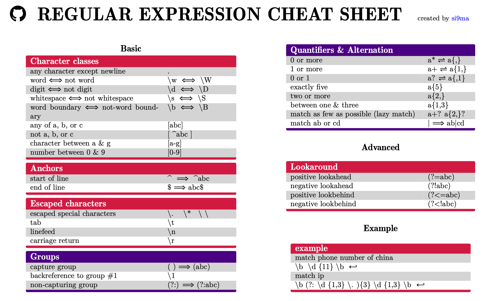

# 正则表达式（速查表）

| 符号 | 描述             | 例子   | 能匹配   | 不能匹配 |
| ---- | ---------------- | ------ | -------- | -------- |
| ^    | 行首或字符串开始 | ^yo    | yo       | ayo      |
| $    | 行末或字符串结束 | yo$    | yo       | yop      |
| \b   | 单词边界         | \byo\b | mu yo mu | muyomu   |
| \B   | 非单词边界       | \Byo\B | muyomu   | mu yo mu |

| 符号     | 描述                                                         | 例子      | 能匹配 | 不能匹配 |
| -------- | ------------------------------------------------------------ | --------- | ------ | -------- |
| (?=xxx)  | 正向肯定预查，从任何匹配xxx的字符串开始处匹配查找字符串      | yo(?=o)   | yoo    | yo       |
| (?!xxx)  | 正向否定预查，从任何不匹配pattern的字符串开始处匹配查找字符串 | yo(?!o)   | yo     | yoo      |
| (?<=xxx) | 反向肯定预查，与正向肯定预查类拟，只是方向相反               | (?<=y)o   | yo     | yoo      |
| (?<!xxx) | 反向否定预查，与正向否定预查类拟，只是方向相反               | (?<!goo)d | mood   | good     |

| 符号  | 描述                        | 例子   | 能匹配        | 不能匹配 |
| ----- | --------------------------- | ------ | ------------- | -------- |
| [ ]   | 字符集合                    | [ace]  | a, c, e       | d        |
| [ - ] | 字符范围                    | [a-c]  | a, b, c       | d        |
| [^ ]  | 不包含的字符集合            | [^abc] | d, e          | a, b, c  |
| .     | 匹配除断行外的任何字符      | yo.    | yoo, yop, yoh | yo       |
| \s    | 空白字符，等于[\n\r\f\t ]   | la\sla | la la         | lala     |
| \S    | 非空白字符，等于[^\n\r\f\t] | la\sla | lala          | la la    |
| \d    | 数字                        | \d{2}  | 23            | 1a       |
| \D    | 非数字                      | \D{3}  | yoo, abc      | yo1      |
| \w    | 单词，等于[a-z-A-Z0-9_]     | \w{4}  | v123          | v12.3    |
| \W    | 非单词，等于[^a-z-A-Z0-9_]  | .$%?   | .$%?          | .ab?     |

| 特殊字符 | 描述       |
| -------- | ---------- |
| \n       | 断行       |
| \r       | 回车符     |
| \t       | 制表符     |
| \v       | 垂直制表符 |
| \f       | 换页       |
| [\b]     | 退格       |

| 符号    | 描述                      | 例子     | 能匹配     | 不能匹配 |
| ------- | ------------------------- | -------- | ---------- | -------- |
| \|      | 或，其一                  | a\|b     | a, b       | c        |
| (xxx)   | 匹配xxx并获取这一匹配     | yo(o\|p) | yoo 或 yop | yoh      |
| (?:xxx) | 匹配xxx但不获取这一匹配   | y(?:o)   | yo         | ya       |
| +       | 重复1次或多次             | yo+      | yo, yooo   | y        |
| *       | 重复0次或多次             | yo*      | y, yoo     | yop      |
| ?       | 出现0次或1次              | yo?      | y, yo      | ye       |
| ??      | ?的懒惰模式，尽可能少匹配 | yoo??    | yo         | yoo      |
| +?      | +的懒惰模式               | yo+?     | yo         | yoo      |
| *?      | *的懒惰模式               | yo*?     | y          | yo       |
| {n}     | 重复n次                   | yo{2}    | yoo        | yooo     |
| {n,m}   | 重复n到m次                | yo{1, 3} | yo,yooo    | yoooo    |
| {n,}    | 重复至少n次               | yo{2,}   | yoo, yooo  | yo       |

# Cheat Sheet

# 正则在线验证

- [RegExr: Learn, Build, & Test RegEx](https://regexr.com/)
- [Online regex tester, debugger with highlighting for PHP, PCRE, Python, Golang and JavaScript](https://regex101.com/)
